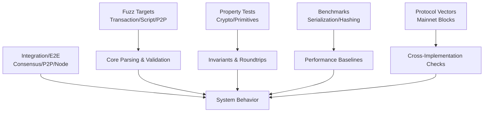
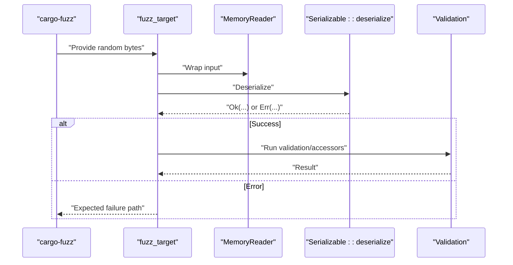
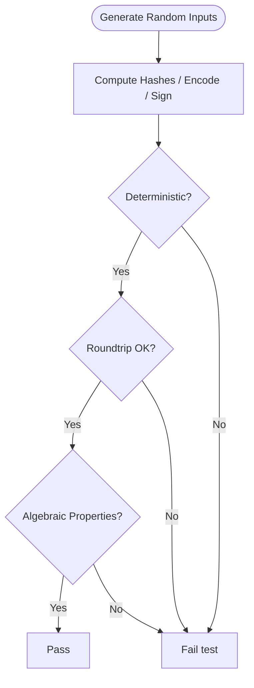
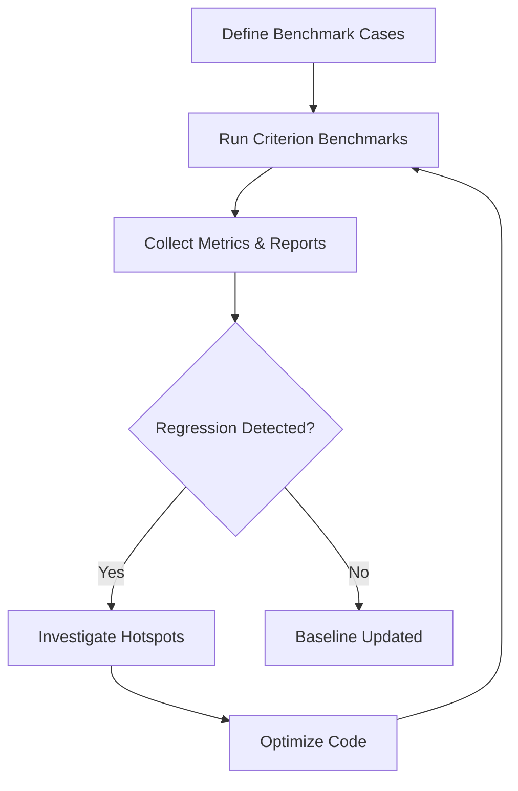
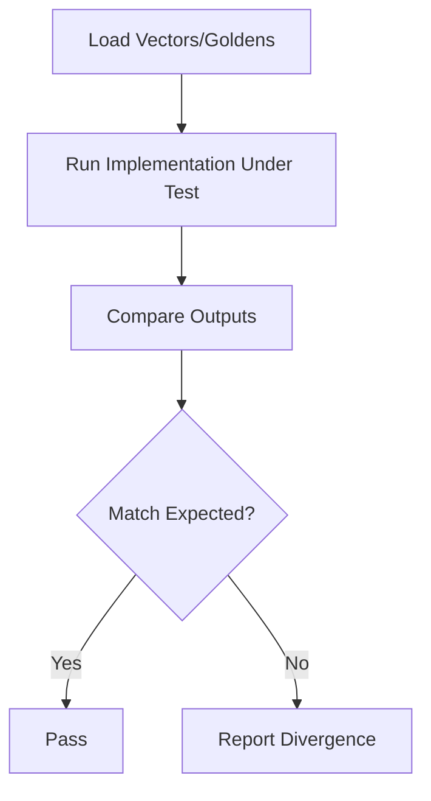
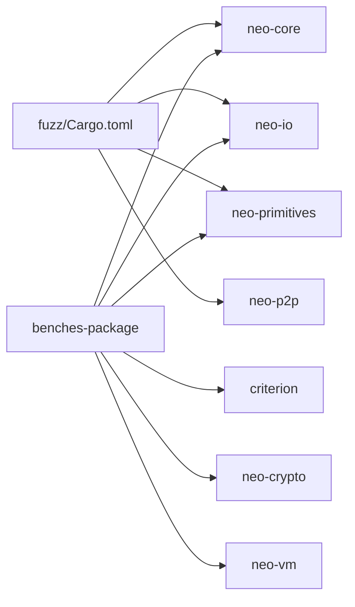

# Advanced Testing

<cite>
**Referenced Files in This Document**
- [README.md](file://fuzz/README.md)
- [Cargo.toml](file://fuzz/Cargo.toml)
- [fuzz_transaction_parse.rs](file://fuzz/fuzz_targets/fuzz_transaction_parse.rs)
- [fuzz_script_parse.rs](file://fuzz/fuzz_targets/fuzz_script_parse.rs)
- [fuzz_message_parse.rs](file://fuzz/fuzz_targets/fuzz_message_parse.rs)
- [property_tests.rs](file://neo-crypto/tests/property_tests.rs)
- [property_tests.rs](file://neo-primitives/tests/property_tests.rs)
- [block_processing.rs](file://benches-package/benches/block_processing.rs)
- [state_root.rs](file://benches-package/benches/state_root.rs)
- [test_vectors.rs](file://neo-core/tests/protocol_compliance/test_vectors.rs)
- [block_validation.rs](file://neo-core/tests/protocol_compliance/test_vectors/block_validation.rs)
- [consensus_integration_tests.rs](file://tests/tests/consensus_integration_tests.rs)
- [p2p_message_exchange.rs](file://tests/tests/p2p_message_exchange.rs)
- [end_to_end_tests.rs](file://tests/tests/end_to_end_tests.rs)
- [e2e_transaction_flow.rs](file://tests/tests/e2e_transaction_flow.rs)
- [fast_sync_p2p_e2e_tests.rs](file://tests/tests/fast_sync_p2p_e2e_tests.rs)
- [performance_regression_tests.rs](file://neo-core/tests/performance_regression_tests.rs)
- [benchmark.sh](file://scripts/profiling/benchmark.sh)
</cite>

## Table of Contents
1. Introduction
2. Project Structure
3. Core Components
4. Architecture Overview
5. Detailed Component Analysis
6. Dependency Analysis
7. Performance Considerations
8. Troubleshooting Guide
9. Conclusion
10. Appendices

## Introduction
This document provides comprehensive testing guidance for advanced scenarios in Neo-RS development. It focuses on fuzzing strategies using cargo-fuzz, property-based testing for protocol and mathematical correctness, performance regression and load/stress testing for blockchain nodes, test vectors and golden file techniques, cross-implementation compatibility, and testing strategies for consensus, P2P networking, and smart contract execution environments. It also includes examples of integration tests, end-to-end setups, and continuous testing pipelines.

## Project Structure
Neo-RS organizes advanced testing across several areas:
- Fuzzing targets under a dedicated fuzz package targeting parsing and validation hot paths.
- Property-based tests validating cryptographic and primitive invariants.
- Benchmarks measuring serialization, hashing, and VM execution primitives.
- Integration and end-to-end tests covering consensus, P2P, persistence, and full node flows.
- Protocol compliance tooling with test vectors and golden comparisons.

```mermaid
graph TB
subgraph "Fuzz"
FT["fuzz_transaction_parse.rs"]
FS["fuzz_script_parse.rs"]
FM["fuzz_message_parse.rs"]
end
subgraph "Property Tests"
PC["neo-crypto/tests/property_tests.rs"]
PP["neo-primitives/tests/property_tests.rs"]
end
subgraph "Benchmarks"
BP["benches-package/benches/block_processing.rs"]
BR["benches-package/benches/state_root.rs"]
end
subgraph "Integration & E2E"
CI["tests/tests/consensus_integration_tests.rs"]
PM["tests/tests/p2p_message_exchange.rs"]
E2E["tests/tests/end_to_end_tests.rs"]
ETF["tests/tests/e2e_transaction_flow.rs"]
FSP["tests/tests/fast_sync_p2p_e2e_tests.rs"]
end
subgraph "Protocol Compliance"
TV["neo-core/tests/protocol_compliance/test_vectors.rs"]
BV["neo-core/tests/protocol_compliance/test_vectors/block_validation.rs"]
end
FT --> |targets| "Transaction deserialization"
FS --> |targets| "Script validation"
FM --> |targets| "P2P message deserialization"
PC --> |validates| "Crypto invariants"
PP --> |validates| "Primitive invariants"
BP --> |measures| "Header/Tx serialization"
BR --> |measures| "Hashing primitives"
CI --> |exercises| "Consensus flows"
PM --> |exercises| "P2P messaging"
E2E --> |exercises| "Full node behavior"
ETF --> |exercises| "Transaction lifecycle"
FSP --> |exercises| "Fast sync + P2P"
TV --> |loads| "Vectors"
BV --> |uses| "Mainnet block vectors"
```

**Diagram sources**
- [fuzz_transaction_parse.rs:1-28](file://fuzz/fuzz_targets/fuzz_transaction_parse.rs#L1-L28)
- [fuzz_script_parse.rs:1-26](file://fuzz/fuzz_targets/fuzz_script_parse.rs#L1-L26)
- [fuzz_message_parse.rs:1-60](file://fuzz/fuzz_targets/fuzz_message_parse.rs#L1-L60)
- [property_tests.rs:1-179](file://neo-crypto/tests/property_tests.rs#L1-L179)
- [property_tests.rs:1-246](file://neo-primitives/tests/property_tests.rs#L1-L246)
- [block_processing.rs:1-117](file://benches-package/benches/block_processing.rs#L1-L117)
- [state_root.rs:1-61](file://benches-package/benches/state_root.rs#L1-L61)
- [consensus_integration_tests.rs:1-200](file://tests/tests/consensus_integration_tests.rs#L1-L200)
- [p2p_message_exchange.rs:1-200](file://tests/tests/p2p_message_exchange.rs#L1-L200)
- [end_to_end_tests.rs:1-200](file://tests/tests/end_to_end_tests.rs#L1-L200)
- [e2e_transaction_flow.rs:1-200](file://tests/tests/e2e_transaction_flow.rs#L1-L200)
- [fast_sync_p2p_e2e_tests.rs:1-200](file://tests/tests/fast_sync_p2p_e2e_tests.rs#L1-L200)
- [test_vectors.rs:1-21](file://neo-core/tests/protocol_compliance/test_vectors.rs#L1-L21)
- [block_validation.rs:45-75](file://neo-core/tests/protocol_compliance/test_vectors/block_validation.rs#L45-L75)

**Section sources**
- [README.md:1-198](file://fuzz/README.md#L1-L198)
- [Cargo.toml:1-47](file://fuzz/Cargo.toml#L1-L47)

## Core Components
- Fuzzing infrastructure: cargo-fuzz targets for transaction parsing, script validation, and P2P message deserialization to uncover crashes, panics, and resource exhaustion.
- Property-based tests: proptest suites verifying deterministic hashing, encoding roundtrips, and algebraic properties of primitives.
- Benchmarks: Criterion-based micro-benchmarks for header/transaction serialization and hashing primitives.
- Integration/E2E tests: Multi-component tests exercising consensus, P2P, persistence, and full node flows.
- Protocol compliance: Test vector loading and mainnet block vector usage for cross-implementation checks.

**Section sources**
- [fuzz_transaction_parse.rs:1-28](file://fuzz/fuzz_targets/fuzz_transaction_parse.rs#L1-L28)
- [fuzz_script_parse.rs:1-26](file://fuzz/fuzz_targets/fuzz_script_parse.rs#L1-L26)
- [fuzz_message_parse.rs:1-60](file://fuzz/fuzz_targets/fuzz_message_parse.rs#L1-L60)
- [property_tests.rs:1-179](file://neo-crypto/tests/property_tests.rs#L1-L179)
- [property_tests.rs:1-246](file://neo-primitives/tests/property_tests.rs#L1-L246)
- [block_processing.rs:1-117](file://benches-package/benches/block_processing.rs#L1-L117)
- [state_root.rs:1-61](file://benches-package/benches/state_root.rs#L1-L61)
- [test_vectors.rs:1-21](file://neo-core/tests/protocol_compliance/test_vectors.rs#L1-L21)
- [block_validation.rs:45-75](file://neo-core/tests/protocol_compliance/test_vectors/block_validation.rs#L45-L75)

## Architecture Overview
The testing architecture layers security, correctness, performance, and interoperability:
- Security: Fuzzers target untrusted inputs at the network and VM boundaries.
- Correctness: Property tests assert invariants over crypto and primitives.
- Performance: Benchmarks establish baselines and detect regressions.
- Interoperability: Integration/E2E tests validate multi-component behavior; protocol compliance uses shared vectors.



[No sources needed since this diagram shows conceptual workflow, not actual code structure]

## Detailed Component Analysis

### Fuzzing Strategy (cargo-fuzz)
- Objectives: Identify crashes, panics, and resource exhaustion in parsing and validation paths exposed to untrusted data.
- Targets:
  - Transaction deserialization: exercises memory reader and Serializable implementation to ensure robust error handling without panics.
  - Script validation: runs both relaxed and strict modes to cover opcode boundary checks and jump/try target validation.
  - P2P message deserialization: covers flags/command parsing, compression handling, payload length validation, and roundtrip serialization.
- Execution model: Each target is a no-main binary driven by libFuzzer; artifacts are saved for reproduction and minimization.



**Diagram sources**
- [fuzz_transaction_parse.rs:1-28](file://fuzz/fuzz_targets/fuzz_transaction_parse.rs#L1-L28)
- [fuzz_script_parse.rs:1-26](file://fuzz/fuzz_targets/fuzz_script_parse.rs#L1-L26)
- [fuzz_message_parse.rs:1-60](file://fuzz/fuzz_targets/fuzz_message_parse.rs#L1-L60)

**Section sources**
- [README.md:1-198](file://fuzz/README.md#L1-L198)
- [Cargo.toml:1-47](file://fuzz/Cargo.toml#L1-L47)
- [fuzz_transaction_parse.rs:1-28](file://fuzz/fuzz_targets/fuzz_transaction_parse.rs#L1-L28)
- [fuzz_script_parse.rs:1-26](file://fuzz/fuzz_targets/fuzz_script_parse.rs#L1-L26)
- [fuzz_message_parse.rs:1-60](file://fuzz/fuzz_targets/fuzz_message_parse.rs#L1-L60)

### Property-Based Testing
- Crypto invariants: Deterministic hashing across multiple algorithms; encoding roundtrips for Base58, Hex, and Base58Check; sign/verify semantics for secp256r1 and Ed25519.
- Primitive invariants: Serialization roundtrips for UInt160/UInt256 via bytes and hex; hash consistency; ordering transitivity and antisymmetry; zero detection; equality reflexivity and symmetry.
- Approach: Use proptest generators to create large randomized inputs and assert algebraic properties that must hold for all valid values.



**Diagram sources**
- [property_tests.rs:1-179](file://neo-crypto/tests/property_tests.rs#L1-L179)
- [property_tests.rs:1-246](file://neo-primitives/tests/property_tests.rs#L1-L246)

**Section sources**
- [property_tests.rs:1-179](file://neo-crypto/tests/property_tests.rs#L1-L179)
- [property_tests.rs:1-246](file://neo-primitives/tests/property_tests.rs#L1-L246)

### Performance Regression and Load/Stress Testing
- Micro-benchmarks: Header/transaction serialization and hashing measured with Criterion; groups isolate sha256/hash256/hash160 across input sizes.
- Profiling: Scripts run benchmarks with profiling enabled to produce flamegraphs for hotspot analysis.
- Load/Stress: Use integration/E2E tests to drive sustained workloads across consensus, P2P, and persistence; combine with metrics/logging to observe saturation points.



**Diagram sources**
- [block_processing.rs:1-117](file://benches-package/benches/block_processing.rs#L1-L117)
- [state_root.rs:1-61](file://benches-package/benches/state_root.rs#L1-L61)
- [benchmark.sh:1-12](file://scripts/profiling/benchmark.sh#L1-L12)

**Section sources**
- [block_processing.rs:1-117](file://benches-package/benches/block_processing.rs#L1-L117)
- [state_root.rs:1-61](file://benches-package/benches/state_root.rs#L1-L61)
- [benchmark.sh:1-12](file://scripts/profiling/benchmark.sh#L1-L12)
- [performance_regression_tests.rs:1-200](file://neo-core/tests/performance_regression_tests.rs#L1-L200)

### Test Vectors and Golden File Testing
- Vector format: JSON structures carrying name, input, and expected output for protocol operations.
- Mainnet blocks: Embedded JSON containing validated block sequences used to exercise block validation against real-world data.
- Usage: Load vectors programmatically and assert outputs match expectations; use golden files to compare serialized outputs or state roots across implementations.



**Diagram sources**
- [test_vectors.rs:1-21](file://neo-core/tests/protocol_compliance/test_vectors.rs#L1-L21)
- [block_validation.rs:45-75](file://neo-core/tests/protocol_compliance/test_vectors/block_validation.rs#L45-L75)

**Section sources**
- [test_vectors.rs:1-21](file://neo-core/tests/protocol_compliance/test_vectors.rs#L1-L21)
- [block_validation.rs:45-75](file://neo-core/tests/protocol_compliance/test_vectors/block_validation.rs#L45-L75)

### Cross-Implementation Compatibility Testing
- Objective: Ensure Neo-RS matches reference implementation behavior on protocol-critical paths.
- Method: Run shared test vectors and mainnet block sequences; compare outputs such as validation results, hashes, and state roots.
- Artifacts: Golden comparison reports and divergence logs guide fixes and regression prevention.

[No sources needed since this section doesn't analyze specific files]

### Consensus Algorithm Testing
- Focus: Validate message exchange, view changes, and finality conditions under realistic timing and network conditions.
- Techniques: Integration tests simulate multiple nodes, inject faults, and verify liveness/safety properties.

**Section sources**
- [consensus_integration_tests.rs:1-200](file://tests/tests/consensus_integration_tests.rs#L1-L200)

### P2P Networking Testing
- Focus: Message serialization/deserialization, compression handling, payload size limits, and command routing.
- Techniques: End-to-end exchanges between nodes, adversarial payloads, and stress-driven message storms.

**Section sources**
- [p2p_message_exchange.rs:1-200](file://tests/tests/p2p_message_exchange.rs#L1-L200)
- [fast_sync_p2p_e2e_tests.rs:1-200](file://tests/tests/fast_sync_p2p_e2e_tests.rs#L1-L200)

### Smart Contract Execution Environment Testing
- Focus: VM script parsing, opcode semantics, gas accounting, and native contract interactions.
- Techniques: Property tests for deterministic behavior; fuzzing scripts; integration tests executing contracts in controlled environments.

[No sources needed since this section doesn't analyze specific files]

### Integration and End-to-End Testing
- Scope: Full node startup, chain replay, RPC exposure, and user-facing workflows.
- Examples: Transaction flow from submission to confirmation; fast sync with P2P; persistence boundaries.

**Section sources**
- [end_to_end_tests.rs:1-200](file://tests/tests/end_to_end_tests.rs#L1-L200)
- [e2e_transaction_flow.rs:1-200](file://tests/tests/e2e_transaction_flow.rs#L1-L200)
- [fast_sync_p2p_e2e_tests.rs:1-200](file://tests/tests/fast_sync_p2p_e2e_tests.rs#L1-L200)

## Dependency Analysis
Testing components depend on core modules for parsing, validation, crypto, and IO. The fuzz package declares dependencies on neo-core, neo-io, neo-primitives, and neo-p2p to target relevant APIs. Benchmarks depend on criterion and core/crypto/io/primitives/VM crates.



**Diagram sources**
- [Cargo.toml:1-47](file://fuzz/Cargo.toml#L1-L47)
- [benches-package/Cargo.toml:1-31](file://benches-package/Cargo.toml#L1-L31)

**Section sources**
- [Cargo.toml:1-47](file://fuzz/Cargo.toml#L1-L47)
- [benches-package/Cargo.toml:1-31](file://benches-package/Cargo.toml#L1-L31)

## Performance Considerations
- Use Criterion benchmark groups to isolate hot paths and measure across input sizes.
- Profile with flamegraphs to identify CPU bottlenecks during benchmarks.
- Guard against regressions by integrating benchmarks into CI and comparing baselines.
- For load/stress, drive nodes with realistic transaction volumes and monitor throughput, latency, and resource usage.

[No sources needed since this section provides general guidance]

## Troubleshooting Guide
- Fuzzing crashes: Reproduce with saved artifacts; minimize inputs; debug in debug build; fix panics and enforce safe error returns.
- Property test failures: Inspect shrinking output; refine generators or assumptions; update invariants if specification changed.
- Benchmark regressions: Compare reports; profile hotspots; revert or optimize affected code; re-run to confirm improvement.
- Protocol divergence: Use mainnet block vectors to locate first divergent block; compare intermediate states; add targeted tests.

**Section sources**
- [README.md:121-178](file://fuzz/README.md#L121-L178)
- [property_tests.rs:1-179](file://neo-crypto/tests/property_tests.rs#L1-L179)
- [property_tests.rs:1-246](file://neo-primitives/tests/property_tests.rs#L1-L246)
- [benchmark.sh:1-12](file://scripts/profiling/benchmark.sh#L1-L12)
- [block_validation.rs:45-75](file://neo-core/tests/protocol_compliance/test_vectors/block_validation.rs#L45-L75)

## Conclusion
Neo-RS employs a layered testing strategy combining fuzzing, property-based verification, rigorous benchmarks, and comprehensive integration/E2E tests. Protocol compliance is enforced through shared vectors and golden comparisons. Together, these practices secure parsing and validation paths, ensure mathematical and protocol correctness, prevent performance regressions, and validate system-wide behavior under realistic loads.

## Appendices

### Fuzzing Quickstart
- Install nightly Rust and cargo-fuzz; install LLVM/Clang; run targets with release builds for speed; collect artifacts and reproduce failures.

**Section sources**
- [README.md:70-119](file://fuzz/README.md#L70-L119)

### Adding a New Fuzz Target
- Create a new target file; register it in Cargo.toml; implement the fuzz_target! macro; integrate into CI.

**Section sources**
- [README.md:179-191](file://fuzz/README.md#L179-L191)
- [Cargo.toml:21-37](file://fuzz/Cargo.toml#L21-L37)

### Running Benchmarks
- Use Criterion groups to define cases; generate HTML reports; profile with flamegraphs for deep analysis.

**Section sources**
- [block_processing.rs:1-117](file://benches-package/benches/block_processing.rs#L1-L117)
- [state_root.rs:1-61](file://benches-package/benches/state_root.rs#L1-L61)
- [benchmark.sh:1-12](file://scripts/profiling/benchmark.sh#L1-L12)

### Protocol Compliance Workflow
- Load mainnet block vectors; run validation; compare outputs; capture divergences; add regression tests.

**Section sources**
- [test_vectors.rs:1-21](file://neo-core/tests/protocol_compliance/test_vectors.rs#L1-L21)
- [block_validation.rs:45-75](file://neo-core/tests/protocol_compliance/test_vectors/block_validation.rs#L45-L75)