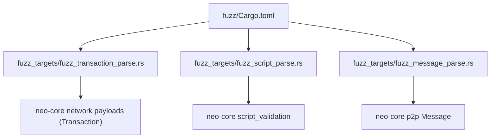
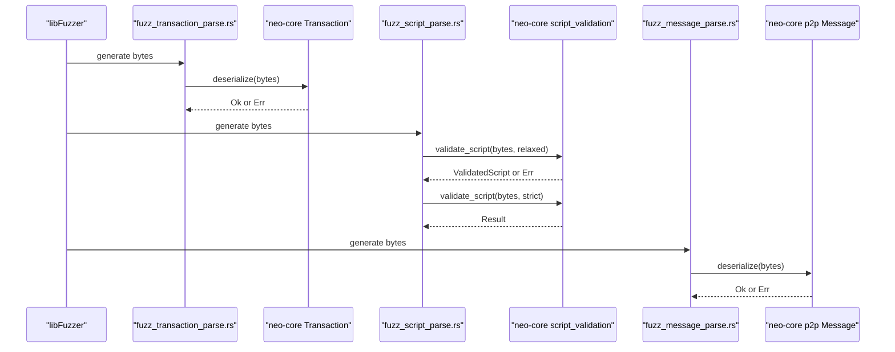
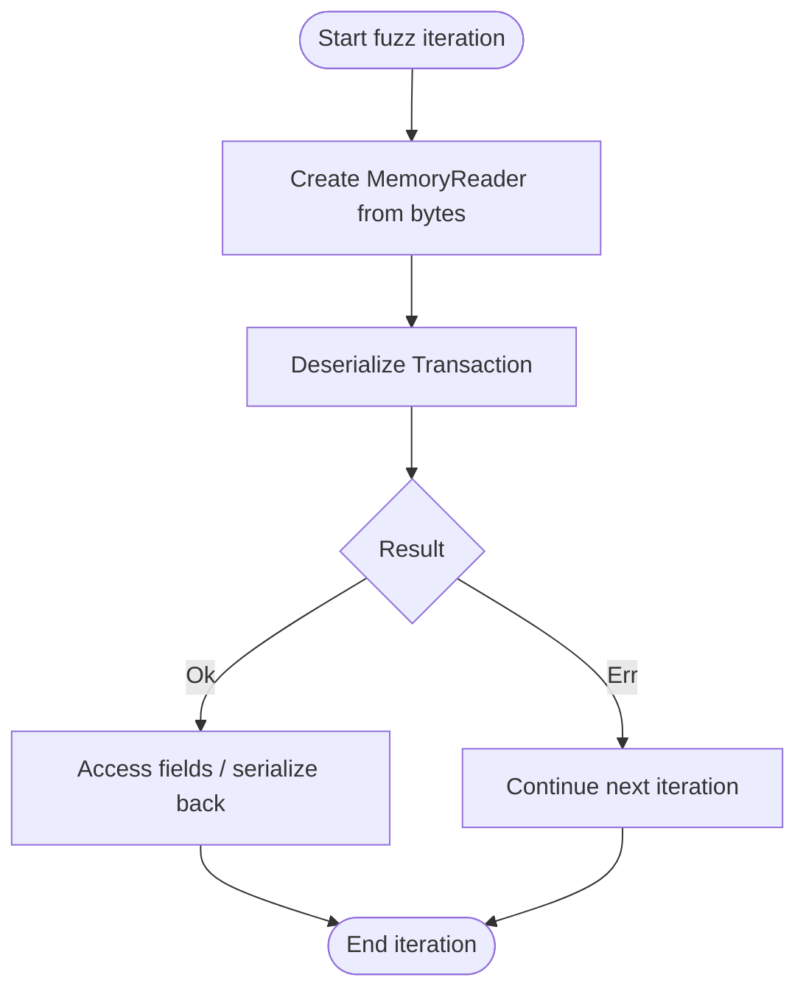
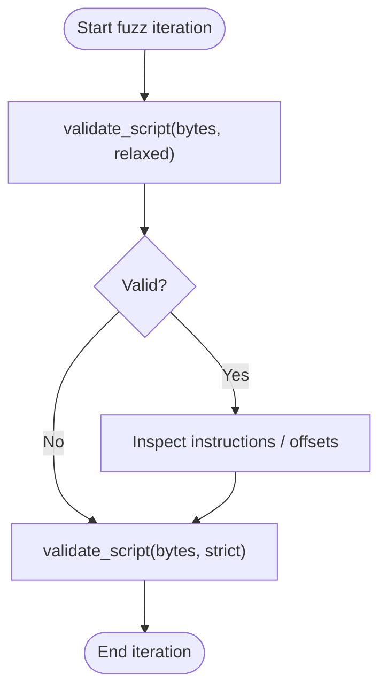
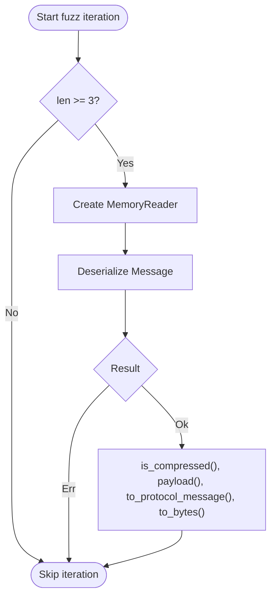
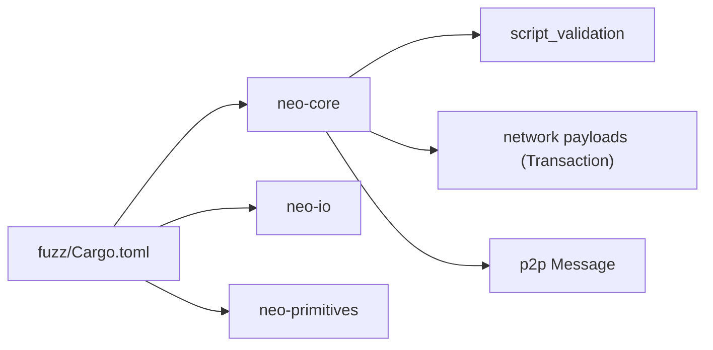

# Fuzzing Strategies

<cite>
**Referenced Files in This Document**
- [Cargo.toml](file://fuzz/Cargo.toml)
- [README.md](file://fuzz/README.md)
- [fuzz_message_parse.rs](file://fuzz/fuzz_targets/fuzz_message_parse.rs)
- [fuzz_script_parse.rs](file://fuzz/fuzz_targets/fuzz_script_parse.rs)
- [fuzz_transaction_parse.rs](file://fuzz/fuzz_targets/fuzz_transaction_parse.rs)
- [script_validation.rs](file://neo-core/src/script_validation.rs)
</cite>

## Table of Contents
1. Introduction
2. Project Structure
3. Core Components
4. Architecture Overview
5. Detailed Component Analysis
6. Dependency Analysis
7. Performance Considerations
8. Troubleshooting Guide
9. Conclusion
10. Appendices

## Introduction
This document provides comprehensive fuzzing guidance for the Neo-RS blockchain node, focusing on cargo-fuzz setup and configuration for testing parsing code, cryptographic operations, and protocol messages. It explains how to create custom fuzz targets for message parsing, script parsing, and transaction parsing; outlines strategies to identify vulnerabilities such as input validation failures, buffer overflows, and edge cases; and includes best practices for running fuzzers efficiently, interpreting results, reproducing issues, and writing effective fuzz tests that cover critical security boundaries and protocol compliance.

## Project Structure
The fuzzing infrastructure is implemented under the fuzz workspace with three primary fuzz targets:
- Transaction parsing
- Script parsing
- P2P message parsing

Each target is a separate binary defined in the fuzz Cargo manifest and implemented in dedicated files under fuzz_targets. The targets exercise core parsing and validation logic in neo-core and related crates.

**Diagram sources**
- [Cargo.toml:21-37](file://fuzz/Cargo.toml#L21-L37)
- [fuzz_transaction_parse.rs:16-27](file://fuzz/fuzz_targets/fuzz_transaction_parse.rs#L16-L27)
- [fuzz_script_parse.rs:17-25](file://fuzz/fuzz_targets/fuzz_script_parse.rs#L17-L25)
- [fuzz_message_parse.rs:19-59](file://fuzz/fuzz_targets/fuzz_message_parse.rs#L19-L59)

**Section sources**
- [Cargo.toml:1-47](file://fuzz/Cargo.toml#L1-L47)
- [README.md:14-68](file://fuzz/README.md#L14-L68)

## Core Components
- Transaction parsing fuzzer: Deserializes raw bytes into a Transaction object using a memory reader and validates robustness against malformed inputs.
- Script parsing fuzzer: Exercises both relaxed and strict script validation paths to uncover invalid opcode sequences, out-of-bounds jumps, and resource exhaustion scenarios.
- P2P message parsing fuzzer: Deserializes P2P messages, including header parsing, compression handling, payload length checks, and command type validation.

These components are selected because they represent high-risk attack surfaces where malformed inputs can lead to crashes, denial-of-service, or memory safety issues.

**Section sources**
- [fuzz_transaction_parse.rs:16-27](file://fuzz/fuzz_targets/fuzz_transaction_parse.rs#L16-L27)
- [fuzz_script_parse.rs:17-25](file://fuzz/fuzz_targets/fuzz_script_parse.rs#L17-L25)
- [fuzz_message_parse.rs:19-59](file://fuzz/fuzz_targets/fuzz_message_parse.rs#L19-L59)
- [script_validation.rs:1-79](file://neo-core/src/script_validation.rs#L1-L79)

## Architecture Overview
The fuzzing architecture centers on libFuzzer-driven binaries that feed arbitrary byte sequences into targeted parsing and validation functions. Each target isolates a specific boundary:
- Transaction deserialization boundary
- Script validation boundary
- P2P message deserialization boundary

**Diagram sources**
- [fuzz_transaction_parse.rs:16-27](file://fuzz/fuzz_targets/fuzz_transaction_parse.rs#L16-L27)
- [fuzz_script_parse.rs:17-25](file://fuzz/fuzz_targets/fuzz_script_parse.rs#L17-L25)
- [fuzz_message_parse.rs:19-59](file://fuzz/fuzz_targets/fuzz_message_parse.rs#L19-L59)
- [script_validation.rs:1-79](file://neo-core/src/script_validation.rs#L1-L79)

## Detailed Component Analysis

### Transaction Parsing Fuzzer
Purpose:
- Exercise transaction deserialization from raw bytes to detect panics, integer overflows in fee calculations, malformed signer/witness data, and resource exhaustion via oversized fields.

Key behaviors:
- Uses a MemoryReader to wrap fuzzed input.
- Calls Transaction::deserialize and expects either success or error without panicking.

**Diagram sources**
- [fuzz_transaction_parse.rs:16-27](file://fuzz/fuzz_targets/fuzz_transaction_parse.rs#L16-L27)

Best practices:
- Ensure all fields are accessed safely after successful parse to trigger internal validations.
- Include edge cases like zero-length payloads, truncated fields, and extreme sizes.

**Section sources**
- [fuzz_transaction_parse.rs:16-27](file://fuzz/fuzz_targets/fuzz_transaction_parse.rs#L16-L27)

### Script Parsing Fuzzer
Purpose:
- Validate VM scripts under both relaxed and strict modes to uncover invalid opcode sequences, out-of-bounds jump targets, instruction boundary errors, and stack/resource exhaustion.

Key behaviors:
- Calls validate_script with relaxed mode first, then strict mode.
- Checks instruction metadata access to ensure parsed structures are usable.

**Diagram sources**
- [fuzz_script_parse.rs:17-25](file://fuzz/fuzz_targets/fuzz_script_parse.rs#L17-L25)
- [script_validation.rs:1-79](file://neo-core/src/script_validation.rs#L1-L79)

Best practices:
- Cover unknown opcodes, truncated pushdata, invalid jump targets, and type operand misuse.
- Use both relaxed and strict modes to maximize coverage across validation paths.

**Section sources**
- [fuzz_script_parse.rs:17-25](file://fuzz/fuzz_targets/fuzz_script_parse.rs#L17-L25)
- [script_validation.rs:1-79](file://neo-core/src/script_validation.rs#L1-L79)

### P2P Message Parsing Fuzzer
Purpose:
- Test P2P message deserialization to find malformed headers, invalid compression (LZ4), payload size attacks causing OOM, and invalid command types.

Key behaviors:
- Skips extremely short inputs that cannot form a valid header.
- Deserializes Message and exercises compression flags, payload access, conversion to protocol message, and serialization back to bytes.

**Diagram sources**
- [fuzz_message_parse.rs:19-59](file://fuzz/fuzz_targets/fuzz_message_parse.rs#L19-L59)

Best practices:
- Stress compression/decompression paths with malformed LZ4 streams.
- Push payload lengths to extremes to test memory limits and bounds checking.
- Include invalid command types to verify graceful handling.

**Section sources**
- [fuzz_message_parse.rs:19-59](file://fuzz/fuzz_targets/fuzz_message_parse.rs#L19-L59)

## Dependency Analysis
The fuzz workspace depends on core parsing and validation modules:
- neo-core for Transaction, Message, and script validation
- neo-io for low-level IO primitives used by parsers
- neo-primitives for foundational types

**Diagram sources**
- [Cargo.toml:13-18](file://fuzz/Cargo.toml#L13-L18)
- [script_validation.rs:1-7](file://neo-core/src/script_validation.rs#L1-L7)

**Section sources**
- [Cargo.toml:13-18](file://fuzz/Cargo.toml#L13-L18)
- [script_validation.rs:1-7](file://neo-core/src/script_validation.rs#L1-L7)

## Performance Considerations
- Prefer release builds for faster fuzzing while retaining debug symbols for crash analysis.
- Use multiple workers to parallelize fuzzing runs.
- Set reasonable max_len and rss_limit_mb to avoid excessive memory usage.
- Maintain a curated corpus to guide exploration toward interesting inputs.

[No sources needed since this section provides general guidance]

## Troubleshooting Guide
When a crash is found:
- Reproduce using the saved artifact path under fuzz/artifacts/<target>/<crash-hash>.
- Run the fuzzer directly with the artifact to confirm reproducibility.
- Build in debug mode and use a debugger to inspect the crash site.
- Minimize the crash input using cargo fuzz tmin to produce a minimal reproducer.

Security considerations:
- Do not commit crash artifacts to the repository.
- Follow the project’s security policy for reporting sensitive issues.

**Section sources**
- [README.md:121-149](file://fuzz/README.md#L121-L149)

## Conclusion
The Neo-RS fuzzing infrastructure provides focused coverage over critical parsing and validation boundaries: transactions, scripts, and P2P messages. By following the outlined strategies—using both relaxed and strict validation modes, stressing compression and payload sizes, and leveraging corpus-driven exploration—you can effectively discover and reproduce vulnerabilities related to input validation, buffer overflows, and edge cases. Adhering to best practices ensures efficient fuzzing and robust security hardening of the node.

[No sources needed since this section summarizes without analyzing specific files]

## Appendices

### Creating Custom Fuzz Targets
To add a new target:
- Create a new file under fuzz/fuzz_targets/<target_name>.rs implementing a fuzz_target! macro entry point.
- Register the binary in fuzz/Cargo.toml with name and path entries.
- Optionally add CI jobs to run the new target automatically.

**Section sources**
- [README.md:179-191](file://fuzz/README.md#L179-L191)
- [Cargo.toml:21-37](file://fuzz/Cargo.toml#L21-L37)

### Running Fuzzers Efficiently
- Quick smoke tests: set -max_total_time to limit duration per target.
- Parallel fuzzing: increase -workers for multi-core utilization.
- Seed-based runs: use -seed to reproduce specific explorations.
- Memory constraints: apply -max_len and -rss_limit_mb to control resource usage.

**Section sources**
- [README.md:91-119](file://fuzz/README.md#L91-L119)

### Interpreting Results and Reproducing Issues
- Crashes are stored in fuzz/artifacts/<target>/<crash-hash>.
- Re-run the fuzzer with the artifact to reproduce.
- Use cargo fuzz build and a debugger for detailed inspection.
- Minimize inputs with cargo fuzz tmin to isolate root causes.

**Section sources**
- [README.md:121-149](file://fuzz/README.md#L121-L149)