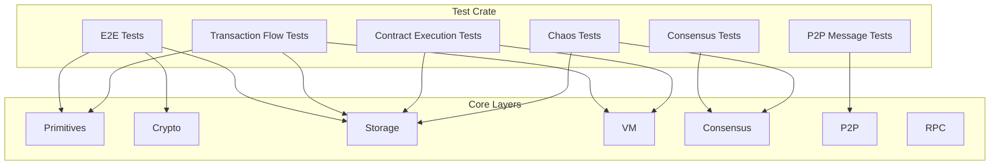
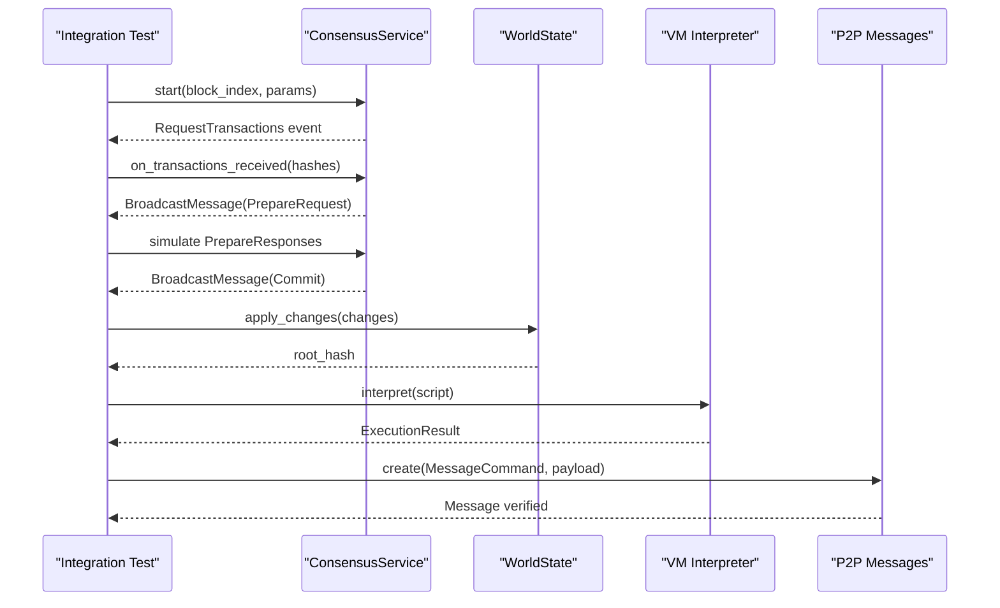
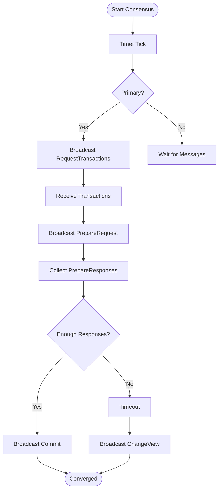
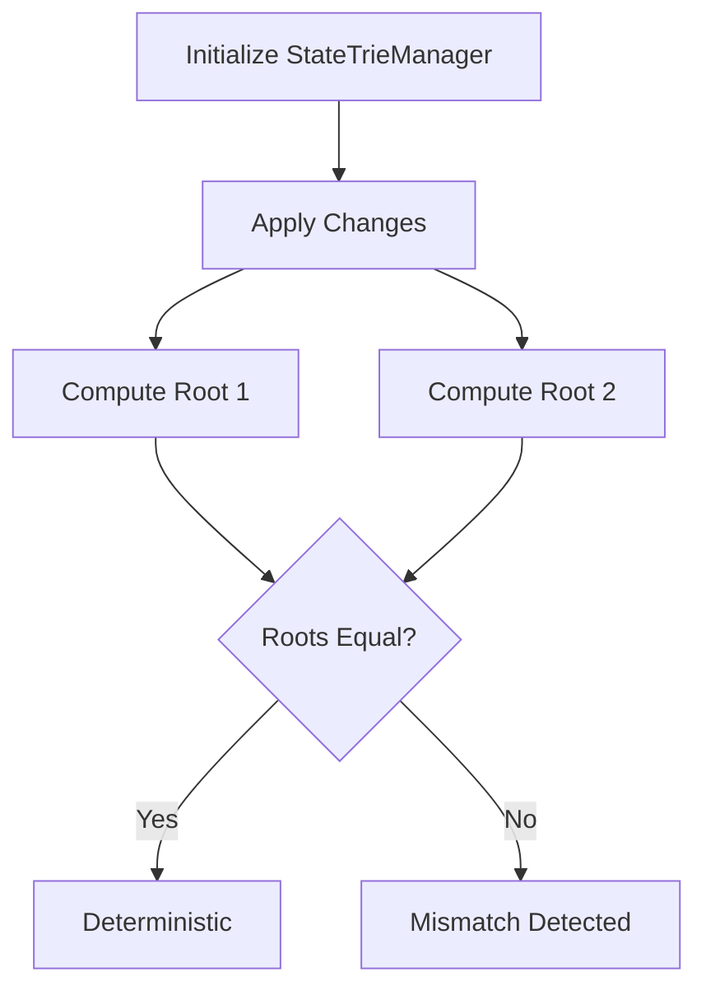
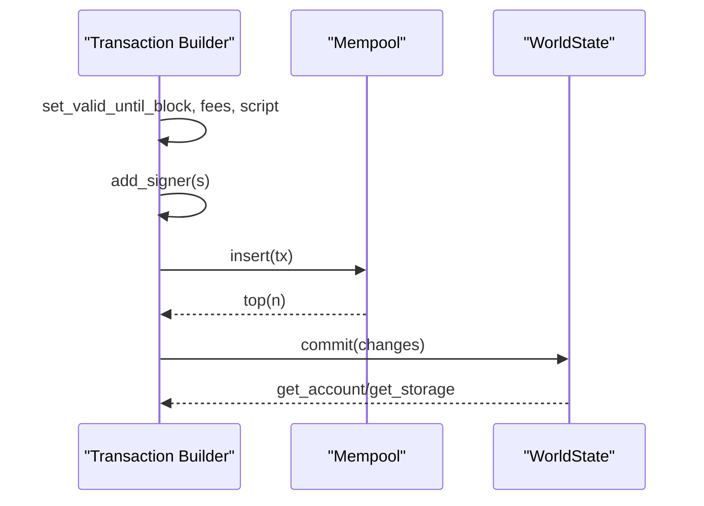
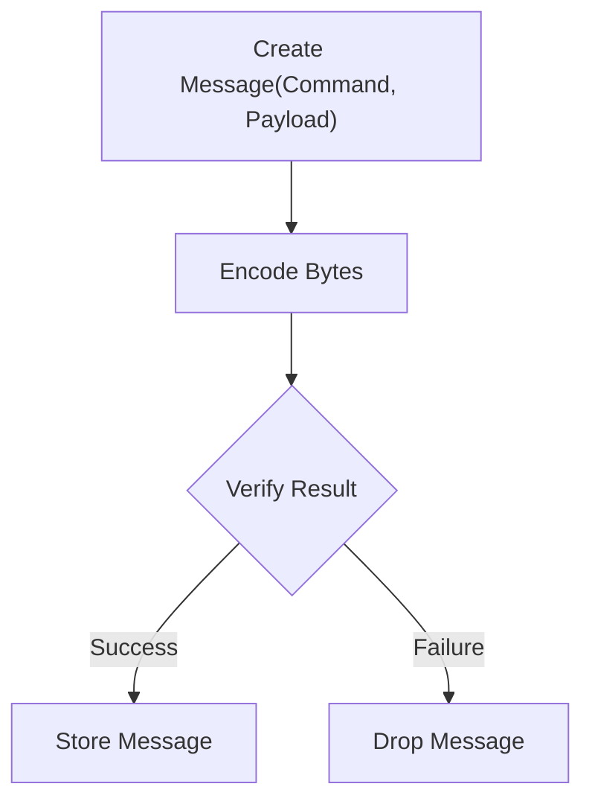
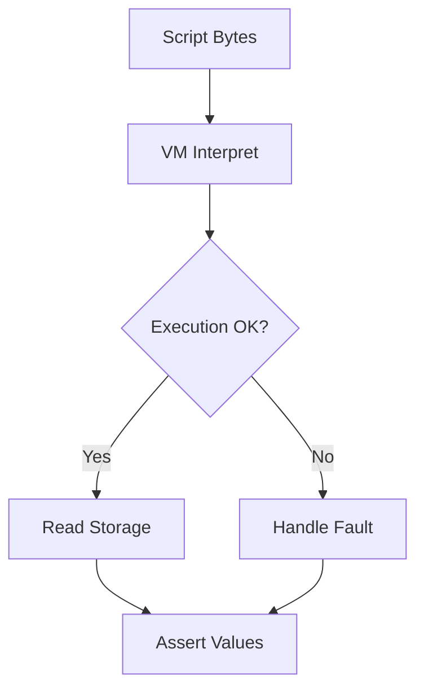
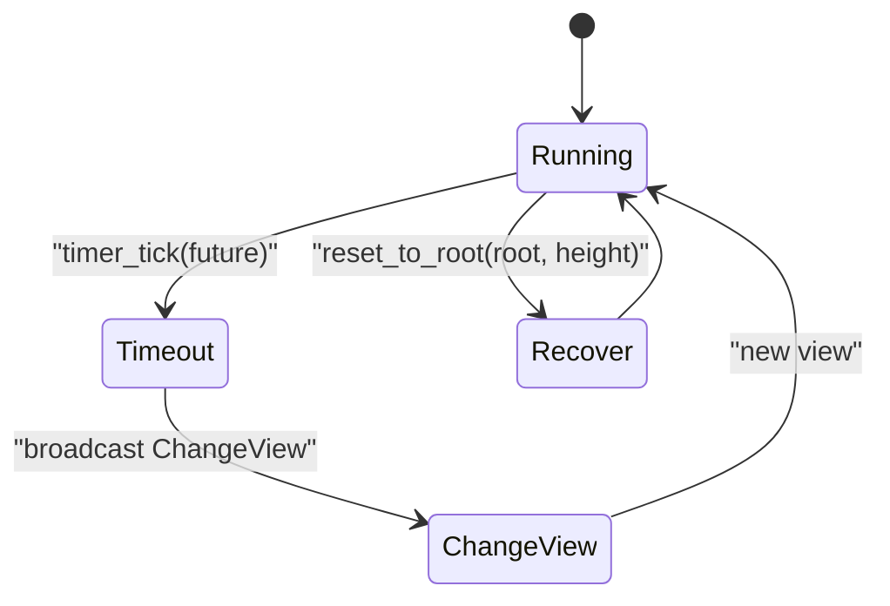
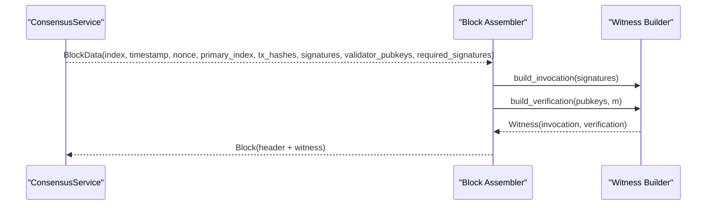
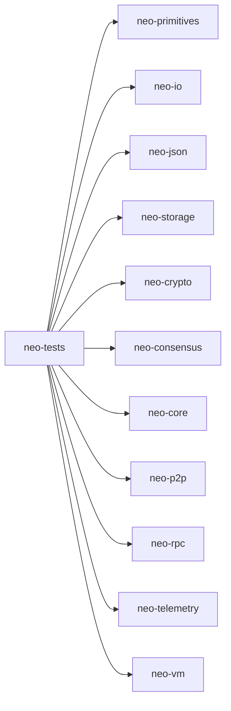

# Integration Testing

<cite>
**Referenced Files in This Document**
- [Cargo.toml](file://tests/Cargo.toml)
- [consensus_integration_tests.rs](file://tests/tests/consensus_integration_tests.rs)
- [end_to_end_tests.rs](file://tests/tests/end_to_end_tests.rs)
- [e2e_transaction_flow.rs](file://tests/tests/e2e_transaction_flow.rs)
- [p2p_message_exchange.rs](file://tests/tests/p2p_message_exchange.rs)
- [contract_execution.rs](file://tests/tests/contract_execution.rs)
- [chaos_tests.rs](file://tests/tests/chaos_tests.rs)
- [block_assembly_test.rs](file://neo-node/tests/block_assembly_test.rs)
- [chain-vectors.json](file://vectors/vm/chain-vectors.json)
- [protocol-consistency-test.sh](file://scripts/protocol-consistency-test.sh)
- [docker-compose.yml](file://docker-compose.yml)
</cite>

## Table of Contents
1. Introduction
2. Project Structure
3. Core Components
4. Architecture Overview
5. Detailed Component Analysis
6. Dependency Analysis
7. Performance Considerations
8. Troubleshooting Guide
9. Conclusion
10. Appendices

## Introduction
This document provides comprehensive integration testing guidance for the Neo-RS blockchain node. It focuses on multi-component interactions across consensus, P2P networking, and smart contract execution environments. It also covers end-to-end workflows from transaction submission to block confirmation, strategies for creating test vectors and golden file testing, cross-implementation compatibility against reference implementations, distributed systems testing (network partitions, validator failures, consensus convergence), isolated test networks, and automation of integration suites.

## Project Structure
The integration tests are organized under a dedicated test crate that composes core layers (primitives, storage, crypto, consensus, p2p, vm, rpc, telemetry). The structure includes:
- Consensus integration tests validating dBFT message flows, view changes, and recovery.
- End-to-end tests covering state root determinism, crypto integration, and concurrent state commits.
- Transaction flow tests exercising mempool, world state, and fee calculations.
- P2P message exchange tests verifying protocol messages and flags.
- Smart contract execution tests using the VM interpreter and world state.
- Chaos tests simulating timeouts, recovery, corruption detection, and concurrency stress.
- Block assembly tests bridging consensus outputs into blocks with witnesses.
- Golden vector datasets for VM script verification and invocation.
- Scripts for protocol consistency checks via RPC.
- Docker Compose configuration for isolated test networks and monitoring.

**Section sources**
- [Cargo.toml:1-88](file://tests/Cargo.toml#L1-L88)

## Core Components
- Consensus service lifecycle and message handling: creation, start, primary calculation, message validation, prepare/commit phases, view change, and recovery messages.
- End-to-end state operations: deterministic state roots, order independence, concurrent commits, and performance sanity checks.
- Transaction processing: creation, serialization roundtrip, fees, attributes, multiple signers, and mempool basics.
- P2P messaging: ping/pong, command byte conversion, flags, and concurrent message creation.
- Contract execution: VM arithmetic, storage CRUD, gas consumption, error paths (stack underflow, invalid opcode), and large-scale storage scenarios.
- Chaos and resilience: timeout-triggered view changes, recovery from roots, mismatch detection, missing changes detection, and concurrent modifications.
- Block assembly: constructing blocks from consensus data with witness scripts and multi-signature verification logic.

**Section sources**
- [consensus_integration_tests.rs:1-501](file://tests/tests/consensus_integration_tests.rs#L1-L501)
- [end_to_end_tests.rs:1-177](file://tests/tests/end_to_end_tests.rs#L1-L177)
- [e2e_transaction_flow.rs:1-284](file://tests/tests/e2e_transaction_flow.rs#L1-L284)
- [p2p_message_exchange.rs:1-129](file://tests/tests/p2p_message_exchange.rs#L1-L129)
- [contract_execution.rs:1-212](file://tests/tests/contract_execution.rs#L1-L212)
- [chaos_tests.rs:1-235](file://tests/tests/chaos_tests.rs#L1-L235)
- [block_assembly_test.rs:1-114](file://neo-node/tests/block_assembly_test.rs#L1-L114)

## Architecture Overview
The integration suite exercises the full stack by orchestrating components through in-process services and shared state abstractions:
- Consensus service emits events (request transactions, broadcast messages) which drive proposal and commit phases.
- World state and storage provide deterministic state transitions and root computation used by E2E and chaos tests.
- VM interpreter executes scripts and interacts with world state for contract storage operations.
- P2P layer validates message formats and flags ensuring protocol compliance.
- Docker Compose enables isolated networks with health checks and optional monitoring.

**Diagram sources**
- [consensus_integration_tests.rs:184-242](file://tests/tests/consensus_integration_tests.rs#L184-L242)
- [end_to_end_tests.rs:20-63](file://tests/tests/end_to_end_tests.rs#L20-L63)
- [contract_execution.rs:20-42](file://tests/tests/contract_execution.rs#L20-L42)
- [p2p_message_exchange.rs:12-33](file://tests/tests/p2p_message_exchange.rs#L12-L33)

## Detailed Component Analysis

### Consensus Integration Tests
- Service lifecycle: creation, start, validator count, primary calculation, non-validator rejection.
- Message processing: wrong block index rejection, off-view ignore without state pollution, non-primary PrepareRequest rejection.
- Block proposal flow: primary requests transactions after timer tick; receiving transactions triggers PrepareRequest broadcast.
- View change: timeout triggers ChangeView broadcast; multiple timeouts increment view safely.
- Recovery messages: creation and serialization roundtrip.
- Payloads: deterministic message bytes layout and type distinctness.
- Edge cases: empty transaction list handling, single-validator network behavior, message type variants.

**Diagram sources**
- [consensus_integration_tests.rs:184-242](file://tests/tests/consensus_integration_tests.rs#L184-L242)
- [consensus_integration_tests.rs:248-269](file://tests/tests/consensus_integration_tests.rs#L248-L269)

**Section sources**
- [consensus_integration_tests.rs:57-110](file://tests/tests/consensus_integration_tests.rs#L57-L110)
- [consensus_integration_tests.rs:116-178](file://tests/tests/consensus_integration_tests.rs#L116-L178)
- [consensus_integration_tests.rs:184-242](file://tests/tests/consensus_integration_tests.rs#L184-L242)
- [consensus_integration_tests.rs:248-301](file://tests/tests/consensus_integration_tests.rs#L248-L301)
- [consensus_integration_tests.rs:307-353](file://tests/tests/consensus_integration_tests.rs#L307-L353)
- [consensus_integration_tests.rs:359-370](file://tests/tests/consensus_integration_tests.rs#L359-L370)
- [consensus_integration_tests.rs:376-432](file://tests/tests/consensus_integration_tests.rs#L376-L432)
- [consensus_integration_tests.rs:438-500](file://tests/tests/consensus_integration_tests.rs#L438-L500)

### End-to-End Tests
- Deterministic state root calculation across identical changes.
- Order independence of storage updates.
- Different values produce different roots.
- Crypto integration: block hash and merkle root calculations.
- Concurrent state commits using async runtime primitives.
- Performance sanity: applying 1000 keys within time bounds.

**Diagram sources**
- [end_to_end_tests.rs:20-63](file://tests/tests/end_to_end_tests.rs#L20-L63)

**Section sources**
- [end_to_end_tests.rs:20-89](file://tests/tests/end_to_end_tests.rs#L20-L89)
- [end_to_end_tests.rs:95-118](file://tests/tests/end_to_end_tests.rs#L95-L118)
- [end_to_end_tests.rs:124-177](file://tests/tests/end_to_end_tests.rs#L124-L177)

### Transaction Flow Tests
- Basic transaction creation and field assertions.
- Unique hashes for differing inputs.
- Serialization roundtrip preserving hash and fields.
- Fee calculations and total fee composition.
- Mempool basic operations and configuration.
- World state account and storage updates.
- Concurrent transaction processing simulation.
- Attributes and multi-signer support.
- Edge cases: empty transactions and far-future validity.

**Diagram sources**
- [e2e_transaction_flow.rs:39-114](file://tests/tests/e2e_transaction_flow.rs#L39-L114)
- [e2e_transaction_flow.rs:116-182](file://tests/tests/e2e_transaction_flow.rs#L116-L182)
- [e2e_transaction_flow.rs:184-284](file://tests/tests/e2e_transaction_flow.rs#L184-L284)

**Section sources**
- [e2e_transaction_flow.rs:39-114](file://tests/tests/e2e_transaction_flow.rs#L39-L114)
- [e2e_transaction_flow.rs:116-182](file://tests/tests/e2e_transaction_flow.rs#L116-L182)
- [e2e_transaction_flow.rs:184-284](file://tests/tests/e2e_transaction_flow.rs#L184-L284)

### P2P Message Exchange Tests
- Ping/Pong message creation and command identification.
- Command byte conversion roundtrip for all supported commands.
- Flags compression detection.
- VerifyResult variant roundtrip.
- Concurrent message creation safety.

**Diagram sources**
- [p2p_message_exchange.rs:12-33](file://tests/tests/p2p_message_exchange.rs#L12-L33)
- [p2p_message_exchange.rs:35-64](file://tests/tests/p2p_message_exchange.rs#L35-L64)
- [p2p_message_exchange.rs:66-95](file://tests/tests/p2p_message_exchange.rs#L66-L95)
- [p2p_message_exchange.rs:97-129](file://tests/tests/p2p_message_exchange.rs#L97-L129)

**Section sources**
- [p2p_message_exchange.rs:12-33](file://tests/tests/p2p_message_exchange.rs#L12-L33)
- [p2p_message_exchange.rs:35-64](file://tests/tests/p2p_message_exchange.rs#L35-L64)
- [p2p_message_exchange.rs:66-95](file://tests/tests/p2p_message_exchange.rs#L66-L95)
- [p2p_message_exchange.rs:97-129](file://tests/tests/p2p_message_exchange.rs#L97-L129)

### Smart Contract Execution Tests
- VM simple push and return, arithmetic operations (add, sub, mul).
- Storage CRUD: insert, update, delete, large values, many keys.
- Gas consumption baseline and fault paths (stack underflow, invalid opcode).
- State consistency across multiple keys.

**Diagram sources**
- [contract_execution.rs:20-70](file://tests/tests/contract_execution.rs#L20-L70)
- [contract_execution.rs:72-127](file://tests/tests/contract_execution.rs#L72-L127)
- [contract_execution.rs:129-153](file://tests/tests/contract_execution.rs#L129-L153)
- [contract_execution.rs:155-212](file://tests/tests/contract_execution.rs#L155-L212)

**Section sources**
- [contract_execution.rs:20-70](file://tests/tests/contract_execution.rs#L20-L70)
- [contract_execution.rs:72-127](file://tests/tests/contract_execution.rs#L72-L127)
- [contract_execution.rs:129-153](file://tests/tests/contract_execution.rs#L129-L153)
- [contract_execution.rs:155-212](file://tests/tests/contract_execution.rs#L155-L212)

### Chaos and Resilience Tests
- Timeout-triggered view changes and incremental view increments.
- Recovery from previous state roots.
- State root mismatch detection and missing changes detection.
- Concurrent state modifications stress test.
- Large-scale storage performance across many contracts.

**Diagram sources**
- [chaos_tests.rs:38-79](file://tests/tests/chaos_tests.rs#L38-L79)
- [chaos_tests.rs:85-107](file://tests/tests/chaos_tests.rs#L85-L107)
- [chaos_tests.rs:113-166](file://tests/tests/chaos_tests.rs#L113-L166)
- [chaos_tests.rs:172-235](file://tests/tests/chaos_tests.rs#L172-L235)

**Section sources**
- [chaos_tests.rs:38-79](file://tests/tests/chaos_tests.rs#L38-L79)
- [chaos_tests.rs:85-107](file://tests/tests/chaos_tests.rs#L85-L107)
- [chaos_tests.rs:113-166](file://tests/tests/chaos_tests.rs#L113-L166)
- [chaos_tests.rs:172-235](file://tests/tests/chaos_tests.rs#L172-L235)

### Block Assembly Tests
- Constructing blocks from consensus BlockData with signatures and validator pubkeys.
- Building invocation and verification scripts for multi-signature witnesses.
- Verifying block header fields and witness sizes.

**Diagram sources**
- [block_assembly_test.rs:8-68](file://neo-node/tests/block_assembly_test.rs#L8-L68)
- [block_assembly_test.rs:70-114](file://neo-node/tests/block_assembly_test.rs#L70-L114)

**Section sources**
- [block_assembly_test.rs:8-68](file://neo-node/tests/block_assembly_test.rs#L8-L68)
- [block_assembly_test.rs:70-114](file://neo-node/tests/block_assembly_test.rs#L70-L114)

## Dependency Analysis
The integration test crate composes multiple workspace crates to exercise layer boundaries and end-to-end flows. Dependencies include foundational layers (primitives, io, json, storage), crypto, protocol (consensus, core, p2p), services (rpc, telemetry, vm), and utilities (tokio, tracing, serde_json, tempfile).

**Diagram sources**
- [Cargo.toml:12-39](file://tests/Cargo.toml#L12-L39)

**Section sources**
- [Cargo.toml:12-39](file://tests/Cargo.toml#L12-L39)

## Performance Considerations
- Use memory-backed world state for fast iteration in tests while asserting correctness and determinism.
- Cap key counts and batch updates to maintain test execution times within acceptable limits.
- Leverage concurrent writes with appropriate synchronization primitives to validate thread-safety.
- Monitor VM execution paths for faults and ensure minimal overhead in assertion-heavy tests.
- For larger datasets, prefer sampling or randomized subsets to keep CI durations reasonable.

[No sources needed since this section provides general guidance]

## Troubleshooting Guide
- Consensus timeouts and view changes: verify timer ticks and event emission; ensure ChangeView is broadcast when timeouts occur.
- State divergence: compare state roots across independent runs; detect missing or extra changes; reset to known good roots for recovery.
- P2P message issues: confirm command byte conversions and flag semantics; validate message creation under concurrency.
- VM errors: handle stack underflows and invalid opcodes; assert expected fault messages and states.
- Dockerized tests: use health checks and logs to diagnose startup issues; adjust ports and environment variables for isolation.

**Section sources**
- [chaos_tests.rs:38-79](file://tests/tests/chaos_tests.rs#L38-L79)
- [chaos_tests.rs:113-166](file://tests/tests/chaos_tests.rs#L113-L166)
- [p2p_message_exchange.rs:35-64](file://tests/tests/p2p_message_exchange.rs#L35-L64)
- [contract_execution.rs:129-153](file://tests/tests/contract_execution.rs#L129-L153)
- [docker-compose.yml:52-64](file://docker-compose.yml#L52-L64)

## Conclusion
The Neo-RS integration test suite provides robust coverage across consensus, networking, VM execution, and state management. By combining deterministic state roots, realistic message flows, and chaos scenarios, it ensures correctness, resilience, and performance. Golden vectors and protocol consistency scripts enable cross-implementation validation and continuous assurance against reference implementations.

[No sources needed since this section summarizes without analyzing specific files]

## Appendices

### Creating Test Vectors and Golden File Testing
- Use existing chain vectors to drive VM script verification and invocation tests.
- Generate additional vectors for new features or edge cases, capturing both verification and invocation scripts.
- Compare outputs against golden files to detect regressions and ensure protocol stability.

**Section sources**
- [chain-vectors.json:1-200](file://vectors/vm/chain-vectors.json#L1-L200)

### Cross-Implementation Compatibility Testing
- Run protocol consistency checks via RPC to compare block hashes, network info, state roots, and connection health.
- Automate periodic comparisons to catch divergences early in development cycles.

**Section sources**
- [protocol-consistency-test.sh:1-43](file://scripts/protocol-consistency-test.sh#L1-L43)

### Setting Up Isolated Test Networks
- Use Docker Compose to spin up an isolated node with persistent volumes, health checks, and optional monitoring (Prometheus/Grafana).
- Configure environment variables for network selection, storage backend, plugins, and ports.
- Validate node readiness via health checks and RPC endpoints.

**Section sources**
- [docker-compose.yml:1-183](file://docker-compose.yml#L1-L183)

### Automating Integration Test Suites
- Organize tests by feature area (consensus, e2e, transaction flow, p2p, contract execution, chaos).
- Use Cargo test harnesses to run suites in parallel where safe; isolate long-running or flaky tests.
- Integrate with CI pipelines to execute full suites and report results; capture artifacts for golden comparisons.

**Section sources**
- [Cargo.toml:44-88](file://tests/Cargo.toml#L44-L88)