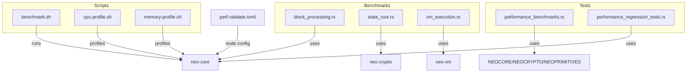
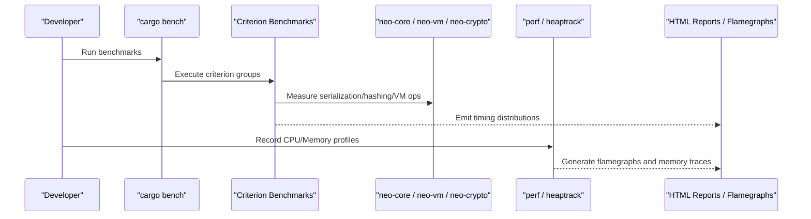
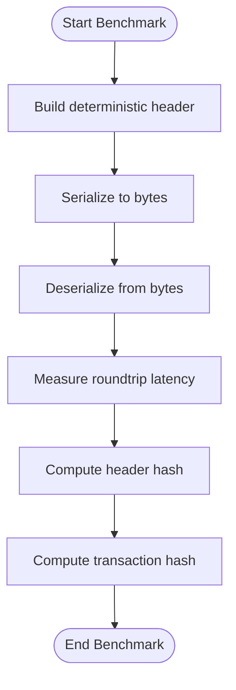
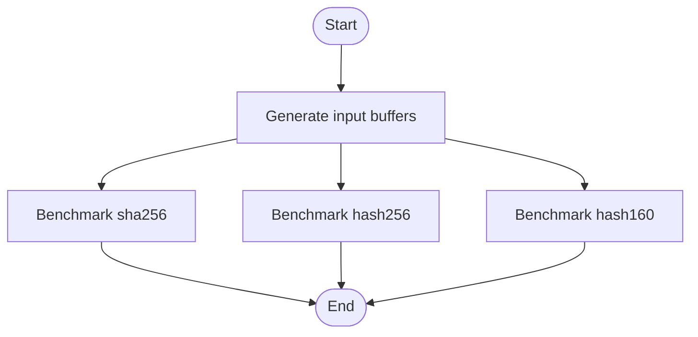
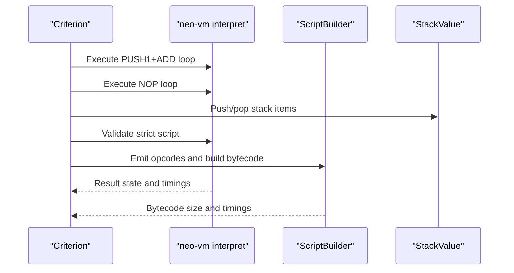
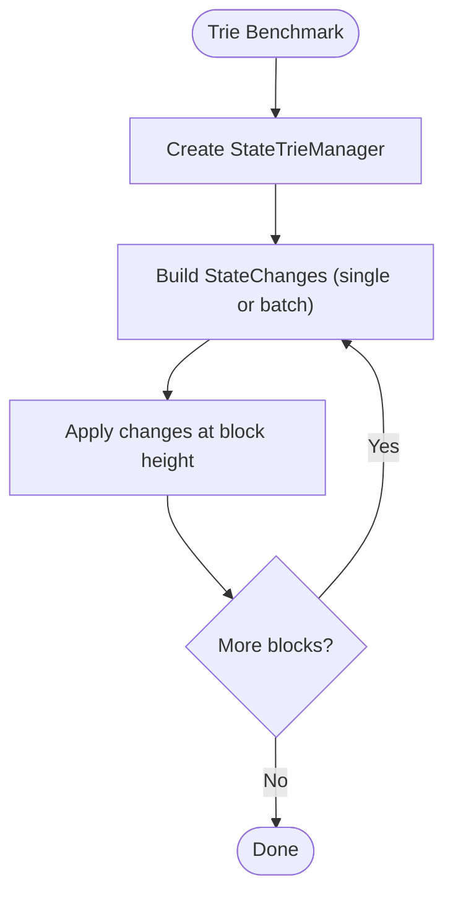
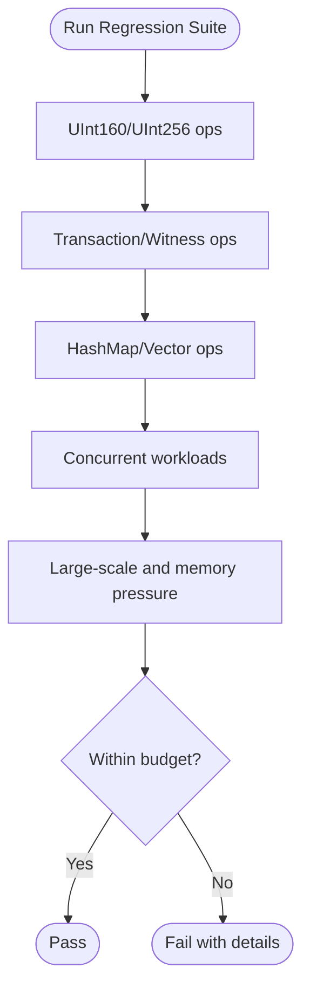
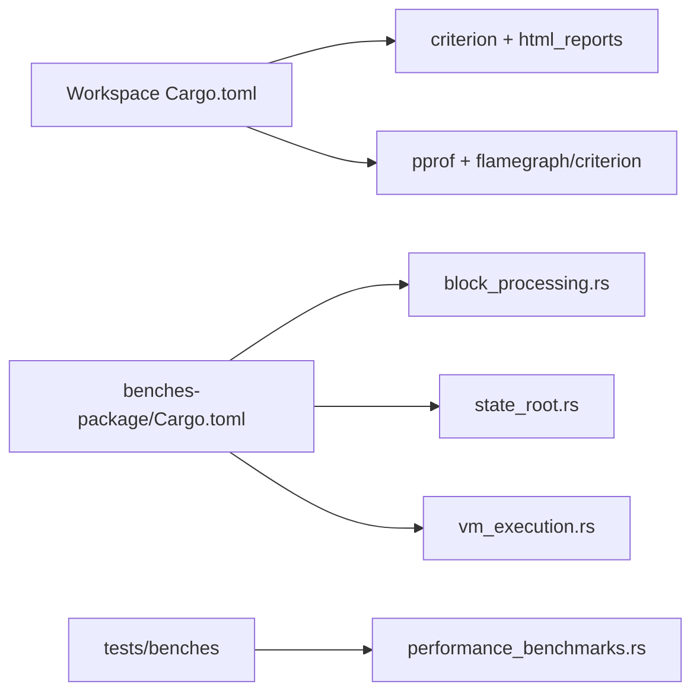

# Performance Testing

<cite>
**Referenced Files in This Document**
- [Cargo.toml](file://Cargo.toml)
- [benches-package/Cargo.toml](file://benches-package/Cargo.toml)
- [benches-package/benches/block_processing.rs](file://benches-package/benches/block_processing.rs)
- [benches-package/benches/state_root.rs](file://benches-package/benches/state_root.rs)
- [benches-package/benches/vm_execution.rs](file://benches-package/benches/vm_execution.rs)
- [tests/benches/performance_benchmarks.rs](file://tests/benches/performance_benchmarks.rs)
- [neo-core/tests/performance_regression_tests.rs](file://neo-core/tests/performance_regression_tests.rs)
- [scripts/profiling/benchmark.sh](file://scripts/profiling/benchmark.sh)
- [scripts/profiling/cpu-profile.sh](file://scripts/profiling/cpu-profile.sh)
- [scripts/profiling/memory-profile.sh](file://scripts/profiling/memory-profile.sh)
- [docs/profiling.md](file://docs/profiling.md)
- [docs/performance-baselines.md](file://docs/performance-baselines.md)
- [config/perf-validate.toml](file://config/perf-validate.toml)
</cite>

## Table of Contents
1. [Introduction](#introduction)
2. [Project Structure](#project-structure)
3. [Core Components](#core-components)
4. [Architecture Overview](#architecture-overview)
5. [Detailed Component Analysis](#detailed-component-analysis)
6. [Dependency Analysis](#dependency-analysis)
7. [Performance Considerations](#performance-considerations)
8. [Troubleshooting Guide](#troubleshooting-guide)
9. [Conclusion](#conclusion)
10. [Appendices](#appendices)

## Introduction
This document provides comprehensive performance testing guidance for the Neo-RS blockchain node. It covers benchmarking strategies using Criterion and custom benchmarks to measure block processing primitives, cryptographic hashing, VM execution efficiency, and state trie operations. It also outlines load testing methodologies for high-throughput scenarios, stress testing techniques for stability under extreme conditions, profiling tool usage, memory leak detection, and performance regression testing. Finally, it explains how to set up baselines, track metrics over time, and identify bottlenecks across the blockchain processing pipeline.

## Project Structure
Neo-RS organizes performance-related code across dedicated benchmark crates, test suites, scripts, and configuration:
- Benchmarks: A separate benches-package crate defines Criterion-based microbenchmarks for serialization, hashing, and VM execution.
- Tests: Additional Criterion benchmarks live under tests/benches for crypto, state trie, primitives, and storage key operations.
- Regression tests: Feature-gated performance regression tests enforce budgets on core data structures and collections.
- Scripts: Shell helpers automate CPU and memory profiling and benchmark runs with flamegraph generation.
- Configuration: A performance-focused node configuration isolates services and enables state service for validation runs.

**Diagram sources**
- [benches-package/benches/block_processing.rs:1-117](file://benches-package/benches/block_processing.rs#L1-L117)
- [benches-package/benches/state_root.rs:1-61](file://benches-package/benches/state_root.rs#L1-L61)
- [benches-package/benches/vm_execution.rs:1-120](file://benches-package/benches/vm_execution.rs#L1-L120)
- [tests/benches/performance_benchmarks.rs:1-213](file://tests/benches/performance_benchmarks.rs#L1-L213)
- [neo-core/tests/performance_regression_tests.rs:1-800](file://neo-core/tests/performance_regression_tests.rs#L1-L800)
- [scripts/profiling/benchmark.sh:1-13](file://scripts/profiling/benchmark.sh#L1-L13)
- [scripts/profiling/cpu-profile.sh:1-25](file://scripts/profiling/cpu-profile.sh#L1-L25)
- [scripts/profiling/memory-profile.sh:1-27](file://scripts/profiling/memory-profile.sh#L1-L27)
- [config/perf-validate.toml:1-59](file://config/perf-validate.toml#L1-L59)

**Section sources**
- [benches-package/Cargo.toml:1-31](file://benches-package/Cargo.toml#L1-L31)
- [Cargo.toml:228-271](file://Cargo.toml#L228-L271)

## Core Components
- Block processing primitives: Header and transaction serialization/deserialization, hashing, and roundtrip latency are benchmarked in isolation to avoid coupling with full block validation or persistence.
- Cryptographic hashing: SHA-256, Hash256 (double SHA-256), and Hash160 are measured across multiple input sizes to capture per-byte throughput characteristics.
- VM execution: Opcode dispatch loops, stack push/pop/peek, script parsing/validation, and ScriptBuilder emit throughput quantify interpreter overheads.
- State trie operations: Single and batch inserts, as well as incremental multi-block updates, exercise the MPT-backed state manager.
- Regression tests: Feature-gated tests assert upper bounds on per-operation latencies for primitives, transactions, witnesses, and concurrent workloads.

**Section sources**
- [benches-package/benches/block_processing.rs:1-117](file://benches-package/benches/block_processing.rs#L1-L117)
- [benches-package/benches/state_root.rs:1-61](file://benches-package/benches/state_root.rs#L1-L61)
- [benches-package/benches/vm_execution.rs:1-120](file://benches-package/benches/vm_execution.rs#L1-L120)
- [tests/benches/performance_benchmarks.rs:1-213](file://tests/benches/performance_benchmarks.rs#L1-L213)
- [neo-core/tests/performance_regression_tests.rs:1-800](file://neo-core/tests/performance_regression_tests.rs#L1-L800)

## Architecture Overview
The performance testing architecture layers microbenchmarks over core subsystems, with scripts orchestrating runs and generating reports. The workflow is:
- Criterion harness executes targeted benchmarks that isolate hot paths.
- Scripts build with debug symbols and run perf/heaptrack to produce flamegraphs and memory profiles.
- Node configuration disables non-essential services to reduce noise during performance runs.

**Diagram sources**
- [scripts/profiling/benchmark.sh:1-13](file://scripts/profiling/benchmark.sh#L1-L13)
- [scripts/profiling/cpu-profile.sh:1-25](file://scripts/profiling/cpu-profile.sh#L1-L25)
- [scripts/profiling/memory-profile.sh:1-27](file://scripts/profiling/memory-profile.sh#L1-L27)
- [benches-package/benches/block_processing.rs:1-117](file://benches-package/benches/block_processing.rs#L1-L117)
- [benches-package/benches/state_root.rs:1-61](file://benches-package/benches/state_root.rs#L1-L61)
- [benches-package/benches/vm_execution.rs:1-120](file://benches-package/benches/vm_execution.rs#L1-L120)

## Detailed Component Analysis

### Block Processing Benchmarks
Focus: header/transaction serialization, deserialization, hash computation, and roundtrip latency. These isolate I/O and hashing without invoking full block validation or persistence.

Key behaviors:
- Deterministic sample header construction ensures stable inputs across runs.
- Serialization writes to an in-memory buffer; deserialization reads from a memory reader.
- Hash functions are invoked repeatedly with fresh clones to avoid cached results.

**Diagram sources**
- [benches-package/benches/block_processing.rs:13-92](file://benches-package/benches/block_processing.rs#L13-L92)

**Section sources**
- [benches-package/benches/block_processing.rs:1-117](file://benches-package/benches/block_processing.rs#L1-L117)

### State Root and Crypto Benchmarks
Focus: SHA-256, Hash256, and Hash160 throughput across varying input sizes. Note: these do not include MPT state-root computation; they measure cryptographic primitives only.

**Diagram sources**
- [benches-package/benches/state_root.rs:11-54](file://benches-package/benches/state_root.rs#L11-L54)

**Section sources**
- [benches-package/benches/state_root.rs:1-61](file://benches-package/benches/state_root.rs#L1-L61)

### VM Execution Benchmarks
Focus: opcode dispatch loops, stack operations, script parsing/validation, and ScriptBuilder emit throughput.

**Diagram sources**
- [benches-package/benches/vm_execution.rs:6-108](file://benches-package/benches/vm_execution.rs#L6-L108)

**Section sources**
- [benches-package/benches/vm_execution.rs:1-120](file://benches-package/benches/vm_execution.rs#L1-L120)

### State Trie Operations Benchmarks
Focus: single insert, batch insert, and incremental multi-block updates via the state trie manager.

**Diagram sources**
- [tests/benches/performance_benchmarks.rs:61-123](file://tests/benches/performance_benchmarks.rs#L61-L123)

**Section sources**
- [tests/benches/performance_benchmarks.rs:1-213](file://tests/benches/performance_benchmarks.rs#L1-L213)

### Performance Regression Tests
Focus: feature-gated tests enforcing per-operation budgets for primitives, transactions, witnesses, collections, concurrency, and large-scale operations. They establish guardrails against regressions.

**Diagram sources**
- [neo-core/tests/performance_regression_tests.rs:13-800](file://neo-core/tests/performance_regression_tests.rs#L13-L800)

**Section sources**
- [neo-core/tests/performance_regression_tests.rs:1-800](file://neo-core/tests/performance_regression_tests.rs#L1-L800)

## Dependency Analysis
- Criterion and HTML reports are enabled at the workspace level and used by both the benches-package and tests.
- pprof integration is available for flamegraph generation alongside Criterion.
- Bench targets are declared explicitly in the benches-package manifest, mapping to specific files.

**Diagram sources**
- [Cargo.toml:228-271](file://Cargo.toml#L228-L271)
- [benches-package/Cargo.toml:1-31](file://benches-package/Cargo.toml#L1-L31)

**Section sources**
- [Cargo.toml:228-271](file://Cargo.toml#L228-L271)
- [benches-package/Cargo.toml:1-31](file://benches-package/Cargo.toml#L1-L31)

## Performance Considerations
- Isolate hot paths: Use microbenchmarks to measure serialization, hashing, and VM execution without side effects like disk I/O or consensus.
- Stable inputs: Construct deterministic headers/scripts to ensure repeatable measurements.
- Avoid caching artifacts: Clone objects before hashing to prevent reuse of cached values.
- Profile before optimizing: Use perf and heaptrack to identify actual hotspots rather than guessing.
- Baseline tracking: Record and compare results against established baselines to detect regressions early.
- Environment control: Disable RPC, consensus, and telemetry during performance runs to minimize noise.

[No sources needed since this section provides general guidance]

## Troubleshooting Guide
Common issues and resolutions:
- Missing tools: Ensure perf and heaptrack are installed on Linux; follow OS-specific instructions.
- No symbols: Build with debug symbols enabled for meaningful flamegraphs.
- Flaky benchmarks: Increase iterations or warm-up where appropriate; use black_box to prevent dead-code elimination.
- Memory growth: Use heaptrack to detect leaks or allocation spikes; analyze with GUI tools.
- CI failures: Review regression test budgets; adjust thresholds only when justified by hardware differences.

Operational tips:
- Use provided scripts to streamline profiling and benchmarking workflows.
- Leverage the performance-focused node configuration to disable non-essential services during measurement.

**Section sources**
- [docs/profiling.md:1-97](file://docs/profiling.md#L1-L97)
- [scripts/profiling/cpu-profile.sh:1-25](file://scripts/profiling/cpu-profile.sh#L1-L25)
- [scripts/profiling/memory-profile.sh:1-27](file://scripts/profiling/memory-profile.sh#L1-L27)
- [scripts/profiling/benchmark.sh:1-13](file://scripts/profiling/benchmark.sh#L1-L13)
- [config/perf-validate.toml:1-59](file://config/perf-validate.toml#L1-L59)

## Conclusion
Neo-RS provides a robust performance testing foundation through Criterion-based microbenchmarks, feature-gated regression tests, and profiling scripts. By focusing on isolated hot paths, establishing baselines, and continuously monitoring metrics, teams can maintain high throughput and low latency while preventing regressions. Use the provided tools and configurations to profile, validate, and optimize the blockchain processing pipeline effectively.

[No sources needed since this section summarizes without analyzing specific files]

## Appendices

### How to Set Up Performance Baselines
- Run benchmarks and record results.
- Update baseline documentation with measured values.
- Configure CI to alert on significant regressions.

**Section sources**
- [docs/performance-baselines.md:1-35](file://docs/performance-baselines.md#L1-L35)

### Load Testing Methodologies
- Use the performance node configuration to simulate realistic loads with minimal background noise.
- Combine scripted transaction submission with controlled mempool and block parameters.
- Monitor metrics and logs to assess throughput and latency under sustained load.

**Section sources**
- [config/perf-validate.toml:1-59](file://config/perf-validate.toml#L1-L59)

### Stress Testing Techniques
- Exercise large-scale operations and memory pressure scenarios via regression tests.
- Validate stability by running extended sessions and observing resource usage trends.
- Correlate stress outcomes with profiling data to pinpoint bottlenecks.

**Section sources**
- [neo-core/tests/performance_regression_tests.rs:737-800](file://neo-core/tests/performance_regression_tests.rs#L737-L800)

### Profiling Tools Usage
- CPU profiling: Build with debug symbols, record with perf, generate flamegraphs.
- Memory profiling: Use heaptrack to capture allocations and analyze with GUI tools.
- Benchmarking: Run Criterion benchmarks and inspect HTML reports.

**Section sources**
- [docs/profiling.md:1-97](file://docs/profiling.md#L1-L97)
- [scripts/profiling/cpu-profile.sh:1-25](file://scripts/profiling/cpu-profile.sh#L1-L25)
- [scripts/profiling/memory-profile.sh:1-27](file://scripts/profiling/memory-profile.sh#L1-L27)
- [scripts/profiling/benchmark.sh:1-13](file://scripts/profiling/benchmark.sh#L1-L13)