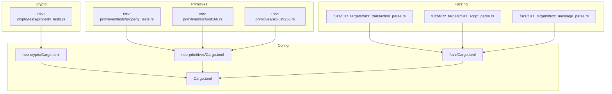
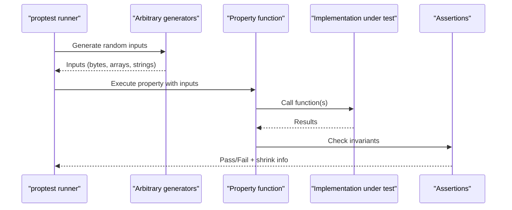
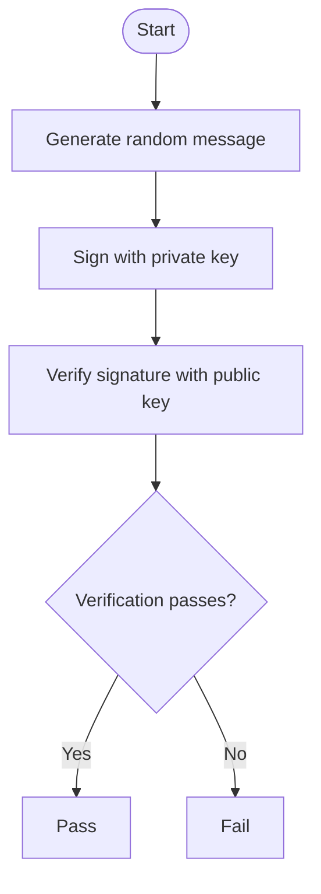
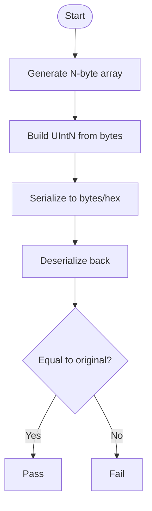
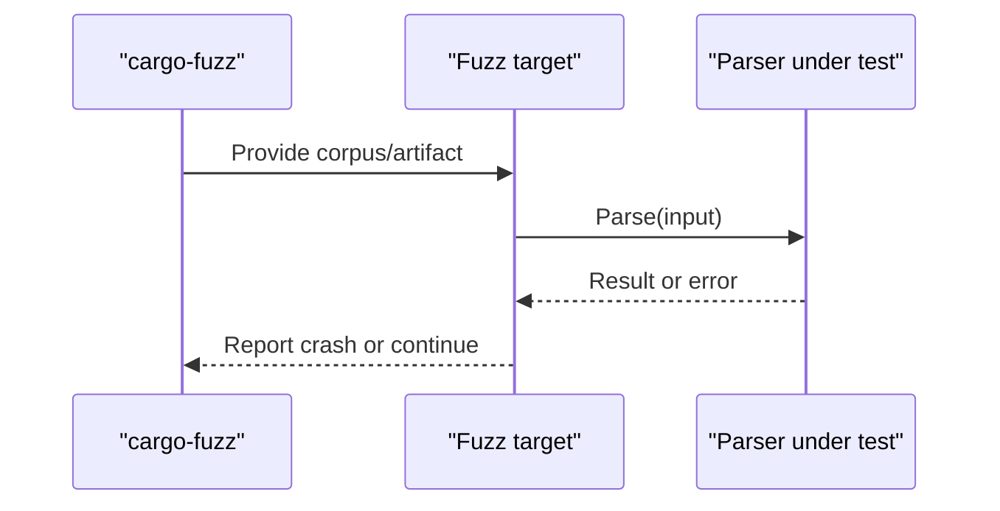
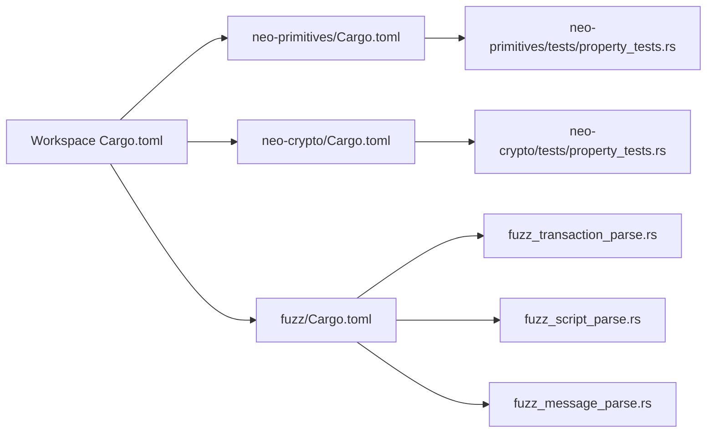

# Property-Based Testing

<cite>
**Referenced Files in This Document**
- [neo-crypto/tests/property_tests.rs](file://neo-crypto/tests/property_tests.rs)
- [neo-primitives/tests/property_tests.rs](file://neo-primitives/tests/property_tests.rs)
- [neo-primitives/src/uint160.rs](file://neo-primitives/src/uint160.rs)
- [neo-primitives/src/uint256.rs](file://neo-primitives/src/uint256.rs)
- [neo-crypto/Cargo.toml](file://neo-crypto/Cargo.toml)
- [neo-primitives/Cargo.toml](file://neo-primitives/Cargo.toml)
- [Cargo.toml](file://Cargo.toml)
- [fuzz/Cargo.toml](file://fuzz/Cargo.toml)
- [fuzz/fuzz_targets/fuzz_transaction_parse.rs](file://fuzz/fuzz_targets/fuzz_transaction_parse.rs)
- [fuzz/fuzz_targets/fuzz_script_parse.rs](file://fuzz/fuzz_targets/fuzz_script_parse.rs)
- [fuzz/fuzz_targets/fuzz_message_parse.rs](file://fuzz/fuzz_targets/fuzz_message_parse.rs)
- [fuzz/README.md](file://fuzz/README.md)
- [neo-primitives/proptest-regressions/uint256.txt](file://neo-primitives/proptest-regressions/uint256.txt)
- [neo-primitives/proptest-regressions/uint160.txt](file://neo-primitives/proptest-regressions/uint160.txt)
- [docs/STYLE.md](file://docs/STYLE.md)
</cite>

## Table of Contents
1. [Introduction](#introduction)
2. [Project Structure](#project-structure)
3. [Core Components](#core-components)
4. [Architecture Overview](#architecture-overview)
5. [Detailed Component Analysis](#detailed-component-analysis)
6. [Dependency Analysis](#dependency-analysis)
7. [Performance Considerations](#performance-considerations)
8. [Troubleshooting Guide](#troubleshooting-guide)
9. [Conclusion](#conclusion)
10. [Appendices](#appendices)

## Introduction
This document explains how to use property-based testing (PBT) in Neo-RS to ensure mathematical correctness and protocol compliance across cryptographic operations, serialization/deserialization round-trips, and consensus-related logic. It covers strategies for defining properties that must hold for all inputs, generating test data for complex blockchain structures, shrinking failing cases, debugging violations, and integrating PBT into continuous integration.

Neo-RS already includes:
- Property tests for crypto primitives and encoding round-trips
- Property tests for primitive types (UInt160, UInt256) including serialization, hashing, ordering, and equality
- Fuzz targets for parsing transactions, scripts, and messages
- Regression seeds stored by proptest for known failures

The goal is to extend these foundations with robust, maintainable property tests that scale with the codebase and CI.

## Project Structure
Property-based testing spans multiple crates:
- neo-crypto: Crypto hash consistency and signature round-trips
- neo-primitives: Primitive type properties (serialization, hashing, ordering, equality)
- fuzz: Fuzzing targets for parsers (complements PBT by stress-testing edge cases)
- Workspace configuration centralizes dependency versions and profiles

**Diagram sources**
- [neo-crypto/tests/property_tests.rs:1-179](file://neo-crypto/tests/property_tests.rs#L1-L179)
- [neo-primitives/tests/property_tests.rs:1-246](file://neo-primitives/tests/property_tests.rs#L1-L246)
- [neo-primitives/src/uint160.rs:100-299](file://neo-primitives/src/uint160.rs#L100-L299)
- [neo-primitives/src/uint256.rs:40-220](file://neo-primitives/src/uint256.rs#L40-L220)
- [fuzz/fuzz_targets/fuzz_transaction_parse.rs](file://fuzz/fuzz_targets/fuzz_transaction_parse.rs)
- [fuzz/fuzz_targets/fuzz_script_parse.rs](file://fuzz/fuzz_targets/fuzz_script_parse.rs)
- [fuzz/fuzz_targets/fuzz_message_parse.rs](file://fuzz/fuzz_targets/fuzz_message_parse.rs)
- [Cargo.toml:1-286](file://Cargo.toml#L1-L286)
- [neo-crypto/Cargo.toml:1-71](file://neo-crypto/Cargo.toml#L1-L71)
- [neo-primitives/Cargo.toml:1-49](file://neo-primitives/Cargo.toml#L1-L49)
- [fuzz/Cargo.toml:1-47](file://fuzz/Cargo.toml#L1-L47)

**Section sources**
- [Cargo.toml:1-286](file://Cargo.toml#L1-L286)
- [neo-crypto/Cargo.toml:1-71](file://neo-crypto/Cargo.toml#L1-L71)
- [neo-primitives/Cargo.toml:1-49](file://neo-primitives/Cargo.toml#L1-L49)
- [fuzz/Cargo.toml:1-47](file://fuzz/Cargo.toml#L1-L47)

## Core Components
- Crypto property tests validate deterministic hashing and signature verification round-trips across algorithms and encodings.
- Primitives property tests validate serialization round-trips, deterministic hashing, ordering transitivity, antisymmetry, zero detection, and equality axioms.
- Fuzz targets complement PBT by exercising parsers with adversarial inputs.

Key implementation highlights:
- Hash consistency: repeated calls return identical results for the same input.
- Encoding round-trips: encode then decode returns original bytes.
- Signature round-trips: sign then verify succeeds; wrong message fails.
- Primitive round-trips: from_bytes/to_array and hex parse/format are inverse operations.
- Ordering/equality: transitive, antisymmetric, reflexive, symmetric as applicable.

**Section sources**
- [neo-crypto/tests/property_tests.rs:14-178](file://neo-crypto/tests/property_tests.rs#L14-L178)
- [neo-primitives/tests/property_tests.rs:9-245](file://neo-primitives/tests/property_tests.rs#L9-L245)
- [neo-primitives/src/uint160.rs:268-299](file://neo-primitives/src/uint160.rs#L268-L299)
- [neo-primitives/src/uint256.rs:156-218](file://neo-primitives/src/uint256.rs#L156-L218)

## Architecture Overview
The PBT architecture centers on property functions that assert invariants over randomly generated inputs. The workspace config pins proptest version and provides consistent profiles for tests. Fuzzing targets target parser boundaries to find crashes or panics not covered by unit-level properties.

**Diagram sources**
- [neo-crypto/tests/property_tests.rs:14-178](file://neo-crypto/tests/property_tests.rs#L14-L178)
- [neo-primitives/tests/property_tests.rs:9-245](file://neo-primitives/tests/property_tests.rs#L9-L245)
- [Cargo.toml:226-230](file://Cargo.toml#L226-L230)

## Detailed Component Analysis

### Crypto Property Tests
Focus areas:
- Deterministic hashing across SHA256, SHA512, RIPEMD160, Hash160, Hash256, Keccak256, Blake2b, Blake2s
- Encoding round-trips for Base58, Hex, Base58Check
- Signature round-trips for Secp256r1 and Ed25519

Strategy:
- Use any::<Vec<u8>>() to generate arbitrary byte sequences
- For signature tests, generate keys per run and verify both success and failure cases

**Diagram sources**
- [neo-crypto/tests/property_tests.rs:115-143](file://neo-crypto/tests/property_tests.rs#L115-L143)
- [neo-crypto/tests/property_tests.rs:149-177](file://neo-crypto/tests/property_tests.rs#L149-L177)

**Section sources**
- [neo-crypto/tests/property_tests.rs:14-178](file://neo-crypto/tests/property_tests.rs#L14-L178)

### Primitives Property Tests
Focus areas:
- UInt160 and UInt256 serialization round-trips via bytes and hex
- Deterministic hashing
- Ordering transitivity and antisymmetry
- Zero detection correctness
- Equality reflexivity and symmetry

Strategy:
- Generate fixed-size byte arrays for uint types
- Validate parse/format pairs are inverses
- Validate algebraic properties of ordering and equality

**Diagram sources**
- [neo-primitives/tests/property_tests.rs:14-68](file://neo-primitives/tests/property_tests.rs#L14-L68)
- [neo-primitives/src/uint160.rs:268-299](file://neo-primitives/src/uint160.rs#L268-L299)
- [neo-primitives/src/uint256.rs:156-218](file://neo-primitives/src/uint256.rs#L156-L218)

**Section sources**
- [neo-primitives/tests/property_tests.rs:9-245](file://neo-primitives/tests/property_tests.rs#L9-L245)
- [neo-primitives/src/uint160.rs:268-299](file://neo-primitives/src/uint160.rs#L268-L299)
- [neo-primitives/src/uint256.rs:156-218](file://neo-primitives/src/uint256.rs#L156-L218)

### Fuzz Targets (Parser Stress Testing)
Complementary to PBT, fuzz targets exercise parsers for transactions, scripts, and messages with adversarial inputs. They help uncover issues like panics, invalid state transitions, or memory safety problems.

**Diagram sources**
- [fuzz/fuzz_targets/fuzz_transaction_parse.rs](file://fuzz/fuzz_targets/fuzz_transaction_parse.rs)
- [fuzz/fuzz_targets/fuzz_script_parse.rs](file://fuzz/fuzz_targets/fuzz_script_parse.rs)
- [fuzz/fuzz_targets/fuzz_message_parse.rs](file://fuzz/fuzz_targets/fuzz_message_parse.rs)
- [fuzz/README.md:83-168](file://fuzz/README.md#L83-L168)

**Section sources**
- [fuzz/Cargo.toml:1-47](file://fuzz/Cargo.toml#L1-L47)
- [fuzz/README.md:83-168](file://fuzz/README.md#L83-L168)

## Dependency Analysis
- Workspace-wide proptest version pinned to ensure reproducibility
- Each crate declares proptest as a dev-dependency where needed
- Fuzzing uses libfuzzer-sys and depends on core crates for parsing

**Diagram sources**
- [Cargo.toml:226-230](file://Cargo.toml#L226-L230)
- [neo-primitives/Cargo.toml:44-46](file://neo-primitives/Cargo.toml#L44-L46)
- [neo-crypto/Cargo.toml:60-63](file://neo-crypto/Cargo.toml#L60-L63)
- [fuzz/Cargo.toml:13-18](file://fuzz/Cargo.toml#L13-L18)

**Section sources**
- [Cargo.toml:226-230](file://Cargo.toml#L226-L230)
- [neo-primitives/Cargo.toml:44-46](file://neo-primitives/Cargo.toml#L44-L46)
- [neo-crypto/Cargo.toml:60-63](file://neo-crypto/Cargo.toml#L60-L63)
- [fuzz/Cargo.toml:13-18](file://fuzz/Cargo.toml#L13-L18)

## Performance Considerations
- Keep property tests focused and fast; avoid heavy I/O or network calls inside properties
- Use prop_assume to filter out invalid combinations early (e.g., non-empty messages)
- Prefer small, targeted generators for complex structures to reduce shrinking time
- Run proptest with tuned iteration counts locally; CI can use conservative defaults
- Separate expensive fuzz runs from standard test suites

[No sources needed since this section provides general guidance]

## Troubleshooting Guide
Common issues and remedies:
- Shrinking failures: proptest stores regression seeds in proptest-regressions to re-run minimal failing cases automatically
- Flaky tests: add prop_assume guards to exclude impossible inputs; ensure deterministic behavior
- Slow tests: split large properties into smaller ones; use bounded generators
- Debugging: enable verbose output and inspect shrunk inputs; reproduce with seed if available

Useful references:
- Regression files for uint160 and uint256
- Fuzz artifact handling and minimization steps

**Section sources**
- [neo-primitives/proptest-regressions/uint256.txt:1-7](file://neo-primitives/proptest-regressions/uint256.txt#L1-L7)
- [neo-primitives/proptest-regressions/uint160.txt:1-7](file://neo-primitives/proptest-regressions/uint160.txt#L1-L7)
- [fuzz/README.md:121-168](file://fuzz/README.md#L121-L168)

## Conclusion
Neo-RS has a solid foundation for property-based testing across crypto and primitives, with fuzzing targets for parser robustness. By extending properties to cover more protocol invariants (e.g., block/transaction validation rules, consensus state transitions), adopting structured generators for complex types, and integrating PBT into CI, the project can significantly improve confidence in correctness and compliance.

[No sources needed since this section summarizes without analyzing specific files]

## Appendices

### A. How to Add New Property Tests
- Place tests near the module under test or in dedicated property modules
- Use proptest! macro and prop_assert* macros
- Define Arbitrary implementations or use existing generators for complex types
- Keep each property focused on one invariant

**Section sources**
- [docs/STYLE.md:618-699](file://docs/STYLE.md#L618-L699)

### B. Generating Test Data for Complex Structures
- For blocks, transactions, and smart contracts:
  - Compose generators from primitive types (UInt160/UInt256, varints, enums)
  - Use prop_compose to build valid structures step-by-step
  - Validate invariants after construction (e.g., fee bounds, script size limits)
  - Round-trip through serialization to ensure structural integrity

[No sources needed since this section provides general guidance]

### C. Integrating Into CI
- Run proptest alongside unit tests in CI jobs
- Configure timeouts and max iterations appropriate for CI
- Persist proptest-regressions artifacts to share minimal failing cases
- Schedule longer fuzz runs nightly; integrate findings into issue tracking

[No sources needed since this section provides general guidance]