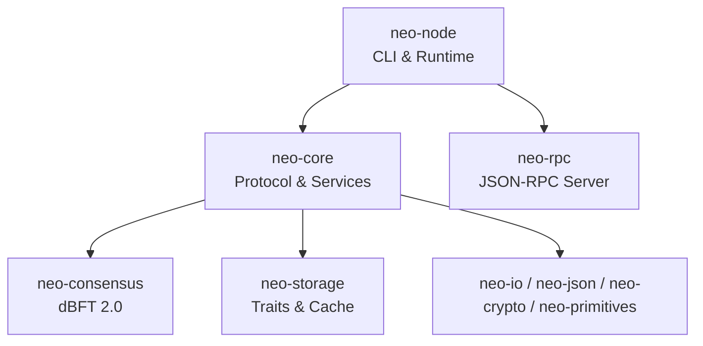
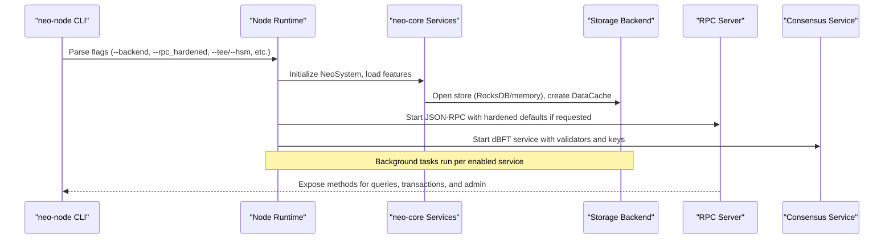
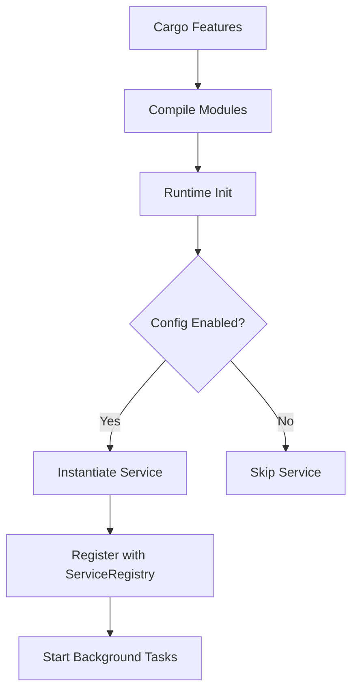
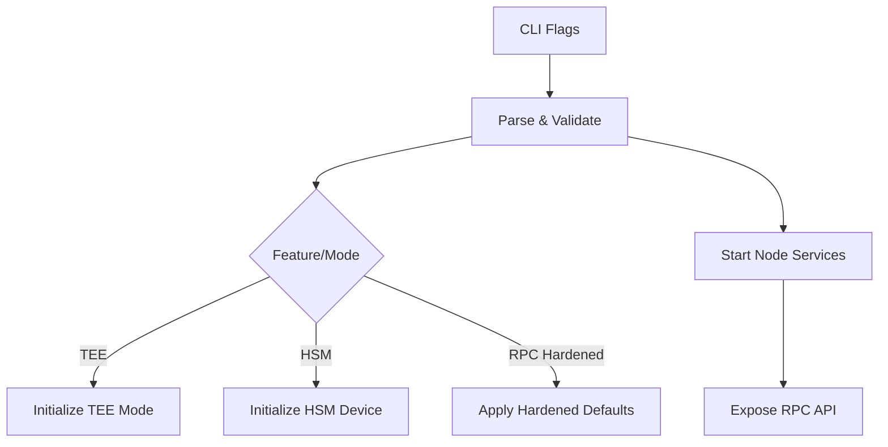
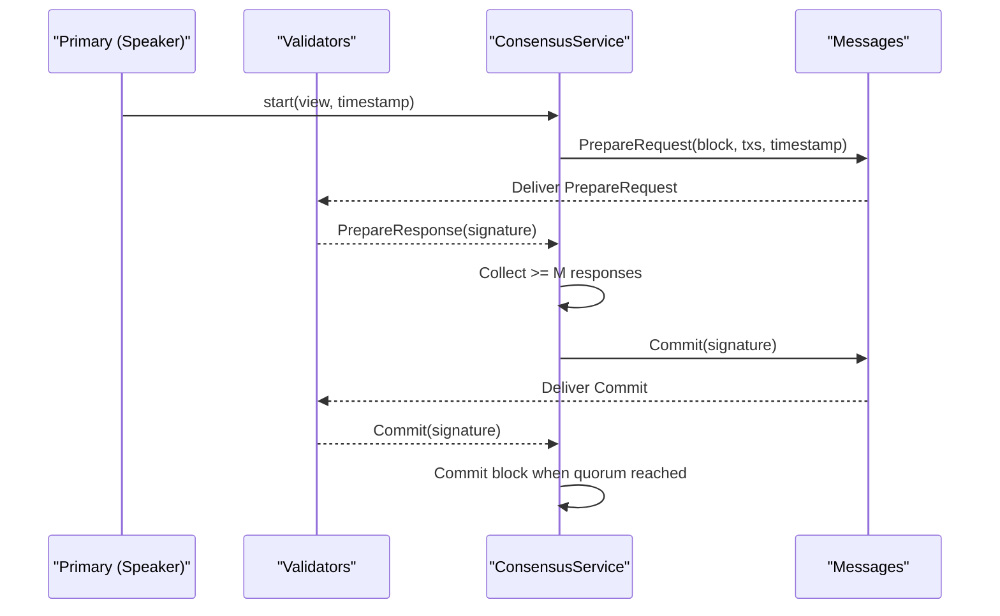
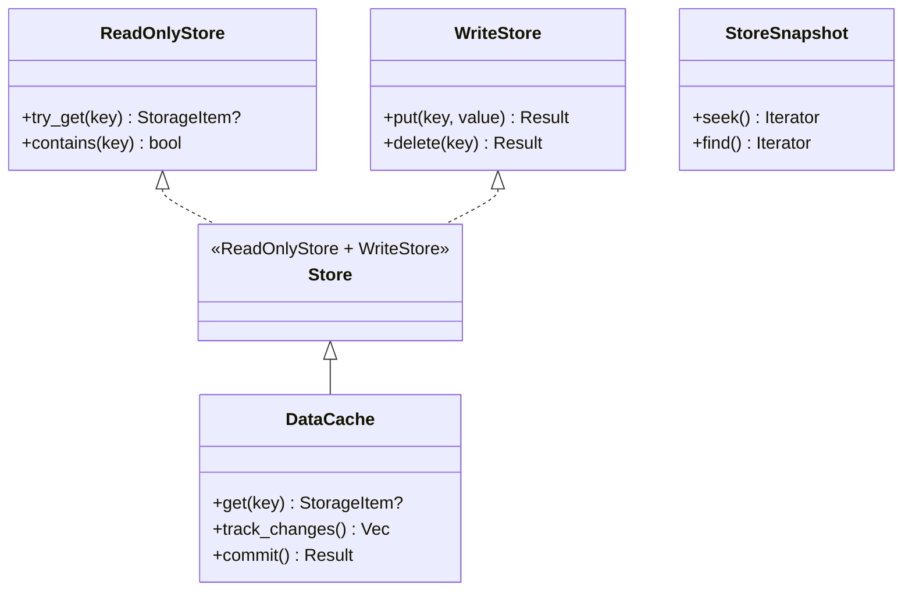
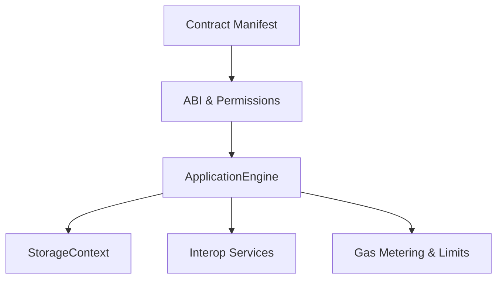
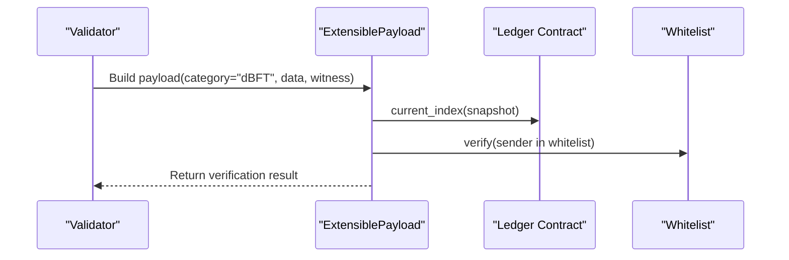
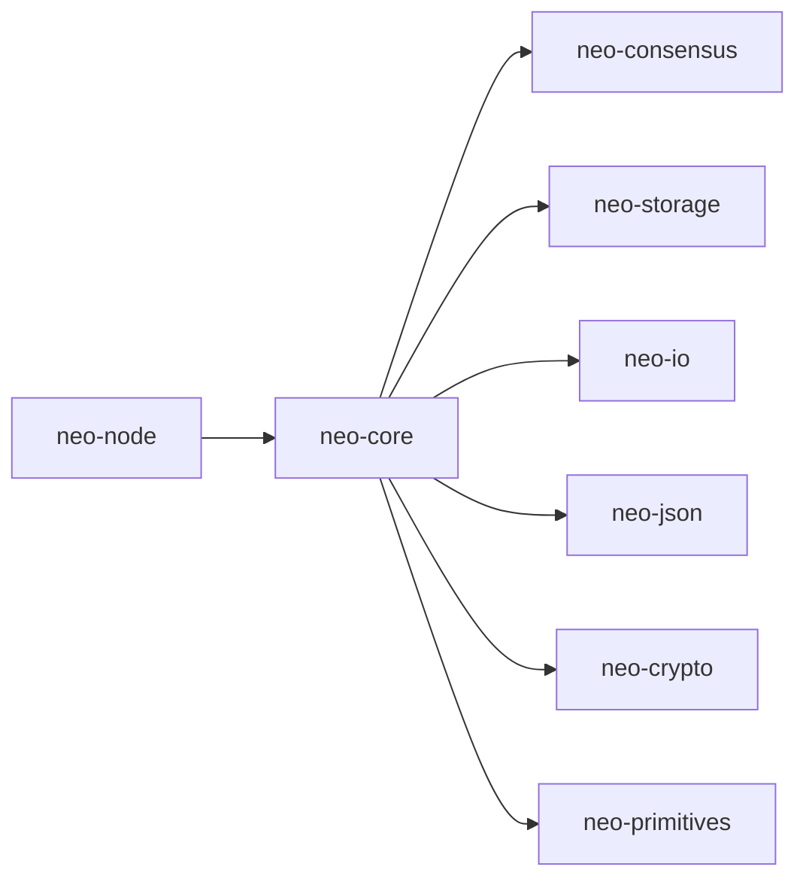
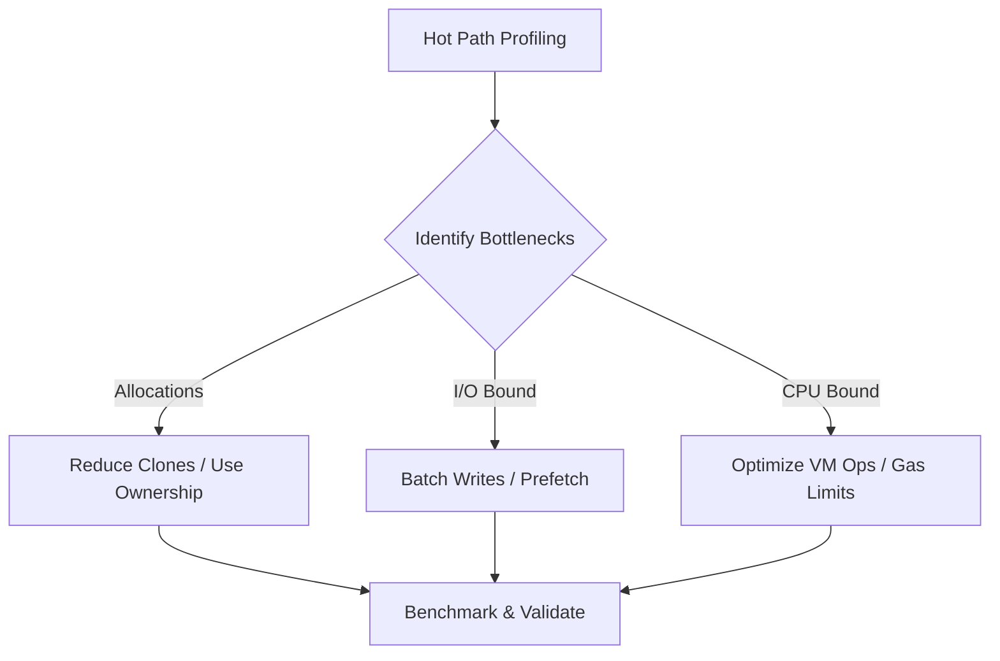

# Advanced Topics

<cite>
**Referenced Files in This Document**
- [PLUGIN_SYSTEM.md](file://docs/PLUGIN_SYSTEM.md)
- [CLI_ARCHITECTURE.md](file://docs/CLI_ARCHITECTURE.md)
- [performance-optimizations.md](file://docs/performance-optimizations.md)
- [SECURITY.md](file://docs/SECURITY.md)
- [cli.rs](file://neo-node/src/cli.rs)
- [lib.rs (neo-core)](file://neo-core/src/lib.rs)
- [mod.rs (smart_contract)](file://neo-core/src/smart_contract/mod.rs)
- [lib.rs (neo-consensus)](file://neo-consensus/src/lib.rs)
- [messages/mod.rs (neo-consensus)](file://neo-consensus/src/messages/mod.rs)
- [extensible_payload.rs](file://neo-core/src/network/p2p/payloads/extensible_payload.rs)
- [lib.rs (neo-storage)](file://neo-storage/src/lib.rs)
- [error.rs (neo-storage)](file://neo-storage/src/error.rs)
- [prefetch.rs](file://neo-storage/src/persistence/data_cache/prefetch.rs)
</cite>

## Table of Contents
1. Introduction
2. Project Structure
3. Core Components
4. Architecture Overview
5. Detailed Component Analysis
6. Dependency Analysis
7. Performance Considerations
8. Troubleshooting Guide
9. Conclusion
10. Appendices

## Introduction
This document provides advanced, operator-focused guidance for experienced developers building on neo-rs. It covers:
- Extending node functionality via the plugin system with custom services and handlers
- CLI architecture and wallet operation model for command-line tooling
- Performance optimization techniques including memory management, concurrency patterns, and I/O optimization
- Fuzzing strategies and security testing methodologies to identify vulnerabilities
- Advanced configuration scenarios, custom storage backends, and integration patterns with external systems
- Protocol extensions, consensus mechanisms, and advanced smart contract development patterns

## Project Structure
Neo-rs is organized as a multi-crate Rust workspace where each crate encapsulates a layer or capability:
- neo-core: Core protocol types, ledger, networking, persistence, wallets, and smart contract execution interfaces
- neo-consensus: dBFT 2.0 implementation and message handling
- neo-storage: Storage traits, caching, key building, and persistence abstractions
- neo-node: Node runtime, CLI flags, startup, and service wiring
- neo-rpc: JSON-RPC server and client
- Supporting crates: neo-io, neo-json, neo-crypto, neo-primitives, neo-telemetry, etc.

**Diagram sources**
- [lib.rs (neo-core):1-430](file://neo-core/src/lib.rs#L1-L430)
- [lib.rs (neo-consensus):1-285](file://neo-consensus/src/lib.rs#L1-L285)
- [lib.rs (neo-storage):1-71](file://neo-storage/src/lib.rs#L1-L71)
- [cli.rs:1-239](file://neo-node/src/cli.rs#L1-L239)

**Section sources**
- [lib.rs (neo-core):1-430](file://neo-core/src/lib.rs#L1-L430)
- [lib.rs (neo-consensus):1-285](file://neo-consensus/src/lib.rs#L1-L285)
- [lib.rs (neo-storage):1-71](file://neo-storage/src/lib.rs#L1-L71)
- [cli.rs:1-239](file://neo-node/src/cli.rs#L1-L239)

## Core Components
- Plugin System: Compile-time feature-gated modules replace dynamic loading; services are registered at startup and configured via unified TOML.
- CLI: Rich set of flags for storage backend selection, network tuning, RPC hardening, TEE/HSM modes, health checks, state root computation, and validator wallet integration.
- Consensus: dBFT 2.0 service with typed messages, view changes, recovery, and strict validation.
- Storage: Pluggable store traits, tracked cache, read-only snapshots, and prefetch-aware access patterns.
- Smart Contracts: Execution engine, native contracts, interop descriptors, and manifest support.

**Section sources**
- [PLUGIN_SYSTEM.md:1-435](file://docs/PLUGIN_SYSTEM.md#L1-L435)
- [cli.rs:1-239](file://neo-node/src/cli.rs#L1-L239)
- [lib.rs (neo-consensus):1-285](file://neo-consensus/src/lib.rs#L1-L285)
- [lib.rs (neo-storage):1-71](file://neo-storage/src/lib.rs#L1-L71)
- [mod.rs (smart_contract):1-86](file://neo-core/src/smart_contract/mod.rs#L1-L86)

## Architecture Overview
The runtime composes core services behind a feature-flagged plugin model, exposes RPC endpoints, and integrates optional security enclaves (TEE/HSM). The CLI drives configuration and operational toggles.

**Diagram sources**
- [cli.rs:1-239](file://neo-node/src/cli.rs#L1-L239)
- [lib.rs (neo-core):1-430](file://neo-core/src/lib.rs#L1-L430)
- [lib.rs (neo-consensus):1-285](file://neo-consensus/src/lib.rs#L1-L285)
- [lib.rs (neo-storage):1-71](file://neo-storage/src/lib.rs#L1-L71)

## Detailed Component Analysis

### Plugin System Architecture
- Feature-gated compilation replaces dynamic loading, improving type safety, performance, and deployment simplicity.
- Services are conditionally compiled and initialized in the node runtime based on configuration and feature flags.
- Unified TOML configuration centralizes settings previously split across per-plugin files.

**Diagram sources**
- [PLUGIN_SYSTEM.md:1-435](file://docs/PLUGIN_SYSTEM.md#L1-L435)

**Section sources**
- [PLUGIN_SYSTEM.md:1-435](file://docs/PLUGIN_SYSTEM.md#L1-L435)

### CLI Architecture and Wallet Operation Model
- The CLI exposes comprehensive flags for storage backend selection, network parameters, RPC hardening, TEE/HSM modes, health checks, state root computation, and validator wallet usage.
- Historical design documents describe an RPC-based CLI model that delegates wallet operations to the node, ensuring single source of truth and smaller binaries.

**Diagram sources**
- [cli.rs:1-239](file://neo-node/src/cli.rs#L1-L239)
- [CLI_ARCHITECTURE.md:1-381](file://docs/CLI_ARCHITECTURE.md#L1-L381)

**Section sources**
- [cli.rs:1-239](file://neo-node/src/cli.rs#L1-L239)
- [CLI_ARCHITECTURE.md:1-381](file://docs/CLI_ARCHITECTURE.md#L1-L381)

### Consensus Mechanism (dBFT 2.0)
- The consensus crate implements dBFT 2.0 with typed messages, view changes, recovery, and strict validation.
- Messages are serialized into a compact on-wire format compatible with the reference implementation and embedded in extensible payloads.

**Diagram sources**
- [lib.rs (neo-consensus):1-285](file://neo-consensus/src/lib.rs#L1-L285)
- [messages/mod.rs:82-115](file://neo-consensus/src/messages/mod.rs#L82-L115)

**Section sources**
- [lib.rs (neo-consensus):1-285](file://neo-consensus/src/lib.rs#L1-L285)
- [messages/mod.rs:82-115](file://neo-consensus/src/messages/mod.rs#L82-L115)

### Storage Backends and Custom Integrations
- Storage traits define pluggable backends with read-only and write capabilities, snapshots, and transactional semantics.
- DataCache tracks changes and supports efficient iteration and commit workflows.
- Prefetch pattern detection optimizes sequential and strided access patterns.

**Diagram sources**
- [lib.rs (neo-storage):1-71](file://neo-storage/src/lib.rs#L1-L71)
- [prefetch.rs:1-45](file://neo-storage/src/persistence/data_cache/prefetch.rs#L1-L45)

**Section sources**
- [lib.rs (neo-storage):1-71](file://neo-storage/src/lib.rs#L1-L71)
- [prefetch.rs:1-45](file://neo-storage/src/persistence/data_cache/prefetch.rs#L1-L45)

### Smart Contract Development Patterns
- The smart contract module exposes application engine, native contracts, interop descriptors, and manifest structures.
- Execution context, storage context, and interoperability primitives enable advanced contract logic while enforcing gas limits and sandboxing.

**Diagram sources**
- [mod.rs (smart_contract):1-86](file://neo-core/src/smart_contract/mod.rs#L1-L86)

**Section sources**
- [mod.rs (smart_contract):1-86](file://neo-core/src/smart_contract/mod.rs#L1-L86)

### Protocol Extensions via Extensible Payloads
- ExtensiblePayload carries category-scoped data (e.g., dBFT) with validity windows and witness verification against a whitelist.
- Validators and committee addresses are whitelisted to ensure only authorized categories can be processed.

**Diagram sources**
- [extensible_payload.rs:30-75](file://neo-core/src/network/p2p/payloads/extensible_payload.rs#L30-L75)

**Section sources**
- [extensible_payload.rs:30-75](file://neo-core/src/network/p2p/payloads/extensible_payload.rs#L30-L75)

## Dependency Analysis
- neo-node depends on neo-core for services and runtime orchestration, neo-consensus for block production, and neo-storage for persistence.
- neo-core re-exports foundational types from neo-primitives, neo-crypto, and neo-storage, and wires optional features like monitoring and runtime components.

**Diagram sources**
- [lib.rs (neo-core):1-430](file://neo-core/src/lib.rs#L1-L430)
- [lib.rs (neo-consensus):1-285](file://neo-consensus/src/lib.rs#L1-L285)
- [lib.rs (neo-storage):1-71](file://neo-storage/src/lib.rs#L1-L71)
- [cli.rs:1-239](file://neo-node/src/cli.rs#L1-L239)

**Section sources**
- [lib.rs (neo-core):1-430](file://neo-core/src/lib.rs#L1-L430)
- [lib.rs (neo-consensus):1-285](file://neo-consensus/src/lib.rs#L1-L285)
- [lib.rs (neo-storage):1-71](file://neo-storage/src/lib.rs#L1-L71)
- [cli.rs:1-239](file://neo-node/src/cli.rs#L1-L239)

## Performance Considerations
- Hot path optimizations target VM execution, contract loading, and compression layers to reduce allocations and improve throughput.
- Storage layer benefits from prefetch pattern detection and batched writes; monitor allocation hotspots and tune cache sizes.
- Concurrency: Use Tokio tasks for background services; avoid unnecessary Arc clones in hot paths; prefer ownership transfer where possible.
- I/O: Enable compression selectively; use read-only snapshots for analysis; leverage RocksDB-backed stores for durability and performance.

**Section sources**
- [performance-optimizations.md:1-87](file://docs/performance-optimizations.md#L1-L87)
- [prefetch.rs:1-45](file://neo-storage/src/persistence/data_cache/prefetch.rs#L1-L45)

## Troubleshooting Guide
- Plugin not starting: Verify feature flags, configuration enablement, and dependency availability in the service registry.
- Storage errors: Inspect StorageError variants (KeyNotFound, ReadOnly, Serialization, Backend, InvalidOperation, CommitFailed, Io) to diagnose issues.
- Consensus stalls: Check view change reasons, timeout settings, and validator set correctness; validate message signatures and hashes.
- RPC issues: Apply hardened defaults (--rpc_hardened), restrict disabled methods, configure CORS and authentication appropriately.

**Section sources**
- [PLUGIN_SYSTEM.md:1-435](file://docs/PLUGIN_SYSTEM.md#L1-L435)
- [error.rs (neo-storage):1-105](file://neo-storage/src/error.rs#L1-L105)
- [SECURITY.md:1-800](file://docs/SECURITY.md#L1-L800)

## Conclusion
Neo-rs offers a robust, extensible platform for building high-performance blockchain nodes and tools. By leveraging compile-time plugins, a rich CLI, a secure consensus engine, and pluggable storage, operators can tailor deployments to diverse environments. Adhering to performance best practices, fuzzing strategies, and security hardening ensures resilient and maintainable systems.

## Appendices

### Fuzzing Strategies and Security Testing
- Targets include transaction parsing, script validation, and P2P message deserialization to uncover crashes, panics, and resource exhaustion vectors.
- Use cargo-fuzz with release builds, seed corpora, and CI integration for continuous coverage.
- Follow responsible disclosure procedures for discovered vulnerabilities.

**Section sources**
- [SECURITY.md:1-800](file://docs/SECURITY.md#L1-L800)

### Advanced Configuration Scenarios
- Storage: Select backend via CLI flags; enable read-only mode for offline checks; tune batch buffers and cache sizes.
- Network: Adjust connection limits, seed nodes, broadcast history, and compression settings.
- RPC: Harden defaults, disable risky methods, configure TLS and CORS origins.
- TEE/HSM: Choose fail-closed or auto modes; configure device types, slots, and key IDs.

**Section sources**
- [cli.rs:1-239](file://neo-node/src/cli.rs#L1-L239)
- [SECURITY.md:1-800](file://docs/SECURITY.md#L1-L800)