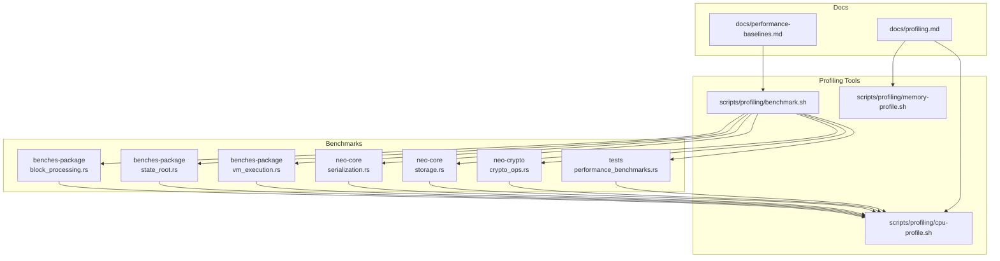
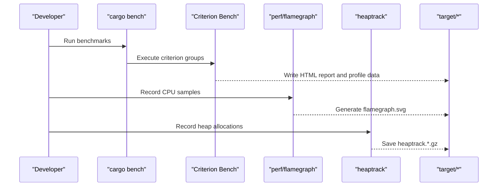
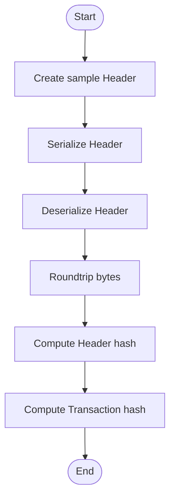
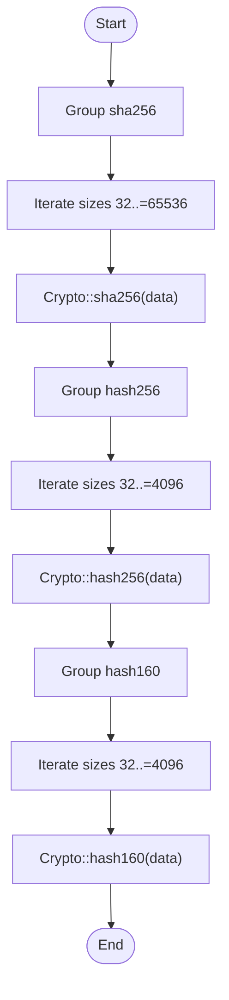
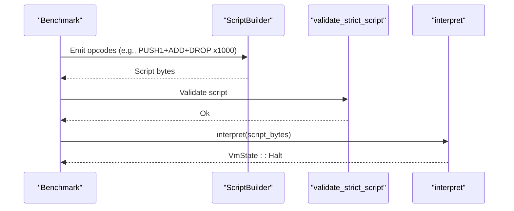
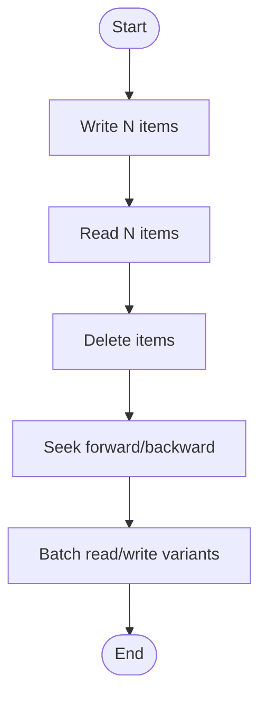
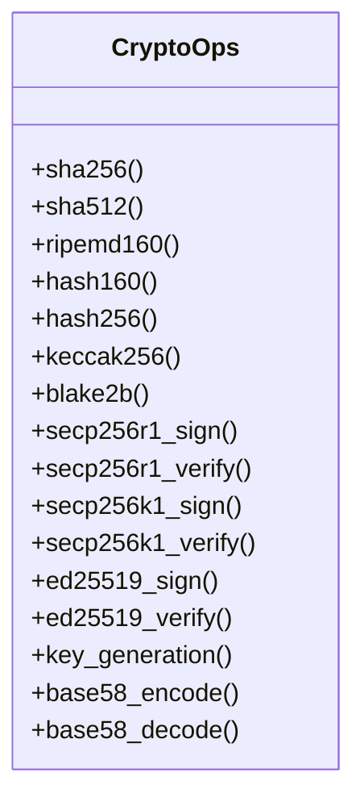
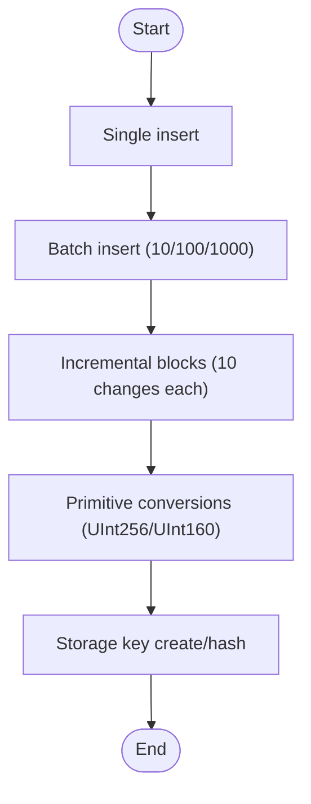
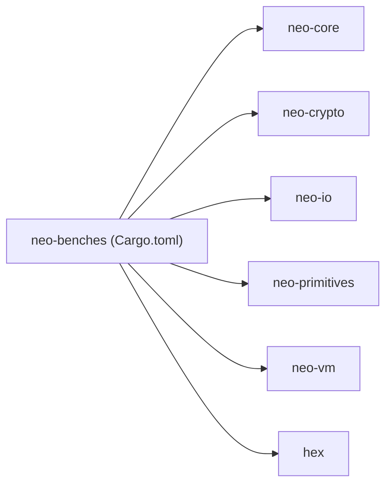

# Benchmarking & Profiling

<cite>
**Referenced Files in This Document**
- [Cargo.toml](file://benches-package/Cargo.toml)
- [block_processing.rs](file://benches-package/benches/block_processing.rs)
- [state_root.rs](file://benches-package/benches/state_root.rs)
- [vm_execution.rs](file://benches-package/benches/vm_execution.rs)
- [serialization.rs](file://neo-core/benches/serialization.rs)
- [storage.rs](file://neo-core/benches/storage.rs)
- [crypto_ops.rs](file://neo-crypto/benches/crypto_ops.rs)
- [performance_benchmarks.rs](file://tests/benches/performance_benchmarks.rs)
- [benchmark.sh](file://scripts/profiling/benchmark.sh)
- [cpu-profile.sh](file://scripts/profiling/cpu-profile.sh)
- [memory-profile.sh](file://scripts/profiling/memory-profile.sh)
- [profiling.md](file://docs/profiling.md)
- [performance-baselines.md](file://docs/performance-baselines.md)
- [continuous-monitor.sh](file://scripts/continuous-monitor.sh)
</cite>

## Table of Contents
1. [Introduction](#introduction)
2. [Project Structure](#project-structure)
3. [Core Components](#core-components)
4. [Architecture Overview](#architecture-overview)
5. [Detailed Component Analysis](#detailed-component-analysis)
6. [Dependency Analysis](#dependency-analysis)
7. [Performance Considerations](#performance-considerations)
8. [Troubleshooting Guide](#troubleshooting-guide)
9. [Conclusion](#conclusion)
10. [Appendices](#appendices)

## Introduction
This document provides a comprehensive guide to benchmarking and profiling Neo-RS blockchain operations. It covers the benchmark suite structure, methodology for measuring performance of critical paths such as block processing, transaction validation, and smart contract execution, and details on using profiling tools including flamegraphs, memory profilers, and CPU analyzers. It also outlines continuous performance testing setup, regression detection, baseline maintenance, and guidance for interpreting results and implementing targeted optimizations.

## Project Structure
Neo-RS organizes benchmarks across multiple crates:
- benches-package: focused micro-benchmarks for serialization/hashing and VM execution
- neo-core: storage and serialization benchmarks
- neo-crypto: cryptographic primitives benchmarks
- tests: higher-level state trie and primitive benchmarks
- scripts/profiling: tooling for CPU and memory profiling and benchmark runs
- docs: profiling guide and baselines

**Diagram sources**
- [block_processing.rs:1-117](file://benches-package/benches/block_processing.rs#L1-L117)
- [state_root.rs:1-61](file://benches-package/benches/state_root.rs#L1-L61)
- [vm_execution.rs:1-120](file://benches-package/benches/vm_execution.rs#L1-L120)
- [serialization.rs:1-204](file://neo-core/benches/serialization.rs#L1-L204)
- [storage.rs:1-282](file://neo-core/benches/storage.rs#L1-L282)
- [crypto_ops.rs:1-351](file://neo-crypto/benches/crypto_ops.rs#L1-L351)
- [performance_benchmarks.rs:1-213](file://tests/benches/performance_benchmarks.rs#L1-L213)
- [benchmark.sh:1-13](file://scripts/profiling/benchmark.sh#L1-L13)
- [cpu-profile.sh:1-25](file://scripts/profiling/cpu-profile.sh#L1-L25)
- [memory-profile.sh:1-27](file://scripts/profiling/memory-profile.sh#L1-L27)
- [profiling.md:1-97](file://docs/profiling.md#L1-L97)
- [performance-baselines.md:1-35](file://docs/performance-baselines.md#L1-L35)

**Section sources**
- [Cargo.toml:1-31](file://benches-package/Cargo.toml#L1-L31)
- [benchmark.sh:1-13](file://scripts/profiling/benchmark.sh#L1-L13)
- [profiling.md:1-97](file://docs/profiling.md#L1-L97)
- [performance-baselines.md:1-35](file://docs/performance-baselines.md#L1-L35)

## Core Components
- Block processing benchmarks: measure header/transaction serialization, deserialization, roundtrip, and hashing; scope explicitly excludes full block processing throughput.
- State root hashing benchmarks: measure SHA-256, Hash256, Hash160 across input sizes; not MPT state-root computation.
- VM execution benchmarks: opcode dispatch loops, stack push/pop/peek, script parsing, and ScriptBuilder emit throughput.
- Storage benchmarks: MemoryStore read/write/delete, batch operations, seek forward/backward, key/item operations.
- Crypto benchmarks: hash functions, signature sign/verify for secp256r1/secp256k1/ed25519, key generation, base58 encode/decode.
- Tests-level benchmarks: state trie insertions (single/batch/incremental), primitive conversions, storage key creation/hashing.

These components collectively cover critical hot paths: I/O-bound serialization, CPU-bound cryptography, VM interpreter overhead, and storage access patterns.

**Section sources**
- [block_processing.rs:1-117](file://benches-package/benches/block_processing.rs#L1-L117)
- [state_root.rs:1-61](file://benches-package/benches/state_root.rs#L1-L61)
- [vm_execution.rs:1-120](file://benches-package/benches/vm_execution.rs#L1-L120)
- [serialization.rs:1-204](file://neo-core/benches/serialization.rs#L1-L204)
- [storage.rs:1-282](file://neo-core/benches/storage.rs#L1-L282)
- [crypto_ops.rs:1-351](file://neo-crypto/benches/crypto_ops.rs#L1-L351)
- [performance_benchmarks.rs:1-213](file://tests/benches/performance_benchmarks.rs#L1-L213)

## Architecture Overview
The benchmarking architecture uses Criterion-based micro-benchmarks per crate, orchestrated by shell scripts that build release binaries with debug symbols and run either Criterion with built-in profiling or system profilers (perf + flamegraph, heaptrack). Results are stored under target directories and can be viewed via HTML reports or GUI tools.

**Diagram sources**
- [benchmark.sh:1-13](file://scripts/profiling/benchmark.sh#L1-L13)
- [cpu-profile.sh:1-25](file://scripts/profiling/cpu-profile.sh#L1-L25)
- [memory-profile.sh:1-27](file://scripts/profiling/memory-profile.sh#L1-L27)
- [profiling.md:1-97](file://docs/profiling.md#L1-L97)

## Detailed Component Analysis

### Block Processing Benchmarks
Focuses on header and transaction serialization/deserialization and hashing. Uses deterministic sample data and black-boxing to prevent dead-code elimination. Explicitly scoped to avoid claiming full block-processing throughput.

**Diagram sources**
- [block_processing.rs:13-92](file://benches-package/benches/block_processing.rs#L13-L92)

**Section sources**
- [block_processing.rs:1-117](file://benches-package/benches/block_processing.rs#L1-L117)

### State Root Hashing Benchmarks
Measures crypto primitives (SHA-256, Hash256, Hash160) across various input sizes. Not MPT state-root computation; MPT benchmarks are noted as future work.

**Diagram sources**
- [state_root.rs:11-54](file://benches-package/benches/state_root.rs#L11-L54)

**Section sources**
- [state_root.rs:1-61](file://benches-package/benches/state_root.rs#L1-L61)

### VM Execution Benchmarks
Evaluates opcode dispatch overhead, stack operations, script parsing, and builder throughput. Validates strict scripts before execution and asserts halt states.

**Diagram sources**
- [vm_execution.rs:6-43](file://benches-package/benches/vm_execution.rs#L6-L43)
- [vm_execution.rs:76-108](file://benches-package/benches/vm_execution.rs#L76-L108)

**Section sources**
- [vm_execution.rs:1-120](file://benches-package/benches/vm_execution.rs#L1-L120)

### Storage Benchmarks
Covers MemoryStore put/get/delete, batch operations, and seek scans. Uses random keys/values and measures throughput for different payload sizes.

**Diagram sources**
- [storage.rs:28-79](file://neo-core/benches/storage.rs#L28-L79)
- [storage.rs:137-211](file://neo-core/benches/storage.rs#L137-L211)
- [storage.rs:213-271](file://neo-core/benches/storage.rs#L213-L271)

**Section sources**
- [storage.rs:1-282](file://neo-core/benches/storage.rs#L1-L282)

### Crypto Benchmarks
Comprehensive coverage of hashing and signature algorithms across multiple curves and input sizes, plus base58 encoding/decoding and key generation.

**Diagram sources**
- [crypto_ops.rs:17-351](file://neo-crypto/benches/crypto_ops.rs#L17-L351)

**Section sources**
- [crypto_ops.rs:1-351](file://neo-crypto/benches/crypto_ops.rs#L1-L351)

### State Trie and Primitives Benchmarks
Higher-level benchmarks for state trie apply_changes (single, batch, incremental blocks), primitive conversions, and storage key operations.

**Diagram sources**
- [performance_benchmarks.rs:61-123](file://tests/benches/performance_benchmarks.rs#L61-L123)
- [performance_benchmarks.rs:129-179](file://tests/benches/performance_benchmarks.rs#L129-L179)

**Section sources**
- [performance_benchmarks.rs:1-213](file://tests/benches/performance_benchmarks.rs#L1-L213)

## Dependency Analysis
The benchmark package depends on core crates for types and runtime behavior. The harness is disabled for custom main entry points, enabling direct Criterion integration.

**Diagram sources**
- [Cargo.toml:7-14](file://benches-package/Cargo.toml#L7-L14)

**Section sources**
- [Cargo.toml:1-31](file://benches-package/Cargo.toml#L1-L31)

## Performance Considerations
- Use release builds with debug symbols for accurate profiling and meaningful symbolization.
- Prefer micro-benchmarks for isolated hot-path measurement; complement with full-node profiling for end-to-end insights.
- Track throughput where applicable (bytes/sec) to normalize across dataset sizes.
- For VM execution, ensure scripts are validated prior to interpretation to avoid skewed timings from parse errors.
- For storage, isolate store lifecycle per iteration to avoid cross-run contamination.
- Avoid measuring cached hashes without resetting state when evaluating recomputation costs.

[No sources needed since this section provides general guidance]

## Troubleshooting Guide
- Missing perf or flamegraph tools: install Linux perf and FlameGraph utilities; use provided scripts which assume their presence.
- Missing heaptrack: the memory profiler script checks for installation and exits early if absent.
- No process running during monitoring: the continuous monitor script queries node status and logs metrics; verify RPC endpoints and SSH configuration.
- Interpreting flamegraphs: focus on wide bars representing high CPU time in application code; ignore stdlib unless it dominates.
- Memory issues: look for allocation spikes and monotonic growth indicating leaks; analyze with heaptrack GUI.

**Section sources**
- [cpu-profile.sh:1-25](file://scripts/profiling/cpu-profile.sh#L1-L25)
- [memory-profile.sh:1-27](file://scripts/profiling/memory-profile.sh#L1-L27)
- [continuous-monitor.sh:1-54](file://scripts/continuous-monitor.sh#L1-L54)
- [profiling.md:26-97](file://docs/profiling.md#L26-L97)

## Conclusion
Neo-RS provides a robust, multi-layered benchmarking and profiling ecosystem. Micro-benchmarks isolate hot paths across serialization, cryptography, VM execution, and storage, while system-level profiling tools enable deep inspection of real-world node behavior. By maintaining baselines, integrating continuous monitoring, and following structured interpretation guidelines, teams can detect regressions early and implement targeted optimizations grounded in measurement data.

[No sources needed since this section summarizes without analyzing specific files]

## Appendices

### Running Benchmarks and Generating Reports
- Use the provided script to run Criterion benchmarks with built-in profiling and generate HTML reports.
- View results in the target/criterion directory.

**Section sources**
- [benchmark.sh:1-13](file://scripts/profiling/benchmark.sh#L1-L13)
- [profiling.md:61-73](file://docs/profiling.md#L61-L73)

### CPU Profiling Workflow
- Build with debug symbols enabled for release.
- Record CPU samples with perf and generate flamegraphs.
- Analyze top hotspots and iterate.

**Section sources**
- [cpu-profile.sh:1-25](file://scripts/profiling/cpu-profile.sh#L1-L25)
- [profiling.md:26-45](file://docs/profiling.md#L26-L45)

### Memory Profiling Workflow
- Ensure heaptrack is installed.
- Build with debug symbols and record heap allocations.
- Analyze outputs with heaptrack GUI.

**Section sources**
- [memory-profile.sh:1-27](file://scripts/profiling/memory-profile.sh#L1-L27)
- [profiling.md:47-59](file://docs/profiling.md#L47-L59)

### Baseline Maintenance and Regression Detection
- Establish baselines by running benchmarks and recording results.
- CI alerts on significant regressions; update baselines after verified improvements.

**Section sources**
- [performance-baselines.md:1-35](file://docs/performance-baselines.md#L1-L35)

### Continuous Monitoring
- Monitor node health, block height, peer connections, and recent sync activity via the provided script.
- Adjust intervals and targets based on operational needs.

**Section sources**
- [continuous-monitor.sh:1-54](file://scripts/continuous-monitor.sh#L1-L54)