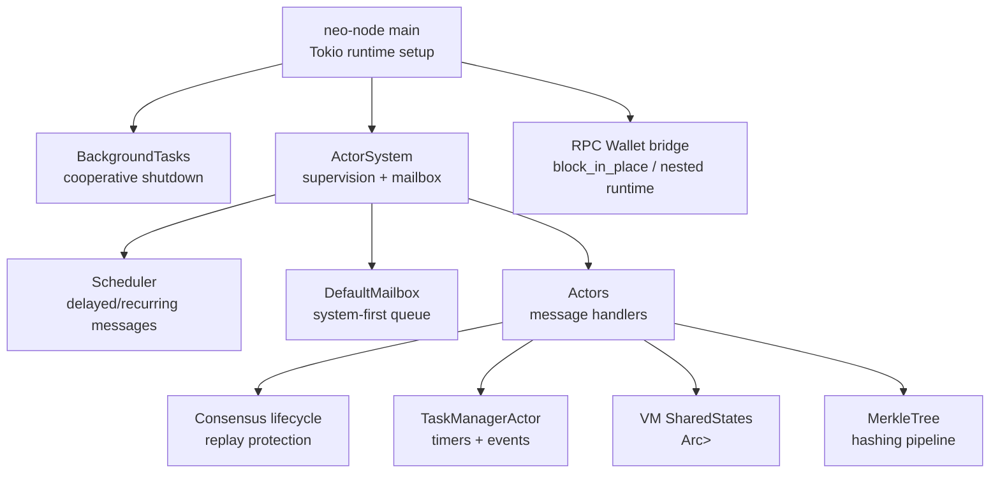
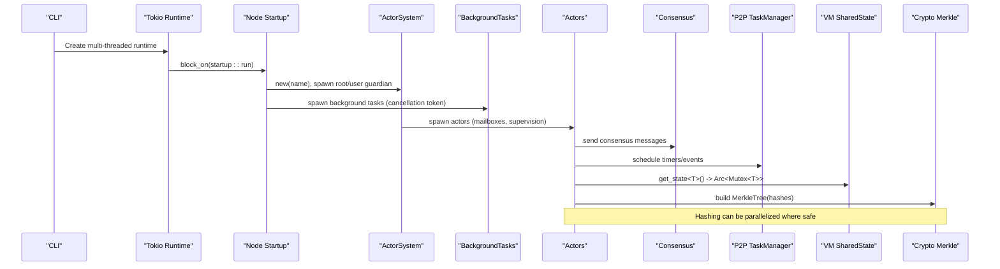
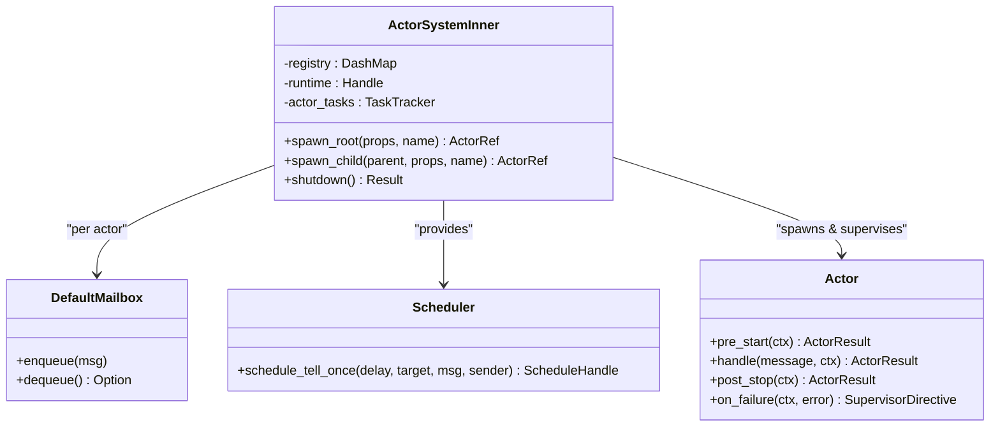
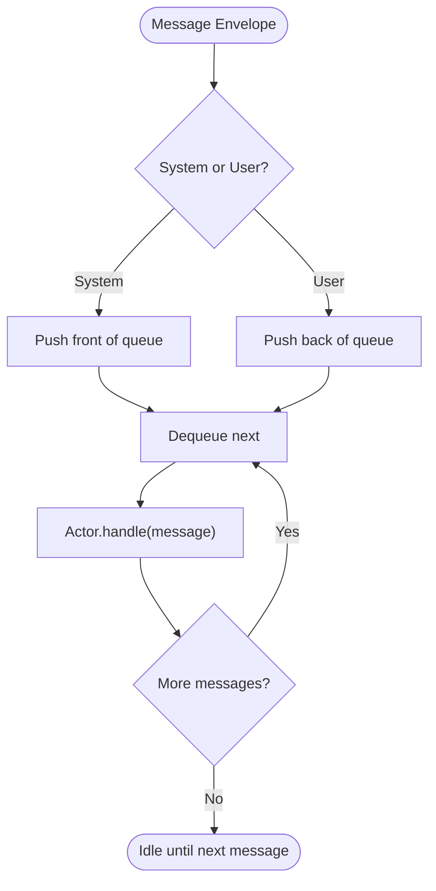
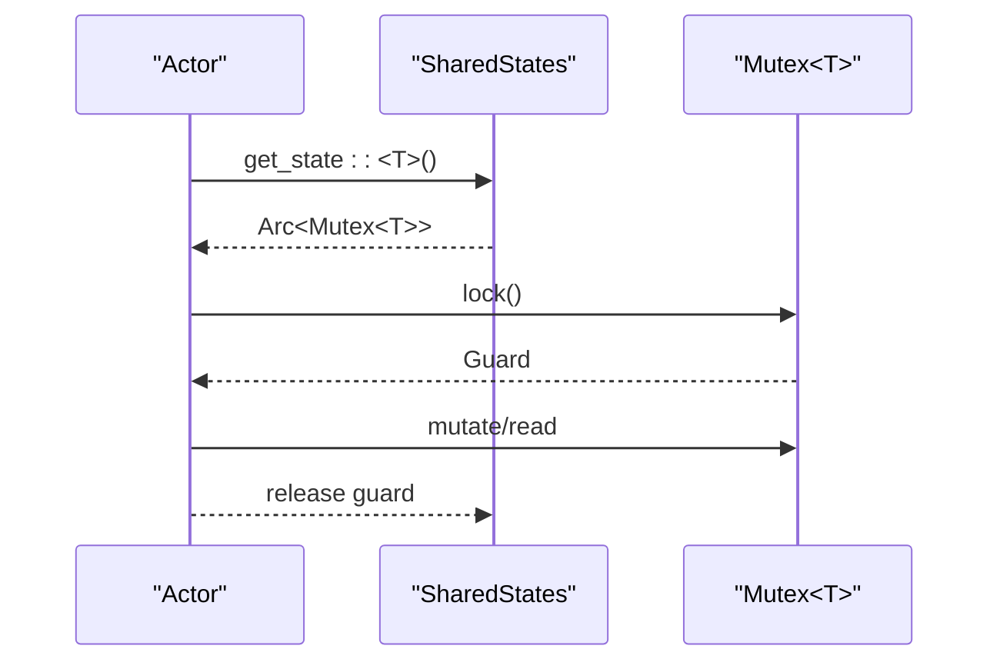
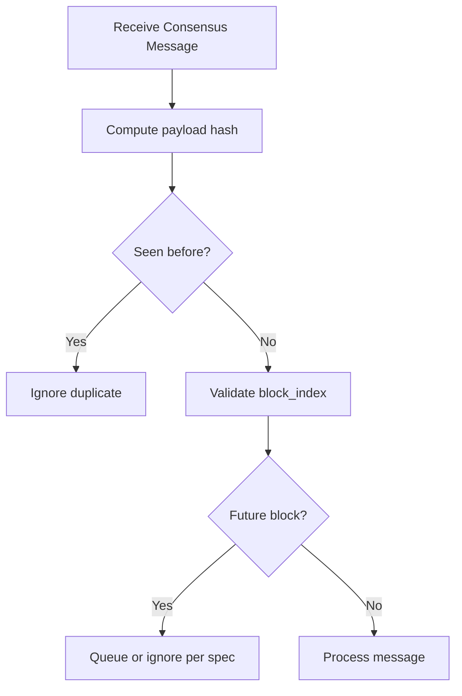
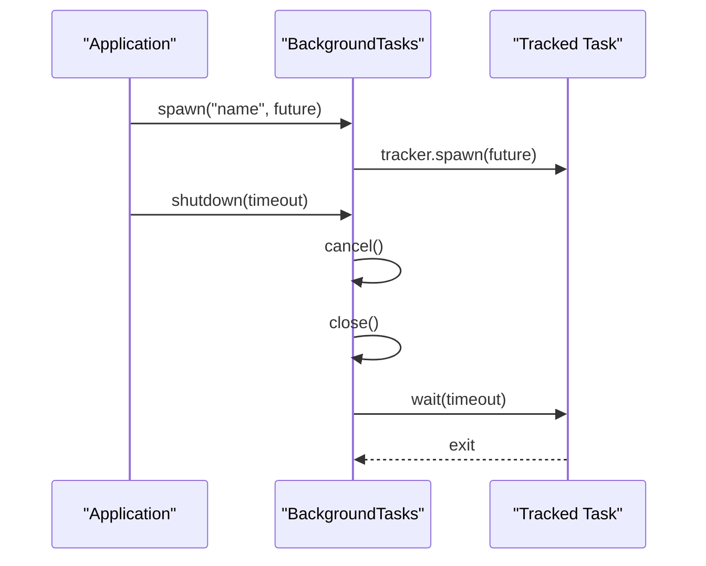
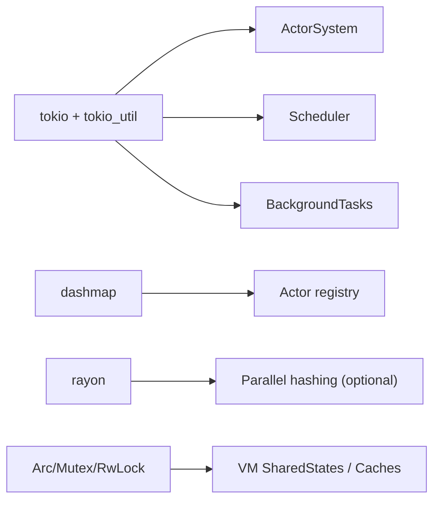

# Concurrency Patterns

<cite>
**Referenced Files in This Document**
- [main.rs](file://neo-node/src/main.rs)
- [tasks.rs](file://neo-node/src/startup/tasks.rs)
- [actor_system.rs](file://neo-core/src/actors/actor_system.rs)
- [mailbox.rs](file://neo-core/src/actors/mailbox.rs)
- [scheduler.rs](file://neo-core/src/actors/scheduler.rs)
- [error.rs](file://neo-core/src/actors/error.rs)
- [merkle_tree.rs](file://neo-crypto/src/merkle_tree.rs)
- [shared_states.rs](file://neo-vm/src/execution_context/shared_states.rs)
- [context.rs](file://neo-vm/src/execution_context/context.rs)
- [lifecycle.rs](file://neo-consensus/src/service/lifecycle.rs)
- [rpc_server_wallet_mod.rs](file://neo-rpc/src/server/rpc_server_wallet/mod.rs)
- [task_manager_actor.rs](file://neo-core/src/network/p2p/task_manager.rs)
</cite>

## Table of Contents
1. Introduction
2. Project Structure
3. Core Components
4. Architecture Overview
5. Detailed Component Analysis
6. Dependency Analysis
7. Performance Considerations
8. Troubleshooting Guide
9. Conclusion

## Introduction
This document explains concurrency optimization patterns used by Neo-RS for blockchain operations. It covers Tokio runtime configuration, async actor model implementation, parallel CPU workloads with rayon, concurrent access to shared state, and lifecycle management. It also provides guidance for consensus, P2P messaging, and block validation workflows to avoid deadlocks and optimize scheduling.

## Project Structure
Neo-RS organizes concurrency-related functionality across several modules:
- Node entrypoint configures the Tokio runtime and starts services.
- Actor system provides hierarchical supervision, message passing, and scheduling.
- Crypto module implements Merkle tree computation used in block validation.
- VM execution context exposes thread-safe shared state for smart contract execution.
- Consensus service enforces message ordering and replay protection.
- RPC server bridges blocking wallet operations into the async runtime safely.
- Background task supervisor coordinates graceful shutdown of node-local tasks.

**Diagram sources**
- [main.rs:69-79](file://neo-node/src/main.rs#L69-L79)
- [tasks.rs:13-51](file://neo-node/src/startup/tasks.rs#L13-L51)
- [actor_system.rs:83-182](file://neo-core/src/actors/actor_system.rs#L83-L182)
- [mailbox.rs:1-27](file://neo-core/src/actors/mailbox.rs#L1-L27)
- [scheduler.rs:1-51](file://neo-core/src/actors/scheduler.rs#L1-L51)
- [lifecycle.rs:80-110](file://neo-consensus/src/service/lifecycle.rs#L80-L110)
- [task_manager_actor.rs:258-299](file://neo-core/src/network/p2p/task_manager.rs#L258-L299)
- [shared_states.rs:125-166](file://neo-vm/src/execution_context/shared_states.rs#L125-L166)
- [merkle_tree.rs:38-56](file://neo-crypto/src/merkle_tree.rs#L38-L56)
- [rpc_server_wallet_mod.rs:571-605](file://neo-rpc/src/server/rpc_server_wallet/mod.rs#L571-L605)

**Section sources**
- [main.rs:69-79](file://neo-node/src/main.rs#L69-L79)
- [tasks.rs:13-51](file://neo-node/src/startup/tasks.rs#L13-L51)
- [actor_system.rs:83-182](file://neo-core/src/actors/actor_system.rs#L83-L182)

## Core Components
- Tokio runtime: Multi-threaded runtime configured at process startup with worker threads based on CPU count, a bounded blocking thread pool, and stack size tuning.
- Actor system: Hierarchical actors with supervised lifecycles, typed mailboxes, and a scheduler for delayed and recurring messages.
- Background task supervisor: Centralized tracking and cooperative cancellation for node-local background tasks.
- Shared state containers: Thread-safe caches and per-type state maps using Arc and Mutex or RwLock.
- Parallel crypto: Merkle tree construction uses hashing primitives suitable for parallelization.
- Consensus message handling: Replay protection and block index validation to prevent unsafe reprocessing.
- RPC bridging: Safe integration of blocking wallet operations within async contexts.

**Section sources**
- [main.rs:69-79](file://neo-node/src/main.rs#L69-L79)
- [actor_system.rs:83-182](file://neo-core/src/actors/actor_system.rs#L83-L182)
- [tasks.rs:13-51](file://neo-node/src/startup/tasks.rs#L13-L51)
- [shared_states.rs:125-166](file://neo-vm/src/execution_context/shared_states.rs#L125-L166)
- [merkle_tree.rs:38-56](file://neo-crypto/src/merkle_tree.rs#L38-L56)
- [lifecycle.rs:80-110](file://neo-consensus/src/service/lifecycle.rs#L80-L110)
- [rpc_server_wallet_mod.rs:571-605](file://neo-rpc/src/server/rpc_server_wallet/mod.rs#L571-L605)

## Architecture Overview
The runtime orchestrates asynchronous components through an actor-based architecture. The node spawns a multi-threaded Tokio runtime, initializes the actor system, and runs background tasks that coordinate P2P, consensus, and persistence. Actors communicate via typed messages and can schedule future actions. CPU-intensive work such as hashing is isolated from the async event loop and can be offloaded to parallel executors when appropriate.

**Diagram sources**
- [main.rs:69-79](file://neo-node/src/main.rs#L69-L79)
- [actor_system.rs:217-281](file://neo-core/src/actors/actor_system.rs#L217-L281)
- [tasks.rs:13-51](file://neo-node/src/startup/tasks.rs#L13-L51)
- [lifecycle.rs:80-110](file://neo-consensus/src/service/lifecycle.rs#L80-L110)
- [task_manager_actor.rs:258-299](file://neo-core/src/network/p2p/task_manager.rs#L258-L299)
- [shared_states.rs:125-166](file://neo-vm/src/execution_context/shared_states.rs#L125-L166)
- [merkle_tree.rs:38-56](file://neo-crypto/src/merkle_tree.rs#L38-L56)

## Detailed Component Analysis

### Tokio Runtime Configuration
- Worker threads are set to the number of CPUs with a minimum floor to ensure responsiveness.
- Blocking thread pool is sized to accommodate I/O-bound work without starving async tasks.
- Global queue interval and stack size are tuned to reduce overhead and prevent stack overflows in deep call chains.
- The runtime is created once at process start and drives all async work.

Best practices:
- Avoid creating additional runtimes inside hot paths; reuse the current handle.
- Use block_in_place only for unavoidable blocking calls and keep them short.
- Prefer non-blocking I/O and async-native libraries.

**Section sources**
- [main.rs:69-79](file://neo-node/src/main.rs#L69-L79)

### Actor Model Implementation
- Actors implement a trait with pre_start, handle, post_stop, and failure handling.
- The actor system maintains a registry of mailboxes and tracks actor tasks for orderly shutdown.
- Mailboxes prioritize system messages (e.g., Stop) over user messages to ensure timely lifecycle control.
- Supervision directives allow stopping, resuming, restarting, or escalating failures.

Lifecycle flow:
- Spawn creates a mailbox channel, registers the actor, and runs its event loop.
- Messages are enqueued and processed sequentially per actor.
- On failure, the actor’s on_failure decides the next step; escalation propagates up the hierarchy.

**Diagram sources**
- [actor_system.rs:83-182](file://neo-core/src/actors/actor_system.rs#L83-L182)
- [mailbox.rs:1-27](file://neo-core/src/actors/mailbox.rs#L1-L27)
- [scheduler.rs:1-51](file://neo-core/src/actors/scheduler.rs#L1-L51)
- [actor.rs:1-57](file://neo-core/src/actors/actor.rs#L1-L57)

**Section sources**
- [actor_system.rs:83-182](file://neo-core/src/actors/actor_system.rs#L83-L182)
- [mailbox.rs:1-27](file://neo-core/src/actors/mailbox.rs#L1-L27)
- [actor.rs:1-57](file://neo-core/src/actors/actor.rs#L1-L57)
- [error.rs:1-38](file://neo-core/src/actors/error.rs#L1-L38)

### Message Passing and Scheduling
- Actors communicate via typed envelopes sent to their mailbox channels.
- System messages (Stop, Watch, Unwatch) are prioritized to maintain lifecycle correctness.
- Scheduler delivers delayed or recurring messages using tokio time and cancellation tokens.

**Diagram sources**
- [mailbox.rs:1-27](file://neo-core/src/actors/mailbox.rs#L1-L27)
- [scheduler.rs:1-51](file://neo-core/src/actors/scheduler.rs#L1-L51)

**Section sources**
- [mailbox.rs:1-27](file://neo-core/src/actors/mailbox.rs#L1-L27)
- [scheduler.rs:1-51](file://neo-core/src/actors/scheduler.rs#L1-L51)

### Parallel Processing Strategies with Rayon
- Rayon is present in the dependency graph and suitable for CPU-bound tasks like cryptographic hashing and Merkle tree construction.
- For Merkle trees, leaf hashes can be computed in parallel, then reduced level-by-level. Ensure data races are avoided by working on owned copies or immutable references.
- When integrating with rayon, avoid holding long-lived locks across parallel regions to minimize contention.

Guidelines:
- Partition large hash inputs into chunks and combine results deterministically.
- Keep parallel sections free of async waits; use sync-friendly APIs or isolate async boundaries outside rayon closures.
- Profile to choose chunk sizes that match CPU cache behavior.

**Section sources**
- [merkle_tree.rs:38-56](file://neo-crypto/src/merkle_tree.rs#L38-L56)

### Concurrent Access Patterns for Shared State
- VM SharedStates provides per-type storage backed by Arc<Mutex<T>>, enabling safe concurrent reads/writes with fine-grained locking.
- Data caches use Arc<RwLock<HashMap>> with copy-on-write semantics to support read-heavy workloads while isolating writes.
- Use narrow lock scopes and prefer immutable views where possible to reduce contention.

**Diagram sources**
- [shared_states.rs:125-166](file://neo-vm/src/execution_context/shared_states.rs#L125-L166)
- [context.rs:830-874](file://neo-vm/src/execution_context/context.rs#L830-L874)

**Section sources**
- [shared_states.rs:125-166](file://neo-vm/src/execution_context/shared_states.rs#L125-L166)
- [context.rs:830-874](file://neo-vm/src/execution_context/context.rs#L830-L874)

### Consensus Operations and Message Handling
- Consensus validates incoming messages by computing payload hashes and checking for duplicates to prevent replay attacks.
- Block index checks ensure messages are processed in the correct order; future messages are ignored or queued per spec.
- These checks protect liveness and safety under concurrent message arrival.

**Diagram sources**
- [lifecycle.rs:80-110](file://neo-consensus/src/service/lifecycle.rs#L80-L110)

**Section sources**
- [lifecycle.rs:80-110](file://neo-consensus/src/service/lifecycle.rs#L80-L110)

### P2P Message Handling and Timers
- The TaskManagerActor handles timer ticks and event stream subscriptions, ensuring cleanup on stop.
- Timers prune timeouts and drive periodic maintenance tasks without blocking other actors.

**Section sources**
- [task_manager_actor.rs:258-299](file://neo-core/src/network/p2p/task_manager.rs#L258-L299)

### Async Task Lifecycle Management
- BackgroundTasks provides a single CancellationToken and TaskTracker to coordinate graceful shutdown of node-local tasks.
- Actors use a TaskTracker to monitor spawned tasks and enforce shutdown timeouts.
- Always propagate cancellation and close trackers to avoid leaks.

**Diagram sources**
- [tasks.rs:13-51](file://neo-node/src/startup/tasks.rs#L13-L51)
- [actor_system.rs:175-182](file://neo-core/src/actors/actor_system.rs#L175-L182)

**Section sources**
- [tasks.rs:13-51](file://neo-node/src/startup/tasks.rs#L13-L51)
- [actor_system.rs:175-182](file://neo-core/src/actors/actor_system.rs#L175-L182)

### RPC Integration and Blocking Workloads
- RPC wallet operations may need to bridge between async and blocking contexts.
- The code detects the runtime flavor and either uses block_in_place or spawns a dedicated current-thread runtime to execute futures safely.
- This avoids deadlocks and ensures compatibility with both multi-threaded and single-threaded runtimes.

**Section sources**
- [rpc_server_wallet_mod.rs:571-605](file://neo-rpc/src/server/rpc_server_wallet/mod.rs#L571-L605)

## Dependency Analysis
Key concurrency dependencies:
- Tokio runtime and utilities (mpsc, time, task, CancellationToken, TaskTracker).
- dashmap for concurrent actor registry.
- rayon for potential parallel hashing (present in dependency graph).
- Arc/Mutex/RwLock for shared state synchronization.

**Diagram sources**
- [actor_system.rs:83-182](file://neo-core/src/actors/actor_system.rs#L83-L182)
- [tasks.rs:13-51](file://neo-node/src/startup/tasks.rs#L13-L51)
- [shared_states.rs:125-166](file://neo-vm/src/execution_context/shared_states.rs#L125-L166)

**Section sources**
- [actor_system.rs:83-182](file://neo-core/src/actors/actor_system.rs#L83-L182)
- [tasks.rs:13-51](file://neo-node/src/startup/tasks.rs#L13-L51)
- [shared_states.rs:125-166](file://neo-vm/src/execution_context/shared_states.rs#L125-L166)

## Performance Considerations
- Runtime sizing: Tune worker_threads and max_blocking_threads to match workload characteristics; monitor CPU saturation and blocking queue depth.
- Lock granularity: Prefer fine-grained locks and narrow critical sections; consider read-heavy optimizations with RwLock and CoW patterns.
- Parallelism: Offload CPU-bound hashing to rayon where safe; batch operations to amortize overhead.
- Message throughput: Size mailboxes appropriately; monitor backpressure and drop policies if needed.
- Consensus: Minimize contention around seen-message sets; ensure fast path checks are O(1) or log-time.
- P2P timers: Batch timer processing and avoid per-message allocations.

[No sources needed since this section provides general guidance]

## Troubleshooting Guide
Common issues and mitigations:
- Deadlocks in RPC: Use block_in_place or nested runtime strategies to avoid nesting async contexts incorrectly.
- Actor shutdown hangs: Ensure all spawned tasks respect cancellation and trackers are closed; verify mailbox drains during stop.
- Replay attacks in consensus: Validate message hashes and block indices consistently; log duplicates for observability.
- High lock contention: Reduce lock scope, switch to RwLock where appropriate, and consider partitioning shared state.
- Memory pressure: Monitor mailbox sizes and cache growth; apply backpressure or eviction policies.

**Section sources**
- [rpc_server_wallet_mod.rs:571-605](file://neo-rpc/src/server/rpc_server_wallet/mod.rs#L571-L605)
- [actor_system.rs:175-182](file://neo-core/src/actors/actor_system.rs#L175-L182)
- [lifecycle.rs:80-110](file://neo-consensus/src/service/lifecycle.rs#L80-L110)

## Conclusion
Neo-RS employs a robust concurrency model combining a multi-threaded Tokio runtime, a hierarchical actor system, and careful synchronization primitives. By isolating CPU-bound work, enforcing strict message ordering in consensus, and managing lifecycles with cancellation and tracking, the system achieves high throughput and reliability. Following the guidelines in this document will help maintain performance and stability as the node scales.

[No sources needed since this section summarizes without analyzing specific files]