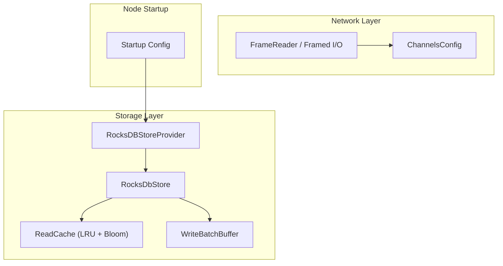
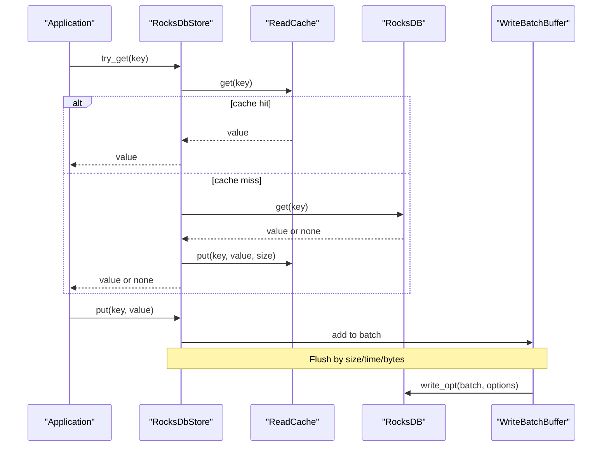
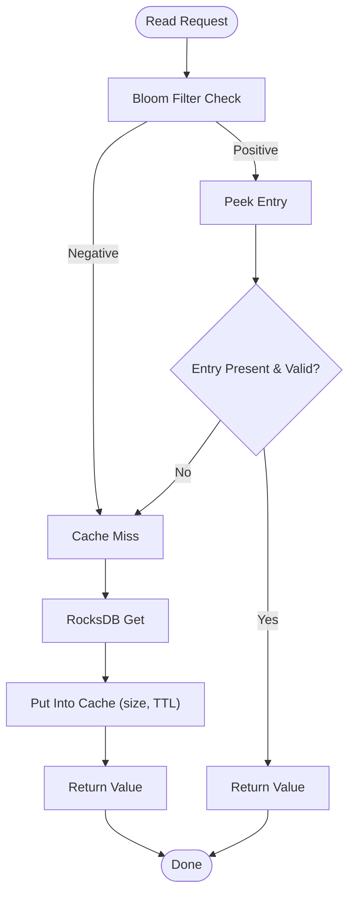
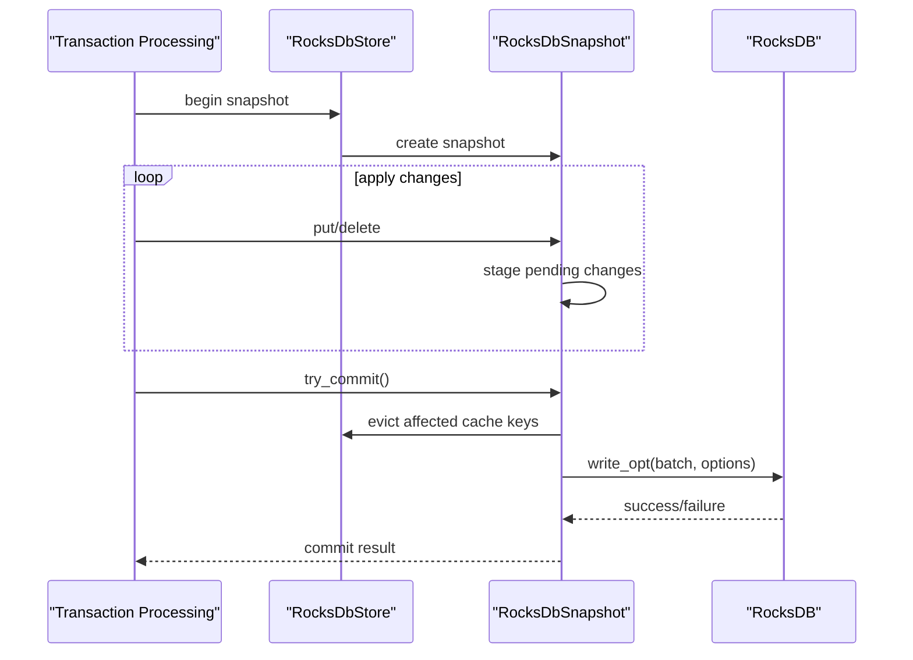
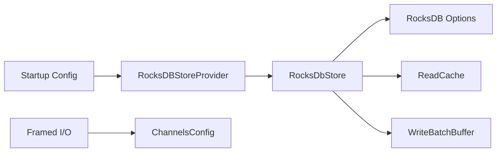

# I/O Optimization

<cite>
**Referenced Files in This Document**
- [neo-core/src/persistence/providers/rocksdb/provider.rs](file://neo-core/src/persistence/providers/rocksdb/provider.rs)
- [neo-core/src/persistence/providers/rocksdb/store.rs](file://neo-core/src/persistence/providers/rocksdb/store.rs)
- [neo-storage/src/persistence/read_cache.rs](file://neo-storage/src/persistence/read_cache.rs)
- [neo-core/src/persistence/write_batch_buffer.rs](file://neo-core/src/persistence/write_batch_buffer.rs)
- [neo-core/src/network/p2p/framed.rs](file://neo-core/src/network/p2p/framed.rs)
- [neo-p2p/src/channels_config.rs](file://neo-p2p/src/channels_config.rs)
- [config/mainnet.toml](file://config/mainnet.toml)
- [neo-node/src/startup/config.rs](file://neo-node/src/startup/config.rs)
- [neo-core/src/persistence/storage.rs](file://neo-core/src/persistence/storage.rs)
- [neo-core/src/monitoring/mod.rs](file://neo-core/src/monitoring/mod.rs)
</cite>

## Table of Contents
1. Introduction
2. Project Structure
3. Core Components
4. Architecture Overview
5. Detailed Component Analysis
6. Dependency Analysis
7. Performance Considerations
8. Troubleshooting Guide
9. Conclusion

## Introduction
This document provides comprehensive I/O optimization guidance for Neo-RS blockchain operations. It focuses on RocksDB configuration tuning, caching strategies (LRU read caches with prefetch and bloom filters), network I/O optimizations (framing, timeouts, vectored writes, small-write buffering), file system I/O patterns (batching, compaction, WAL behavior), and monitoring to identify bottlenecks during high-throughput scenarios such as initial sync and steady-state block processing.

## Project Structure
Neo-RS separates storage, networking, and node startup concerns into distinct modules:
- Storage provider and store implement RocksDB-backed persistence with configurable options, read-ahead, snapshots, and batch commits.
- A pluggable read cache layer sits above the store to reduce disk reads via LRU eviction, TTL, prefetch hints, and negative lookups using a bloom filter.
- Network framing handles bounded reads, timeouts, and efficient writes with optional vectored I/O and small-write buffering.
- Node startup wires environment-driven batch profiles into the storage provider.

**Diagram sources**
- [neo-core/src/persistence/providers/rocksdb/provider.rs:35-131](file://neo-core/src/persistence/providers/rocksdb/provider.rs#L35-L131)
- [neo-core/src/persistence/providers/rocksdb/store.rs:29-85](file://neo-core/src/persistence/providers/rocksdb/store.rs#L29-L85)
- [neo-storage/src/persistence/read_cache.rs:327-364](file://neo-storage/src/persistence/read_cache.rs#L327-L364)
- [neo-core/src/persistence/write_batch_buffer.rs:195-228](file://neo-core/src/persistence/write_batch_buffer.rs#L195-L228)
- [neo-core/src/network/p2p/framed.rs:99-144](file://neo-core/src/network/p2p/framed.rs#L99-L144)
- [neo-p2p/src/channels_config.rs:14-39](file://neo-p2p/src/channels_config.rs#L14-L39)
- [neo-node/src/startup/config.rs:44-83](file://neo-node/src/startup/config.rs#L44-L83)

**Section sources**
- [neo-core/src/persistence/providers/rocksdb/provider.rs:35-131](file://neo-core/src/persistence/providers/rocksdb/provider.rs#L35-L131)
- [neo-core/src/persistence/providers/rocksdb/store.rs:29-85](file://neo-core/src/persistence/providers/rocksdb/store.rs#L29-L85)
- [neo-storage/src/persistence/read_cache.rs:327-364](file://neo-storage/src/persistence/read_cache.rs#L327-L364)
- [neo-core/src/persistence/write_batch_buffer.rs:195-228](file://neo-core/src/persistence/write_batch_buffer.rs#L195-L228)
- [neo-core/src/network/p2p/framed.rs:99-144](file://neo-core/src/network/p2p/framed.rs#L99-L144)
- [neo-p2p/src/channels_config.rs:14-39](file://neo-p2p/src/channels_config.rs#L14-L39)
- [neo-node/src/startup/config.rs:44-83](file://neo-node/src/startup/config.rs#L44-L83)

## Core Components
- RocksDB Store Provider: Builds DB options, compaction strategy, compression, cache sizes, background jobs, memtable sizing, and read-ahead settings. Exposes builder methods to enable/disable bloom filters and read-ahead, and to inject a read cache config.
- RocksDbStore: Implements point reads/writes, iterators, snapshots, fast-sync mode toggles, flush helpers, and integrates with the read cache and batch committer.
- Read Cache: LRU-based cache with TTL, prefetch thresholds, bloom-filter negative lookups, and detailed stats.
- Write Batch Buffer: Batches writes by size/time/bytes, with durable/high-throughput/balanced presets and statistics.
- Network Framing: Time-bounded reads, stepwise decoding, vectored writes, and small-write buffering to reduce syscalls.
- ChannelsConfig: P2P connection limits, handshake/active timeouts, write/shutdown timeouts, and compression toggle.

**Section sources**
- [neo-core/src/persistence/providers/rocksdb/provider.rs:243-333](file://neo-core/src/persistence/providers/rocksdb/provider.rs#L243-L333)
- [neo-core/src/persistence/providers/rocksdb/store.rs:38-85](file://neo-core/src/persistence/providers/rocksdb/store.rs#L38-L85)
- [neo-storage/src/persistence/read_cache.rs:242-364](file://neo-storage/src/persistence/read_cache.rs#L242-L364)
- [neo-core/src/persistence/write_batch_buffer.rs:127-228](file://neo-core/src/persistence/write_batch_buffer.rs#L127-L228)
- [neo-core/src/network/p2p/framed.rs:99-144](file://neo-core/src/network/p2p/framed.rs#L99-L144)
- [neo-p2p/src/channels_config.rs:14-39](file://neo-p2p/src/channels_config.rs#L14-L39)

## Architecture Overview
The storage pipeline optimizes both reads and writes:
- Reads may hit the in-memory LRU cache first; misses go through RocksDB with read-ahead and bloom filters enabled.
- Writes are buffered and committed in batches; durability vs throughput is selectable via environment-driven profiles.
- Snapshots provide consistent views without polluting shared caches.
- Network I/O uses bounded timeouts, stepwise reads, and vectored writes to minimize overhead.

**Diagram sources**
- [neo-core/src/persistence/providers/rocksdb/store.rs:150-172](file://neo-core/src/persistence/providers/rocksdb/store.rs#L150-L172)
- [neo-storage/src/persistence/read_cache.rs:400-454](file://neo-storage/src/persistence/read_cache.rs#L400-L454)
- [neo-core/src/persistence/write_batch_buffer.rs:245-253](file://neo-core/src/persistence/write_batch_buffer.rs#L245-L253)
- [neo-core/src/persistence/providers/rocksdb/provider.rs:243-333](file://neo-core/src/persistence/providers/rocksdb/provider.rs#L243-L333)

## Detailed Component Analysis

### RocksDB Configuration Tuning
Key tunables exposed via StorageConfig and build_db_options:
- Compression: None/LZ4/Zstandard selected from configuration.
- Compaction strategy: Level/Universal/FIFO.
- Background parallelism: set to available_parallelism when possible.
- bytes_per_sync: smooths I/O instead of bursts.
- Memtable sizing: write_buffer_size default tuned for heavy write workloads; max_write_buffer_number increased; min_write_buffer_number_to_merge set.
- Filters: optimize_filters_for_hits when bloom filters enabled; SST-level bloom filters configured; index/filter blocks cached and optionally pinned.
- Block cache and row cache: sized from cache_size; row cache clamped to sensible bounds.
- Windows-specific mmap reads disabled to avoid soft page faults; mmap writes disabled; pipelined writes enabled.
- WAL cap and level-zero triggers tuned to delay write stalls during heavy sync.

Operational toggles:
- Fast sync mode: switches to high-throughput batch config and disables auto compactions temporarily.
- Read-ahead: configurable per iterator via ReadAheadConfig.

Recommended practices:
- Use balanced/durable/high_throughput batch profiles based on workload and crash tolerance.
- For initial sync, prefer larger write buffers and higher memtable counts; ensure WAL cap prevents unbounded growth.
- Enable bloom filters for point lookups; tune FPR and capacity if needed.
- Monitor memtable and flush metrics to adjust buffer sizes.

**Section sources**
- [neo-core/src/persistence/providers/rocksdb/provider.rs:243-333](file://neo-core/src/persistence/providers/rocksdb/provider.rs#L243-L333)
- [neo-core/src/persistence/providers/rocksdb/store.rs:734-768](file://neo-core/src/persistence/providers/rocksdb/store.rs#L734-L768)
- [neo-core/src/persistence/storage.rs:46-80](file://neo-core/src/persistence/storage.rs#L46-L80)
- [neo-node/src/startup/config.rs:57-83](file://neo-node/src/startup/config.rs#L57-L83)

### Caching Strategies
Read cache features:
- LRU eviction with entry count and byte-size limits.
- Optional TTL per entry.
- Prefetch decisions based on access thresholds and prefetch count.
- Negative lookup bloom filter to short-circuit misses quickly.
- Comprehensive stats: hits, misses, evictions, prefetches, bloom effectiveness.

Integration points:
- Point reads check cache before hitting RocksDB; successful reads populate cache with estimated size.
- Iterators also feed the cache during scans.
- On writes/snapshots, affected keys are evicted from cache to maintain consistency.

Configuration presets:
- Default, high_memory, low_memory, no_prefetch to match memory budgets and latency targets.

**Diagram sources**
- [neo-storage/src/persistence/read_cache.rs:371-454](file://neo-storage/src/persistence/read_cache.rs#L371-L454)
- [neo-core/src/persistence/providers/rocksdb/store.rs:150-172](file://neo-core/src/persistence/providers/rocksdb/store.rs#L150-L172)

**Section sources**
- [neo-storage/src/persistence/read_cache.rs:242-454](file://neo-storage/src/persistence/read_cache.rs#L242-L454)
- [neo-core/src/persistence/providers/rocksdb/store.rs:150-237](file://neo-core/src/persistence/providers/rocksdb/store.rs#L150-L237)

### Network I/O Optimization
Framing and transport:
- FrameReader performs bounded reads with separate timeouts for handshake vs active sessions.
- Stepwise reads release locks between steps to prevent writer starvation.
- Vectored writes reduce syscalls for multi-buffer messages; fallback to single writes when not beneficial.
- Small-write buffering coalesces multiple small frames to reduce overhead.

Channel configuration:
- Connection caps, per-address limits, inventory deduplication, broadcast history retention.
- Handshake and active read timeouts, write timeout, shutdown timeout.

Best practices:
- Tune timeouts to balance responsiveness and resilience.
- Keep vectored IO enabled where supported; use small-write buffering for bursty messaging.
- Limit concurrent connections to match CPU and disk I/O capacity.

**Section sources**
- [neo-core/src/network/p2p/framed.rs:99-144](file://neo-core/src/network/p2p/framed.rs#L99-L144)
- [neo-core/src/network/p2p/framed.rs:221-294](file://neo-core/src/network/p2p/framed.rs#L221-L294)
- [neo-core/src/network/p2p/framed.rs:667-734](file://neo-core/src/network/p2p/framed.rs#L667-L734)
- [neo-p2p/src/channels_config.rs:14-39](file://neo-p2p/src/channels_config.rs#L14-L39)

### File System I/O Patterns and Batch Operations
- Write batching: configurable by operation count, time window, and byte threshold; supports durable and high-throughput presets.
- Snapshot commits: staged writes merged with historical view; evict stale cache entries prior to commit to avoid races.
- Compaction and WAL: adjustable compaction style; WAL capped to prevent runaway growth; level-zero triggers delayed to sustain throughput under heavy writes.
- Read-ahead: sequential scans benefit from read-ahead size and cache fill policies.

**Diagram sources**
- [neo-core/src/persistence/providers/rocksdb/store.rs:367-416](file://neo-core/src/persistence/providers/rocksdb/store.rs#L367-L416)
- [neo-core/src/persistence/providers/rocksdb/store.rs:665-726](file://neo-core/src/persistence/providers/rocksdb/store.rs#L665-L726)
- [neo-core/src/persistence/providers/rocksdb/provider.rs:243-333](file://neo-core/src/persistence/providers/rocksdb/provider.rs#L243-L333)

**Section sources**
- [neo-core/src/persistence/write_batch_buffer.rs:127-228](file://neo-core/src/persistence/write_batch_buffer.rs#L127-L228)
- [neo-core/src/persistence/providers/rocksdb/store.rs:665-726](file://neo-core/src/persistence/providers/rocksdb/store.rs#L665-L726)
- [neo-core/src/persistence/providers/rocksdb/provider.rs:243-333](file://neo-core/src/persistence/providers/rocksdb/provider.rs#L243-L333)

### Environment-Driven Batch Profiles
Startup code selects a RocksDB batch profile from an environment variable:
- Balanced (default)
- Durable (sync-on-flush, WAL enabled)
- High-throughput (WAL disabled, larger batches)

This allows runtime tuning without code changes, suitable for different phases like initial sync vs steady state.

**Section sources**
- [neo-node/src/startup/config.rs:44-83](file://neo-node/src/startup/config.rs#L44-L83)

### Monitoring and Metrics
- Lightweight performance monitor records metrics, evaluates thresholds, and triggers alerts.
- Storage layers expose stats for batch commits and read cache (hits, misses, evictions, prefetch effectiveness).
- Use these signals to detect bottlenecks: rising miss rates, increasing evictions, long flush durations, or frequent timeouts.

**Section sources**
- [neo-core/src/monitoring/mod.rs:400-443](file://neo-core/src/monitoring/mod.rs#L400-L443)
- [neo-storage/src/persistence/read_cache.rs:42-125](file://neo-storage/src/persistence/read_cache.rs#L42-L125)
- [neo-core/src/persistence/write_batch_buffer.rs:24-45](file://neo-core/src/persistence/write_batch_buffer.rs#L24-L45)

## Dependency Analysis
High-level dependencies among I/O components:
- Startup config depends on environment variables to select batch profile and constructs the RocksDBStoreProvider.
- RocksDBStoreProvider composes RocksDbStore with read cache and bloom/read-ahead flags.
- RocksDbStore depends on RocksDB Options built from StorageConfig and ReadAheadConfig.
- Network framing depends on ChannelsConfig for timeouts and capabilities.

**Diagram sources**
- [neo-node/src/startup/config.rs:44-83](file://neo-node/src/startup/config.rs#L44-L83)
- [neo-core/src/persistence/providers/rocksdb/provider.rs:35-131](file://neo-core/src/persistence/providers/rocksdb/provider.rs#L35-L131)
- [neo-core/src/persistence/providers/rocksdb/store.rs:29-85](file://neo-core/src/persistence/providers/rocksdb/store.rs#L29-L85)
- [neo-core/src/network/p2p/framed.rs:99-144](file://neo-core/src/network/p2p/framed.rs#L99-L144)
- [neo-p2p/src/channels_config.rs:14-39](file://neo-p2p/src/channels_config.rs#L14-L39)

**Section sources**
- [neo-node/src/startup/config.rs:44-83](file://neo-node/src/startup/config.rs#L44-L83)
- [neo-core/src/persistence/providers/rocksdb/provider.rs:35-131](file://neo-core/src/persistence/providers/rocksdb/provider.rs#L35-L131)
- [neo-core/src/persistence/providers/rocksdb/store.rs:29-85](file://neo-core/src/persistence/providers/rocksdb/store.rs#L29-L85)
- [neo-core/src/network/p2p/framed.rs:99-144](file://neo-core/src/network/p2p/framed.rs#L99-L144)
- [neo-p2p/src/channels_config.rs:14-39](file://neo-p2p/src/channels_config.rs#L14-L39)

## Performance Considerations
- Initial sync:
  - Prefer high-throughput batch profile; consider disabling WAL temporarily during fast sync mode.
  - Increase write buffer size and memtable count to reduce flush frequency.
  - Delay level-zero write throttling via tuned triggers; cap WAL size to avoid excessive growth.
- Steady state:
  - Use balanced or durable profiles depending on crash tolerance.
  - Enable bloom filters and read-ahead for scan-heavy paths.
  - Size block cache and row cache to fit working set; pin index/filter blocks if hot.
- Network:
  - Use vectored writes and small-write buffering to reduce syscalls.
  - Set appropriate timeouts to fail fast on silent peers while allowing progress across partial frames.
- Monitoring:
  - Track cache hit rate, prefetch effectiveness, and bloom filter negatives.
  - Watch batch flush duration, ops per flush, and pending bytes to tune thresholds.

[No sources needed since this section provides general guidance]

## Troubleshooting Guide
Common issues and mitigations:
- Slow reads:
  - Inspect read cache hit rate and prefetch effectiveness; increase cache size or adjust TTL if necessary.
  - Verify bloom filter is enabled and tuned; check negative lookup rate.
- Write stalls during sync:
  - Review memtable sizes and flush frequency; adjust write_buffer_size and max_write_buffer_number.
  - Ensure level-zero triggers are set to delay throttling; verify WAL cap is sufficient.
- Timeouts and backpressure:
  - Adjust handshake and active read timeouts; ensure stepwise reads are not holding locks too long.
  - Validate vectored write paths and small-write buffering thresholds.
- Data integrity:
  - Confirm snapshot commit evicts stale cache entries before writing to avoid race conditions.
  - Use durable batch profile when crash safety is critical.

**Section sources**
- [neo-storage/src/persistence/read_cache.rs:400-454](file://neo-storage/src/persistence/read_cache.rs#L400-L454)
- [neo-core/src/persistence/providers/rocksdb/store.rs:699-726](file://neo-core/src/persistence/providers/rocksdb/store.rs#L699-L726)
- [neo-core/src/network/p2p/framed.rs:221-294](file://neo-core/src/network/p2p/framed.rs#L221-L294)
- [neo-core/src/persistence/providers/rocksdb/provider.rs:243-333](file://neo-core/src/persistence/providers/rocksdb/provider.rs#L243-L333)

## Conclusion
Neo-RS implements a layered I/O optimization strategy tailored for blockchain workloads:
- RocksDB is tuned for both read and write intensity with configurable compaction, compression, caching, and WAL behavior.
- An LRU read cache with prefetch and bloom filters reduces disk pressure and improves latency.
- Network I/O leverages bounded timeouts, stepwise reads, vectored writes, and small-write buffering for robustness and efficiency.
- Environment-driven batch profiles allow dynamic tuning across sync phases.
- Monitoring hooks and stats enable continuous tuning and bottleneck identification for high-throughput scenarios.

[No sources needed since this section summarizes without analyzing specific files]