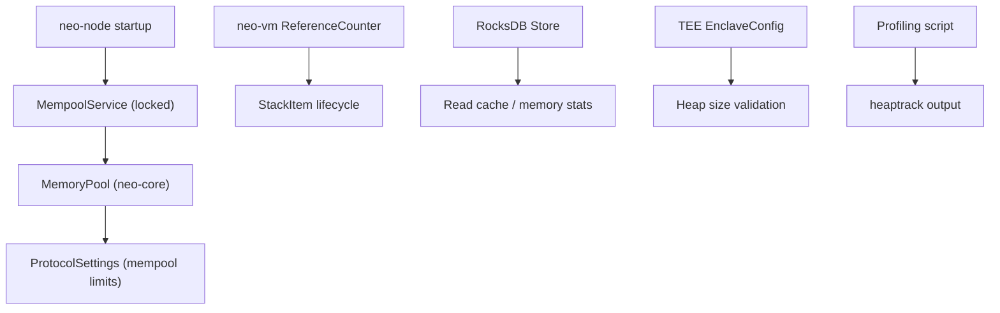
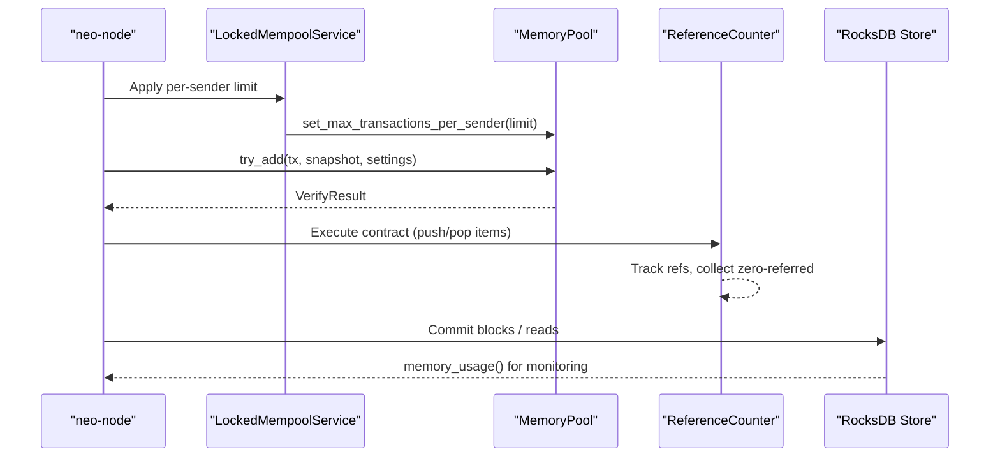
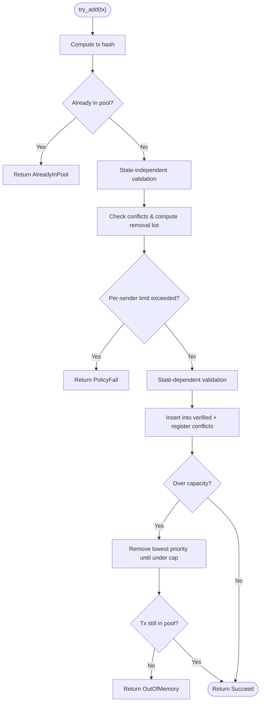
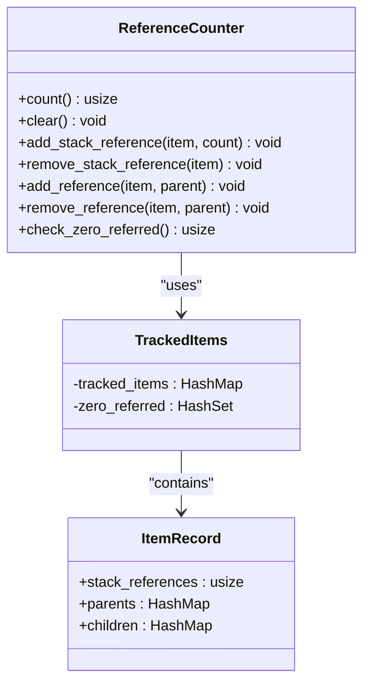
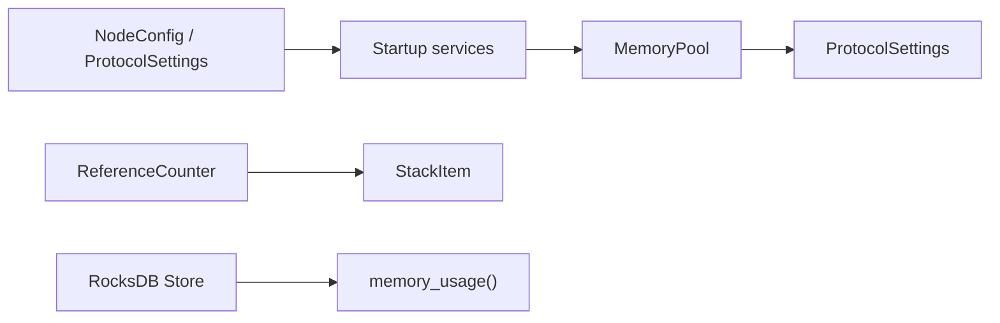

# Memory Management

<cite>
**Referenced Files in This Document**
- [Cargo.toml](file://Cargo.toml)
- [mainnet.toml](file://config/mainnet.toml)
- [mod.rs](file://neo-core/src/ledger/memory_pool/mod.rs)
- [services.rs](file://neo-node/src/startup/services.rs)
- [reference_counter.rs](file://neo-vm/src/reference_counter.rs)
- [evaluation_stack.rs](file://neo-vm/src/evaluation_stack.rs)
- [slot.rs](file://neo-vm/src/slot.rs)
- [store.rs](file://neo-core/src/persistence/providers/rocksdb/store.rs)
- [memory-profile.sh](file://scripts/profiling/memory-profile.sh)
- [runtime.rs](file://neo-tee/src/enclave/runtime.rs)
</cite>

## Table of Contents
1. [Introduction](#introduction)
2. [Project Structure](#project-structure)
3. [Core Components](#core-components)
4. [Architecture Overview](#architecture-overview)
5. [Detailed Component Analysis](#detailed-component-analysis)
6. [Dependency Analysis](#dependency-analysis)
7. [Performance Considerations](#performance-considerations)
8. [Troubleshooting Guide](#troubleshooting-guide)
9. [Conclusion](#conclusion)
10. [Appendices](#appendices)

## Introduction
This document explains how Neo-RS manages memory for high-performance blockchain operations. It covers the transaction memory pool, VM reference counting and stack item lifecycle, storage-backed caches, enclave heap configuration, and profiling/monitoring practices. The goal is to help operators and developers configure memory limits, avoid leaks, and optimize memory-intensive paths such as block processing and smart contract execution.

## Project Structure
Neo-RS organizes memory-sensitive subsystems across crates:
- Transaction mempool in neo-core maintains verified/unverified queues with capacity and per-sender policies.
- VM runtime in neo-vm tracks references to stack items and supports zero-referred collection without a managed GC.
- Storage layer in neo-core uses RocksDB-backed stores with read caching and memory usage introspection.
- Node startup wires mempool policy from configuration into the running system.
- TEE enclave runtime exposes configurable heap size constraints.
- Profiling scripts enable heaptrack-based memory analysis.

**Diagram sources**
- [services.rs:36-53](file://neo-node/src/startup/services.rs#L36-L53)
- [mod.rs:63-118](file://neo-core/src/ledger/memory_pool/mod.rs#L63-L118)
- [reference_counter.rs:21-72](file://neo-vm/src/reference_counter.rs#L21-L72)
- [store.rs:760-797](file://neo-core/src/persistence/providers/rocksdb/store.rs#L760-L797)
- [runtime.rs:34-76](file://neo-tee/src/enclave/runtime.rs#L34-L76)
- [memory-profile.sh:1-27](file://scripts/profiling/memory-profile.sh#L1-L27)

**Section sources**
- [Cargo.toml:1-68](file://Cargo.toml#L1-L68)
- [mainnet.toml:53-68](file://config/mainnet.toml#L53-L68)

## Core Components
- Transaction Memory Pool: Holds verified and unverified transactions, enforces capacity and per-sender limits, handles conflicts, and revalidates over time budgets.
- VM Reference Counter: Tracks compound stack items, supports zero-referred collection, and avoids per-item allocations by batching reference updates.
- Storage Read Cache and Stats: Provides optional read caching and exposes RocksDB memory metrics for monitoring.
- Enclave Heap Configuration: Validates and constrains enclave heap sizes and thread control structures.
- Profiling Tooling: Scripted workflow to build with debug symbols and capture heap profiles via heaptrack.

**Section sources**
- [mod.rs:63-118](file://neo-core/src/ledger/memory_pool/mod.rs#L63-L118)
- [reference_counter.rs:21-72](file://neo-vm/src/reference_counter.rs#L21-L72)
- [store.rs:760-797](file://neo-core/src/persistence/providers/rocksdb/store.rs#L760-L797)
- [runtime.rs:34-76](file://neo-tee/src/enclave/runtime.rs#L34-L76)
- [memory-profile.sh:1-27](file://scripts/profiling/memory-profile.sh#L1-L27)

## Architecture Overview
The runtime composes several memory-critical layers:
- Node startup applies mempool policy from configuration to the locked mempool service.
- Incoming transactions are validated and inserted into the mempool, which may evict lower-priority or conflicting entries.
- Smart contract execution uses the VM engine; stack items are tracked by a shared reference counter that can collect zero-referred cycles.
- Persistence writes go through RocksDB-backed stores with optional read caching; memory usage can be queried for observability.
- If using TEE, enclave heap size is validated at initialization.

**Diagram sources**
- [services.rs:36-53](file://neo-node/src/startup/services.rs#L36-L53)
- [mod.rs:236-384](file://neo-core/src/ledger/memory_pool/mod.rs#L236-L384)
- [reference_counter.rs:74-142](file://neo-vm/src/reference_counter.rs#L74-L142)
- [store.rs:760-797](file://neo-core/src/persistence/providers/rocksdb/store.rs#L760-L797)

## Detailed Component Analysis

### Transaction Memory Pool
Responsibilities:
- Maintain verified and unverified transaction sets with capacity limits.
- Enforce per-sender transaction limits configured at node startup.
- Handle conflict detection and eviction, and rebroadcast timing based on block time.
- Reverify unverified transactions within per-block time budgets.

Key behaviors:
- Capacity enforcement removes lowest-priority candidates when over capacity.
- Conflict resolution considers signers and fee thresholds before eviction.
- Time-bounded reverification prevents excessive CPU during backlog handling.

**Diagram sources**
- [mod.rs:236-384](file://neo-core/src/ledger/memory_pool/mod.rs#L236-L384)
- [mod.rs:685-718](file://neo-core/src/ledger/memory_pool/mod.rs#L685-L718)

Configuration and wiring:
- Mempool capacity derives from protocol settings.
- Per-sender limit is applied at startup from node configuration.

**Section sources**
- [mod.rs:93-118](file://neo-core/src/ledger/memory_pool/mod.rs#L93-L118)
- [services.rs:36-53](file://neo-node/src/startup/services.rs#L36-L53)
- [mainnet.toml:57-58](file://config/mainnet.toml#L57-L58)

### VM Reference Counting and Stack Item Lifecycle
Responsibilities:
- Track references to compound stack items (arrays, structs, maps, buffers).
- Provide lock-free global reference count updates for primitives.
- Collect zero-referred components, including cycles, without blocking the hot path.

Patterns:
- Batch reference accounting for slot creation reduces mutex contention.
- Type-specific identity mapping enables efficient tracking without per-item overhead.
- Compatibility checks ensure mixed reference counters do not corrupt state.

**Diagram sources**
- [reference_counter.rs:21-72](file://neo-vm/src/reference_counter.rs#L21-L72)
- [reference_counter.rs:344-464](file://neo-vm/src/reference_counter.rs#L344-L464)

Lifecycle integration:
- Slot constructors batch Null item references to minimize overhead.
- Evaluation stack ensures reference counter compatibility across nested structures.

**Section sources**
- [slot.rs:50-81](file://neo-vm/src/slot.rs#L50-L81)
- [evaluation_stack.rs:234-275](file://neo-vm/src/evaluation_stack.rs#L234-L275)
- [reference_counter.rs:74-142](file://neo-vm/src/reference_counter.rs#L74-L142)

### Storage Layer and Memory Usage
Responsibilities:
- Provide persistent storage backed by RocksDB with optional read caching.
- Expose memory usage metrics for active and all memtables.
- Support flushing WAL and memtables for durability controls.

Operational notes:
- Read cache can be enabled/disabled to trade off memory vs. performance.
- Memory usage queries support monitoring dashboards and alerts.

**Section sources**
- [store.rs:760-797](file://neo-core/src/persistence/providers/rocksdb/store.rs#L760-L797)

### Enclave Heap Configuration
Responsibilities:
- Validate enclave heap size and thread control structure counts at startup.
- Reject invalid configurations to prevent misconfiguration-induced memory issues.

Operational guidance:
- Set heap_size_mb within allowed bounds to match workload needs.
- Adjust tcs_count according to concurrency requirements while respecting limits.

**Section sources**
- [runtime.rs:34-76](file://neo-tee/src/enclave/runtime.rs#L34-L76)

### Profiling and Leak Detection
Tooling:
- A provided script builds with debug symbols and runs the node under heaptrack to produce memory profiles.
- Use the generated profile files to identify allocation hotspots and potential leaks.

Usage pattern:
- Build release with debug info.
- Run the node binary wrapped by heaptrack.
- Analyze outputs with heaptrack GUI or CLI tools.

**Section sources**
- [memory-profile.sh:1-27](file://scripts/profiling/memory-profile.sh#L1-L27)

## Dependency Analysis
High-level dependencies relevant to memory management:
- Node startup depends on configuration to apply mempool policies.
- Memory pool depends on protocol settings for capacity and time budgets.
- VM reference counter depends on stack item types and Tarjan-based cycle detection.
- Storage store depends on RocksDB properties for memory introspection.

**Diagram sources**
- [services.rs:36-53](file://neo-node/src/startup/services.rs#L36-L53)
- [mod.rs:93-118](file://neo-core/src/ledger/memory_pool/mod.rs#L93-L118)
- [reference_counter.rs:74-142](file://neo-vm/src/reference_counter.rs#L74-L142)
- [store.rs:760-797](file://neo-core/src/persistence/providers/rocksdb/store.rs#L760-L797)

**Section sources**
- [Cargo.toml:113-241](file://Cargo.toml#L113-L241)

## Performance Considerations
- Preallocate mempool indices during initial sync to reduce reallocations.
- Use per-sender limits to bound memory pressure from spamming senders.
- Prefer batch reference updates for VM slots to minimize locking overhead.
- Enable read caching selectively based on workload patterns and available memory.
- Tune RocksDB batch profiles for throughput vs. durability trade-offs.
- Monitor RocksDB memtable sizes and flush proactively if needed.

[No sources needed since this section provides general guidance]

## Troubleshooting Guide
Common issues and mitigations:
- Out-of-memory during mempool growth:
  - Reduce max_transactions or tighten per-sender limits.
  - Investigate conflict-driven evictions and rebroadcast behavior.
- VM memory spikes:
  - Ensure proper reference accounting for arrays/structs/maps.
  - Trigger zero-referred collection periodically to reclaim cycles.
- Storage memory pressure:
  - Inspect RocksDB memtable sizes via memory_usage().
  - Flush WAL/memtables if necessary to free memory.
- Enclave initialization failures:
  - Validate heap_size_mb and tcs_count against allowed ranges.

**Section sources**
- [mod.rs:236-384](file://neo-core/src/ledger/memory_pool/mod.rs#L236-L384)
- [reference_counter.rs:144-269](file://neo-vm/src/reference_counter.rs#L144-L269)
- [store.rs:760-797](file://neo-core/src/persistence/providers/rocksdb/store.rs#L760-L797)
- [runtime.rs:53-76](file://neo-tee/src/enclave/runtime.rs#L53-L76)

## Conclusion
Neo-RS employs targeted memory strategies suited to blockchain workloads: a bounded, policy-driven transaction mempool; a lock-efficient VM reference counter with cycle-aware collection; and a storage layer exposing memory metrics for observability. Operators should tune mempool capacities, per-sender limits, and storage caching to match deployment profiles, and use profiling tools to validate memory behavior under load.

[No sources needed since this section summarizes without analyzing specific files]

## Appendices

### Configuration Quick Reference
- Mempool capacity: set via protocol settings and/or node configuration.
- Per-sender limit: applied at startup from node configuration.
- RocksDB batch profile: controlled via environment variable for write behavior.
- Enclave heap: validate heap_size_mb and tcs_count at initialization.

**Section sources**
- [mainnet.toml:53-68](file://config/mainnet.toml#L53-L68)
- [services.rs:36-53](file://neo-node/src/startup/services.rs#L36-L53)
- [runtime.rs:34-76](file://neo-tee/src/enclave/runtime.rs#L34-L76)