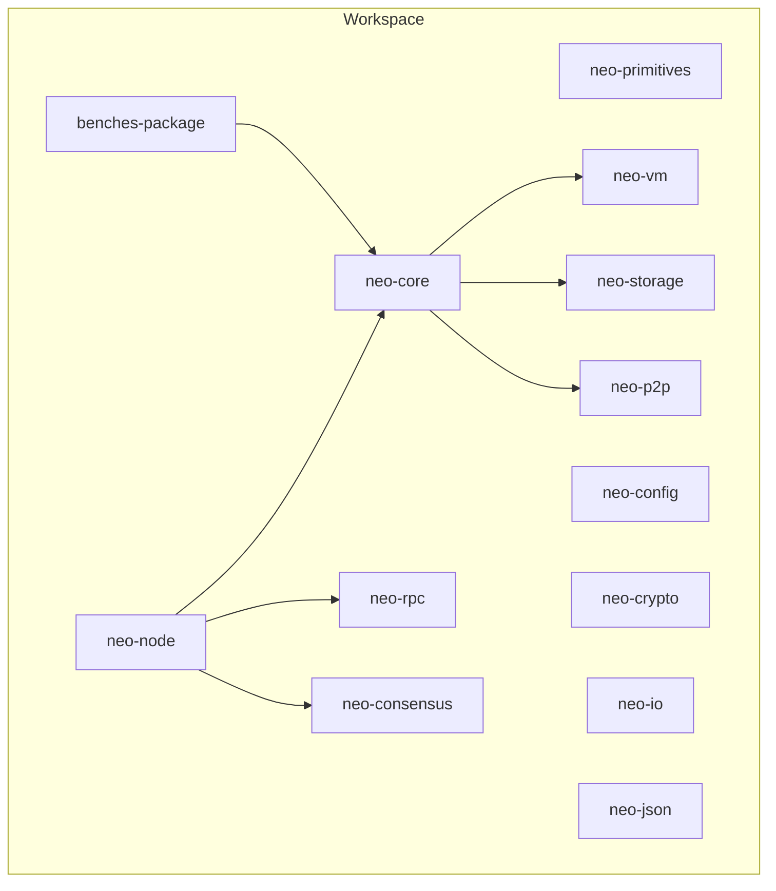
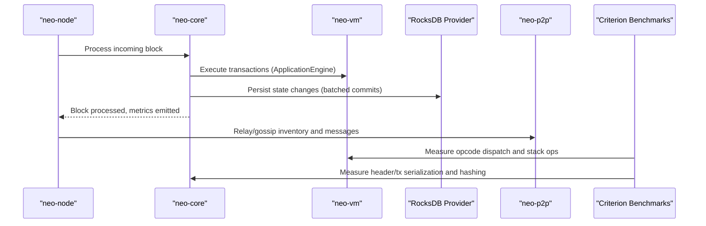
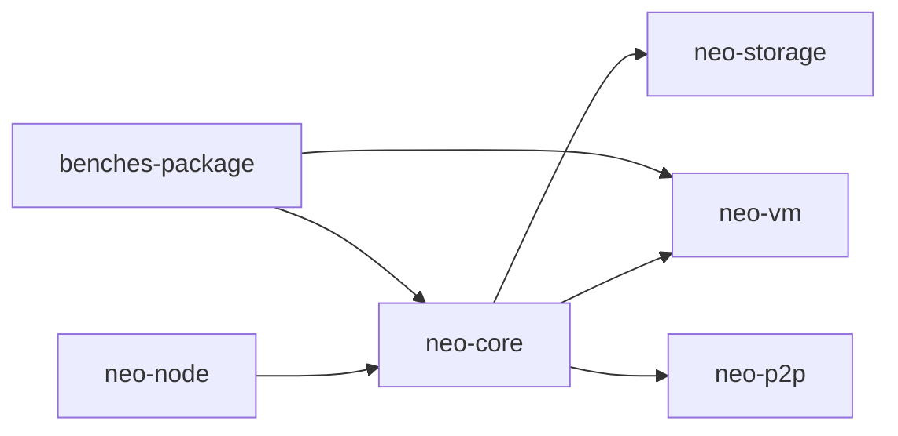

# Performance Optimization

<cite>
**Referenced Files in This Document**
- [Cargo.toml](file://Cargo.toml)
- [PERFORMANCE.md](file://PERFORMANCE.md)
- [docs/performance-optimizations.md](file://docs/performance-optimizations.md)
- [docs/profiling.md](file://docs/profiling.md)
- [config/perf-validate.toml](file://config/perf-validate.toml)
- [benches-package/Cargo.toml](file://benches-package/Cargo.toml)
- [benches-package/benches/block_processing.rs](file://benches-package/benches/block_processing.rs)
- [benches-package/benches/vm_execution.rs](file://benches-package/benches/vm_execution.rs)
- [neo-core/src/persistence/providers/rocksdb/provider.rs](file://neo-core/src/persistence/providers/rocksdb/provider.rs)
- [neo-core/src/persistence/providers/rocksdb/store.rs](file://neo-core/src/persistence/providers/rocksdb/store.rs)
- [neo-core/src/network/p2p/connection.rs](file://neo-core/src/network/p2p/connection.rs)
- [neo-core/src/actors/scheduler.rs](file://neo-core/src/actors/scheduler.rs)
- [neo-core/src/actors/mod.rs](file://neo-core/src/actors/mod.rs)
</cite>

## Table of Contents
1. Introduction
2. Project Structure
3. Core Components
4. Architecture Overview
5. Detailed Component Analysis
6. Dependency Analysis
7. Performance Considerations
8. Troubleshooting Guide
9. Conclusion
10. Appendices

## Introduction
This document provides a comprehensive performance optimization guide for Neo-RS blockchain operations. It focuses on memory management, concurrency with Tokio and Rayon, I/O optimization via caching and RocksDB tuning, benchmarking methodologies, profiling tools, and targeted optimizations for block processing, transaction validation, smart contract execution, and P2P communication. The guidance includes strategies to identify bottlenecks, measure impact, and implement improvements safely while preserving protocol correctness.

## Project Structure
Neo-RS is organized as a Cargo workspace with layered crates: primitives, storage, IO, VM, core, P2P, RPC, consensus, telemetry, and the node application. Benchmarks are isolated under benches-package and use Criterion. Configuration files define runtime behavior for performance-oriented runs (e.g., perf-validate).

**Section sources**
- [Cargo.toml:1-82](file://Cargo.toml#L1-L82)

## Core Components
Key performance-relevant components include:
- Storage provider and RocksDB configuration for high-throughput reads/writes and cache tuning
- P2P connection layer with buffered and vectored writes to reduce syscalls and allocations
- Actor system built on Tokio for async scheduling and supervision
- Benchmark suite for serialization, hashing, and VM execution hot paths
- Configuration profiles enabling performance-focused runs

**Section sources**
- [neo-core/src/persistence/providers/rocksdb/provider.rs:290-316](file://neo-core/src/persistence/providers/rocksdb/provider.rs#L290-L316)
- [neo-core/src/network/p2p/connection.rs:1-48](file://neo-core/src/network/p2p/connection.rs#L1-L48)
- [neo-core/src/actors/scheduler.rs:1-51](file://neo-core/src/actors/scheduler.rs#L1-L51)
- [benches-package/benches/block_processing.rs:1-117](file://benches-package/benches/block_processing.rs#L1-L117)
- [benches-package/benches/vm_execution.rs:1-120](file://benches-package/benches/vm_execution.rs#L1-L120)
- [config/perf-validate.toml:1-59](file://config/perf-validate.toml#L1-L59)

## Architecture Overview
The runtime orchestrates asynchronous tasks via Tokio, processes blocks through the core engine, persists state using RocksDB with tuned caches, exchanges messages over P2P with optimized framing, and exposes RPC endpoints. Benchmarks validate critical paths independently from full replay workloads.

**Diagram sources**
- [neo-core/src/persistence/providers/rocksdb/provider.rs:290-316](file://neo-core/src/persistence/providers/rocksdb/provider.rs#L290-L316)
- [neo-core/src/network/p2p/connection.rs:1-48](file://neo-core/src/network/p2p/connection.rs#L1-L48)
- [benches-package/benches/block_processing.rs:1-117](file://benches-package/benches/block_processing.rs#L1-L117)
- [benches-package/benches/vm_execution.rs:1-120](file://benches-package/benches/vm_execution.rs#L1-L120)

## Detailed Component Analysis

### Memory Management Strategies
- Allocator configuration: The workspace enables production-grade release and bench profiles with LTO and single codegen units to improve throughput and reduce binary size. These settings minimize overhead in hot paths and improve CPU utilization.
- Garbage collection avoidance: Rust’s ownership model avoids GC; the codebase emphasizes zero-copy or minimal-copy patterns in IO and networking (e.g., vectored writes, buffering).
- Memory pool usage and preallocation:
  - Data caches and LRU structures benefit from capacity preallocation to avoid rehashing and reallocation during warm-up.
  - RocksDB row cache and block cache are sized and configured to reduce page faults and repeated disk reads.
  - P2P write buffers and frame readers reduce per-message allocations.

Practical steps:
- Preallocate collections when sizes are known (e.g., HashMap, VecDeque)
- Use vectorized I/O and write buffering to amortize allocation costs
- Tune RocksDB caches based on available RAM and workload characteristics

**Section sources**
- [Cargo.toml:251-285](file://Cargo.toml#L251-L285)
- [neo-core/src/network/p2p/connection.rs:1-48](file://neo-core/src/network/p2p/connection.rs#L1-L48)
- [neo-core/src/persistence/providers/rocksdb/provider.rs:290-316](file://neo-core/src/persistence/providers/rocksdb/provider.rs#L290-L316)

### Concurrency Optimization with Tokio and Rayon
- Tokio runtime: Actors and schedulers leverage tokio::runtime::Handle for non-blocking scheduling, cancellation tokens, and time-based delays. This enables responsive message handling without blocking threads.
- Async patterns: Stepwise receive loops and cancellable schedules prevent resource leaks and allow backpressure-aware processing.
- Parallel processing: Rayon is included in the workspace dependencies for CPU-bound parallelism where appropriate (e.g., batched validations or independent computations).

Guidelines:
- Keep long-running tasks off the event loop; spawn background tasks for heavy work
- Use cancellation tokens to abort delayed tasks promptly
- Prefer lock-free or fine-grained synchronization (e.g., Arc, channels) to reduce contention

**Section sources**
- [neo-core/src/actors/scheduler.rs:1-51](file://neo-core/src/actors/scheduler.rs#L1-L51)
- [neo-core/src/actors/mod.rs:1-28](file://neo-core/src/actors/mod.rs#L1-L28)
- [Cargo.toml:141-148](file://Cargo.toml#L141-L148)
- [Cargo.toml:243-247](file://Cargo.toml#L243-L247)

### I/O Optimization: Caching, RocksDB Tuning, Network Request Batching
- RocksDB tuning:
  - mmap reads enabled on non-Windows platforms to reduce copy overhead
  - Pipelined writes enabled for higher throughput
  - Memtable prefix bloom filters and level-zero thresholds tuned to reduce stalls during sync
  - Row cache and block cache sized proportionally to available memory
- Read cache:
  - Optional read cache can be enabled/disabled at runtime to optimize point lookups
- Network request batching:
  - P2P connections buffer small writes and use vectored I/O to reduce syscall overhead
  - Framed reader/writer reduces allocations and improves throughput

Operational tips:
- Monitor RocksDB properties (active memtable size, total memtables) to detect saturation
- Adjust cache sizes based on observed hit rates and memory pressure
- Enable compression and batching where latency budgets allow

**Section sources**
- [neo-core/src/persistence/providers/rocksdb/provider.rs:290-316](file://neo-core/src/persistence/providers/rocksdb/provider.rs#L290-L316)
- [neo-core/src/persistence/providers/rocksdb/store.rs:760-797](file://neo-core/src/persistence/providers/rocksdb/store.rs#L760-L797)
- [neo-core/src/network/p2p/connection.rs:1-48](file://neo-core/src/network/p2p/connection.rs#L1-L48)

### Block Processing Optimizations
- Serialization and hashing benchmarks isolate hot paths for headers and transactions, ensuring that changes do not regress throughput.
- Avoid unnecessary clones in hot paths; prefer moving or borrowing where possible.
- Precompute and cache hashes when safe; invalidate caches on mutation.

Recommended practices:
- Use black_box in benchmarks to prevent compiler optimizations from skewing results
- Profile real-world replay scenarios to complement micro-benchmarks
- Validate protocol consistency after any change to ensure deterministic outcomes

**Section sources**
- [benches-package/benches/block_processing.rs:1-117](file://benches-package/benches/block_processing.rs#L1-L117)
- [PERFORMANCE.md:1-57](file://PERFORMANCE.md#L1-L57)
- [docs/performance-optimizations.md:1-87](file://docs/performance-optimizations.md#L1-L87)

### Transaction Validation Optimizations
- Minimize allocations in signature verification and witness checks by reusing buffers and avoiding intermediate copies.
- Batch validation where possible to amortize setup costs.
- Leverage fast hash functions and efficient data structures for quick rejection of invalid transactions.

Validation flow highlights:
- Ensure deterministic hash computation for consistent results across implementations
- Cache reusable cryptographic contexts if applicable

**Section sources**
- [benches-package/benches/block_processing.rs:82-92](file://benches-package/benches/block_processing.rs#L82-L92)

### Smart Contract Execution Optimizations
- VM execution benchmarks measure opcode dispatch, stack operations, and script parsing to identify hotspots.
- Reduce per-instruction overhead by optimizing interpreter loops and minimizing temporary allocations.
- Use strict script validation to fail fast on malformed scripts.

Execution tips:
- Profile VM execution under realistic workloads to find opcode-specific hotspots
- Consider batching independent calls when feasible

**Section sources**
- [benches-package/benches/vm_execution.rs:1-120](file://benches-package/benches/vm_execution.rs#L1-L120)

### P2P Communication Optimizations
- Buffered writes and vectored I/O reduce system call overhead and memory copies
- Frame-level streaming allows incremental decoding with deadlines to prevent slow peers from stalling
- Compression flags and broadcast limits help control bandwidth and CPU usage

Network best practices:
- Tune connection limits and desired peer counts to match network conditions
- Monitor send/receive latencies and adjust timeouts accordingly

**Section sources**
- [neo-core/src/network/p2p/connection.rs:1-48](file://neo-core/src/network/p2p/connection.rs#L1-L48)
- [config/perf-validate.toml:10-16](file://config/perf-validate.toml#L10-L16)

## Dependency Analysis
Neo-RS uses a layered dependency structure with clear boundaries:
- neo-core depends on neo-vm, neo-storage, and neo-p2p for core blockchain logic
- neo-node composes services and exposes RPC endpoints
- Benchmarks depend on core crates to measure realistic hot paths
- Tokio and Rayon provide async and parallel execution primitives

**Diagram sources**
- [Cargo.toml:1-82](file://Cargo.toml#L1-L82)
- [benches-package/Cargo.toml:1-31](file://benches-package/Cargo.toml#L1-L31)

**Section sources**
- [Cargo.toml:1-82](file://Cargo.toml#L1-L82)
- [benches-package/Cargo.toml:1-31](file://benches-package/Cargo.toml#L1-L31)

## Performance Considerations
- Release and bench profiles enable aggressive optimizations (LTO, single codegen unit) for production and benchmark builds
- RocksDB cache sizing should reflect workload patterns (point lookups vs sequential scans)
- P2P buffering and vectored writes reduce overhead under high message rates
- Use Tokio cancellation and stepwise I/O to maintain responsiveness under load
- Profile both CPU and memory to identify true bottlenecks before optimizing

[No sources needed since this section provides general guidance]

## Troubleshooting Guide
Common issues and diagnostics:
- RocksDB stalls or high latency: Check memtable sizes and WAL flush status; adjust level-zero triggers and cache sizes
- High CPU usage in VM execution: Use flamegraphs to locate opcode hotspots; consider script simplification or batching
- P2P bottlenecks: Inspect send queues and timeouts; tune connection limits and compression settings
- Memory growth: Use heap profiling to detect leaks or excessive allocations in hot paths

Profiling workflow:
- Build with debug symbols for accurate stacks
- Record CPU samples with perf and generate flamegraphs
- Capture memory traces with heaptrack and analyze allocation sites
- Run Criterion benchmarks to track regressions

**Section sources**
- [docs/profiling.md:1-97](file://docs/profiling.md#L1-L97)
- [neo-core/src/persistence/providers/rocksdb/store.rs:760-797](file://neo-core/src/persistence/providers/rocksdb/store.rs#L760-L797)

## Conclusion
Neo-RS employs a robust set of performance techniques spanning memory management, async concurrency, I/O optimization, and targeted benchmarks. By combining RocksDB tuning, Tokio-based scheduling, P2P buffering, and rigorous profiling, teams can identify and resolve bottlenecks effectively. Maintain protocol correctness and consistency while iterating on optimizations, and continuously validate improvements with both micro-benchmarks and real-workload replay tests.

[No sources needed since this section summarizes without analyzing specific files]

## Appendices

### Benchmarking Methodologies
- Use Criterion-based benchmarks for serialization, hashing, and VM execution
- Isolate micro-benchmarks from full replay to focus on specific hot paths
- Include realistic input distributions and sizes to reflect production workloads
- Track regression trends and publish reports for transparency

**Section sources**
- [benches-package/Cargo.toml:1-31](file://benches-package/Cargo.toml#L1-L31)
- [benches-package/benches/block_processing.rs:1-117](file://benches-package/benches/block_processing.rs#L1-L117)
- [benches-package/benches/vm_execution.rs:1-120](file://benches-package/benches/vm_execution.rs#L1-L120)

### Profiling Tools Usage
- CPU profiling: perf + FlameGraph for call graphs and hotspot identification
- Memory profiling: heaptrack for allocation tracking and leak detection
- Quick-start scripts provided for streamlined workflows

**Section sources**
- [docs/profiling.md:1-97](file://docs/profiling.md#L1-L97)

### Performance Regression Testing
- Integrate Criterion benchmarks into CI to catch regressions early
- Compare baseline metrics against new changes and enforce thresholds
- Validate protocol consistency alongside performance tests to ensure correctness

**Section sources**
- [benches-package/Cargo.toml:1-31](file://benches-package/Cargo.toml#L1-L31)