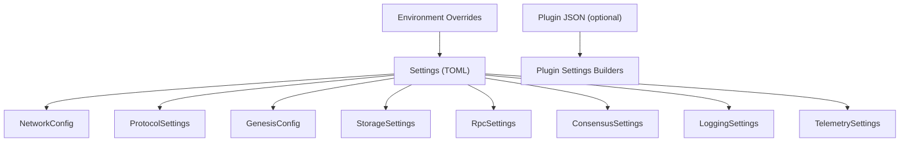
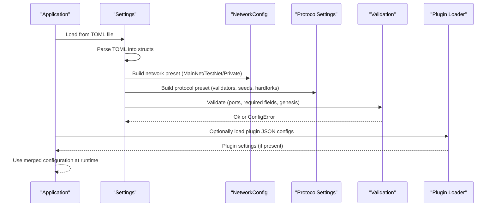
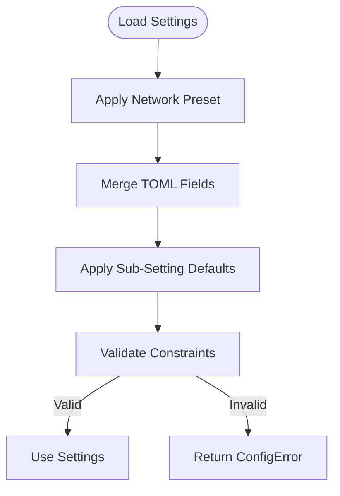
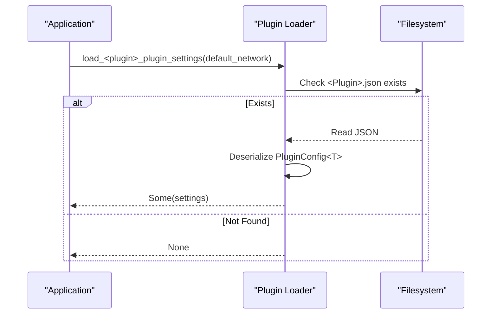
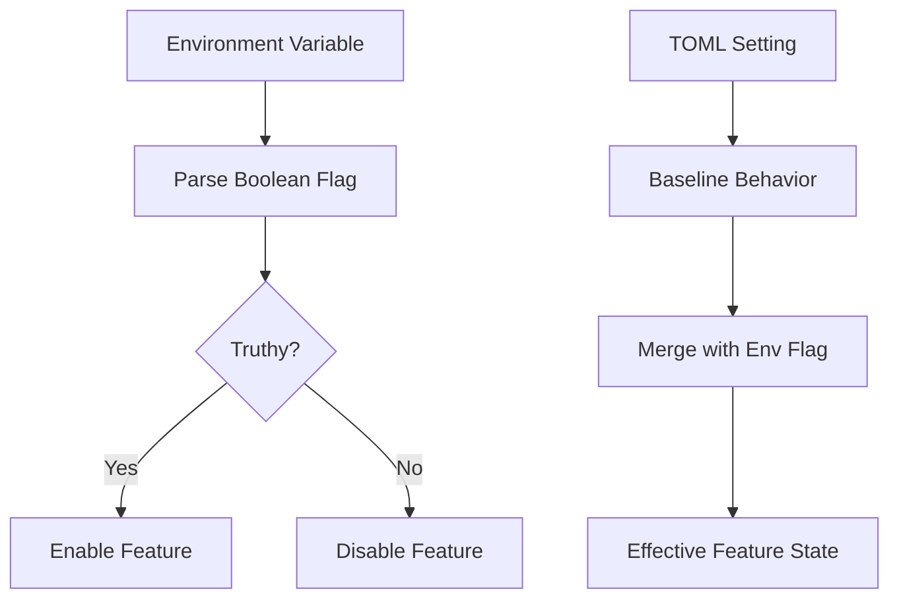
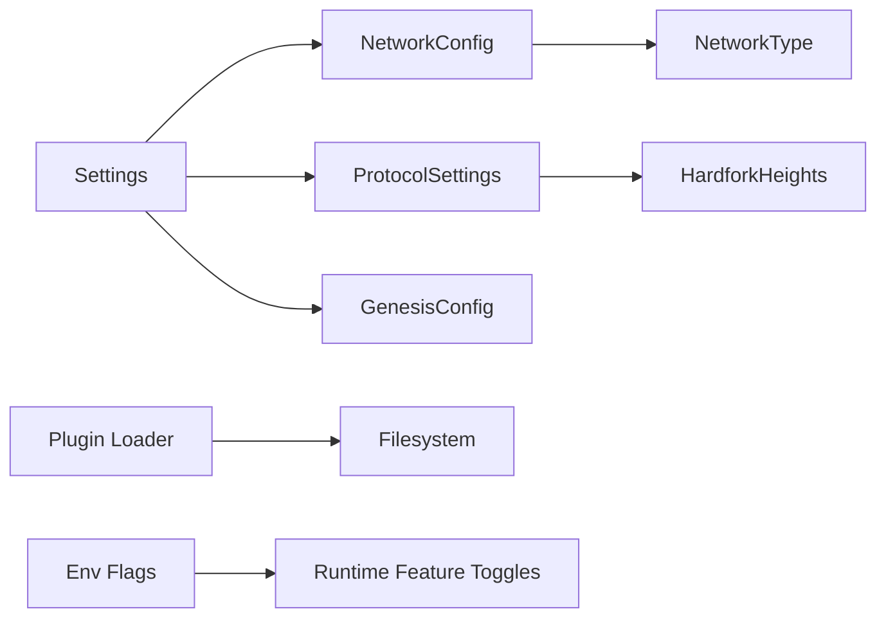

# Configuration Management

<cite>
**Referenced Files in This Document**
- [lib.rs](file://neo-config/src/lib.rs)
- [settings.rs](file://neo-config/src/settings.rs)
- [network.rs](file://neo-config/src/network.rs)
- [protocol.rs](file://neo-config/src/protocol.rs)
- [error.rs](file://neo-config/src/error.rs)
- [mainnet.toml](file://config/mainnet.toml)
- [testnet.toml](file://config/testnet.toml)
- [local.toml](file://config/local.toml)
- [plugin_settings.rs](file://neo-node/src/config/plugin_settings.rs)
- [mod.rs](file://neo-node/src/config/mod.rs)
- [env_flags.rs](file://neo-core/src/smart_contract/env_flags.rs)
</cite>

## Table of Contents
1. Introduction
2. Project Structure
3. Core Components
4. Architecture Overview
5. Detailed Component Analysis
6. Dependency Analysis
7. Performance Considerations
8. Troubleshooting Guide
9. Conclusion
10. Appendices

## Introduction
This document explains the unified TOML-based configuration management for the Neo-RS plugin system and node runtime. It covers how to define configuration schemas, validate settings, handle environment-specific configurations, and manage defaults, inheritance, and runtime overrides. It also documents the relationship between feature flags and configuration options and provides best practices for maintainable configuration design.

The system centers on a single TOML file per deployment that defines network, storage, RPC, consensus, logging, telemetry, protocol, and genesis settings. Plugin-specific JSON files remain under data/Plugins for backward compatibility, but the primary configuration surface is TOML.

## Project Structure
Configuration is organized into:
- A unified TOML schema with typed sections (network, storage, rpc, consensus, logging, telemetry, protocol, genesis).
- Network presets (MainNet, TestNet, Private) that provide sensible defaults for protocol parameters, seeds, and ports.
- Per-environment TOML files under config/ for mainnet, testnet, and local development.
- Legacy plugin JSON loaders under neo-node/src/config/plugin_settings.rs for optional plugins (StateService, TokensTracker, OracleService, DBFTPlugin, ApplicationLogs).

**Diagram sources**
- [settings.rs:10-47](file://neo-config/src/settings.rs#L10-L47)
- [network.rs:86-111](file://neo-config/src/network.rs#L86-L111)
- [protocol.rs:12-64](file://neo-config/src/protocol.rs#L12-L64)
- [plugin_settings.rs:169-190](file://neo-node/src/config/plugin_settings.rs#L169-L190)

**Section sources**
- [lib.rs:1-39](file://neo-config/src/lib.rs#L1-L39)
- [settings.rs:10-47](file://neo-config/src/settings.rs#L10-L47)
- [network.rs:86-111](file://neo-config/src/network.rs#L86-L111)
- [protocol.rs:12-64](file://neo-config/src/protocol.rs#L12-L64)
- [mainnet.toml:1-68](file://config/mainnet.toml#L1-L68)
- [testnet.toml:1-50](file://config/testnet.toml#L1-L50)
- [local.toml:1-53](file://config/local.toml#L1-L53)

## Core Components
- Settings: The root configuration object composed of typed sub-settings for node identity, network, protocol, genesis, storage, RPC, consensus, logging, and telemetry. It supports loading from TOML, saving to TOML, and validation.
- NetworkConfig: Defines network type, magic number, address version, seed nodes, peer limits, and timeouts. Provides effective values by allowing overrides.
- ProtocolSettings: Encapsulates core blockchain parameters such as block time, transaction limits, memory pool capacity, initial GAS distribution, validators, seeds, native activation heights, and hardfork activation heights. Includes helpers to check hardfork enablement at a given height.
- Error types: Centralized error enum for configuration failures including missing files, parse errors, invalid values, missing fields, unknown networks, genesis/protocol errors, and validation failures.

Key behaviors:
- Defaults are provided via Default implementations and helper constructors for MainNet/TestNet/Private.
- Validation enforces constraints like non-zero ports and required fields when features are enabled.
- Effective values allow explicit overrides (e.g., custom magic or address version).

**Section sources**
- [settings.rs:10-47](file://neo-config/src/settings.rs#L10-L47)
- [settings.rs:179-339](file://neo-config/src/settings.rs#L179-L339)
- [settings.rs:342-491](file://neo-config/src/settings.rs#L342-L491)
- [network.rs:6-111](file://neo-config/src/network.rs#L6-L111)
- [network.rs:125-158](file://neo-config/src/network.rs#L125-L158)
- [protocol.rs:12-64](file://neo-config/src/protocol.rs#L12-L64)
- [protocol.rs:175-374](file://neo-config/src/protocol.rs#L175-L374)
- [error.rs:6-52](file://neo-config/src/error.rs#L6-L52)

## Architecture Overview
The configuration flow combines a unified TOML file with network presets and optional plugin JSON files. Environment variables can override certain paths and toggles.

**Diagram sources**
- [settings.rs:396-491](file://neo-config/src/settings.rs#L396-L491)
- [network.rs:131-158](file://neo-config/src/network.rs#L131-L158)
- [protocol.rs:181-374](file://neo-config/src/protocol.rs#L181-L374)
- [plugin_settings.rs:169-190](file://neo-node/src/config/plugin_settings.rs#L169-L190)

## Detailed Component Analysis

### Unified TOML Settings Model
- Root structure: Settings aggregates NodeSettings, NetworkConfig, ProtocolSettings, GenesisConfig, StorageSettings, RpcSettings, ConsensusSettings, LoggingSettings, TelemetrySettings.
- Defaults: Each sub-setting has a Default implementation providing safe defaults and network-aware values for ports and addresses.
- Loading: from_file reads and parses TOML, then validates; from_toml_str parses a string; save/to_toml support round-tripping.
- Validation: Enforces non-zero ports, required wallet path when consensus is enabled, and delegates genesis validation.

Best practices:
- Keep environment-specific differences in separate TOML files under config/.
- Use network presets for protocol and seed lists; override only what differs.
- Avoid embedding secrets in TOML; use secure sources for sensitive fields.

**Section sources**
- [settings.rs:10-47](file://neo-config/src/settings.rs#L10-L47)
- [settings.rs:179-339](file://neo-config/src/settings.rs#L179-L339)
- [settings.rs:396-491](file://neo-config/src/settings.rs#L396-L491)

### Network Configuration and Presets
- NetworkType: MainNet, TestNet, Private with associated magic numbers and default seed nodes.
- NetworkConfig: Holds network_type, optional overrides for magic and address_version, seed_nodes, peer limits, and connection timeout.
- Effective values: effective_magic and effective_address_version return configured values if set, otherwise fall back to network type defaults.

Usage patterns:
- Select a preset via Settings::for_network to bootstrap protocol, genesis, and network defaults.
- Override magic/address_version in TOML when running private or custom networks.

**Section sources**
- [network.rs:6-111](file://neo-config/src/network.rs#L6-L111)
- [network.rs:125-158](file://neo-config/src/network.rs#L125-L158)
- [settings.rs:342-394](file://neo-config/src/settings.rs#L342-L394)

### Protocol Settings and Hardforks
- ProtocolSettings: Contains network identifier, address version, block timing, transaction limits, memory pool size, traceable blocks, initial GAS distribution, validator list, seed list, native activation heights, and hardfork activation heights.
- Presets: mainnet(), testnet(), private(network_magic) provide production-grade defaults aligned with live networks.
- Hardfork checks: is_hardfork_enabled(hardfork, height) returns whether a specific hardfork is active at a given height based on configured heights.

Operational guidance:
- Do not alter protocol parameters across nodes in the same network unless you intend to fork.
- Use hardfork heights to control feature rollout; keep None for unactivated features.

**Section sources**
- [protocol.rs:12-64](file://neo-config/src/protocol.rs#L12-L64)
- [protocol.rs:175-374](file://neo-config/src/protocol.rs#L175-L374)

### Environment-Specific Configurations
- Example files:
  - mainnet.toml: Production-oriented settings for mainnet (storage backend, p2p, rpc, telemetry, blockchain, mempool, state_service).
  - testnet.toml: Development/testing settings for testnet with appropriate seeds and ports.
  - local.toml: Minimal in-memory storage and fast block times for local development.
- These files demonstrate section naming conventions and typical values for each environment.

Note: Some sections in example TOML files may differ from the current Rust struct definitions; ensure your TOML aligns with the latest Settings model or map legacy keys during migration.

**Section sources**
- [mainnet.toml:1-68](file://config/mainnet.toml#L1-L68)
- [testnet.toml:1-50](file://config/testnet.toml#L1-L50)
- [local.toml:1-53](file://config/local.toml#L1-L53)

### Configuration Inheritance, Defaults, and Runtime Overrides
- Inheritance: Settings::for_network composes NetworkConfig, ProtocolSettings, and GenesisConfig from presets. Sub-settings apply their own defaults.
- Overrides: Explicit TOML fields override defaults; NetworkConfig allows overriding magic and address_version; Settings validates after merging.
- Runtime overrides: Environment variables can influence behavior (see Feature Flags and Environment Overrides below).

**Diagram sources**
- [settings.rs:342-491](file://neo-config/src/settings.rs#L342-L491)
- [network.rs:131-158](file://neo-config/src/network.rs#L131-L158)

**Section sources**
- [settings.rs:342-491](file://neo-config/src/settings.rs#L342-L491)

### Plugin Configuration (Legacy JSON)
- Location: data/Plugins/<PluginName>/<PluginName>.json (path resolved via NEO_PLUGINS_DIR or default data/Plugins).
- Loader: Reads optional JSON files using a common macro and deserializes into plugin-specific sections. If absent, returns None gracefully.
- Supported plugins include ApplicationLogs, StateService, TokensTracker, OracleService, and DBFTPlugin.
- Path resolution: Relative paths are resolved against plugin directories; absolute paths are used as-is. Network placeholders can be embedded in paths and expanded.

**Diagram sources**
- [plugin_settings.rs:16-25](file://neo-node/src/config/plugin_settings.rs#L16-L25)
- [plugin_settings.rs:169-190](file://neo-node/src/config/plugin_settings.rs#L169-L190)
- [plugin_settings.rs:268-374](file://neo-node/src/config/plugin_settings.rs#L268-L374)
- [plugin_settings.rs:376-405](file://neo-node/src/config/plugin_settings.rs#L376-L405)

**Section sources**
- [plugin_settings.rs:16-25](file://neo-node/src/config/plugin_settings.rs#L16-L25)
- [plugin_settings.rs:69-167](file://neo-node/src/config/plugin_settings.rs#L69-L167)
- [plugin_settings.rs:169-190](file://neo-node/src/config/plugin_settings.rs#L169-L190)
- [plugin_settings.rs:268-374](file://neo-node/src/config/plugin_settings.rs#L268-L374)
- [plugin_settings.rs:376-405](file://neo-node/src/config/plugin_settings.rs#L376-L405)

### Creating Custom Configuration Structures
To add a new configuration section:
- Define a new struct with serde attributes and sensible defaults.
- Add it to the root Settings struct so it participates in TOML parsing and validation.
- Implement Default for the struct and integrate any validation logic in Settings::validate.
- Expose helpers to build from presets or environment if needed.

Example pattern references:
- See existing sub-settings structures and their Default implementations for consistent patterns.
- Follow the validation approach used for ports and required fields.

**Section sources**
- [settings.rs:10-47](file://neo-config/src/settings.rs#L10-L47)
- [settings.rs:179-339](file://neo-config/src/settings.rs#L179-L339)
- [settings.rs:426-453](file://neo-config/src/settings.rs#L426-L453)

### Implementing Validation Logic
- Centralize validation in Settings::validate to enforce cross-field constraints.
- Return descriptive ConfigError variants for actionable messages.
- Delegate domain-specific validation (e.g., genesis) to dedicated methods.

Examples:
- Port validation ensures non-zero values.
- Consensus requires wallet_path when enabled.
- Genesis validation is delegated to its own method.

**Section sources**
- [settings.rs:426-453](file://neo-config/src/settings.rs#L426-L453)
- [error.rs:6-52](file://neo-config/src/error.rs#L6-L52)

### Handling Optional Features
- Many features are toggled via booleans (e.g., RPC enabled, metrics enabled, consensus enabled).
- When enabling a feature, ensure required dependencies are configured (e.g., consensus requires wallet_path).
- For plugins, absence of JSON means the plugin is disabled; presence enables it with parsed settings.

**Section sources**
- [settings.rs:89-177](file://neo-config/src/settings.rs#L89-L177)
- [settings.rs:426-453](file://neo-config/src/settings.rs#L426-L453)
- [plugin_settings.rs:169-190](file://neo-node/src/config/plugin_settings.rs#L169-L190)

### Relationship Between Feature Flags and Configuration Options
- Feature flags can be driven by environment variables using a consistent boolean parser.
- Typical usage: env_flag_enabled(name, default) reads an environment variable and interprets truthy values ("1", "true", "yes", "on") case-insensitively.
- Combine with TOML configuration: TOML sets baseline behavior; environment flags can override at runtime for quick toggles without editing files.

**Diagram sources**
- [env_flags.rs:1-32](file://neo-core/src/smart_contract/env_flags.rs#L1-L32)

**Section sources**
- [env_flags.rs:1-32](file://neo-core/src/smart_contract/env_flags.rs#L1-L32)

### Best Practices for Maintainable Configuration Design
- Prefer TOML for all node-level configuration; reserve JSON for plugin-specific settings where necessary.
- Use network presets to minimize duplication across environments.
- Keep environment-specific differences in separate TOML files under config/.
- Validate early and often; fail fast with clear error messages.
- Avoid secrets in TOML; use secure sources for sensitive values.
- Document every configurable field with comments and examples in TOML files.
- Pin hardfork heights explicitly and review them before upgrades.
- Use relative paths with network placeholders for plugin stores to avoid conflicts across networks.

[No sources needed since this section provides general guidance]

## Dependency Analysis
- Settings depends on NetworkConfig, ProtocolSettings, GenesisConfig, and other sub-settings.
- NetworkConfig depends on NetworkType for defaults and effective value computation.
- ProtocolSettings includes hardfork and native activation heights used by runtime feature gating.
- Plugin loader depends on filesystem and serde JSON; it is optional and tolerant of missing files.
- Environment flag utility is independent and reusable for feature toggles.

**Diagram sources**
- [settings.rs:10-47](file://neo-config/src/settings.rs#L10-L47)
- [network.rs:6-111](file://neo-config/src/network.rs#L6-L111)
- [protocol.rs:12-64](file://neo-config/src/protocol.rs#L12-L64)
- [plugin_settings.rs:169-190](file://neo-node/src/config/plugin_settings.rs#L169-L190)
- [env_flags.rs:1-32](file://neo-core/src/smart_contract/env_flags.rs#L1-L32)

**Section sources**
- [settings.rs:10-47](file://neo-config/src/settings.rs#L10-L47)
- [network.rs:6-111](file://neo-config/src/network.rs#L6-L111)
- [protocol.rs:12-64](file://neo-config/src/protocol.rs#L12-L64)
- [plugin_settings.rs:169-190](file://neo-node/src/config/plugin_settings.rs#L169-L190)
- [env_flags.rs:1-32](file://neo-core/src/smart_contract/env_flags.rs#L1-L32)

## Performance Considerations
- Choose storage backend and cache sizes appropriate for your workload (e.g., RocksDB cache_size_mb).
- Tune RPC concurrency and timeouts to match expected request rates.
- Limit iterator results and session counts to prevent resource exhaustion.
- Adjust mempool and block sizes for throughput vs. latency trade-offs.
- Use network presets to start with proven defaults and adjust incrementally.

[No sources needed since this section provides general guidance]

## Troubleshooting Guide
Common issues and resolutions:
- File not found: Ensure the TOML path exists before loading.
- TOML parse errors: Validate syntax and field names against the current Settings model.
- Invalid values: Check port values and required fields when features are enabled.
- Missing fields: Provide required fields (e.g., consensus.wallet_path when enabled).
- Unknown network type: Use supported values or map strings correctly.
- Genesis/protocol errors: Review genesis and protocol settings for consistency with target network.

Error categories:
- IO and parsing errors
- Validation failures
- Domain-specific errors (genesis, protocol)

**Section sources**
- [error.rs:6-52](file://neo-config/src/error.rs#L6-L52)
- [settings.rs:396-491](file://neo-config/src/settings.rs#L396-L491)

## Conclusion
Neo-RS uses a unified TOML configuration model layered over network presets and validated by strict rules. This approach simplifies environment-specific deployments while preserving flexibility through overrides and optional plugin JSON. By following the recommended patterns—using presets, validating early, avoiding secrets in TOML, and leveraging environment flags—you can maintain robust, scalable, and auditable configurations across development, testing, and production.

[No sources needed since this section summarizes without analyzing specific files]

## Appendices

### Appendix A: Example TOML Sections Reference
- MainNet, TestNet, and Local configurations illustrate typical sections and values for different environments.

**Section sources**
- [mainnet.toml:1-68](file://config/mainnet.toml#L1-L68)
- [testnet.toml:1-50](file://config/testnet.toml#L1-L50)
- [local.toml:1-53](file://config/local.toml#L1-L53)

### Appendix B: Module Index
- Configuration module exports key types and utilities for settings, network, protocol, genesis, and errors.

**Section sources**
- [lib.rs:23-39](file://neo-config/src/lib.rs#L23-L39)
- [mod.rs:1-18](file://neo-node/src/config/mod.rs#L1-L18)