# Configuration Schemas

<cite>
**Referenced Files in This Document**
- [lib.rs](file://neo-config/src/lib.rs)
- [settings.rs](file://neo-config/src/settings.rs)
- [network.rs](file://neo-config/src/network.rs)
- [protocol.rs](file://neo-config/src/protocol.rs)
- [genesis.rs](file://neo-config/src/genesis.rs)
- [error.rs](file://neo-config/src/error.rs)
- [sections.rs](file://neo-node/src/config/sections.rs)
- [node_config.rs](file://neo-node/src/config/node_config.rs)
- [local.toml](file://config/local.toml)
- [mainnet.toml](file://config/mainnet.toml)
</cite>

## Table of Contents
1. [Introduction](#introduction)
2. [Project Structure](#project-structure)
3. [Core Components](#core-components)
4. [Architecture Overview](#architecture-overview)
5. [Detailed Component Analysis](#detailed-component-analysis)
6. [Dependency Analysis](#dependency-analysis)
7. [Performance Considerations](#performance-considerations)
8. [Troubleshooting Guide](#troubleshooting-guide)
9. [Conclusion](#conclusion)
10. [Appendices](#appendices)

## Introduction
This document explains how Neo-RS defines TOML-based configuration schemas using Rust structs and serde attributes. It covers section-based organization (node, network, consensus, plugins), nested structures, optional fields, type safety via Rust types, complex data types (arrays, maps), inheritance patterns through defaults and overrides, and versioning/backward compatibility strategies.

Neo-RS provides two complementary configuration layers:
- A high-level Settings model for programmatic configuration with built-in defaults and validation.
- A node-level NodeConfig schema that parses the CLI-style TOML files used at runtime.

Both layers leverage serde for serialization/deserialization and provide robust error handling and validation.

## Project Structure
The configuration system is split across two crates:
- neo-config: Core settings, protocol parameters, network, genesis, and errors.
- neo-node: Runtime node configuration sections and parsing logic for TOML files.

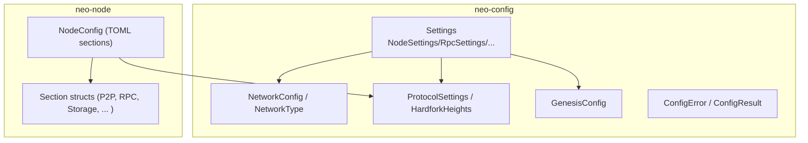

**Diagram sources**
- [settings.rs:10-47](file://neo-config/src/settings.rs#L10-L47)
- [network.rs:86-111](file://neo-config/src/network.rs#L86-L111)
- [protocol.rs:12-64](file://neo-config/src/protocol.rs#L12-L64)
- [genesis.rs:7-24](file://neo-config/src/genesis.rs#L7-L24)
- [error.rs:7-48](file://neo-config/src/error.rs#L7-L48)
- [sections.rs:10-33](file://neo-node/src/config/sections.rs#L10-L33)

**Section sources**
- [lib.rs:1-39](file://neo-config/src/lib.rs#L1-L39)
- [settings.rs:10-47](file://neo-config/src/settings.rs#L10-L47)
- [sections.rs:10-33](file://neo-node/src/config/sections.rs#L10-L33)

## Core Components
- Settings: Top-level container aggregating node, network, protocol, genesis, storage, rpc, consensus, logging, telemetry. Each field uses serde default to allow partial TOMLs.
- NetworkConfig and NetworkType: Define network identity (magic, address version), seed nodes, peer limits, and connection timeouts.
- ProtocolSettings: Defines blockchain behavior (block time, validators, mempool size, hardfork activation heights). Provides mainnet/testnet/private presets.
- GenesisConfig: Defines initial state (validators, committee, token distribution, contracts). Includes validation rules.
- Error types: Centralized error enum for file I/O, TOML parse/serialize, invalid values, missing fields, genesis/protocol errors.

Key implementation highlights:
- Type safety: All fields are strongly typed; optional fields use Option<T>.
- Defaults: Default implementations and serde defaults ensure minimal configs work out-of-the-box.
- Validation: Explicit validate methods enforce constraints (e.g., ports non-zero, required wallet path when consensus enabled).

**Section sources**
- [settings.rs:10-47](file://neo-config/src/settings.rs#L10-L47)
- [settings.rs:179-334](file://neo-config/src/settings.rs#L179-L334)
- [settings.rs:342-453](file://neo-config/src/settings.rs#L342-L453)
- [network.rs:8-158](file://neo-config/src/network.rs#L8-L158)
- [protocol.rs:12-64](file://neo-config/src/protocol.rs#L12-L64)
- [genesis.rs:7-24](file://neo-config/src/genesis.rs#L7-L24)
- [error.rs:7-48](file://neo-config/src/error.rs#L7-L48)

## Architecture Overview
The configuration flow supports both programmatic construction and TOML-driven loading:

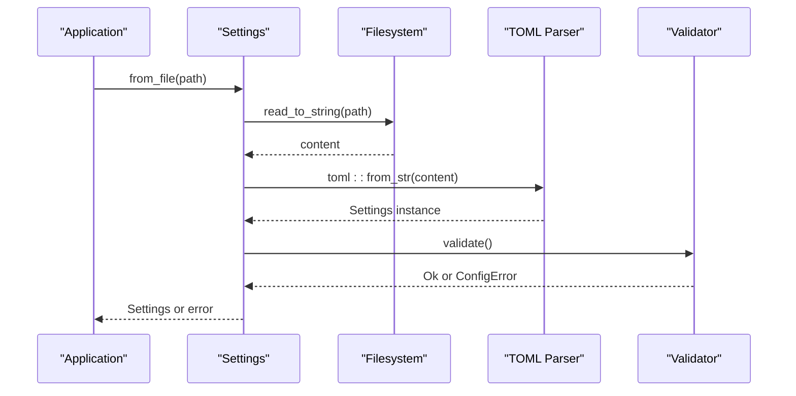

**Diagram sources**
- [settings.rs:396-407](file://neo-config/src/settings.rs#L396-L407)
- [settings.rs:426-453](file://neo-config/src/settings.rs#L426-L453)
- [error.rs:7-48](file://neo-config/src/error.rs#L7-L48)

Additionally, the node layer loads a CLI-style TOML into NodeConfig and converts it into internal subsystem configurations:

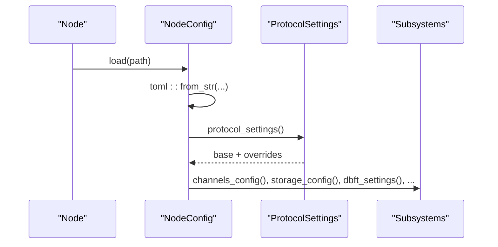

**Diagram sources**
- [node_config.rs:35-43](file://neo-node/src/config/node_config.rs#L35-L43)
- [node_config.rs:45-101](file://neo-node/src/config/node_config.rs#L45-L101)
- [node_config.rs:103-171](file://neo-node/src/config/node_config.rs#L103-L171)

## Detailed Component Analysis

### Settings and Sectioned Organization
- Settings aggregates all top-level sections: node, network, protocol, genesis, storage, rpc, consensus, logging, telemetry.
- Each section struct implements Default and uses serde defaults to make TOMLs minimal.
- Validation enforces cross-field constraints (e.g., consensus requires wallet_path when enabled).

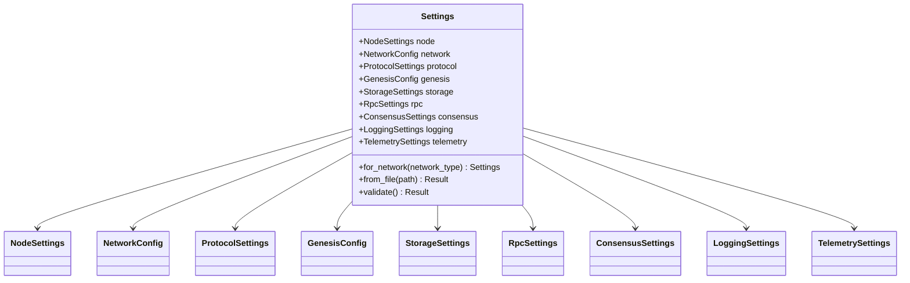

**Diagram sources**
- [settings.rs:10-47](file://neo-config/src/settings.rs#L10-L47)

**Section sources**
- [settings.rs:10-47](file://neo-config/src/settings.rs#L10-L47)
- [settings.rs:342-453](file://neo-config/src/settings.rs#L342-L453)

### Network Configuration
- NetworkType enumerates MainNet, TestNet, Private with magic numbers, address versions, and seed lists.
- NetworkConfig allows overriding magic/address_version and sets peer/connection defaults.

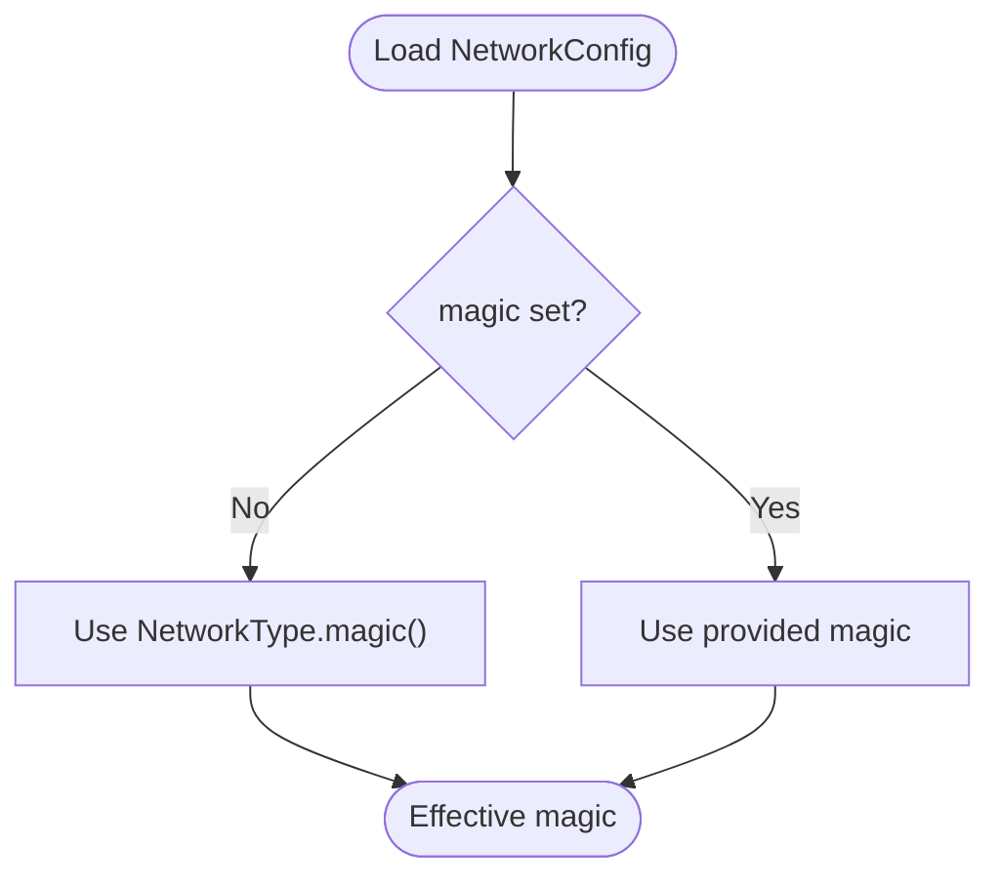

**Diagram sources**
- [network.rs:18-60](file://neo-config/src/network.rs#L18-L60)
- [network.rs:131-158](file://neo-config/src/network.rs#L131-L158)

**Section sources**
- [network.rs:8-158](file://neo-config/src/network.rs#L8-L158)

### Protocol Settings and Hardforks
- ProtocolSettings defines block timing, validator count, mempool, traceable blocks, initial gas distribution, standby validators, seeds, native activation heights, and hardfork heights.
- HardforkHeights uses Option<u32> per hardfork to enable/disable by height.
- Helper methods compute effective time per block and check if a hardfork is active at a given height.

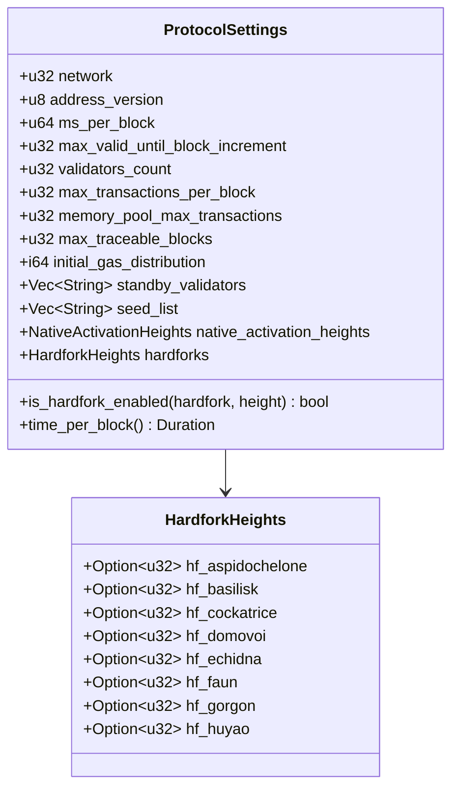

**Diagram sources**
- [protocol.rs:12-64](file://neo-config/src/protocol.rs#L12-L64)
- [protocol.rs:106-140](file://neo-config/src/protocol.rs#L106-L140)
- [protocol.rs:337-374](file://neo-config/src/protocol.rs#L337-L374)

**Section sources**
- [protocol.rs:12-64](file://neo-config/src/protocol.rs#L12-L64)
- [protocol.rs:175-374](file://neo-config/src/protocol.rs#L175-L374)

### Genesis Configuration
- GenesisConfig includes timestamp, validators, committee, token distribution, and contract deployments.
- Validators have public keys and optional names; distributions specify token type, address, amount.
- Validation ensures at least one validator and correct key length.

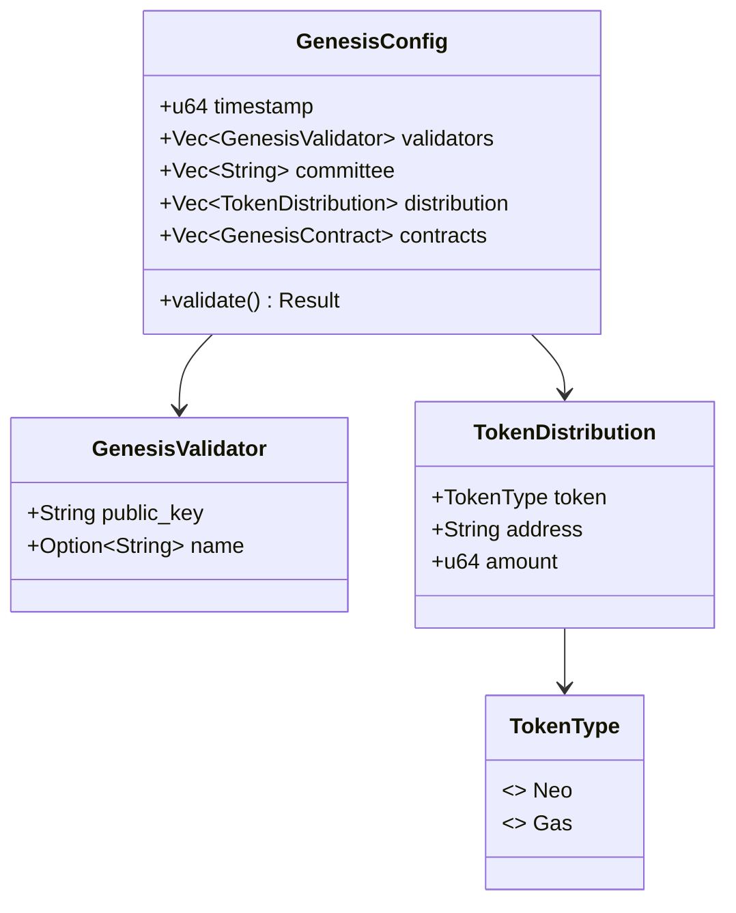

**Diagram sources**
- [genesis.rs:7-24](file://neo-config/src/genesis.rs#L7-L24)
- [genesis.rs:27-48](file://neo-config/src/genesis.rs#L27-L48)
- [genesis.rs:256-274](file://neo-config/src/genesis.rs#L256-L274)

**Section sources**
- [genesis.rs:7-24](file://neo-config/src/genesis.rs#L7-L24)
- [genesis.rs:256-274](file://neo-config/src/genesis.rs#L256-L274)

### Node-Level TOML Sections (CLI Schema)
The node layer defines explicit TOML sections with aliases for backward compatibility and flexibility:
- NetworkSection: network_type, network_magic
- P2PSection: port, min/max connections, seed list, compression, broadcast history limit
- StorageSection: backend, path, cache/write buffer sizes, compression, max open files, read-only
- BlockchainSection: block_time, max transactions per block
- RpcSection: enabled, bind_address, port, CORS, auth, session, TLS, trusted authorities, disabled methods
- Optional plugin sections: ApplicationLogsSection, StateServiceSection, TokensTrackerSection, OracleServiceSection, DbftSection
- LoggingSection, UnlockWalletSection, ContractsSection, PluginsSection, ConsensusSection, TelemetrySection, MempoolSection

These sections are parsed into NodeConfig and then converted into subsystem-specific configurations.

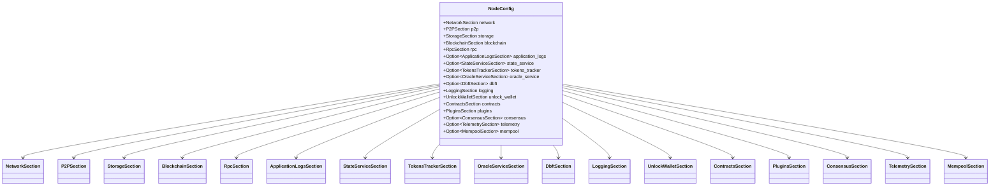

**Diagram sources**
- [sections.rs:10-33](file://neo-node/src/config/sections.rs#L10-L33)
- [sections.rs:35-400](file://neo-node/src/config/sections.rs#L35-L400)

**Section sources**
- [sections.rs:10-33](file://neo-node/src/config/sections.rs#L10-L33)
- [sections.rs:35-400](file://neo-node/src/config/sections.rs#L35-L400)

### Nested Structures, Optional Fields, and Type Safety
- Nested structures: Settings contains multiple nested sections; each section has its own nested fields (e.g., TelemetrySettings.metrics_*).
- Optional fields: Many fields are Option<T> to allow partial TOMLs (e.g., network.network_magic, rpc.session_enabled).
- Type safety: Strongly typed fields (u16, u32, u64, bool, Vec<String>, PathBuf) prevent invalid values at parse time; validation catches logical issues (e.g., zero ports).

Examples in code:
- Optional fields in NodeConfig sections: see [sections.rs:35-400](file://neo-node/src/config/sections.rs#L35-L400)
- Optional fields in Settings: see [settings.rs:10-47](file://neo-config/src/settings.rs#L10-L47)
- Validation enforcing required fields: see [settings.rs:426-453](file://neo-config/src/settings.rs#L426-L453)

**Section sources**
- [settings.rs:10-47](file://neo-config/src/settings.rs#L10-L47)
- [sections.rs:35-400](file://neo-node/src/config/sections.rs#L35-L400)
- [settings.rs:426-453](file://neo-config/src/settings.rs#L426-L453)

### Complex Data Types: Arrays and Maps
- Arrays: Networks define seed_nodes as Vec<String>; ProtocolSettings uses Vec<String> for standby_validators and seed_list; GenesisConfig uses Vec<TokenDistribution> and Vec<GenesisContract>.
- Maps: While not directly modeled as HashMaps in TOML sections, plugin configurations can be represented via JSON payloads (e.g., RPC server plugin config written as JSON object). See [node_config.rs:266-337](file://neo-node/src/config/node_config.rs#L266-L337).

**Section sources**
- [network.rs:86-111](file://neo-config/src/network.rs#L86-L111)
- [protocol.rs:12-64](file://neo-config/src/protocol.rs#L12-L64)
- [genesis.rs:7-24](file://neo-config/src/genesis.rs#L7-L24)
- [node_config.rs:266-337](file://neo-node/src/config/node_config.rs#L266-L337)

### Configuration Inheritance Patterns
- Defaults: Each section implements Default; Settings::for_network composes network-specific defaults (ports, protocol, genesis, network).
- Overrides: TOML fields override defaults; NodeConfig.protocol_settings builds on base ProtocolSettings and applies overrides (block time, max txs, mempool, seeds, magic).
- Effective values: NetworkConfig.effective_magic and effective_address_version resolve to user-provided values or network-type defaults.

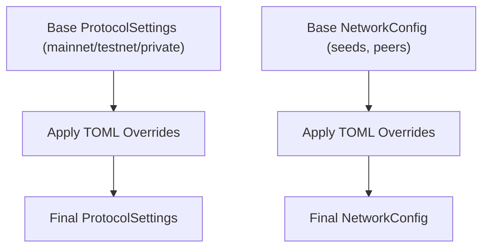

**Diagram sources**
- [settings.rs:342-394](file://neo-config/src/settings.rs#L342-L394)
- [node_config.rs:45-101](file://neo-node/src/config/node_config.rs#L45-L101)
- [network.rs:131-158](file://neo-config/src/network.rs#L131-L158)

**Section sources**
- [settings.rs:342-394](file://neo-config/src/settings.rs#L342-L394)
- [node_config.rs:45-101](file://neo-node/src/config/node_config.rs#L45-L101)
- [network.rs:131-158](file://neo-config/src/network.rs#L131-L158)

### Plugin-Specific Configurations
- Plugin sections are optional and validated before enabling:
  - ApplicationLogsSection, StateServiceSection, TokensTrackerSection, OracleServiceSection, DbftSection.
- NodeConfig methods convert these sections into subsystem settings, applying network context and validations (e.g., OracleService nodes validation).
- RPC server plugin configuration is serialized to JSON and written to disk for consumption by the RpcServer plugin.

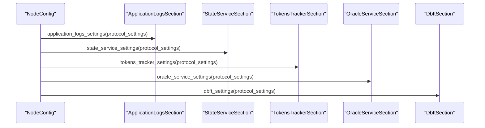

**Diagram sources**
- [node_config.rs:173-264](file://neo-node/src/config/node_config.rs#L173-L264)
- [sections.rs:148-277](file://neo-node/src/config/sections.rs#L148-L277)

**Section sources**
- [node_config.rs:173-264](file://neo-node/src/config/node_config.rs#L173-L264)
- [sections.rs:148-277](file://neo-node/src/config/sections.rs#L148-L277)

### Versioning and Backward Compatibility
- Configuration version constant: CONFIG_VERSION indicates current schema version for migration support.
- Aliases: TOML field aliases maintain backward compatibility (e.g., Port vs port, Enabled vs enabled).
- Deny unknown fields: Sections use deny_unknown_fields to fail fast on unexpected fields, ensuring strict schema adherence while allowing optional fields for new features.
- Migration strategy: Introduce new optional fields with defaults; update aliases for deprecated fields; increment CONFIG_VERSION when breaking changes occur.

**Section sources**
- [lib.rs:38-39](file://neo-config/src/lib.rs#L38-L39)
- [sections.rs:10-33](file://neo-node/src/config/sections.rs#L10-L33)
- [sections.rs:35-400](file://neo-node/src/config/sections.rs#L35-L400)

## Dependency Analysis
- Settings depends on NetworkConfig, ProtocolSettings, GenesisConfig, and various subsystem settings.
- NodeConfig depends on section structs and converts them into subsystem configurations.
- Errors are centralized in ConfigError, propagated through Result types.

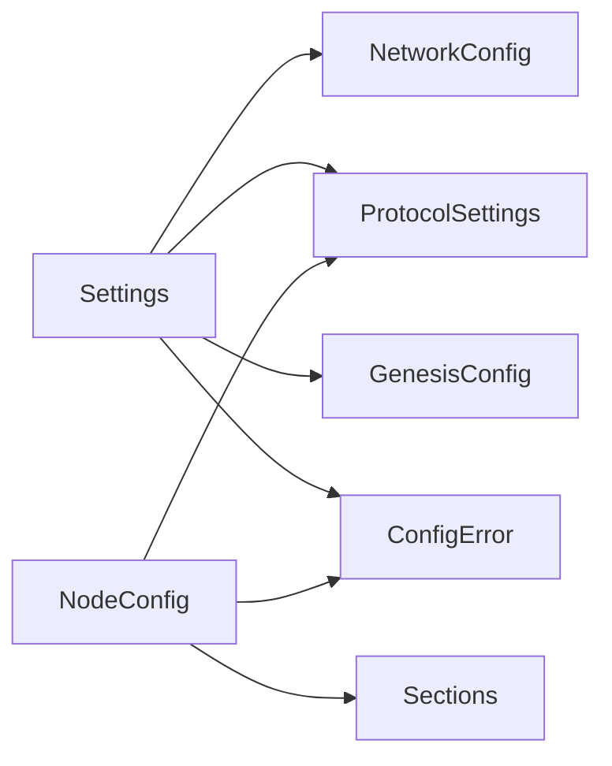

**Diagram sources**
- [settings.rs:10-47](file://neo-config/src/settings.rs#L10-L47)
- [sections.rs:10-33](file://neo-node/src/config/sections.rs#L10-L33)
- [error.rs:7-48](file://neo-config/src/error.rs#L7-L48)

**Section sources**
- [settings.rs:10-47](file://neo-config/src/settings.rs#L10-L47)
- [sections.rs:10-33](file://neo-node/src/config/sections.rs#L10-L33)
- [error.rs:7-48](file://neo-config/src/error.rs#L7-L48)

## Performance Considerations
- Use defaults to minimize configuration overhead; only override necessary fields.
- Avoid excessive seed nodes; keep peer limits reasonable to balance connectivity and resource usage.
- Compression and cache sizes should be tuned based on hardware; large caches improve performance but increase memory usage.
- Validate early to fail fast and avoid runtime surprises.

[No sources needed since this section provides general guidance]

## Troubleshooting Guide
Common configuration errors and their causes:
- File not found: Ensure the TOML path exists before loading.
- TOML parse errors: Check syntax and field names; use aliases if migrating from older formats.
- Invalid values: Ports must be non-zero; consensus requires wallet_path when enabled.
- Missing fields: Required fields like validators in genesis must be present.
- Unknown network type: Use valid network_type values or provide explicit network_magic.

Error types and messages are defined centrally for consistent diagnostics.

**Section sources**
- [error.rs:7-48](file://neo-config/src/error.rs#L7-L48)
- [settings.rs:426-453](file://neo-config/src/settings.rs#L426-L453)

## Conclusion
Neo-RS provides a robust, type-safe configuration system combining programmatic Settings with flexible TOML-based NodeConfig. Section-based organization, nested structures, optional fields, and strong typing ensure clarity and safety. Defaults and overrides enable inheritance-like patterns, while aliases and version constants support backward compatibility. Plugins integrate seamlessly via optional sections and validated conversions.

[No sources needed since this section summarizes without analyzing specific files]

## Appendices

### Example TOML Snippets
- Local development configuration: [local.toml:1-53](file://config/local.toml#L1-L53)
- Mainnet production configuration: [mainnet.toml:1-68](file://config/mainnet.toml#L1-L68)

**Section sources**
- [local.toml:1-53](file://config/local.toml#L1-L53)
- [mainnet.toml:1-68](file://config/mainnet.toml#L1-L68)