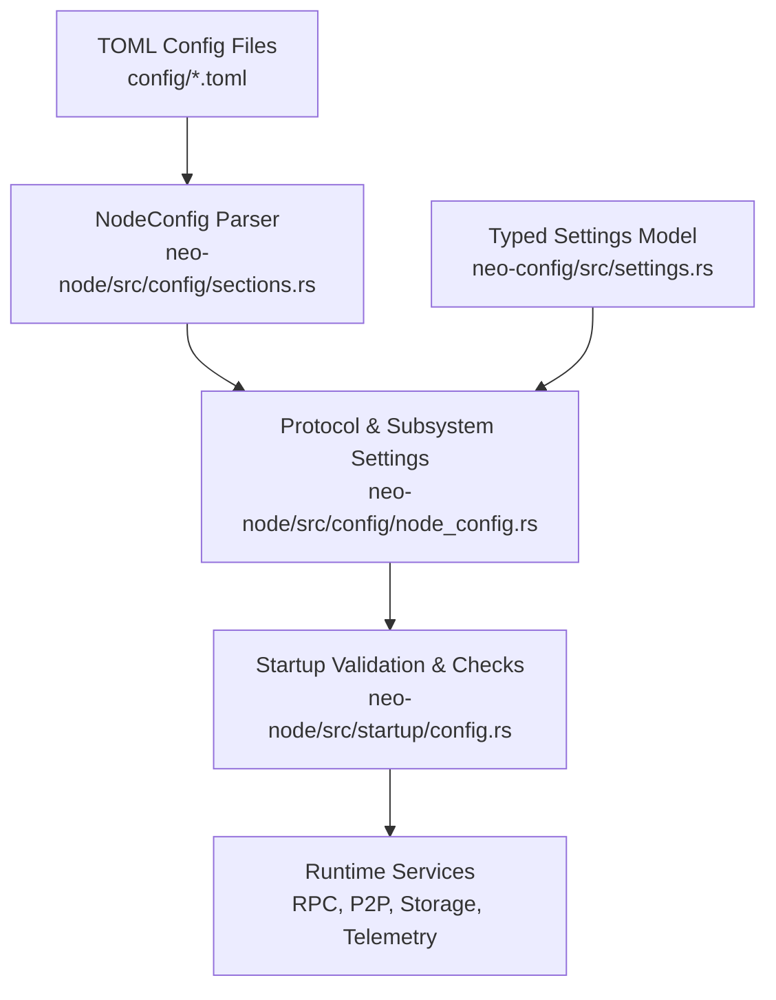
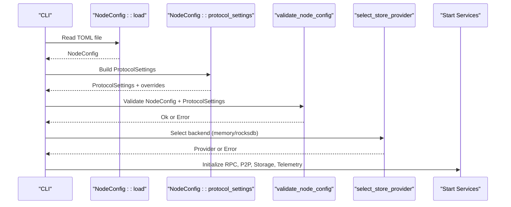
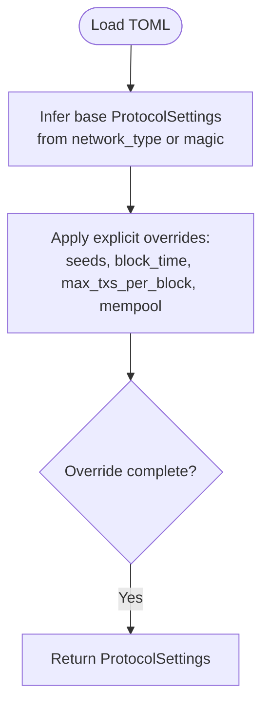
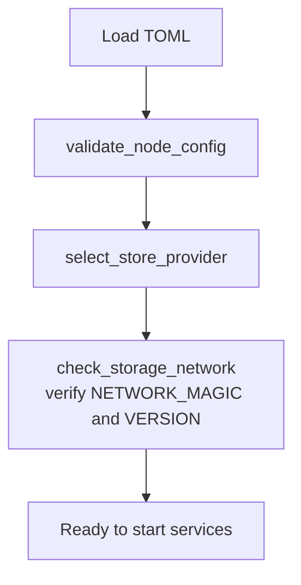
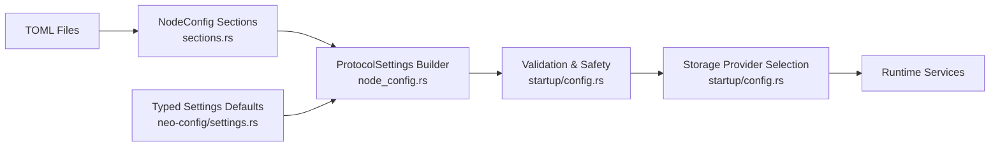

# Environment-Specific Settings

<cite>
**Referenced Files in This Document**
- [settings.rs](file://neo-config/src/settings.rs)
- [lib.rs](file://neo-config/src/lib.rs)
- [sections.rs](file://neo-node/src/config/sections.rs)
- [node_config.rs](file://neo-node/src/config/node_config.rs)
- [config.rs](file://neo-node/src/startup/config.rs)
- [mod.rs](file://neo-node/src/startup/mod.rs)
- [local.toml](file://config/local.toml)
- [testnet.toml](file://config/testnet.toml)
- [mainnet.toml](file://config/mainnet.toml)
- [mainnet-full-validation.toml](file://config/mainnet-full-validation.toml)
- [neo_mainnet_node.toml](file://neo_mainnet_node.toml)
- [import_acc.rs](file://neo-node/src/import_acc.rs)
</cite>

## Table of Contents
1. [Introduction](#introduction)
2. [Project Structure](#project-structure)
3. [Core Components](#core-components)
4. [Architecture Overview](#architecture-overview)
5. [Detailed Component Analysis](#detailed-component-analysis)
6. [Dependency Analysis](#dependency-analysis)
7. [Performance Considerations](#performance-considerations)
8. [Troubleshooting Guide](#troubleshooting-guide)
9. [Conclusion](#conclusion)
10. [Appendices](#appendices)

## Introduction
This document explains how Neo-RS manages environment-specific configuration for development, testing, staging, and production. It covers:
- How to structure per-environment configuration files
- How base configurations are extended by environment overrides
- Runtime loading, validation, and safety checks
- Hot-reloading considerations
- Best practices for sensitive values and environment variables
- Multi-environment deployment patterns and drift management

Neo-RS supports two complementary configuration layers:
- A high-level TOML schema used by the node (NodeConfig sections)
- A typed settings model (Settings) with defaults per network type

The startup process loads a TOML file, converts it into protocol and subsystem settings, validates them, and ensures storage compatibility before starting services.

## Project Structure
Configuration is organized around:
- Example per-environment TOML files under config/
- Node configuration schema definitions in neo-node/src/config
- Typed settings and defaults in neo-config
- Startup logic that loads, validates, and applies configuration

**Diagram sources**
- [sections.rs:10-33](file://neo-node/src/config/sections.rs#L10-L33)
- [node_config.rs:35-101](file://neo-node/src/config/node_config.rs#L35-L101)
- [config.rs:171-292](file://neo-node/src/startup/config.rs#L171-L292)
- [settings.rs:342-407](file://neo-config/src/settings.rs#L342-L407)

**Section sources**
- [sections.rs:10-33](file://neo-node/src/config/sections.rs#L10-L33)
- [node_config.rs:35-101](file://neo-node/src/config/node_config.rs#L35-L101)
- [config.rs:171-292](file://neo-node/src/startup/config.rs#L171-L292)
- [settings.rs:342-407](file://neo-config/src/settings.rs#L342-L407)

## Core Components
- NodeConfig sections define the TOML schema for all runtime options (network, p2p, storage, rpc, logging, telemetry, mempool, state_service, etc.)
- NodeConfig::protocol_settings builds ProtocolSettings from the TOML, inferring base settings from network magic or type and applying explicit overrides
- Startup validation enforces security and correctness (e.g., RPC auth on public binds, required paths for RocksDB, marker checks)
- Typed Settings provides default profiles per network and TOML round-trip support

Key responsibilities:
- Load TOML and parse into NodeConfig
- Derive ProtocolSettings and subsystem configs
- Validate and enforce constraints
- Prepare storage provider and check markers

**Section sources**
- [sections.rs:10-33](file://neo-node/src/config/sections.rs#L10-L33)
- [node_config.rs:35-101](file://neo-node/src/config/node_config.rs#L35-L101)
- [config.rs:171-292](file://neo-node/src/startup/config.rs#L171-L292)
- [settings.rs:342-407](file://neo-config/src/settings.rs#L342-L407)

## Architecture Overview
The runtime configuration flow integrates TOML parsing, protocol derivation, and validation.

**Diagram sources**
- [node_config.rs:35-101](file://neo-node/src/config/node_config.rs#L35-L101)
- [config.rs:171-292](file://neo-node/src/startup/config.rs#L171-L292)
- [config.rs:23-55](file://neo-node/src/startup/config.rs#L23-L55)

## Detailed Component Analysis

### Configuration Schema and Sections
- NodeConfig groups all TOML sections: network, p2p, storage, blockchain, rpc, application_logs, state_service, tokens_tracker, oracle_service, dbft, logging, unlock_wallet, contracts, plugins, consensus, telemetry, mempool
- Each section uses serde aliases to accept multiple field names for compatibility
- Optional sections allow enabling features per environment (e.g., state_service, oracle_service)

Best practice:
- Keep environment-specific differences minimal; prefer inheritance via network type and magic
- Use optional sections to enable features only where needed

**Section sources**
- [sections.rs:10-33](file://neo-node/src/config/sections.rs#L10-L33)
- [sections.rs:35-42](file://neo-node/src/config/sections.rs#L35-L42)
- [sections.rs:44-82](file://neo-node/src/config/sections.rs#L44-L82)
- [sections.rs:84-93](file://neo-node/src/config/sections.rs#L84-L93)
- [sections.rs:95-146](file://neo-node/src/config/sections.rs#L95-L146)
- [sections.rs:148-228](file://neo-node/src/config/sections.rs#L148-L228)
- [sections.rs:258-288](file://neo-node/src/config/sections.rs#L258-L288)
- [sections.rs:290-320](file://neo-node/src/config/sections.rs#L290-L320)
- [sections.rs:361-399](file://neo-node/src/config/sections.rs#L361-L399)

### Base Profiles and Overrides
- Network-based defaults are provided by Settings::for_network, which sets protocol, genesis, and network config for MainNet, TestNet, Private
- NodeConfig::protocol_settings determines base ProtocolSettings from network magic or type, then applies explicit overrides from TOML fields (seed list, block time, max txs per block, mempool size)
- This enables a layered approach: base profile + environment-specific overrides

**Diagram sources**
- [node_config.rs:45-101](file://neo-node/src/config/node_config.rs#L45-L101)
- [settings.rs:342-394](file://neo-config/src/settings.rs#L342-L394)

**Section sources**
- [settings.rs:342-394](file://neo-config/src/settings.rs#L342-L394)
- [node_config.rs:45-101](file://neo-node/src/config/node_config.rs#L45-L101)

### Runtime Loading and Validation
- NodeConfig::load reads and parses TOML into NodeConfig
- validate_node_config enforces:
  - RPC authentication requirements and safe defaults
  - Public bind restrictions without auth
  - Required storage path for persistent backends
  - Storage marker checks (NETWORK_MAGIC, VERSION)
  - Consistency warnings between network_type and effective magic
- select_store_provider chooses memory or RocksDB based on backend name and feature flags

**Diagram sources**
- [node_config.rs:35-43](file://neo-node/src/config/node_config.rs#L35-L43)
- [config.rs:171-292](file://neo-node/src/startup/config.rs#L171-L292)
- [config.rs:23-55](file://neo-node/src/startup/config.rs#L23-L55)
- [config.rs:85-154](file://neo-node/src/startup/config.rs#L85-L154)

**Section sources**
- [node_config.rs:35-43](file://neo-node/src/config/node_config.rs#L35-L43)
- [config.rs:171-292](file://neo-node/src/startup/config.rs#L171-L292)
- [config.rs:23-55](file://neo-node/src/startup/config.rs#L23-L55)
- [config.rs:85-154](file://neo-node/src/startup/config.rs#L85-L154)

### Environment Examples
- Local development: minimal ports, memory storage, debug logs, disabled consensus
- TestNet: testnet magic, seed nodes, moderate connections, pretty logs
- MainNet: production-grade seeds, JSON logs, larger limits, state service enabled
- Full validation: dedicated data directory, distinct ports, state service for root verification

Use these as templates and override only what differs per environment.

**Section sources**
- [local.toml:1-53](file://config/local.toml#L1-L53)
- [testnet.toml:1-50](file://config/testnet.toml#L1-L50)
- [mainnet.toml:1-68](file://config/mainnet.toml#L1-L68)
- [mainnet-full-validation.toml:1-73](file://config/mainnet-full-validation.toml#L1-L73)
- [neo_mainnet_node.toml:1-67](file://neo_mainnet_node.toml#L1-L67)

### Sensitive Values and Secrets Management
- RPC credentials can be set in TOML using secure fields; startup validation prevents default credentials on public binds
- For higher security, supply credentials via environment variables at runtime and avoid committing secrets to version control
- Prefer binding RPC to loopback or enforcing authentication when exposing publicly

Recommendations:
- Use environment variables for rpc_user/rpc_pass and other secrets
- Enforce --rpc-hardened or equivalent policies in CI and production pipelines
- Audit configs for template credentials before deployment

**Section sources**
- [sections.rs:95-146](file://neo-node/src/config/sections.rs#L95-L146)
- [config.rs:171-204](file://neo-node/src/startup/config.rs#L171-L204)
- [config.rs:225-243](file://neo-node/src/startup/config.rs#L225-L243)

### Environment Variables Integration
- Import tooling reads environment variables to tune behavior (e.g., stop height, progress intervals, flush intervals)
- RocksDB batch commit profile can be tuned via an environment variable
- These variables complement TOML settings for operational tuning without changing files

Operational tips:
- Set NEO_IMPORT_* variables during import jobs
- Use NEO_ROCKSDB_BATCH_PROFILE to balance durability vs throughput
- Combine env overrides with TOML for clear separation of concerns

**Section sources**
- [import_acc.rs:37-65](file://neo-node/src/import_acc.rs#L37-L65)
- [config.rs:57-83](file://neo-node/src/startup/config.rs#L57-L83)

### Hot-Reloading Capabilities
- The current implementation does not implement dynamic hot-reloading of configuration at runtime
- To apply changes, restart the node after updating TOML or environment variables
- For zero-downtime updates, use rolling restarts with separate data directories and careful port management

Guidance:
- Treat configuration as immutable during runtime
- Plan deployments to minimize restart windows
- Use health checks and readiness probes around restarts

[No sources needed since this section provides general guidance]

### Configuration Validation Across Environments
- validate_node_config enforces consistent and safe settings across environments
- Storage marker checks prevent mixing networks or incompatible versions
- Warnings help detect mismatches between declared network_type and effective magic

Checklist:
- Ensure RPC is authenticated when exposed publicly
- Verify storage path exists and is writable (or read-only mode is valid)
- Confirm NETWORK_MAGIC and VERSION markers match expected values

**Section sources**
- [config.rs:171-292](file://neo-node/src/startup/config.rs#L171-L292)
- [config.rs:85-154](file://neo-node/src/startup/config.rs#L85-L154)

## Dependency Analysis
Configuration components interact as follows:

**Diagram sources**
- [sections.rs:10-33](file://neo-node/src/config/sections.rs#L10-L33)
- [node_config.rs:35-101](file://neo-node/src/config/node_config.rs#L35-L101)
- [config.rs:171-292](file://neo-node/src/startup/config.rs#L171-L292)
- [config.rs:23-55](file://neo-node/src/startup/config.rs#L23-L55)
- [settings.rs:342-394](file://neo-config/src/settings.rs#L342-L394)

**Section sources**
- [sections.rs:10-33](file://neo-node/src/config/sections.rs#L10-L33)
- [node_config.rs:35-101](file://neo-node/src/config/node_config.rs#L35-L101)
- [config.rs:171-292](file://neo-node/src/startup/config.rs#L171-L292)
- [settings.rs:342-394](file://neo-config/src/settings.rs#L342-L394)

## Performance Considerations
- Choose appropriate storage backend per environment: memory for local dev, RocksDB for production
- Tune RocksDB batch profile via environment variable to balance durability and throughput
- Adjust mempool and P2P limits according to workload and network conditions
- Enable state service selectively for tasks like stateroot verification

[No sources needed since this section provides general guidance]

## Troubleshooting Guide
Common issues and resolutions:
- Storage path missing or invalid: ensure path is a directory and writable; verify RocksDB backend requires a path
- Network mismatch: check NETWORK_MAGIC marker and ensure config matches stored data
- RPC exposed without auth: bind to loopback or enable authentication; avoid default credentials on public addresses
- Missing markers in read-only mode: provide existing NETWORK_MAGIC and VERSION markers

Diagnostic steps:
- Run configuration validation prior to starting the node
- Inspect storage markers and version files
- Review logs for warnings about network type vs magic

**Section sources**
- [config.rs:171-292](file://neo-node/src/startup/config.rs#L171-L292)
- [config.rs:85-154](file://neo-node/src/startup/config.rs#L85-L154)

## Conclusion
Neo-RS provides a robust, layered configuration system:
- Base profiles per network type with explicit overrides
- Strong validation and safety checks at startup
- Clear separation between declarative TOML and runtime environment variables
- Practical examples for local, testnet, mainnet, and validation scenarios

Adopt best practices:
- Keep environment-specific diffs small and focused
- Use environment variables for secrets and operational tuning
- Validate configurations in CI and pre-deployment checks
- Manage drift by centralizing shared settings and auditing per-environment overrides

[No sources needed since this section summarizes without analyzing specific files]

## Appendices

### Recommended File Organization
- Place environment-specific TOML files under config/
- Use a single source of truth for shared settings and include environment-specific overrides
- Maintain README or comments in each file describing purpose and key differences

[No sources needed since this section provides general guidance]

### Multi-Environment Deployment Patterns
- Development: memory storage, debug logs, loopback RPC
- Testing: testnet magic, moderate limits, pretty logs
- Staging: near-production settings, limited exposure, metrics enabled
- Production: full validation, strict RPC auth, JSON logs, state service as needed

[No sources needed since this section provides general guidance]