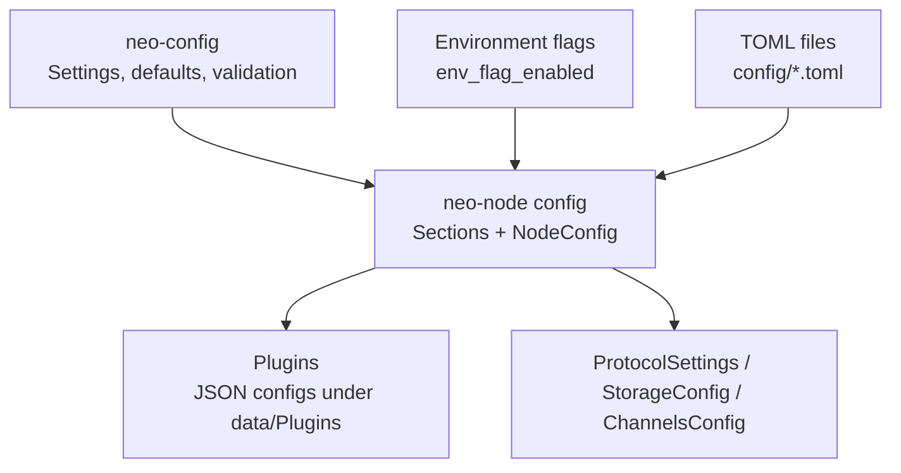
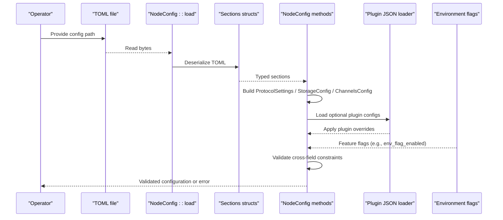
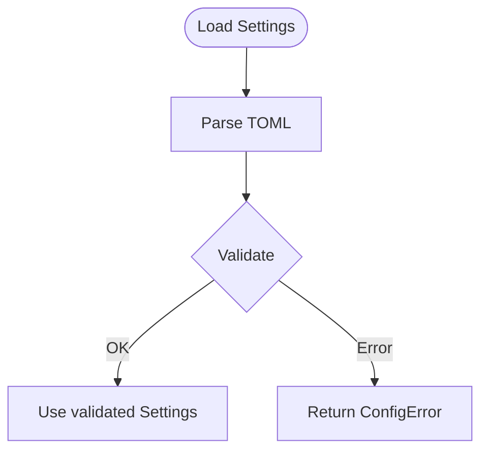
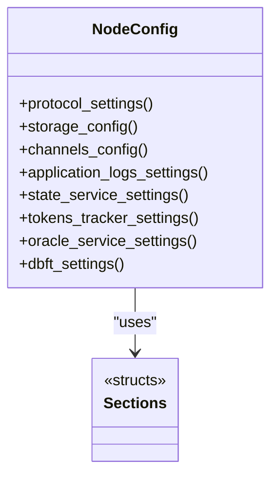
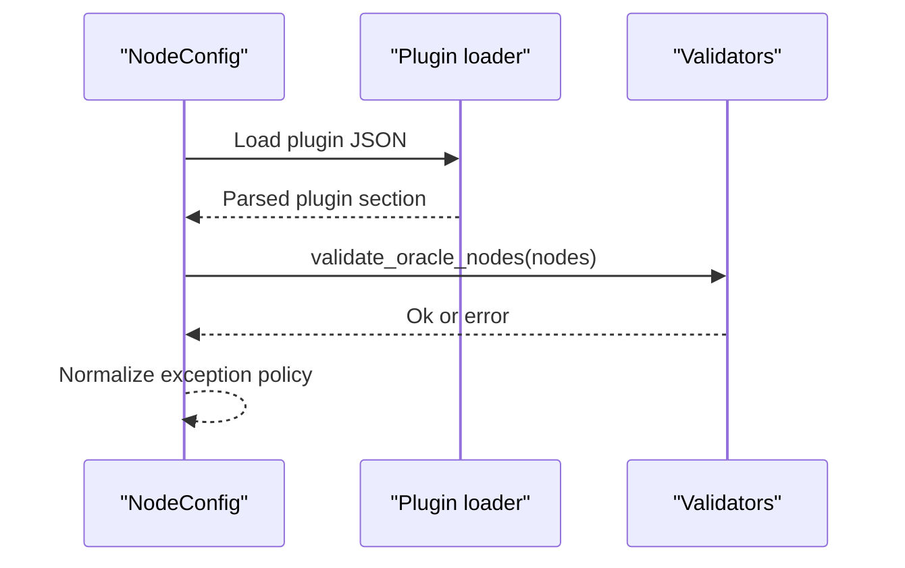
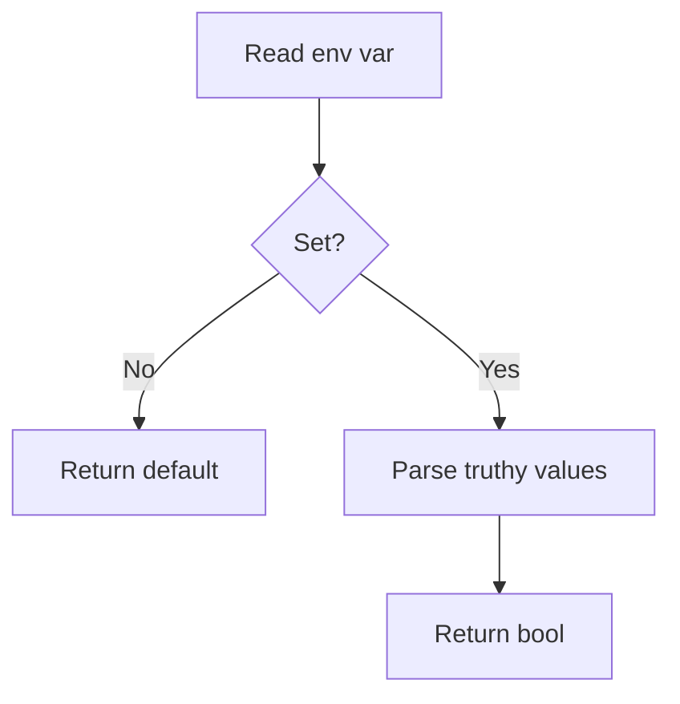
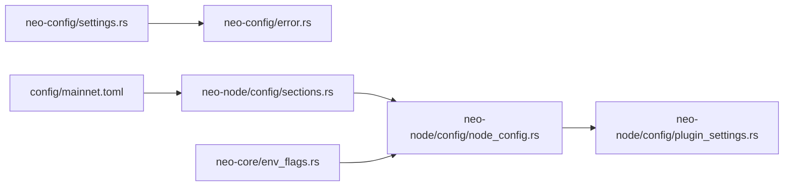

# Validation & Defaults

<cite>
**Referenced Files in This Document**
- [lib.rs](file://neo-config/src/lib.rs)
- [settings.rs](file://neo-config/src/settings.rs)
- [error.rs](file://neo-config/src/error.rs)
- [mod.rs](file://neo-node/src/config/mod.rs)
- [sections.rs](file://neo-node/src/config/sections.rs)
- [node_config.rs](file://neo-node/src/config/node_config.rs)
- [plugin_settings.rs](file://neo-node/src/config/plugin_settings.rs)
- [mainnet.toml](file://config/mainnet.toml)
- [env_flags.rs](file://neo-core/src/smart_contract/env_flags.rs)
</cite>

## Table of Contents
1. [Introduction](#introduction)
2. [Project Structure](#project-structure)
3. [Core Components](#core-components)
4. [Architecture Overview](#architecture-overview)
5. [Detailed Component Analysis](#detailed-component-analysis)
6. [Dependency Analysis](#dependency-analysis)
7. [Performance Considerations](#performance-considerations)
8. [Troubleshooting Guide](#troubleshooting-guide)
9. [Conclusion](#conclusion)

## Introduction
This document explains how Neo-RS validates configuration values and resolves defaults at startup. It covers:
- Where defaults are defined and how they are applied
- How TOML files are parsed and validated
- How environment variables can override or influence behavior
- How to implement custom validation logic (range checks, format validation, business rules)
- Error handling strategies and debugging techniques for configuration issues
- Examples for complex scenarios such as conditional defaults and graceful deprecation handling

The goal is to help you author robust, maintainable configuration with clear error messages and predictable fallbacks.

## Project Structure
Neo-RS uses a layered approach to configuration:
- neo-config crate defines high-level Settings, default values, and validation for core node settings
- neo-node config module parses the CLI-style TOML into typed sections and builds subsystem configurations
- Plugin settings resolve per-plugin configuration from JSON under a plugins directory
- Environment flags provide runtime toggles via environment variables

**Diagram sources**
- [settings.rs:10-47](file://neo-config/src/settings.rs#L10-L47)
- [sections.rs:10-33](file://neo-node/src/config/sections.rs#L10-L33)
- [node_config.rs:35-101](file://neo-node/src/config/node_config.rs#L35-L101)
- [plugin_settings.rs:16-67](file://neo-node/src/config/plugin_settings.rs#L16-L67)
- [env_flags.rs:1-13](file://neo-core/src/smart_contract/env_flags.rs#L1-L13)

**Section sources**
- [lib.rs:1-40](file://neo-config/src/lib.rs#L1-L40)
- [settings.rs:10-47](file://neo-config/src/settings.rs#L10-L47)
- [sections.rs:10-33](file://neo-node/src/config/sections.rs#L10-L33)
- [node_config.rs:35-101](file://neo-node/src/config/node_config.rs#L35-L101)
- [plugin_settings.rs:16-67](file://neo-node/src/config/plugin_settings.rs#L16-L67)
- [env_flags.rs:1-13](file://neo-core/src/smart_contract/env_flags.rs#L1-L13)

## Core Components
- Settings and defaults: Centralized in neo-config with explicit default functions and Default implementations for each sub-settings struct.
- Validation: Performed after parsing; returns typed errors with descriptive messages.
- NodeConfig: Parses CLI-style TOML into typed sections and converts them into runtime-ready configurations for protocol, storage, P2P, RPC, and plugins.
- Plugin settings: Reads plugin JSON files, applies overrides, and validates fields like OracleService nodes.
- Environment flags: Provide boolean feature toggles via environment variables with well-defined truthy values.

Key responsibilities:
- Define safe defaults that work out-of-the-box
- Validate critical constraints early (ports, required paths, network magic)
- Provide actionable error messages
- Support environment-based overrides where appropriate

**Section sources**
- [settings.rs:179-339](file://neo-config/src/settings.rs#L179-L339)
- [settings.rs:396-453](file://neo-config/src/settings.rs#L396-L453)
- [error.rs:6-51](file://neo-config/src/error.rs#L6-L51)
- [node_config.rs:35-101](file://neo-node/src/config/node_config.rs#L35-L101)
- [plugin_settings.rs:600-628](file://neo-node/src/config/plugin_settings.rs#L600-L628)
- [env_flags.rs:1-13](file://neo-core/src/smart_contract/env_flags.rs#L1-L13)

## Architecture Overview
Configuration loading and validation flow:

**Diagram sources**
- [node_config.rs:35-101](file://neo-node/src/config/node_config.rs#L35-L101)
- [sections.rs:10-33](file://neo-node/src/config/sections.rs#L10-L33)
- [plugin_settings.rs:169-189](file://neo-node/src/config/plugin_settings.rs#L169-L189)
- [env_flags.rs:1-13](file://neo-core/src/smart_contract/env_flags.rs#L1-L13)

**Section sources**
- [node_config.rs:35-101](file://neo-node/src/config/node_config.rs#L35-L101)
- [sections.rs:10-33](file://neo-node/src/config/sections.rs#L10-L33)
- [plugin_settings.rs:169-189](file://neo-node/src/config/plugin_settings.rs#L169-L189)
- [env_flags.rs:1-13](file://neo-core/src/smart_contract/env_flags.rs#L1-L13)

## Detailed Component Analysis

### Settings defaults and validation (neo-config)
- Default resolution: Each sub-settings struct implements Default using dedicated default functions. Network-specific defaults are provided via Settings::for_network.
- Validation: Settings::validate enforces constraints such as non-zero ports and required wallet_path when consensus is enabled. Genesis validation is delegated to genesis.
- Error types: ConfigError enumerates specific failure modes (file not found, parse errors, invalid values, missing fields).

Implementation highlights:
- Default functions encapsulate sensible defaults (e.g., listen address, ports, cache sizes)
- Network presets adjust ports and protocol parameters
- Validation fails fast with clear messages

**Diagram sources**
- [settings.rs:396-453](file://neo-config/src/settings.rs#L396-L453)
- [error.rs:6-51](file://neo-config/src/error.rs#L6-L51)

**Section sources**
- [settings.rs:179-339](file://neo-config/src/settings.rs#L179-L339)
- [settings.rs:396-453](file://neo-config/src/settings.rs#L396-L453)
- [error.rs:6-51](file://neo-config/src/error.rs#L6-L51)

### NodeConfig and section mapping (neo-node)
- Section structs define all TOML keys with aliases for compatibility. Unknown fields are denied by serde attributes.
- NodeConfig::protocol_settings infers base protocol settings from network magic or type, then applies explicit overrides (block time, max transactions per block, mempool size).
- Storage, P2P, and RPC settings are built from sections with safe conversions and bounds checking.
- Optional plugin settings are loaded from JSON under a plugins directory and merged into final configuration.

**Diagram sources**
- [sections.rs:10-33](file://neo-node/src/config/sections.rs#L10-L33)
- [node_config.rs:35-101](file://neo-node/src/config/node_config.rs#L35-L101)

**Section sources**
- [sections.rs:10-33](file://neo-node/src/config/sections.rs#L10-L33)
- [node_config.rs:35-101](file://neo-node/src/config/node_config.rs#L35-L101)

### Plugin settings and validation
- Plugin directories and paths are resolved from environment or defaults.
- Plugin JSON files are read and deserialized with strict error context.
- Cross-field validation includes URL validation for OracleService nodes.
- Exception policies are normalized from string values to typed enums.

**Diagram sources**
- [plugin_settings.rs:169-189](file://neo-node/src/config/plugin_settings.rs#L169-L189)
- [plugin_settings.rs:600-628](file://neo-node/src/config/plugin_settings.rs#L600-L628)

**Section sources**
- [plugin_settings.rs:16-67](file://neo-node/src/config/plugin_settings.rs#L16-L67)
- [plugin_settings.rs:169-189](file://neo-node/src/config/plugin_settings.rs#L169-L189)
- [plugin_settings.rs:600-628](file://neo-node/src/config/plugin_settings.rs#L600-L628)

### Environment variable overrides and flags
- Boolean feature flags can be controlled via environment variables using a consistent truthy parser.
- The pattern reads an environment variable and falls back to a provided default if unset.

**Diagram sources**
- [env_flags.rs:1-13](file://neo-core/src/smart_contract/env_flags.rs#L1-L13)

**Section sources**
- [env_flags.rs:1-13](file://neo-core/src/smart_contract/env_flags.rs#L1-L13)

### Example: Validating complex configuration scenarios
- Range checks: Ensure ports are non-zero; enforce heap/TCS ranges for enclave-like components.
- Format validation: Validate URIs for oracle endpoints; ensure compression algorithm names map to supported enums.
- Business rules: Require wallet_path when consensus is enabled; require both user and password when RPC auth is enabled.

Practical patterns:
- Use Option fields to represent optional inputs and apply defaults only when needed
- Perform cross-field validation after parsing to catch interdependent constraints
- Return typed errors with contextual messages to aid operators

**Section sources**
- [settings.rs:426-453](file://neo-config/src/settings.rs#L426-L453)
- [node_config.rs:266-337](file://neo-node/src/config/node_config.rs#L266-L337)
- [plugin_settings.rs:600-628](file://neo-node/src/config/plugin_settings.rs#L600-L628)

### Conditional defaults based on other settings
- Base protocol settings are inferred from network magic or type, then overridden by explicit values.
- P2P channels and storage configs are constructed by applying only the present options over defaults.

```mermaid
flowchart TD
S["Start"] --> M{"Network magic known?"}
M -- Yes --> P["Use preset ProtocolSettings"]
M -- No --> T{"Network type"}
T -- testnet/test --> P2["Use testnet preset"]
T -- private/privatenet --> P3["Use private preset"]
T -- else --> P4["Use mainnet preset"]
P --> O["Apply explicit overrides"]
P2 --> O
P3 --> O
P4 --> O
O --> End["Final ProtocolSettings"]
```

**Diagram sources**
- [node_config.rs:45-101](file://neo-node/src/config/node_config.rs#L45-L101)

**Section sources**
- [node_config.rs:45-101](file://neo-node/src/config/node_config.rs#L45-L101)

### Handling deprecated configuration options gracefully
- Use Option fields for legacy keys so missing values do not break parsing.
- Map deprecated strings to current enums with sensible fallbacks.
- Log or surface warnings during normalization to guide migration.

Example patterns:
- UnhandledExceptionPolicy parsing accepts multiple spellings and falls back to a safe default
- Compression algorithm names are mapped case-insensitively with None for unknown values

**Section sources**
- [plugin_settings.rs:600-628](file://neo-node/src/config/plugin_settings.rs#L600-L628)
- [node_config.rs:431-438](file://neo-node/src/config/node_config.rs#L431-L438)

## Dependency Analysis
High-level dependencies between configuration modules:

**Diagram sources**
- [settings.rs:10-47](file://neo-config/src/settings.rs#L10-L47)
- [error.rs:6-51](file://neo-config/src/error.rs#L6-L51)
- [sections.rs:10-33](file://neo-node/src/config/sections.rs#L10-L33)
- [node_config.rs:35-101](file://neo-node/src/config/node_config.rs#L35-L101)
- [plugin_settings.rs:16-67](file://neo-node/src/config/plugin_settings.rs#L16-L67)
- [env_flags.rs:1-13](file://neo-core/src/smart_contract/env_flags.rs#L1-L13)
- [mainnet.toml:1-68](file://config/mainnet.toml#L1-L68)

**Section sources**
- [settings.rs:10-47](file://neo-config/src/settings.rs#L10-L47)
- [error.rs:6-51](file://neo-config/src/error.rs#L6-L51)
- [sections.rs:10-33](file://neo-node/src/config/sections.rs#L10-L33)
- [node_config.rs:35-101](file://neo-node/src/config/node_config.rs#L35-L101)
- [plugin_settings.rs:16-67](file://neo-node/src/config/plugin_settings.rs#L16-L67)
- [env_flags.rs:1-13](file://neo-core/src/smart_contract/env_flags.rs#L1-L13)
- [mainnet.toml:1-68](file://config/mainnet.toml#L1-L68)

## Performance Considerations
- Keep validation minimal and focused on correctness; avoid heavy I/O during startup validation.
- Prefer Option fields to avoid unnecessary allocations for absent values.
- Use saturating arithmetic for numeric conversions to prevent panics on extreme values.
- Cache derived values (e.g., socket addresses) only when needed to reduce repeated parsing.

[No sources needed since this section provides general guidance]

## Troubleshooting Guide
Common issues and remedies:
- Invalid port values: Ensure ports are non-zero and within valid ranges. Errors will indicate which field failed.
- Missing required fields: When enabling features like consensus or RPC auth, ensure required fields are present.
- Invalid URIs: OracleService nodes must be absolute URIs; malformed entries produce clear errors.
- Unknown compression algorithms: Only recognized names are accepted; typos fall back safely.
- Environment flag misconfiguration: Only specific truthy values enable features; others are treated as false.

Debugging tips:
- Inspect the exact error message from ConfigError variants to identify the failing field.
- Verify TOML structure against section definitions and aliases.
- Check plugin JSON files for required keys and correct nesting.
- Use logging settings to capture detailed startup logs.

**Section sources**
- [error.rs:6-51](file://neo-config/src/error.rs#L6-L51)
- [settings.rs:426-453](file://neo-config/src/settings.rs#L426-L453)
- [plugin_settings.rs:600-628](file://neo-node/src/config/plugin_settings.rs#L600-L628)
- [sections.rs:95-146](file://neo-node/src/config/sections.rs#L95-L146)

## Conclusion
Neo-RS provides a robust configuration system with:
- Clear defaults and network presets
- Strong validation with actionable errors
- Flexible plugin integration and environment-based toggles
- Safe handling of deprecated or optional fields

By following the patterns outlined here—using Option fields, performing cross-field validation, and returning typed errors—you can implement reliable configuration for new features while maintaining backward compatibility and operator-friendly diagnostics.