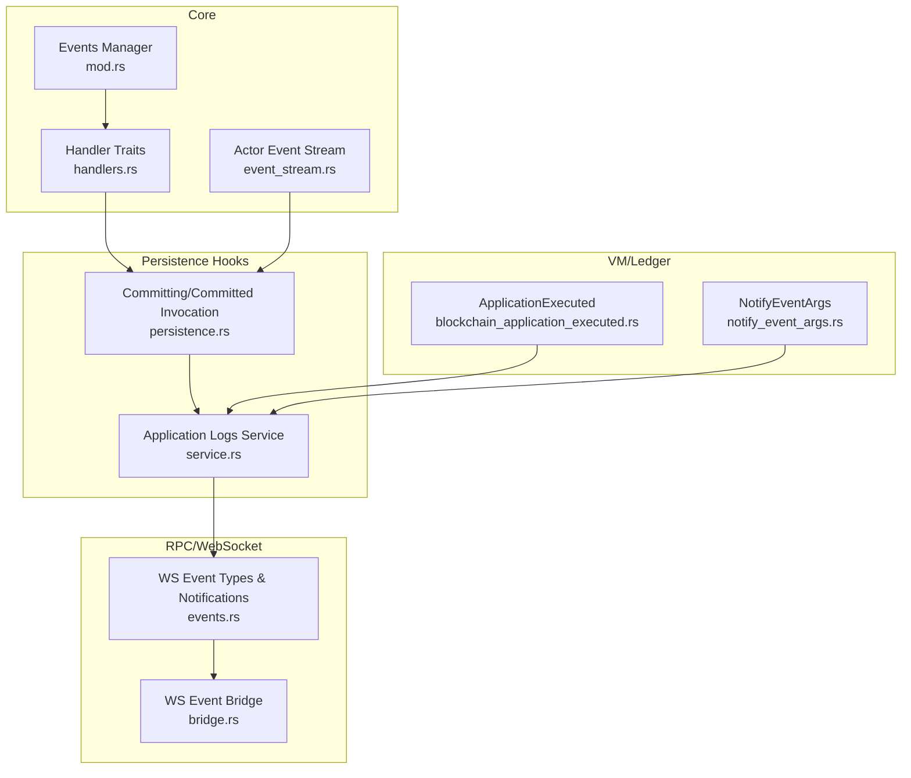
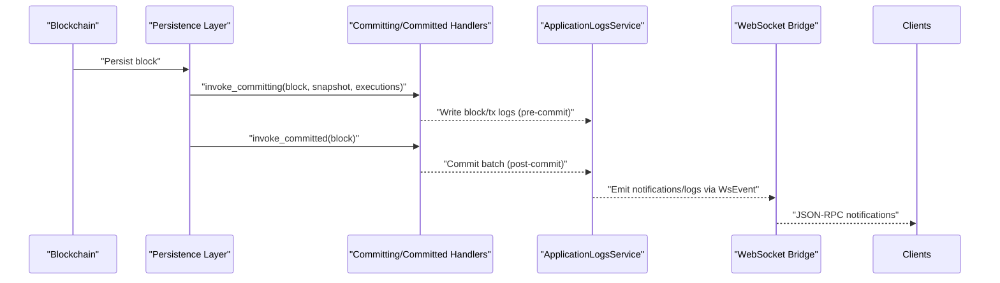
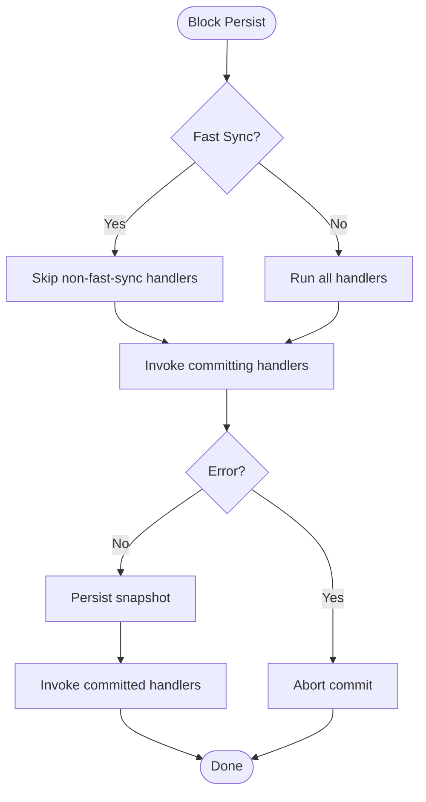
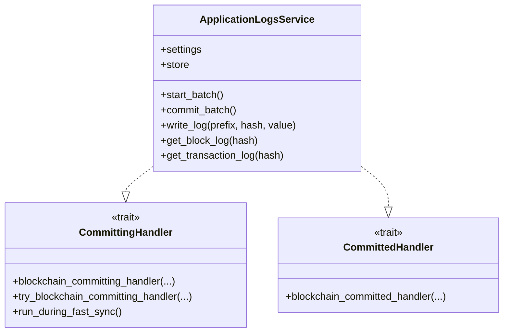
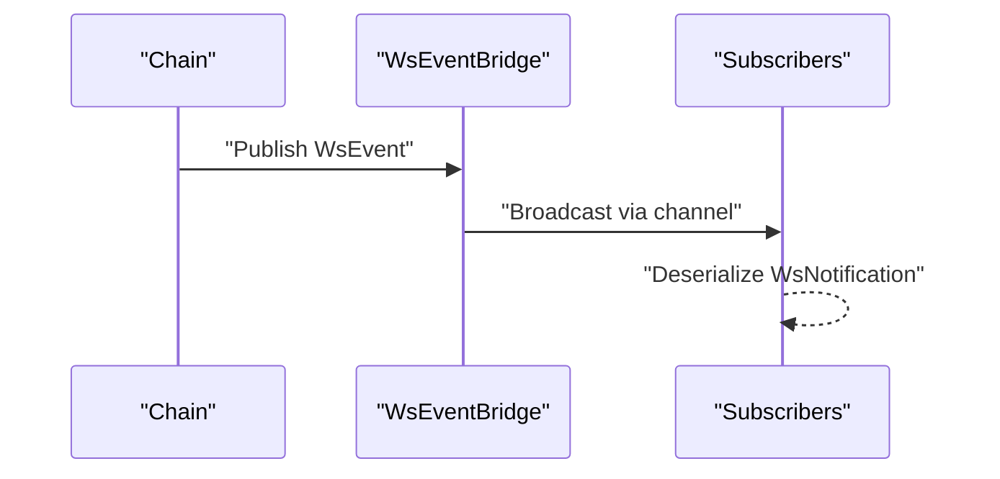
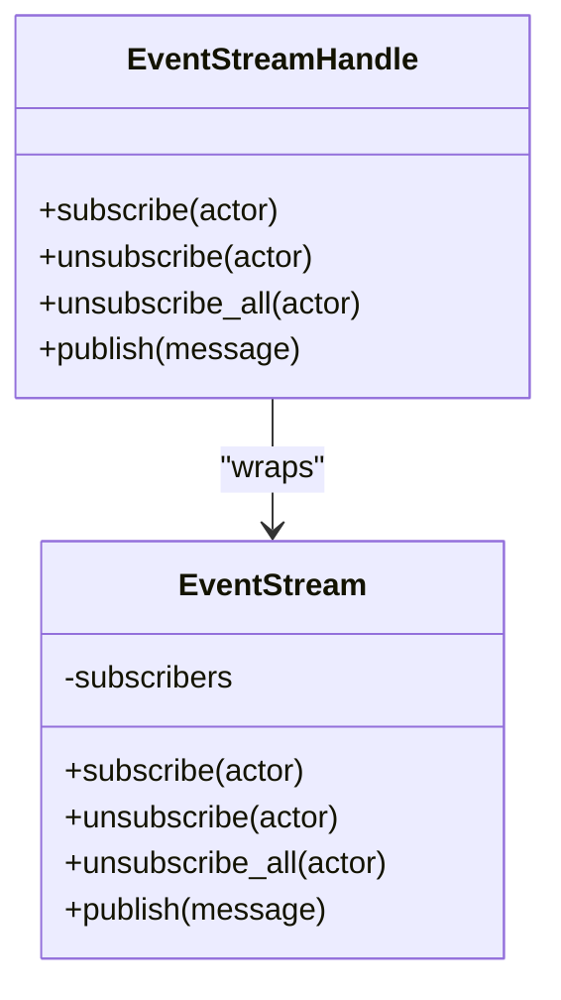
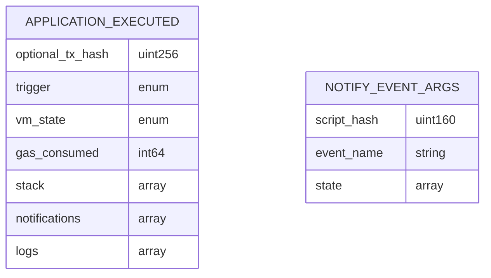
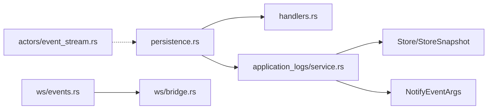

# Event Handling

<cite>
**Referenced Files in This Document**
- [neo-core/src/events/mod.rs](file://neo-core/src/events/mod.rs)
- [neo-core/src/events/handlers.rs](file://neo-core/src/events/handlers.rs)
- [neo-core/src/application_logs/service.rs](file://neo-core/src/application_logs/service.rs)
- [neo-core/src/neo_system/persistence.rs](file://neo-core/src/neo_system/persistence.rs)
- [neo-core/src/actors/event_stream.rs](file://neo-core/src/actors/event_stream.rs)
- [neo-rpc/src/server/ws/events.rs](file://neo-rpc/src/server/ws/events.rs)
- [neo-rpc/src/server/ws/bridge.rs](file://neo-rpc/src/server/ws/bridge.rs)
- [neo-core/src/ledger/blockchain_application_executed.rs](file://neo-core/src/ledger/blockchain_application_executed.rs)
- [neo-vm/src/notify_event_args.rs](file://neo-vm/src/notify_event_args.rs)
</cite>

## Table of Contents
1. [Introduction](#introduction)
2. [Project Structure](#project-structure)
3. [Core Components](#core-components)
4. [Architecture Overview](#architecture-overview)
5. [Detailed Component Analysis](#detailed-component-analysis)
6. [Dependency Analysis](#dependency-analysis)
7. [Performance Considerations](#performance-considerations)
8. [Troubleshooting Guide](#troubleshooting-guide)
9. [Conclusion](#conclusion)

## Introduction
This document explains event handling in Neo-RS services with a focus on the event-driven architecture that allows services to react to blockchain events, application logs, and system state changes. It covers how to implement event handlers, subscribe to specific events, process asynchronous event streams, and handle built-in events such as block commits, transaction processing, and token transfers. It also provides guidance on event ordering, backpressure management, performance considerations, and best practices for efficient event processing.

## Project Structure
Neo-RS organizes event-related functionality across several modules:
- Core event traits and manager for internal plugin-style events
- Blockchain commit hooks for pre- and post-commit phases
- Actor-based typed event stream for inter-service messaging
- WebSocket bridge and types for real-time external event exposure
- Application logs service capturing execution results and notifications
- Ledger execution result model and VM notification arguments

**Diagram sources**
- [neo-core/src/events/mod.rs:10-196](file://neo-core/src/events/mod.rs#L10-L196)
- [neo-core/src/events/handlers.rs:9-63](file://neo-core/src/events/handlers.rs#L9-L63)
- [neo-core/src/actors/event_stream.rs:5-89](file://neo-core/src/actors/event_stream.rs#L5-L89)
- [neo-core/src/neo_system/persistence.rs:651-679](file://neo-core/src/neo_system/persistence.rs#L651-L679)
- [neo-core/src/application_logs/service.rs:217-277](file://neo-core/src/application_logs/service.rs#L217-L277)
- [neo-rpc/src/server/ws/events.rs:67-216](file://neo-rpc/src/server/ws/events.rs#L67-L216)
- [neo-rpc/src/server/ws/bridge.rs:12-44](file://neo-rpc/src/server/ws/bridge.rs#L12-L44)
- [neo-core/src/ledger/blockchain_application_executed.rs:6-56](file://neo-core/src/ledger/blockchain_application_executed.rs#L6-L56)
- [neo-vm/src/notify_event_args.rs:9-40](file://neo-vm/src/notify_event_args.rs#L9-L40)

**Section sources**
- [neo-core/src/events/mod.rs:10-196](file://neo-core/src/events/mod.rs#L10-L196)
- [neo-core/src/events/handlers.rs:9-63](file://neo-core/src/events/handlers.rs#L9-L63)
- [neo-core/src/actors/event_stream.rs:5-89](file://neo-core/src/actors/event_stream.rs#L5-L89)
- [neo-core/src/neo_system/persistence.rs:651-679](file://neo-core/src/neo_system/persistence.rs#L651-L679)
- [neo-core/src/application_logs/service.rs:217-277](file://neo-core/src/application_logs/service.rs#L217-L277)
- [neo-rpc/src/server/ws/events.rs:67-216](file://neo-rpc/src/server/ws/events.rs#L67-L216)
- [neo-rpc/src/server/ws/bridge.rs:12-44](file://neo-rpc/src/server/ws/bridge.rs#L12-L44)
- [neo-core/src/ledger/blockchain_application_executed.rs:6-56](file://neo-core/src/ledger/blockchain_application_executed.rs#L6-L56)
- [neo-vm/src/notify_event_args.rs:9-40](file://neo-vm/src/notify_event_args.rs#L9-L40)

## Core Components
- Handler traits for lifecycle hooks around block commitment:
  - CommittingHandler: invoked before state is persisted; supports fast-sync gating and fallible hook
  - CommittedHandler: invoked after state is committed
- Internal event manager and lightweight plugin events for node lifecycle and mempool activity
- Typed actor event stream for pub/sub between actors
- WebSocket event types and bridge to expose chain events externally
- ApplicationLogsService implementing committing/committed hooks to capture execution logs and notifications
- Execution result model (ApplicationExecuted) and VM notification arguments (NotifyEventArgs)

Key responsibilities:
- Provide extension points for services to observe and react to blockchain state transitions
- Offer both synchronous hooks (committing/committed) and asynchronous channels (actor event stream, WebSocket broadcast)
- Capture and persist application logs and notifications for later retrieval or streaming

**Section sources**
- [neo-core/src/events/handlers.rs:9-63](file://neo-core/src/events/handlers.rs#L9-L63)
- [neo-core/src/events/mod.rs:16-135](file://neo-core/src/events/mod.rs#L16-L135)
- [neo-core/src/actors/event_stream.rs:5-89](file://neo-core/src/actors/event_stream.rs#L5-L89)
- [neo-rpc/src/server/ws/events.rs:67-216](file://neo-rpc/src/server/ws/events.rs#L67-L216)
- [neo-core/src/application_logs/service.rs:217-277](file://neo-core/src/application_logs/service.rs#L217-L277)
- [neo-core/src/ledger/blockchain_application_executed.rs:6-56](file://neo-core/src/ledger/blockchain_application_executed.rs#L6-L56)
- [neo-vm/src/notify_event_args.rs:9-40](file://neo-vm/src/notify_event_args.rs#L9-L40)

## Architecture Overview
The event pipeline spans three layers:
- Lifecycle hooks: CommittingHandler and CommittedHandler are invoked by the persistence layer during block finalization
- Internal messaging: Actor EventStream enables typed pub/sub among components
- External exposure: WebSocket bridge publishes standardized events to clients

**Diagram sources**
- [neo-core/src/neo_system/persistence.rs:651-679](file://neo-core/src/neo_system/persistence.rs#L651-L679)
- [neo-core/src/application_logs/service.rs:217-277](file://neo-core/src/application_logs/service.rs#L217-L277)
- [neo-rpc/src/server/ws/bridge.rs:12-44](file://neo-rpc/src/server/ws/bridge.rs#L12-L44)
- [neo-rpc/src/server/ws/events.rs:67-216](file://neo-rpc/src/server/ws/events.rs#L67-L216)

## Detailed Component Analysis

### Block Commit Hooks (Committing and Committed)
- Committing phase:
  - Invoked with block, in-memory DataCache snapshot, and list of ApplicationExecuted
  - Supports fast sync filtering via run_during_fast_sync
  - Fallible variant try_blockchain_committing_handler allows errors to abort commit
- Committed phase:
  - Invoked after successful commit; suitable for durable side effects

**Diagram sources**
- [neo-core/src/neo_system/persistence.rs:651-679](file://neo-core/src/neo_system/persistence.rs#L651-L679)
- [neo-core/src/events/handlers.rs:16-44](file://neo-core/src/events/handlers.rs#L16-L44)

**Section sources**
- [neo-core/src/events/handlers.rs:9-63](file://neo-core/src/events/handlers.rs#L9-L63)
- [neo-core/src/neo_system/persistence.rs:651-679](file://neo-core/src/neo_system/persistence.rs#L651-L679)

### Application Logs Service
- Implements CommittingHandler and CommittedHandler
- Captures block-level and transaction-level execution logs and notifications into storage using a snapshot/batch pattern
- Uses exception policy to disable itself on persistent failures to avoid blocking the chain

**Diagram sources**
- [neo-core/src/application_logs/service.rs:25-277](file://neo-core/src/application_logs/service.rs#L25-L277)
- [neo-core/src/events/handlers.rs:9-44](file://neo-core/src/events/handlers.rs#L9-L44)

**Section sources**
- [neo-core/src/application_logs/service.rs:217-277](file://neo-core/src/application_logs/service.rs#L217-L277)
- [neo-core/src/application_logs/service.rs:61-129](file://neo-core/src/application_logs/service.rs#L61-L129)

### WebSocket Real-Time Events
- Event types include block_added, transaction_added, transaction_removed, and notification
- WsEventBridge uses a broadcast channel to fan out events to subscribers
- WsNotification serializes events into JSON-RPC 2.0 notifications

**Diagram sources**
- [neo-rpc/src/server/ws/events.rs:67-216](file://neo-rpc/src/server/ws/events.rs#L67-L216)
- [neo-rpc/src/server/ws/bridge.rs:12-44](file://neo-rpc/src/server/ws/bridge.rs#L12-L44)

**Section sources**
- [neo-rpc/src/server/ws/events.rs:67-216](file://neo-rpc/src/server/ws/events.rs#L67-L216)
- [neo-rpc/src/server/ws/bridge.rs:12-44](file://neo-rpc/src/server/ws/bridge.rs#L12-L44)

### Actor-Typed Event Stream
- Provides type-safe publish/subscribe between actors
- Subscriptions keyed by TypeId; messages cloned and delivered via ActorRef.tell

**Diagram sources**
- [neo-core/src/actors/event_stream.rs:5-89](file://neo-core/src/actors/event_stream.rs#L5-L89)

**Section sources**
- [neo-core/src/actors/event_stream.rs:5-89](file://neo-core/src/actors/event_stream.rs#L5-L89)

### Built-In Event Sources and Data Models
- ApplicationExecuted aggregates execution results including notifications and logs
- NotifyEventArgs represents contract notifications emitted at runtime
- Token management emits Transfer and Created notifications through native contracts

**Diagram sources**
- [neo-core/src/ledger/blockchain_application_executed.rs:6-56](file://neo-core/src/ledger/blockchain_application_executed.rs#L6-L56)
- [neo-vm/src/notify_event_args.rs:9-40](file://neo-vm/src/notify_event_args.rs#L9-L40)

**Section sources**
- [neo-core/src/ledger/blockchain_application_executed.rs:6-56](file://neo-core/src/ledger/blockchain_application_executed.rs#L6-L56)
- [neo-vm/src/notify_event_args.rs:9-40](file://neo-vm/src/notify_event_args.rs#L9-L40)

## Dependency Analysis
- Persistence layer depends on handler traits to invoke user-defined logic during commit phases
- ApplicationLogsService depends on Store/StoreSnapshot for batched writes and on settings for network filtering and exception policy
- WebSocket module depends on event types and bridge to serialize and broadcast events
- Actor event stream is independent and used for internal decoupled messaging

**Diagram sources**
- [neo-core/src/neo_system/persistence.rs:651-679](file://neo-core/src/neo_system/persistence.rs#L651-L679)
- [neo-core/src/application_logs/service.rs:217-277](file://neo-core/src/application_logs/service.rs#L217-L277)
- [neo-rpc/src/server/ws/events.rs:67-216](file://neo-rpc/src/server/ws/events.rs#L67-L216)
- [neo-rpc/src/server/ws/bridge.rs:12-44](file://neo-rpc/src/server/ws/bridge.rs#L12-L44)
- [neo-core/src/actors/event_stream.rs:5-89](file://neo-core/src/actors/event_stream.rs#L5-L89)

**Section sources**
- [neo-core/src/neo_system/persistence.rs:651-679](file://neo-core/src/neo_system/persistence.rs#L651-L679)
- [neo-core/src/application_logs/service.rs:217-277](file://neo-core/src/application_logs/service.rs#L217-L277)
- [neo-rpc/src/server/ws/events.rs:67-216](file://neo-rpc/src/server/ws/events.rs#L67-L216)
- [neo-rpc/src/server/ws/bridge.rs:12-44](file://neo-rpc/src/server/ws/bridge.rs#L12-L44)
- [neo-core/src/actors/event_stream.rs:5-89](file://neo-core/src/actors/event_stream.rs#L5-L89)

## Performance Considerations
- Prefer CommittingHandler for work that must complete before state is persisted; use try_blockchain_committing_handler to fail fast on errors
- Use run_during_fast_sync to opt-in handlers for fast sync scenarios; skip heavy work during catch-up
- Batch writes in committing phase and commit in committed phase to reduce IO overhead
- Keep handler logic minimal and offload heavy processing to background tasks or actors
- For WebSocket broadcasting, size broadcast channels appropriately to avoid dropping events under load
- Monitor handler latency and error rates; configure exception policies to isolate failing handlers

[No sources needed since this section provides general guidance]

## Troubleshooting Guide
- If a handler panics or returns an error during committing, the persistence layer may abort the commit; inspect handler implementations and ensure robust error handling
- ApplicationLogsService disables itself on repeated failures based on configured exception policy; verify settings and storage health
- WebSocket clients may miss events if subscribers fall behind; adjust channel capacity and client backpressure strategies
- Ensure fast sync behavior aligns with expectations by checking run_during_fast_sync flags

**Section sources**
- [neo-core/src/neo_system/persistence.rs:651-679](file://neo-core/src/neo_system/persistence.rs#L651-L679)
- [neo-core/src/application_logs/service.rs:79-101](file://neo-core/src/application_logs/service.rs#L79-L101)
- [neo-rpc/src/server/ws/bridge.rs:12-44](file://neo-rpc/src/server/ws/bridge.rs#L12-L44)

## Conclusion
Neo-RS provides a layered event system combining deterministic lifecycle hooks, internal typed messaging, and external real-time streaming. Implementers should leverage CommittingHandler and CommittedHandler for reliable integration with block finalization, use the actor event stream for decoupled internal communication, and employ the WebSocket bridge to expose events to clients. Following the recommended patterns ensures correct event ordering, resilience under failure, and high throughput during normal and fast-sync operations.