# Code Translation Patterns

<cite>
**Referenced Files in This Document**
- [contract_task.rs](file://neo-primitives/src/contract_task.rs)
- [messages.rs](file://neo-core/src/network/p2p/messages.rs)
- [j_token.rs](file://neo-json/src/j_token.rs)
- [json_serializer.rs](file://neo-vm/src/json_serializer.rs)
- [lifecycle.rs](file://neo-consensus/src/service/lifecycle.rs)
- [traits.rs](file://neo-p2p/src/traits.rs)
- [shared_states.rs](file://neo-vm/src/execution_context/shared_states.rs)
- [mod.rs](file://neo-rpc/src/server/mod.rs)
- [routes.rs](file://neo-rpc/src/server/routes/mod.rs)
- [rpc_error.rs](file://neo-rpc/src/server/rpc_error.rs)
- [serializable_mod.rs](file://neo-io/src/serializable/mod.rs)
</cite>

## Table of Contents
1. Introduction
2. Project Structure
3. Core Components
4. Architecture Overview
5. Detailed Component Analysis
6. Dependency Analysis
7. Performance Considerations
8. Troubleshooting Guide
9. Conclusion

## Introduction
This document provides comprehensive translation patterns for converting C# plugin code to Rust services in the Neo N3 ecosystem. It focuses on idiomatic Rust equivalents for common C# patterns, including asynchronous programming with futures, error handling with Result types, trait-based interfaces, memory management, RPC handlers, message processing, consensus participation, P2P payload handling, attributes and decorators translated to macros, serialization differences between JSON.NET and serde, concurrency models, shared state safety, and translating LINQ and functional patterns into idiomatic Rust.

## Project Structure
The repository is organized by feature domains:
- neo-primitives: core primitives and async task wrappers (e.g., ContractTask)
- neo-core: networking, P2P messages, smart contract integration, iterators
- neo-p2p: traits and abstractions for peer management, broadcasting, events
- neo-consensus: dBFT consensus service lifecycle and message routing
- neo-rpc: JSON-RPC server, routes, error modeling, method registration
- neo-json: JToken implementation compatible with C# Neo.Json
- neo-vm: VM stack item serialization to/from JSON with C# parity
- neo-io: binary serialization macros and helpers

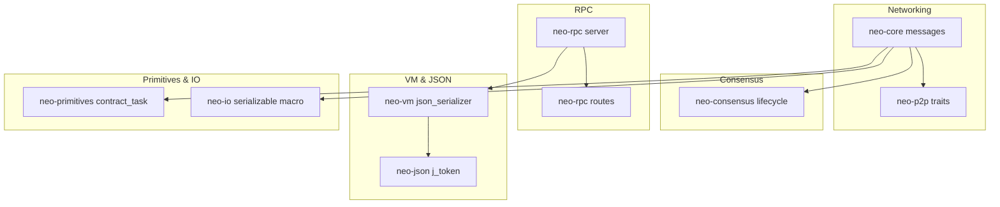

**Diagram sources**
- [messages.rs:1-171](file://neo-core/src/network/p2p/messages.rs#L1-L171)
- [traits.rs:51-213](file://neo-p2p/src/traits.rs#L51-L213)
- [lifecycle.rs:68-154](file://neo-consensus/src/service/lifecycle.rs#L68-L154)
- [mod.rs:1-66](file://neo-rpc/src/server/mod.rs#L1-L66)
- [routes.rs:161-183](file://neo-rpc/src/server/routes/mod.rs#L161-L183)
- [json_serializer.rs:1-287](file://neo-vm/src/json_serializer.rs#L1-L287)
- [j_token.rs:1-519](file://neo-json/src/j_token.rs#L1-L519)
- [contract_task.rs:1-41](file://neo-primitives/src/contract_task.rs#L1-L41)
- [serializable_mod.rs:67-181](file://neo-io/src/serializable/mod.rs#L67-L181)

**Section sources**
- [messages.rs:1-171](file://neo-core/src/network/p2p/messages.rs#L1-L171)
- [traits.rs:51-213](file://neo-p2p/src/traits.rs#L51-L213)
- [lifecycle.rs:68-154](file://neo-consensus/src/service/lifecycle.rs#L68-L154)
- [mod.rs:1-66](file://neo-rpc/src/server/mod.rs#L1-L66)
- [routes.rs:161-183](file://neo-rpc/src/server/routes/mod.rs#L161-L183)
- [json_serializer.rs:1-287](file://neo-vm/src/json_serializer.rs#L1-L287)
- [j_token.rs:1-519](file://neo-json/src/j_token.rs#L1-L519)
- [contract_task.rs:1-41](file://neo-primitives/src/contract_task.rs#L1-L41)
- [serializable_mod.rs:67-181](file://neo-io/src/serializable/mod.rs#L67-L181)

## Core Components
- Asynchronous tasks: ContractTask wraps a boxed future to emulate C# ContractTask behavior.
- P2P messaging: ProtocolMessage enum represents all network payloads; NetworkMessage handles framing and compression.
- Consensus lifecycle: process_message validates, deduplicates, and routes consensus messages to specific handlers.
- RPC server: modular server with route helpers for success/error responses and typed errors.
- JSON token model: JToken mirrors C# Neo.Json.JToken with serde-based parsing and serialization.
- VM JSON serializer: JsonSerializer bridges StackItem and JSON with C#-compatible escaping and order preservation.
- Serializable macro: A declarative macro generates size/serialize/deserialize implementations for structs.

**Section sources**
- [contract_task.rs:1-41](file://neo-primitives/src/contract_task.rs#L1-L41)
- [messages.rs:18-171](file://neo-core/src/network/p2p/messages.rs#L18-L171)
- [lifecycle.rs:68-154](file://neo-consensus/src/service/lifecycle.rs#L68-L154)
- [routes.rs:161-183](file://neo-rpc/src/server/routes/mod.rs#L161-L183)
- [j_token.rs:18-36](file://neo-json/src/j_token.rs#L18-L36)
- [json_serializer.rs:17-49](file://neo-vm/src/json_serializer.rs#L17-L49)
- [serializable_mod.rs:67-181](file://neo-io/src/serializable/mod.rs#L67-L181)

## Architecture Overview
The system composes layered components:
- P2P layer defines traits for peer management, broadcasting, and event subscription.
- Core networking uses strongly-typed ProtocolMessage enums and NetworkMessage framing.
- Consensus service consumes P2P events and processes dBFT messages with validation and replay protection.
- RPC server exposes JSON-RPC endpoints, building standardized success/error responses.
- VM and JSON layers ensure compatibility with C# behavior for serialization and object representation.

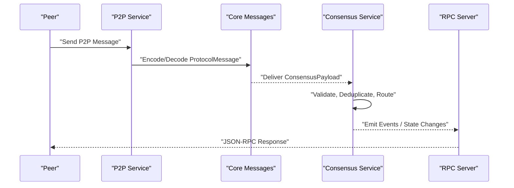

**Diagram sources**
- [traits.rs:51-213](file://neo-p2p/src/traits.rs#L51-L213)
- [messages.rs:18-171](file://neo-core/src/network/p2p/messages.rs#L18-L171)
- [lifecycle.rs:68-154](file://neo-consensus/src/service/lifecycle.rs#L68-L154)
- [routes.rs:161-183](file://neo-rpc/src/server/routes/mod.rs#L161-L183)

## Detailed Component Analysis

### Async/Await vs Futures: ContractTask
C# plugins often use asynchronous tasks that can be awaited or polled. In Rust, futures provide equivalent semantics via std::future::Future. ContractTask encapsulates a boxed, pinned future and implements Future to expose polling semantics.

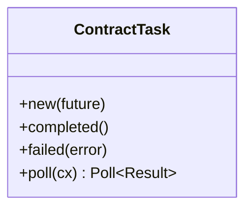

**Diagram sources**
- [contract_task.rs:7-40](file://neo-primitives/src/contract_task.rs#L7-L40)

Translation guidance:
- Replace C# Task/ContractTask with Rust futures; wrap in ContractTask when interoperability requires a uniform type.
- Use async blocks and .await at call sites; propagate errors with ? and map to appropriate Result types.

**Section sources**
- [contract_task.rs:1-41](file://neo-primitives/src/contract_task.rs#L1-L41)

### Error Handling: Result Types and RPC Errors
Rust favors explicit error propagation using Result<T, E>. The RPC layer demonstrates structured error responses with codes and messages.

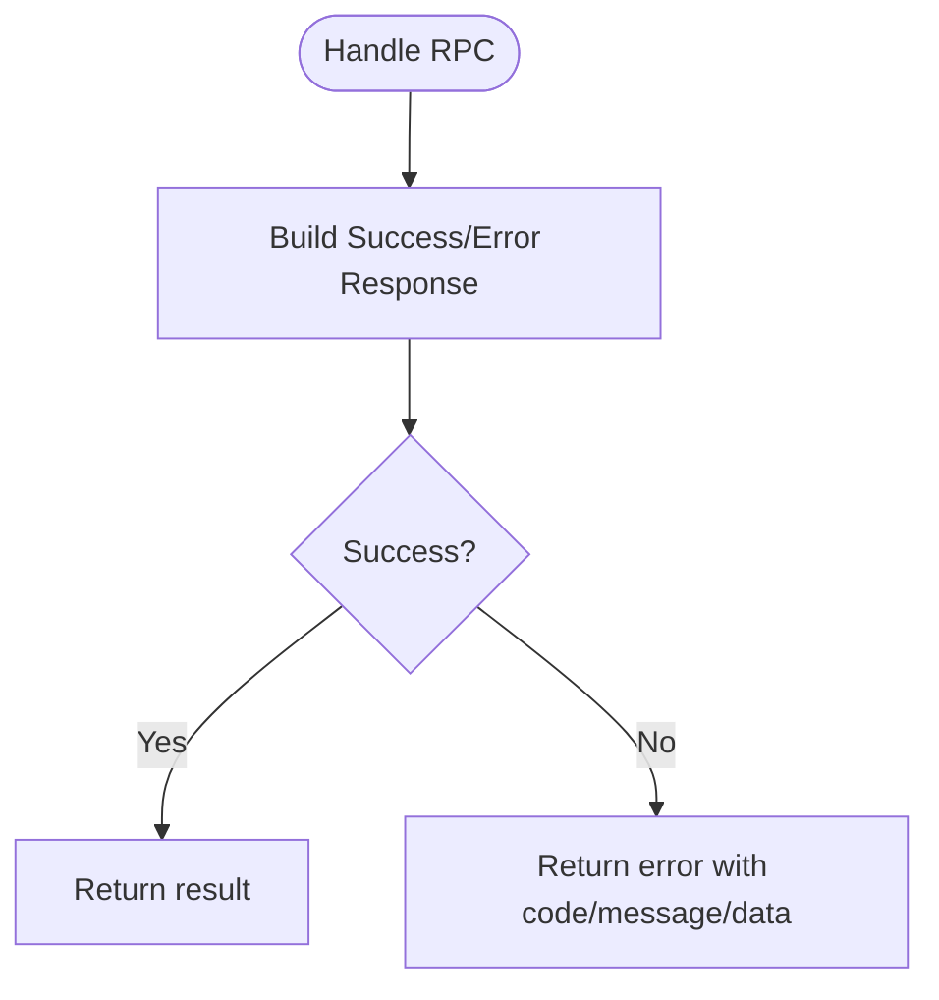

**Diagram sources**
- [routes.rs:161-183](file://neo-rpc/src/server/routes/mod.rs#L161-L183)
- [rpc_error.rs:222-253](file://neo-rpc/src/server/rpc_error.rs#L222-L253)

Translation guidance:
- Convert exceptions to Result<T, E>; define domain-specific error enums with thiserror-style formatting.
- Map internal errors to RPC error objects with consistent codes and messages.

**Section sources**
- [routes.rs:161-183](file://neo-rpc/src/server/routes/mod.rs#L161-L183)
- [rpc_error.rs:222-253](file://neo-rpc/src/server/rpc_error.rs#L222-L253)

### Trait-Based Interfaces: P2P Abstractions
C# plugins often implement interfaces for extensibility. Rust uses traits to define capabilities like peer management, broadcasting, and event subscription.

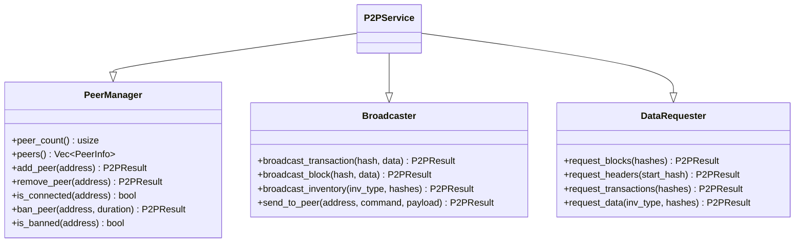

**Diagram sources**
- [traits.rs:51-213](file://neo-p2p/src/traits.rs#L51-L213)

Translation guidance:
- Replace interface implementations with trait impls; compose multiple traits into a unified service trait.
- Use Send + Sync bounds to ensure thread-safety across async runtimes.

**Section sources**
- [traits.rs:51-213](file://neo-p2p/src/traits.rs#L51-L213)

### Memory Management: Ownership and Shared State
C# relies on GC; Rust uses ownership, borrowing, and explicit synchronization for shared state.

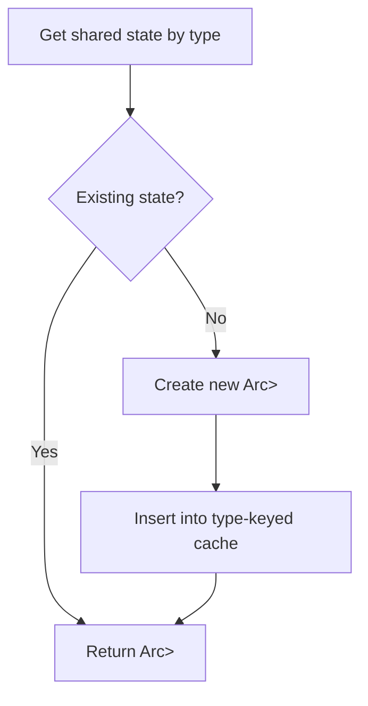

**Diagram sources**
- [shared_states.rs:125-166](file://neo-vm/src/execution_context/shared_states.rs#L125-L166)

Translation guidance:
- Replace static fields and global caches with type-id keyed maps holding Arc<Mutex<T>>.
- Use Arc for shared references and Mutex for interior mutability; prefer fine-grained locks to reduce contention.

**Section sources**
- [shared_states.rs:125-166](file://neo-vm/src/execution_context/shared_states.rs#L125-L166)

### RPC Handlers: Method Registration and Response Building
C# plugins register methods via attributes/decorators. Rust uses macros and registry modules to declare and serve RPC methods.

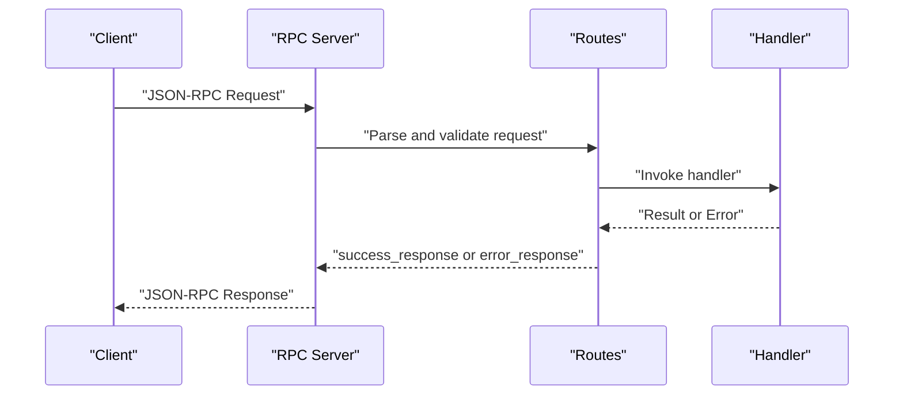

**Diagram sources**
- [mod.rs:1-66](file://neo-rpc/src/server/mod.rs#L1-L66)
- [routes.rs:161-183](file://neo-rpc/src/server/routes/mod.rs#L161-L183)

Translation guidance:
- Replace attribute-based method registration with macro-generated handlers and a central registry.
- Standardize response construction using helper functions for success and error payloads.

**Section sources**
- [mod.rs:1-66](file://neo-rpc/src/server/mod.rs#L1-L66)
- [routes.rs:161-183](file://neo-rpc/src/server/routes/mod.rs#L161-L183)

### Message Processors: P2P Payload Handling
C# plugins handle messages via switch-like dispatch. Rust uses enums and match expressions for strong typing and exhaustive handling.

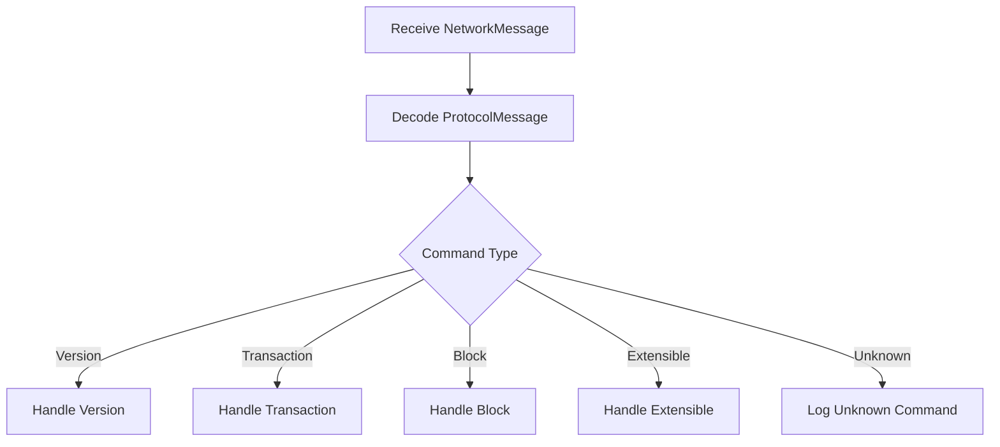

**Diagram sources**
- [messages.rs:113-171](file://neo-core/src/network/p2p/messages.rs#L113-L171)
- [messages.rs:173-269](file://neo-core/src/network/p2p/messages.rs#L173-L269)

Translation guidance:
- Replace dynamic message handling with an enum of payload variants and a match-based dispatcher.
- Use macros to generate codec implementations for each variant to minimize boilerplate.

**Section sources**
- [messages.rs:113-171](file://neo-core/src/network/p2p/messages.rs#L113-L171)
- [messages.rs:173-269](file://neo-core/src/network/p2p/messages.rs#L173-L269)

### Consensus Participants: Lifecycle and Message Routing
C# consensus plugins manage view changes, prepare/commit phases, and recovery messages. Rust’s ConsensusService mirrors this flow with explicit validation and routing.

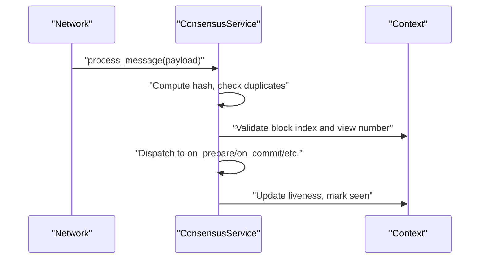

**Diagram sources**
- [lifecycle.rs:68-154](file://neo-consensus/src/service/lifecycle.rs#L68-L154)

Translation guidance:
- Translate state machines into methods with clear preconditions and side effects.
- Use Result types for errors and log/debug traces for diagnostics.

**Section sources**
- [lifecycle.rs:68-154](file://neo-consensus/src/service/lifecycle.rs#L68-L154)

### Attributes and Decorators to Macros
C# attributes decorate methods to expose them as RPC handlers. Rust uses procedural macros and derive macros to generate registration and metadata.

Translation guidance:
- Replace attributes with a macro that expands to handler registration and descriptor generation.
- Use derive macros for serialization/deserialization and error formatting where applicable.

[No sources needed since this section provides general guidance]

### Serialization Differences: JSON.NET vs serde
C# uses JSON.NET; Rust uses serde for serialization and deserialization. The project includes a custom JToken and a VM JSON serializer that preserve C# parity.

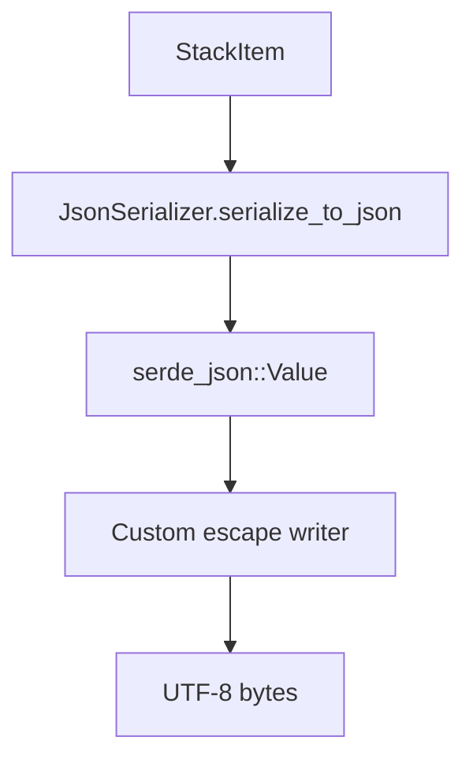

**Diagram sources**
- [json_serializer.rs:17-49](file://neo-vm/src/json_serializer.rs#L17-L49)
- [json_serializer.rs:51-124](file://neo-vm/src/json_serializer.rs#L51-L124)
- [json_serializer.rs:126-287](file://neo-vm/src/json_serializer.rs#L126-L287)
- [j_token.rs:18-36](file://neo-json/src/j_token.rs#L18-L36)

Translation guidance:
- Prefer serde for structured data; use custom serializers when byte-level parity with C# is required.
- Preserve insertion order for maps by enabling preserve_order and constructing ordered collections.

**Section sources**
- [json_serializer.rs:17-49](file://neo-vm/src/json_serializer.rs#L17-L49)
- [json_serializer.rs:51-124](file://neo-vm/src/json_serializer.rs#L51-L124)
- [json_serializer.rs:126-287](file://neo-vm/src/json_serializer.rs#L126-L287)
- [j_token.rs:18-36](file://neo-json/src/j_token.rs#L18-L36)

### Concurrency Model and Safe Shared State
C# uses threads and async/await with managed memory. Rust uses async runtimes (tokio/async-std) and explicit synchronization primitives.

Translation guidance:
- Use Arc for shared ownership and Mutex/RwLock for interior mutability.
- Avoid global mutable state; prefer dependency injection and context-bound state.
- For cross-thread communication, use channels or actor-like patterns with bounded queues.

**Section sources**
- [shared_states.rs:125-166](file://neo-vm/src/execution_context/shared_states.rs#L125-L166)

### Translating LINQ and Functional Patterns
C# LINQ operations (Select, Where, GroupBy) translate to iterator combinators in Rust.

Translation guidance:
- Replace Select with map, Where with filter, GroupBy with group_by (from itertools or standard library).
- Use fold/reduce for aggregations; prefer lazy iterators to avoid intermediate allocations.

[No sources needed since this section provides general guidance]

## Dependency Analysis
The components exhibit clear layering:
- P2P traits abstract networking concerns used by core and consensus.
- Core messages depend on P2P traits and feed consensus.
- RPC server depends on routes and error modeling; interacts with VM JSON for responses.
- VM JSON serializer depends on serde and preserves C# behavior.
- Serializable macro reduces duplication across payload types.

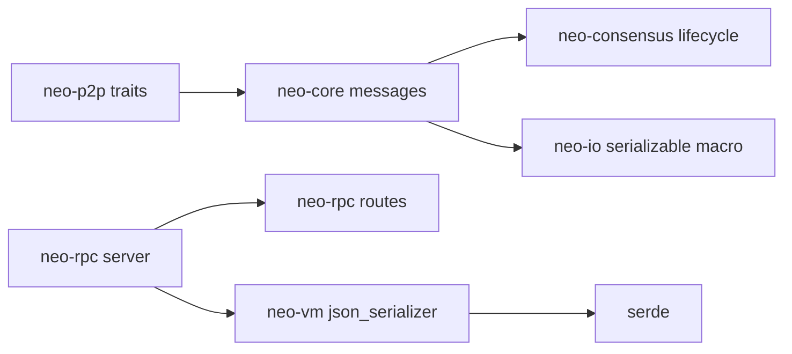

**Diagram sources**
- [traits.rs:51-213](file://neo-p2p/src/traits.rs#L51-L213)
- [messages.rs:113-171](file://neo-core/src/network/p2p/messages.rs#L113-L171)
- [lifecycle.rs:68-154](file://neo-consensus/src/service/lifecycle.rs#L68-L154)
- [mod.rs:1-66](file://neo-rpc/src/server/mod.rs#L1-L66)
- [routes.rs:161-183](file://neo-rpc/src/server/routes/mod.rs#L161-L183)
- [json_serializer.rs:1-287](file://neo-vm/src/json_serializer.rs#L1-L287)
- [serializable_mod.rs:67-181](file://neo-io/src/serializable/mod.rs#L67-L181)

**Section sources**
- [traits.rs:51-213](file://neo-p2p/src/traits.rs#L51-L213)
- [messages.rs:113-171](file://neo-core/src/network/p2p/messages.rs#L113-L171)
- [lifecycle.rs:68-154](file://neo-consensus/src/service/lifecycle.rs#L68-L154)
- [mod.rs:1-66](file://neo-rpc/src/server/mod.rs#L1-L66)
- [routes.rs:161-183](file://neo-rpc/src/server/routes/mod.rs#L161-L183)
- [json_serializer.rs:1-287](file://neo-vm/src/json_serializer.rs#L1-L287)
- [serializable_mod.rs:67-181](file://neo-io/src/serializable/mod.rs#L67-L181)

## Performance Considerations
- Prefer lazy iterators over eager collections to reduce allocations.
- Use reserve/capacity for known-size sequences when building vectors/maps.
- Minimize locking scope; prefer fine-grained locks and lock-free structures where possible.
- Avoid unnecessary cloning; pass references and use Copy types for small values.
- Enable features like preserve_order only when necessary to maintain C# parity.

[No sources needed since this section provides general guidance]

## Troubleshooting Guide
Common issues and resolutions:
- Mismatched message commands: Ensure ProtocolMessage variants align with MessageCommand; verify serialization/deserialization paths.
- Duplicate consensus messages: Confirm hash computation and seen-message caching logic.
- JSON serialization divergence: Validate escape behavior and number ranges; use custom writers for C# parity.
- Error propagation: Use ? operator consistently; map lower-level errors to domain-specific types.

**Section sources**
- [messages.rs:173-269](file://neo-core/src/network/p2p/messages.rs#L173-L269)
- [lifecycle.rs:80-154](file://neo-consensus/src/service/lifecycle.rs#L80-L154)
- [json_serializer.rs:51-124](file://neo-vm/src/json_serializer.rs#L51-L124)
- [routes.rs:161-183](file://neo-rpc/src/server/routes/mod.rs#L161-L183)

## Conclusion
Translating C# plugin code to Rust involves adopting idiomatic patterns: futures for async, Result for errors, traits for interfaces, explicit ownership and synchronization, and serde for serialization. The repository demonstrates robust implementations for P2P messaging, consensus lifecycle, RPC handling, and VM JSON compatibility. By following these patterns, developers can achieve high performance, safety, and protocol fidelity while maintaining clarity and maintainability.