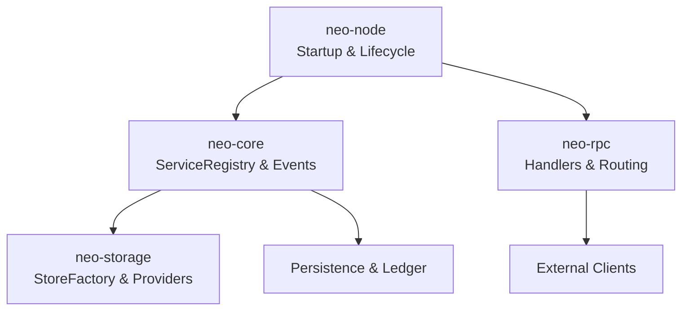
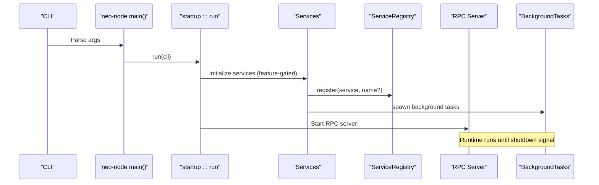
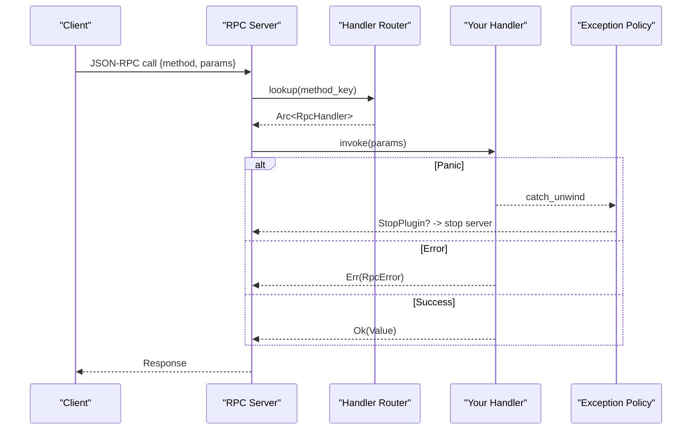
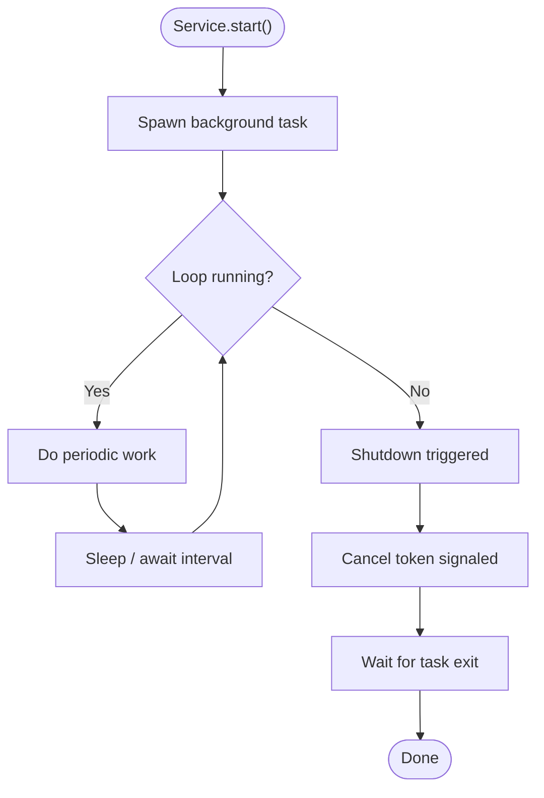
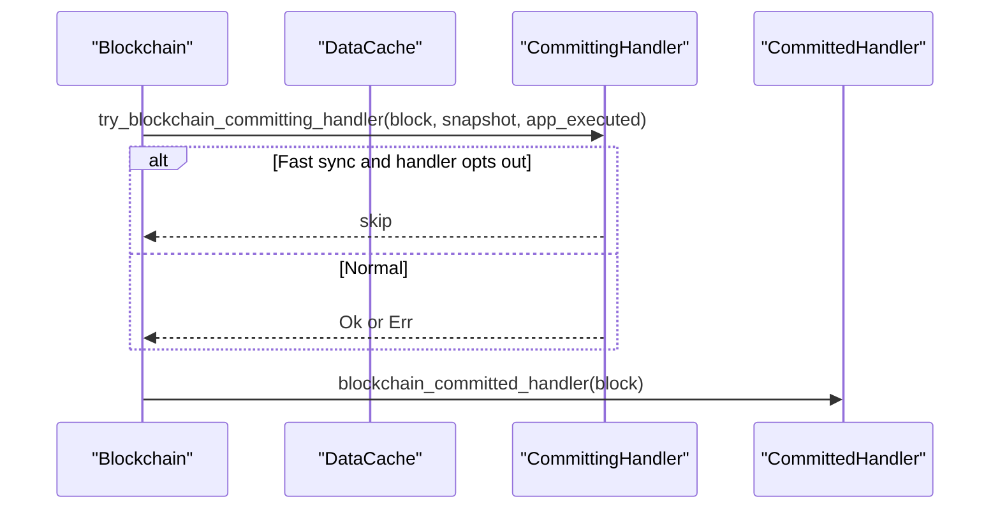
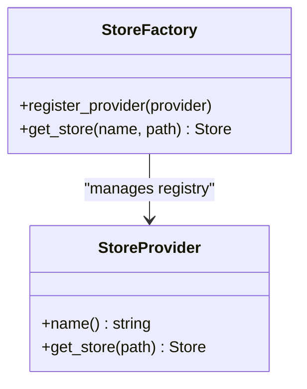
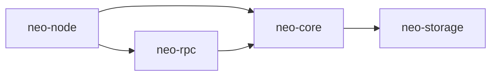

# Migration Guide

<cite>
**Referenced Files in This Document**
- [README.md](file://README.md)
- [PLUGIN_SYSTEM.md](file://docs/PLUGIN_SYSTEM.md)
- [ARCHITECTURE_COMPARISON.md](file://docs/ARCHITECTURE_COMPARISON.md)
- [main.rs](file://neo-node/src/main.rs)
- [startup/mod.rs](file://neo-node/src/startup/mod.rs)
- [tasks.rs](file://neo-node/src/startup/tasks.rs)
- [registry.rs](file://neo-core/src/neo_system/registry.rs)
- [handlers.rs (RPC)](file://neo-rpc/src/server/routes/handlers.rs)
- [handlers.rs (events)](file://neo-core/src/events/handlers.rs)
- [persistence.rs](file://neo-core/src/neo_system/persistence.rs)
- [store_provider.rs](file://neo-storage/src/persistence/store_provider.rs)
- [store_factory.rs](file://neo-storage/src/persistence/store_factory.rs)
</cite>

## Table of Contents
1. [Introduction](#introduction)
2. [Project Structure](#project-structure)
3. [Core Components](#core-components)
4. [Architecture Overview](#architecture-overview)
5. [Detailed Component Analysis](#detailed-component-analysis)
6. [Dependency Analysis](#dependency-analysis)
7. [Performance Considerations](#performance-considerations)
8. [Troubleshooting Guide](#troubleshooting-guide)
9. [Conclusion](#conclusion)
10. [Appendices](#appendices)

## Introduction
This guide explains how to migrate C# plugins into the Rust implementation’s compile-time integration model. It covers identifying plugin dependencies, translating logic to Rust, wiring services into the node lifecycle, and adapting RPC handlers, background tasks, event handlers, and storage extensions. It also provides side-by-side comparisons, best practices, troubleshooting tips, and testing strategies to ensure functional parity with the C# reference.

## Project Structure
The Rust codebase is organized as a multi-crate workspace where each crate has a focused responsibility:
- neo-node: Node daemon, CLI, startup orchestration, service initialization, signal handling, and graceful shutdown
- neo-core: Core system, events, persistence, actors, VM integration, and service registry
- neo-rpc: JSON-RPC server, handler registration, routing, and invocation
- neo-storage: Storage abstraction, provider factory, and store implementations
- Supporting crates for consensus, telemetry, crypto, primitives, etc.

**Diagram sources**
- [startup/mod.rs:1-17](file://neo-node/src/startup/mod.rs#L1-L17)
- [registry.rs:45-92](file://neo-core/src/neo_system/registry.rs#L45-L92)
- [handlers.rs (RPC):322-342](file://neo-rpc/src/server/routes/handlers.rs#L322-L342)
- [store_factory.rs:11-55](file://neo-storage/src/persistence/store_factory.rs#L11-L55)

**Section sources**
- [README.md:93-121](file://README.md#L93-L121)
- [startup/mod.rs:1-17](file://neo-node/src/startup/mod.rs#L1-L17)

## Core Components
- ServiceRegistry: Central dependency injection container that stores services by type or name and supports concurrent access.
- Startup Orchestration: neo-node initializes services based on configuration and feature flags, then starts background tasks and handles shutdown.
- RPC Server: Routes JSON-RPC methods to registered handlers; invokes them safely with exception policy handling.
- Event System: Traits for committing/committed hooks allow services to react to block lifecycle events.
- Storage Abstraction: StoreProvider trait and StoreFactory registry enable pluggable storage backends.

**Section sources**
- [registry.rs:45-92](file://neo-core/src/neo_system/registry.rs#L45-L92)
- [main.rs:65-79](file://neo-node/src/main.rs#L65-L79)
- [handlers.rs (RPC):322-342](file://neo-rpc/src/server/routes/handlers.rs#L322-L342)
- [handlers.rs (events):1-38](file://neo-core/src/events/handlers.rs#L1-L38)
- [store_provider.rs:1-13](file://neo-storage/src/persistence/store_provider.rs#L1-L13)
- [store_factory.rs:11-55](file://neo-storage/src/persistence/store_factory.rs#L11-L55)

## Architecture Overview
The migration replaces dynamic plugin loading with compile-time features and explicit service registration during startup. Services are created from configuration, registered via ServiceRegistry, and optionally start background tasks managed by a task tracker. The RPC layer remains compatible at the wire level, while internal routing uses typed handlers.

**Diagram sources**
- [main.rs:65-79](file://neo-node/src/main.rs#L65-L79)
- [startup/mod.rs:1-17](file://neo-node/src/startup/mod.rs#L1-L17)
- [registry.rs:45-92](file://neo-core/src/neo_system/registry.rs#L45-L92)
- [tasks.rs:44-51](file://neo-node/src/startup/tasks.rs#L44-L51)

## Detailed Component Analysis

### Migrating RPC Handlers
C# plugins expose RPC methods via dynamic plugins. In Rust, you implement typed handlers and register them with the RPC server. The runtime looks up handlers by method name and invokes them with panic protection and an exception policy.

Key steps:
- Implement your handler function that accepts the server context and parameters and returns a result.
- Register the handler under a stable method key during server initialization.
- Ensure error mapping aligns with RPC error codes used by clients.

Side-by-side comparison:
- C#: Dynamic plugin attribute marks classes; config per plugin; reflection-based discovery.
- Rust: Feature flag enables module; unified TOML config; typed handler registration; runtime lookup by method key.

**Diagram sources**
- [handlers.rs (RPC):322-342](file://neo-rpc/src/server/routes/handlers.rs#L322-L342)

**Section sources**
- [PLUGIN_SYSTEM.md:307-402](file://docs/PLUGIN_SYSTEM.md#L307-L402)
- [handlers.rs (RPC):322-342](file://neo-rpc/src/server/routes/handlers.rs#L322-L342)

### Migrating Background Tasks
C# plugins often use Akka actors for background work. In Rust, use Tokio tasks and a centralized task tracker for lifecycle management.

Migration pattern:
- Replace actor loops with async functions spawned via tokio::spawn.
- Use a cancellation token to coordinate graceful shutdown.
- Track tasks so shutdown waits for completion within a timeout.

**Diagram sources**
- [tasks.rs:44-51](file://neo-node/src/startup/tasks.rs#L44-L51)

**Section sources**
- [PLUGIN_SYSTEM.md:347-365](file://docs/PLUGIN_SYSTEM.md#L347-L365)
- [tasks.rs:44-51](file://neo-node/src/startup/tasks.rs#L44-L51)

### Migrating Event Handlers
C# plugins hook into blockchain events through plugin lifecycle methods. In Rust, implement traits like CommittingHandler and CommittedHandler to receive block lifecycle callbacks.

Migration pattern:
- Implement CommittingHandler to observe state changes before they are persisted; can opt-in for fast sync.
- Implement CommittedHandler to act after commit completes.
- Register handlers with NeoSystem during service initialization.

**Diagram sources**
- [handlers.rs (events):1-38](file://neo-core/src/events/handlers.rs#L1-L38)
- [persistence.rs:648-679](file://neo-core/src/neo_system/persistence.rs#L648-L679)

**Section sources**
- [PLUGIN_SYSTEM.md:367-383](file://docs/PLUGIN_SYSTEM.md#L367-L383)
- [handlers.rs (events):1-38](file://neo-core/src/events/handlers.rs#L1-L38)
- [persistence.rs:648-679](file://neo-core/src/neo_system/persistence.rs#L648-L679)

### Migrating Storage Extensions
C# plugins may provide custom storage providers. In Rust, implement the StoreProvider trait and register it with StoreFactory.

Migration pattern:
- Implement StoreProvider with name() and get_store(path).
- Register your provider early in startup so StoreFactory can resolve it by name.
- Configure the node to select your provider via configuration.

**Diagram sources**
- [store_provider.rs:1-13](file://neo-storage/src/persistence/store_provider.rs#L1-L13)
- [store_factory.rs:11-55](file://neo-storage/src/persistence/store_factory.rs#L11-L55)

**Section sources**
- [store_provider.rs:1-13](file://neo-storage/src/persistence/store_provider.rs#L1-L13)
- [store_factory.rs:11-55](file://neo-storage/src/persistence/store_factory.rs#L11-L55)

### Compile-Time Integration Model
C# uses dynamic loading and per-plugin JSON configs. Rust uses Cargo features and a unified TOML configuration.

Comparison highlights:
- Loading: Reflection vs feature flags
- Config: Per-plugin JSON vs unified TOML sections
- Lifecycle: Plugin base class methods vs ServiceRegistry + explicit init/shutdown
- Deployment: Multiple DLLs vs single binary

**Section sources**
- [PLUGIN_SYSTEM.md:7-52](file://docs/PLUGIN_SYSTEM.md#L7-L52)
- [ARCHITECTURE_COMPARISON.md:9-26](file://docs/ARCHITECTURE_COMPARISON.md#L9-L26)

## Dependency Analysis
- neo-node depends on neo-core for services and events, and on neo-rpc for the JSON-RPC server.
- neo-core owns ServiceRegistry and event dispatching; it coordinates persistence and ledger interactions.
- neo-storage provides a pluggable backend via StoreProvider and StoreFactory.
- neo-rpc routes requests to handlers and enforces exception policies.

**Diagram sources**
- [startup/mod.rs:1-17](file://neo-node/src/startup/mod.rs#L1-L17)
- [registry.rs:45-92](file://neo-core/src/neo_system/registry.rs#L45-L92)
- [store_factory.rs:11-55](file://neo-storage/src/persistence/store_factory.rs#L11-L55)
- [handlers.rs (RPC):322-342](file://neo-rpc/src/server/routes/handlers.rs#L322-L342)

**Section sources**
- [README.md:93-121](file://README.md#L93-L121)

## Performance Considerations
- Avoid reflection overhead: Rust’s compile-time integration eliminates dynamic loading costs.
- Prefer zero-cost abstractions: Use efficient data structures and avoid unnecessary allocations in hot paths.
- Task coordination: Use cancellation tokens and bounded timeouts to prevent hangs during shutdown.
- RPC safety: Exception policy prevents panics from crashing the server; tune policy for your environment.

[No sources needed since this section provides general guidance]

## Troubleshooting Guide
Common issues and resolutions:
- Service not starting: Verify feature flags, configuration enablement, and dependencies in ServiceRegistry.
- Config validation errors: Ensure TOML schema matches expected fields and types; validate with provided checks.
- Build errors: Confirm all modules are compiled with correct features and imports are visible.
- RPC handler panics: Check exception policy; logs will indicate panics and whether the server was stopped.
- Background tasks not stopping: Ensure cancellation token is propagated and tasks respect it; verify shutdown waits complete.

**Section sources**
- [PLUGIN_SYSTEM.md:404-428](file://docs/PLUGIN_SYSTEM.md#L404-L428)
- [handlers.rs (RPC):322-342](file://neo-rpc/src/server/routes/handlers.rs#L322-L342)
- [tasks.rs:44-51](file://neo-node/src/startup/tasks.rs#L44-L51)

## Conclusion
Migrating from C# plugins to Rust services involves shifting from dynamic loading to compile-time integration, adopting typed services and explicit lifecycle management, and leveraging Rust’s strong concurrency model. By following the patterns outlined here—service registration, RPC handler implementation, event handler traits, and storage provider extension—you can achieve functional parity with improved safety, performance, and deployment simplicity.

[No sources needed since this section summarizes without analyzing specific files]

## Appendices

### Step-by-Step Migration Checklist
- Identify plugin dependencies: Determine which core services your plugin needs (e.g., NeoSystem, wallet provider, P2P, ledger).
- Translate logic to Rust: Convert synchronous or actor-based logic to async functions using Tokio; replace reflection with typed interfaces.
- Add feature flag and module: Gate your service behind a Cargo feature and conditionally compile it.
- Define configuration: Add settings to the unified TOML; validate required fields.
- Initialize service: Create service instance with dependencies; register with ServiceRegistry; start background tasks if needed.
- Wire RPC handlers: Implement typed handlers; register under stable method keys; map errors appropriately.
- Implement event handlers: If needed, implement CommittingHandler/CommittedHandler and register with NeoSystem.
- Extend storage: Implement StoreProvider and register with StoreFactory; configure selection via TOML.
- Test thoroughly: Unit tests for logic; integration tests for lifecycle; RPC parity tests against C# responses; storage parity tests.

**Section sources**
- [PLUGIN_SYSTEM.md:153-283](file://docs/PLUGIN_SYSTEM.md#L153-L283)
- [ARCHITECTURE_COMPARISON.md:97-125](file://docs/ARCHITECTURE_COMPARISON.md#L97-L125)