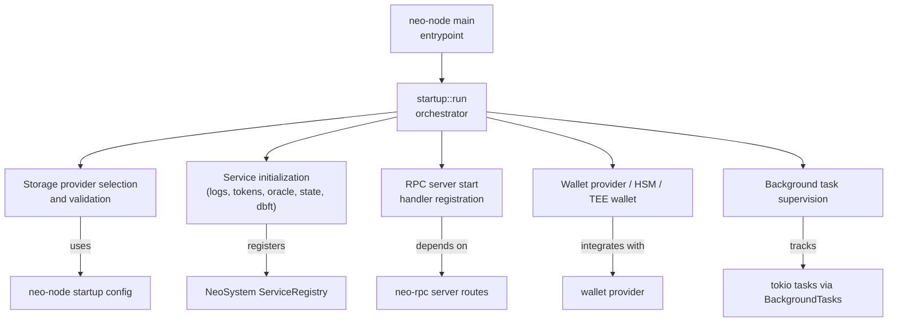
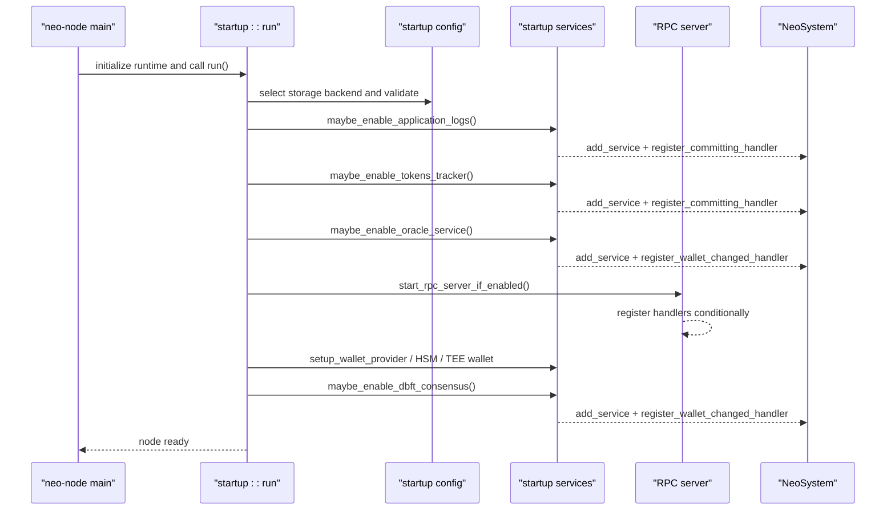
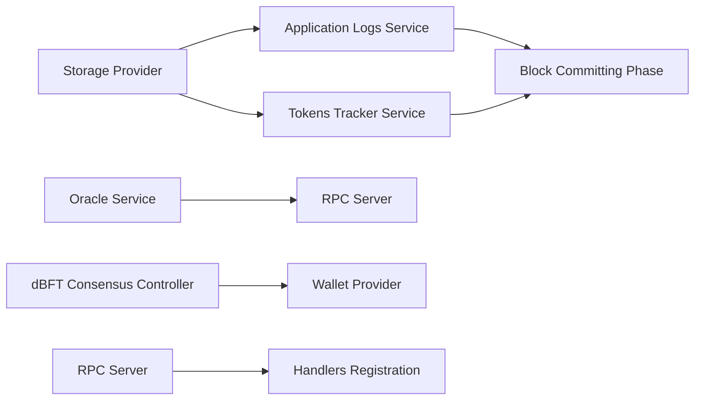

# Migration Steps

<cite>
**Referenced Files in This Document**
- [PLUGIN_SYSTEM.md](file://docs/PLUGIN_SYSTEM.md)
- [main.rs](file://neo-node/src/main.rs)
- [services.rs](file://neo-node/src/startup/services.rs)
- [config.rs](file://neo-node/src/startup/config.rs)
- [tasks.rs](file://neo-node/src/startup/tasks.rs)
- [Cargo.toml](file://neo-node/Cargo.toml)
- [node_config.rs](file://neo-node/src/config/node_config.rs)
- [error.rs](file://neo-config/src/error.rs)
- [handlers.rs](file://neo-rpc/src/server/routes/handlers.rs)
- [registry.rs](file://neo-core/src/neo_system/registry.rs)
- [persistence.rs](file://neo-core/src/neo_system/persistence.rs)
- [handlers.rs](file://neo-core/src/events/handlers.rs)
</cite>

## Table of Contents
1. [Introduction](#introduction)
2. [Project Structure](#project-structure)
3. [Core Components](#core-components)
4. [Architecture Overview](#architecture-overview)
5. [Detailed Component Analysis](#detailed-component-analysis)
6. [Dependency Analysis](#dependency-analysis)
7. [Performance Considerations](#performance-considerations)
8. [Troubleshooting Guide](#troubleshooting-guide)
9. [Conclusion](#conclusion)
10. [Appendices](#appendices)

## Introduction
This document provides a step-by-step migration guide from C# plugins to Rust services for the Neo node. It explains how to identify plugin dependencies and interfaces, set up the Rust project structure, implement service traits, register services in the node lifecycle, and configure initialization order. It also covers concrete migration scenarios (RPC handlers, background tasks, event listeners, storage extensions), configuration changes, dependency management differences between NuGet packages and Rust crates, and compile-time integration benefits that simplify and harden the migration process.

## Project Structure
The Rust implementation uses compile-time feature flags to include or exclude services at build time, replacing dynamic plugin loading with explicit module inclusion and registration during startup. The node entry point initializes the runtime and delegates to a startup pipeline that configures logging, storage, services, RPC, consensus, wallets, and background tasks.

**Diagram sources**
- [main.rs:65-79](file://neo-node/src/main.rs#L65-L79)
- [services.rs:246-320](file://neo-node/src/startup/services.rs#L246-L320)
- [config.rs:23-55](file://neo-node/src/startup/config.rs#L23-L55)
- [tasks.rs:13-52](file://neo-node/src/startup/tasks.rs#L13-L52)

**Section sources**
- [main.rs:65-79](file://neo-node/src/main.rs#L65-L79)
- [Cargo.toml:20-47](file://neo-node/Cargo.toml#L20-L47)

## Core Components
- ServiceRegistry: Central registry for typed and named services used by the node and subsystems.
- Startup services: Functions that conditionally enable features based on configuration and CLI flags.
- RPC server: Registers built-in and optional handlers depending on enabled services.
- Event handlers: Traits for block committing/committed events used by services like application logs, tokens tracker, and oracle service.
- Background tasks: Supervision utility for long-running tasks with cooperative shutdown.

Key responsibilities:
- Identify which services are enabled via configuration.
- Construct services with required dependencies.
- Register services into NeoSystem and attach event handlers.
- Start RPC handlers only when dependent services are present.
- Manage background tasks and graceful shutdown.

**Section sources**
- [registry.rs:45-92](file://neo-core/src/neo_system/registry.rs#L45-L92)
- [services.rs:450-641](file://neo-node/src/startup/services.rs#L450-L641)
- [handlers.rs:322-342](file://neo-rpc/src/server/routes/handlers.rs#L322-L342)
- [handlers.rs:9-38](file://neo-core/src/events/handlers.rs#L9-L38)
- [tasks.rs:13-52](file://neo-node/src/startup/tasks.rs#L13-L52)

## Architecture Overview
The migration replaces per-plugin assemblies and JSON configs with a single binary where features are selected at compile time and toggled at runtime via TOML configuration. Services are registered explicitly in startup, and RPC endpoints are conditionally exposed based on enabled services.

**Diagram sources**
- [main.rs:65-79](file://neo-node/src/main.rs#L65-L79)
- [services.rs:246-320](file://neo-node/src/startup/services.rs#L246-L320)
- [services.rs:450-641](file://neo-node/src/startup/services.rs#L450-L641)
- [services.rs:391-448](file://neo-node/src/startup/services.rs#L391-L448)

## Detailed Component Analysis

### Step 1: Identify Plugin Dependencies and Interfaces
- Map each C# plugin to its Rust counterpart using the module mapping and feature flags.
- Determine required services and interfaces:
  - NeoSystem access for core services and persistence.
  - WalletChangedHandler for wallet-aware services.
  - CommittingHandler/CommittedHandler for block lifecycle hooks.
  - RPC handler registration for exposing methods.

Practical guidance:
- For RPC plugins, ensure the corresponding service is enabled so handlers can be registered.
- For background tasks, use tokio tasks supervised by BackgroundTasks for clean shutdown.
- For storage extensions, integrate via StoreProvider abstraction and path resolution.

**Section sources**
- [PLUGIN_SYSTEM.md:53-66](file://docs/PLUGIN_SYSTEM.md#L53-L66)
- [handlers.rs:9-38](file://neo-core/src/events/handlers.rs#L9-L38)
- [services.rs:246-320](file://neo-node/src/startup/services.rs#L246-L320)

### Step 2: Set Up Rust Project Structure
- Add feature flags in neo-node Cargo.toml to gate optional functionality.
- Create modules under neo-node/src gated by #[cfg(feature = "...")].
- Define configuration sections in NodeConfig and derive defaults.
- Wire initialization in startup services and expose CLI flags if needed.

Example references:
- Feature flags and dependencies are declared in neo-node Cargo.toml.
- Configuration parsing and protocol settings derivation are handled in node_config.rs.
- Validation rules and checks are implemented in startup config.

**Section sources**
- [Cargo.toml:20-47](file://neo-node/Cargo.toml#L20-L47)
- [node_config.rs:35-53](file://neo-node/src/config/node_config.rs#L35-L53)
- [config.rs:171-292](file://neo-node/src/startup/config.rs#L171-L292)

### Step 3: Implement Service Traits
- Implement CommittingHandler and CommittedHandler for block lifecycle hooks.
- Implement WalletChangedHandler for wallet change notifications.
- Use ServiceRegistry to register services by type and optionally by name.

References:
- Trait definitions and invocation points are in neo-core events and persistence modules.
- Service registration uses NeoSystem’s add_service method.

**Section sources**
- [handlers.rs:9-38](file://neo-core/src/events/handlers.rs#L9-L38)
- [persistence.rs:648-679](file://neo-core/src/neo_system/persistence.rs#L648-L679)
- [registry.rs:45-92](file://neo-core/src/neo_system/registry.rs#L45-L92)

### Step 4: Register Services in the Node Lifecycle
- Call conditional “maybe_enable_*” functions in startup to construct and register services.
- Ensure correct ordering: storage first, then services, then RPC, then wallets/consensus.
- Attach event handlers during service construction to participate in block processing.

References:
- Application logs, tokens tracker, oracle service, and dBFT consensus are initialized in startup services.
- RPC handler registration depends on presence of specific services.

**Section sources**
- [services.rs:450-641](file://neo-node/src/startup/services.rs#L450-L641)
- [services.rs:391-448](file://neo-node/src/startup/services.rs#L391-L448)
- [services.rs:246-320](file://neo-node/src/startup/services.rs#L246-L320)

### Step 5: Configure Service Initialization Order
- Storage provider selection and validation occur before service initialization.
- Services depend on storage and protocol settings; validate network magic and paths.
- RPC server starts after services are available to register handlers conditionally.
- Wallet providers and consensus controllers are attached after core services.

References:
- Storage selection and validation in startup config.
- Service initialization sequence in startup services.
- RPC server startup and handler registration.

**Section sources**
- [config.rs:23-55](file://neo-node/src/startup/config.rs#L23-L55)
- [config.rs:171-292](file://neo-node/src/startup/config.rs#L171-L292)
- [services.rs:246-320](file://neo-node/src/startup/services.rs#L246-L320)

### Step 6: Configure Service Initialization Order (Explicitly)
- Ensure storage backend is chosen and validated before any service opens stores.
- Initialize application logs and tokens tracker early because they hook into block commit phases.
- Enable oracle service only if RPC is enabled; it requires RPC for operation.
- Attach dBFT consensus controller after wallet provider is available if auto_start is configured.

References:
- Oracle service requires RPC; see startup services logic.
- dBFT consensus controller registration and wallet dependency.

**Section sources**
- [services.rs:583-641](file://neo-node/src/startup/services.rs#L583-L641)
- [services.rs:391-448](file://neo-node/src/startup/services.rs#L391-L448)

### Concrete Migration Scenarios

#### Migrating RPC Handlers
- Replace C# plugin-based RPC methods with Rust handler registration in the RPC server.
- Conditionally register handlers based on enabled services.
- Use panic catch and exception policy to handle errors gracefully.

References:
- RPC server handler registration and invocation flow.

**Section sources**
- [services.rs:246-320](file://neo-node/src/startup/services.rs#L246-L320)
- [handlers.rs:322-342](file://neo-rpc/src/server/routes/handlers.rs#L322-L342)

#### Migrating Background Tasks
- Port Akka actors to Tokio tasks managed by BackgroundTasks.
- Use cancellation token for cooperative shutdown and TaskTracker for lifecycle monitoring.

References:
- BackgroundTasks API for spawning and shutting down tasks.

**Section sources**
- [tasks.rs:13-52](file://neo-node/src/startup/tasks.rs#L13-L52)

#### Migrating Event Listeners
- Implement CommittingHandler and/or CommittedHandler to receive block events.
- Register handlers with NeoSystem to participate in persistence phases.
- Respect fast sync behavior via run_during_fast_sync if necessary.

References:
- Event handler traits and invocation during persistence.

**Section sources**
- [handlers.rs:9-38](file://neo-core/src/events/handlers.rs#L9-L38)
- [persistence.rs:648-679](file://neo-core/src/neo_system/persistence.rs#L648-L679)

#### Migrating Storage Extensions
- Use StoreProvider abstraction to open and manage storage instances.
- Validate storage paths and network markers before opening stores.
- Integrate with application logs and tokens tracker store paths.

References:
- StoreProvider trait and selection logic.
- Storage validation and marker checks.

**Section sources**
- [store_provider.rs:1-13](file://neo-storage/src/persistence/store_provider.rs#L1-L13)
- [config.rs:85-154](file://neo-node/src/startup/config.rs#L85-L154)

### Configuration File Changes
- Consolidate per-plugin JSON files into unified TOML configuration under neo-node.toml.
- Add sections for each service (e.g., rpc, application_logs, tokens_tracker, oracle, state_service).
- Validate configuration fields and enforce security constraints (e.g., RPC auth on public bind).

References:
- Unified configuration approach and examples.
- Configuration error types and validation rules.

**Section sources**
- [PLUGIN_SYSTEM.md:67-105](file://docs/PLUGIN_SYSTEM.md#L67-L105)
- [error.rs:1-51](file://neo-config/src/error.rs#L1-L51)
- [config.rs:171-292](file://neo-node/src/startup/config.rs#L171-L292)

### Dependency Management Differences
- C# plugins rely on NuGet packages and dynamic assembly loading; Rust uses Cargo features and static linking.
- Optional capabilities are enabled via feature flags in Cargo.toml rather than runtime discovery.
- Build-time inclusion reduces deployment complexity and improves security posture.

References:
- Feature flags and optional dependencies in neo-node Cargo.toml.
- Compile-time integration overview in plugin system documentation.

**Section sources**
- [Cargo.toml:20-47](file://neo-node/Cargo.toml#L20-L47)
- [PLUGIN_SYSTEM.md:30-51](file://docs/PLUGIN_SYSTEM.md#L30-L51)

### Compile-Time Integration Benefits
- Type safety: compile-time checks prevent misconfiguration and missing dependencies.
- Performance: no reflection or dynamic loading overhead; better optimization opportunities.
- Deployment: single binary simplifies distribution and containerization.
- Security: all code audited at build time; smaller attack surface.

References:
- Benefits section in plugin system documentation.

**Section sources**
- [PLUGIN_SYSTEM.md:285-305](file://docs/PLUGIN_SYSTEM.md#L285-L305)

## Dependency Analysis
The node’s startup pipeline composes several components with clear dependencies:
- Storage provider must be selected and validated before services open stores.
- Services register event handlers that participate in block persistence.
- RPC server registers handlers conditionally based on enabled services.
- Wallet provider and consensus controller depend on prior service availability.

**Diagram sources**
- [services.rs:450-641](file://neo-node/src/startup/services.rs#L450-L641)
- [services.rs:246-320](file://neo-node/src/startup/services.rs#L246-L320)
- [services.rs:391-448](file://neo-node/src/startup/services.rs#L391-L448)

**Section sources**
- [services.rs:246-641](file://neo-node/src/startup/services.rs#L246-L641)

## Performance Considerations
- Prefer compile-time feature gating to minimize runtime checks and reduce binary size.
- Use tokio tasks with BackgroundTasks for efficient background work and controlled shutdown.
- Avoid unnecessary allocations in hot paths (block committing handlers).
- Tune RocksDB batch profiles via environment variables when using persistent storage.

[No sources needed since this section provides general guidance]

## Troubleshooting Guide
Common issues and resolutions:
- Service not starting: verify feature flag, configuration enablement, and dependency availability.
- Config validation errors: check TOML syntax, schema updates, required fields, and type correctness.
- Build errors: ensure modules are compiled with proper features and imports are correct.
- RPC handler panics: inspect exception policy and logs; consider adjusting UnhandledExceptionPolicy.

References:
- Configuration error types and validation failures.
- RPC handler invocation and panic handling.

**Section sources**
- [PLUGIN_SYSTEM.md:404-428](file://docs/PLUGIN_SYSTEM.md#L404-L428)
- [error.rs:1-51](file://neo-config/src/error.rs#L1-L51)
- [handlers.rs:322-342](file://neo-rpc/src/server/routes/handlers.rs#L322-L342)

## Conclusion
Migrating from C# plugins to Rust services involves shifting from dynamic loading to compile-time integration, consolidating configuration into a unified TOML format, and explicitly registering services during startup. By following the steps outlined—identifying dependencies, setting up project structure, implementing traits, registering services, and configuring initialization order—you can achieve a safer, faster, and more maintainable node. The Rust architecture’s type safety, performance, and simplified deployment model provide significant advantages over the previous plugin system.

[No sources needed since this section summarizes without analyzing specific files]

## Appendices

### Appendix A: Migration Checklist
- Map C# plugin to Rust service and feature flag.
- Add configuration section to TOML and validate fields.
- Implement CommittingHandler/CommittedHandler/WalletChangedHandler as needed.
- Register service via NeoSystem and attach event handlers.
- Start RPC server and register handlers conditionally.
- Use BackgroundTasks for long-running operations.
- Test with feature flags and configuration overrides.

[No sources needed since this section provides general guidance]