# Testing Strategies

<cite>
**Referenced Files in This Document**
- [Cargo.toml](file://Cargo.toml)
- [neo-core/tests/csharp_compatibility_tests.rs](file://neo-core/tests/csharp_compatibility_tests.rs)
- [neo-core/tests/integration_tests.rs](file://neo-core/tests/integration_tests.rs)
- [tests/tests/end_to_end_tests.rs](file://tests/tests/end_to_end_tests.rs)
- [tests/tests/consensus_integration_tests.rs](file://tests/tests/consensus_integration_tests.rs)
- [benches-package/benches/block_processing.rs](file://benches-package/benches/block_processing.rs)
- [benches-package/benches/vm_execution.rs](file://benches-package/benches/vm_execution.rs)
- [neo-crypto/tests/property_tests.rs](file://neo-crypto/tests/property_tests.rs)
- [neo-primitives/tests/property_tests.rs](file://neo-primitives/tests/property_tests.rs)
- [fuzz/Cargo.toml](file://fuzz/Cargo.toml)
- [scripts/tests/test_compare_state_roots.py](file://scripts/tests/test_compare_state_roots.py)
- [docs/protocol-consistency/STATUS.md](file://docs/protocol-consistency/STATUS.md)
</cite>

## Table of Contents
1. Introduction
2. Project Structure
3. Core Components
4. Architecture Overview
5. Detailed Component Analysis
6. Dependency Analysis
7. Performance Considerations
8. Troubleshooting Guide
9. Conclusion

## Introduction
This document defines comprehensive testing strategies to validate the migrated Rust services against the original C# implementations. It covers unit testing with Rust’s test framework, mocking external dependencies, simulating blockchain environments, integration and RPC endpoint testing, consensus participation validation, property-based testing for cryptographic and consensus logic, fuzzing, and performance benchmarking to ensure parity or improvement over C# baselines.

## Project Structure
The repository is a Cargo workspace with layered crates (primitives, crypto, IO, VM, core, P2P, RPC, consensus, node). Tests are distributed across crates:
- Unit tests inside each crate (e.g., neo-crypto, neo-primitives)
- Compatibility and integration tests under neo-core/tests
- End-to-end and consensus integration tests under tests/tests
- Benchmarks under benches-package
- Fuzz targets under fuzz
- Python harnesses for protocol consistency comparisons under scripts

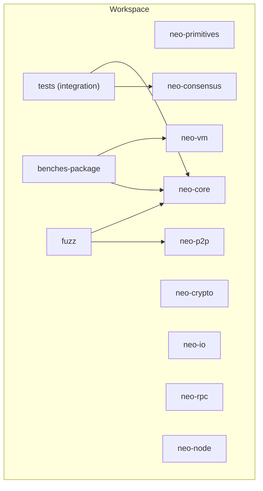

**Diagram sources**
- [Cargo.toml:1-68](file://Cargo.toml#L1-L68)

**Section sources**
- [Cargo.toml:1-68](file://Cargo.toml#L1-L68)

## Core Components
- Unit testing: Deterministic assertions on primitives, serialization, and core types; converted from C# tests for functional parity.
- Property-based testing: Randomized invariants for hashing, encoding roundtrips, and crypto sign/verify flows.
- Integration testing: State root determinism, concurrent state commits, event handling, builders, hardfork manager.
- Consensus testing: Service lifecycle, message processing, view change, recovery messages, multi-validator simulation, and regression checks.
- RPC testing: JSON-RPC handler registration, rate limiting, WebSocket events, and adapter tests.
- Performance testing: Criterion benchmarks for header/transaction serialization, hashing, VM execution, and stack operations.
- Fuzzing: libFuzzer targets for transaction/script/message parsing robustness.
- Protocol consistency: Python-driven comparison of local vs reference nodes and golden state roots.

**Section sources**
- [neo-core/tests/csharp_compatibility_tests.rs:1-324](file://neo-core/tests/csharp_compatibility_tests.rs#L1-L324)
- [neo-core/tests/integration_tests.rs:1-516](file://neo-core/tests/integration_tests.rs#L1-L516)
- [tests/tests/end_to_end_tests.rs:1-177](file://tests/tests/end_to_end_tests.rs#L1-L177)
- [tests/tests/consensus_integration_tests.rs:1-501](file://tests/tests/consensus_integration_tests.rs#L1-L501)
- [benches-package/benches/block_processing.rs:1-117](file://benches-package/benches/block_processing.rs#L1-L117)
- [benches-package/benches/vm_execution.rs:1-120](file://benches-package/benches/vm_execution.rs#L1-L120)
- [neo-crypto/tests/property_tests.rs:1-179](file://neo-crypto/tests/property_tests.rs#L1-L179)
- [neo-primitives/tests/property_tests.rs:1-246](file://neo-primitives/tests/property_tests.rs#L1-L246)
- [fuzz/Cargo.toml:1-47](file://fuzz/Cargo.toml#L1-L47)
- [scripts/tests/test_compare_state_roots.py:1-90](file://scripts/tests/test_compare_state_roots.py#L1-L90)
- [docs/protocol-consistency/STATUS.md:1-66](file://docs/protocol-consistency/STATUS.md#L1-L66)

## Architecture Overview
Testing spans multiple layers and uses both in-process mocks and out-of-process references:

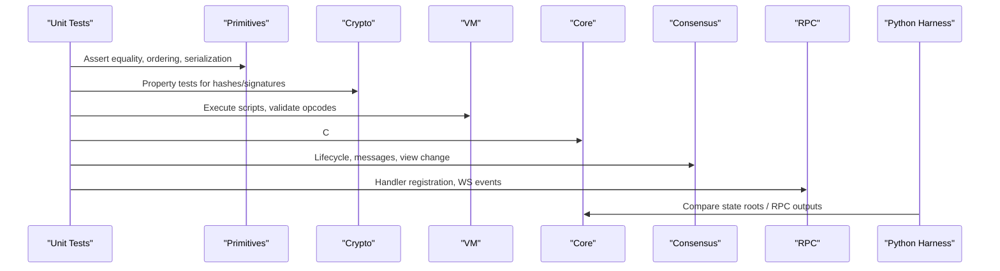

[No sources needed since this diagram shows conceptual workflow, not actual code structure]

## Detailed Component Analysis

### Unit Testing Against C# Parity
- Convert C# unit tests into Rust to assert identical behavior for UInt160/UInt256 parsing, formatting, comparison, hash codes, Transaction size/hash, Signer/Witness construction and sizes.
- Use deterministic inputs and explicit expectations to guarantee functional parity.

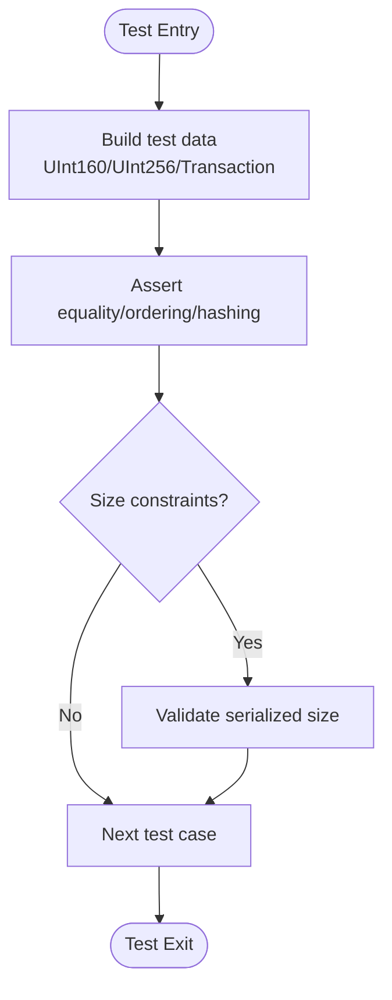

**Section sources**
- [neo-core/tests/csharp_compatibility_tests.rs:10-139](file://neo-core/tests/csharp_compatibility_tests.rs#L10-L139)
- [neo-core/tests/csharp_compatibility_tests.rs:141-203](file://neo-core/tests/csharp_compatibility_tests.rs#L141-L203)
- [neo-core/tests/csharp_compatibility_tests.rs:205-324](file://neo-core/tests/csharp_compatibility_tests.rs#L205-L324)

### Mocking External Dependencies
- Use in-memory world state and mock providers to isolate components during tests.
- Implement traits like BlockchainProvider/Snapshot with simple HashMap-backed stores for deterministic outcomes.

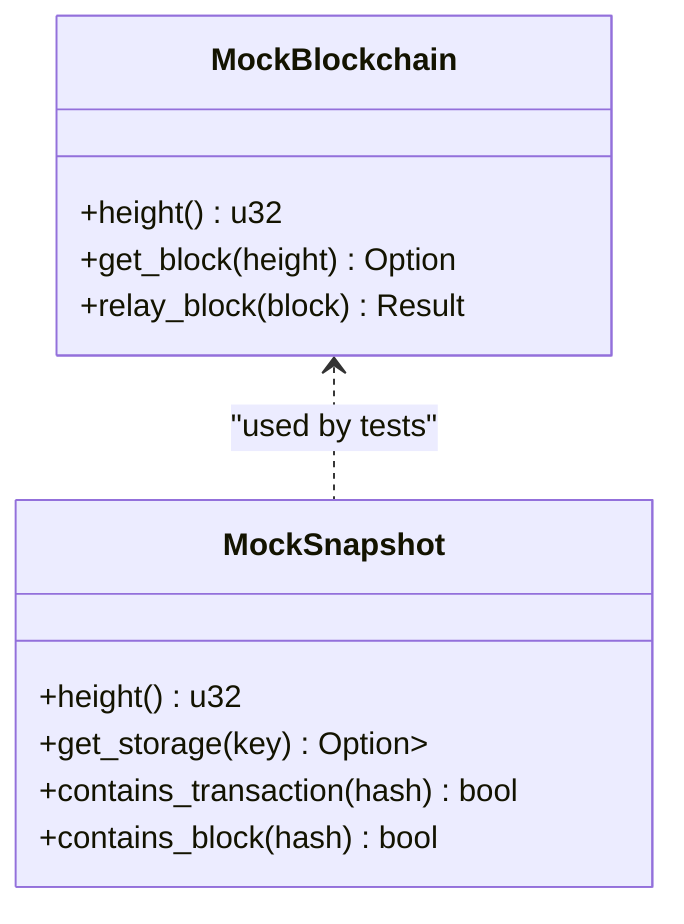

**Section sources**
- [neo-primitives/src/blockchain/tests.rs:124-177](file://neo-primitives/src/blockchain/tests.rs#L124-L177)
- [neo-primitives/src/verification.rs:321-370](file://neo-primitives/src/verification.rs#L321-L370)

### Simulating Blockchain Environment
- Create deterministic state changes and verify state root determinism and order independence.
- Exercise concurrent commits using async runtime primitives to validate thread safety.

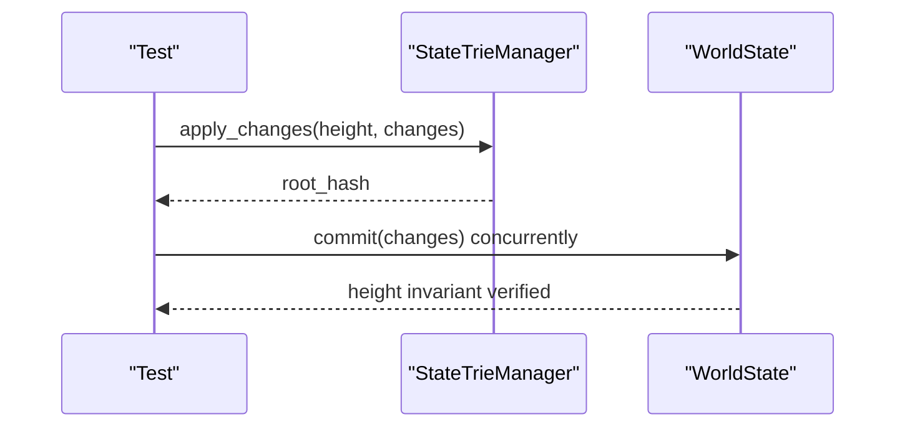

**Section sources**
- [tests/tests/end_to_end_tests.rs:20-89](file://tests/tests/end_to_end_tests.rs#L20-L89)
- [tests/tests/end_to_end_tests.rs:124-149](file://tests/tests/end_to_end_tests.rs#L124-L149)

### Integration Testing for Service Interactions
- Validate event system, hardfork manager, builders, and basic core behaviors.
- Ensure that service registries and named services work correctly when present.

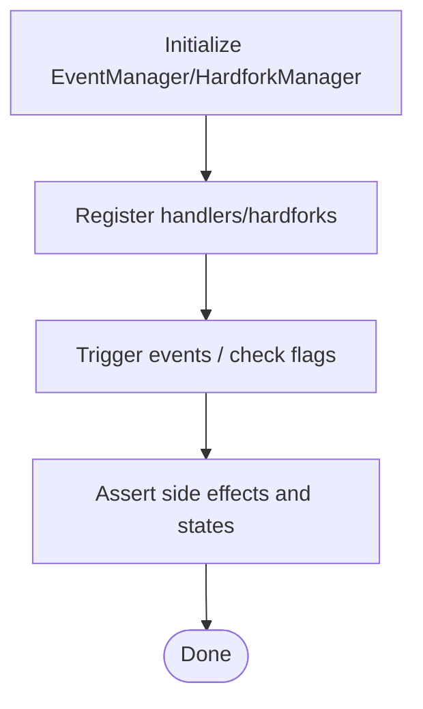

**Section sources**
- [neo-core/tests/integration_tests.rs:235-281](file://neo-core/tests/integration_tests.rs#L235-L281)
- [neo-core/tests/integration_tests.rs:391-404](file://neo-core/tests/integration_tests.rs#L391-L404)

### RPC Endpoint Testing
- Test JSON-RPC handler registration, rate limiting, and WebSocket events.
- Leverage in-process server/client fixtures where possible; skip if localhost binding is disallowed.

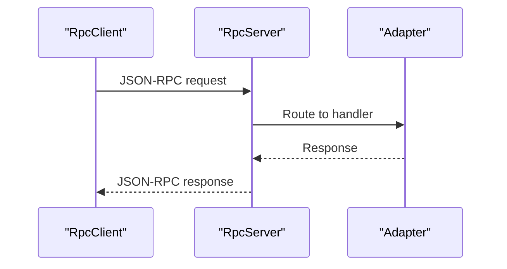

**Section sources**
- [neo-rpc/tests/jsonrpsee_adapter.rs](file://neo-rpc/tests/jsonrpsee_adapter.rs)
- [neo-rpc/tests/rate_limiter_governor.rs](file://neo-rpc/tests/rate_limiter_governor.rs)
- [neo-rpc/tests/ws_events.rs](file://neo-rpc/tests/ws_events.rs)
- [neo-rpc/tests/rpc_handler_registration.rs](file://neo-rpc/tests/rpc_handler_registration.rs)
- [neo-rpc/tests/validate_address.rs](file://neo-rpc/tests/validate_address.rs)
- [neo-rpc/tests/rpc_blockchain_getrawtransaction_vmstate.rs](file://neo-rpc/tests/rpc_blockchain_getrawtransaction_vmstate.rs)

### Consensus Participation Validation
- Validate dBFT lifecycle: start, primary selection, message handling, view change, recovery messages, payload layout, and edge cases.
- Enforce critical security properties (R01/R02) around vote counting and commit gating.

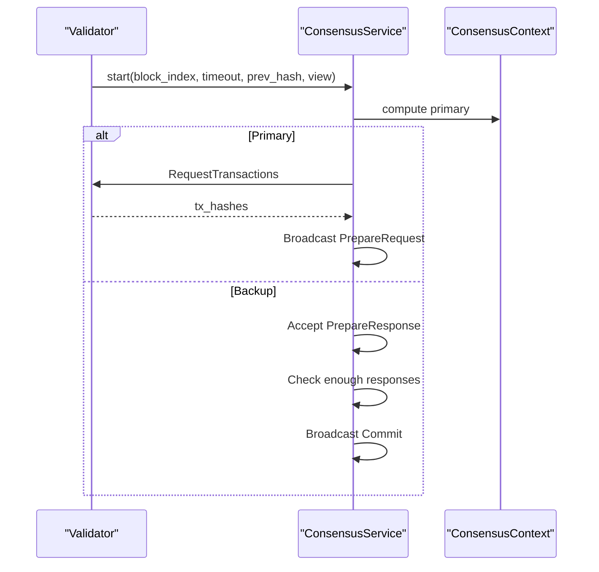

**Section sources**
- [tests/tests/consensus_integration_tests.rs:20-51](file://tests/tests/consensus_integration_tests.rs#L20-L51)
- [tests/tests/consensus_integration_tests.rs:57-110](file://tests/tests/consensus_integration_tests.rs#L57-L110)
- [tests/tests/consensus_integration_tests.rs:116-178](file://tests/tests/consensus_integration_tests.rs#L116-L178)
- [tests/tests/consensus_integration_tests.rs:184-242](file://tests/tests/consensus_integration_tests.rs#L184-L242)
- [tests/tests/consensus_integration_tests.rs:248-301](file://tests/tests/consensus_integration_tests.rs#L248-L301)
- [tests/tests/consensus_integration_tests.rs:307-353](file://tests/tests/consensus_integration_tests.rs#L307-L353)
- [tests/tests/consensus_integration_tests.rs:359-370](file://tests/tests/consensus_integration_tests.rs#L359-L370)
- [tests/tests/consensus_integration_tests.rs:376-432](file://tests/tests/consensus_integration_tests.rs#L376-L432)
- [tests/tests/consensus_integration_tests.rs:438-501](file://tests/tests/consensus_integration_tests.rs#L438-L501)

### Property-Based Testing for Cryptographic and Consensus Logic
- Verify hash consistency across algorithms, encoding roundtrips, and crypto sign/verify correctness for secp256r1 and Ed25519.
- Validate primitive invariants: serialization roundtrips, determinism, ordering transitivity/antisymmetry, zero detection, and equality axioms.

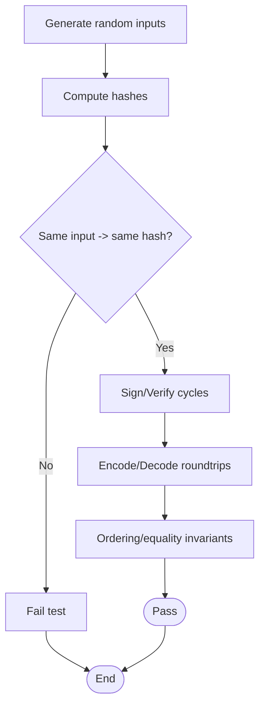

**Section sources**
- [neo-crypto/tests/property_tests.rs:14-81](file://neo-crypto/tests/property_tests.rs#L14-L81)
- [neo-crypto/tests/property_tests.rs:87-179](file://neo-crypto/tests/property_tests.rs#L87-L179)
- [neo-primitives/tests/property_tests.rs:9-68](file://neo-primitives/tests/property_tests.rs#L9-L68)
- [neo-primitives/tests/property_tests.rs:70-106](file://neo-primitives/tests/property_tests.rs#L70-L106)
- [neo-primitives/tests/property_tests.rs:108-170](file://neo-primitives/tests/property_tests.rs#L108-L170)
- [neo-primitives/tests/property_tests.rs:172-246](file://neo-primitives/tests/property_tests.rs#L172-L246)

### Fuzzing Strategy
- Use libFuzzer targets to stress parsers for transactions, scripts, and P2P messages.
- Configure release profiles with debug symbols and thin LTO for efficient fuzz runs.

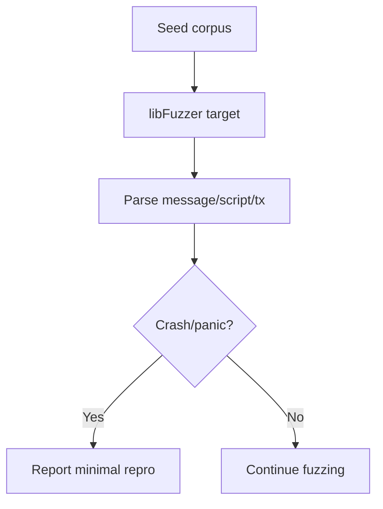

**Section sources**
- [fuzz/Cargo.toml:1-47](file://fuzz/Cargo.toml#L1-L47)

### Protocol Consistency and Golden Comparisons
- Run Python harnesses to compare local node outputs with public/reference nodes and golden state roots.
- Track live sync verification status and known divergences to guide fixes.

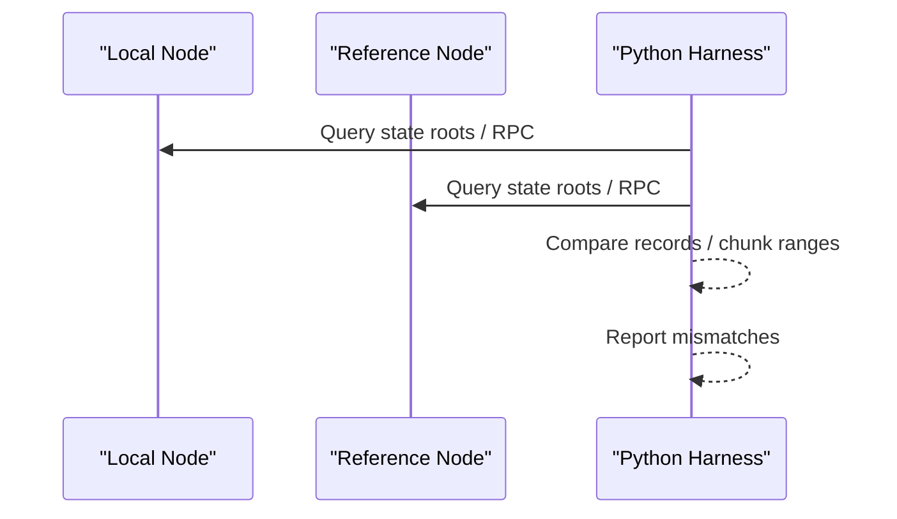

**Section sources**
- [scripts/tests/test_compare_state_roots.py:19-85](file://scripts/tests/test_compare_state_roots.py#L19-L85)
- [docs/protocol-consistency/STATUS.md:5-28](file://docs/protocol-consistency/STATUS.md#L5-L28)
- [docs/protocol-consistency/STATUS.md:41-61](file://docs/protocol-consistency/STATUS.md#L41-L61)

## Dependency Analysis
Testing relies on shared workspace dependencies for async runtime, serialization, cryptography, and profiling. The workspace centralizes versions and features to keep tests consistent across crates.

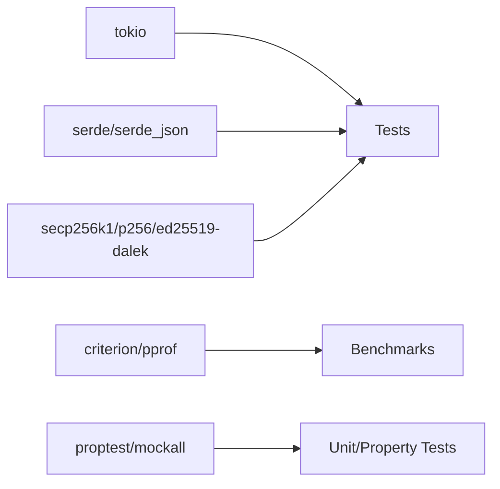

**Diagram sources**
- [Cargo.toml:141-233](file://Cargo.toml#L141-L233)

**Section sources**
- [Cargo.toml:141-233](file://Cargo.toml#L141-L233)

## Performance Considerations
- Use Criterion benchmarks for hot paths: header/transaction serialization, hashing, VM opcode dispatch, stack operations, and script parsing/building.
- Avoid reporting full block-processing throughput unless using a replay harness with real state; focus on isolated micro-benchmarks.
- Integrate flamegraph profiling via scripts to identify bottlenecks.

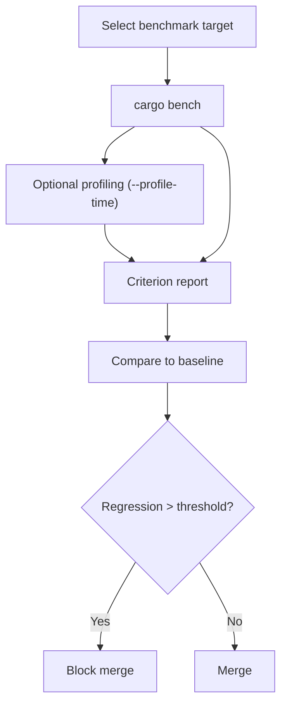

**Section sources**
- [benches-package/benches/block_processing.rs:1-117](file://benches-package/benches/block_processing.rs#L1-L117)
- [benches-package/benches/vm_execution.rs:1-120](file://benches-package/benches/vm_execution.rs#L1-L120)
- [scripts/profiling/benchmark.sh:1-12](file://scripts/profiling/benchmark.sh#L1-L12)
- [Cargo.toml:251-286](file://Cargo.toml#L251-L286)

## Troubleshooting Guide
- Skip network-dependent tests when localhost binding is not permitted; ensure environment allows loopback for RPC tests.
- For protocol consistency failures, use the documented steps to compare goldens and run contiguous fail-closed comparisons; stop at first mismatch and open a reproducer.
- For consensus anomalies, inspect view numbers, validator indices, and message payloads; verify R01/R02 invariants hold.

**Section sources**
- [neo-rpc/src/client/rpc_client/tests.rs:56-106](file://neo-rpc/src/client/rpc_client/tests.rs#L56-L106)
- [docs/protocol-consistency/STATUS.md:29-61](file://docs/protocol-consistency/STATUS.md#L29-L61)
- [tests/tests/consensus_integration_tests.rs:438-501](file://tests/tests/consensus_integration_tests.rs#L438-L501)

## Conclusion
This testing strategy combines unit, property-based, integration, consensus, RPC, fuzzing, and performance testing to ensure the Rust implementation matches or exceeds the C# behavior and performance. By leveraging deterministic tests, randomized invariants, and continuous protocol consistency checks, the project maintains high confidence in correctness and stability across all layers.