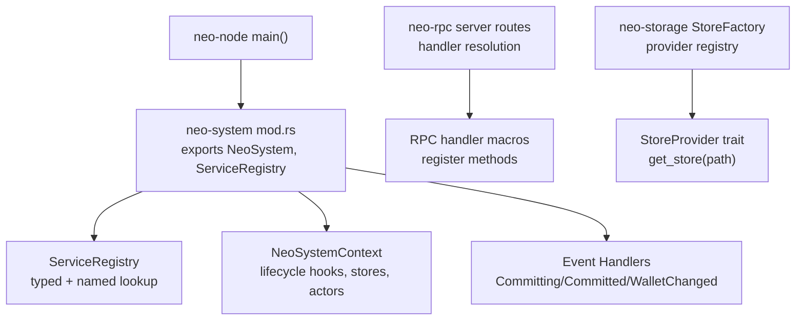
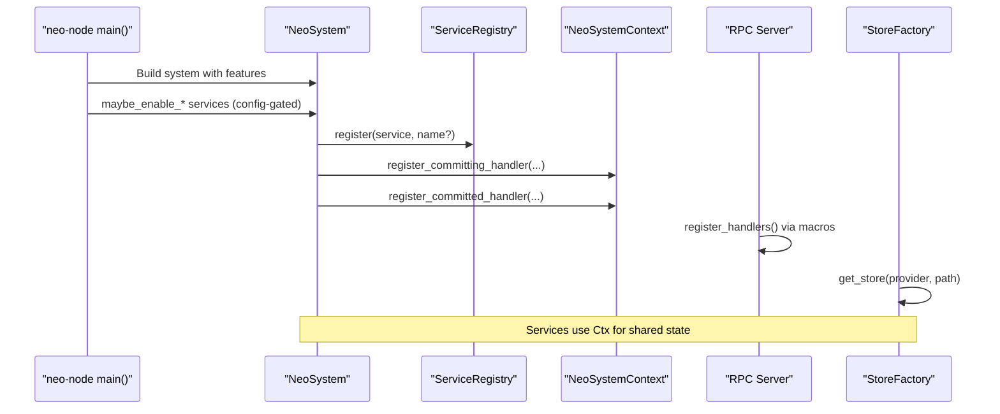
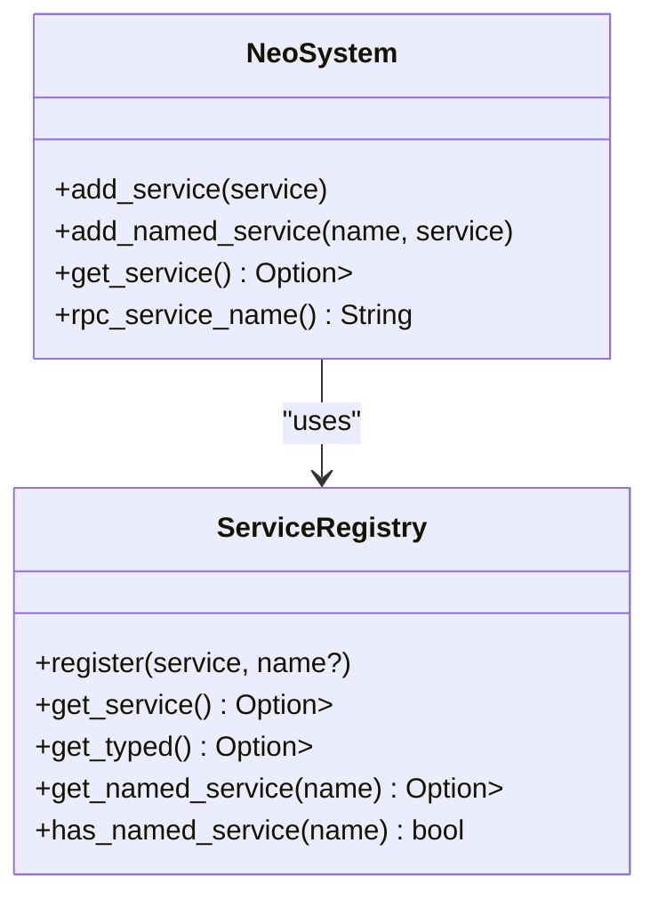
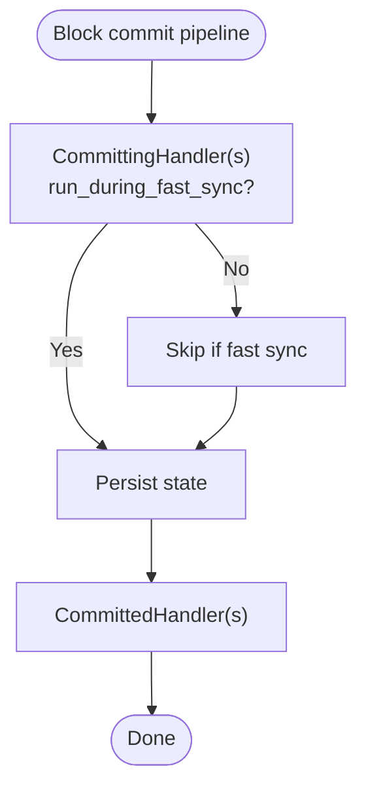
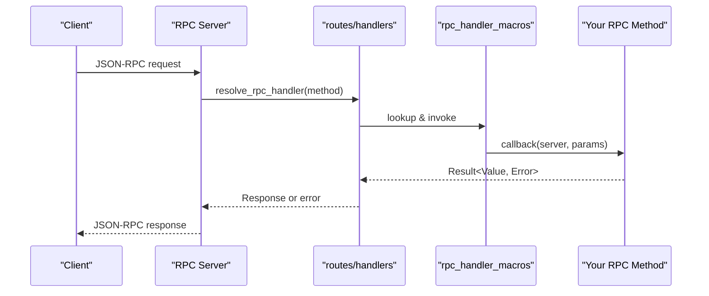
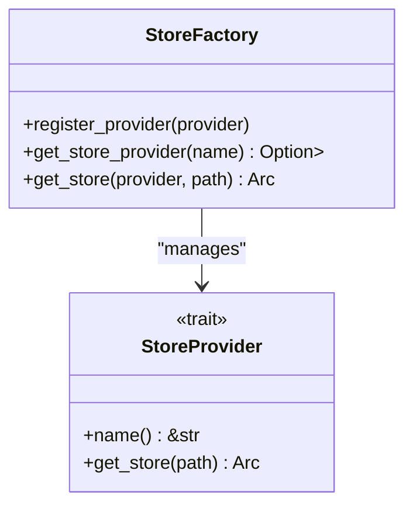
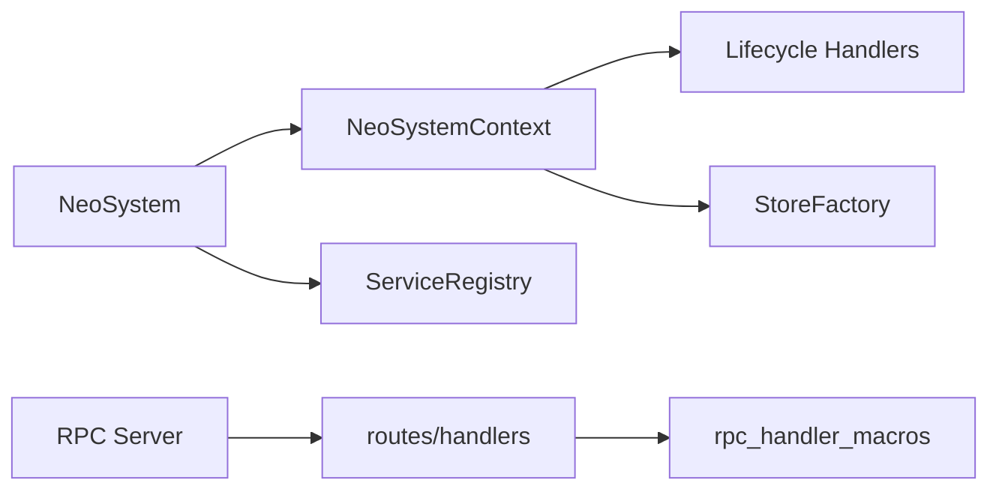

# Plugin Development

<cite>
**Referenced Files in This Document**
- [PLUGIN_SYSTEM.md](file://docs/PLUGIN_SYSTEM.md)
- [mod.rs](file://neo-core/src/neo_system/mod.rs)
- [registry.rs](file://neo-core/src/neo_system/registry.rs)
- [services.rs](file://neo-core/src/neo_system/services.rs)
- [context.rs](file://neo-core/src/neo_system/context.rs)
- [handlers.rs](file://neo-core/src/events/handlers.rs)
- [store_factory.rs](file://neo-storage/src/persistence/store_factory.rs)
- [store_provider.rs](file://neo-storage/src/persistence/store_provider.rs)
- [handlers.rs](file://neo-rpc/src/server/routes/handlers.rs)
- [rpc_handler_macros.rs](file://neo-rpc/src/server/rpc_handler_macros.rs)
</cite>

## Table of Contents
1. Introduction
2. Project Structure
3. Core Components
4. Architecture Overview
5. Detailed Component Analysis
6. Dependency Analysis
7. Performance Considerations
8. Troubleshooting Guide
9. Conclusion
10. Appendices

## Introduction
This document explains the Neo-RS plugin development system and how it replaces dynamic loading with a compile-time integration approach using Cargo features, modular architecture, and explicit service registration. It covers creating custom services, implementing service interfaces, integrating with NeoSystem, managing service lifecycles, dependency injection via ServiceRegistry, configuration handling, and practical patterns for RPC handlers, background tasks, event handlers, and storage extensions. It also provides a migration path from C# plugins to Rust services and guidance for maintainable plugin architecture.

## Project Structure
Neo-RS organizes plugin-like capabilities as modules behind feature flags and registers them at startup. The core orchestration lives in neo-core’s neo_system module, which exposes:
- A typed ServiceRegistry for dependency injection
- Lifecycle hooks (committing/committed/wallet changed)
- Contextual access to blockchain, mempool, store, and network components
- Event broadcasting for plugin lifecycle events

**Diagram sources**
- [mod.rs:1-56](file://neo-core/src/neo_system/mod.rs#L1-L56)
- [registry.rs:1-200](file://neo-core/src/neo_system/registry.rs#L1-L200)
- [context.rs:1-761](file://neo-core/src/neo_system/context.rs#L1-L761)
- [handlers.rs:1-62](file://neo-core/src/events/handlers.rs#L1-L62)
- [store_factory.rs:1-55](file://neo-storage/src/persistence/store_factory.rs#L1-L55)
- [store_provider.rs:1-13](file://neo-storage/src/persistence/store_provider.rs#L1-L13)
- [handlers.rs:310-342](file://neo-rpc/src/server/routes/handlers.rs#L310-L342)
- [rpc_handler_macros.rs:1-14](file://neo-rpc/src/server/rpc_handler_macros.rs#L1-L14)

**Section sources**
- [mod.rs:1-56](file://neo-core/src/neo_system/mod.rs#L1-L56)
- [PLUGIN_SYSTEM.md:1-163](file://docs/PLUGIN_SYSTEM.md#L1-L163)

## Core Components
- ServiceRegistry: Thread-safe registry supporting both typed and named service discovery. Services are registered once and retrieved by type or name across the node.
- NeoSystemContext: Central runtime context exposing actor handles, store caches, ledger/mempool access, readiness checks, and lifecycle hook registration.
- Event Handler Traits: CommittingHandler and CommittedHandler for block lifecycle; WalletChangedHandler for wallet provider changes.
- Storage Provider Factory: Global registry of StoreProvider implementations enabling pluggable backends.
- RPC Handler Resolution: Server-side routing that resolves and invokes RPC handlers with panic-safe invocation and policy-driven behavior.

Key responsibilities:
- Registration: Services register themselves during startup based on config and features.
- Discovery: Consumers retrieve services via typed or named lookups.
- Lifecycle: Block committing/committed hooks allow pre/post persistence logic.
- Extensibility: New storage backends and RPC endpoints can be added without changing core logic.

**Section sources**
- [registry.rs:1-200](file://neo-core/src/neo_system/registry.rs#L1-L200)
- [context.rs:110-228](file://neo-core/src/neo_system/context.rs#L110-L228)
- [handlers.rs:1-62](file://neo-core/src/events/handlers.rs#L1-L62)
- [store_factory.rs:1-55](file://neo-storage/src/persistence/store_factory.rs#L1-L55)
- [store_provider.rs:1-13](file://neo-storage/src/persistence/store_provider.rs#L1-L13)
- [handlers.rs:310-342](file://neo-rpc/src/server/routes/handlers.rs#L310-L342)

## Architecture Overview
The compile-time integration model uses Cargo features to include optional modules and then wires them into the node at startup. Services are created, configured, and registered through NeoSystem and its context. Event hooks integrate with the block commit pipeline, while RPC handlers expose functionality over JSON-RPC.

**Diagram sources**
- [services.rs:15-118](file://neo-core/src/neo_system/services.rs#L15-L118)
- [context.rs:342-358](file://neo-core/src/neo_system/context.rs#L342-L358)
- [store_factory.rs:26-55](file://neo-storage/src/persistence/store_factory.rs#L26-L55)
- [rpc_handler_macros.rs:1-14](file://neo-rpc/src/server/rpc_handler_macros.rs#L1-L14)

## Detailed Component Analysis

### Service Registry and Dependency Injection
- Typed and named registration: Services can be stored under their concrete type and optionally under a string name for cross-feature discovery.
- Lookup strategies: get_service<T>() first checks typed registry, then falls back to scanning the service list; get_named_service<T>(name) retrieves by name and downcasts safely.
- Thread safety: All operations are protected by RwLock; lock ordering is documented to avoid deadlocks.

**Diagram sources**
- [registry.rs:58-144](file://neo-core/src/neo_system/registry.rs#L58-L144)
- [services.rs:15-118](file://neo-core/src/neo_system/services.rs#L15-L118)

**Section sources**
- [registry.rs:1-200](file://neo-core/src/neo_system/registry.rs#L1-L200)
- [services.rs:15-118](file://neo-core/src/neo_system/services.rs#L15-L118)

### NeoSystemContext and Lifecycle Hooks
- Lifecycle hooks: Register CommittingHandler and CommittedHandler to run before and after block persistence.
- Wallet change propagation: Attach a WalletProvider and receive updates; handlers are replayed with the current wallet upon registration.
- Readiness and fast sync: Exposes readiness checks and fast-sync mode to skip expensive event publishing during initial sync.
- Shared resources: Provides access to store caches, ledger, mempool, headers, and protocol settings.

**Diagram sources**
- [handlers.rs:11-44](file://neo-core/src/events/handlers.rs#L11-L44)
- [context.rs:342-358](file://neo-core/src/neo_system/context.rs#L342-L358)

**Section sources**
- [context.rs:342-441](file://neo-core/src/neo_system/context.rs#L342-L441)
- [handlers.rs:1-62](file://neo-core/src/events/handlers.rs#L1-L62)

### RPC Integration and Handler Macros
- Handler registration: Use provided macros to declare RPC methods and wrap them with protection levels.
- Resolution and invocation: The server resolves method names to handlers and invokes them with panic catching and exception policy handling.
- Testing pattern: Tests construct NeoSystem and RpcServer, register handlers, and call specific methods to validate behavior.

**Diagram sources**
- [handlers.rs:310-342](file://neo-rpc/src/server/routes/handlers.rs#L310-L342)
- [rpc_handler_macros.rs:1-14](file://neo-rpc/src/server/rpc_handler_macros.rs#L1-L14)

**Section sources**
- [handlers.rs:310-342](file://neo-rpc/src/server/routes/handlers.rs#L310-L342)
- [rpc_handler_macros.rs:1-14](file://neo-rpc/src/server/rpc_handler_macros.rs#L1-L14)

### Storage Extensions and Pluggable Backends
- Provider registry: StoreFactory maintains a global map of StoreProvider implementations keyed by name.
- Provider interface: Implement StoreProvider to supply a name and create Store instances for given paths.
- Default behavior: Memory provider is registered by default and used when no provider is specified.

**Diagram sources**
- [store_factory.rs:11-55](file://neo-storage/src/persistence/store_factory.rs#L11-L55)
- [store_provider.rs:6-13](file://neo-storage/src/persistence/store_provider.rs#L6-L13)

**Section sources**
- [store_factory.rs:1-55](file://neo-storage/src/persistence/store_factory.rs#L1-L55)
- [store_provider.rs:1-13](file://neo-storage/src/persistence/store_provider.rs#L1-L13)

### Migration Path from C# Plugins to Rust Services
- Identify dependencies: Determine which core services your plugin needs (e.g., NeoSystem, LocalNode, Blockchain).
- Port logic: Translate C# code to Rust; replace Akka actors with Tokio tasks; use ServiceRegistry for DI.
- Add tests: Write async tests to verify initialization and behavior.
- Update documentation: Record new features, configuration options, and migration notes.

Practical patterns:
- Background tasks: Spawn long-running Tokio tasks within your service struct and manage lifecycle via RAII.
- Event handling: Implement CommittingHandler and CommittedHandler to react to block lifecycle events.
- RPC integration: Register handlers via macros and implement methods that interact with NeoSystem and storage.

**Section sources**
- [PLUGIN_SYSTEM.md:307-402](file://docs/PLUGIN_SYSTEM.md#L307-L402)

## Dependency Analysis
- Coupling: Services depend on NeoSystemContext for shared state and on ServiceRegistry for cross-service discovery.
- Cohesion: Each service encapsulates its own configuration, background tasks, and event handling.
- External integrations: RPC server depends on handler resolution; storage layer depends on provider registry.

**Diagram sources**
- [mod.rs:1-56](file://neo-core/src/neo_system/mod.rs#L1-L56)
- [context.rs:110-228](file://neo-core/src/neo_system/context.rs#L110-L228)
- [handlers.rs:310-342](file://neo-rpc/src/server/routes/handlers.rs#L310-L342)
- [store_factory.rs:1-55](file://neo-storage/src/persistence/store_factory.rs#L1-L55)

**Section sources**
- [mod.rs:1-56](file://neo-core/src/neo_system/mod.rs#L1-L56)
- [context.rs:110-228](file://neo-core/src/neo_system/context.rs#L110-L228)

## Performance Considerations
- Compile-time inclusion: Feature flags ensure only needed code is compiled, reducing binary size and startup overhead.
- Zero-cost abstractions: ServiceRegistry uses efficient maps and locks; typed lookups avoid unnecessary allocations.
- Fast sync mode: Disables expensive event publishing during initial synchronization to improve throughput.
- Panic-safe RPC: RPC invocations are wrapped to prevent panics from crashing the server; policies control recovery behavior.

[No sources needed since this section provides general guidance]

## Troubleshooting Guide
Common issues and resolutions:
- Service not starting:
  - Verify feature flag is enabled in Cargo.toml.
  - Ensure configuration has enabled = true for the service.
  - Check that required dependencies are registered in ServiceRegistry.
  - Inspect logs for startup errors.
- Configuration validation errors:
  - Validate TOML syntax and schema completeness.
  - Confirm all required fields are present and types match expectations.
- Build errors:
  - Ensure all modules compile with correct features.
  - Verify dependencies and imports are correct and visibility is set appropriately.
- RPC method not found:
  - Confirm the method is registered via macros and not disabled by configuration.
  - Check handler resolution and method key casing.
- Storage backend issues:
  - Ensure the provider is registered with StoreFactory.
  - Validate provider name and path parameters.

**Section sources**
- [PLUGIN_SYSTEM.md:404-428](file://docs/PLUGIN_SYSTEM.md#L404-L428)
- [handlers.rs:310-342](file://neo-rpc/src/server/routes/handlers.rs#L310-L342)
- [store_factory.rs:26-55](file://neo-storage/src/persistence/store_factory.rs#L26-L55)

## Conclusion
Neo-RS replaces dynamic plugin loading with a robust, compile-time integration model that leverages Cargo features, explicit service registration, and typed dependency injection. This design improves type safety, performance, deployment simplicity, and security. By following the patterns outlined here—using ServiceRegistry, implementing lifecycle handlers, registering RPC methods, and extending storage—you can build maintainable, high-performance services that integrate seamlessly with NeoSystem.

[No sources needed since this section summarizes without analyzing specific files]

## Appendices

### Practical Examples Reference Paths
- Creating a new service module and wiring it in main: see example steps and structure in the plugin guide.
- Implementing background tasks: spawn Tokio tasks within your service and manage lifecycle via RAII.
- Handling block lifecycle: implement CommittingHandler and CommittedHandler.
- Exposing RPC methods: use the RPC handler macros to register methods and implement handlers.

**Section sources**
- [PLUGIN_SYSTEM.md:153-283](file://docs/PLUGIN_SYSTEM.md#L153-L283)
- [PLUGIN_SYSTEM.md:345-402](file://docs/PLUGIN_SYSTEM.md#L345-L402)