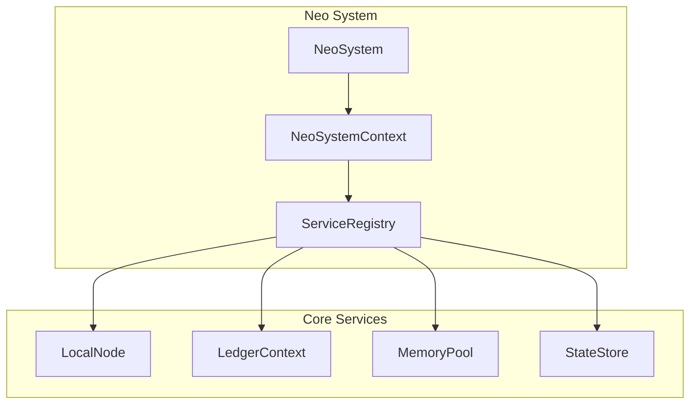
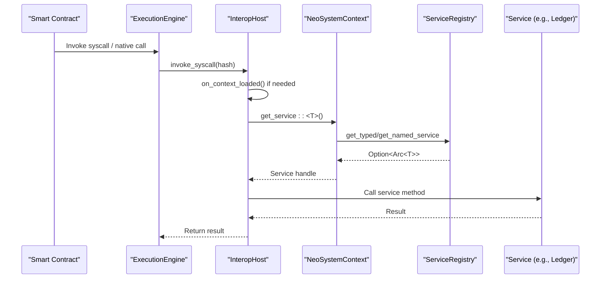
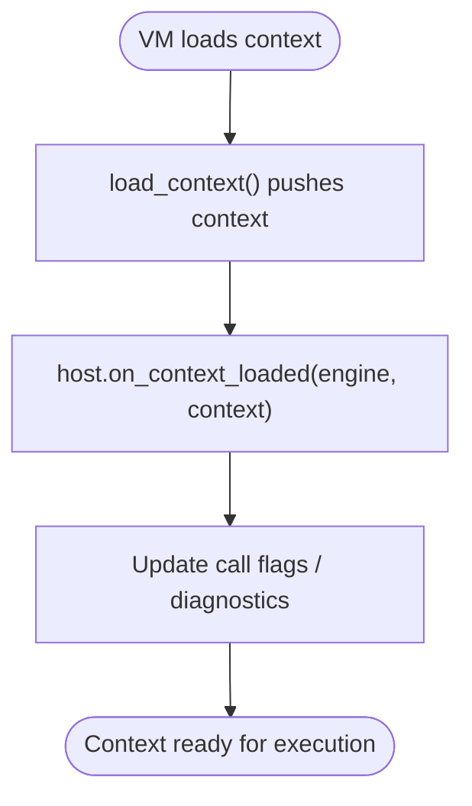
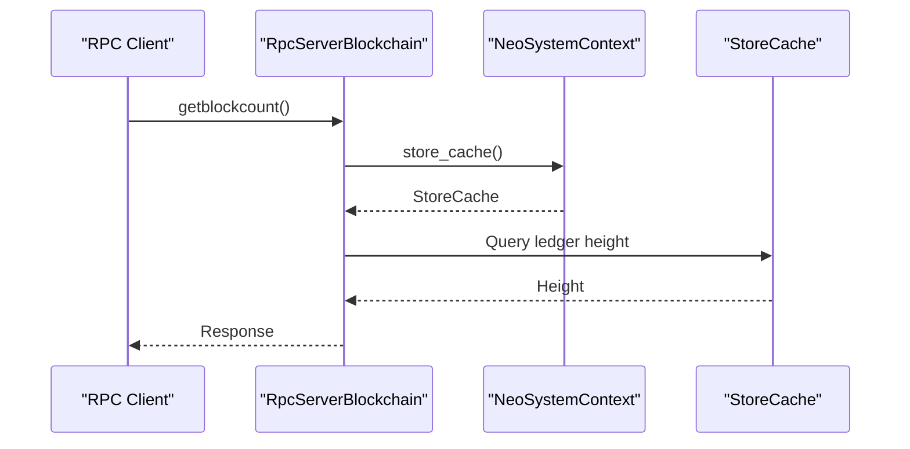
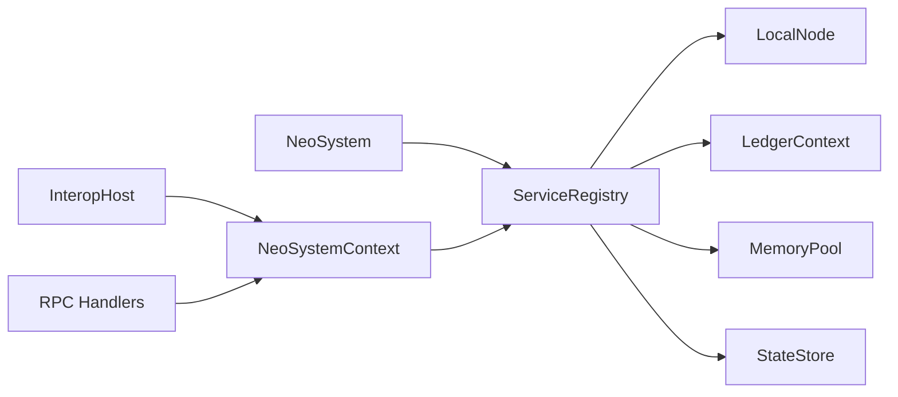

# Dependency Injection

<cite>
**Referenced Files in This Document**
- [neo-core/src/neo_system/core.rs](file://neo-core/src/neo_system/core.rs)
- [neo-core/src/neo_system/context.rs](file://neo-core/src/neo_system/context.rs)
- [neo-core/src/neo_system/registry.rs](file://neo-core/src/neo_system/registry.rs)
- [neo-core/src/neo_system/services.rs](file://neo-core/src/neo_system/services.rs)
- [neo-core/src/neo_system/system.rs](file://neo-core/src/neo_system/system.rs)
- [neo-core/src/smart_contract/application_engine/interop_host.rs](file://neo-core/src/smart_contract/application_engine/interop_host.rs)
- [neo-vm/src/execution_engine/context.rs](file://neo-vm/src/execution_engine/context.rs)
- [neo-core/src/smart_contract/application_engine/storage.rs](file://neo-core/src/smart_contract/application_engine/storage.rs)
- [neo-rpc/src/server/rpc_server_blockchain/mod.rs](file://neo-rpc/src/server/rpc_server_blockchain/mod.rs)
- [docs/PLUGIN_SYSTEM.md](file://docs/PLUGIN_SYSTEM.md)
</cite>

## Table of Contents
1. Introduction
2. Project Structure
3. Core Components
4. Architecture Overview
5. Detailed Component Analysis
6. Dependency Analysis
7. Performance Considerations
8. Troubleshooting Guide
9. Conclusion
10. Appendices

## Introduction
This document explains the dependency injection (DI) system used by Neo-RS services. It covers how services declare and obtain dependencies at runtime, how the service context provides access to shared resources, and how the system evolved from a dynamic C# plugin model to compile-time integration with a type-safe registry. You will also find guidance on constructor-based DI patterns, method parameter injection via VM interop, property-like access through the service context, best practices for loose coupling and avoiding circular dependencies, and strategies for testing with mocked dependencies.

## Project Structure
The DI subsystem is centered around:
- A thread-safe ServiceRegistry that stores and retrieves services by type or name
- A NeoSystemContext that exposes typed accessors to core services and shared state
- Registration helpers on NeoSystem to add named or typed services
- Builtin registration of core services during node bootstrap
- VM interop hooks that bridge contract execution into host services

**Diagram sources**
- [neo-core/src/neo_system/core.rs:237-243](file://neo-core/src/neo_system/core.rs#L237-L243)
- [neo-core/src/neo_system/core.rs:523-543](file://neo-core/src/neo_system/core.rs#L523-L543)
- [neo-core/src/neo_system/context.rs:54-90](file://neo-core/src/neo_system/context.rs#L54-L90)
- [neo-core/src/neo_system/registry.rs:57-62](file://neo-core/src/neo_system/registry.rs#L57-L62)

**Section sources**
- [neo-core/src/neo_system/core.rs:169-341](file://neo-core/src/neo_system/core.rs#L169-L341)
- [neo-core/src/neo_system/context.rs:54-90](file://neo-core/src/neo_system/context.rs#L54-L90)
- [neo-core/src/neo_system/registry.rs:57-62](file://neo-core/src/neo_system/registry.rs#L57-L62)

## Core Components
- ServiceRegistry: Thread-safe container for services keyed by type and optionally by name. Supports typed lookup and named lookup with downcasting.
- NeoSystemContext: Central runtime handle exposing typed accessors to services (ledger, mempool, local node, state store), caches, and readiness checks.
- NeoSystem: Orchestrates construction, registers builtin services, and provides helper methods to add and retrieve services.
- InteropHost and VM Context: Bridge between smart contract execution and host services; provide lifecycle hooks when execution contexts are loaded/unloaded.

Key responsibilities:
- Registration: Builtins are registered at startup; user services can be added later.
- Resolution: Consumers request services by type or name; fallbacks exist for builtins.
- Access: Context methods return Arc-wrapped handles for safe sharing across threads.

**Section sources**
- [neo-core/src/neo_system/registry.rs:1-144](file://neo-core/src/neo_system/registry.rs#L1-L144)
- [neo-core/src/neo_system/context.rs:110-235](file://neo-core/src/neo_system/context.rs#L110-L235)
- [neo-core/src/neo_system/services.rs:15-117](file://neo-core/src/neo_system/services.rs#L15-L117)
- [neo-core/src/neo_system/core.rs:523-543](file://neo-core/src/neo_system/core.rs#L523-L543)

## Architecture Overview
At runtime, services are stored in a global registry and accessed via typed handles. The VM execution engine triggers host callbacks through an interop host, which can read/write execution context state and interact with services.

**Diagram sources**
- [neo-core/src/smart_contract/application_engine/interop_host.rs:1-49](file://neo-core/src/smart_contract/application_engine/interop_host.rs#L1-L49)
- [neo-vm/src/execution_engine/context.rs:7-27](file://neo-vm/src/execution_engine/context.rs#L7-L27)
- [neo-core/src/neo_system/context.rs:110-120](file://neo-core/src/neo_system/context.rs#L110-L120)
- [neo-core/src/neo_system/registry.rs:107-138](file://neo-core/src/neo_system/registry.rs#L107-L138)

## Detailed Component Analysis

### Service Registry
- Stores services as `Arc<dyn Any + Send + Sync>` under both TypeId keys and optional string names.
- Provides:
  - Typed retrieval: `get_typed`, `get_service`
  - Named retrieval: `get_named_service`, `has_named_service`
- Thread safety via `RwLock` with documented lock ordering to avoid deadlocks.

Usage pattern:
- Register builtins at startup
- Add custom services by type or name
- Retrieve via typed handles in consumers

**Section sources**
- [neo-core/src/neo_system/registry.rs:1-144](file://neo-core/src/neo_system/registry.rs#L1-L144)

### NeoSystemContext
- Exposes typed accessors:
  - Ledger: `ledger_service`, `ledger_typed`
  - Mempool: `mempool_service`, `mempool_typed`
  - Local Node: `local_node_service`, `peer_manager_typed`
  - State Store: `state_store`, `state_store_typed`
  - RPC service by network: `rpc_service_name`, `rpc_service`
- Provides storage cache views: `store_cache`, `store_snapshot_cache`
- Readiness helpers: `readiness`, `readiness_with_services`, `is_ready`
- Eventing and wallet change propagation

Lookup strategy:
- Prefer typed service first, then fall back to named lookup using a conventional name (e.g., RPC service name).

**Section sources**
- [neo-core/src/neo_system/context.rs:110-235](file://neo-core/src/neo_system/context.rs#L110-L235)
- [neo-core/src/neo_system/context.rs:122-132](file://neo-core/src/neo_system/context.rs#L122-L132)
- [neo-core/src/neo_system/context.rs:237-282](file://neo-core/src/neo_system/context.rs#L237-L282)

### NeoSystem and Service Registration
- Builtin services are registered during bootstrap: LocalNode, Ledger, MemoryPool, StateStore.
- Public APIs:
  - `add_service` and `add_named_service` to register additional services
  - `get_service` to retrieve by type
  - `has_named_service` to check presence
- Lifecycle events: broadcasts `ServiceAdded` plugin event upon registration.

**Section sources**
- [neo-core/src/neo_system/core.rs:237-243](file://neo-core/src/neo_system/core.rs#L237-L243)
- [neo-core/src/neo_system/core.rs:523-543](file://neo-core/src/neo_system/core.rs#L523-L543)
- [neo-core/src/neo_system/services.rs:15-117](file://neo-core/src/neo_system/services.rs#L15-L117)

### VM Interop and Execution Context
- InteropHost bridges VM syscalls to host handlers and manages context lifecycle.
- When a new execution context is loaded, the host can update engine state and notify diagnostics.
- Storage interops expose read-only and read-write storage contexts to contracts.

**Diagram sources**
- [neo-vm/src/execution_engine/context.rs:7-27](file://neo-vm/src/execution_engine/context.rs#L7-L27)
- [neo-core/src/smart_contract/application_engine/interop_host.rs:19-33](file://neo-core/src/smart_contract/application_engine/interop_host.rs#L19-L33)

**Section sources**
- [neo-core/src/smart_contract/application_engine/interop_host.rs:1-49](file://neo-core/src/smart_contract/application_engine/interop_host.rs#L1-L49)
- [neo-core/src/smart_contract/application_engine/storage.rs:430-477](file://neo-core/src/smart_contract/application_engine/storage.rs#L430-L477)

### RPC Service Integration
RPC handlers access blockchain state via the system’s store cache and other services exposed through the context.

**Diagram sources**
- [neo-rpc/src/server/rpc_server_blockchain/mod.rs:35-59](file://neo-rpc/src/server/rpc_server_blockchain/mod.rs#L35-L59)
- [neo-core/src/neo_system/context.rs:122-132](file://neo-core/src/neo_system/context.rs#L122-L132)

**Section sources**
- [neo-rpc/src/server/rpc_server_blockchain/mod.rs:35-59](file://neo-rpc/src/server/rpc_server_blockchain/mod.rs#L35-L59)

## Dependency Analysis
- Coupling: Services depend on abstractions (traits) where possible; concrete types are injected via the registry.
- Cohesion: Each service encapsulates a single responsibility (e.g., ledger, mempool, local node).
- Circular dependencies: Avoided by using handles and weak references where necessary; lock ordering is enforced in comments and code paths.
- External integrations: VM interop layer connects contract code to host services without tight coupling.

**Diagram sources**
- [neo-core/src/neo_system/core.rs:237-243](file://neo-core/src/neo_system/core.rs#L237-L243)
- [neo-core/src/neo_system/context.rs:110-120](file://neo-core/src/neo_system/context.rs#L110-L120)
- [neo-core/src/smart_contract/application_engine/interop_host.rs:1-49](file://neo-core/src/smart_contract/application_engine/interop_host.rs#L1-L49)

**Section sources**
- [neo-core/src/neo_system/core.rs:97-123](file://neo-core/src/neo_system/core.rs#L97-L123)
- [neo-core/src/neo_system/registry.rs:45-62](file://neo-core/src/neo_system/registry.rs#L45-L62)

## Performance Considerations
- Use read-only caches (`store_cache`, `store_snapshot_cache`) to minimize contention and ensure consistent reads.
- Prefer typed lookups over named lookups when possible to reduce overhead.
- Avoid holding locks across async boundaries; clone data before awaiting.
- Fast sync mode disables expensive event publishing during initial synchronization to improve throughput.

[No sources needed since this section provides general guidance]

## Troubleshooting Guide
Common issues and remedies:
- Missing interop handler: Ensure all required interop handlers are registered before execution begins.
- Service not found: Verify that the service was registered by type or name and that the consumer uses the correct key.
- Deadlocks: Follow documented lock ordering; never hold multiple locks longer than necessary.
- Shutdown races: Handle cases where weak references to NeoSystem fail to upgrade during shutdown.

**Section sources**
- [neo-core/src/smart_contract/application_engine/interop_host.rs:1-17](file://neo-core/src/smart_contract/application_engine/interop_host.rs#L1-L17)
- [neo-core/src/neo_system/context.rs:299-335](file://neo-core/src/neo_system/context.rs#L299-L335)
- [neo-core/src/neo_system/registry.rs:45-62](file://neo-core/src/neo_system/registry.rs#L45-L62)

## Conclusion
Neo-RS uses a compile-time, type-safe dependency injection approach centered on a thread-safe ServiceRegistry and a rich NeoSystemContext. Services are registered at startup and retrieved via typed handles, enabling loose coupling, testability, and clear separation of concerns. The VM interop layer integrates contract execution with host services while preserving performance and safety. By following the recommended patterns—constructor-style initialization, method parameter injection via interop, and property-like access through the context—you can build robust, maintainable services that scale with the node.

[No sources needed since this section summarizes without analyzing specific files]

## Appendices

### Migration from C# Plugin Architecture
- C# used dynamic loading via attributes and per-plugin configuration files.
- Rust uses compile-time feature flags and explicit registration in the node bootstrap.
- Benefits include stronger typing, simpler deployment, and better performance.

**Section sources**
- [docs/PLUGIN_SYSTEM.md:1-51](file://docs/PLUGIN_SYSTEM.md#L1-L51)

### Best Practices
- Design services around traits to enable mocking and swapping implementations.
- Keep services small and focused; compose functionality via the registry rather than deep inheritance.
- Avoid circular dependencies by using handles and weak references where appropriate.
- Use snapshot caches for read-heavy operations to reduce contention.
- For tests, construct a minimal ServiceRegistry, register mock services, and resolve them via the same typed APIs used in production.

[No sources needed since this section provides general guidance]