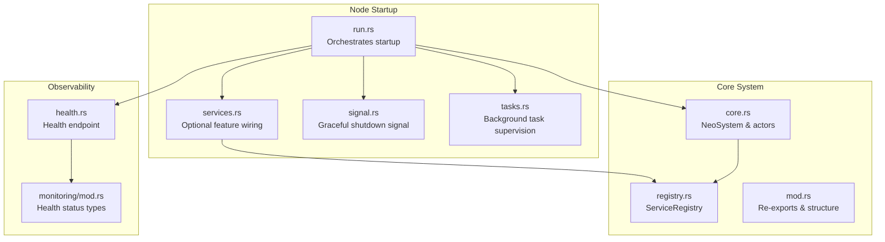
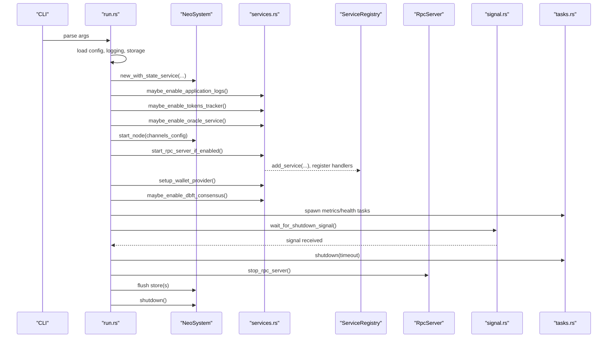
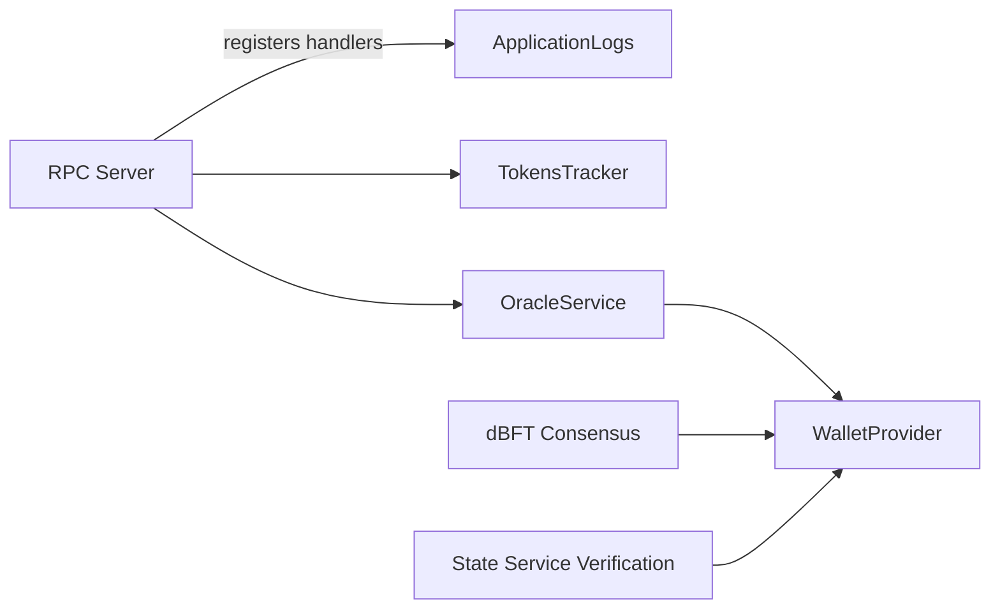

# Lifecycle Management

<cite>
**Referenced Files in This Document**
- [neo-node/src/startup/mod.rs](file://neo-node/src/startup/mod.rs)
- [neo-node/src/startup/run.rs](file://neo-node/src/startup/run.rs)
- [neo-node/src/startup/services.rs](file://neo-node/src/startup/services.rs)
- [neo-node/src/startup/signal.rs](file://neo-node/src/startup/signal.rs)
- [neo-node/src/startup/tasks.rs](file://neo-node/src/startup/tasks.rs)
- [neo-core/src/neo_system/mod.rs](file://neo-core/src/neo_system/mod.rs)
- [neo-core/src/neo_system/core.rs](file://neo-core/src/neo_system/core.rs)
- [neo-core/src/neo_system/registry.rs](file://neo-core/src/neo_system/registry.rs)
- [neo-node/src/health.rs](file://neo-node/src/health.rs)
- [neo-core/src/monitoring/mod.rs](file://neo-core/src/monitoring/mod.rs)
</cite>

## Table of Contents
1. Introduction
2. Project Structure
3. Core Components
4. Architecture Overview
5. Detailed Component Analysis
6. Dependency Analysis
7. Performance Considerations
8. Troubleshooting Guide
9. Conclusion

## Introduction
This document explains service lifecycle management in Neo-RS from initialization through startup, runtime operation, and graceful shutdown. It covers how services are ordered during initialization based on dependencies, how failures are handled, and how the system manages state, health checks, and monitoring integration. Practical guidance is provided for implementing lifecycle hooks in custom services, handling initialization errors, and performing cleanup for resources such as database connections and network sockets.

## Project Structure
Neo-RS separates node orchestration (startup, configuration, signals, tasks) from core system services (actors, registry, persistence, networking). The startup layer wires optional features (RPC, application logs, tokens tracker, oracle, consensus, wallets) around a central NeoSystem instance. Services register themselves into a type-safe registry and participate in commit/committed/wallet-changed event pipelines to coordinate state transitions.

**Diagram sources**
- [neo-node/src/startup/run.rs:32-322](file://neo-node/src/startup/run.rs#L32-L322)
- [neo-node/src/startup/services.rs:246-641](file://neo-node/src/startup/services.rs#L246-L641)
- [neo-node/src/startup/signal.rs:8-33](file://neo-node/src/startup/signal.rs#L8-L33)
- [neo-node/src/startup/tasks.rs:13-52](file://neo-node/src/startup/tasks.rs#L13-L52)
- [neo-core/src/neo_system/core.rs:124-200](file://neo-core/src/neo_system/core.rs#L124-L200)
- [neo-core/src/neo_system/registry.rs:57-143](file://neo-core/src/neo_system/registry.rs#L57-L143)
- [neo-node/src/health.rs:13-34](file://neo-node/src/health.rs#L13-L34)
- [neo-core/src/monitoring/mod.rs:180-207](file://neo-core/src/monitoring/mod.rs#L180-L207)

**Section sources**
- [neo-node/src/startup/mod.rs:1-16](file://neo-node/src/startup/mod.rs#L1-L16)
- [neo-node/src/startup/run.rs:32-322](file://neo-node/src/startup/run.rs#L32-L322)
- [neo-core/src/neo_system/mod.rs:1-56](file://neo-core/src/neo_system/mod.rs#L1-L56)

## Core Components
- NeoSystem: Central runtime that owns the actor system, stores, ledger, mempool, and local node handle. It exposes methods to add services and attach handlers for lifecycle events.
- ServiceRegistry: Thread-safe registry enabling typed and named service discovery with strict lock ordering to avoid deadlocks.
- Startup Orchestration: run.rs coordinates configuration, storage, optional services, RPC, wallet provider, consensus, and shutdown.
- Signal Handling: Waits for SIGINT/SIGTERM or Ctrl+C and triggers graceful shutdown.
- Background Tasks: Tracks and cooperatively shuts down background tasks with a cancellation token and timeout.
- Health and Monitoring: Exposes a health endpoint and provides health status types used by monitoring systems.

**Section sources**
- [neo-core/src/neo_system/core.rs:124-200](file://neo-core/src/neo_system/core.rs#L124-L200)
- [neo-core/src/neo_system/registry.rs:57-143](file://neo-core/src/neo_system/registry.rs#L57-L143)
- [neo-node/src/startup/run.rs:32-322](file://neo-node/src/startup/run.rs#L32-L322)
- [neo-node/src/startup/signal.rs:8-33](file://neo-node/src/startup/signal.rs#L8-L33)
- [neo-node/src/startup/tasks.rs:13-52](file://neo-node/src/startup/tasks.rs#L13-L52)
- [neo-node/src/health.rs:13-34](file://neo-node/src/health.rs#L13-L34)
- [neo-core/src/monitoring/mod.rs:180-207](file://neo-core/src/monitoring/mod.rs#L180-L207)

## Architecture Overview
The startup sequence constructs NeoSystem, validates configuration and storage, initializes optional services in dependency order, starts P2P and RPC, sets up wallet providers and consensus, then waits for shutdown signals. On shutdown, it stops background tasks, RPC, TEE runtime if present, flushes storage, and gracefully shuts down the system.

**Diagram sources**
- [neo-node/src/startup/run.rs:32-322](file://neo-node/src/startup/run.rs#L32-L322)
- [neo-node/src/startup/services.rs:246-641](file://neo-node/src/startup/services.rs#L246-L641)
- [neo-core/src/neo_system/registry.rs:70-143](file://neo-core/src/neo_system/registry.rs#L70-L143)
- [neo-node/src/startup/signal.rs:8-33](file://neo-node/src/startup/signal.rs#L8-L33)
- [neo-node/src/startup/tasks.rs:13-52](file://neo-node/src/startup/tasks.rs#L13-L52)

## Detailed Component Analysis

### Startup Orchestration (run.rs)
- Loads configuration, applies CLI overrides, initializes logging and storage backend.
- Validates configuration and storage access when requested via flags.
- Creates NeoSystem with optional state service settings.
- Initializes optional services in a specific order: ApplicationLogs, TokensTracker, OracleService, then starts P2P, RPC, wallet provider, and dBFT consensus.
- Spawns background tasks for metrics and health; waits for shutdown signals; performs graceful teardown including RPC stop, storage flush, and system shutdown with timeout.

Key behaviors:
- Feature gating: Many services are enabled only when configured and compatible with protocol/network settings.
- Error propagation: Initialization failures return early with context-rich errors.
- Graceful shutdown: Background tasks are given a grace period; RPC is stopped; stores are flushed; system shutdown is awaited with timeout.

**Section sources**
- [neo-node/src/startup/run.rs:32-322](file://neo-node/src/startup/run.rs#L32-L322)

### Service Wiring and Ordering (services.rs)
- ApplicationLogs: Opens a dedicated store, registers committing/committed handlers, and adds itself to the service registry.
- TokensTracker: Similar pattern to ApplicationLogs with its own store and handlers.
- OracleService: Requires RPC; registers committing and wallet-changed handlers; can auto-start depending on configuration.
- RPC Server: Conditionally started; registers handlers based on available services; supports TLS configuration.
- Wallet Provider: Attaches to NeoSystem and optionally integrates with RPC callbacks.
- State Service Verification: Registers wallet-changed handler to verify state roots when enabled.
- dBFT Consensus: Registers wallet-changed handler and adds controller as a service; respects auto_start and network settings.
- Optional TEE/HSM Wallets: Feature-gated integrations for secure signing paths.

Dependency resolution strategy:
- Explicit ordering in run.rs ensures prerequisites exist before dependent services initialize.
- Services often depend on RPC availability or wallet provider presence; checks are performed before enabling.
- Handlers are registered against NeoSystem to react to blockchain commits and wallet changes.

**Section sources**
- [neo-node/src/startup/services.rs:246-641](file://neo-node/src/startup/services.rs#L246-L641)

### Service Registry (registry.rs)
- Provides thread-safe registration and lookup of services by type or name.
- Maintains three internal collections: typed services, named services, and a list of all services.
- Enforces lock ordering to prevent deadlocks when multiple locks are acquired.
- Supports downcasting to concrete types for safe usage.

Usage patterns:
- Services register themselves using add_service or register_typed.
- Consumers retrieve services via get_typed or get_named_service.
- Named lookups enable flexible composition without tight coupling.

**Section sources**
- [neo-core/src/neo_system/registry.rs:57-143](file://neo-core/src/neo_system/registry.rs#L57-L143)

### NeoSystem Core (core.rs)
- Owns the actor system, blockchain handle, local node handle, task manager, transaction router, store provider/store, ledger context, and genesis block.
- Provides accessors for store cache and mempool.
- Documents lock ordering to prevent deadlocks across components.
- Serves as the central hub for registering services and attaching event handlers.

Lifecycle responsibilities:
- Construction sets up foundational components and registries.
- start_node boots P2P subsystem.
- shutdown orchestrates orderly teardown of actors and services.

**Section sources**
- [neo-core/src/neo_system/core.rs:124-200](file://neo-core/src/neo_system/core.rs#L124-L200)

### Signal Handling and Background Tasks
- Signal handling listens for SIGINT/SIGTERM (Unix) or Ctrl+C (cross-platform) and initiates shutdown flow.
- BackgroundTasks tracks spawned futures, provides a shared cancellation token, and enforces a cooperative shutdown with timeout.

Integration points:
- run.rs spawns metrics and health tasks via BackgroundTasks.
- On signal, run.rs calls BackgroundTasks::shutdown with a default grace period.

**Section sources**
- [neo-node/src/startup/signal.rs:8-33](file://neo-node/src/startup/signal.rs#L8-L33)
- [neo-node/src/startup/tasks.rs:13-52](file://neo-node/src/startup/tasks.rs#L13-L52)

### Health Checking and Monitoring Integration
- Health endpoint serves readiness/liveness information and integrates with node storage version policy.
- HealthStatus enum models Healthy/Degraded/Unhealthy states with merge semantics for composite reports.
- Monitoring utilities provide gauges and timestamps for observability backends.

Operational notes:
- Health server runs until shutdown resolves, allowing external probes to detect termination.
- Metrics pump updates performance stats periodically.

**Section sources**
- [neo-node/src/health.rs:13-34](file://neo-node/src/health.rs#L13-L34)
- [neo-core/src/monitoring/mod.rs:180-207](file://neo-core/src/monitoring/mod.rs#L180-L207)

### Lifecycle Hooks and Event Pipeline
Services integrate with the lifecycle via handlers:
- CommittingHandler: Invoked before blocks are committed; suitable for preparing writes or validations.
- CommittedHandler: Invoked after blocks are committed; suitable for finalizing state updates.
- WalletChangedHandler: Invoked when the active wallet changes; useful for reconfiguring signing or consensus participation.

Examples in codebase:
- ApplicationLogs registers committing and committed handlers to persist log entries consistently.
- TokensTracker registers both committing and committed handlers to maintain token histories.
- OracleService registers committing and wallet-changed handlers to process requests and adapt to wallet changes.
- dBFT Consensus registers a wallet-changed handler to manage consensus participation based on wallet availability.

Best practices:
- Use committing handlers for idempotent pre-commit work; use committed handlers for post-commit side effects.
- Avoid long-running operations in handlers; offload heavy work to background tasks.
- Handle errors gracefully; log and continue unless failure indicates a fatal condition.

**Section sources**
- [neo-node/src/startup/services.rs:450-641](file://neo-node/src/startup/services.rs#L450-L641)

### Practical Examples for Custom Services

Implementing a custom service:
- Define your service struct and implement required traits or interfaces.
- Register the service with NeoSystem using add_service or ServiceRegistry methods.
- Attach lifecycle handlers (committing/committed/wallet-changed) as needed.
- Start any background tasks via BackgroundTasks or the system’s task manager.

Handling initialization errors:
- Validate configuration and dependencies before constructing the service.
- Return descriptive errors with context to aid troubleshooting.
- For optional features, fall back gracefully when prerequisites are missing.

Cleanup procedures:
- Implement RAII-style drop logic to close database connections, release network sockets, and cancel background tasks.
- Ensure handlers deregister or become no-ops during shutdown to prevent use-after-free.
- Flush persistent state before shutdown to avoid data loss.

Reference patterns:
- See ApplicationLogs and TokensTracker initialization for store opening, directory creation, and handler registration.
- See RPC server startup for conditional enabling and TLS configuration.
- See dBFT consensus setup for wallet provider dependency and auto-start behavior.

**Section sources**
- [neo-node/src/startup/services.rs:450-641](file://neo-node/src/startup/services.rs#L450-L641)
- [neo-node/src/startup/run.rs:177-226](file://neo-node/src/startup/run.rs#L177-L226)

## Dependency Analysis
The startup sequence imposes explicit dependencies:
- RPC depends on optional services being present to register corresponding handlers.
- OracleService requires RPC to be enabled.
- dBFT Consensus requires a wallet provider when auto_start is enabled.
- State Service Verification requires a wallet provider when auto_verify is enabled.

**Diagram sources**
- [neo-node/src/startup/services.rs:246-641](file://neo-node/src/startup/services.rs#L246-L641)

**Section sources**
- [neo-node/src/startup/services.rs:246-641](file://neo-node/src/startup/services.rs#L246-L641)

## Performance Considerations
- Prefer lightweight operations in lifecycle handlers; defer heavy work to background tasks.
- Use committing/committed handlers to batch writes and minimize disk I/O.
- Configure mempool policies and channel settings to match workload characteristics.
- Monitor health and metrics to identify bottlenecks and tune timeouts.

[No sources needed since this section provides general guidance]

## Troubleshooting Guide
Common issues and resolutions:
- RPC TLS configuration error: Review certificate paths and permissions; check logs for detailed error messages.
- Network mismatch warnings: Ensure configured network matches protocol settings; otherwise, the feature will be skipped.
- Missing wallet provider: Required for dBFT auto_start and state verification; enable wallet provider or adjust configuration.
- Storage path invalid: Verify UTF-8 validity and directory existence; ensure write permissions.
- Shutdown timeout: Increase grace periods or investigate long-running tasks blocking shutdown.

Diagnostic steps:
- Check logs for warnings about disabled features due to configuration mismatches.
- Inspect health endpoint responses to assess component status.
- Use metrics to track task durations and resource utilization.

**Section sources**
- [neo-node/src/startup/services.rs:246-641](file://neo-node/src/startup/services.rs#L246-L641)
- [neo-node/src/startup/run.rs:279-317](file://neo-node/src/startup/run.rs#L279-L317)
- [neo-node/src/health.rs:13-34](file://neo-node/src/health.rs#L13-L34)

## Conclusion
Neo-RS implements a robust, extensible service lifecycle managed by NeoSystem and orchestrated by the startup layer. Services are initialized in a dependency-aware order, integrated via a type-safe registry, and coordinated through lifecycle handlers. Health checking and monitoring provide operational visibility, while signal-driven graceful shutdown ensures clean teardown. By following the patterns demonstrated in ApplicationLogs, TokensTracker, OracleService, and dBFT Consensus, developers can implement custom services that integrate seamlessly with the system’s lifecycle, handle errors gracefully, and perform reliable cleanup of resources.