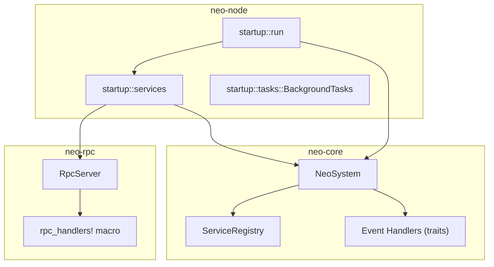
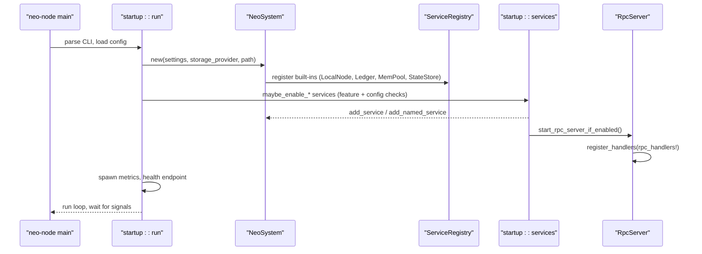
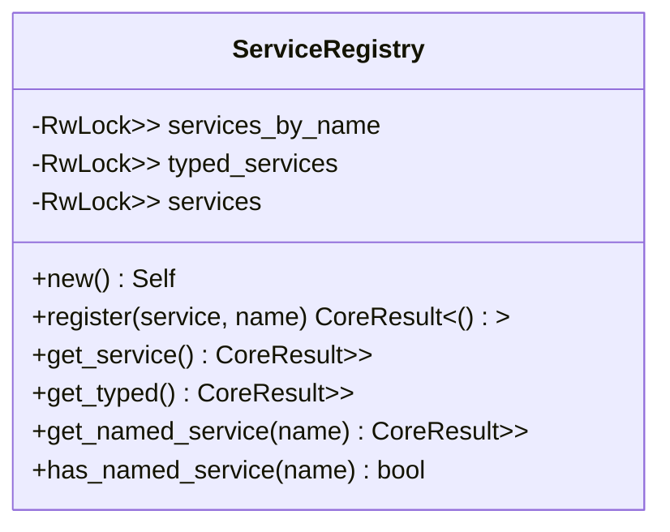
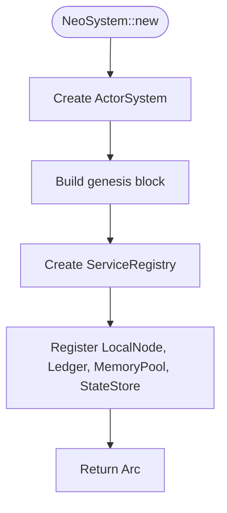
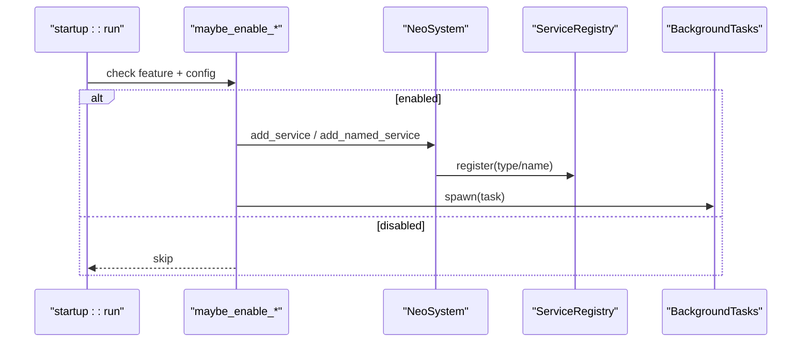
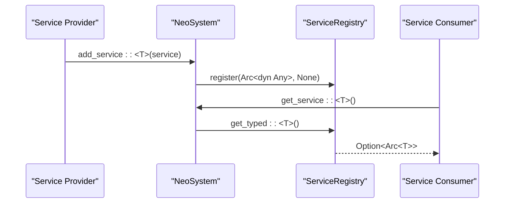
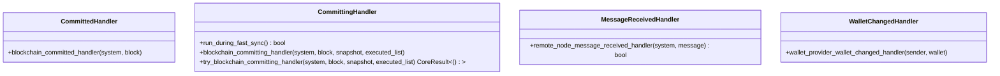
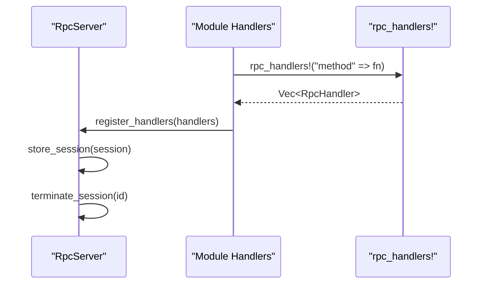
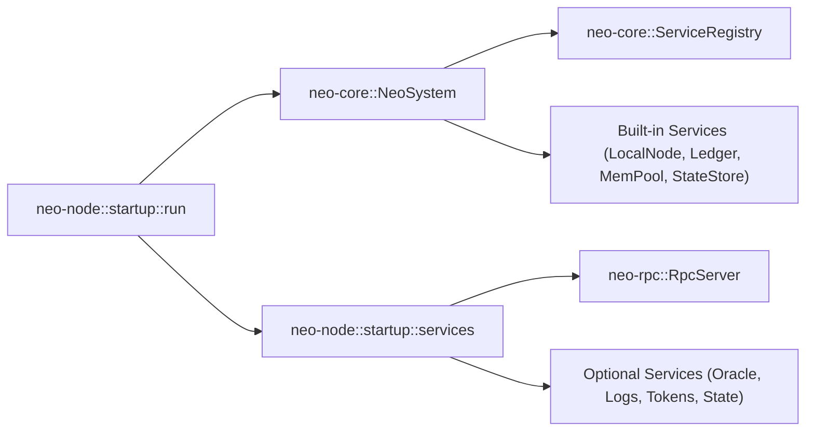

# Service Architecture

<cite>
**Referenced Files in This Document**
- [neo-core/src/neo_system/core.rs](file://neo-core/src/neo_system/core.rs)
- [neo-core/src/neo_system/registry.rs](file://neo-core/src/neo_system/registry.rs)
- [neo-core/src/neo_system/services.rs](file://neo-core/src/neo_system/services.rs)
- [neo-core/src/events/handlers.rs](file://neo-core/src/events/handlers.rs)
- [neo-node/src/startup/run.rs](file://neo-node/src/startup/run.rs)
- [neo-node/src/startup/services.rs](file://neo-node/src/startup/services.rs)
- [neo-node/src/startup/tasks.rs](file://neo-node/src/startup/tasks.rs)
- [neo-rpc/src/server/rpc_server.rs](file://neo-rpc/src/server/rpc_server.rs)
- [neo-rpc/src/server/rpc_handler_macros.rs](file://neo-rpc/src/server/rpc_handler_macros.rs)
- [docs/PLUGIN_SYSTEM.md](file://docs/PLUGIN_SYSTEM.md)
</cite>

## Table of Contents
1. Introduction
2. Project Structure
3. Core Components
4. Architecture Overview
5. Detailed Component Analysis
6. Dependency Analysis
7. Performance Considerations
8. Troubleshooting Guide
9. Conclusion
10. Appendices

## Introduction
This document explains the Neo-RS service architecture that replaces dynamic plugin loading with compile-time integration. It focuses on the ServiceRegistry pattern, service lifecycle management, and dependency injection mechanisms used throughout the node’s runtime. You will learn how services are registered, initialized, and managed; how trait-based interfaces enable composition; and how to implement custom services (background tasks, event handlers, RPC-integrated services). It also contrasts this approach with the C# plugin system and provides migration guidance for existing plugin developers.

## Project Structure
The service architecture spans several crates:
- neo-core: core orchestration (NeoSystem), service registry, and event handler traits
- neo-node: startup orchestration, feature-gated service initialization, background task supervision
- neo-rpc: RPC server and handler registration macros
- docs: architectural comparison and migration guide

**Diagram sources**
- [neo-node/src/startup/run.rs:1-34](file://neo-node/src/startup/run.rs#L1-L34)
- [neo-node/src/startup/services.rs:262-294](file://neo-node/src/startup/services.rs#L262-L294)
- [neo-core/src/neo_system/core.rs:158-200](file://neo-core/src/neo_system/core.rs#L158-L200)
- [neo-core/src/neo_system/registry.rs:45-144](file://neo-core/src/neo_system/registry.rs#L45-L144)
- [neo-rpc/src/server/rpc_server.rs:609-644](file://neo-rpc/src/server/rpc_server.rs#L609-L644)
- [neo-rpc/src/server/rpc_handler_macros.rs:1-14](file://neo-rpc/src/server/rpc_handler_macros.rs#L1-L14)

**Section sources**
- [neo-node/src/startup/run.rs:1-34](file://neo-node/src/startup/run.rs#L1-L34)
- [neo-core/src/neo_system/core.rs:1-120](file://neo-core/src/neo_system/core.rs#L1-L120)
- [docs/PLUGIN_SYSTEM.md:1-52](file://docs/PLUGIN_SYSTEM.md#L1-L52)

## Core Components
- ServiceRegistry: thread-safe registry supporting typed and named service discovery, enabling dependency injection across the node.
- NeoSystem: central orchestrator that constructs actors, registers built-in services, and exposes extension points for plugins/services.
- Event Handler Traits: standardized hooks for block committing/committed, message handling, and wallet changes.
- Startup Services: feature-gated initialization functions that build and register optional services (Oracle, Application Logs, Tokens Tracker, State Service, RPC).
- Background Tasks: cooperative shutdown via CancellationToken and TaskTracker for long-running tasks.
- RPC Integration: handler registration using a macro to bind methods to RPC endpoints.

Key responsibilities:
- Registration: services are added by type or name into ServiceRegistry.
- Initialization: startup functions check configuration and feature flags, construct services, start background work, and register them.
- Lifecycle: RAII ensures cleanup; background tasks respond to cancellation tokens during shutdown.

**Section sources**
- [neo-core/src/neo_system/registry.rs:45-144](file://neo-core/src/neo_system/registry.rs#L45-L144)
- [neo-core/src/neo_system/core.rs:523-543](file://neo-core/src/neo_system/core.rs#L523-L543)
- [neo-core/src/events/handlers.rs:9-63](file://neo-core/src/events/handlers.rs#L9-L63)
- [neo-node/src/startup/services.rs:262-294](file://neo-node/src/startup/services.rs#L262-L294)
- [neo-node/src/startup/tasks.rs:1-79](file://neo-node/src/startup/tasks.rs#L1-L79)
- [neo-rpc/src/server/rpc_handler_macros.rs:1-14](file://neo-rpc/src/server/rpc_handler_macros.rs#L1-L14)

## Architecture Overview
The node bootstraps a NeoSystem, which creates an ActorSystem and a ServiceRegistry. Built-in services (LocalNode, Ledger, MemoryPool, StateStore) are registered early. Optional services are conditionally enabled based on configuration and features. The RPC server is started last and registers its handlers. Background tasks are tracked for graceful shutdown.

**Diagram sources**
- [neo-node/src/main.rs:65-79](file://neo-node/src/main.rs#L65-L79)
- [neo-node/src/startup/run.rs:1-34](file://neo-node/src/startup/run.rs#L1-L34)
- [neo-core/src/neo_system/core.rs:158-200](file://neo-core/src/neo_system/core.rs#L158-L200)
- [neo-core/src/neo_system/core.rs:523-543](file://neo-core/src/neo_system/core.rs#L523-L543)
- [neo-node/src/startup/services.rs:262-294](file://neo-node/src/startup/services.rs#L262-L294)
- [neo-rpc/src/server/rpc_server.rs:609-644](file://neo-rpc/src/server/rpc_server.rs#L609-L644)

## Detailed Component Analysis

### ServiceRegistry Pattern
ServiceRegistry provides:
- Typed registration and lookup by TypeId
- Named registration and lookup by string key
- Thread-safe access via RwLock
- A fallback list of services for legacy get_service behavior

**Diagram sources**
- [neo-core/src/neo_system/registry.rs:45-144](file://neo-core/src/neo_system/registry.rs#L45-L144)

**Section sources**
- [neo-core/src/neo_system/registry.rs:45-144](file://neo-core/src/neo_system/registry.rs#L45-L144)

### NeoSystem Orchestration and Built-in Services
NeoSystem constructs the actor system, sets up persistence, and registers core services. Built-in services are registered with names for compatibility and discovery.

**Diagram sources**
- [neo-core/src/neo_system/core.rs:158-200](file://neo-core/src/neo_system/core.rs#L158-L200)
- [neo-core/src/neo_system/core.rs:523-543](file://neo-core/src/neo_system/core.rs#L523-L543)

**Section sources**
- [neo-core/src/neo_system/core.rs:158-200](file://neo-core/src/neo_system/core.rs#L158-L200)
- [neo-core/src/neo_system/core.rs:523-543](file://neo-core/src/neo_system/core.rs#L523-L543)

### Service Lifecycle Management
- Feature gating: Cargo features determine which modules are compiled.
- Configuration-driven enablement: each service has an enabled flag in TOML.
- Construction and registration: services are constructed with dependencies from NeoSystem and registered via add_service/add_named_service.
- Background tasks: spawned with tokio and tracked via BackgroundTasks for coordinated shutdown.
- RAII cleanup: dropping service instances triggers teardown; background tasks honor cancellation tokens.

**Diagram sources**
- [neo-node/src/startup/run.rs:1-34](file://neo-node/src/startup/run.rs#L1-L34)
- [neo-node/src/startup/services.rs:262-294](file://neo-node/src/startup/services.rs#L262-L294)
- [neo-core/src/neo_system/services.rs:15-32](file://neo-core/src/neo_system/services.rs#L15-L32)
- [neo-node/src/startup/tasks.rs:1-79](file://neo-node/src/startup/tasks.rs#L1-L79)

**Section sources**
- [docs/PLUGIN_SYSTEM.md:107-152](file://docs/PLUGIN_SYSTEM.md#L107-L152)
- [neo-node/src/startup/tasks.rs:1-79](file://neo-node/src/startup/tasks.rs#L1-L79)

### Dependency Injection Mechanisms
- Typed DI: get_typed<T>() returns a strongly-typed handle to a registered service.
- Named DI: get_named_service("key") enables string-based discovery for compatibility.
- NeoSystem helpers: add_service<T,S> and add_named_service<T,S> wrap registration.

**Diagram sources**
- [neo-core/src/neo_system/services.rs:15-32](file://neo-core/src/neo_system/services.rs#L15-L32)
- [neo-core/src/neo_system/registry.rs:107-138](file://neo-core/src/neo_system/registry.rs#L107-L138)

**Section sources**
- [neo-core/src/neo_system/services.rs:15-32](file://neo-core/src/neo_system/services.rs#L15-L32)
- [neo-core/src/neo_system/registry.rs:107-138](file://neo-core/src/neo_system/registry.rs#L107-L138)

### Trait-Based Service Interfaces and Composition
- Committing/Committed handlers allow services to react to block lifecycle events.
- MessageReceivedHandler integrates with P2P message processing.
- WalletChangedHandler reacts to wallet provider changes.
- Composition: multiple handlers can be registered; execution order is controlled by the system.

**Diagram sources**
- [neo-core/src/events/handlers.rs:9-63](file://neo-core/src/events/handlers.rs#L9-L63)

**Section sources**
- [neo-core/src/events/handlers.rs:9-63](file://neo-core/src/events/handlers.rs#L9-L63)

### RPC-Integrated Services
RPC handlers are registered declaratively using a macro that produces a vector of handlers. The RPC server stores sessions and exposes methods to manage them.

**Diagram sources**
- [neo-rpc/src/server/rpc_handler_macros.rs:1-14](file://neo-rpc/src/server/rpc_handler_macros.rs#L1-L14)
- [neo-rpc/src/server/rpc_server.rs:609-644](file://neo-rpc/src/server/rpc_server.rs#L609-L644)

**Section sources**
- [neo-rpc/src/server/rpc_handler_macros.rs:1-14](file://neo-rpc/src/server/rpc_handler_macros.rs#L1-L14)
- [neo-rpc/src/server/rpc_server.rs:609-644](file://neo-rpc/src/server/rpc_server.rs#L609-L644)

### Practical Examples

#### Creating a Background Task Service
- Define a service struct holding a JoinHandle or similar resource.
- On start, spawn a tokio task that loops until a cancellation token is signaled.
- Register the service with NeoSystem so other components can retrieve it.

References:
- Background task supervision and shutdown signaling: [neo-node/src/startup/tasks.rs:1-79](file://neo-node/src/startup/tasks.rs#L1-L79)
- Service registration entry points: [neo-core/src/neo_system/services.rs:15-32](file://neo-core/src/neo_system/services.rs#L15-L32)

#### Implementing Event Handlers
- Implement CommittingHandler or CommittedHandler to process blocks before/after commit.
- Register via NeoSystem to receive events at the appropriate lifecycle point.

References:
- Handler traits: [neo-core/src/events/handlers.rs:9-63](file://neo-core/src/events/handlers.rs#L9-L63)

#### Integrating with RPC
- Use the rpc_handlers! macro to declare method-to-function mappings.
- Register handlers through the RPC server during startup.

References:
- Macro definition: [neo-rpc/src/server/rpc_handler_macros.rs:1-14](file://neo-rpc/src/server/rpc_handler_macros.rs#L1-L14)
- Server session and handler management: [neo-rpc/src/server/rpc_server.rs:609-644](file://neo-rpc/src/server/rpc_server.rs#L609-L644)

## Dependency Analysis
The following diagram shows how startup flows depend on core services and how optional services integrate.

**Diagram sources**
- [neo-node/src/startup/run.rs:1-34](file://neo-node/src/startup/run.rs#L1-L34)
- [neo-core/src/neo_system/core.rs:523-543](file://neo-core/src/neo_system/core.rs#L523-L543)
- [neo-node/src/startup/services.rs:262-294](file://neo-node/src/startup/services.rs#L262-L294)

**Section sources**
- [neo-node/src/startup/run.rs:1-34](file://neo-node/src/startup/run.rs#L1-L34)
- [neo-core/src/neo_system/core.rs:523-543](file://neo-core/src/neo_system/core.rs#L523-L543)
- [neo-node/src/startup/services.rs:262-294](file://neo-node/src/startup/services.rs#L262-L294)

## Performance Considerations
- Compile-time integration eliminates reflection and dynamic loading overhead present in C#.
- ServiceRegistry uses fine-grained RwLocks to minimize contention between reads and writes.
- Background tasks use cooperative cancellation to avoid abrupt halts and reduce CPU waste.
- RPC handler registration is static and efficient, avoiding runtime introspection.

[No sources needed since this section provides general guidance]

## Troubleshooting Guide
Common issues and where to look:
- Service not starting: verify feature flags and configuration enablement; ensure dependencies exist in ServiceRegistry.
- Config validation errors: confirm TOML schema matches NodeConfig fields and required values.
- Build errors: ensure all modules are compiled with correct features and imports are visible.
- RPC methods not available: confirm handlers were registered via rpc_handlers! and the server was started.

Relevant references:
- Migration and troubleshooting notes: [docs/PLUGIN_SYSTEM.md:404-435](file://docs/PLUGIN_SYSTEM.md#L404-L435)
- Service registration APIs: [neo-core/src/neo_system/services.rs:15-32](file://neo-core/src/neo_system/services.rs#L15-L32)
- RPC handler macro: [neo-rpc/src/server/rpc_handler_macros.rs:1-14](file://neo-rpc/src/server/rpc_handler_macros.rs#L1-L14)

**Section sources**
- [docs/PLUGIN_SYSTEM.md:404-435](file://docs/PLUGIN_SYSTEM.md#L404-L435)
- [neo-core/src/neo_system/services.rs:15-32](file://neo-core/src/neo_system/services.rs#L15-L32)
- [neo-rpc/src/server/rpc_handler_macros.rs:1-14](file://neo-rpc/src/server/rpc_handler_macros.rs#L1-L14)

## Conclusion
Neo-RS replaces dynamic plugin loading with a robust, compile-time integrated service model. ServiceRegistry provides safe, typed, and named dependency injection. NeoSystem orchestrates lifecycle, while startup services gate functionality behind features and configuration. Event handler traits and RPC integration complete the extensibility surface. This design improves type safety, performance, deployment simplicity, and security compared to the C# plugin system.

[No sources needed since this section summarizes without analyzing specific files]

## Appendices

### Differences from C# Plugin Architecture
- C# uses reflection-based dynamic loading and per-plugin JSON configs.
- Rust uses Cargo features, unified TOML configuration, and compile-time linking.
- Lifecycle moves from virtual methods to explicit construction, registration, and RAII cleanup.

**Section sources**
- [docs/PLUGIN_SYSTEM.md:1-52](file://docs/PLUGIN_SYSTEM.md#L1-L52)
- [docs/PLUGIN_SYSTEM.md:107-152](file://docs/PLUGIN_SYSTEM.md#L107-L152)

### Migration Guidance for Existing Plugin Developers
- Identify dependencies (NeoSystem, wallets, P2P, ledger).
- Port logic to Rust, replacing Akka actors with Tokio tasks.
- Use ServiceRegistry for dependency injection.
- Add tests and update documentation.

**Section sources**
- [docs/PLUGIN_SYSTEM.md:307-343](file://docs/PLUGIN_SYSTEM.md#L307-L343)