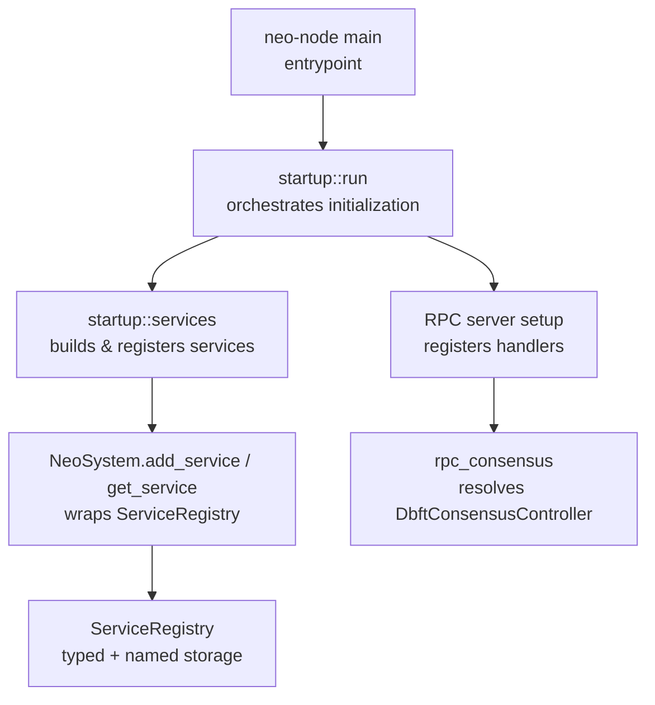
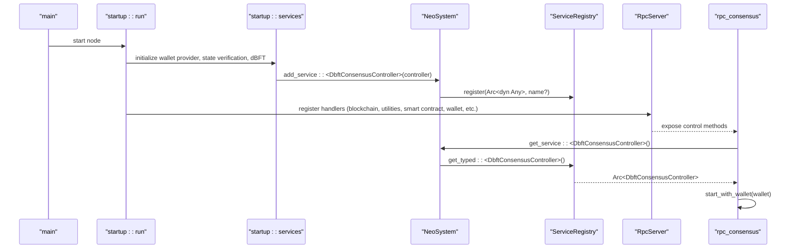
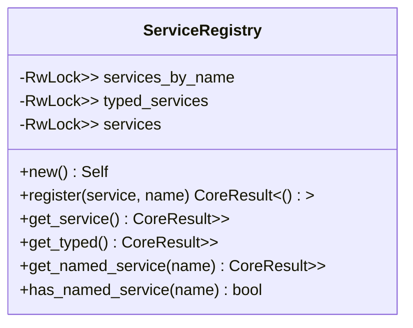
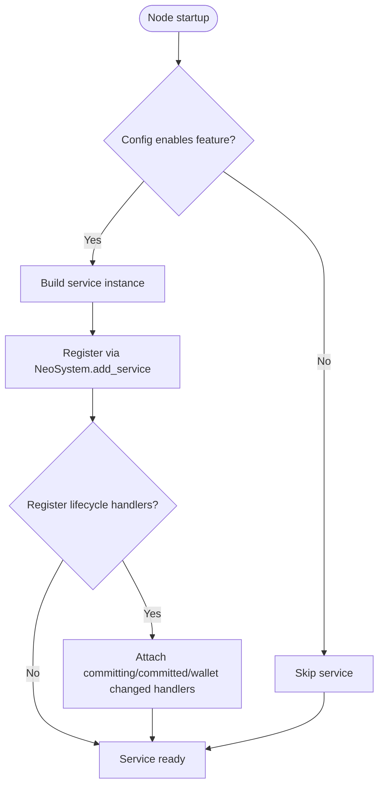
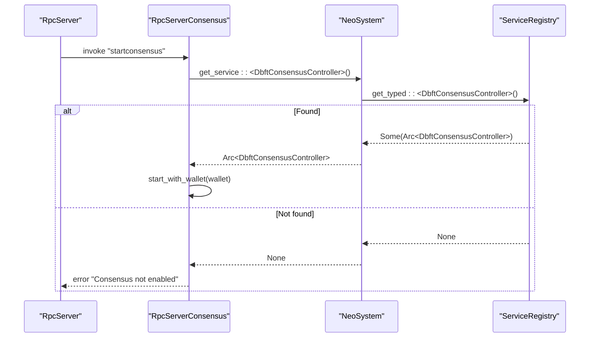
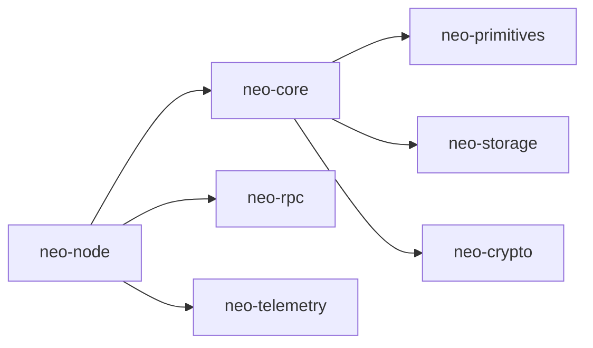

# Service Registry Pattern

<cite>
**Referenced Files in This Document**
- [registry.rs](file://neo-core/src/neo_system/registry.rs)
- [traits.rs](file://neo-core/src/services/traits.rs)
- [services.rs](file://neo-node/src/startup/services.rs)
- [run.rs](file://neo-node/src/startup/run.rs)
- [rpc_consensus.rs](file://neo-node/src/rpc_consensus.rs)
- [main.rs](file://neo-node/src/main.rs)
- [tasks.rs](file://neo-node/src/startup/tasks.rs)
</cite>

## Table of Contents
1. Introduction
2. Project Structure
3. Core Components
4. Architecture Overview
5. Detailed Component Analysis
6. Dependency Analysis
7. Performance Considerations
8. Troubleshooting Guide
9. Conclusion

## Introduction
This document explains the ServiceRegistry pattern used in Neo-RS as a central hub for service discovery and management. It replaces dynamic plugin loading with compile-time integration: services are constructed during node startup, registered into a type-safe registry, and later resolved by other components without runtime plugin loading. The registry supports both typed lookups (by Rust type) and named lookups (by string key), enabling flexible yet safe dependency injection across subsystems such as blockchain state, consensus, RPC, and optional features like application logs, tokens tracker, and oracle service.

## Project Structure
The ServiceRegistry lives in the core system module and is consumed by node startup logic to wire built-in and optional services. Node startup constructs services based on configuration, registers them via the system’s service API, and exposes them through the registry for consumers (for example, RPC handlers).

**Diagram sources**
- [main.rs:65-79](file://neo-node/src/main.rs#L65-L79)
- [run.rs:203-238](file://neo-node/src/startup/run.rs#L203-L238)
- [services.rs:246-320](file://neo-node/src/startup/services.rs#L246-L320)
- [services.rs:391-448](file://neo-node/src/startup/services.rs#L391-L448)
- [rpc_consensus.rs:22-52](file://neo-node/src/rpc_consensus.rs#L22-L52)
- [registry.rs:58-143](file://neo-core/src/neo_system/registry.rs#L58-L143)

**Section sources**
- [main.rs:65-79](file://neo-node/src/main.rs#L65-L79)
- [run.rs:203-238](file://neo-node/src/startup/run.rs#L203-L238)
- [services.rs:246-320](file://neo-node/src/startup/services.rs#L246-L320)
- [services.rs:391-448](file://neo-node/src/startup/services.rs#L391-L448)
- [registry.rs:58-143](file://neo-core/src/neo_system/registry.rs#L58-L143)

## Core Components
- ServiceRegistry: Thread-safe container storing services by type and optionally by name. Provides registration and retrieval APIs with downcasting to concrete types.
- SystemContext/NeoSystem service API: Wraps the registry to add services and retrieve them by type; also emits events when services are added.
- Service traits: Define contracts for subsystems (LedgerService, StateStoreService, MempoolService, PeerManagerService, RpcService) and a broader SystemContext trait that abstracts runtime access to store cache, protocol settings, mempool, and event dispatching.

Key responsibilities:
- Registration: Services are created at startup and registered with the registry.
- Lookup: Consumers resolve services by type or name using the registry.
- Contracts: Traits define minimal interfaces for cross-cutting concerns (health checks, metrics, observability).

**Section sources**
- [registry.rs:58-143](file://neo-core/src/neo_system/registry.rs#L58-L143)
- [traits.rs:10-54](file://neo-core/src/services/traits.rs#L10-L54)
- [traits.rs:74-104](file://neo-core/src/services/traits.rs#L74-L104)

## Architecture Overview
The architecture uses a central registry to decouple service creation from consumption. Startup code builds services conditionally based on configuration and feature flags, then registers them. Consumers (like RPC handlers) request services by type and receive strongly-typed references.

**Diagram sources**
- [main.rs:65-79](file://neo-node/src/main.rs#L65-L79)
- [run.rs:203-238](file://neo-node/src/startup/run.rs#L203-L238)
- [services.rs:391-448](file://neo-node/src/startup/services.rs#L391-L448)
- [services.rs:246-320](file://neo-node/src/startup/services.rs#L246-L320)
- [rpc_consensus.rs:22-52](file://neo-node/src/rpc_consensus.rs#L22-L52)
- [registry.rs:74-138](file://neo-core/src/neo_system/registry.rs#L74-L138)

## Detailed Component Analysis

### ServiceRegistry
- Stores services in three structures:
  - By name: HashMap<String, Arc<dyn Any + Send + Sync>>
  - By type: HashMap<TypeId, Arc<dyn Any + Send + Sync>>
  - Ordered list: Vec<Arc<dyn Any + Send + Sync>>
- Registration:
  - Always registers by type; optionally by name if provided.
  - Also appends to an internal list for legacy fallback lookup.
- Retrieval:
  - get_typed<T>: direct type-based lookup with downcast.
  - get_service<T>: tries typed registry first, then scans the list.
  - get_named_service<T>(name): resolves by name and downcasts.
  - has_named_service(name): presence check.
- Concurrency:
  - Uses RwLock per map/list to allow concurrent reads and serialized writes.
  - Lock ordering documented to avoid deadlocks.

**Diagram sources**
- [registry.rs:58-143](file://neo-core/src/neo_system/registry.rs#L58-L143)

**Section sources**
- [registry.rs:58-143](file://neo-core/src/neo_system/registry.rs#L58-L143)

### Service Traits and Contracts
- LedgerService: read-only blockchain state accessors (heights, block hash lookup).
- StateStoreService: state root indices for monitoring sync progress.
- MempoolService: transaction pool statistics.
- PeerManagerService: peer connection counts.
- RpcService: readiness indicator for RPC health checks.
- SystemContext: runtime context abstraction providing store cache, protocol settings, current block index, mempool queries, header height, readiness, and event notification hooks.

These traits define stable contracts between services and consumers, enabling testability and decoupling.

**Section sources**
- [traits.rs:10-54](file://neo-core/src/services/traits.rs#L10-L54)
- [traits.rs:74-104](file://neo-core/src/services/traits.rs#L74-L104)

### Registration and Lifecycle in Node Startup
- Wallet provider: attached to the system and optionally wired to RPC callbacks.
- State service verification: registered as a wallet change handler when enabled.
- dBFT consensus: controller constructed and registered as a service; can auto-start when wallet is available.
- Application logs, tokens tracker, oracle service: each initialized conditionally and registered as services and/or commit/wallet handlers.
- RPC server: handlers registered for blockchain, utilities, smart contract, wallet, and optional modules (application logs, state, tokens tracker, oracle).

**Diagram sources**
- [services.rs:322-354](file://neo-node/src/startup/services.rs#L322-L354)
- [services.rs:356-389](file://neo-node/src/startup/services.rs#L356-L389)
- [services.rs:391-448](file://neo-node/src/startup/services.rs#L391-L448)
- [services.rs:450-511](file://neo-node/src/startup/services.rs#L450-L511)
- [services.rs:513-581](file://neo-node/src/startup/services.rs#L513-L581)
- [services.rs:583-641](file://neo-node/src/startup/services.rs#L583-L641)

**Section sources**
- [services.rs:322-354](file://neo-node/src/startup/services.rs#L322-L354)
- [services.rs:356-389](file://neo-node/src/startup/services.rs#L356-L389)
- [services.rs:391-448](file://neo-node/src/startup/services.rs#L391-L448)
- [services.rs:450-511](file://neo-node/src/startup/services.rs#L450-L511)
- [services.rs:513-581](file://neo-node/src/startup/services.rs#L513-L581)
- [services.rs:583-641](file://neo-node/src/startup/services.rs#L583-L641)

### Type-Safe Service Resolution
Consumers obtain services by type, ensuring compile-time guarantees and avoiding runtime casting errors where possible. For example, RPC handlers resolve the consensus controller by type and handle missing services gracefully.

**Diagram sources**
- [rpc_consensus.rs:22-52](file://neo-node/src/rpc_consensus.rs#L22-L52)
- [registry.rs:107-138](file://neo-core/src/neo_system/registry.rs#L107-L138)

**Section sources**
- [rpc_consensus.rs:22-52](file://neo-node/src/rpc_consensus.rs#L22-L52)
- [registry.rs:107-138](file://neo-core/src/neo_system/registry.rs#L107-L138)

### Built-in Service Examples
- Blockchain state access: LedgerService provides heights and block hash lookups used by various subsystems.
- Consensus: DbftConsensusController is constructed in startup and registered as a service; RPC handlers resolve it by type to start consensus when configured.
- RPC: RpcServer registers handlers for multiple domains; optional handlers are gated by whether corresponding services are present.

**Section sources**
- [traits.rs:10-54](file://neo-core/src/services/traits.rs#L10-L54)
- [services.rs:391-448](file://neo-node/src/startup/services.rs#L391-L448)
- [services.rs:246-320](file://neo-node/src/startup/services.rs#L246-L320)
- [rpc_consensus.rs:22-52](file://neo-node/src/rpc_consensus.rs#L22-L52)

### Implementing Custom Services
To integrate a custom service:
- Define your service struct and implement any required traits (e.g., LedgerService, RpcService) or provide a dedicated interface.
- In node startup, construct the service and register it via NeoSystem.add_service (which delegates to ServiceRegistry.register).
- Optionally register lifecycle handlers (committing, committed, wallet changed) to participate in system events.
- Expose functionality via RPC handlers or other subsystems by resolving the service by type using get_service.

Reference patterns:
- Registration and lifecycle wiring mirror how application logs, tokens tracker, and oracle service are set up.
- Resolution mirrors how RPC handlers fetch DbftConsensusController by type.

**Section sources**
- [services.rs:450-511](file://neo-node/src/startup/services.rs#L450-L511)
- [services.rs:513-581](file://neo-node/src/startup/services.rs#L513-L581)
- [services.rs:583-641](file://neo-node/src/startup/services.rs#L583-L641)
- [rpc_consensus.rs:22-52](file://neo-node/src/rpc_consensus.rs#L22-L52)

## Dependency Analysis
- neo-node depends on neo-core for ServiceRegistry and service traits.
- Startup services depend on configuration and protocol settings to decide which services to enable.
- RPC layer depends on services being registered before registering handlers that consume them.
- Background tasks use cancellation tokens and task tracking for cooperative shutdown.

**Diagram sources**
- [main.rs:65-79](file://neo-node/src/main.rs#L65-L79)
- [services.rs:246-320](file://neo-node/src/startup/services.rs#L246-L320)
- [registry.rs:58-143](file://neo-core/src/neo_system/registry.rs#L58-L143)

**Section sources**
- [main.rs:65-79](file://neo-node/src/main.rs#L65-L79)
- [services.rs:246-320](file://neo-node/src/startup/services.rs#L246-L320)
- [registry.rs:58-143](file://neo-core/src/neo_system/registry.rs#L58-L143)

## Performance Considerations
- Registry operations are O(1) for typed and named lookups due to HashMap backends; list scan fallback is bounded by number of services.
- RwLock granularity reduces contention: separate locks per map/list.
- Avoid excessive named registrations; prefer typed resolution when possible.
- Keep service construction lightweight; defer heavy work until after registration to minimize startup latency.
- Use background task tracking for long-running tasks to ensure orderly shutdown without blocking startup.

[No sources needed since this section provides general guidance]

## Troubleshooting Guide
Common issues and remedies:
- Service not found at runtime:
  - Ensure the service is registered during startup under the expected conditions (feature flags, network match, wallet availability).
  - Verify the consumer requests the correct type and that the startup path executes.
- RPC handler fails because a service is missing:
  - Confirm the relevant service is enabled and registered before RPC handlers run.
  - Check logs for warnings about skipped initialization due to configuration mismatches.
- Shutdown hangs:
  - Ensure background tasks respect cancellation tokens and complete promptly.
  - Validate that long-running loops exit on shutdown signals.

**Section sources**
- [services.rs:391-448](file://neo-node/src/startup/services.rs#L391-L448)
- [services.rs:450-511](file://neo-node/src/startup/services.rs#L450-L511)
- [services.rs:513-581](file://neo-node/src/startup/services.rs#L513-L581)
- [services.rs:583-641](file://neo-node/src/startup/services.rs#L583-L641)
- [tasks.rs:1-42](file://neo-node/src/startup/tasks.rs#L1-L42)

## Conclusion
The ServiceRegistry pattern in Neo-RS provides a robust, type-safe mechanism for service discovery and management, replacing dynamic plugin loading with compile-time integration. Services are constructed during startup, registered into a centralized registry, and resolved by consumers via strong typing. Trait-based contracts standardize interactions across subsystems, while startup logic wires lifecycle hooks and optional features. This design improves reliability, testability, and maintainability across the node’s architecture.

[No sources needed since this section summarizes without analyzing specific files]