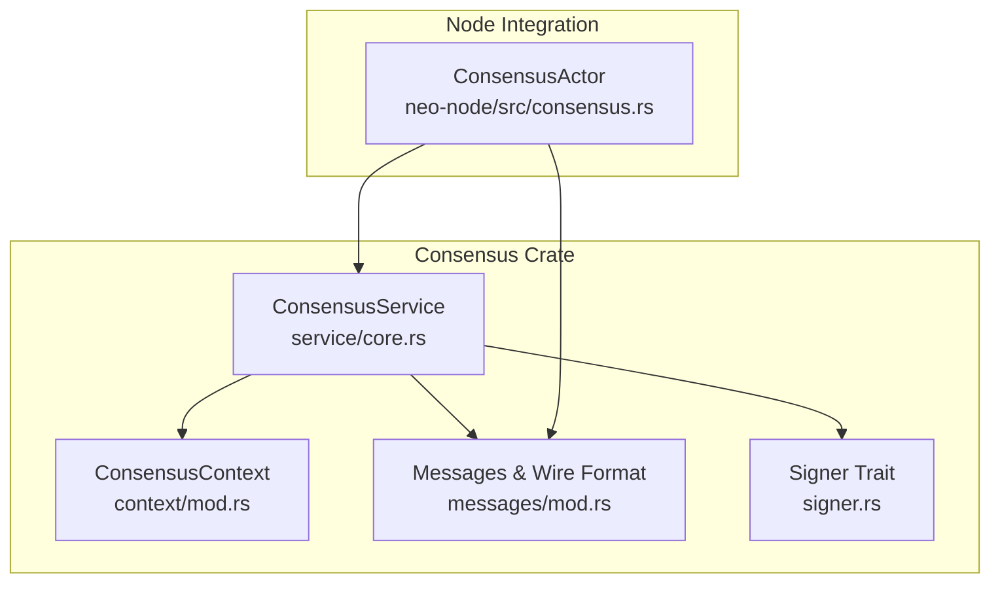
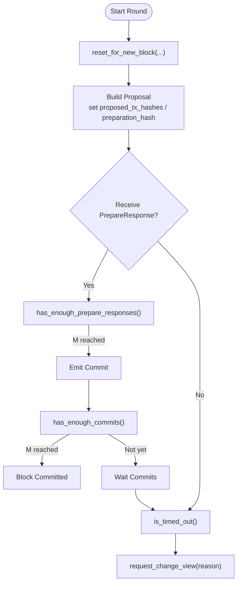
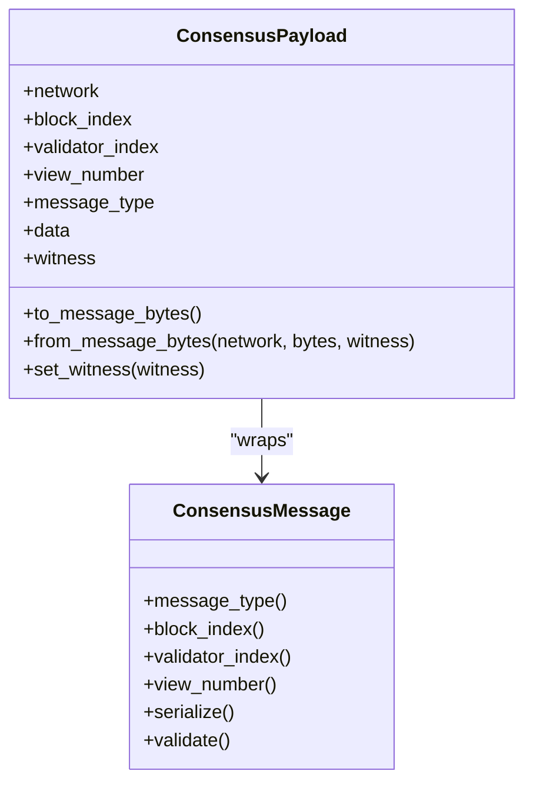
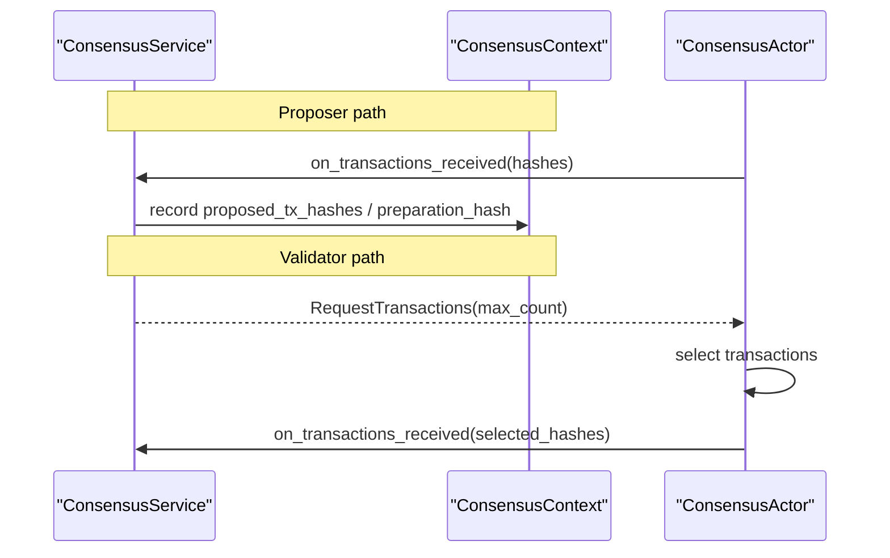
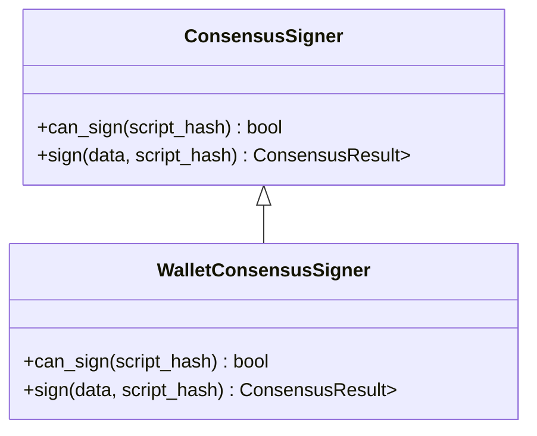
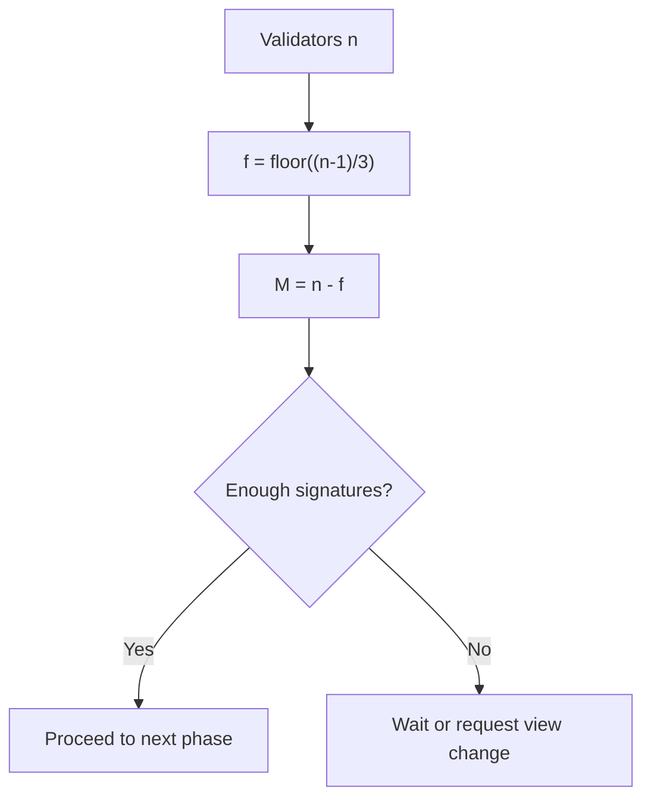
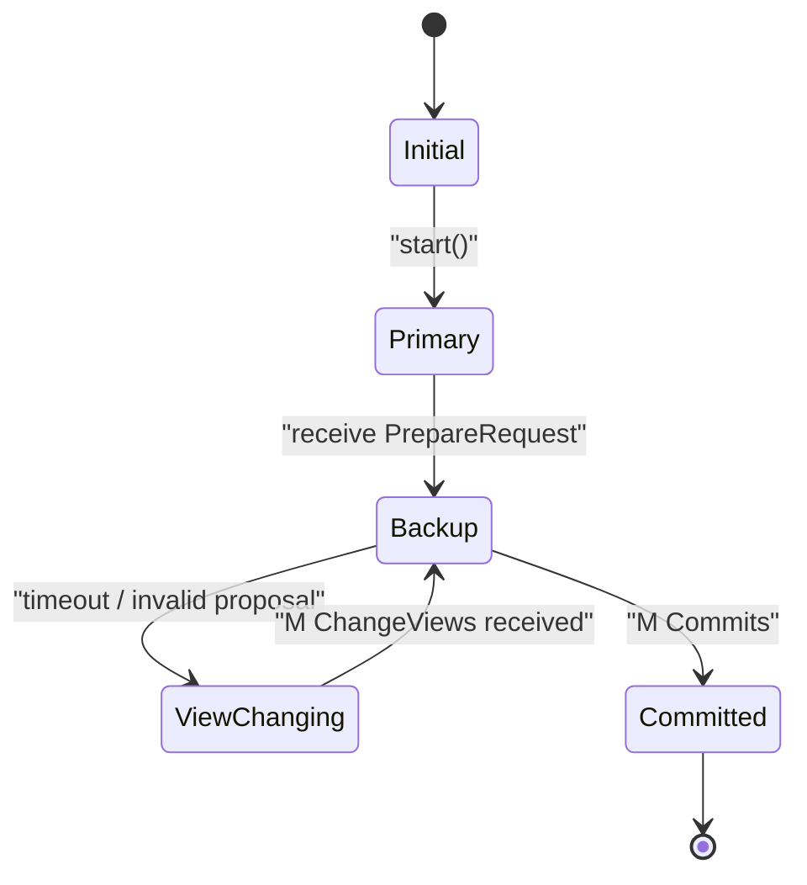
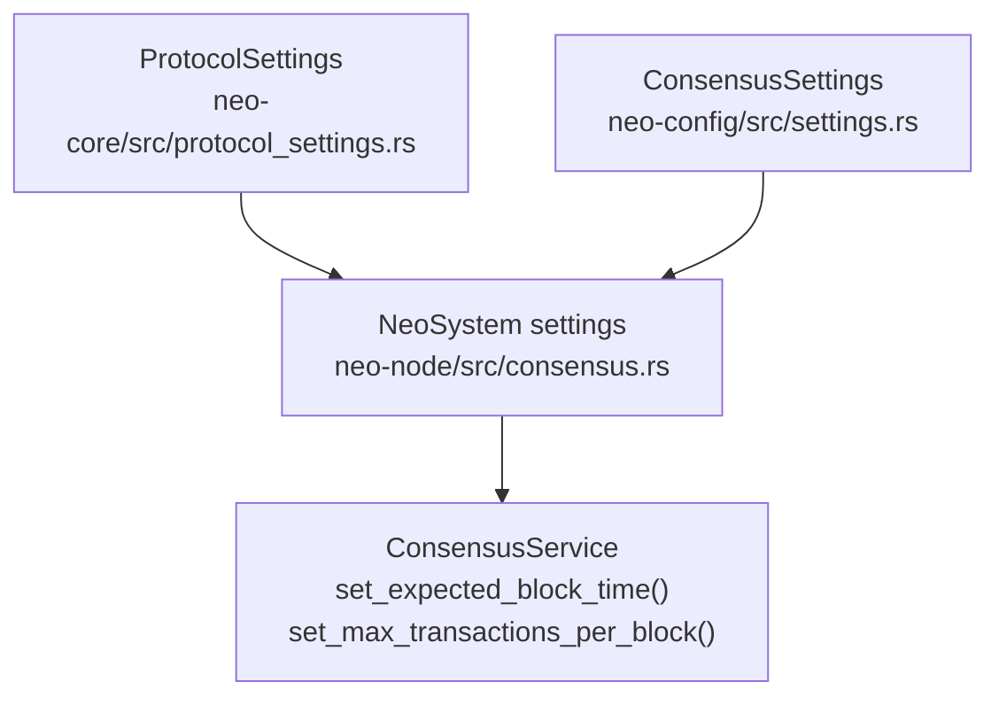
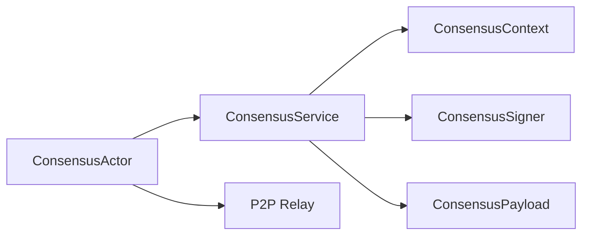

# Consensus Mechanism Extensions

<cite>
**Referenced Files in This Document**
- [lib.rs](file://neo-consensus/src/lib.rs)
- [context/mod.rs](file://neo-consensus/src/context/mod.rs)
- [messages/mod.rs](file://neo-consensus/src/messages/mod.rs)
- [service/core.rs](file://neo-consensus/src/service/core.rs)
- [service/accessors.rs](file://neo-consensus/src/service/accessors.rs)
- [signer.rs](file://neo-consensus/src/signer.rs)
- [consensus.rs](file://neo-node/src/consensus.rs)
- [settings.rs](file://neo-config/src/settings.rs)
- [protocol_settings.rs](file://neo-core/src/protocol_settings.rs)
</cite>

## Table of Contents
1. [Introduction](#introduction)
2. [Project Structure](#project-structure)
3. [Core Components](#core-components)
4. [Architecture Overview](#architecture-overview)
5. [Detailed Component Analysis](#detailed-component-analysis)
6. [Dependency Analysis](#dependency-analysis)
7. [Performance Considerations](#performance-considerations)
8. [Troubleshooting Guide](#troubleshooting-guide)
9. [Conclusion](#conclusion)
10. [Appendices](#appendices)

## Introduction
This document explains how to extend consensus beyond the standard dBFT implementation in this codebase. It covers implementing custom consensus algorithms, modifying voting rules, extending block proposal logic, and integrating custom validators. It also documents the consensus context, state management, message handling interfaces, view changes, parameter configuration, network partition handling, recovery procedures, and testing strategies for simulation and fork scenarios.

## Project Structure
The consensus subsystem is implemented primarily in the neo-consensus crate, with integration wiring in the node layer (neo-node). Key modules:
- Consensus service and lifecycle: service module
- State tracking: context module
- Message types and wire format: messages module
- Signing abstraction: signer module
- Node integration: neo-node consensus actor and wallet/HSM wiring



**Diagram sources**
- [service/core.rs:8-25](file://neo-consensus/src/service/core.rs#L8-L25)
- [context/mod.rs:111-191](file://neo-consensus/src/context/mod.rs#L111-L191)
- [messages/mod.rs:20-58](file://neo-consensus/src/messages/mod.rs#L20-L58)
- [signer.rs:41-51](file://neo-consensus/src/signer.rs#L41-L51)
- [consensus.rs:204-223](file://neo-node/src/consensus.rs#L204-L223)

**Section sources**
- [lib.rs:221-284](file://neo-consensus/src/lib.rs#L221-L284)
- [consensus.rs:204-223](file://neo-node/src/consensus.rs#L204-L223)

## Core Components
- ConsensusService: Main state machine that drives views, proposals, votes, commits, and view changes.
- ConsensusContext: Holds round state, validator set, signatures, timers, and persistence helpers.
- Messages: Typed payloads and on-wire serialization compatible with DBFTPlugin.
- Signer: Pluggable interface for signing consensus messages (wallet, HSM, or external signer).

Key extension points:
- Custom proposer: override transaction selection and block assembly via node integration.
- Custom voting rules: adjust thresholds and acceptance criteria in context methods.
- Custom validators: supply ValidatorInfo and implement ConsensusSigner.
- View change policy: tune timeouts and triggers using context timer helpers.

**Section sources**
- [service/core.rs:8-25](file://neo-consensus/src/service/core.rs#L8-L25)
- [context/mod.rs:111-191](file://neo-consensus/src/context/mod.rs#L111-L191)
- [messages/mod.rs:20-58](file://neo-consensus/src/messages/mod.rs#L20-L58)
- [signer.rs:41-51](file://neo-consensus/src/signer.rs#L41-L51)

## Architecture Overview
The node’s ConsensusActor orchestrates rounds, selects transactions, and bridges between P2P and the consensus service. The service manages the dBFT state machine; the context tracks state and provides helper functions for thresholds and timers.

```mermaid
sequenceDiagram
participant Actor as "ConsensusActor<br/>neo-node/src/consensus.rs"
participant Service as "ConsensusService<br/>service/core.rs"
participant Context as "ConsensusContext<br/>context/mod.rs"
participant Msg as "Messages<br/>messages/mod.rs"
Actor->>Service : start(block_index, timestamp, prev_hash, view_number)
Service->>Context : reset_for_new_block(...)
Service-->>Actor : Event : : RequestTransactions{max_count}
Actor->>Actor : propose_transactions(limit)
Actor->>Service : on_transactions_received(hashes)
Service->>Context : update proposal fields
Service-->>Actor : Event : : BroadcastMessage(PrepareRequest/Commit/etc.)
Actor->>Msg : build_extensible_payload()
Actor-->>Network : Relay ExtensiblePayload("dBFT")
```

**Diagram sources**
- [consensus.rs:364-479](file://neo-node/src/consensus.rs#L364-L479)
- [consensus.rs:609-679](file://neo-node/src/consensus.rs#L609-L679)
- [context/mod.rs:411-455](file://neo-consensus/src/context/mod.rs#L411-L455)
- [messages/mod.rs:82-132](file://neo-consensus/src/messages/mod.rs#L82-L132)

## Detailed Component Analysis

### Consensus Context and State Management
- Tracks current block index, view number, validator set, proposed block data, and per-validator signatures.
- Provides threshold helpers: f(), m(), has_enough_prepare_responses(), has_enough_commits(), has_enough_change_views().
- Timer utilities: get_timeout(), prepare_request_timeout(), change_timer(), change_timer_for_view(), extend_timer_by_factor(), is_timed_out().
- Replay protection: seen_message_hashes LRU cache and recovery response deduplication.
- Persistence: save/load for crash recovery across restarts.



**Diagram sources**
- [context/mod.rs:411-455](file://neo-consensus/src/context/mod.rs#L411-L455)
- [context/mod.rs:303-382](file://neo-consensus/src/context/mod.rs#L303-L382)
- [context/mod.rs:514-617](file://neo-consensus/src/context/mod.rs#L514-L617)

**Section sources**
- [context/mod.rs:111-191](file://neo-consensus/src/context/mod.rs#L111-L191)
- [context/mod.rs:303-382](file://neo-consensus/src/context/mod.rs#L303-L382)
- [context/mod.rs:514-617](file://neo-consensus/src/context/mod.rs#L514-L617)
- [context/mod.rs:640-682](file://neo-consensus/src/context/mod.rs#L640-L682)
- [context/mod.rs:760-800](file://neo-consensus/src/context/mod.rs#L760-L800)

### Message Handling Interface
- ConsensusMessage trait defines common operations: type, block_index, validator_index, view_number, serialize, validate.
- ConsensusPayload wraps a typed message with metadata and supports DBFTPlugin-compatible wire format serialization/deserialization.
- Node builds an ExtensiblePayload category "dBFT" and relays it through the local node.



**Diagram sources**
- [messages/mod.rs:20-58](file://neo-consensus/src/messages/mod.rs#L20-L58)
- [messages/mod.rs:82-132](file://neo-consensus/src/messages/mod.rs#L82-L132)
- [consensus.rs:609-630](file://neo-node/src/consensus.rs#L609-L630)

**Section sources**
- [messages/mod.rs:20-58](file://neo-consensus/src/messages/mod.rs#L20-L58)
- [messages/mod.rs:82-132](file://neo-consensus/src/messages/mod.rs#L82-L132)
- [consensus.rs:609-630](file://neo-node/src/consensus.rs#L609-L630)

### Block Proposal Logic Extension
- Transaction selection occurs in the node layer before being submitted to the consensus service.
- The service exposes on_transactions_received(hashes) to accept proposed transactions from the proposer.
- Validators verify proposed transactions during PrepareResponse flow; missing or invalid transactions trigger view change reasons.



**Diagram sources**
- [consensus.rs:632-679](file://neo-node/src/consensus.rs#L632-L679)
- [consensus.rs:741-800](file://neo-node/src/consensus.rs#L741-L800)

**Section sources**
- [consensus.rs:632-679](file://neo-node/src/consensus.rs#L632-L679)
- [consensus.rs:741-800](file://neo-node/src/consensus.rs#L741-L800)

### Custom Validators and Signing
- Provide ValidatorInfo entries (index, public key, script hash) to the service.
- Implement ConsensusSigner to sign consensus payloads; the node wires a WalletConsensusSigner by default but you can plug in HSM or TEE-backed signers.
- Update validator set dynamically via update_validators if needed.



**Diagram sources**
- [signer.rs:41-51](file://neo-consensus/src/signer.rs#L41-L51)
- [consensus.rs:168-195](file://neo-node/src/consensus.rs#L168-L195)
- [service/accessors.rs:22-36](file://neo-consensus/src/service/accessors.rs#L22-L36)

**Section sources**
- [signer.rs:41-51](file://neo-consensus/src/signer.rs#L41-L51)
- [consensus.rs:168-195](file://neo-node/src/consensus.rs#L168-L195)
- [service/accessors.rs:22-36](file://neo-consensus/src/service/accessors.rs#L22-L36)

### Voting Rules and Thresholds
- Default dBFT uses M = n - f where f = floor((n-1)/3).
- Adjust thresholds by overriding checks in context helpers or by changing validator set size.
- Ensure PrepareResponse hashes align with the primary’s preparation_hash to count toward M.



**Diagram sources**
- [context/mod.rs:257-273](file://neo-consensus/src/context/mod.rs#L257-L273)
- [context/mod.rs:303-382](file://neo-consensus/src/context/mod.rs#L303-L382)

**Section sources**
- [context/mod.rs:257-273](file://neo-consensus/src/context/mod.rs#L257-L273)
- [context/mod.rs:303-382](file://neo-consensus/src/context/mod.rs#L303-L382)

### View Changes and Recovery
- View change triggers include timeout, invalid transactions/blocks, or explicit agreement.
- Context tracks last change view timestamps and counts failed validators to decide between recovery and view change.
- Recovery persists state before broadcasting Commit and supports loading persisted context at startup.



**Diagram sources**
- [context/mod.rs:37-51](file://neo-consensus/src/context/mod.rs#L37-L51)
- [context/mod.rs:719-758](file://neo-consensus/src/context/mod.rs#L719-L758)
- [consensus.rs:517-515](file://neo-node/src/consensus.rs#L517-L515)

**Section sources**
- [context/mod.rs:719-758](file://neo-consensus/src/context/mod.rs#L719-L758)
- [consensus.rs:517-515](file://neo-node/src/consensus.rs#L517-L515)

### Consensus Parameter Configuration
- Expected block time and max transactions per block are set on the service and derived from protocol settings.
- Node reads time_per_block and max_transactions_per_block from system settings and applies them when starting/resuming consensus.
- Additional consensus-related settings exist in config structures.



**Diagram sources**
- [protocol_settings.rs:314-346](file://neo-core/src/protocol_settings.rs#L314-L346)
- [consensus.rs:398-456](file://neo-node/src/consensus.rs#L398-L456)
- [settings.rs:121-138](file://neo-config/src/settings.rs#L121-L138)

**Section sources**
- [protocol_settings.rs:314-346](file://neo-core/src/protocol_settings.rs#L314-L346)
- [consensus.rs:398-456](file://neo-node/src/consensus.rs#L398-L456)
- [settings.rs:121-138](file://neo-config/src/settings.rs#L121-L138)

### Network Partition Handling
- Use view changes to recover from temporary partitions; ensure timers are correctly rescheduled.
- Persist recovery logs before broadcasting Commit to avoid losing progress across partitions.
- Track failed validators and use more-than-F committed-or-lost logic to choose recovery vs view change.

**Section sources**
- [context/mod.rs:719-758](file://neo-consensus/src/context/mod.rs#L719-L758)
- [consensus.rs:566-607](file://neo-node/src/consensus.rs#L566-L607)

### Testing Approaches for Custom Consensus
- Simulation environments:
  - Use ConsensusService::with_context to resume from persisted state for deterministic replay.
  - Inject custom ConsensusSigner implementations to simulate different validator behaviors.
  - Manipulate timers via change_timer/change_timer_for_view to simulate delays and partitions.
- Fork scenarios:
  - Create divergent proposals by altering transaction selection or proposing alternate blocks.
  - Validate that nodes reject mismatched preparation_hash and enforce M-thresholds.
  - Exercise view change paths by forcing timeouts or invalid proposals.

[No sources needed since this section provides general guidance]

## Dependency Analysis
- ConsensusService depends on ConsensusContext for state and thresholds, ConsensusSigner for authentication, and ConsensusPayload for messaging.
- Node integration depends on NeoSystem settings, mempool, and P2P relay to drive proposal and broadcast flows.



**Diagram sources**
- [service/core.rs:8-25](file://neo-consensus/src/service/core.rs#L8-L25)
- [context/mod.rs:111-191](file://neo-consensus/src/context/mod.rs#L111-L191)
- [messages/mod.rs:20-58](file://neo-consensus/src/messages/mod.rs#L20-L58)
- [consensus.rs:204-223](file://neo-node/src/consensus.rs#L204-L223)

**Section sources**
- [service/core.rs:8-25](file://neo-consensus/src/service/core.rs#L8-L25)
- [consensus.rs:204-223](file://neo-node/src/consensus.rs#L204-L223)

## Performance Considerations
- Tune expected_block_time and max_transactions_per_block to match network conditions and block size limits.
- Use extend_timer_by_factor to adapt timeouts during slow networks without compromising safety.
- Avoid excessive logging in hot paths; rely on structured tracing for diagnostics.
- Keep validator sets within MAX_VALIDATORS to bound message processing overhead.

[No sources needed since this section provides general guidance]

## Troubleshooting Guide
Common issues and remedies:
- No commit broadcast: ensure recovery state can be persisted before sending Commit; check disk/store availability.
- Stuck in view change: inspect timers and last_seen_messages; confirm enough ChangeView messages are collected.
- Invalid proposal: verify proposed transactions exist in mempool/ledger and pass policy checks; adjust selection logic.
- Signature failures: validate ConsensusSigner.can_sign and wallet lock status; ensure correct script hash mapping.

**Section sources**
- [consensus.rs:566-607](file://neo-node/src/consensus.rs#L566-L607)
- [consensus.rs:741-800](file://neo-node/src/consensus.rs#L741-L800)
- [context/mod.rs:719-758](file://neo-consensus/src/context/mod.rs#L719-L758)

## Conclusion
Extending consensus in this codebase centers on three pillars: pluggable signing, configurable proposal selection, and robust state management with clear extension points for thresholds and timers. By leveraging ConsensusService, ConsensusContext, and the node’s ConsensusActor, you can implement alternative fault tolerance mechanisms, integrate custom validators, and test complex scenarios including partitions and forks while maintaining safety and liveness guarantees.

[No sources needed since this section summarizes without analyzing specific files]

## Appendices

### Quick Reference: Key APIs and Paths
- Start/resume consensus: service/start, service/resume
- Set parameters: set_expected_block_time, set_max_transactions_per_block, set_prev_timestamp
- Submit proposal: on_transactions_received(hashes)
- View change: request_change_view(reason, now), on_timer_tick_with_reason(now, reason)
- Persistence: save_context(path), load(path, validators, my_index)
- Node wiring: ConsensusActor.start_round, propose_transactions, broadcast_consensus_message

**Section sources**
- [service/accessors.rs:22-36](file://neo-consensus/src/service/accessors.rs#L22-L36)
- [consensus.rs:364-479](file://neo-node/src/consensus.rs#L364-L479)
- [consensus.rs:548-607](file://neo-node/src/consensus.rs#L548-L607)