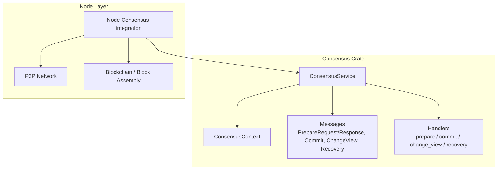
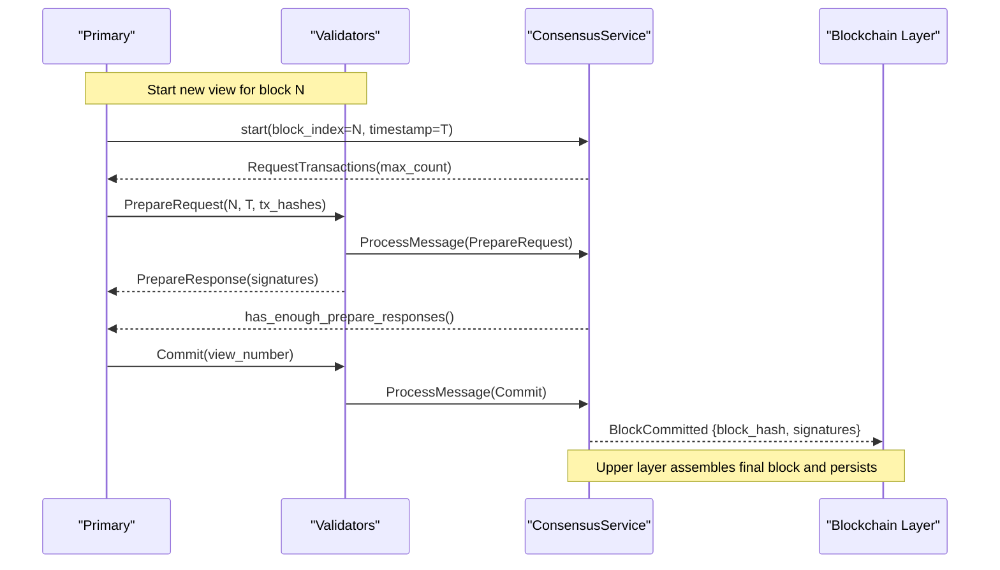
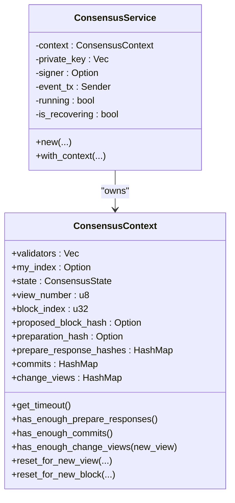
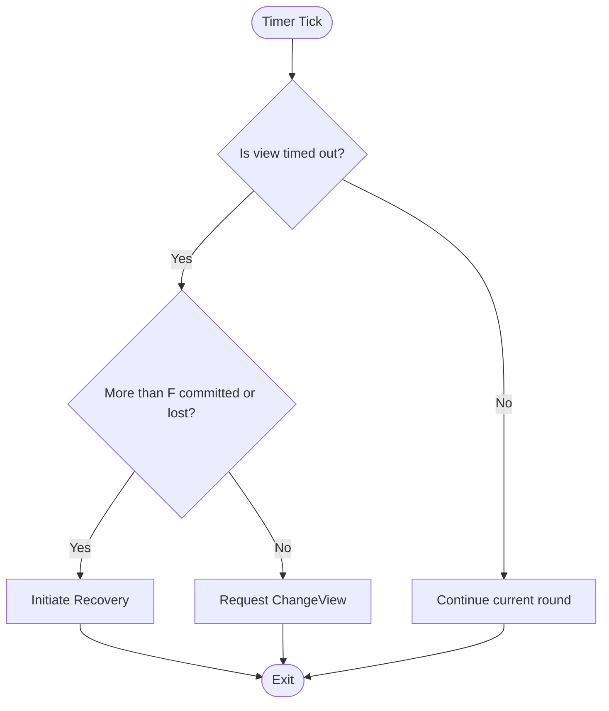
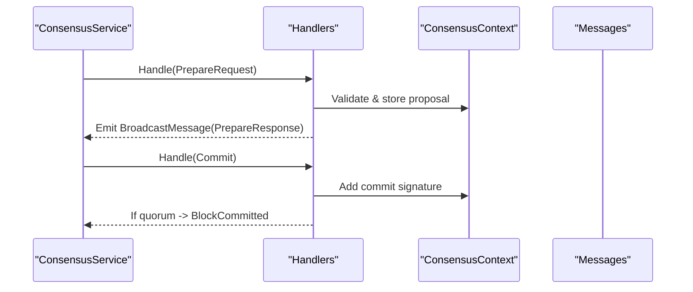
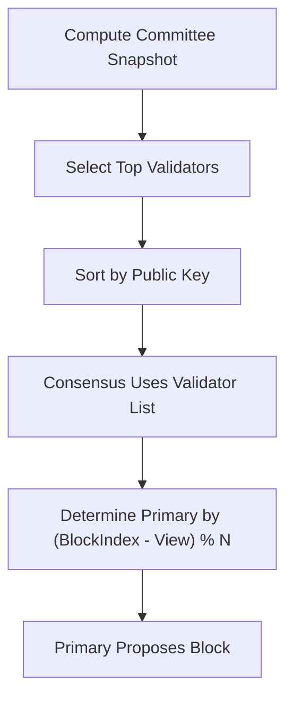
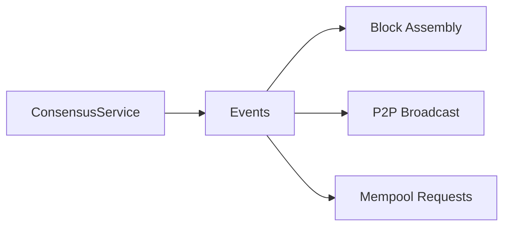
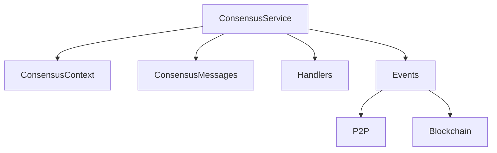

# Custom Consensus Algorithms

<cite>
**Referenced Files in This Document**
- [lib.rs](file://neo-consensus/src/lib.rs)
- [context/mod.rs](file://neo-consensus/src/context/mod.rs)
- [messages/mod.rs](file://neo-consensus/src/messages/mod.rs)
- [service/core.rs](file://neo-consensus/src/service/core.rs)
- [service/types.rs](file://neo-consensus/src/service/types.rs)
- [service/handlers/prepare.rs](file://neo-consensus/src/service/handlers/prepare.rs)
- [service/handlers/commit.rs](file://neo-consensus/src/service/handlers/commit.rs)
- [service/handlers/change_view.rs](file://neo-consensus/src/service/handlers/change_view.rs)
- [service/handlers/recovery.rs](file://neo-consensus/src/service/handlers/recovery.rs)
- [consensus.rs](file://neo-node/src/consensus.rs)
- [committee.rs](file://neo-core/src/smart_contract/native/neo_token/committee.rs)
</cite>

## Table of Contents
1. Introduction
2. Project Structure
3. Core Components
4. Architecture Overview
5. Detailed Component Analysis
6. Dependency Analysis
7. Performance Considerations
8. Troubleshooting Guide
9. Conclusion
10. Appendices

## Introduction
This document explains how to implement custom consensus algorithms in Neo-RS by extending the existing dBFT 2.0 implementation. It covers creating new consensus types, modifying state machines, implementing custom message handling, and integrating with the blockchain layer for validator selection and block proposal logic. It also addresses timing parameters, timeout handling, and network synchronization requirements necessary for alternative consensus mechanisms such as Proof-of-Stake variants, delegated voting systems, or hybrid approaches.

## Project Structure
The consensus subsystem is implemented in the neo-consensus crate and integrated into the node via neo-node. The core pieces are:
- Consensus service (state machine): orchestrates views, proposals, votes, commits, view changes, and recovery.
- Context: tracks round state, signatures, timers, and validator set.
- Messages: defines on-wire formats and envelopes for consensus protocol messages.
- Handlers: per-message-type processing logic.
- Node integration: wiring consensus events to P2P and block assembly.

**Diagram sources**
- [service/core.rs:8-25](file://neo-consensus/src/service/core.rs#L8-L25)
- [context/mod.rs:111-191](file://neo-consensus/src/context/mod.rs#L111-L191)
- [messages/mod.rs:20-58](file://neo-consensus/src/messages/mod.rs#L20-L58)
- [consensus.rs](file://neo-node/src/consensus.rs)

**Section sources**
- [lib.rs:221-284](file://neo-consensus/src/lib.rs#L221-L284)
- [service/core.rs:8-25](file://neo-consensus/src/service/core.rs#L8-L25)
- [messages/mod.rs:20-58](file://neo-consensus/src/messages/mod.rs#L20-L58)

## Core Components
- ConsensusService: main state machine that drives dBFT rounds, emits events, and processes messages.
- ConsensusContext: persistent and transient state for a round including validators, timers, signatures, and proposal data.
- Messages and Payloads: typed payloads and wire format for PrepareRequest, PrepareResponse, Commit, ChangeView, RecoveryRequest, RecoveryMessage.
- Handlers: modular processors for each message type that update context and emit events.
- Events and Commands: standardized interface between consensus and upper layers (block assembly, mempool, P2P).

Key extension points for custom consensus:
- Replace or extend message types and handlers to implement alternative protocols.
- Override validator selection and block proposal logic via node integration.
- Adjust timeouts and view-change thresholds to match new safety/liveness assumptions.
- Persist and recover custom state using the context persistence mechanism.

**Section sources**
- [service/core.rs:8-66](file://neo-consensus/src/service/core.rs#L8-L66)
- [context/mod.rs:111-191](file://neo-consensus/src/context/mod.rs#L111-L191)
- [messages/mod.rs:20-58](file://neo-consensus/src/messages/mod.rs#L20-L58)
- [service/types.rs:4-82](file://neo-consensus/src/service/types.rs#L4-L82)

## Architecture Overview
The consensus service coordinates a rotating primary among validators. In each view, the primary proposes a block; validators validate and sign PrepareResponses; once enough signatures are collected, the primary sends Commit; upon receiving enough commits, the block is finalized. View changes and recovery ensure liveness and robustness under faults.

**Diagram sources**
- [service/types.rs:25-55](file://neo-consensus/src/service/types.rs#L25-L55)
- [context/mod.rs:303-382](file://neo-consensus/src/context/mod.rs#L303-L382)
- [messages/mod.rs:82-150](file://neo-consensus/src/messages/mod.rs#L82-L150)

## Detailed Component Analysis

### Consensus Service and State Machine
The service encapsulates the dBFT state machine and exposes commands/events for integration. It holds the context, private key/signer, and an event channel. It transitions through Initial, Primary, Backup, ViewChanging, and Committed states based on messages and timers.

- Construction and lifecycle: creation, starting a round, stopping, and recovery-aware construction.
- Event-driven: emits BroadcastMessage, RequestTransactions, ViewChanged, BlockCommitted.
- Command-driven: accepts ProcessMessage, TimerTick, TransactionsReceived, Stop.

**Diagram sources**
- [service/core.rs:8-66](file://neo-consensus/src/service/core.rs#L8-L66)
- [context/mod.rs:111-191](file://neo-consensus/src/context/mod.rs#L111-L191)
- [context/mod.rs:384-455](file://neo-consensus/src/context/mod.rs#L384-L455)

**Section sources**
- [service/core.rs:8-66](file://neo-consensus/src/service/core.rs#L8-L66)
- [service/types.rs:57-82](file://neo-consensus/src/service/types.rs#L57-L82)

### Context Management and Timers
The context maintains all round-specific state, including timers, signature collections, and validator metadata. It provides:
- Timeout computation and rescheduling with exponential backoff across views.
- Threshold checks for prepare responses, commits, and change views.
- Replay protection via LRU caches for seen message hashes.
- Persistence helpers to save/restore essential state across restarts.

**Diagram sources**
- [context/mod.rs:514-617](file://neo-consensus/src/context/mod.rs#L514-L617)
- [context/mod.rs:619-758](file://neo-consensus/src/context/mod.rs#L619-L758)

**Section sources**
- [context/mod.rs:514-617](file://neo-consensus/src/context/mod.rs#L514-L617)
- [context/mod.rs:619-758](file://neo-consensus/src/context/mod.rs#L619-L758)

### Message Handling and Protocol Flow
Each message type is handled by dedicated modules:
- Prepare: validates proposals, collects PrepareResponses, triggers Commit when quorum reached.
- Commit: aggregates commit signatures and finalizes blocks.
- ChangeView: manages view transitions and threshold checks.
- Recovery: handles recovery requests/responses to synchronize state after failures.

**Diagram sources**
- [messages/mod.rs:20-58](file://neo-consensus/src/messages/mod.rs#L20-L58)
- [messages/mod.rs:82-150](file://neo-consensus/src/messages/mod.rs#L82-L150)
- [service/handlers/prepare.rs](file://neo-consensus/src/service/handlers/prepare.rs)
- [service/handlers/commit.rs](file://neo-consensus/src/service/handlers/commit.rs)
- [service/handlers/change_view.rs](file://neo-consensus/src/service/handlers/change_view.rs)
- [service/handlers/recovery.rs](file://neo-consensus/src/service/handlers/recovery.rs)

**Section sources**
- [messages/mod.rs:20-58](file://neo-consensus/src/messages/mod.rs#L20-L58)
- [messages/mod.rs:82-150](file://neo-consensus/src/messages/mod.rs#L82-L150)

### Validator Selection and Block Proposal Logic
Validator selection is provided by the native committee logic, which computes the next block validators from stake-weighted votes. The consensus service uses this list to determine primaries and quorums.

- Committee snapshot and sorting produce the ordered validator set used by consensus.
- Primary index is derived deterministically from block index and view number.
- Block proposal logic is driven by RequestTransactions and assembled via BlockData emitted by consensus.

**Diagram sources**
- [committee.rs:298-317](file://neo-core/src/smart_contract/native/neo_token/committee.rs#L298-L317)
- [context/mod.rs:275-292](file://neo-consensus/src/context/mod.rs#L275-L292)
- [service/types.rs:4-23](file://neo-consensus/src/service/types.rs#L4-L23)

**Section sources**
- [committee.rs:298-317](file://neo-core/src/smart_contract/native/neo_token/committee.rs#L298-L317)
- [context/mod.rs:275-292](file://neo-consensus/src/context/mod.rs#L275-L292)
- [service/types.rs:4-23](file://neo-consensus/src/service/types.rs#L4-L23)

### Implementing Custom Consensus Types
To implement a custom consensus algorithm:
- Define new message types and payload structures compatible with the ConsensusMessage trait and wire format utilities.
- Extend ConsensusPayload or add new envelope fields if needed, ensuring serialization compatibility.
- Implement handlers for your custom messages in the handlers directory, updating context state and emitting events.
- Modify ConsensusState or introduce new states to model your protocol phases.
- Update timer logic and thresholds in the context to reflect new safety/liveness assumptions.

Examples:
- Proof-of-Stake variant: adjust validator selection to weight stakes and rotate primaries accordingly; keep dBFT message flow but alter who can propose and vote.
- Delegated voting system: allow delegates to sign on behalf of stakeholders; integrate delegate registry into validator set computation.
- Hybrid approach: combine dBFT with asynchronous parts (e.g., pipelined proposals) by adding new message types and handlers while preserving finality guarantees.

**Section sources**
- [messages/mod.rs:20-58](file://neo-consensus/src/messages/mod.rs#L20-L58)
- [messages/mod.rs:82-150](file://neo-consensus/src/messages/mod.rs#L82-L150)
- [service/handlers/prepare.rs](file://neo-consensus/src/service/handlers/prepare.rs)
- [service/handlers/commit.rs](file://neo-consensus/src/service/handlers/commit.rs)
- [service/handlers/change_view.rs](file://neo-consensus/src/service/handlers/change_view.rs)
- [service/handlers/recovery.rs](file://neo-consensus/src/service/handlers/recovery.rs)
- [context/mod.rs:37-51](file://neo-consensus/src/context/mod.rs#L37-L51)

### Integration Points with Blockchain Layer
- Block assembly: use BlockData emitted in BlockCommitted to construct the final block and persist it.
- Mempool interaction: handle RequestTransactions to fetch transactions for proposals.
- P2P networking: broadcast ConsensusPayload messages via the node’s P2P layer.
- RPC exposure: expose consensus diagnostics and controls via RPC endpoints.

**Diagram sources**
- [service/types.rs:25-55](file://neo-consensus/src/service/types.rs#L25-L55)
- [consensus.rs](file://neo-node/src/consensus.rs)

**Section sources**
- [service/types.rs:25-55](file://neo-consensus/src/service/types.rs#L25-L55)
- [consensus.rs](file://neo-node/src/consensus.rs)

## Dependency Analysis
The consensus module depends on:
- Context for state and thresholds.
- Messages for protocol payloads and wire formats.
- Handlers for per-message logic.
- Node integration for P2P and block assembly.

**Diagram sources**
- [service/core.rs:8-25](file://neo-consensus/src/service/core.rs#L8-L25)
- [context/mod.rs:111-191](file://neo-consensus/src/context/mod.rs#L111-L191)
- [messages/mod.rs:20-58](file://neo-consensus/src/messages/mod.rs#L20-L58)
- [service/types.rs:25-55](file://neo-consensus/src/service/types.rs#L25-L55)

**Section sources**
- [service/core.rs:8-25](file://neo-consensus/src/service/core.rs#L8-L25)
- [messages/mod.rs:20-58](file://neo-consensus/src/messages/mod.rs#L20-L58)
- [service/types.rs:25-55](file://neo-consensus/src/service/types.rs#L25-L55)

## Performance Considerations
- Use bounded LRU caches for seen message hashes to prevent memory exhaustion.
- Tune expected_block_time and view-change thresholds to balance latency and resilience.
- Minimize serialization overhead by reusing buffers where possible.
- Avoid unnecessary recomputation of validator sets; cache snapshots at epoch boundaries.
- Monitor timeout counters and adjust timers based on observed network conditions.

[No sources needed since this section provides general guidance]

## Troubleshooting Guide
Common issues and remedies:
- Duplicate messages: ensure replay protection via seen_message_hashes and reset per block.
- Stuck views: verify timer configuration and view-change thresholds; check for insufficient PrepareResponses or Commits.
- Validator misalignment: confirm validator list ordering and primary index calculation.
- Recovery loops: ensure recovery responses are deduplicated and only sent for selected validators.

**Section sources**
- [context/mod.rs:640-682](file://neo-consensus/src/context/mod.rs#L640-L682)
- [context/mod.rs:719-758](file://neo-consensus/src/context/mod.rs#L719-L758)

## Conclusion
Neo-RS provides a robust, extensible foundation for implementing custom consensus algorithms. By leveraging the ConsensusService, ConsensusContext, message framework, and handler architecture, you can design alternative mechanisms such as PoS variants, delegated voting, or hybrid protocols. Careful attention to validator selection, timing parameters, and recovery ensures safety and liveness under diverse network conditions.

[No sources needed since this section summarizes without analyzing specific files]

## Appendices

### Timing Parameters and Timeouts
- Base block time defaults and fallbacks.
- Exponential backoff for view timeouts.
- Timer extension strategies during active rounds.
- Resetting timers on view changes and new blocks.

**Section sources**
- [context/mod.rs:13-35](file://neo-consensus/src/context/mod.rs#L13-L35)
- [context/mod.rs:514-617](file://neo-consensus/src/context/mod.rs#L514-L617)

### Network Synchronization Requirements
- Ensure consistent validator lists across nodes.
- Maintain synchronized clocks within acceptable bounds for proposal timestamps.
- Use recovery mechanisms to resynchronize after partitions or failures.

**Section sources**
- [messages/mod.rs:82-150](file://neo-consensus/src/messages/mod.rs#L82-L150)
- [context/mod.rs:619-758](file://neo-consensus/src/context/mod.rs#L619-L758)