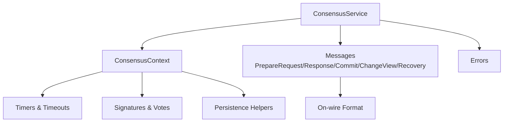
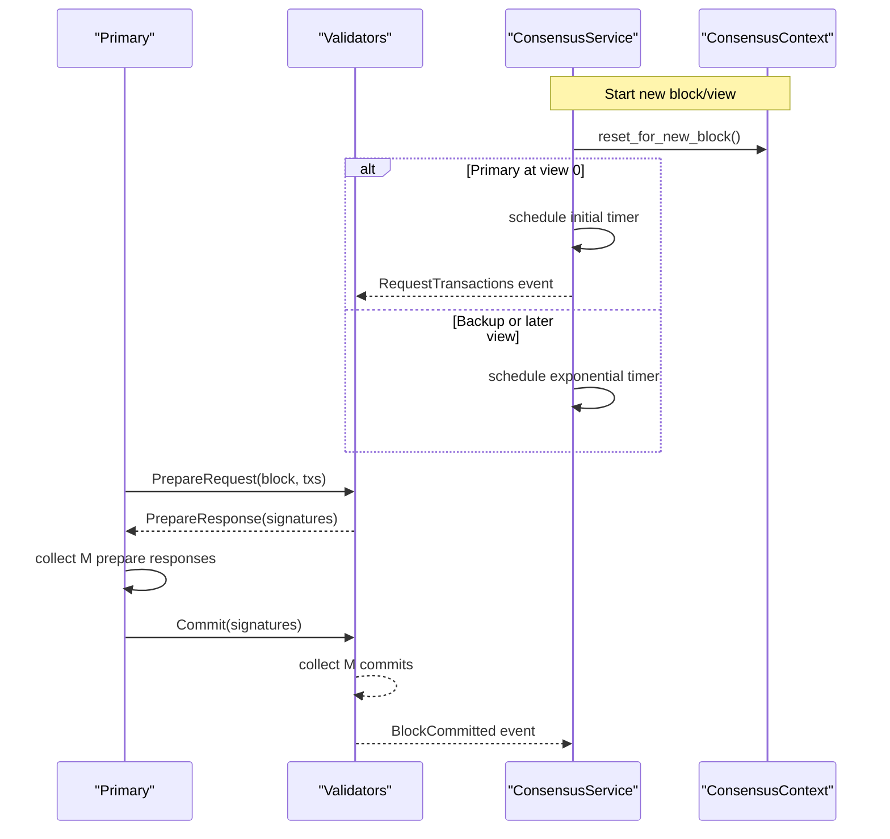
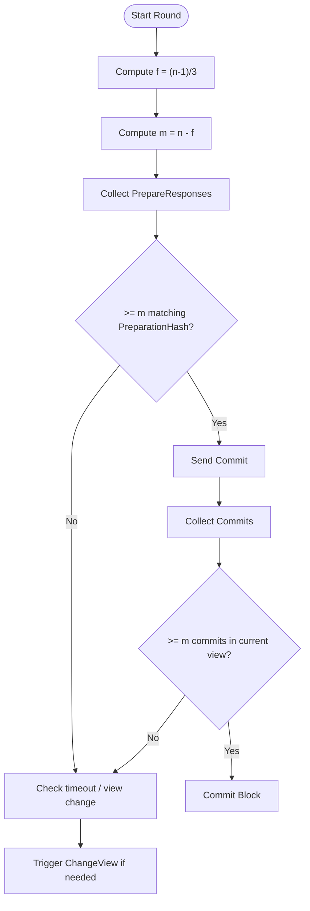
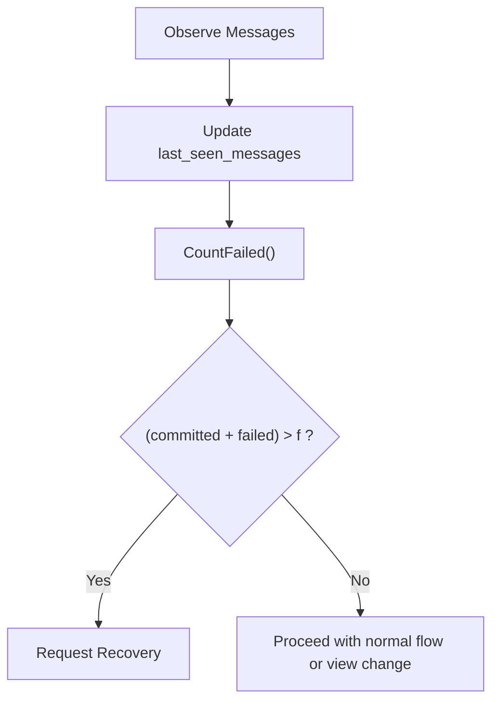
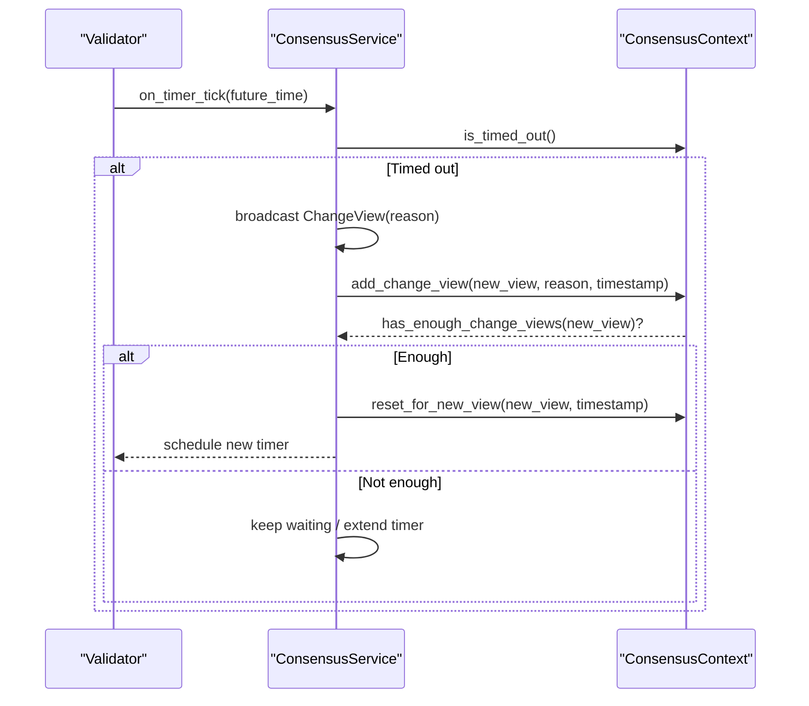
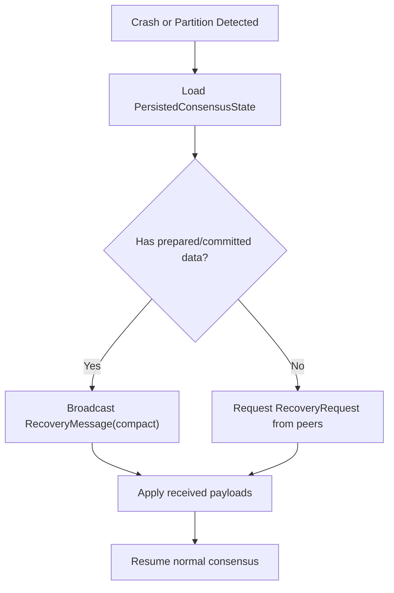
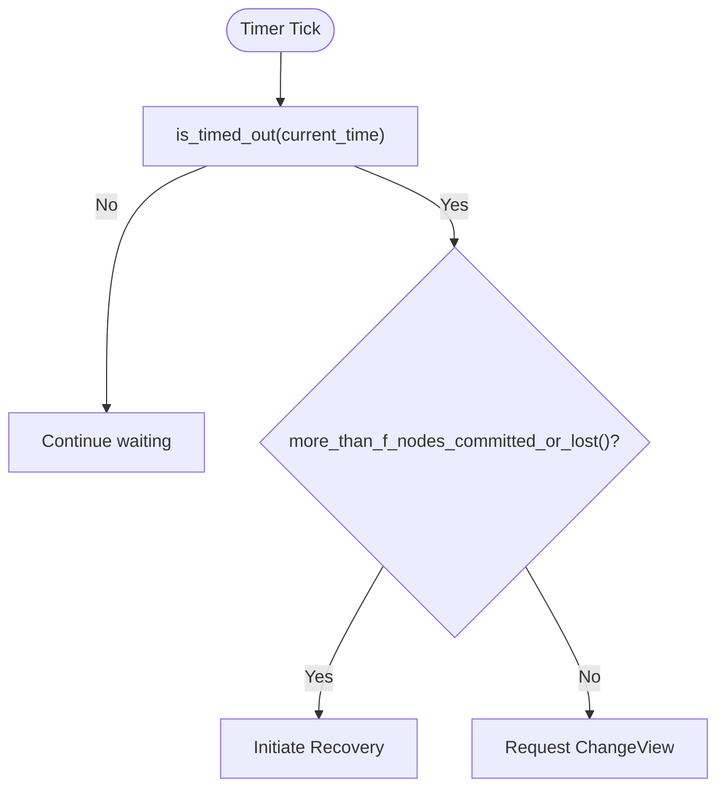
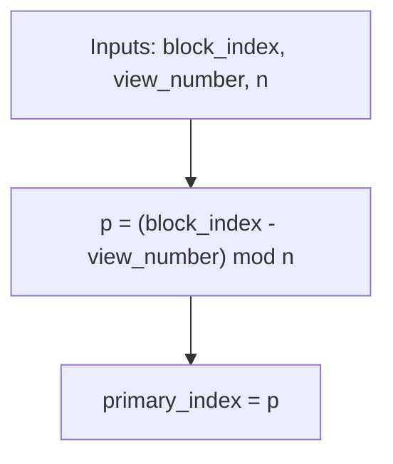
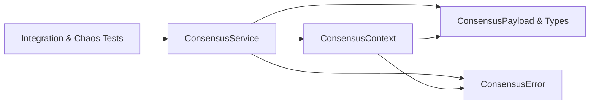

# Fault Tolerance Mechanisms

<cite>
**Referenced Files in This Document**
- [lib.rs](file://neo-consensus/src/lib.rs)
- [core.rs](file://neo-consensus/src/service/core.rs)
- [mod.rs (service)](file://neo-consensus/src/service/mod.rs)
- [mod.rs (context)](file://neo-consensus/src/context/mod.rs)
- [change_view_reason.rs](file://neo-consensus/src/change_view_reason.rs)
- [mod.rs (messages)](file://neo-consensus/src/messages/mod.rs)
- [error.rs](file://neo-consensus/src/error.rs)
- [consensus_integration_tests.rs](file://tests/tests/consensus_integration_tests.rs)
- [chaos_tests.rs](file://tests/tests/chaos_tests.rs)
</cite>

## Table of Contents
1. Introduction
2. Project Structure
3. Core Components
4. Architecture Overview
5. Detailed Component Analysis
6. Dependency Analysis
7. Performance Considerations
8. Troubleshooting Guide
9. Conclusion
10. Appendices

## Introduction
This document explains how to implement fault tolerance mechanisms for consensus extensions using the dBFT 2.0 implementation in this repository. It covers Byzantine fault handling, network partitions, node failures, view change protocols, recovery procedures, state synchronization, timeout handling, liveness guarantees, safety properties, adaptive timeouts, leader election, and testing strategies including chaos engineering, network simulation, and failure injection.

## Project Structure
The consensus subsystem is implemented as a crate with clear separation between service logic, context/state, messages, and error types:
- Service layer: main state machine and lifecycle management
- Context: round state, timers, signatures, and persistence helpers
- Messages: on-wire format and message envelopes
- Errors: typed errors for protocol violations and runtime issues
- Tests: integration and chaos tests for fault scenarios

**Diagram sources**
- [core.rs:8-25](file://neo-consensus/src/service/core.rs#L8-L25)
- [mod.rs (context):111-191](file://neo-consensus/src/context/mod.rs#L111-L191)
- [mod.rs (messages):41-58](file://neo-consensus/src/messages/mod.rs#L41-L58)
- [error.rs:31-173](file://neo-consensus/src/error.rs#L31-L173)

**Section sources**
- [lib.rs:221-248](file://neo-consensus/src/lib.rs#L221-L248)
- [mod.rs (service):1-16](file://neo-consensus/src/service/mod.rs#L1-L16)

## Core Components
- ConsensusService: orchestrates dBFT rounds, handles events, and exposes start/process_message interfaces.
- ConsensusContext: tracks per-round state (view, validators, votes), computes thresholds (f, m), manages timers, and persists essential state for crash recovery.
- Messages: define the dBFT message envelope and wire format used by P2P transport.
- ChangeViewReason: enumerates reasons for initiating view changes.
- Error types: structured errors for invalid proposals, signature failures, timeouts, and more.

Key responsibilities:
- Leader election via deterministic primary selection based on block index and view number.
- Adaptive timeouts that grow exponentially with view number to maintain liveness under faults.
- Safety checks to prevent equivocation and ensure commits bind to verified proposals.
- Recovery pathways using recovery messages and persisted state.

**Section sources**
- [core.rs:8-66](file://neo-consensus/src/service/core.rs#L8-L66)
- [mod.rs (context):111-191](file://neo-consensus/src/context/mod.rs#L111-L191)
- [mod.rs (messages):41-58](file://neo-consensus/src/messages/mod.rs#L41-L58)
- [change_view_reason.rs:5-23](file://neo-consensus/src/change_view_reason.rs#L5-L23)
- [error.rs:31-173](file://neo-consensus/src/error.rs#L31-L173)

## Architecture Overview
dBFT 2.0 proceeds in views with a rotating primary. Validators exchange PrepareRequest, PrepareResponse, Commit, and optionally ChangeView/Recovery messages. The service transitions states and triggers events when progress is made or faults are detected.

**Diagram sources**
- [lib.rs:63-98](file://neo-consensus/src/lib.rs#L63-L98)
- [mod.rs (context):384-455](file://neo-consensus/src/context/mod.rs#L384-L455)
- [mod.rs (messages):82-126](file://neo-consensus/src/messages/mod.rs#L82-L126)

**Section sources**
- [lib.rs:63-98](file://neo-consensus/src/lib.rs#L63-L98)

## Detailed Component Analysis

### Byzantine Fault Handling and Thresholds
- f = (n - 1) / 3; m = n - f; quorum sizes enforced for PrepareResponses and Commits.
- Safety: commit requires both proposed block hash and preparation hash to be present before signing.
- Replay protection: bounded LRU caches for seen message hashes and recovery response deduplication.

**Diagram sources**
- [mod.rs (context):263-273](file://neo-consensus/src/context/mod.rs#L263-L273)
- [mod.rs (context):303-382](file://neo-consensus/src/context/mod.rs#L303-L382)
- [mod.rs (context):640-682](file://neo-consensus/src/context/mod.rs#L640-L682)

**Section sources**
- [mod.rs (context):263-273](file://neo-consensus/src/context/mod.rs#L263-L273)
- [mod.rs (context):303-382](file://neo-consensus/src/context/mod.rs#L303-L382)
- [mod.rs (context):640-682](file://neo-consensus/src/context/mod.rs#L640-L682)

### Network Partitions and Node Failures
- Detect failed nodes by tracking last seen messages per validator and counting failures.
- If committed + failed > f, prefer recovery over view change to avoid splitting across views.
- View changing state prevents accepting payloads that could cause inconsistency during recovery.

**Diagram sources**
- [mod.rs (context):690-758](file://neo-consensus/src/context/mod.rs#L690-L758)

**Section sources**
- [mod.rs (context):690-758](file://neo-consensus/src/context/mod.rs#L690-L758)

### View Change Protocols
- Reasons include timeout, agreement, transaction/block policy or validity failures.
- Validators send ChangeView; when enough agree, switch to next primary deterministically.
- Timers extend adaptively to cope with transient faults.

**Diagram sources**
- [change_view_reason.rs:5-23](file://neo-consensus/src/change_view_reason.rs#L5-L23)
- [mod.rs (context):372-382](file://neo-consensus/src/context/mod.rs#L372-L382)
- [mod.rs (context):514-562](file://neo-consensus/src/context/mod.rs#L514-L562)
- [mod.rs (context):613-617](file://neo-consensus/src/context/mod.rs#L613-L617)

**Section sources**
- [change_view_reason.rs:5-23](file://neo-consensus/src/change_view_reason.rs#L5-L23)
- [mod.rs (context):372-382](file://neo-consensus/src/context/mod.rs#L372-L382)
- [mod.rs (context):514-562](file://neo-consensus/src/context/mod.rs#L514-L562)
- [mod.rs (context):613-617](file://neo-consensus/src/context/mod.rs#L613-L617)

### Recovery Procedures and State Synchronization
- Persist essential consensus state (block index, view, proposal hashes, signatures, invocations).
- Use atomic write-and-rename to avoid corruption.
- Recovery messages carry compact payloads to resynchronize peers after crashes or partitions.

**Diagram sources**
- [mod.rs (context):64-109](file://neo-consensus/src/context/mod.rs#L64-L109)
- [mod.rs (context):760-800](file://neo-consensus/src/context/mod.rs#L760-L800)
- [mod.rs (messages):13-16](file://neo-consensus/src/messages/mod.rs#L13-L16)

**Section sources**
- [mod.rs (context):64-109](file://neo-consensus/src/context/mod.rs#L64-L109)
- [mod.rs (context):760-800](file://neo-consensus/src/context/mod.rs#L760-L800)
- [mod.rs (messages):13-16](file://neo-consensus/src/messages/mod.rs#L13-L16)

### Timeout Handling and Adaptive Timers
- Base timeout uses expected block time; view 0 primary starts with one block interval, other cases use exponential backoff.
- Timers can be extended by factors to accommodate slow networks without shortening deadlines.
- Timed-out views trigger view change unless sufficient commits exist or too many nodes are lost.

**Diagram sources**
- [mod.rs (context):514-562](file://neo-consensus/src/context/mod.rs#L514-L562)
- [mod.rs (context):595-617](file://neo-consensus/src/context/mod.rs#L595-L617)
- [mod.rs (context):719-758](file://neo-consensus/src/context/mod.rs#L719-L758)

**Section sources**
- [mod.rs (context):514-562](file://neo-consensus/src/context/mod.rs#L514-L562)
- [mod.rs (context):595-617](file://neo-consensus/src/context/mod.rs#L595-L617)
- [mod.rs (context):719-758](file://neo-consensus/src/context/mod.rs#L719-L758)

### Leader Election Algorithm
- Deterministic primary selection: primary_index = (block_index - view_number) mod n.
- Ensures rotating leadership and predictable behavior across nodes.

**Diagram sources**
- [mod.rs (context):275-286](file://neo-consensus/src/context/mod.rs#L275-L286)

**Section sources**
- [mod.rs (context):275-286](file://neo-consensus/src/context/mod.rs#L275-L286)

### Safety Properties During Fault Scenarios
- Safety: no two honest nodes commit different blocks at same height.
- Liveness: under synchrony and < 1/3 faulty nodes, blocks are eventually committed.
- Accountability: all actions signed and auditable.

These properties are enforced by quorum checks, verification gates, and strict view/message validation.

**Section sources**
- [lib.rs:211-215](file://neo-consensus/src/lib.rs#L211-L215)

## Dependency Analysis
The consensus service depends on context for state and thresholds, messages for transport, and errors for robust failure reporting. Tests validate behavior under faults and partitions.

**Diagram sources**
- [core.rs:8-25](file://neo-consensus/src/service/core.rs#L8-L25)
- [mod.rs (context):111-191](file://neo-consensus/src/context/mod.rs#L111-L191)
- [mod.rs (messages):41-58](file://neo-consensus/src/messages/mod.rs#L41-L58)
- [error.rs:31-173](file://neo-consensus/src/error.rs#L31-L173)
- [consensus_integration_tests.rs:1-50](file://tests/tests/consensus_integration_tests.rs#L1-L50)
- [chaos_tests.rs:1-32](file://tests/tests/chaos_tests.rs#L1-L32)

**Section sources**
- [core.rs:8-25](file://neo-consensus/src/service/core.rs#L8-L25)
- [mod.rs (context):111-191](file://neo-consensus/src/context/mod.rs#L111-L191)
- [mod.rs (messages):41-58](file://neo-consensus/src/messages/mod.rs#L41-L58)
- [error.rs:31-173](file://neo-consensus/src/error.rs#L31-L173)
- [consensus_integration_tests.rs:1-50](file://tests/tests/consensus_integration_tests.rs#L1-L50)
- [chaos_tests.rs:1-32](file://tests/tests/chaos_tests.rs#L1-L32)

## Performance Considerations
- Use bounded LRU caches for seen message hashes and recovery responses to prevent memory exhaustion.
- Avoid unnecessary state mutations on invalid or off-view messages to reduce overhead.
- Prefer recovery over view change when committed + failed > f to minimize reordering costs.
- Tune expected_block_time and timer extension factors to balance latency and resilience.

[No sources needed since this section provides general guidance]

## Troubleshooting Guide
Common issues and diagnostics:
- Invalid view or wrong block: check message metadata and ensure correct start parameters.
- Signature verification failures: verify keys and witness generation paths.
- Timeout loops: inspect timer configuration and network conditions; consider extending timers.
- Insufficient signatures: validate quorum sizes and validator set correctness.
- Persistence errors: ensure atomic writes succeed and storage is healthy.

Use typed errors to pinpoint failures and logs to trace state transitions.

**Section sources**
- [error.rs:31-173](file://neo-consensus/src/error.rs#L31-L173)

## Conclusion
The dBFT 2.0 implementation provides robust fault tolerance through deterministic leader election, adaptive timeouts, strict quorum enforcement, and recovery mechanisms. By following the patterns documented here—handling Byzantine faults, managing partitions, implementing view changes, and ensuring safety and liveness—you can build reliable consensus extensions. Testing with integration and chaos scenarios helps validate resilience under realistic failures.

[No sources needed since this section summarizes without analyzing specific files]

## Appendices

### Testing Strategies for Fault Tolerance
- Integration tests: exercise full consensus flows, view changes, and recovery messages.
- Chaos tests: simulate timeouts, partitions, and concurrent state modifications to validate recovery.
- Failure injection: drop or delay messages, corrupt state roots, and verify detection and recovery.

Examples in this repository demonstrate:
- Timeout-triggered view changes and multi-timeout behavior.
- Recovery message creation and serialization.
- State trie recovery and root mismatch detection.
- Concurrent state modification stress.

**Section sources**
- [consensus_integration_tests.rs:248-301](file://tests/tests/consensus_integration_tests.rs#L248-L301)
- [consensus_integration_tests.rs:359-409](file://tests/tests/consensus_integration_tests.rs#L359-L409)
- [chaos_tests.rs:38-79](file://tests/tests/chaos_tests.rs#L38-L79)
- [chaos_tests.rs:85-166](file://tests/tests/chaos_tests.rs#L85-L166)
- [chaos_tests.rs:172-234](file://tests/tests/chaos_tests.rs#L172-L234)