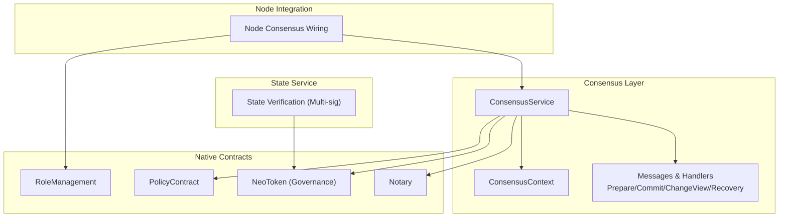
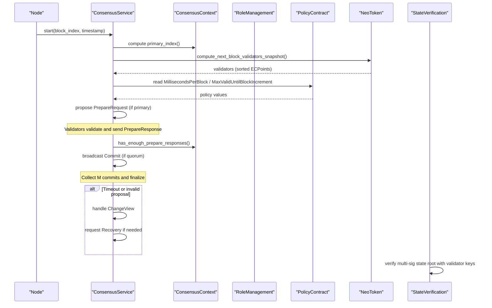
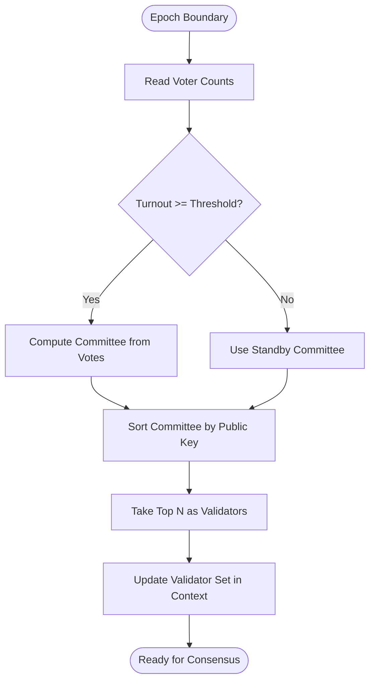
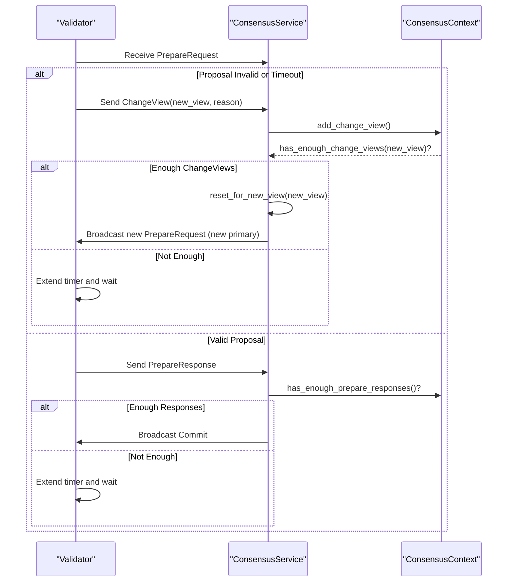
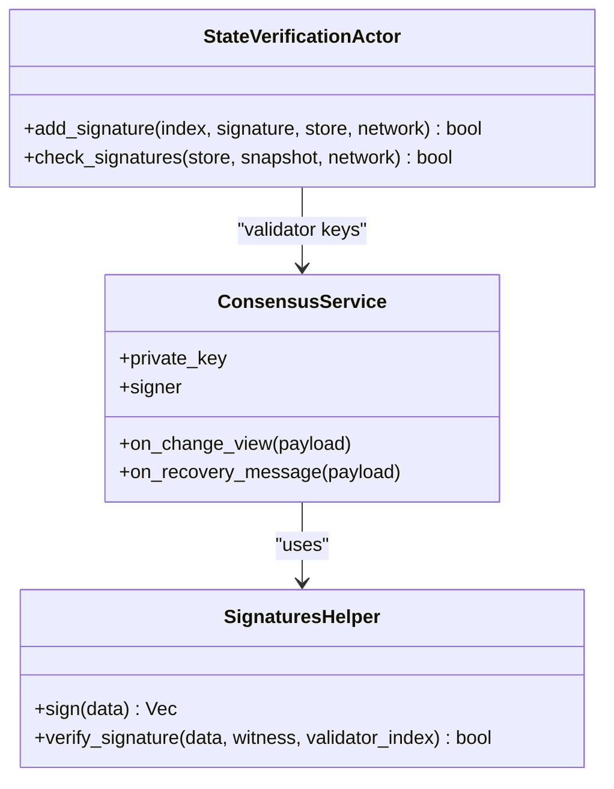
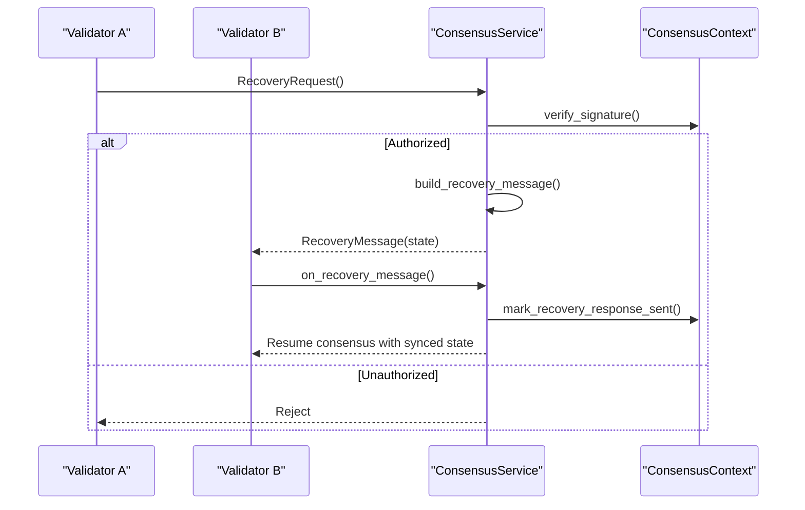
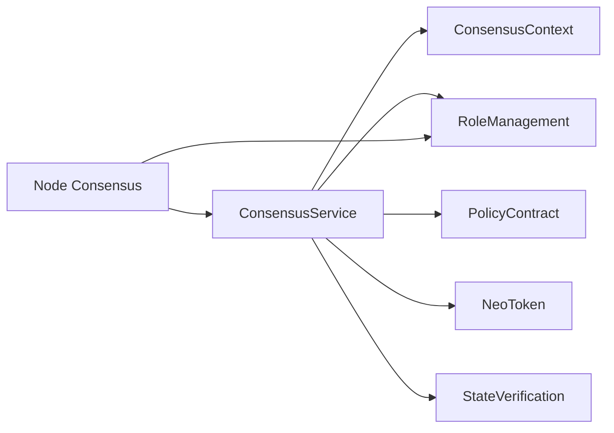

# Validator Management

<cite>
**Referenced Files in This Document**
- [lib.rs](file://neo-consensus/src/lib.rs)
- [core.rs](file://neo-consensus/src/service/core.rs)
- [mod.rs (context)](file://neo-consensus/src/context/mod.rs)
- [change_view.rs](file://neo-consensus/src/service/handlers/change_view.rs)
- [recovery.rs](file://neo-consensus/src/service/handlers/recovery.rs)
- [signatures.rs](file://neo-consensus/src/service/helpers/signatures.rs)
- [verification.rs](file://neo-core/src/state_service/verification.rs)
- [state_root.rs](file://neo-core/src/state_service/state_root.rs)
- [mod.rs (native registry)](file://neo-core/src/smart_contract/native/mod.rs)
- [role_management/mod.rs](file://neo-core/src/smart_contract/native/role_management/mod.rs)
- [policy_contract/mod.rs](file://neo-core/src/smart_contract/native/policy_contract/mod.rs)
- [committee.rs](file://neo-core/src/smart_contract/native/neo_token/committee.rs)
- [native_impl.rs (neo token)](file://neo-core/src/smart_contract/native/neo_token/native_impl.rs)
- [consensus.rs (node)](file://neo-node/src/consensus.rs)
</cite>

## Table of Contents
1. Introduction
2. Project Structure
3. Core Components
4. Architecture Overview
5. Detailed Component Analysis
6. Dependency Analysis
7. Performance Considerations
8. Troubleshooting Guide
9. Conclusion
10. Appendices

## Introduction
This document explains validator management within the consensus extensions of the project, focusing on how validators are registered, rotated, and removed; how the validator set is maintained and dynamically updated; staking and voting mechanics that influence selection; penalty and recovery mechanisms; and how to implement custom selection algorithms, weight-based voting, and multi-signature validation schemes. It also covers key management, signature verification, identity authentication, performance monitoring, slashing conditions, and recovery procedures for compromised validators.

## Project Structure
The validator management system spans several crates:
- Consensus layer (dBFT 2.0): service, context, messages, handlers, and helpers
- Native contracts: role management, policy, NEO token governance (voting and committee computation), notary interactions
- Node integration: building validator sets from configuration/wallets and wiring signing keys
- State service: multi-signature verification for state roots using validator keys

**Diagram sources**
- [lib.rs:6-110](file://neo-consensus/src/lib.rs#L6-L110)
- [core.rs:8-25](file://neo-consensus/src/service/core.rs#L8-L25)
- [mod.rs (context):111-191](file://neo-consensus/src/context/mod.rs#L111-L191)
- [mod.rs (native registry):159-197](file://neo-core/src/smart_contract/native/mod.rs#L159-L197)
- [consensus.rs (node):310-341](file://neo-node/src/consensus.rs#L310-L341)

**Section sources**
- [lib.rs:6-110](file://neo-consensus/src/lib.rs#L6-L110)
- [core.rs:8-25](file://neo-consensus/src/service/core.rs#L8-L25)
- [mod.rs (native registry):159-197](file://neo-core/src/smart_contract/native/mod.rs#L159-L197)
- [consensus.rs (node):310-341](file://neo-node/src/consensus.rs#L310-L341)

## Core Components
- ConsensusService: dBFT 2.0 state machine orchestrating block proposal, validation, commit, view changes, and recovery.
- ConsensusContext: Tracks view number, validator set, signatures, timers, and message deduplication.
- RoleManagement: Stores designated roles (e.g., oracles, notaries) with committee authorization and epoch-scoped designations.
- PolicyContract: Enforces protocol-level limits such as milliseconds per block, max valid-until increments, and other tunables.
- NeoToken Governance: Computes committee members and next block validators based on votes and turnout thresholds; distributes rewards.
- Node Integration: Builds validator infos from configured public keys and wires private keys or external signers into the consensus service.
- State Verification: Multi-signature verification over state roots using validator keys and required quorum.

Key responsibilities:
- Registration: Derived from native governance and role management outputs (validator list, committee).
- Rotation: Deterministic primary rotation by block index and view; dynamic updates via governance and policy.
- Removal: Committee recompute and validator set refresh at epoch boundaries or via governance actions.
- Staking/Voting: NEO token vote accumulation influences committee composition and thus validator selection.
- Penalties/Slashing: Not directly implemented here; can be integrated via policy and native contract rules.
- Recovery: View change and recovery message flows to resynchronize when nodes fail or diverge.

**Section sources**
- [core.rs:8-25](file://neo-consensus/src/service/core.rs#L8-L25)
- [mod.rs (context):111-191](file://neo-consensus/src/context/mod.rs#L111-L191)
- [role_management/mod.rs:81-194](file://neo-core/src/smart_contract/native/role_management/mod.rs#L81-L194)
- [policy_contract/mod.rs:124-211](file://neo-core/src/smart_contract/native/policy_contract/mod.rs#L124-L211)
- [committee.rs:159-317](file://neo-core/src/smart_contract/native/neo_token/committee.rs#L159-L317)
- [native_impl.rs (neo token):190-243](file://neo-core/src/smart_contract/native/neo_token/native_impl.rs#L190-L243)
- [consensus.rs (node):310-341](file://neo-node/src/consensus.rs#L310-L341)

## Architecture Overview
The consensus extension integrates with native governance and node configuration to maintain a live validator set and execute dBFT 2.0. The flow includes:
- Building validator infos from EC points and deriving script hashes
- Selecting a primary deterministically per view
- Handling Prepare/Commit phases with quorum checks
- Triggering ChangeView on timeouts or invalid proposals
- Recovering via RecoveryRequest/RecoveryMessage when needed

**Diagram sources**
- [lib.rs:6-110](file://neo-consensus/src/lib.rs#L6-L110)
- [core.rs:8-25](file://neo-consensus/src/service/core.rs#L8-L25)
- [mod.rs (context):275-286](file://neo-consensus/src/context/mod.rs#L275-L286)
- [committee.rs:298-317](file://neo-core/src/smart_contract/native/neo_token/committee.rs#L298-L317)
- [policy_contract/mod.rs:124-211](file://neo-core/src/smart_contract/native/policy_contract/mod.rs#L124-L211)
- [verification.rs:110-165](file://neo-core/src/state_service/verification.rs#L110-L165)

## Detailed Component Analysis

### Validator Set Management and Dynamic Updates
- Validator set derivation:
  - NeoToken computes committee members based on votes and turnout thresholds.
  - Next block validators are derived from the top N committee members sorted by public key.
- Dynamic updates:
  - At epoch boundaries or when governance triggers recomputation, the validator list is refreshed.
  - RoleManagement stores epoch-scoped designations for roles like oracles/notaries, enabling controlled upgrades.
- Quorum and safety:
  - Context tracks f (fault tolerance) and m (quorum) to ensure safety and liveness.

**Diagram sources**
- [committee.rs:159-317](file://neo-core/src/smart_contract/native/neo_token/committee.rs#L159-L317)
- [mod.rs (context):257-286](file://neo-consensus/src/context/mod.rs#L257-L286)

**Section sources**
- [committee.rs:159-317](file://neo-core/src/smart_contract/native/neo_token/committee.rs#L159-L317)
- [mod.rs (context):257-286](file://neo-consensus/src/context/mod.rs#L257-L286)

### Primary Rotation and View Changes
- Primary rotation:
  - Deterministic function uses block index and view number to select the primary among validators.
- View change:
  - On timeout or invalid proposal, validators send ChangeView messages.
  - When enough ChangeView requests accumulate (M), a new view starts with a different primary.

**Diagram sources**
- [mod.rs (context):275-286](file://neo-consensus/src/context/mod.rs#L275-L286)
- [change_view.rs:9-34](file://neo-consensus/src/service/handlers/change_view.rs#L9-L34)
- [mod.rs (context):372-382](file://neo-consensus/src/context/mod.rs#L372-L382)

**Section sources**
- [mod.rs (context):275-286](file://neo-consensus/src/context/mod.rs#L275-L286)
- [change_view.rs:9-34](file://neo-consensus/src/service/handlers/change_view.rs#L9-L34)
- [mod.rs (context):372-382](file://neo-consensus/src/context/mod.rs#L372-L382)

### Signature Verification and Identity Authentication
- Consensus message signing:
  - Uses secp256r1 ECDSA; supports external signer abstraction (wallet/HSM).
  - Validates witness presence and verifies signatures against validator indices.
- State root multi-signature:
  - Aggregates signatures from validators up to required quorum; verifies each signature against known validator keys.

**Diagram sources**
- [signatures.rs:36-73](file://neo-consensus/src/service/helpers/signatures.rs#L36-L73)
- [verification.rs:110-165](file://neo-core/src/state_service/verification.rs#L110-L165)
- [core.rs:8-25](file://neo-consensus/src/service/core.rs#L8-L25)

**Section sources**
- [signatures.rs:36-73](file://neo-consensus/src/service/helpers/signatures.rs#L36-L73)
- [verification.rs:110-165](file://neo-core/src/state_service/verification.rs#L110-L165)

### Recovery Procedures for Compromised or Failed Validators
- RecoveryRequest/RecoveryMessage:
  - Validators request state sync when they detect divergence or failure.
  - Recovery responses include current state and necessary context to resume consensus safely.
- Replay protection:
  - Message hash caching prevents duplicate processing across rounds.
  - Recovery response tracking avoids repeated responses for the same payload.

**Diagram sources**
- [recovery.rs:35-108](file://neo-consensus/src/service/handlers/recovery.rs#L35-L108)
- [mod.rs (context):640-682](file://neo-consensus/src/context/mod.rs#L640-L682)

**Section sources**
- [recovery.rs:35-108](file://neo-consensus/src/service/handlers/recovery.rs#L35-L108)
- [mod.rs (context):640-682](file://neo-consensus/src/context/mod.rs#L640-L682)

### Custom Validator Selection Algorithms, Weight-Based Voting, and Multi-Signature Schemes
- Custom selection:
  - Implement a function to compute committee members and next validators based on votes, stake weights, or external criteria.
  - Integrate with NeoToken governance logic to feed results into the consensus validator set.
- Weight-based voting:
  - Use NEO token votes to determine committee ranking; apply factors for validators vs non-validators where applicable.
- Multi-signature validation:
  - For state roots and critical operations, require M signatures from validators; aggregate and verify per quorum rules.

Implementation guidance:
- Extend NeoToken committee computation to incorporate custom weights or constraints.
- Ensure sorting and selection remain deterministic and auditable.
- Validate inputs and enforce policy limits via PolicyContract.

**Section sources**
- [committee.rs:159-317](file://neo-core/src/smart_contract/native/neo_token/committee.rs#L159-L317)
- [native_impl.rs (neo token):190-243](file://neo-core/src/smart_contract/native/neo_token/native_impl.rs#L190-L243)
- [verification.rs:110-165](file://neo-core/src/state_service/verification.rs#L110-L165)

### Validator Key Management, Signature Verification, and Identity Authentication
- Key management:
  - Derive script hashes from EC points; match wallet accounts to validator indices.
  - Support external signers via ConsensusSigner interface for HSM or secure wallets.
- Signature verification:
  - Verify witnesses on all consensus payloads; reject missing or invalid signatures.
  - For state roots, verify multi-signature against validator keys and required quorum.
- Identity authentication:
  - Ensure only authorized validators participate by validating script hashes against known validator set.

**Section sources**
- [consensus.rs (node):310-341](file://neo-node/src/consensus.rs#L310-L341)
- [signatures.rs:36-73](file://neo-consensus/src/service/helpers/signatures.rs#L36-L73)
- [verification.rs:110-165](file://neo-core/src/state_service/verification.rs#L110-L165)

### Performance Monitoring, Slashing Conditions, and Recovery Procedures
- Performance monitoring:
  - Track failed validators via last seen messages; adjust timers and trigger view changes accordingly.
  - Monitor quorum metrics (prepare responses, commits) to detect stalls.
- Slashing conditions:
  - Not directly implemented in this codebase; can be enforced via policy and native contracts (e.g., blocking accounts, fee penalties).
- Recovery procedures:
  - Use RecoveryRequest/RecoveryMessage to synchronize state after failures or compromises.
  - Maintain replay protection and bounded caches to prevent resource exhaustion.

**Section sources**
- [mod.rs (context):690-736](file://neo-consensus/src/context/mod.rs#L690-L736)
- [policy_contract/mod.rs:124-211](file://neo-core/src/smart_contract/native/policy_contract/mod.rs#L124-L211)
- [recovery.rs:35-108](file://neo-consensus/src/service/handlers/recovery.rs#L35-L108)

## Dependency Analysis
The validator management system depends on:
- Consensus service for state machine and message handling
- Native contracts for governance, policy, and role management
- Node integration for wiring validator sets and keys
- State verification for multi-signature validation

**Diagram sources**
- [lib.rs:6-110](file://neo-consensus/src/lib.rs#L6-L110)
- [core.rs:8-25](file://neo-consensus/src/service/core.rs#L8-L25)
- [mod.rs (native registry):159-197](file://neo-core/src/smart_contract/native/mod.rs#L159-L197)
- [consensus.rs (node):310-341](file://neo-node/src/consensus.rs#L310-L341)

**Section sources**
- [lib.rs:6-110](file://neo-consensus/src/lib.rs#L6-L110)
- [core.rs:8-25](file://neo-consensus/src/service/core.rs#L8-L25)
- [mod.rs (native registry):159-197](file://neo-core/src/smart_contract/native/mod.rs#L159-L197)
- [consensus.rs (node):310-341](file://neo-node/src/consensus.rs#L310-L341)

## Performance Considerations
- Timer management:
  - Exponential backoff for view changes; extend timers based on progress to avoid unnecessary view changes.
- Message caching:
  - LRU cache for seen message hashes prevents replay attacks while bounding memory usage.
- Quorum checks:
  - Efficient counting of prepare responses and commits ensures timely progression.
- Validator set size:
  - Keep validator count within MAX_VALIDATORS to maintain performance and security.

[No sources needed since this section provides general guidance]

## Troubleshooting Guide
Common issues and resolutions:
- Missing or invalid witnesses:
  - Ensure validators attach proper signatures to consensus payloads; check script hash derivation and key availability.
- Insufficient quorum:
  - Investigate validator connectivity and performance; consider extending timers or triggering view changes.
- Recovery mismatches:
  - Validate block index and payload hashes; ensure recovery responses are authorized and not replayed.
- Policy violations:
  - Check MillisecondsPerBlock and MaxValidUntilBlockIncrement settings; ensure committee authorization for changes.

**Section sources**
- [change_view.rs:9-34](file://neo-consensus/src/service/handlers/change_view.rs#L9-L34)
- [recovery.rs:35-108](file://neo-consensus/src/service/handlers/recovery.rs#L35-L108)
- [policy_contract/mod.rs:124-211](file://neo-core/src/smart_contract/native/policy_contract/mod.rs#L124-L211)

## Conclusion
Validator management in this system combines dBFT 2.0 consensus with native governance and policy controls to ensure robust, dynamic, and secure operation. By leveraging NEO token voting, role management, and policy enforcement, the system maintains a resilient validator set capable of rotating primaries, recovering from failures, and adapting to governance-driven changes. Implementers can extend selection algorithms, integrate custom weights, and enforce multi-signature requirements to meet diverse operational needs.

[No sources needed since this section summarizes without analyzing specific files]

## Appendices
- Example governance models:
  - Stake-weighted voting via NEO token balances and votes
  - Committee-based selection with standby fallback
  - Role-based designation for specialized validators (oracles, notaries)
- Implementation references:
  - NeoToken committee computation and validator derivation
  - RoleManagement designation storage and events
  - PolicyContract tunables for timing and validity windows

[No sources needed since this section provides general guidance]