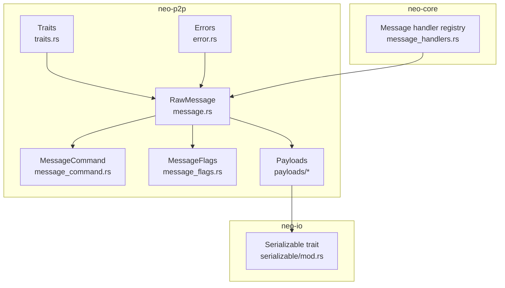
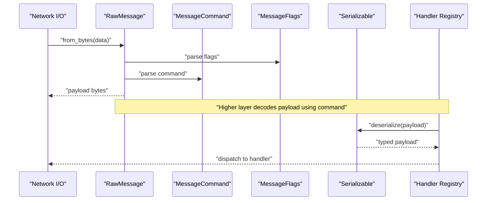
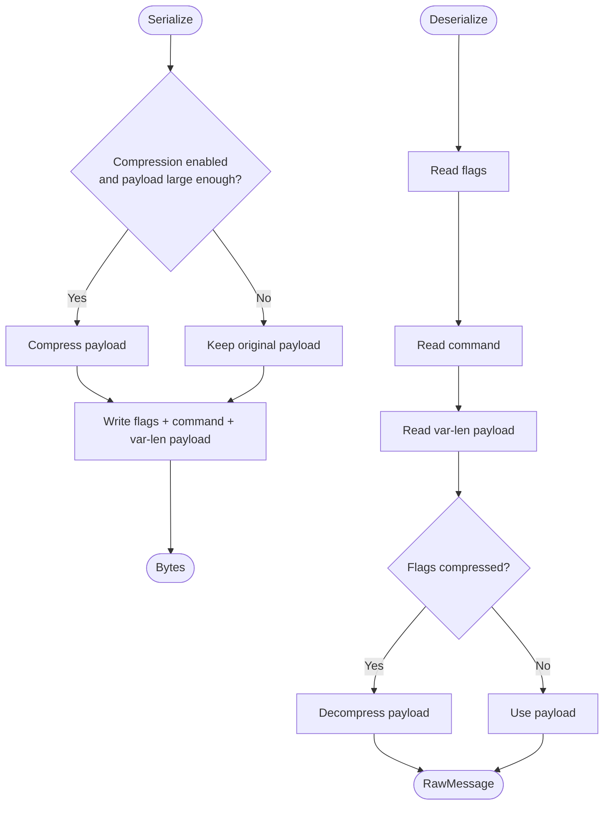
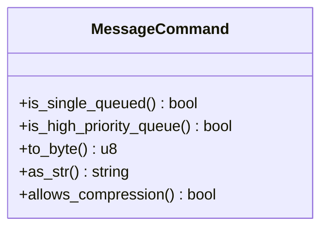
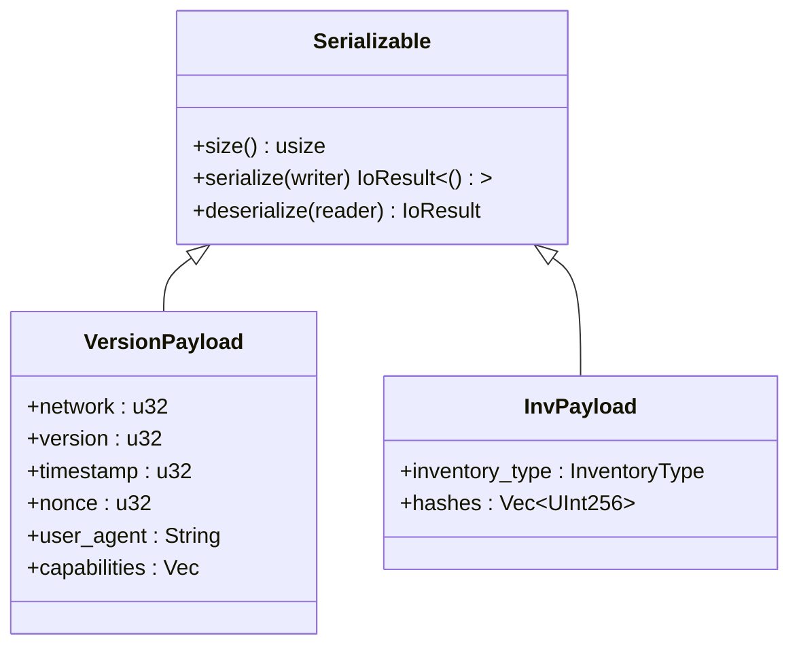
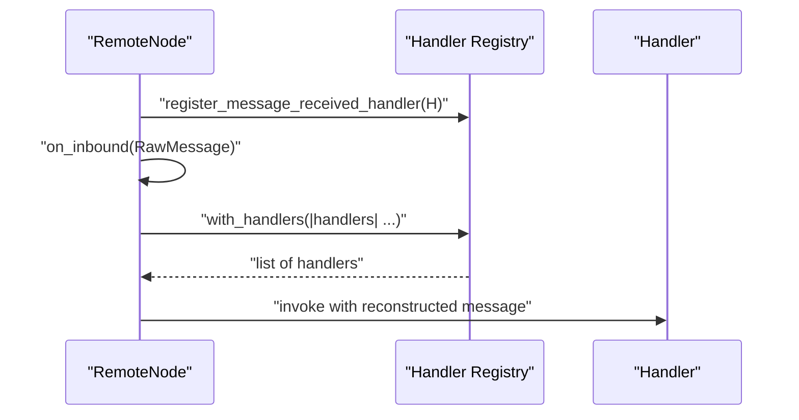
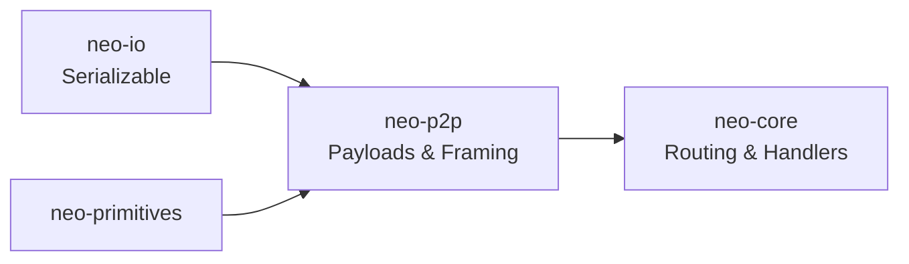

# Custom P2P Messages

<cite>
**Referenced Files in This Document**
- [neo-p2p/src/lib.rs](file://neo-p2p/src/lib.rs)
- [neo-p2p/src/message.rs](file://neo-p2p/src/message.rs)
- [neo-p2p/src/message_command.rs](file://neo-p2p/src/message_command.rs)
- [neo-p2p/src/message_flags.rs](file://neo-p2p/src/message_flags.rs)
- [neo-p2p/src/error.rs](file://neo-p2p/src/error.rs)
- [neo-p2p/src/traits.rs](file://neo-p2p/src/traits.rs)
- [neo-p2p/src/payloads/mod.rs](file://neo-p2p/src/payloads/mod.rs)
- [neo-p2p/src/payloads/version_payload.rs](file://neo-p2p/src/payloads/version_payload.rs)
- [neo-p2p/src/payloads/inv_payload.rs](file://neo-p2p/src/payloads/inv_payload.rs)
- [neo-io/src/serializable/mod.rs](file://neo-io/src/serializable/mod.rs)
- [neo-core/src/network/p2p/remote_node/message_handlers.rs](file://neo-core/src/network/p2p/remote_node/message_handlers.rs)
</cite>

## Table of Contents
1. [Introduction](#introduction)
2. [Project Structure](#project-structure)
3. [Core Components](#core-components)
4. [Architecture Overview](#architecture-overview)
5. [Detailed Component Analysis](#detailed-component-analysis)
6. [Dependency Analysis](#dependency-analysis)
7. [Performance Considerations](#performance-considerations)
8. [Security Considerations](#security-considerations)
9. [Testing Strategies](#testing-strategies)
10. [Troubleshooting Guide](#troubleshooting-guide)
11. [Conclusion](#conclusion)

## Introduction
This document explains how to implement custom P2P messages in Neo-RS, focusing on the message payload architecture, serialization requirements, and protocol versioning. It covers defining new message types, implementing serialization/deserialization, registering handlers, routing, validation, error handling, security considerations, size limits, performance optimization, and testing strategies for both unit and integration scenarios.

## Project Structure
Neo’s P2P layer is split into a lightweight protocol crate (neo-p2p) that defines wire framing, commands, flags, payloads, and traits, and a higher-level node implementation (neo-core) that routes and handles messages. The core building blocks are:
- Wire framing and message envelope: RawMessage with flags, command, and payload bytes
- Command registry: MessageCommand enum mapping single-byte discriminators
- Flags: MessageFlags for options like compression
- Payloads: Serializable structs for specific commands (e.g., VersionPayload, InvPayload)
- Traits: Broadcaster, DataRequester, PeerManager, P2PService for network operations
- Error model: P2PError and P2PResult for consistent error propagation
- Serialization: Serializable trait and macros in neo-io

**Diagram sources**
- [neo-p2p/src/message.rs:17-105](file://neo-p2p/src/message.rs#L17-L105)
- [neo-p2p/src/message_command.rs:1-54](file://neo-p2p/src/message_command.rs#L1-L54)
- [neo-p2p/src/message_flags.rs:1-16](file://neo-p2p/src/message_flags.rs#L1-L16)
- [neo-p2p/src/payloads/mod.rs:1-40](file://neo-p2p/src/payloads/mod.rs#L1-L40)
- [neo-io/src/serializable/mod.rs:8-20](file://neo-io/src/serializable/mod.rs#L8-L20)
- [neo-core/src/network/p2p/remote_node/message_handlers.rs:1-73](file://neo-core/src/network/p2p/remote_node/message_handlers.rs#L1-L73)

**Section sources**
- [neo-p2p/src/lib.rs:6-118](file://neo-p2p/src/lib.rs#L6-L118)
- [neo-p2p/src/message.rs:1-105](file://neo-p2p/src/message.rs#L1-L105)
- [neo-p2p/src/message_command.rs:1-54](file://neo-p2p/src/message_command.rs#L1-L54)
- [neo-p2p/src/message_flags.rs:1-16](file://neo-p2p/src/message_flags.rs#L1-L16)
- [neo-p2p/src/payloads/mod.rs:1-40](file://neo-p2p/src/payloads/mod.rs#L1-L40)
- [neo-io/src/serializable/mod.rs:8-20](file://neo-io/src/serializable/mod.rs#L8-L20)
- [neo-core/src/network/p2p/remote_node/message_handlers.rs:1-73](file://neo-core/src/network/p2p/remote_node/message_handlers.rs#L1-L73)

## Core Components
- RawMessage: Wire-format envelope containing flags, command, and payload bytes. Supports creation from serializable payloads and round-trip serialization with optional compression.
- MessageCommand: Single-byte command discriminator with helpers for queueing behavior and priority classification.
- MessageFlags: Bitfield flags (e.g., compressed) with robust parsing that preserves unknown bits for forward compatibility.
- Payloads: Serializable structures for specific commands (e.g., VersionPayload, InvPayload).
- Traits: Broadcaster, DataRequester, PeerManager, P2PService define network capabilities and event subscription.
- Errors: P2PError variants cover connection, invalid message, protocol errors, violations, timeouts, IO, and generic network errors.

Key responsibilities:
- Framing and transport-agnostic payload handling live in neo-p2p.
- Routing and handler dispatch occur in neo-core via a global handler registry.
- Serialization contracts are enforced by the Serializable trait and helper macros.

**Section sources**
- [neo-p2p/src/message.rs:17-105](file://neo-p2p/src/message.rs#L17-L105)
- [neo-p2p/src/message_command.rs:22-54](file://neo-p2p/src/message_command.rs#L22-L54)
- [neo-p2p/src/message_flags.rs:1-16](file://neo-p2p/src/message_flags.rs#L1-L16)
- [neo-p2p/src/payloads/version_payload.rs:20-111](file://neo-p2p/src/payloads/version_payload.rs#L20-L111)
- [neo-p2p/src/payloads/inv_payload.rs:8-92](file://neo-p2p/src/payloads/inv_payload.rs#L8-L92)
- [neo-p2p/src/traits.rs:51-213](file://neo-p2p/src/traits.rs#L51-L213)
- [neo-p2p/src/error.rs:6-126](file://neo-p2p/src/error.rs#L6-L126)

## Architecture Overview
The P2P protocol frames each message as:
- Flags (1 byte)
- Command (1 byte)
- Length (variable-length integer)
- Payload (variable length)

Compression is applied at the payload level when enabled and beneficial. Higher layers decode the payload based on the command and route it to registered handlers.

**Diagram sources**
- [neo-p2p/src/message.rs:51-105](file://neo-p2p/src/message.rs#L51-L105)
- [neo-p2p/src/message_command.rs:1-18](file://neo-p2p/src/message_command.rs#L1-L18)
- [neo-p2p/src/message_flags.rs:1-16](file://neo-p2p/src/message_flags.rs#L1-L16)
- [neo-io/src/serializable/mod.rs:8-20](file://neo-io/src/serializable/mod.rs#L8-L20)
- [neo-core/src/network/p2p/remote_node/message_handlers.rs:50-68](file://neo-core/src/network/p2p/remote_node/message_handlers.rs#L50-L68)

## Detailed Component Analysis

### Message Envelope and Wire Format
- RawMessage holds flags, command, and raw payload bytes.
- to_bytes optionally compresses payload if enabled and beneficial; writes flags, command, and var-int encoded payload.
- from_bytes reads flags, command, and payload with strict size limits and decompression when flagged.

**Diagram sources**
- [neo-p2p/src/message.rs:51-105](file://neo-p2p/src/message.rs#L51-L105)

**Section sources**
- [neo-p2p/src/message.rs:11-105](file://neo-p2p/src/message.rs#L11-L105)

### Message Commands and Priority
- MessageCommand is a single-byte discriminator with extended alias support for unknown commands.
- Provides sets for single-queued and high-priority commands to influence outbound queueing and processing.

**Diagram sources**
- [neo-p2p/src/message_command.rs:22-54](file://neo-p2p/src/message_command.rs#L22-L54)

**Section sources**
- [neo-p2p/src/message_command.rs:1-54](file://neo-p2p/src/message_command.rs#L1-L54)

### Message Flags
- MessageFlags supports known bits (e.g., compressed) while preserving unknown bits for future extensions.
- Parsing tolerates unknown combinations, ensuring forward compatibility.

**Section sources**
- [neo-p2p/src/message_flags.rs:1-16](file://neo-p2p/src/message_flags.rs#L1-L16)
- [neo-p2p/src/message_flags.rs:18-98](file://neo-p2p/src/message_flags.rs#L18-L98)

### Payloads and Serialization
- All payloads implement Serializable: size(), serialize(), deserialize().
- Example payloads:
  - VersionPayload: handshake fields including network, version, timestamp, nonce, user_agent, capabilities.
  - InvPayload: inventory type and list of hashes with max count enforcement.
- The Serializable macro simplifies implementations for common patterns and enforces bounds via helper functions.

**Diagram sources**
- [neo-io/src/serializable/mod.rs:8-20](file://neo-io/src/serializable/mod.rs#L8-L20)
- [neo-p2p/src/payloads/version_payload.rs:20-111](file://neo-p2p/src/payloads/version_payload.rs#L20-L111)
- [neo-p2p/src/payloads/inv_payload.rs:16-92](file://neo-p2p/src/payloads/inv_payload.rs#L16-L92)

**Section sources**
- [neo-io/src/serializable/mod.rs:8-182](file://neo-io/src/serializable/mod.rs#L8-L182)
- [neo-p2p/src/payloads/version_payload.rs:20-111](file://neo-p2p/src/payloads/version_payload.rs#L20-L111)
- [neo-p2p/src/payloads/inv_payload.rs:8-92](file://neo-p2p/src/payloads/inv_payload.rs#L8-L92)

### Handler Registration and Dispatch
- neo-core provides a global registry for message-received handlers.
- Handlers can be registered and unregistered with a subscription token.
- During inbound processing, the node reconstructs the wire message (including compression flags) and invokes registered handlers.

**Diagram sources**
- [neo-core/src/network/p2p/remote_node/message_handlers.rs:50-68](file://neo-core/src/network/p2p/remote_node/message_handlers.rs#L50-L68)

**Section sources**
- [neo-core/src/network/p2p/remote_node/message_handlers.rs:1-73](file://neo-core/src/network/p2p/remote_node/message_handlers.rs#L1-L73)

### Network Traits and Operations
- Broadcaster: send transactions, blocks, inventory, or arbitrary messages to peers.
- DataRequester: request blocks, headers, transactions, or data by inventory type.
- PeerManager: manage peer connections and bans.
- P2PService: aggregate capabilities and configuration, including protocol version and network magic.

**Section sources**
- [neo-p2p/src/traits.rs:51-213](file://neo-p2p/src/traits.rs#L51-L213)

## Dependency Analysis
- neo-p2p depends on neo-primitives for shared enums and on neo-io for serialization primitives.
- neo-core integrates neo-p2p for message framing and uses a handler registry to process inbound messages.
- The Serializable trait centralizes serialization logic used across payloads.

**Diagram sources**
- [neo-io/src/serializable/mod.rs:8-20](file://neo-io/src/serializable/mod.rs#L8-L20)
- [neo-p2p/src/lib.rs:165-213](file://neo-p2p/src/lib.rs#L165-L213)
- [neo-core/src/network/p2p/remote_node/message_handlers.rs:1-73](file://neo-core/src/network/p2p/remote_node/message_handlers.rs#L1-L73)

**Section sources**
- [neo-p2p/src/lib.rs:165-213](file://neo-p2p/src/lib.rs#L165-L213)
- [neo-io/src/serializable/mod.rs:8-20](file://neo-io/src/serializable/mod.rs#L8-L20)

## Performance Considerations
- Compression threshold: Payloads are compressed only when enabled and beneficial, avoiding overhead for small messages.
- Max payload size: Enforced at deserialization to prevent memory exhaustion.
- Queueing policies: Certain commands are single-queued or high-priority to reduce contention and improve responsiveness.
- Efficient serialization: Use var_int encoding and avoid unnecessary allocations; leverage helper utilities for arrays and strings.

[No sources needed since this section provides general guidance]

## Security Considerations
- Input validation: Always enforce maximum sizes for variable-length fields (e.g., var_string, var_array) during deserialization.
- Unknown commands and flags: Preserve unknown values to maintain forward compatibility but do not execute them; log and ignore safely.
- Protocol violations: Use P2PError::ProtocolViolation to track and potentially ban misbehaving peers.
- Compression attacks: Ensure decompression respects size limits and fails fast on malformed input.
- Handshake integrity: Validate network magic and protocol version during VersionPayload exchange.

**Section sources**
- [neo-p2p/src/error.rs:6-126](file://neo-p2p/src/error.rs#L6-L126)
- [neo-p2p/src/message.rs:74-105](file://neo-p2p/src/message.rs#L74-L105)
- [neo-p2p/src/message_flags.rs:1-16](file://neo-p2p/src/message_flags.rs#L1-L16)
- [neo-p2p/src/payloads/version_payload.rs:20-111](file://neo-p2p/src/payloads/version_payload.rs#L20-L111)

## Testing Strategies
- Unit tests:
  - Round-trip serialization for payloads (size, serialize, deserialize).
  - Command parsing and flag handling, including unknown values.
  - Size limit enforcement and error paths.
- Integration tests:
  - End-to-end message exchange between nodes using Broadcaster and DataRequester.
  - Handler registration and invocation flow in neo-core.
  - Compression behavior under different payload sizes.

Recommended test patterns:
- Construct payloads with edge-case sizes (empty, max, over-limit).
- Simulate inbound messages with various flags and commands.
- Verify handler lifecycle (register/unregister) and thread-safety.

[No sources needed since this section provides general guidance]

## Troubleshooting Guide
Common issues and diagnostics:
- Invalid message: Check flags/command parsing and payload boundaries.
- Protocol error: Inspect deserialization steps and size limits.
- Protocol violation: Log peer address and violation details; consider banning.
- Timeout: Review connect/handshake timeouts and adjust configuration.
- IO errors: Inspect underlying stream errors and retry/backoff strategies.

Useful error constructors:
- P2PError::invalid_message
- P2PError::protocol_error
- P2PError::protocol_violation
- P2PError::timeout
- P2PError::io

**Section sources**
- [neo-p2p/src/error.rs:6-126](file://neo-p2p/src/error.rs#L6-L126)

## Conclusion
Implementing custom P2P messages in Neo-RS centers on adhering to the wire format defined by RawMessage, implementing Serializable for your payload, assigning a unique MessageCommand, and integrating with the handler registry in neo-core. Follow the established patterns for validation, error handling, and performance tuning to ensure robust, secure, and efficient messaging across the network.