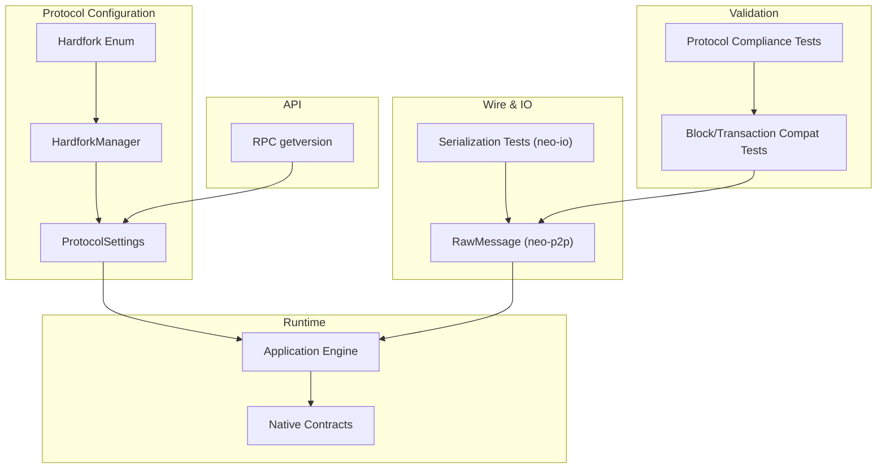
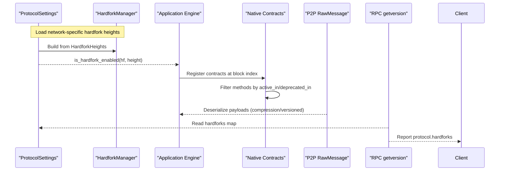
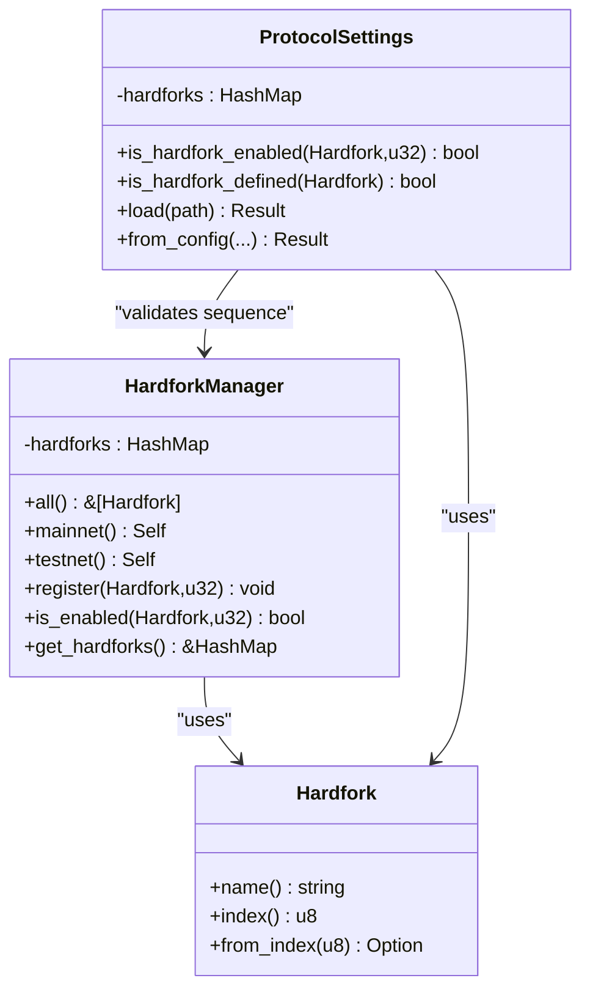
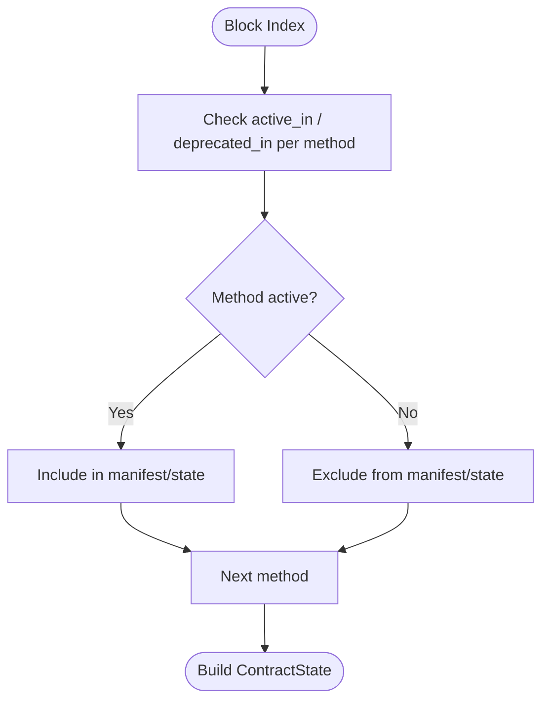
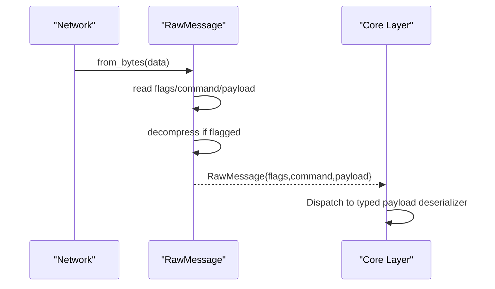
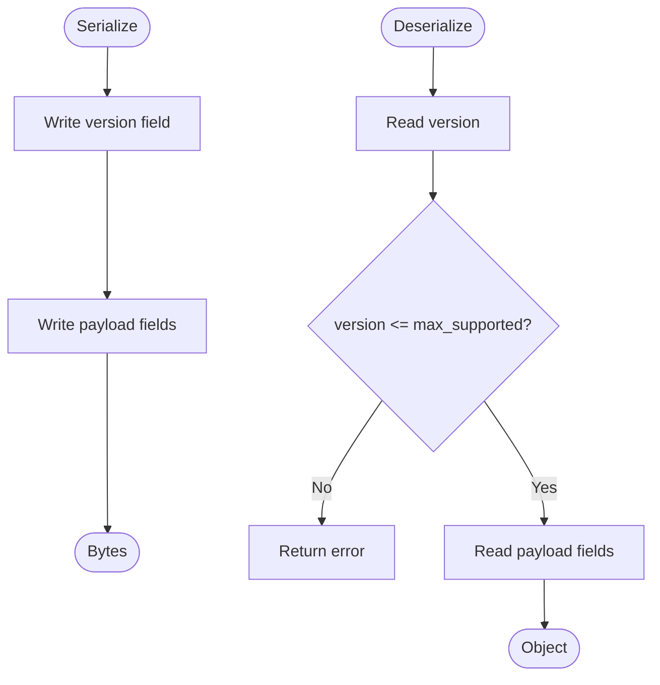
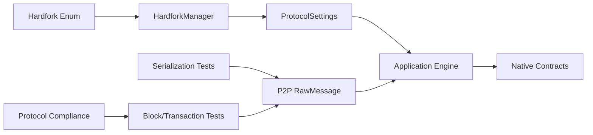

# Backward Compatibility Management

<cite>
**Referenced Files in This Document**
- [neo-core/src/hardfork.rs](file://neo-core/src/hardfork.rs)
- [neo-primitives/src/hardfork.rs](file://neo-primitives/src/hardfork.rs)
- [neo-core/src/protocol_settings.rs](file://neo-core/src/protocol_settings.rs)
- [neo-p2p/src/message.rs](file://neo-p2p/src/message.rs)
- [neo-io/tests/serialization_tests.rs](file://neo-io/tests/serialization_tests.rs)
- [neo-core/tests/block_serialization_compatibility_tests.rs](file://neo-core/tests/block_serialization_compatibility_tests.rs)
- [neo-core/tests/transaction_serialization_compatibility_tests.rs](file://neo-core/tests/transaction_serialization_compatibility_tests.rs)
- [neo-core/tests/protocol_compliance_tests.rs](file://neo-core/tests/protocol_compliance_tests.rs)
- [neo-core/src/smart_contract/native/hardfork_activable.rs](file://neo-core/src/smart_contract/native/hardfork_activable.rs)
- [neo-core/src/smart_contract/native/native_contract.rs](file://neo-core/src/smart_contract/native/native_contract.rs)
- [neo-rpc/src/server/rpc_server_node/tests.rs](file://neo-rpc/src/server/rpc_server_node/tests.rs)
</cite>

## Table of Contents
1. Introduction
2. Project Structure
3. Core Components
4. Architecture Overview
5. Detailed Component Analysis
6. Dependency Analysis
7. Performance Considerations
8. Troubleshooting Guide
9. Conclusion
10. Appendices

## Introduction
This document explains how Neo-RS maintains backward compatibility during hardforks. It covers strategies for data structure migrations, API versioning, protocol message format changes, and supporting multiple protocol versions simultaneously during transitions. It also documents serialization/deserialization compatibility, state migration patterns, rollback capabilities, version-aware logic, testing strategies, and best practices for deprecating features while keeping legacy clients working.

## Project Structure
Neo-RS organizes hardfork-related concerns across several crates:
- Protocol-level configuration and activation: neo-core and neo-config
- Hardfork enumeration and parsing: neo-primitives
- P2P wire framing and compression: neo-p2p
- Serialization primitives and tests: neo-io
- Native contract lifecycle and method gating: neo-core smart contracts
- RPC exposure of protocol metadata: neo-rpc
- Extensive compatibility and compliance tests: neo-core tests

**Diagram sources**
- [neo-core/src/protocol_settings.rs:95-209](file://neo-core/src/protocol_settings.rs#L95-L209)
- [neo-core/src/hardfork.rs:44-139](file://neo-core/src/hardfork.rs#L44-L139)
- [neo-primitives/src/hardfork.rs:9-34](file://neo-primitives/src/hardfork.rs#L9-L34)
- [neo-p2p/src/message.rs:17-105](file://neo-p2p/src/message.rs#L17-L105)
- [neo-io/tests/serialization_tests.rs:324-371](file://neo-io/tests/serialization_tests.rs#L324-L371)
- [neo-core/tests/block_serialization_compatibility_tests.rs:1-727](file://neo-core/tests/block_serialization_compatibility_tests.rs#L1-L727)
- [neo-core/tests/protocol_compliance_tests.rs:1-236](file://neo-core/tests/protocol_compliance_tests.rs#L1-L236)
- [neo-rpc/src/server/rpc_server_node/tests.rs:384-421](file://neo-rpc/src/server/rpc_server_node/tests.rs#L384-L421)

**Section sources**
- [neo-core/src/protocol_settings.rs:95-209](file://neo-core/src/protocol_settings.rs#L95-L209)
- [neo-core/src/hardfork.rs:44-139](file://neo-core/src/hardfork.rs#L44-L139)
- [neo-primitives/src/hardfork.rs:9-34](file://neo-primitives/src/hardfork.rs#L9-L34)
- [neo-p2p/src/message.rs:17-105](file://neo-p2p/src/message.rs#L17-L105)
- [neo-io/tests/serialization_tests.rs:324-371](file://neo-io/tests/serialization_tests.rs#L324-L371)
- [neo-core/tests/block_serialization_compatibility_tests.rs:1-727](file://neo-core/tests/block_serialization_compatibility_tests.rs#L1-L727)
- [neo-core/tests/protocol_compliance_tests.rs:1-236](file://neo-core/tests/protocol_compliance_tests.rs#L1-L236)
- [neo-rpc/src/server/rpc_server_node/tests.rs:384-421](file://neo-rpc/src/server/rpc_server_node/tests.rs#L384-L421)

## Core Components
- Hardfork enumeration and parsing: A canonical enum defines all hardforks with stable indices and string aliases used across the stack.
- Hardfork manager: Tracks configured activation heights per network and exposes enablement checks at a given block height.
- Protocol settings: Centralizes network parameters, including hardfork map, default behavior, loading from config, and validation of hardfork sequences.
- Native contract activation: Methods and contracts can be gated by active/deprecated hardfork windows; runtime builds manifests accordingly.
- P2P message framing: Wire-format handling with optional compression and strict payload size limits ensures interoperability.
- Serialization compatibility: Robust round-trip tests and explicit version checks maintain byte-for-byte parity with reference implementations.
- RPC version reporting: Exposes configured hardforks to clients for capability negotiation.

**Section sources**
- [neo-primitives/src/hardfork.rs:9-34](file://neo-primitives/src/hardfork.rs#L9-L34)
- [neo-core/src/hardfork.rs:44-139](file://neo-core/src/hardfork.rs#L44-L139)
- [neo-core/src/protocol_settings.rs:95-209](file://neo-core/src/protocol_settings.rs#L95-L209)
- [neo-core/src/smart_contract/native/native_contract.rs:70-122](file://neo-core/src/smart_contract/native/native_contract.rs#L70-L122)
- [neo-p2p/src/message.rs:17-105](file://neo-p2p/src/message.rs#L17-L105)
- [neo-io/tests/serialization_tests.rs:324-371](file://neo-io/tests/serialization_tests.rs#L324-L371)
- [neo-rpc/src/server/rpc_server_node/tests.rs:384-421](file://neo-rpc/src/server/rpc_server_node/tests.rs#L384-L421)

## Architecture Overview
The hardfork-aware architecture coordinates configuration, runtime activation, and wire compatibility:

**Diagram sources**
- [neo-core/src/protocol_settings.rs:95-209](file://neo-core/src/protocol_settings.rs#L95-L209)
- [neo-core/src/hardfork.rs:44-139](file://neo-core/src/hardfork.rs#L44-L139)
- [neo-core/src/smart_contract/native/native_contract.rs:70-122](file://neo-core/src/smart_contract/native/native_contract.rs#L70-L122)
- [neo-p2p/src/message.rs:17-105](file://neo-p2p/src/message.rs#L17-L105)
- [neo-rpc/src/server/rpc_server_node/tests.rs:384-421](file://neo-rpc/src/server/rpc_server_node/tests.rs#L384-L421)

## Detailed Component Analysis

### Hardfork Enumeration and Activation
- The canonical Hardfork enum provides stable indices and human-friendly names, enabling consistent cross-crate references.
- HardforkManager maps each hardfork to its activation height and exposes enablement checks against a block height.
- ProtocolSettings centralizes hardfork configuration, validates sequential activation, and fills omitted early hardforks to match reference behavior.

**Diagram sources**
- [neo-primitives/src/hardfork.rs:9-34](file://neo-primitives/src/hardfork.rs#L9-L34)
- [neo-core/src/hardfork.rs:44-139](file://neo-core/src/hardfork.rs#L44-L139)
- [neo-core/src/protocol_settings.rs:95-209](file://neo-core/src/protocol_settings.rs#L95-L209)

**Section sources**
- [neo-primitives/src/hardfork.rs:9-34](file://neo-primitives/src/hardfork.rs#L9-L34)
- [neo-core/src/hardfork.rs:44-139](file://neo-core/src/hardfork.rs#L44-L139)
- [neo-core/src/protocol_settings.rs:95-209](file://neo-core/src/protocol_settings.rs#L95-L209)

### Native Contract Method Gating and State Migration
- Native methods declare active_in and deprecated_in windows via a trait-based mechanism.
- At block initialization, native contracts are registered only if active; their manifest includes only methods whose windows include the current height.
- This enables gradual rollout and safe deprecation without breaking older clients.

**Diagram sources**
- [neo-core/src/smart_contract/native/hardfork_activable.rs:1-12](file://neo-core/src/smart_contract/native/hardfork_activable.rs#L1-L12)
- [neo-core/src/smart_contract/native/native_contract.rs:70-122](file://neo-core/src/smart_contract/native/native_contract.rs#L70-L122)

**Section sources**
- [neo-core/src/smart_contract/native/hardfork_activable.rs:1-12](file://neo-core/src/smart_contract/native/hardfork_activable.rs#L1-L12)
- [neo-core/src/smart_contract/native/native_contract.rs:70-122](file://neo-core/src/smart_contract/native/native_contract.rs#L70-L122)

### P2P Message Format and Version Handling
- RawMessage handles wire framing, command decoding, and optional LZ4 compression based on flags.
- Strict payload size enforcement prevents oversized or malformed messages.
- Command parsing supports extended aliases for compatibility with legacy nodes.

**Diagram sources**
- [neo-p2p/src/message.rs:17-105](file://neo-p2p/src/message.rs#L17-L105)

**Section sources**
- [neo-p2p/src/message.rs:17-105](file://neo-p2p/src/message.rs#L17-L105)

### Serialization and Deserialization Compatibility
- Explicit version checks in custom serializers ensure forward compatibility by rejecting unknown future versions.
- Round-trip tests validate that serialized bytes match expected formats and sizes.
- Real MainNet block vectors enforce byte-for-byte parity with the reference implementation.

**Diagram sources**
- [neo-io/tests/serialization_tests.rs:324-371](file://neo-io/tests/serialization_tests.rs#L324-L371)
- [neo-core/tests/block_serialization_compatibility_tests.rs:1-727](file://neo-core/tests/block_serialization_compatibility_tests.rs#L1-L727)
- [neo-core/tests/transaction_serialization_compatibility_tests.rs:1-407](file://neo-core/tests/transaction_serialization_compatibility_tests.rs#L1-L407)
- [neo-core/tests/protocol_compliance_tests.rs:1-236](file://neo-core/tests/protocol_compliance_tests.rs#L1-L236)

**Section sources**
- [neo-io/tests/serialization_tests.rs:324-371](file://neo-io/tests/serialization_tests.rs#L324-L371)
- [neo-core/tests/block_serialization_compatibility_tests.rs:1-727](file://neo-core/tests/block_serialization_compatibility_tests.rs#L1-L727)
- [neo-core/tests/transaction_serialization_compatibility_tests.rs:1-407](file://neo-core/tests/transaction_serialization_compatibility_tests.rs#L1-L407)
- [neo-core/tests/protocol_compliance_tests.rs:1-236](file://neo-core/tests/protocol_compliance_tests.rs#L1-L236)

### RPC Exposure of Hardforks
- The RPC layer exposes configured hardforks so clients can adapt behavior based on node capabilities.
- Tests assert that zero-height hardforks are included and names do not use internal prefixes.

**Section sources**
- [neo-rpc/src/server/rpc_server_node/tests.rs:384-421](file://neo-rpc/src/server/rpc_server_node/tests.rs#L384-L421)

## Dependency Analysis
- Hardfork enum is the single source of truth referenced by both core and configuration layers.
- HardforkManager depends on the enum and configuration to compute activation status.
- ProtocolSettings orchestrates loading, validation, and defaults, feeding activation decisions into runtime components.
- Native contracts depend on activation checks to build manifests and initialize state only when active.
- P2P messaging is independent of hardforks but must remain compatible with peers running different versions.
- Tests form a dependency chain ensuring correctness across serialization, blocks, transactions, and protocol compliance.

**Diagram sources**
- [neo-primitives/src/hardfork.rs:9-34](file://neo-primitives/src/hardfork.rs#L9-L34)
- [neo-core/src/hardfork.rs:44-139](file://neo-core/src/hardfork.rs#L44-L139)
- [neo-core/src/protocol_settings.rs:95-209](file://neo-core/src/protocol_settings.rs#L95-L209)
- [neo-core/src/smart_contract/native/native_contract.rs:70-122](file://neo-core/src/smart_contract/native/native_contract.rs#L70-L122)
- [neo-p2p/src/message.rs:17-105](file://neo-p2p/src/message.rs#L17-L105)
- [neo-io/tests/serialization_tests.rs:324-371](file://neo-io/tests/serialization_tests.rs#L324-L371)
- [neo-core/tests/block_serialization_compatibility_tests.rs:1-727](file://neo-core/tests/block_serialization_compatibility_tests.rs#L1-L727)
- [neo-core/tests/protocol_compliance_tests.rs:1-236](file://neo-core/tests/protocol_compliance_tests.rs#L1-L236)

**Section sources**
- [neo-primitives/src/hardfork.rs:9-34](file://neo-primitives/src/hardfork.rs#L9-L34)
- [neo-core/src/hardfork.rs:44-139](file://neo-core/src/hardfork.rs#L44-L139)
- [neo-core/src/protocol_settings.rs:95-209](file://neo-core/src/protocol_settings.rs#L95-L209)
- [neo-core/src/smart_contract/native/native_contract.rs:70-122](file://neo-core/src/smart_contract/native/native_contract.rs#L70-L122)
- [neo-p2p/src/message.rs:17-105](file://neo-p2p/src/message.rs#L17-L105)
- [neo-io/tests/serialization_tests.rs:324-371](file://neo-io/tests/serialization_tests.rs#L324-L371)
- [neo-core/tests/block_serialization_compatibility_tests.rs:1-727](file://neo-core/tests/block_serialization_compatibility_tests.rs#L1-L727)
- [neo-core/tests/protocol_compliance_tests.rs:1-236](file://neo-core/tests/protocol_compliance_tests.rs#L1-L236)

## Performance Considerations
- Keep hardfork checks O(1) using hash maps and avoid repeated lookups in hot paths.
- Prefer lazy registration of native contracts at block boundaries rather than per-call checks.
- Use compression thresholds in P2P to reduce bandwidth without impacting small messages.
- Ensure serialization size calculations match actual output to avoid unnecessary allocations.

[No sources needed since this section provides general guidance]

## Troubleshooting Guide
Common issues and diagnostics:
- Unknown command or extended alias mismatch in P2P messages indicates peer version differences; verify command tables and extended alias support.
- Serialization errors often stem from unexpected version fields; add explicit version checks and log context.
- Block deserialization failures due to merkle root mismatches suggest transaction list or hashing inconsistencies; re-run round-trip tests.
- Duplicate transaction detection failures require validating uniqueness during deserialization.
- RPC getversion missing hardforks implies configuration loading or omission handling issues; confirm ensure_omitted_hardforks behavior.

**Section sources**
- [neo-p2p/src/message.rs:74-105](file://neo-p2p/src/message.rs#L74-L105)
- [neo-io/tests/serialization_tests.rs:324-371](file://neo-io/tests/serialization_tests.rs#L324-L371)
- [neo-core/tests/block_serialization_compatibility_tests.rs:185-234](file://neo-core/tests/block_serialization_compatibility_tests.rs#L185-L234)
- [neo-core/tests/protocol_compliance_tests.rs:117-164](file://neo-core/tests/protocol_compliance_tests.rs#L117-L164)
- [neo-core/src/protocol_settings.rs:280-399](file://neo-core/src/protocol_settings.rs#L280-L399)

## Conclusion
Neo-RS achieves robust backward compatibility through:
- Canonical hardfork definitions and centralized activation management
- Strict serialization with version checks and comprehensive round-trip tests
- Native contract gating for feature rollouts and safe deprecations
- P2P message framing that tolerates legacy variants while enforcing safety limits
- RPC exposure of hardforks for client adaptation
- Extensive protocol compliance tests anchored to real MainNet data

These mechanisms collectively ensure smooth hardfork transitions, interoperability with older nodes, and reliable rollback pathways via configuration-driven activation.

[No sources needed since this section summarizes without analyzing specific files]

## Appendices

### Best Practices for Deprecating Features
- Mark methods with deprecated_in to phase out functionality gradually.
- Keep old methods available until a clear cutoff; communicate deprecation timelines via RPC.
- Validate that manifests exclude deprecated methods at post-deprecation heights.
- Maintain tests asserting behavior before and after deactivation points.

**Section sources**
- [neo-core/src/smart_contract/native/hardfork_activable.rs:1-12](file://neo-core/src/smart_contract/native/hardfork_activable.rs#L1-L12)
- [neo-core/src/smart_contract/native/native_contract.rs:70-122](file://neo-core/src/smart_contract/native/native_contract.rs#L70-L122)

### Multi-Version Testing Strategy
- Use real MainNet block vectors to validate deserialization, hashing, and size parity.
- Add synthetic cases for edge conditions (empty blocks, large tx lists, invalid versions).
- Run round-trip tests across blocks and transactions to catch subtle drifts.
- Verify RPC-reported hardforks align with configuration.

**Section sources**
- [neo-core/tests/protocol_compliance_tests.rs:1-236](file://neo-core/tests/protocol_compliance_tests.rs#L1-L236)
- [neo-core/tests/block_serialization_compatibility_tests.rs:1-727](file://neo-core/tests/block_serialization_compatibility_tests.rs#L1-L727)
- [neo-core/tests/transaction_serialization_compatibility_tests.rs:1-407](file://neo-core/tests/transaction_serialization_compatibility_tests.rs#L1-L407)
- [neo-rpc/src/server/rpc_server_node/tests.rs:384-421](file://neo-rpc/src/server/rpc_server_node/tests.rs#L384-L421)