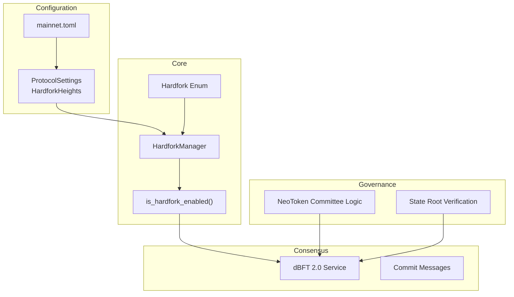
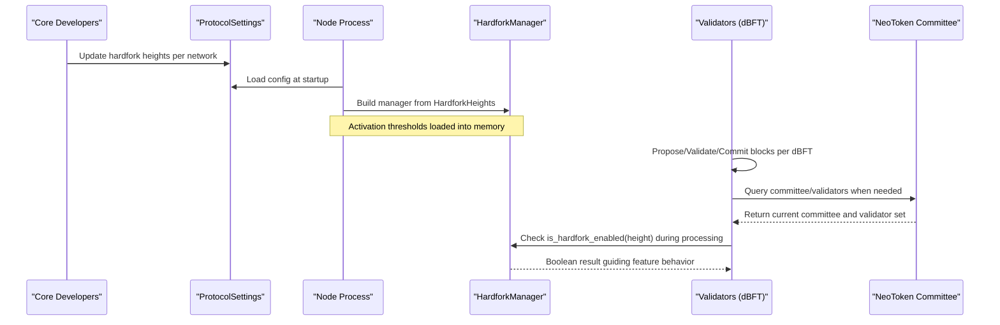
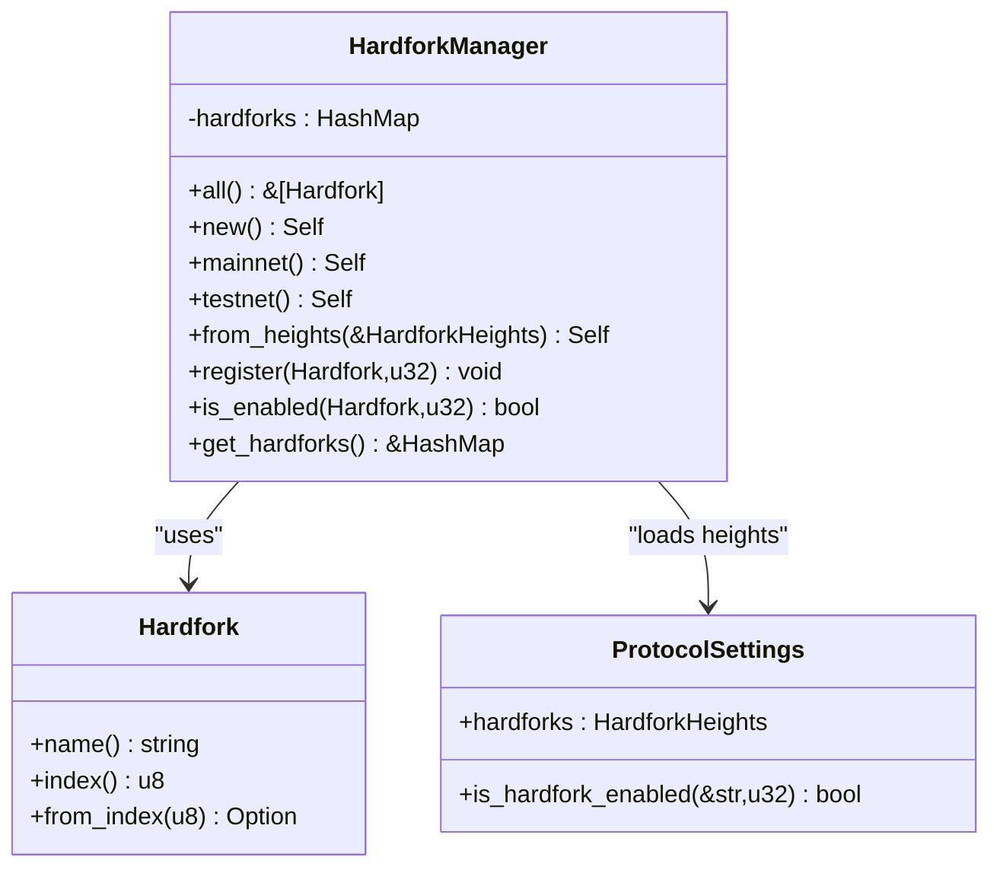
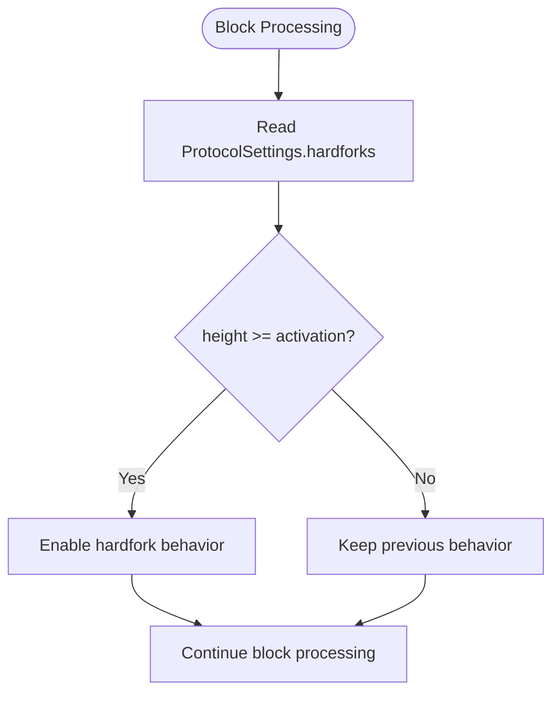
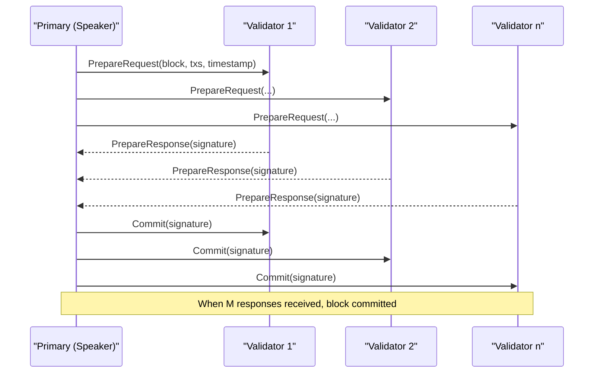
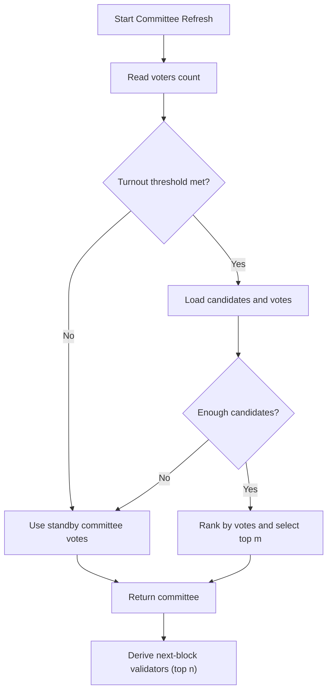
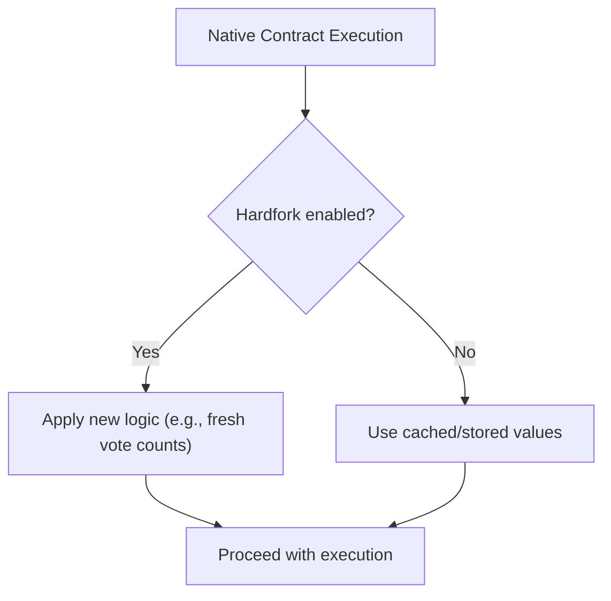
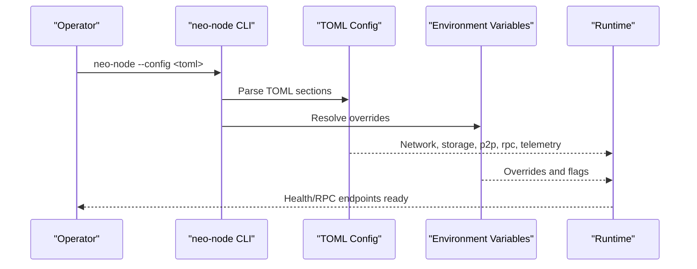
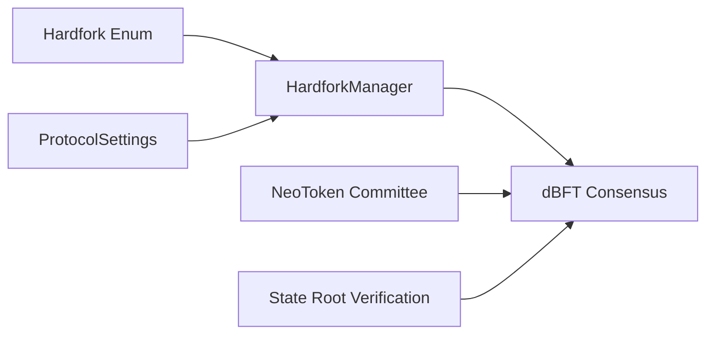

# Governance & Network Coordination

<cite>
**Referenced Files in This Document**
- [neo-core/src/hardfork.rs](file://neo-core/src/hardfork.rs)
- [neo-primitives/src/hardfork.rs](file://neo-primitives/src/hardfork.rs)
- [neo-config/src/protocol.rs](file://neo-config/src/protocol.rs)
- [config/mainnet.toml](file://config/mainnet.toml)
- [neo-consensus/src/lib.rs](file://neo-consensus/src/lib.rs)
- [neo-consensus/src/messages/commit.rs](file://neo-consensus/src/messages/commit.rs)
- [neo-core/src/smart_contract/native/neo_token/committee.rs](file://neo-core/src/smart_contract/native/neo_token/committee.rs)
- [neo-core/src/smart_contract/native/neo_token/native_impl.rs](file://neo-core/src/smart_contract/native/neo_token/native_impl.rs)
- [neo-core/src/state_service/verification.rs](file://neo-core/src/state_service/verification.rs)
- [neo-node/src/main.rs](file://neo-node/src/main.rs)
- [docs/DEPLOYMENT.md](file://docs/DEPLOYMENT.md)
- [docs/RELEASE.md](file://docs/RELEASE.md)
- [scripts/security-check.sh](file://scripts/security-check.sh)
- [openspec/specs/security-hardening/spec.md](file://openspec/specs/security-hardening/spec.md)
</cite>

## Table of Contents
1. Introduction
2. Project Structure
3. Core Components
4. Architecture Overview
5. Detailed Component Analysis
6. Dependency Analysis
7. Performance Considerations
8. Troubleshooting Guide
9. Conclusion
10. Appendices

## Introduction
This document explains the governance processes and network coordination required to deploy hardforks in Neo-RS. It covers how hardfork activation is defined, how validators coordinate via dBFT consensus, how committee voting influences validator sets, and how operators and developers coordinate preparation, rollout, monitoring, and rollback. It also provides templates for proposals, testing checklists, and post-deployment monitoring strategies aligned with the repository’s existing mechanisms.

## Project Structure
Neo-RS implements hardfork governance through a combination of:
- Protocol configuration that defines hardfork activation heights per network
- A hardfork manager that evaluates whether features are enabled at a given block height
- Consensus (dBFT 2.0) used by validators to agree on blocks and enforce protocol rules
- Native NEO token logic that computes committee and validator sets based on on-chain votes
- Node startup and deployment tooling that loads configuration and runs checks

**Diagram sources**
- [neo-config/src/protocol.rs:106-140](file://neo-config/src/protocol.rs#L106-L140)
- [neo-core/src/hardfork.rs:44-140](file://neo-core/src/hardfork.rs#L44-L140)
- [neo-primitives/src/hardfork.rs:9-34](file://neo-primitives/src/hardfork.rs#L9-L34)
- [neo-consensus/src/lib.rs:6-138](file://neo-consensus/src/lib.rs#L6-L138)
- [neo-core/src/smart_contract/native/neo_token/committee.rs:159-197](file://neo-core/src/smart_contract/native/neo_token/committee.rs#L159-L197)
- [neo-core/src/state_service/verification.rs:103-131](file://neo-core/src/state_service/verification.rs#L103-L131)
- [config/mainnet.toml:1-68](file://config/mainnet.toml#L1-L68)

**Section sources**
- [neo-config/src/protocol.rs:106-140](file://neo-config/src/protocol.rs#L106-L140)
- [neo-core/src/hardfork.rs:44-140](file://neo-core/src/hardfork.rs#L44-L140)
- [neo-primitives/src/hardfork.rs:9-34](file://neo-primitives/src/hardfork.rs#L9-L34)
- [neo-consensus/src/lib.rs:6-138](file://neo-consensus/src/lib.rs#L6-L138)
- [config/mainnet.toml:1-68](file://config/mainnet.toml#L1-L68)

## Core Components
- Hardfork enumeration and parsing: Defines named hardforks and string-to-enumeration mapping used across the codebase.
- Hardfork manager: Stores activation heights and exposes methods to check if a hardfork is active at a given block height.
- Protocol settings: Centralizes network parameters including hardfork activation heights for mainnet/testnet/private networks.
- Consensus service: Implements dBFT 2.0; validators use it to propose, validate, and commit blocks under agreed protocol rules.
- Committee and validator selection: Native NEO token logic computes committee and next-block validators from votes and policy.
- State root verification: Ensures state integrity during validation and signing flows.

Key responsibilities:
- Define and activate protocol changes deterministically at configured heights
- Coordinate validators to reach consensus on blocks that reflect activated features
- Provide governance signals (votes) that influence validator set composition
- Ensure nodes can verify and monitor readiness before and after activation

**Section sources**
- [neo-primitives/src/hardfork.rs:9-34](file://neo-primitives/src/hardfork.rs#L9-L34)
- [neo-core/src/hardfork.rs:44-140](file://neo-core/src/hardfork.rs#L44-L140)
- [neo-config/src/protocol.rs:106-140](file://neo-config/src/protocol.rs#L106-L140)
- [neo-consensus/src/lib.rs:6-138](file://neo-consensus/src/lib.rs#L6-L138)
- [neo-core/src/smart_contract/native/neo_token/committee.rs:159-197](file://neo-core/src/smart_contract/native/neo_token/committee.rs#L159-L197)
- [neo-core/src/state_service/verification.rs:103-131](file://neo-core/src/state_service/verification.rs#L103-L131)

## Architecture Overview
The hardfork governance flow integrates configuration, runtime checks, and consensus:

**Diagram sources**
- [neo-config/src/protocol.rs:181-315](file://neo-config/src/protocol.rs#L181-L315)
- [neo-core/src/hardfork.rs:66-140](file://neo-core/src/hardfork.rs#L66-L140)
- [neo-consensus/src/lib.rs:63-138](file://neo-consensus/src/lib.rs#L63-L138)
- [neo-core/src/smart_contract/native/neo_token/committee.rs:159-197](file://neo-core/src/smart_contract/native/neo_token/committee.rs#L159-L197)

## Detailed Component Analysis

### Hardfork Enumeration and Manager
- The Hardfork enum defines all known hardforks and supports parsing from strings and indices.
- HardforkManager maps each hardfork to an activation height and exposes:
  - Registration of new activations
  - Checking activation status at a given block height
  - Retrieval of configured hardforks

**Diagram sources**
- [neo-primitives/src/hardfork.rs:9-34](file://neo-primitives/src/hardfork.rs#L9-L34)
- [neo-core/src/hardfork.rs:44-140](file://neo-core/src/hardfork.rs#L44-L140)
- [neo-config/src/protocol.rs:106-140](file://neo-config/src/protocol.rs#L106-L140)

**Section sources**
- [neo-primitives/src/hardfork.rs:9-34](file://neo-primitives/src/hardfork.rs#L9-L34)
- [neo-core/src/hardfork.rs:44-140](file://neo-core/src/hardfork.rs#L44-L140)
- [neo-config/src/protocol.rs:106-140](file://neo-config/src/protocol.rs#L106-L140)

### Protocol Settings and Activation Checks
- ProtocolSettings centralizes network-specific parameters, including hardfork activation heights for mainnet, testnet, and private networks.
- Activation checks compare current block height against configured thresholds.

**Diagram sources**
- [neo-config/src/protocol.rs:181-315](file://neo-config/src/protocol.rs#L181-L315)
- [neo-core/src/hardfork.rs:119-134](file://neo-core/src/hardfork.rs#L119-L134)

**Section sources**
- [neo-config/src/protocol.rs:181-315](file://neo-config/src/protocol.rs#L181-L315)
- [neo-core/src/hardfork.rs:119-134](file://neo-core/src/hardfork.rs#L119-L134)

### Consensus Coordination (dBFT 2.0)
- Validators use dBFT 2.0 to propose, validate, and commit blocks.
- Minimum signatures M = (n + f)/2 + 1 ensures safety and liveness with up to f Byzantine nodes.
- Commit messages carry signatures and are validated for length and correctness.

**Diagram sources**
- [neo-consensus/src/lib.rs:63-138](file://neo-consensus/src/lib.rs#L63-L138)
- [neo-consensus/src/messages/commit.rs:43-59](file://neo-consensus/src/messages/commit.rs#L43-L59)

**Section sources**
- [neo-consensus/src/lib.rs:6-138](file://neo-consensus/src/lib.rs#L6-L138)
- [neo-consensus/src/messages/commit.rs:43-59](file://neo-consensus/src/messages/commit.rs#L43-L59)

### Committee Voting and Validator Selection
- NeoToken native contract computes committee members based on votes and turnout thresholds.
- If turnout is low or candidates are insufficient, fallback to standby committee is applied.
- Next-block validators are derived from the top voted committee members according to policy.

**Diagram sources**
- [neo-core/src/smart_contract/native/neo_token/committee.rs:159-197](file://neo-core/src/smart_contract/native/neo_token/committee.rs#L159-L197)
- [neo-core/src/smart_contract/native/neo_token/committee.rs:298-317](file://neo-core/src/smart_contract/native/neo_token/committee.rs#L298-L317)

**Section sources**
- [neo-core/src/smart_contract/native/neo_token/committee.rs:159-197](file://neo-core/src/smart_contract/native/neo_token/committee.rs#L159-L197)
- [neo-core/src/smart_contract/native/neo_token/committee.rs:298-317](file://neo-core/src/smart_contract/native/neo_token/committee.rs#L298-L317)

### Hardfork-Gated Behavior in Native Contracts
- Certain native behaviors change based on hardfork activation (e.g., vote counting adjustments).
- Code branches on is_hardfork_enabled to ensure compatibility and correct semantics post-activation.

**Diagram sources**
- [neo-core/src/smart_contract/native/neo_token/native_impl.rs:216-243](file://neo-core/src/smart_contract/native/neo_token/native_impl.rs#L216-L243)

**Section sources**
- [neo-core/src/smart_contract/native/neo_token/native_impl.rs:216-243](file://neo-core/src/smart_contract/native/neo_token/native_impl.rs#L216-L243)

### Node Startup and Configuration Loading
- Nodes load TOML configuration files and environment variables to determine network identity, ports, storage, and telemetry.
- Health endpoints and RPC readiness are used to monitor node status pre/post hardfork.

**Diagram sources**
- [config/mainnet.toml:1-68](file://config/mainnet.toml#L1-L68)
- [docs/DEPLOYMENT.md:243-356](file://docs/DEPLOYMENT.md#L243-L356)
- [docs/DEPLOYMENT.md:642-676](file://docs/DEPLOYMENT.md#L642-L676)

**Section sources**
- [config/mainnet.toml:1-68](file://config/mainnet.toml#L1-L68)
- [docs/DEPLOYMENT.md:243-356](file://docs/DEPLOYMENT.md#L243-L356)
- [docs/DEPLOYMENT.md:642-676](file://docs/DEPLOYMENT.md#L642-L676)

## Dependency Analysis
- Hardfork enum is the single source of truth for hardfork identities and ordering.
- HardforkManager depends on ProtocolSettings to build activation maps.
- Consensus service depends on validator set computed by NeoToken committee logic.
- State root verification participates in validation and signing workflows.

**Diagram sources**
- [neo-primitives/src/hardfork.rs:9-34](file://neo-primitives/src/hardfork.rs#L9-L34)
- [neo-core/src/hardfork.rs:44-140](file://neo-core/src/hardfork.rs#L44-L140)
- [neo-consensus/src/lib.rs:6-138](file://neo-consensus/src/lib.rs#L6-L138)
- [neo-core/src/smart_contract/native/neo_token/committee.rs:159-197](file://neo-core/src/smart_contract/native/neo_token/committee.rs#L159-L197)
- [neo-core/src/state_service/verification.rs:103-131](file://neo-core/src/state_service/verification.rs#L103-L131)

**Section sources**
- [neo-primitives/src/hardfork.rs:9-34](file://neo-primitives/src/hardfork.rs#L9-L34)
- [neo-core/src/hardfork.rs:44-140](file://neo-core/src/hardfork.rs#L44-L140)
- [neo-consensus/src/lib.rs:6-138](file://neo-consensus/src/lib.rs#L6-L138)
- [neo-core/src/smart_contract/native/neo_token/committee.rs:159-197](file://neo-core/src/smart_contract/native/neo_token/committee.rs#L159-L197)
- [neo-core/src/state_service/verification.rs:103-131](file://neo-core/src/state_service/verification.rs#L103-L131)

## Performance Considerations
- Hardfork activation checks are O(1) map lookups; ensure activation heights are correctly configured to avoid unnecessary branching.
- Committee computation may iterate candidates; keep candidate lists bounded and efficient.
- Consensus throughput depends on validator count and network latency; maintain low-latency connections among validators.
- Use production profiles and optimized builds for validators and high-throughput nodes.

[No sources needed since this section provides general guidance]

## Troubleshooting Guide
Common issues and mitigations:
- Misconfigured hardfork heights: Validate ProtocolSettings and ensure activation heights match intended network targets.
- Validator set mismatch: Confirm NeoToken committee logic returns expected results; check votes and turnout thresholds.
- Consensus stalls: Inspect dBFT message flows and timeouts; verify prepare/commit message validity and signature lengths.
- Node health: Use health endpoints and RPC queries to confirm sync status and peer connectivity.

Operational checks:
- Run security checks and linting prior to releases.
- Validate configuration without starting the node using provided tools.
- Monitor logs and metrics for anomalies around activation heights.

**Section sources**
- [neo-config/src/protocol.rs:181-315](file://neo-config/src/protocol.rs#L181-L315)
- [neo-consensus/src/messages/commit.rs:43-59](file://neo-consensus/src/messages/commit.rs#L43-L59)
- [docs/DEPLOYMENT.md:387-404](file://docs/DEPLOYMENT.md#L387-L404)
- [scripts/security-check.sh:1-44](file://scripts/security-check.sh#L1-L44)

## Conclusion
Neo-RS implements hardfork governance through clear separation of concerns: configuration-driven activation heights, robust runtime checks, and consensus-based coordination among validators. Committee voting drives validator set evolution, while state root verification ensures integrity. Operators can rely on documented deployment and release procedures, along with monitoring and security checks, to execute safe and coordinated hardfork rollouts.

[No sources needed since this section summarizes without analyzing specific files]

## Appendices

### A. Hardfork Proposal Template
- Title: Proposed Hardfork Name and Version
- Objective: Describe protocol changes and benefits
- Affected Networks: MainNet/TestNet/Private
- Activation Heights:
  - MainNet: Block height
  - TestNet: Block height
  - Private: Block height (if applicable)
- Stakeholder Impact:
  - Validators: Changes to block validation or rewards
  - Node Operators: Configuration updates and restart requirements
  - Developers: API or VM changes
- Testing Plan:
  - Unit tests covering new behavior
  - Integration tests on testnet
  - Protocol consistency checks against reference implementation
- Rollback Plan:
  - Criteria for rollback triggers
  - Steps to revert configuration and binaries
  - Communication plan to stakeholders
- Approval:
  - Core developer sign-off
  - Validator consensus confirmation
  - Post-activation monitoring checklist

[No sources needed since this section provides a template]

### B. Testing Checklist
- Build and run unit tests across workspace
- Run integration tests on testnet with updated hardfork heights
- Verify committee and validator computations
- Execute protocol consistency checks against reference vectors
- Perform load and stress tests around activation height
- Validate health endpoints and RPC responses
- Review security checks and dependency scans

**Section sources**
- [docs/RELEASE.md:5-9](file://docs/RELEASE.md#L5-L9)
- [scripts/security-check.sh:1-44](file://scripts/security-check.sh#L1-L44)

### C. Rollback Procedures
- Predefined rollback triggers (e.g., divergence detection, critical bugs)
- Revert ProtocolSettings hardfork heights to previous values
- Deploy previous binary version across validator set
- Communicate rollback to ecosystem participants
- Resume normal operations and investigate root cause

**Section sources**
- [docs/RELEASE.md:25-29](file://docs/RELEASE.md#L25-L29)

### D. Regulatory and Audit Considerations
- Security audit compliance: Address all findings before production release
- Input validation at system boundaries (RPC, P2P)
- Dependency security scanning in CI/CD
- Maintain auditable logs and metrics for post-deployment review

**Section sources**
- [openspec/specs/security-hardening/spec.md:1-23](file://openspec/specs/security-hardening/spec.md#L1-L23)

### E. Monitoring Strategies
- Health endpoints: /healthz, /readyz, /metrics
- RPC queries: getblockcount, getpeers, getversion
- Log rotation and centralized logging
- Continuous validation scripts for protocol consistency

**Section sources**
- [docs/DEPLOYMENT.md:642-676](file://docs/DEPLOYMENT.md#L642-L676)