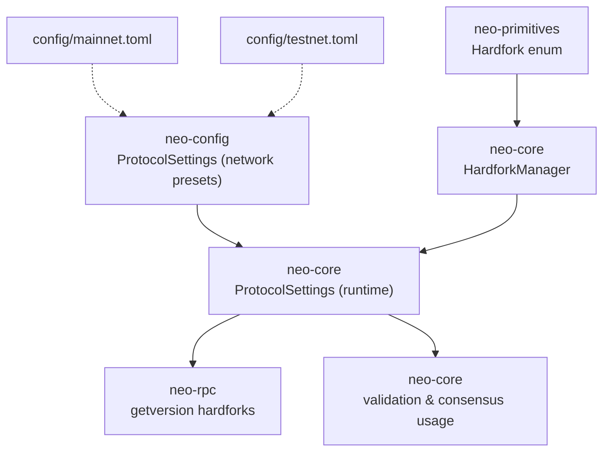
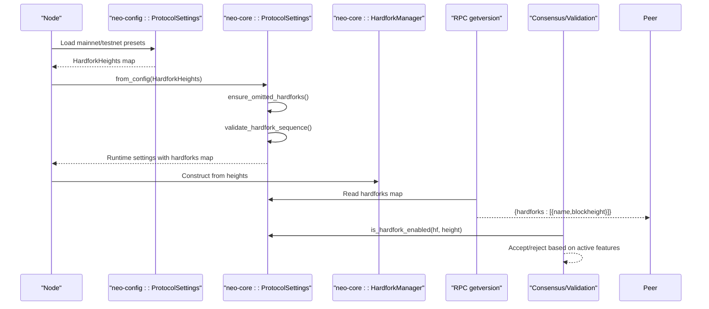
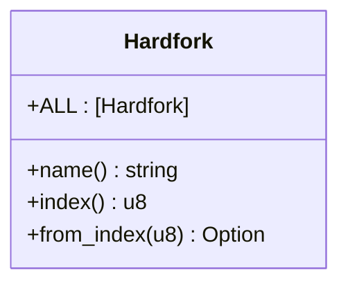
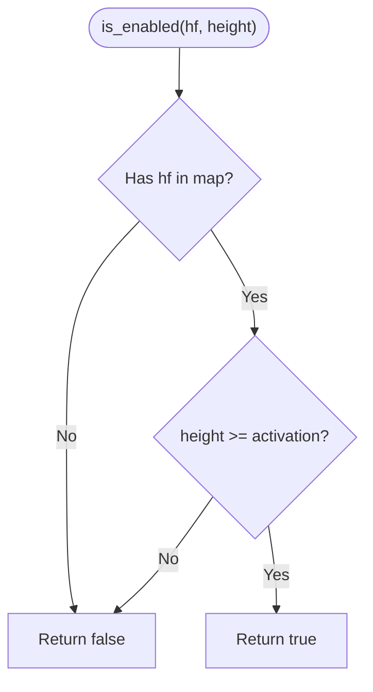
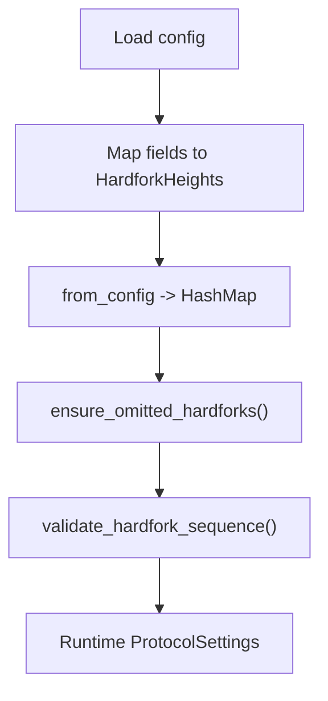
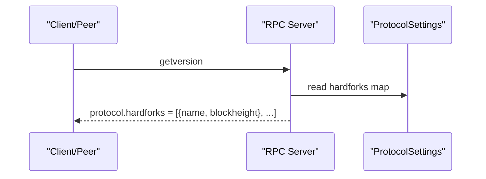
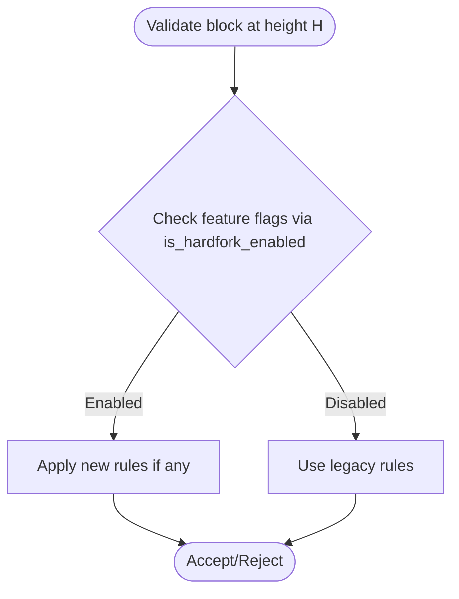
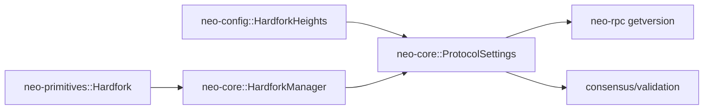

# Hardfork Activation Mechanisms

<cite>
**Referenced Files in This Document**
- [neo-primitives/src/hardfork.rs](file://neo-primitives/src/hardfork.rs)
- [neo-core/src/hardfork.rs](file://neo-core/src/hardfork.rs)
- [neo-core/src/protocol_settings.rs](file://neo-core/src/protocol_settings.rs)
- [neo-config/src/protocol.rs](file://neo-config/src/protocol.rs)
- [neo-rpc/src/server/rpc_server_node/mod.rs](file://neo-rpc/src/server/rpc_server_node/mod.rs)
- [config/mainnet.toml](file://config/mainnet.toml)
- [config/testnet.toml](file://config/testnet.toml)
- [neo-core/src/validation.rs](file://neo-core/src/validation.rs)
</cite>

## Table of Contents
1. [Introduction](#introduction)
2. [Project Structure](#project-structure)
3. [Core Components](#core-components)
4. [Architecture Overview](#architecture-overview)
5. [Detailed Component Analysis](#detailed-component-analysis)
6. [Dependency Analysis](#dependency-analysis)
7. [Performance Considerations](#performance-considerations)
8. [Troubleshooting Guide](#troubleshooting-guide)
9. [Conclusion](#conclusion)

## Introduction
This document explains how hardfork activation works in Neo-RS, focusing on:
- How nodes negotiate and detect the active protocol version at a given block height
- How activation heights are configured per network (mainnet, testnet) and applied at runtime
- How consensus and validation layers use hardfork state to accept or reject blocks and transactions
- How to implement conditional logic based on hardfork levels for new features or changed rules
- Edge cases such as partial upgrades, fork resolution, and recovery procedures when nodes disagree

The implementation centers on a typed hardfork enumeration, a manager that tracks activation heights, and protocol settings that enforce sequence and ordering constraints. The RPC layer exposes the configured hardforks so peers can negotiate capabilities.

## Project Structure
Hardfork-related code spans several modules:
- Protocol-level types and constants live in primitives
- Runtime management and checks live in core
- Configuration sources and defaults live in config
- RPC exposure lives in rpc
- Validation and consensus integration points live in core validation

**Diagram sources**
- [neo-primitives/src/hardfork.rs:9-33](file://neo-primitives/src/hardfork.rs#L9-L33)
- [neo-core/src/hardfork.rs:44-140](file://neo-core/src/hardfork.rs#L44-L140)
- [neo-config/src/protocol.rs:12-64](file://neo-config/src/protocol.rs#L12-L64)
- [neo-core/src/protocol_settings.rs:25-80](file://neo-core/src/protocol_settings.rs#L25-L80)
- [neo-rpc/src/server/rpc_server_node/mod.rs:137-157](file://neo-rpc/src/server/rpc_server_node/mod.rs#L137-L157)
- [config/mainnet.toml:1-68](file://config/mainnet.toml#L1-L68)
- [config/testnet.toml:1-50](file://config/testnet.toml#L1-L50)

**Section sources**
- [neo-primitives/src/hardfork.rs:9-33](file://neo-primitives/src/hardfork.rs#L9-L33)
- [neo-core/src/hardfork.rs:44-140](file://neo-core/src/hardfork.rs#L44-L140)
- [neo-config/src/protocol.rs:12-64](file://neo-config/src/protocol.rs#L12-L64)
- [neo-core/src/protocol_settings.rs:25-80](file://neo-core/src/protocol_settings.rs#L25-L80)
- [neo-rpc/src/server/rpc_server_node/mod.rs:137-157](file://neo-rpc/src/server/rpc_server_node/mod.rs#L137-L157)
- [config/mainnet.toml:1-68](file://config/mainnet.toml#L1-L68)
- [config/testnet.toml:1-50](file://config/testnet.toml#L1-L50)

## Core Components
- Hardfork enum: single source of truth for hardfork identity and ordering
- HardforkManager: stores and queries activation heights per hardfork
- ProtocolSettings (config): defines network-specific activation heights and provides helpers
- ProtocolSettings (core): runtime representation with validation and fallback behavior
- RPC getversion: exposes configured hardforks to peers for negotiation

Key behaviors:
- Activation is height-based: a hardfork is enabled at or after its configured height
- Missing configuration means disabled by default in some paths; defaults may fill omitted entries depending on context
- Sequence validation ensures hardforks are configured in order and non-decreasing heights

**Section sources**
- [neo-primitives/src/hardfork.rs:9-33](file://neo-primitives/src/hardfork.rs#L9-L33)
- [neo-core/src/hardfork.rs:44-140](file://neo-core/src/hardfork.rs#L44-L140)
- [neo-config/src/protocol.rs:106-140](file://neo-config/src/protocol.rs#L106-L140)
- [neo-core/src/protocol_settings.rs:25-80](file://neo-core/src/protocol_settings.rs#L25-L80)
- [neo-core/src/protocol_settings.rs:194-209](file://neo-core/src/protocol_settings.rs#L194-L209)
- [neo-core/src/protocol_settings.rs:280-295](file://neo-core/src/protocol_settings.rs#L280-L295)
- [neo-core/src/protocol_settings.rs:367-399](file://neo-core/src/protocol_settings.rs#L367-L399)

## Architecture Overview
The activation flow connects configuration, runtime settings, and consensus/validation:

**Diagram sources**
- [neo-config/src/protocol.rs:193-315](file://neo-config/src/protocol.rs#L193-L315)
- [neo-core/src/protocol_settings.rs:95-139](file://neo-core/src/protocol_settings.rs#L95-L139)
- [neo-core/src/protocol_settings.rs:194-209](file://neo-core/src/protocol_settings.rs#L194-L209)
- [neo-core/src/protocol_settings.rs:280-295](file://neo-core/src/protocol_settings.rs#L280-L295)
- [neo-core/src/protocol_settings.rs:367-399](file://neo-core/src/protocol_settings.rs#L367-L399)
- [neo-core/src/hardfork.rs:86-107](file://neo-core/src/hardfork.rs#L86-L107)
- [neo-rpc/src/server/rpc_server_node/mod.rs:137-157](file://neo-rpc/src/server/rpc_server_node/mod.rs#L137-L157)

## Detailed Component Analysis

### Hardfork Enum and Ordering
- Defines all known hardforks with stable indices and string names
- Provides parsing from strings and conversion utilities
- Ensures total ordering for sequential validation

**Diagram sources**
- [neo-primitives/src/hardfork.rs:9-33](file://neo-primitives/src/hardfork.rs#L9-L33)
- [neo-primitives/src/hardfork.rs:36-54](file://neo-primitives/src/hardfork.rs#L36-L54)

**Section sources**
- [neo-primitives/src/hardfork.rs:9-33](file://neo-primitives/src/hardfork.rs#L9-L33)
- [neo-primitives/src/hardfork.rs:36-54](file://neo-primitives/src/hardfork.rs#L36-L54)

### HardforkManager: Height-Based Activation
- Stores a map from hardfork to activation height
- Provides is_enabled(hardfork, block_height) semantics
- Supports registration and retrieval of configured hardforks

**Diagram sources**
- [neo-core/src/hardfork.rs:119-134](file://neo-core/src/hardfork.rs#L119-L134)

**Section sources**
- [neo-core/src/hardfork.rs:44-140](file://neo-core/src/hardfork.rs#L44-L140)

### Protocol Settings: Configuration and Defaults
- Network presets define activation heights for mainnet and testnet
- Runtime settings convert config into a HashMap<Hardfork, u32>
- ensure_omitted_hardforks fills pre-configured prefix with zero-height entries to match reference behavior
- validate_hardfork_sequence enforces contiguous configuration and non-decreasing heights

**Diagram sources**
- [neo-config/src/protocol.rs:193-315](file://neo-config/src/protocol.rs#L193-L315)
- [neo-core/src/protocol_settings.rs:95-139](file://neo-core/src/protocol_settings.rs#L95-L139)
- [neo-core/src/protocol_settings.rs:280-295](file://neo-core/src/protocol_settings.rs#L280-L295)
- [neo-core/src/protocol_settings.rs:367-399](file://neo-core/src/protocol_settings.rs#L367-L399)

**Section sources**
- [neo-config/src/protocol.rs:193-315](file://neo-config/src/protocol.rs#L193-L315)
- [neo-core/src/protocol_settings.rs:95-139](file://neo-core/src/protocol_settings.rs#L95-L139)
- [neo-core/src/protocol_settings.rs:280-295](file://neo-core/src/protocol_settings.rs#L280-L295)
- [neo-core/src/protocol_settings.rs:367-399](file://neo-core/src/protocol_settings.rs#L367-L399)

### RPC Exposure for Negotiation
- getversion returns a list of hardforks with their configured block heights
- Peers use this to determine capability compatibility and upgrade status

**Diagram sources**
- [neo-rpc/src/server/rpc_server_node/mod.rs:137-157](file://neo-rpc/src/server/rpc_server_node/mod.rs#L137-L157)

**Section sources**
- [neo-rpc/src/server/rpc_server_node/mod.rs:137-157](file://neo-rpc/src/server/rpc_server_node/mod.rs#L137-L157)

### Validation and Consensus Integration Points
- Block validation enforces structural and timestamp rules; hardfork-aware checks are performed via ProtocolSettings.is_hardfork_enabled at relevant decision points
- Consensus uses the same settings to decide which features are active when proposing or validating blocks

**Diagram sources**
- [neo-core/src/protocol_settings.rs:194-209](file://neo-core/src/protocol_settings.rs#L194-L209)
- [neo-core/src/validation.rs:12-126](file://neo-core/src/validation.rs#L12-L126)

**Section sources**
- [neo-core/src/protocol_settings.rs:194-209](file://neo-core/src/protocol_settings.rs#L194-L209)
- [neo-core/src/validation.rs:12-126](file://neo-core/src/validation.rs#L12-L126)

## Dependency Analysis
- neo-primitives::Hardfork is the canonical type used across modules
- neo-core::HardforkManager depends on neo-primitives::Hardfork
- neo-core::ProtocolSettings consumes neo-config::HardforkHeights and produces a runtime map
- neo-rpc reads from neo-core::ProtocolSettings to expose hardforks
- Validation and consensus consume neo-core::ProtocolSettings for feature gating

**Diagram sources**
- [neo-primitives/src/hardfork.rs:9-33](file://neo-primitives/src/hardfork.rs#L9-L33)
- [neo-core/src/hardfork.rs:44-140](file://neo-core/src/hardfork.rs#L44-L140)
- [neo-config/src/protocol.rs:106-140](file://neo-config/src/protocol.rs#L106-L140)
- [neo-core/src/protocol_settings.rs:95-139](file://neo-core/src/protocol_settings.rs#L95-L139)
- [neo-rpc/src/server/rpc_server_node/mod.rs:137-157](file://neo-rpc/src/server/rpc_server_node/mod.rs#L137-L157)

**Section sources**
- [neo-primitives/src/hardfork.rs:9-33](file://neo-primitives/src/hardfork.rs#L9-L33)
- [neo-core/src/hardfork.rs:44-140](file://neo-core/src/hardfork.rs#L44-L140)
- [neo-config/src/protocol.rs:106-140](file://neo-config/src/protocol.rs#L106-L140)
- [neo-core/src/protocol_settings.rs:95-139](file://neo-core/src/protocol_settings.rs#L95-L139)
- [neo-rpc/src/server/rpc_server_node/mod.rs:137-157](file://neo-rpc/src/server/rpc_server_node/mod.rs#L137-L157)

## Performance Considerations
- Activation checks are O(1) hash lookups per hardfork query
- ensure_omitted_hardforks iterates over the ordered hardfork list once during settings construction
- validate_hardfork_sequence performs a single pass over configured hardforks
- Keep hardfork lists small and avoid repeated heavy computations inside hot paths

[No sources needed since this section provides general guidance]

## Troubleshooting Guide
Common issues and resolutions:
- Hardfork not activating at expected height
  - Verify the configured height in the network preset or runtime overrides
  - Confirm the node’s current block height is at or above the activation height
  - Check getversion output to confirm the node’s advertised hardforks
- Unexpected feature disabled after upgrade
  - Ensure ensure_omitted_hardforks behavior aligns with expectations for your deployment
  - Validate that all required hardforks are configured sequentially without gaps
- Disagreement between nodes
  - Inspect getversion responses from peers to identify mismatched hardfork configurations
  - Reconcile configuration files and restart nodes to converge on the same protocol parameters
  - If divergence occurs, roll back to a common hardfork level and resynchronize

Operational tips:
- Use getversion to audit each node’s effective hardfork set before deploying changes
- Maintain strict ordering and monotonicity in activation heights to prevent validation errors
- For private networks, explicitly configure all hardforks to avoid unintended defaults

**Section sources**
- [neo-core/src/protocol_settings.rs:280-295](file://neo-core/src/protocol_settings.rs#L280-L295)
- [neo-core/src/protocol_settings.rs:367-399](file://neo-core/src/protocol_settings.rs#L367-L399)
- [neo-rpc/src/server/rpc_server_node/mod.rs:137-157](file://neo-rpc/src/server/rpc_server_node/mod.rs#L137-L157)

## Conclusion
Neo-RS implements hardfork activation through a clear separation of concerns:
- Canonical hardfork identities in primitives
- Height-based activation in core via HardforkManager and ProtocolSettings
- Network-specific configuration in config presets
- Peer negotiation via RPC getversion
- Feature gating in validation and consensus using is_hardfork_enabled

By configuring activation heights carefully and validating them at startup, operators can safely roll out protocol upgrades while ensuring consistent behavior across the network.

[No sources needed since this section summarizes without analyzing specific files]