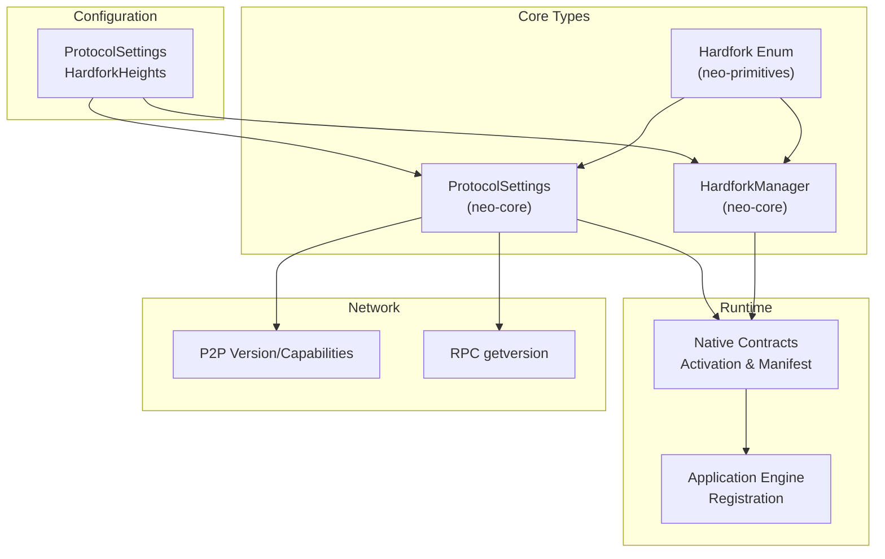
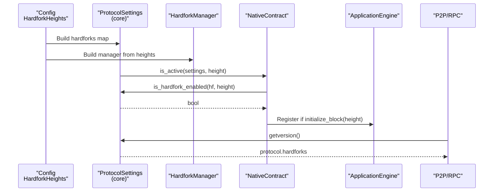
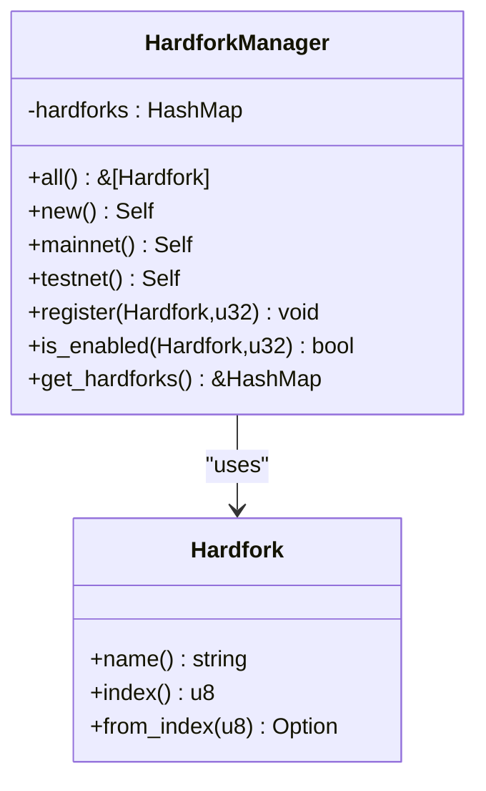
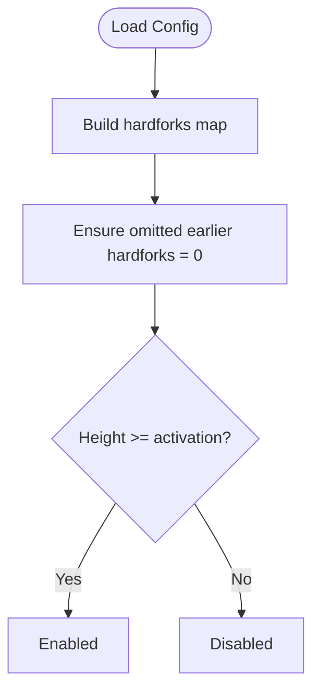
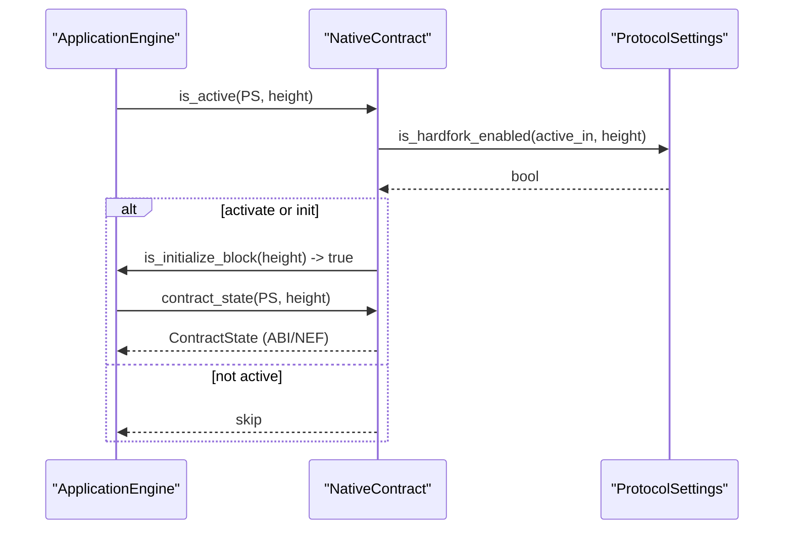
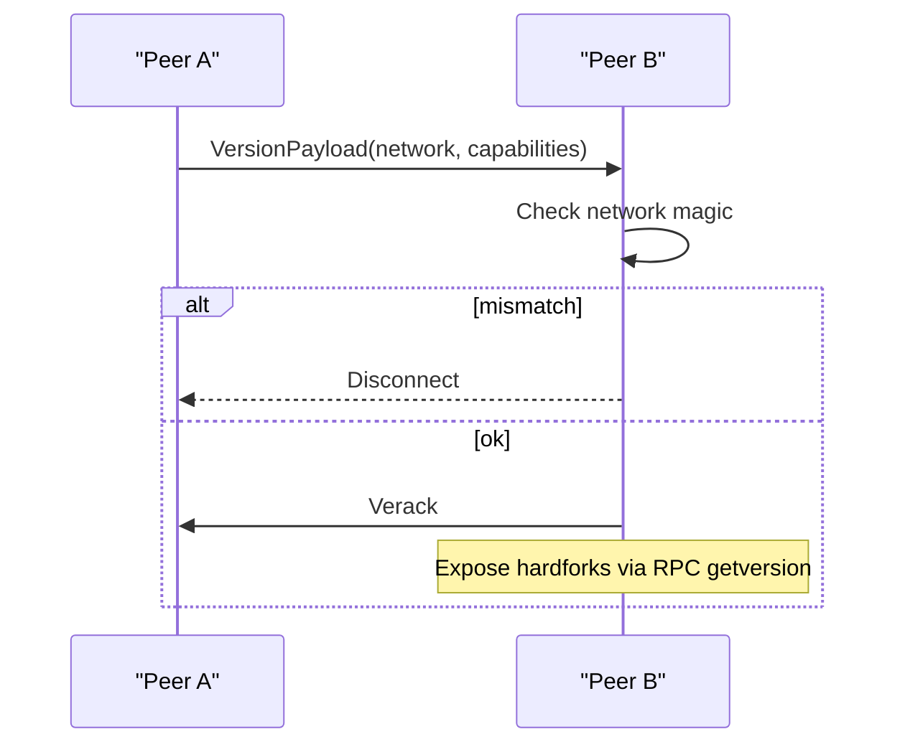
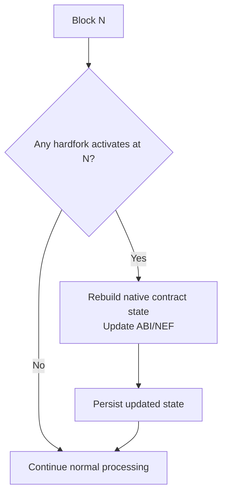
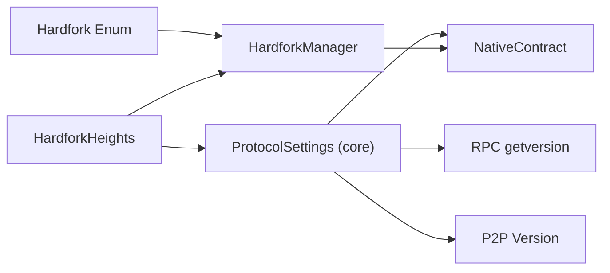

# Hardfork Implementation

<cite>
**Referenced Files in This Document**
- [hardfork.rs](file://neo-core/src/hardfork.rs)
- [hardfork.rs](file://neo-primitives/src/hardfork.rs)
- [protocol.rs](file://neo-config/src/protocol.rs)
- [protocol_settings.rs](file://neo-core/src/protocol_settings.rs)
- [native_contract.rs](file://neo-core/src/smart_contract/native/native_contract.rs)
- [hardfork_activable.rs](file://neo-core/src/smart_contract/native/hardfork_activable.rs)
- [tests.rs](file://neo-rpc/src/server/rpc_server_node/tests.rs)
- [mainnet.toml](file://config/mainnet.toml)
</cite>

## Table of Contents
1. Introduction
2. Project Structure
3. Core Components
4. Architecture Overview
5. Detailed Component Analysis
6. Dependency Analysis
7. Performance Considerations
8. Troubleshooting Guide
9. Conclusion
10. Appendices

## Introduction
This document explains how hardforks are implemented in Neo-RS to introduce protocol changes safely and predictably. It covers activation mechanisms, version negotiation, backward compatibility, conditional logic by hardfork level, data structure migration, state transitions, configuration, network coordination, rollback procedures, examples from previous hardforks, testing strategies, and governance processes for deployment.

## Project Structure
Neo-RS implements hardforks through a layered design:
- Protocol-level configuration defines activation heights per network (mainnet/testnet/private).
- A canonical hardfork enumeration provides a single source of truth for hardfork identity and ordering.
- A manager and settings layer expose activation checks at runtime.
- Native contracts and methods use activation metadata to gate features and rebuild manifests on activation blocks.
- P2P and RPC layers expose version information including configured hardforks for peer discovery and monitoring.

**Diagram sources**
- [protocol.rs:106-140](file://neo-config/src/protocol.rs#L106-L140)
- [hardfork.rs:9-34](file://neo-primitives/src/hardfork.rs#L9-L34)
- [hardfork.rs:44-140](file://neo-core/src/hardfork.rs#L44-L140)
- [protocol_settings.rs:95-140](file://neo-core/src/protocol_settings.rs#L95-L140)
- [native_contract.rs:21-127](file://neo-core/src/smart_contract/native/native_contract.rs#L21-L127)
- [tests.rs:400-421](file://neo-rpc/src/server/rpc_server_node/tests.rs#L400-L421)

**Section sources**
- [protocol.rs:106-140](file://neo-config/src/protocol.rs#L106-L140)
- [hardfork.rs:9-34](file://neo-primitives/src/hardfork.rs#L9-L34)
- [hardfork.rs:44-140](file://neo-core/src/hardfork.rs#L44-L140)
- [protocol_settings.rs:95-140](file://neo-core/src/protocol_settings.rs#L95-L140)
- [native_contract.rs:21-127](file://neo-core/src/smart_contract/native/native_contract.rs#L21-L127)
- [tests.rs:400-421](file://neo-rpc/src/server/rpc_server_node/tests.rs#L400-L421)

## Core Components
- Hardfork enumeration: Canonical list of hardforks with indices, string parsing, and ordering.
- HardforkManager: Stores activation heights per hardfork; exposes is_enabled checks.
- ProtocolSettings (core): Converts config into runtime map; ensures omitted earlier hardforks default to genesis activation for parity; exposes is_hardfork_enabled.
- Native contract activation: Methods and contracts can be gated by active_in/deprecated_in; manifest rebuilt on activation blocks.
- Network exposure: RPC getversion includes configured hardforks; P2P capabilities negotiated during handshake.

Key behaviors:
- Activation is height-based and monotonic: once enabled, stays enabled.
- Omitted earlier hardforks default to 0 in core defaults to match C# behavior.
- Native contracts refresh their ABI/NEF when an activation block is reached.

**Section sources**
- [hardfork.rs:9-34](file://neo-primitives/src/hardfork.rs#L9-L34)
- [hardfork.rs:44-140](file://neo-core/src/hardfork.rs#L44-L140)
- [protocol_settings.rs:163-200](file://neo-core/src/protocol_settings.rs#L163-L200)
- [native_contract.rs:21-127](file://neo-core/src/smart_contract/native/native_contract.rs#L21-L127)
- [tests.rs:400-421](file://neo-rpc/src/server/rpc_server_node/tests.rs#L400-L421)

## Architecture Overview
The hardfork system spans configuration, core types, runtime checks, and network interfaces.

**Diagram sources**
- [protocol.rs:106-140](file://neo-config/src/protocol.rs#L106-L140)
- [protocol_settings.rs:95-140](file://neo-core/src/protocol_settings.rs#L95-L140)
- [native_contract.rs:84-127](file://neo-core/src/smart_contract/native/native_contract.rs#L84-L127)
- [tests.rs:400-421](file://neo-rpc/src/server/rpc_server_node/tests.rs#L400-L421)

## Detailed Component Analysis

### Hardfork Enumeration and Manager
- The Hardfork enum defines all known hardforks with stable indices and string aliases.
- HardforkManager stores a map from Hardfork to activation height and exposes:
  - all(): ordered list of known hardforks
  - mainnet()/testnet(): prebuilt managers from network configs
  - register(hf, height): dynamic registration
  - is_enabled(hf, height): boolean check
  - get_hardforks(): read-only access for diagnostics

**Diagram sources**
- [hardfork.rs:9-34](file://neo-primitives/src/hardfork.rs#L9-L34)
- [hardfork.rs:44-140](file://neo-core/src/hardfork.rs#L44-L140)

**Section sources**
- [hardfork.rs:9-34](file://neo-primitives/src/hardfork.rs#L9-L34)
- [hardfork.rs:44-140](file://neo-core/src/hardfork.rs#L44-L140)

### Protocol Settings and Activation Logic
- neo-config::ProtocolSettings holds HardforkHeights per network (mainnet/testnet/private).
- neo-core::ProtocolSettings converts config into a HashMap<Hardfork, u32>, ensuring omitted earlier hardforks default to 0 to match C# semantics.
- is_hardfork_enabled(hf, height) returns true when height >= activation_height.

**Diagram sources**
- [protocol.rs:106-140](file://neo-config/src/protocol.rs#L106-L140)
- [protocol_settings.rs:163-200](file://neo-core/src/protocol_settings.rs#L163-L200)
- [protocol_settings.rs:280-295](file://neo-core/src/protocol_settings.rs#L280-L295)

**Section sources**
- [protocol.rs:106-140](file://neo-config/src/protocol.rs#L106-L140)
- [protocol_settings.rs:163-200](file://neo-core/src/protocol_settings.rs#L163-L200)
- [protocol_settings.rs:280-295](file://neo-core/src/protocol_settings.rs#L280-L295)

### Native Contract Activation and State Transitions
- Native contracts and methods can declare active_in and deprecated_in via HardforkActivable.
- On each block, the engine registers native contracts that are active and initializes them on activation blocks.
- When a hardfork activates, the contract’s manifest and NEF are rebuilt to include newly active methods and events.

**Diagram sources**
- [native_contract.rs:21-127](file://neo-core/src/smart_contract/native/native_contract.rs#L21-L127)
- [hardfork_activable.rs:1-12](file://neo-core/src/smart_contract/native/hardfork_activable.rs#L1-L12)
- [protocol_settings.rs:194-200](file://neo-core/src/protocol_settings.rs#L194-L200)

**Section sources**
- [native_contract.rs:21-127](file://neo-core/src/smart_contract/native/native_contract.rs#L21-L127)
- [hardfork_activable.rs:1-12](file://neo-core/src/smart_contract/native/hardfork_activable.rs#L1-L12)

### Network Coordination and Version Negotiation
- P2P peers exchange capabilities and network magic during handshake; mismatched networks are rejected.
- RPC getversion exposes configured hardforks so operators can verify node configuration.

**Diagram sources**
- [remote_node.rs:248-282](file://neo-core/src/network/p2p/remote_node.rs#L248-L282)
- [tests.rs:400-421](file://neo-rpc/src/server/rpc_server_node/tests.rs#L400-L421)

**Section sources**
- [remote_node.rs:248-282](file://neo-core/src/network/p2p/remote_node.rs#L248-L282)
- [tests.rs:400-421](file://neo-rpc/src/server/rpc_server_node/tests.rs#L400-L421)

### Configuration Process and Backward Compatibility
- Configure activation heights per network in neo-config::ProtocolSettings::mainnet()/testnet().
- Core defaults ensure omitted earlier hardforks are treated as activated at genesis to preserve parity with C# reference implementation.
- For private networks, set empty or custom hardfork heights as needed.

Practical steps:
- Add new hardfork to HardforkHeights and update built-in network presets.
- Gate new features using active_in/deprecated_in on native methods/contracts.
- Validate via RPC getversion and P2P capability checks.

**Section sources**
- [protocol.rs:193-315](file://neo-config/src/protocol.rs#L193-L315)
- [protocol_settings.rs:163-200](file://neo-core/src/protocol_settings.rs#L163-L200)
- [protocol_settings.rs:280-295](file://neo-core/src/protocol_settings.rs#L280-L295)

### Data Migration and State Transitions
- On activation blocks, native contracts rebuild their state metadata (ABI/NEF) to reflect new methods/events.
- Use is_initialize_block to detect when to reinitialize contract state.
- For storage schema changes, guard writes/reads with is_hardfork_enabled checks to maintain backward compatibility across forks.

**Diagram sources**
- [native_contract.rs:84-127](file://neo-core/src/smart_contract/native/native_contract.rs#L84-L127)

**Section sources**
- [native_contract.rs:84-127](file://neo-core/src/smart_contract/native/native_contract.rs#L84-L127)

### Rollback Procedures
- If a hardfork introduces issues, operators can roll back nodes to a prior version and revert configuration to exclude the problematic hardfork activation height.
- Nodes without the hardfork configured will treat it as disabled and continue processing under older rules.
- Ensure consensus participants coordinate to avoid divergence.

Operational notes:
- Monitor getversion outputs across validators to confirm alignment.
- Keep backups of state and recovery logs before upgrades.
- Use testnet validation and replay tests to validate rollback safety.

[No sources needed since this section provides general guidance]

### Examples from Previous Hardforks
- Mainnet/TestNet presets define activation heights for multiple hardforks (e.g., Aspidochelone, Basilisk, Echidna, Faun, Gorgon).
- Tests assert activation boundaries around these heights to ensure correct behavior.

Examples to review:
- Mainnet/TestNet preset definitions and assertions.
- Unit tests validating is_enabled at exact boundary heights.

**Section sources**
- [protocol.rs:193-315](file://neo-config/src/protocol.rs#L193-L315)
- [hardfork.rs:149-195](file://neo-core/src/hardfork.rs#L149-L195)

### Testing Strategies
Pre-activation testing:
- Use local configurations to simulate upcoming hardfork activation heights.
- Exercise native contract methods gated by active_in to ensure readiness.

Activation monitoring:
- Poll RPC getversion to confirm hardforks array reflects expected configuration.
- Observe P2P capabilities and version payloads for consistency.

Post-activation validation:
- Replay known blocks against the new ruleset to verify deterministic state transitions.
- Compare native contract ABIs/NEFs before and after activation to ensure updates occurred.

**Section sources**
- [tests.rs:400-421](file://neo-rpc/src/server/rpc_server_node/tests.rs#L400-L421)
- [native_contract.rs:84-127](file://neo-core/src/smart_contract/native/native_contract.rs#L84-L127)

### Governance and Community Coordination
- Coordinate activation heights across validators via official network presets.
- Publish upgrade plans and timelines; allow time for node operators to update configurations.
- Validate on testnet first; then promote to mainnet with agreed heights.
- Maintain transparency through RPC getversion and public logs.

[No sources needed since this section provides general guidance]

## Dependency Analysis

**Diagram sources**
- [hardfork.rs:44-140](file://neo-core/src/hardfork.rs#L44-L140)
- [protocol.rs:106-140](file://neo-config/src/protocol.rs#L106-L140)
- [protocol_settings.rs:95-140](file://neo-core/src/protocol_settings.rs#L95-L140)
- [native_contract.rs:21-127](file://neo-core/src/smart_contract/native/native_contract.rs#L21-L127)
- [tests.rs:400-421](file://neo-rpc/src/server/rpc_server_node/tests.rs#L400-L421)

**Section sources**
- [hardfork.rs:44-140](file://neo-core/src/hardfork.rs#L44-L140)
- [protocol.rs:106-140](file://neo-config/src/protocol.rs#L106-L140)
- [protocol_settings.rs:95-140](file://neo-core/src/protocol_settings.rs#L95-L140)
- [native_contract.rs:21-127](file://neo-core/src/smart_contract/native/native_contract.rs#L21-L127)
- [tests.rs:400-421](file://neo-rpc/src/server/rpc_server_node/tests.rs#L400-L421)

## Performance Considerations
- Hardfork checks are simple comparisons and should have negligible overhead.
- Native contract manifest rebuild occurs only on activation blocks, minimizing repeated work.
- Avoid heavy branching inside hot paths; prefer early exits based on is_hardfork_enabled.

[No sources needed since this section provides general guidance]

## Troubleshooting Guide
Common issues and resolutions:
- Hardfork not activating: Verify activation height in configuration matches network expectations; ensure omitted earlier hardforks default to 0 in core defaults.
- RPC getversion missing hardforks: Confirm configuration file is loaded and contains the expected hardfork entries.
- P2P connection failures: Check network magic mismatch; ensure peers share the same network and compatible capabilities.
- Native method unavailable: Ensure active_in is set correctly and block height has reached activation; verify manifest rebuild occurred.

**Section sources**
- [protocol_settings.rs:163-200](file://neo-core/src/protocol_settings.rs#L163-L200)
- [tests.rs:400-421](file://neo-rpc/src/server/rpc_server_node/tests.rs#L400-L421)
- [remote_node.rs:248-282](file://neo-core/src/network/p2p/remote_node.rs#L248-L282)
- [native_contract.rs:84-127](file://neo-core/src/smart_contract/native/native_contract.rs#L84-L127)

## Conclusion
Neo-RS implements hardforks through a clear separation of configuration, canonical identifiers, runtime checks, and network exposure. By gating features with active_in/deprecated_in, rebuilding native manifests on activation blocks, and exposing configuration via RPC and P2P, the system supports safe, coordinated protocol evolution. Proper testing, monitoring, and governance ensure smooth deployments and reliable rollbacks when necessary.

## Appendices

### Appendix A: Adding a New Hardfork
Steps:
- Define the new hardfork in the canonical enum (if not already present).
- Add activation height to network presets in neo-config::ProtocolSettings.
- Gate new features using active_in/deprecated_in on native methods/contracts.
- Validate with unit tests and integration tests; monitor via RPC getversion.

**Section sources**
- [hardfork.rs:9-34](file://neo-primitives/src/hardfork.rs#L9-L34)
- [protocol.rs:193-315](file://neo-config/src/protocol.rs#L193-L315)
- [native_contract.rs:21-127](file://neo-core/src/smart_contract/native/native_contract.rs#L21-L127)

### Appendix B: Example Hardfork Activations
- Mainnet/TestNet presets include multiple hardforks with specific heights.
- Tests assert activation boundaries to ensure correctness.

**Section sources**
- [protocol.rs:193-315](file://neo-config/src/protocol.rs#L193-L315)
- [hardfork.rs:149-195](file://neo-core/src/hardfork.rs#L149-L195)