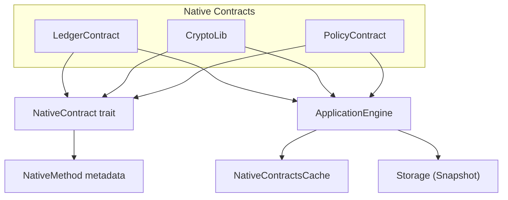
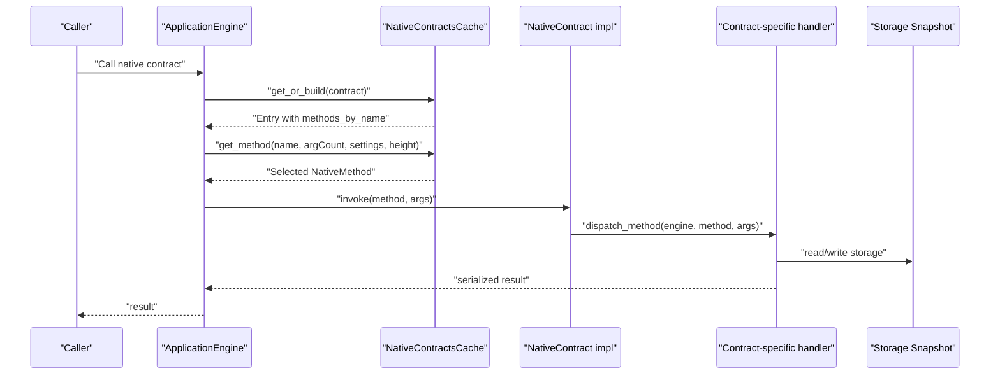
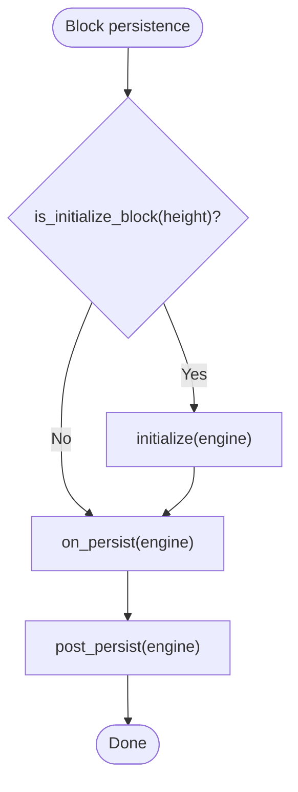
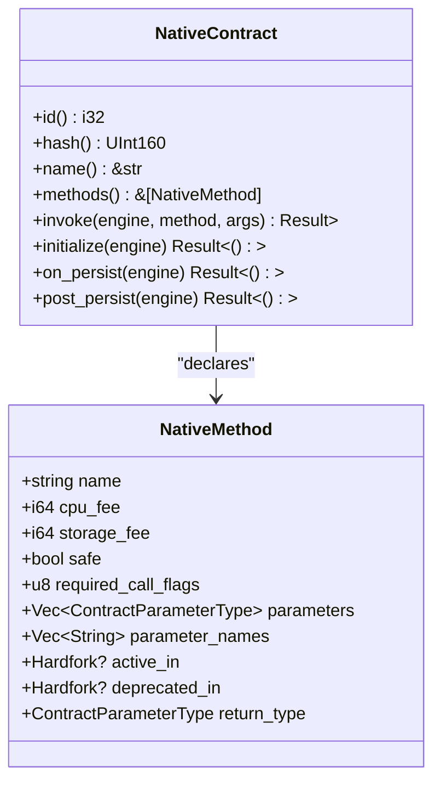
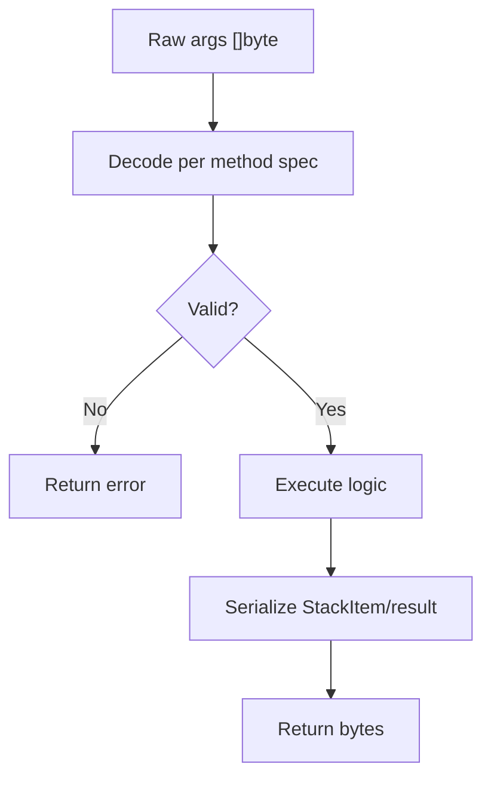
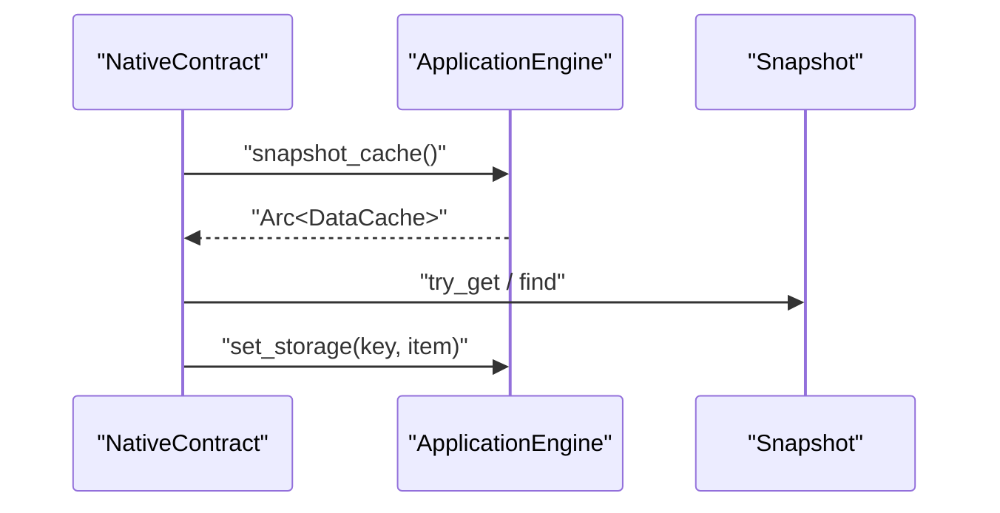
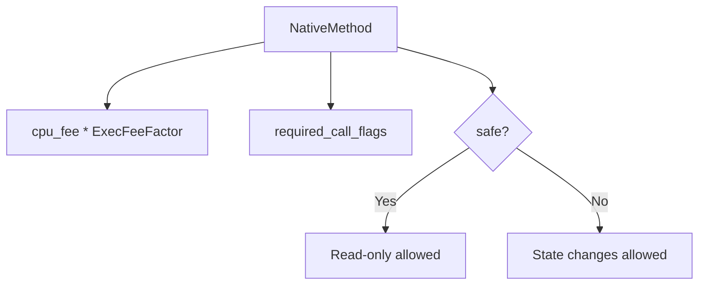
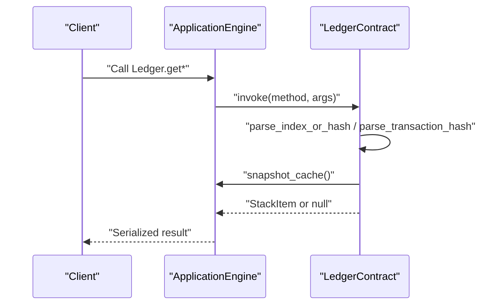
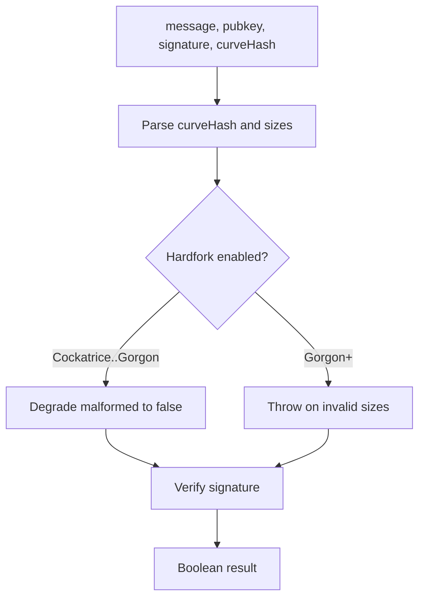
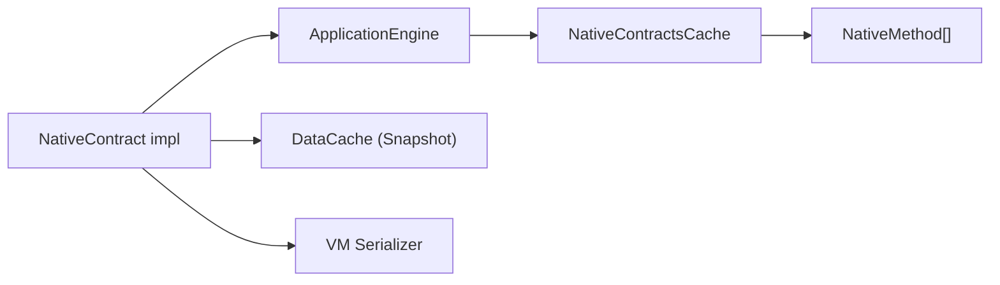

# Native Contract Development

<cite>
**Referenced Files in This Document**
- [native_contract.rs](file://neo-core/src/smart_contract/native/native_contract.rs)
- [native_contract_cache.rs](file://neo-core/src/smart_contract/native/native_contract_cache.rs)
- [ledger native_impl.rs](file://neo-core/src/smart_contract/nаtive/ledger_contract/native_impl.rs)
- [policy native_impl.rs](file://neo-core/src/smart_contract/native/policy_contract/native_impl.rs)
- [crypto_lib mod.rs](file://neo-core/src/smart_contract/native/crypto_lib/mod.rs)
- [native_contract_tests.rs](file://neo-core/tests/native_contract_tests.rs)
</cite>

## Table of Contents
1. Introduction
2. Project Structure
3. Core Components
4. Architecture Overview
5. Detailed Component Analysis
6. Dependency Analysis
7. Performance Considerations
8. Troubleshooting Guide
9. Conclusion
10. Appendices

## Introduction
This document explains how to develop native contracts that extend Neo’s core functionality using the Rust implementation. It covers the native contract lifecycle, registration and discovery, method invocation patterns, parameter marshalling and return value handling, storage access, gas metering, event emission, and upgrade behavior via hardforks. It also provides examples from existing native contracts such as Ledger, CryptoLib, and Policy, and outlines security considerations, privilege escalation prevention, and testing strategies including unit tests, integration tests, and compatibility verification.

## Project Structure
Native contracts are implemented under the smart contract subsystem and exposed through a common trait and helper infrastructure:
- The base trait and method metadata live in the native contract module.
- Each built-in native contract (Ledger, CryptoLib, Policy, etc.) implements the trait and provides its own methods and lifecycle hooks.
- A cache optimizes method lookup by name and activation state.
- Tests validate manifest generation, activation semantics, and cross-version compatibility.

**Diagram sources**
- [native_contract.rs:21-163](file://neo-core/src/smart_contract/native/native_contract.rs#L21-L163)
- [native_contract_cache.rs:7-73](file://neo-core/src/smart_contract/native/native_contract_cache.rs#L7-L73)
- [ledger native_impl.rs:21-118](file://neo-core/src/smart_contract/native/ledger_contract/native_impl.rs#L21-L118)
- [policy native_impl.rs:8-149](file://neo-core/src/smart_contract/native/policy_contract/native_impl.rs#L8-L149)
- [crypto_lib mod.rs:229-258](file://neo-core/src/smart_contract/native/crypto_lib/mod.rs#L229-L258)

**Section sources**
- [native_contract.rs:21-163](file://neo-core/src/smart_contract/native/native_contract.rs#L21-L163)
- [native_contract_cache.rs:7-73](file://neo-core/src/smart_contract/native/native_contract_cache.rs#L7-L73)

## Core Components
- NativeContract trait: Defines identity, methods, activation checks, lifecycle hooks (initialize, on_persist, post_persist), and invoke dispatch for each native contract.
- NativeMethod: Declares method name, CPU/storage fees, safety flags, required call flags, parameters, return type, and activation/deprecation hardforks.
- BaseNativeContract and macros: Provide shared implementations for hash/name/methods/invoke/as_any to reduce boilerplate.
- NativeContractsCache: Caches per-contract method tables and resolves active methods by name and argument count at a given block height.

Key responsibilities:
- Lifecycle: initialize runs once at genesis or hardfork activation; on_persist/post_persist run during block persistence.
- Invocation: invoke routes to a contract-specific dispatcher that validates arguments and returns serialized results.
- Manifest generation: builds ABI descriptors and NEF scripts for each active method based on hardfork settings.

**Section sources**
- [native_contract.rs:21-163](file://neo-core/src/smart_contract/native/native_contract.rs#L21-L163)
- [native_contract.rs:165-331](file://neo-core/src/smart_contract/native/native_contract.rs#L165-L331)
- [native_contract.rs:333-435](file://neo-core/src/smart_contract/native/native_contract.rs#L333-L435)
- [native_contract_cache.rs:7-73](file://neo-core/src/smart_contract/native/native_contract_cache.rs#L7-L73)

## Architecture Overview
The runtime invokes native contracts via the ApplicationEngine. Method resolution uses the cache to find the correct NativeMethod considering activation state. The contract’s invoke method then dispatches to a typed handler, which reads/writes storage, emits events, and returns serialized data.

**Diagram sources**
- [native_contract_cache.rs:14-73](file://neo-core/src/smart_contract/native/native_contract_cache.rs#L14-L73)
- [native_contract.rs:138-163](file://neo-core/src/smart_contract/native/native_contract.rs#L138-L163)
- [ledger native_impl.rs:38-45](file://neo-core/src/smart_contract/native/ledger_contract/native_impl.rs#L38-L45)
- [crypto_lib mod.rs:246-253](file://neo-core/src/smart_contract/native/crypto_lib/mod.rs#L246-L253)

## Detailed Component Analysis

### NativeContract Trait and Lifecycle
- Identity and discovery: id(), hash(), name() identify the contract.
- Activation: is_active() and is_initialize_block() determine when a contract should be initialized or refreshed based on protocol hardforks.
- Lifecycle hooks:
  - initialize(): one-time setup at genesis or hardfork activation.
  - on_persist(): executed during OnPersist phase to persist block-level state.
  - post_persist(): executed after persistence to finalize updates.
- Invocation: invoke() delegates to a contract-specific dispatcher.

**Diagram sources**
- [native_contract.rs:84-159](file://neo-core/src/smart_contract/native/native_contract.rs#L84-L159)

**Section sources**
- [native_contract.rs:21-163](file://neo-core/src/smart_contract/native/native_contract.rs#L21-L163)

### Method Metadata and Manifest Generation
- NativeMethod captures:
  - cpu_fee and storage_fee for cost accounting.
  - safe flag and required_call_flags to enforce permissions.
  - parameters and return_type for ABI.
  - active_in and deprecated_in for hardfork gating.
- build_native_contract_state filters methods by activation and generates:
  - ABI method descriptors with offsets into an embedded script.
  - NEF file containing syscall stubs for each method.
  - ContractManifest with supported standards and events.

**Diagram sources**
- [native_contract.rs:165-331](file://neo-core/src/smart_contract/native/native_contract.rs#L165-L331)
- [native_contract.rs:437-512](file://neo-core/src/smart_contract/native/native_contract.rs#L437-L512)

**Section sources**
- [native_contract.rs:165-331](file://neo-core/src/smart_contract/native/native_contract.rs#L165-L331)
- [native_contract.rs:437-512](file://neo-core/src/smart_contract/native/native_contract.rs#L437-L512)

### Parameter Marshalling and Return Values
- Parameters arrive as raw byte arrays; contracts decode them according to expected types.
- Examples:
  - LedgerContract parses index-or-hash by length and signed integer encoding, and decodes transaction hashes.
  - CryptoLib decodes named curve/hash integers and signature/public key sizes.
- Return values are serialized to bytes using the VM serializer and returned to the caller.

**Diagram sources**
- [ledger native_impl.rs:397-431](file://neo-core/src/smart_contract/native/ledger_contract/native_impl.rs#L397-L431)
- [crypto_lib mod.rs:72-86](file://neo-core/src/smart_contract/native/crypto_lib/mod.rs#L72-L86)
- [crypto_lib mod.rs:128-154](file://neo-core/src/smart_contract/native/crypto_lib/mod.rs#L128-L154)

**Section sources**
- [ledger native_impl.rs:397-431](file://neo-core/src/smart_contract/native/ledger_contract/native_impl.rs#L397-L431)
- [crypto_lib mod.rs:72-86](file://neo-core/src/smart_contract/native/crypto_lib/mod.rs#L72-L86)
- [crypto_lib mod.rs:128-154](file://neo-core/src/smart_contract/native/crypto_lib/mod.rs#L128-L154)

### Storage Access Patterns
- Use engine.snapshot_cache() to obtain a read-only snapshot for consistent reads.
- Write changes via engine.set_storage(key, item) during initialize/on_persist/post_persist.
- PolicyContract initializes default policy values if missing and applies hardfork-specific migrations (e.g., scaling exec fee factor at a specific hardfork).

**Diagram sources**
- [policy native_impl.rs:23-46](file://neo-core/src/smart_contract/native/policy_contract/native_impl.rs#L23-L46)
- [policy native_impl.rs:48-97](file://neo-core/src/smart_contract/native/policy_contract/native_impl.rs#L48-L97)

**Section sources**
- [policy native_impl.rs:23-46](file://neo-core/src/smart_contract/native/policy_contract/native_impl.rs#L23-L46)
- [policy native_impl.rs:48-97](file://neo-core/src/smart_contract/native/policy_contract/native_impl.rs#L48-L97)

### Gas Metering and Call Flags
- Each NativeMethod declares cpu_fee and storage_fee used to compute execution costs.
- Methods declare required_call_flags to restrict capabilities (e.g., READ_STATES vs STATES | ALLOW_NOTIFY).
- Safe methods indicate read-only operations.

**Diagram sources**
- [native_contract.rs:165-205](file://neo-core/src/smart_contract/native/native_contract.rs#L165-L205)
- [native_contract.rs:207-300](file://neo-core/src/smart_contract/native/native_contract.rs#L207-L300)

**Section sources**
- [native_contract.rs:165-205](file://neo-core/src/smart_contract/native/native_contract.rs#L165-L205)
- [native_contract.rs:207-300](file://neo-core/src/smart_contract/native/native_contract.rs#L207-L300)

### Event Emission
- Events are declared per contract via events() and included in the manifest ABI.
- Tests verify event descriptors evolve across hardforks (e.g., RoleManagement adding new fields).

**Section sources**
- [native_contract.rs:129-136](file://neo-core/src/smart_contract/native/native_contract.rs#L129-L136)
- [native_contract_tests.rs:200-239](file://neo-core/tests/native_contract_tests.rs#L200-L239)

### Example: Ledger Contract
- Provides queries for current hash/index, blocks, transactions, and VM states.
- Enforces traceability windows based on policy and hardfork configuration.
- Persists transaction states and conflict stubs during on_persist/post_persist.

**Diagram sources**
- [ledger native_impl.rs:174-362](file://neo-core/src/smart_contract/native/ledger_contract/native_impl.rs#L174-L362)
- [ledger native_impl.rs:364-450](file://neo-core/src/smart_contract/native/ledger_contract/native_impl.rs#L364-L450)

**Section sources**
- [ledger native_impl.rs:21-118](file://neo-core/src/smart_contract/native/ledger_contract/native_impl.rs#L21-L118)
- [ledger native_impl.rs:174-362](file://neo-core/src/smart_contract/native/ledger_contract/native_impl.rs#L174-L362)
- [ledger native_impl.rs:364-450](file://neo-core/src/smart_contract/native/ledger_contract/native_impl.rs#L364-L450)

### Example: CryptoLib Contract
- Implements hashing primitives (SHA-256, RIPEMD-160, Murmur32, Keccak-256).
- Signature verification functions with version-dependent behavior across hardforks.
- Public key recovery for secp256k1.

**Diagram sources**
- [crypto_lib mod.rs:88-154](file://neo-core/src/smart_contract/native/crypto_lib/mod.rs#L88-L154)
- [crypto_lib mod.rs:156-203](file://neo-core/src/smart_contract/native/crypto_lib/mod.rs#L156-L203)

**Section sources**
- [crypto_lib mod.rs:22-227](file://neo-core/src/smart_contract/native/crypto_lib/mod.rs#L22-L227)
- [crypto_lib mod.rs:229-258](file://neo-core/src/smart_contract/native/crypto_lib/mod.rs#L229-L258)

### Example: Policy Contract
- Initializes default policy values and migrates stored values at specific hardforks.
- Manages attributes like milliseconds per block, max traceable blocks, and attribute fees.

**Section sources**
- [policy native_impl.rs:8-149](file://neo-core/src/smart_contract/native/policy_contract/native_impl.rs#L8-L149)

## Dependency Analysis
- Native contracts depend on:
  - ApplicationEngine for storage, protocol settings, and hardfork checks.
  - Persistence layer via DataCache snapshots for consistent reads.
  - VM serialization utilities for returning results.
- The cache reduces repeated method table construction and ensures unambiguous method selection by name and argument count.

**Diagram sources**
- [native_contract_cache.rs:7-73](file://neo-core/src/smart_contract/native/native_contract_cache.rs#L7-L73)
- [ledger native_impl.rs:364-450](file://neo-core/src/smart_contract/native/ledger_contract/native_impl.rs#L364-L450)
- [crypto_lib mod.rs:246-253](file://neo-core/src/smart_contract/native/crypto_lib/mod.rs#L246-L253)

**Section sources**
- [native_contract_cache.rs:7-73](file://neo-core/src/smart_contract/native/native_contract_cache.rs#L7-L73)

## Performance Considerations
- Prefer read-only operations marked safe where possible to minimize state mutations.
- Use snapshot reads to avoid unnecessary recomputation and ensure consistency.
- Minimize storage writes in hot paths; batch updates in post_persist when appropriate.
- Leverage method metadata to set accurate cpu_fee and storage_fee to reflect actual resource usage.

[No sources needed since this section provides general guidance]

## Troubleshooting Guide
Common issues and diagnostics:
- Ambiguous method selection: The cache returns an error if multiple active methods match the same name and argument count at a given height.
- Invalid argument decoding: Ensure input lengths and encodings match expectations (e.g., 32-byte hashes vs signed integers for indices).
- Hardfork-related behavior differences: Some methods degrade errors to false before certain hardforks and throw afterwards; verify hardfork flags in the engine context.
- Missing storage keys: Initialize defaults in initialize() to prevent runtime errors on first use.

**Section sources**
- [native_contract_cache.rs:44-73](file://neo-core/src/smart_contract/native/native_contract_cache.rs#L44-L73)
- [ledger native_impl.rs:397-431](file://neo-core/src/smart_contract/native/ledger_contract/native_impl.rs#L397-L431)
- [crypto_lib mod.rs:102-154](file://neo-core/src/smart_contract/native/crypto_lib/mod.rs#L102-L154)
- [policy native_impl.rs:23-46](file://neo-core/src/smart_contract/native/policy_contract/native_impl.rs#L23-L46)

## Conclusion
Native contracts in Neo provide powerful, high-performance extensions to the blockchain. By implementing the NativeContract trait, defining precise method metadata, and adhering to lifecycle hooks, developers can integrate seamlessly with the runtime. Proper parameter marshalling, careful storage access, and accurate gas and permission metadata ensure correctness and efficiency. Existing contracts like Ledger, CryptoLib, and Policy serve as reference implementations for robust, hardfork-aware behavior.

[No sources needed since this section summarizes without analyzing specific files]

## Appendices

### Security Considerations and Privilege Escalation Prevention
- Enforce required_call_flags to limit what a method can do (e.g., disallow notify unless explicitly intended).
- Mark read-only methods as safe to prevent unintended state mutations.
- Validate all inputs strictly; reject malformed data early to avoid undefined behavior.
- Use hardfork-gated features to control exposure of sensitive functionality over time.

[No sources needed since this section provides general guidance]

### Upgrade Mechanisms via Hardforks
- Use active_in and deprecated_in on methods to enable/disable features at specific heights.
- Implement initialize() migrations to adjust stored values when hardforks activate (as seen in Policy).
- Update events() and supported_standards() to reflect new capabilities.

**Section sources**
- [native_contract.rs:59-82](file://neo-core/src/smart_contract/native/native_contract.rs#L59-L82)
- [policy native_impl.rs:48-149](file://neo-core/src/smart_contract/native/policy_contract/native_impl.rs#L48-L149)

### Testing Strategies
- Unit tests: Validate individual method dispatchers and argument parsing.
- Integration tests: Execute full flows through ApplicationEngine, asserting VM state and results.
- Compatibility verification: Compare generated manifests and method metadata against expected JSON to ensure protocol consistency across hardforks.

**Section sources**
- [native_contract_tests.rs:27-68](file://neo-core/tests/native_contract_tests.rs#L27-L68)
- [native_contract_tests.rs:160-198](file://neo-core/tests/native_contract_tests.rs#L160-L198)
- [native_contract_tests.rs:296-443](file://neo-core/tests/native_contract_tests.rs#L296-L443)