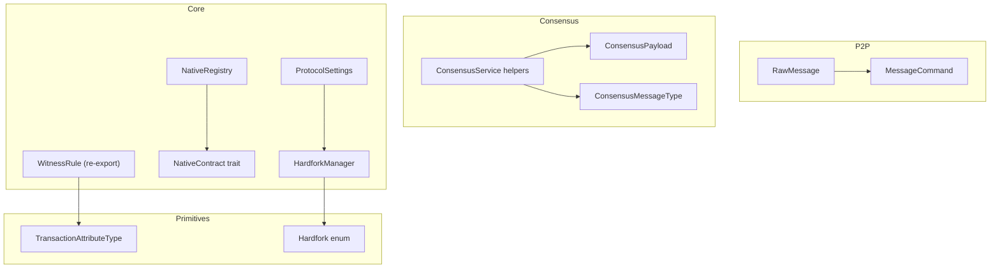
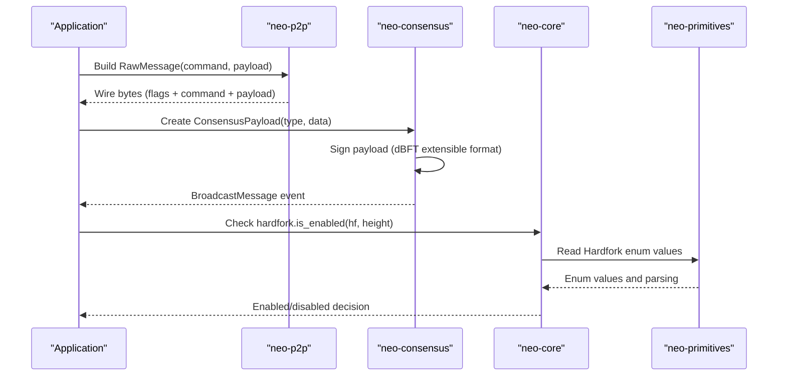
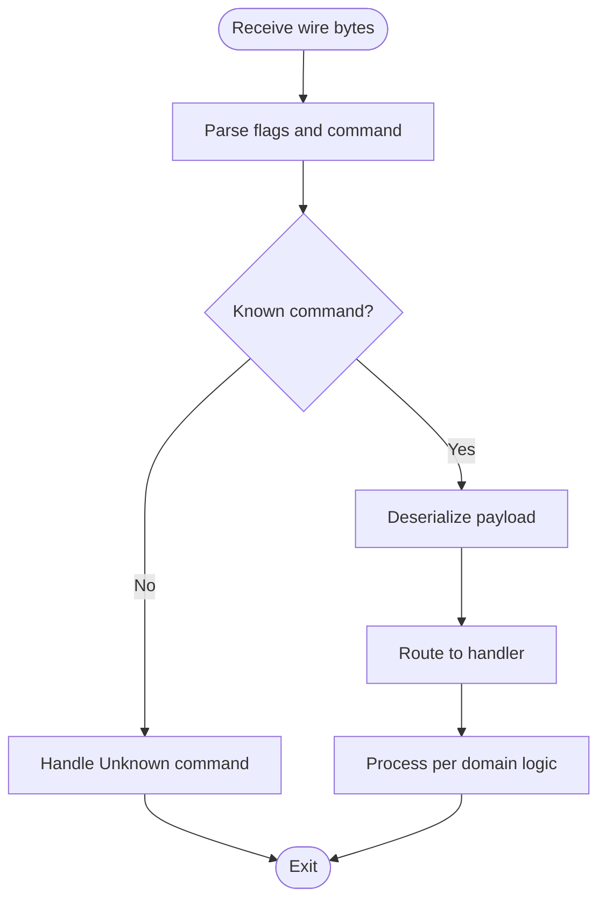
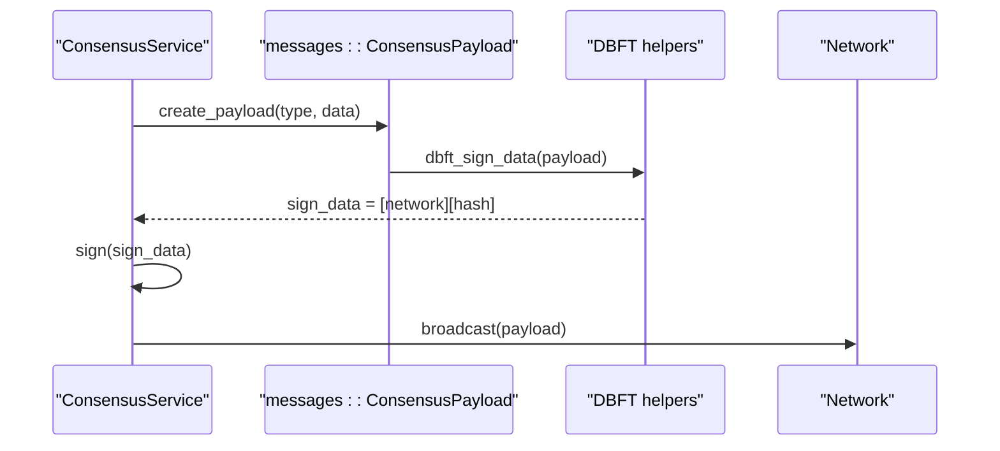
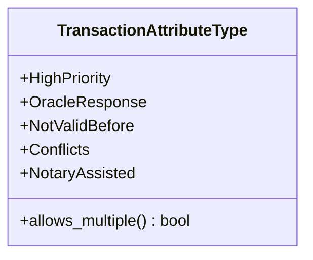
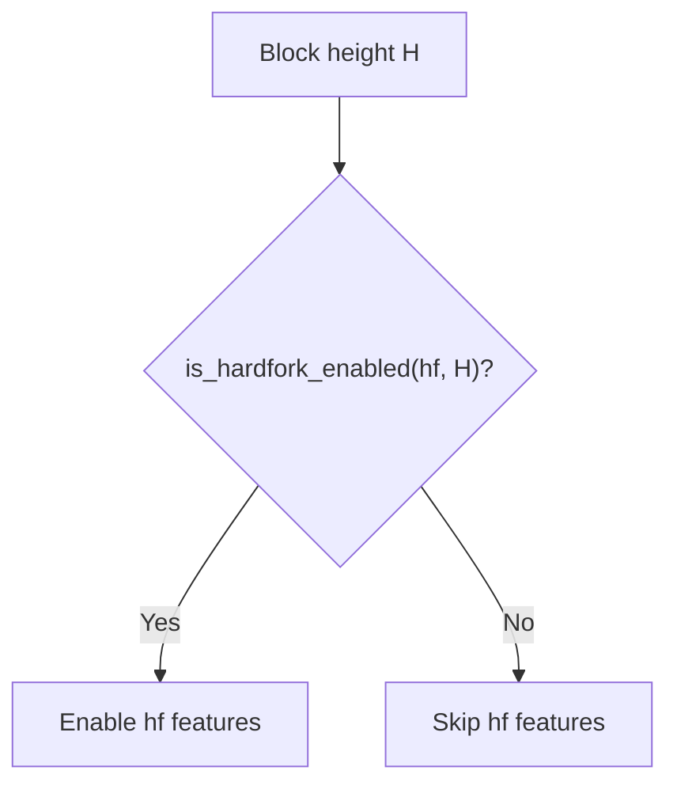
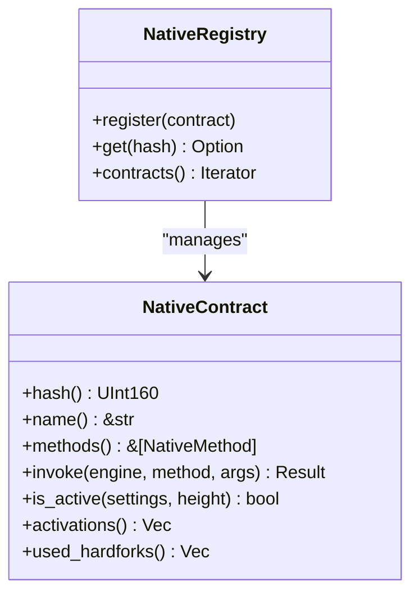
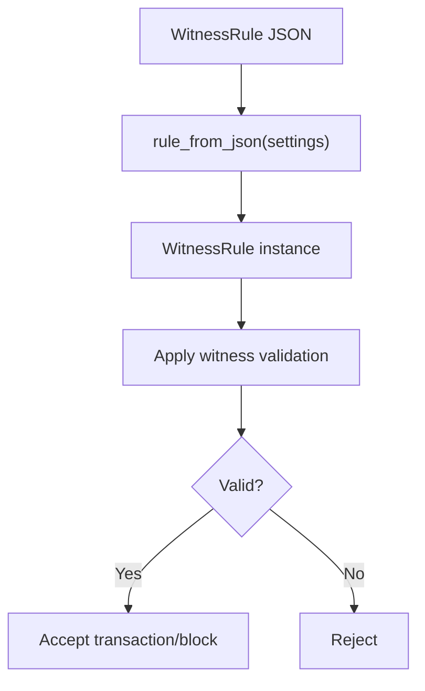
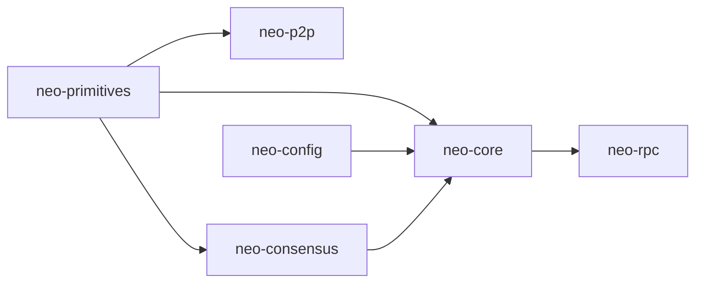

# Protocol Extensions

<cite>
**Referenced Files in This Document**
- [neo-p2p/src/message.rs](file://neo-p2p/src/message.rs)
- [neo-p2p/src/message_command.rs](file://neo-p2p/src/message_command.rs)
- [neo-consensus/src/lib.rs](file://neo-consensus/src/lib.rs)
- [neo-consensus/src/message_type.rs](file://neo-consensus/src/message_type.rs)
- [neo-consensus/src/messages/mod.rs](file://neo-consensus/src/messages/mod.rs)
- [neo-consensus/src/service/helpers/payload.rs](file://neo-consensus/src/service/helpers/payload.rs)
- [neo-consensus/src/service/helpers/dbft.rs](file://neo-consensus/src/service/helpers/dbft.rs)
- [neo-core/src/hardfork.rs](file://neo-core/src/hardfork.rs)
- [neo-primitives/src/hardfork.rs](file://neo-primitives/src/hardfork.rs)
- [neo-config/src/protocol.rs](file://neo-config/src/protocol.rs)
- [neo-core/src/protocol_settings.rs](file://neo-core/src/protocol_settings.rs)
- [neo-primitives/src/transaction_attribute_type.rs](file://neo-primitives/src/transaction_attribute_type.rs)
- [neo-core/src/smart_contract/native/mod.rs](file://neo-core/src/smart_contract/native/mod.rs)
- [neo-core/src/smart_contract/native/native_contract.rs](file://neo-core/src/smart_contract/native/native_contract.rs)
- [neo-core/src/witness_rule.rs](file://neo-core/src/witness_rule.rs)
- [neo-rpc/src/client/utility/witness_rule.rs](file://neo-rpc/src/client/utility/witness_rule.rs)
- [neo-core/tests/protocol_compliance/test_vectors.rs](file://neo-core/tests/protocol_compliance/test_vectors.rs)
</cite>

## Table of Contents
1. Introduction
2. Project Structure
3. Core Components
4. Architecture Overview
5. Detailed Component Analysis
6. Dependency Analysis
7. Performance Considerations
8. Troubleshooting Guide
9. Conclusion
10. Appendices

## Introduction
This document explains how to extend the Neo protocol with custom functionality in neo-rs. It covers:
- Implementing new P2P message types and handling them safely
- Extending consensus beyond dBFT while preserving safety and liveness
- Adding custom transaction attributes and validation rules
- Implementing hardforks, version compatibility, and backward compatibility
- Creating custom native contracts and extending the smart contract platform
- Implementing custom witness rules
- Governance and upgrade mechanisms for consistent network behavior
- Testing strategies to validate extensions against existing implementations

## Project Structure
The extension points are spread across several crates:
- P2P framing and commands live in neo-p2p
- Consensus (dBFT 2.0) lives in neo-consensus
- Protocol primitives (hardforks, attribute types) live in neo-primitives
- Hardfork management and protocol settings live in neo-core and neo-config
- Native contracts and registry live in neo-core
- Witness rule system spans neo-io and is re-exported by neo-core; RPC utilities exist in neo-rpc

**Diagram sources**
- [neo-p2p/src/message.rs:1-106](file://neo-p2p/src/message.rs#L1-L106)
- [neo-p2p/src/message_command.rs:1-154](file://neo-p2p/src/message_command.rs#L1-L154)
- [neo-consensus/src/messages/mod.rs:1-115](file://neo-consensus/src/messages/mod.rs#L1-L115)
- [neo-consensus/src/message_type.rs:1-36](file://neo-consensus/src/message_type.rs#L1-L36)
- [neo-consensus/src/service/helpers/payload.rs:1-48](file://neo-consensus/src/service/helpers/payload.rs#L1-L48)
- [neo-core/src/hardfork.rs:1-196](file://neo-core/src/hardfork.rs#L1-L196)
- [neo-core/src/protocol_settings.rs:183-207](file://neo-core/src/protocol_settings.rs#L183-L207)
- [neo-core/src/smart_contract/native/mod.rs:103-198](file://neo-core/src/smart_contract/native/mod.rs#L103-L198)
- [neo-core/src/smart_contract/native/native_contract.rs:37-76](file://neo-core/src/smart_contract/native/native_contract.rs#L37-L76)
- [neo-primitives/src/transaction_attribute_type.rs:1-123](file://neo-primitives/src/transaction_attribute_type.rs#L1-L123)
- [neo-primitives/src/hardfork.rs:1-190](file://neo-primitives/src/hardfork.rs#L1-L190)

**Section sources**
- [neo-p2p/src/message.rs:1-106](file://neo-p2p/src/message.rs#L1-L106)
- [neo-p2p/src/message_command.rs:1-154](file://neo-p2p/src/message_command.rs#L1-L154)
- [neo-consensus/src/lib.rs:1-285](file://neo-consensus/src/lib.rs#L1-L285)
- [neo-core/src/hardfork.rs:1-196](file://neo-core/src/hardfork.rs#L1-L196)
- [neo-primitives/src/hardfork.rs:1-190](file://neo-primitives/src/hardfork.rs#L1-L190)
- [neo-core/src/smart_contract/native/mod.rs:103-198](file://neo-core/src/smart_contract/native/mod.rs#L103-L198)
- [neo-primitives/src/transaction_attribute_type.rs:1-123](file://neo-primitives/src/transaction_attribute_type.rs#L1-L123)

## Core Components
- P2P message framing: RawMessage handles flags, command, payload serialization/deserialization and optional compression.
- Message commands: MessageCommand enumerates known commands and classifies priority and queueing behavior.
- Consensus: dBFT 2.0 service constructs, signs, and broadcasts ConsensusPayload messages; supports view changes and recovery.
- Hardforks: Hardfork enum defines named upgrades; HardforkManager tracks activation heights; ProtocolSettings provides enablement checks.
- Transaction attributes: TransactionAttributeType enumerates built-in attributes and multiplicity rules.
- Native contracts: NativeRegistry registers standard contracts; NativeContract trait defines lifecycle and method dispatch.
- Witness rules: Re-exported from neo-io with VM-specific stack projection utilities; JSON round-trip support via RPC utilities.

**Section sources**
- [neo-p2p/src/message.rs:1-106](file://neo-p2p/src/message.rs#L1-L106)
- [neo-p2p/src/message_command.rs:1-154](file://neo-p2p/src/message_command.rs#L1-L154)
- [neo-consensus/src/lib.rs:1-285](file://neo-consensus/src/lib.rs#L1-L285)
- [neo-core/src/hardfork.rs:1-196](file://neo-core/src/hardfork.rs#L1-L196)
- [neo-primitives/src/hardfork.rs:1-190](file://neo-primitives/src/hardfork.rs#L1-L190)
- [neo-primitives/src/transaction_attribute_type.rs:1-123](file://neo-primitives/src/transaction_attribute_type.rs#L1-L123)
- [neo-core/src/smart_contract/native/mod.rs:103-198](file://neo-core/src/smart_contract/native/mod.rs#L103-L198)
- [neo-core/src/smart_contract/native/native_contract.rs:37-76](file://neo-core/src/smart_contract/native/native_contract.rs#L37-L76)
- [neo-core/src/witness_rule.rs:1-24](file://neo-core/src/witness_rule.rs#L1-L24)
- [neo-rpc/src/client/utility/witness_rule.rs:156-200](file://neo-rpc/src/client/utility/witness_rule.rs#L156-L200)

## Architecture Overview
The extension surface spans wire formats, consensus state machines, protocol configuration, and runtime contract execution.

**Diagram sources**
- [neo-p2p/src/message.rs:1-106](file://neo-p2p/src/message.rs#L1-L106)
- [neo-consensus/src/messages/mod.rs:1-115](file://neo-consensus/src/messages/mod.rs#L1-L115)
- [neo-consensus/src/service/helpers/payload.rs:1-48](file://neo-consensus/src/service/helpers/payload.rs#L1-L48)
- [neo-core/src/hardfork.rs:1-196](file://neo-core/src/hardfork.rs#L1-L196)
- [neo-primitives/src/hardfork.rs:1-190](file://neo-primitives/src/hardfork.rs#L1-L190)

## Detailed Component Analysis

### P2P Message Extension
To add a new P2P message type:
- Define or register a new MessageCommand if it is not already present. The command enumeration supports unknown commands gracefully and classifies priority and queueing behavior.
- Use RawMessage to serialize/deserialize payloads. Ensure payload size respects limits and consider enabling compression when appropriate.
- Integrate routing and handlers in higher layers (e.g., node services) to process the new command and interact with mempool, ledger, or consensus as needed.

**Diagram sources**
- [neo-p2p/src/message.rs:1-106](file://neo-p2p/src/message.rs#L1-L106)
- [neo-p2p/src/message_command.rs:1-154](file://neo-p2p/src/message_command.rs#L1-L154)

**Section sources**
- [neo-p2p/src/message.rs:1-106](file://neo-p2p/src/message.rs#L1-L106)
- [neo-p2p/src/message_command.rs:1-154](file://neo-p2p/src/message_command.rs#L1-L154)

### Consensus Extension Points
The consensus layer implements dBFT 2.0 with typed messages and signed payloads. To extend consensus:
- Add new message types only if they fit within the dBFT envelope or define a new category that integrates with the existing message pipeline.
- Use ConsensusPayload construction and signing helpers to ensure signatures are over the correct data ([network][payload_hash]).
- Respect view change and recovery flows to maintain safety and liveness.

**Diagram sources**
- [neo-consensus/src/service/helpers/payload.rs:1-48](file://neo-consensus/src/service/helpers/payload.rs#L1-L48)
- [neo-consensus/src/service/helpers/dbft.rs:1-65](file://neo-consensus/src/service/helpers/dbft.rs#L1-L65)
- [neo-consensus/src/messages/mod.rs:1-115](file://neo-consensus/src/messages/mod.rs#L1-L115)

**Section sources**
- [neo-consensus/src/lib.rs:1-285](file://neo-consensus/src/lib.rs#L1-L285)
- [neo-consensus/src/message_type.rs:1-36](file://neo-consensus/src/message_type.rs#L1-L36)
- [neo-consensus/src/messages/mod.rs:1-115](file://neo-consensus/src/messages/mod.rs#L1-L115)
- [neo-consensus/src/service/helpers/payload.rs:1-48](file://neo-consensus/src/service/helpers/payload.rs#L1-L48)
- [neo-consensus/src/service/helpers/dbft.rs:1-65](file://neo-consensus/src/service/helpers/dbft.rs#L1-L65)

### Custom Transaction Attributes
To add a new transaction attribute:
- Extend TransactionAttributeType with a new variant and assign a unique byte code.
- Update multiplicity rules if multiple instances per transaction should be allowed.
- Ensure parsers and validators handle the new attribute consistently across nodes.

**Diagram sources**
- [neo-primitives/src/transaction_attribute_type.rs:1-123](file://neo-primitives/src/transaction_attribute_type.rs#L1-L123)

**Section sources**
- [neo-primitives/src/transaction_attribute_type.rs:1-123](file://neo-primitives/src/transaction_attribute_type.rs#L1-L123)

### Hardfork Implementation Patterns
Hardforks control feature activation at specific block heights:
- Define or use the Hardfork enum as the single source of truth.
- Register activation heights via HardforkManager or ProtocolSettings.
- Gate features behind is_enabled checks at runtime.

**Diagram sources**
- [neo-core/src/hardfork.rs:1-196](file://neo-core/src/hardfork.rs#L1-L196)
- [neo-config/src/protocol.rs:337-361](file://neo-config/src/protocol.rs#L337-L361)
- [neo-core/src/protocol_settings.rs:183-207](file://neo-core/src/protocol_settings.rs#L183-L207)

**Section sources**
- [neo-primitives/src/hardfork.rs:1-190](file://neo-primitives/src/hardfork.rs#L1-L190)
- [neo-core/src/hardfork.rs:1-196](file://neo-core/src/hardfork.rs#L1-L196)
- [neo-config/src/protocol.rs:337-361](file://neo-config/src/protocol.rs#L337-L361)
- [neo-core/src/protocol_settings.rs:183-207](file://neo-core/src/protocol_settings.rs#L183-L207)

### Custom Native Contracts
To add a custom native contract:
- Implement the NativeContract trait (name, hash, methods, invocation).
- Register the contract in NativeRegistry so it can be invoked by the application engine.
- Optionally gate activation to a hardfork using active_in and used_hardforks.

**Diagram sources**
- [neo-core/src/smart_contract/native/native_contract.rs:37-76](file://neo-core/src/smart_contract/native/native_contract.rs#L37-L76)
- [neo-core/src/smart_contract/native/mod.rs:103-198](file://neo-core/src/smart_contract/native/mod.rs#L103-L198)

**Section sources**
- [neo-core/src/smart_contract/native/native_contract.rs:37-76](file://neo-core/src/smart_contract/native/native_contract.rs#L37-L76)
- [neo-core/src/smart_contract/native/mod.rs:103-198](file://neo-core/src/smart_contract/native/mod.rs#L103-L198)

### Custom Witness Rules
Witness rules allow conditional validation of transactions and blocks:
- Use WitnessRule and WitnessCondition types re-exported by neo-core.
- Validate JSON round-trips and parse rules using RPC utilities to ensure interoperability.
- Extend conditions or actions carefully to maintain deterministic behavior across nodes.

**Diagram sources**
- [neo-core/src/witness_rule.rs:1-24](file://neo-core/src/witness_rule.rs#L1-L24)
- [neo-rpc/src/client/utility/witness_rule.rs:156-200](file://neo-rpc/src/client/utility/witness_rule.rs#L156-L200)

**Section sources**
- [neo-core/src/witness_rule.rs:1-24](file://neo-core/src/witness_rule.rs#L1-L24)
- [neo-rpc/src/client/utility/witness_rule.rs:156-200](file://neo-rpc/src/client/utility/witness_rule.rs#L156-L200)

### Version Compatibility and Backward Compatibility
- Unknown P2P commands are preserved and handled gracefully to avoid breaking older peers.
- Hardfork gating ensures new features are only enabled after configured heights.
- Default protocol settings fill omitted hardforks to match reference behavior, preventing silent disabling of features.

**Section sources**
- [neo-p2p/src/message_command.rs:56-154](file://neo-p2p/src/message_command.rs#L56-L154)
- [neo-core/src/hardfork.rs:109-147](file://neo-core/src/hardfork.rs#L109-L147)
- [neo-core/src/protocol_settings.rs:183-207](file://neo-core/src/protocol_settings.rs#L183-L207)
- [neo-core/src/protocol_settings.rs:280-315](file://neo-core/src/protocol_settings.rs#L280-L315)

### Governance and Upgrade Mechanisms
- Hardfork activation heights are centrally configured and checked at runtime to coordinate upgrades across participants.
- Native contracts can be gated by hardforks to roll out features incrementally.
- Consensus messages and payloads are strictly typed and signed to prevent divergence during upgrades.

**Section sources**
- [neo-config/src/protocol.rs:337-361](file://neo-config/src/protocol.rs#L337-L361)
- [neo-core/src/smart_contract/native/native_contract.rs:40-76](file://neo-core/src/smart_contract/native/native_contract.rs#L40-L76)
- [neo-consensus/src/messages/mod.rs:82-115](file://neo-consensus/src/messages/mod.rs#L82-L115)

### Testing Strategies for Protocol Extensions
- Use test vectors to verify behavior against reference implementations.
- Validate P2P message round-trips and consensus payload serialization.
- Exercise hardfork activation paths and native contract invocations under different configurations.

**Section sources**
- [neo-core/tests/protocol_compliance/test_vectors.rs:1-21](file://neo-core/tests/protocol_compliance/test_vectors.rs#L1-L21)

## Dependency Analysis
Extensions must respect established boundaries:
- P2P depends on primitives for error handling and command definitions.
- Consensus depends on primitives and crypto for signing and hashing.
- Core coordinates hardforks and native contracts based on configuration.
- RPC utilities depend on core and primitives for witness rule parsing.

**Diagram sources**
- [neo-p2p/src/message_command.rs:1-154](file://neo-p2p/src/message_command.rs#L1-L154)
- [neo-consensus/src/lib.rs:1-285](file://neo-consensus/src/lib.rs#L1-L285)
- [neo-core/src/hardfork.rs:1-196](file://neo-core/src/hardfork.rs#L1-L196)
- [neo-config/src/protocol.rs:337-361](file://neo-config/src/protocol.rs#L337-L361)
- [neo-rpc/src/client/utility/witness_rule.rs:156-200](file://neo-rpc/src/client/utility/witness_rule.rs#L156-L200)

**Section sources**
- [neo-p2p/src/message_command.rs:1-154](file://neo-p2p/src/message_command.rs#L1-L154)
- [neo-consensus/src/lib.rs:1-285](file://neo-consensus/src/lib.rs#L1-L285)
- [neo-core/src/hardfork.rs:1-196](file://neo-core/src/hardfork.rs#L1-L196)
- [neo-config/src/protocol.rs:337-361](file://neo-config/src/protocol.rs#L337-L361)
- [neo-rpc/src/client/utility/witness_rule.rs:156-200](file://neo-rpc/src/client/utility/witness_rule.rs#L156-L200)

## Performance Considerations
- Prefer compressing large P2P payloads when beneficial; small messages avoid overhead.
- Minimize consensus message sizes and avoid unnecessary recomputation of hashes.
- Gate expensive native contract operations behind hardforks to control activation costs.
- Use efficient serialization and avoid excessive allocations in hot paths.

[No sources needed since this section provides general guidance]

## Troubleshooting Guide
Common issues and remedies:
- Unknown P2P commands: Ensure peers agree on command sets; handle Unknown gracefully to maintain connectivity.
- Hardfork misconfiguration: Verify activation heights and ensure all nodes share consistent settings.
- Consensus signing failures: Confirm correct sign_data computation and private key availability.
- Native contract invocation errors: Check method existence, fees, and hardfork activation.
- Witness rule parsing errors: Validate JSON structure and ensure rule definitions match expected schema.

**Section sources**
- [neo-p2p/src/message.rs:73-106](file://neo-p2p/src/message.rs#L73-L106)
- [neo-core/src/hardfork.rs:109-147](file://neo-core/src/hardfork.rs#L109-L147)
- [neo-consensus/src/service/helpers/payload.rs:1-48](file://neo-consensus/src/service/helpers/payload.rs#L1-L48)
- [neo-core/src/smart_contract/native/native_contract.rs:355-365](file://neo-core/src/smart_contract/native/native_contract.rs#L355-L365)
- [neo-rpc/src/client/utility/witness_rule.rs:156-200](file://neo-rpc/src/client/utility/witness_rule.rs#L156-L200)

## Conclusion
Extending Neo requires careful coordination across P2P, consensus, configuration, and runtime layers. By leveraging the defined extension points—message commands, consensus payloads, hardforks, transaction attributes, native contracts, and witness rules—you can introduce new capabilities while maintaining protocol consistency and backward compatibility. Rigorous testing against reference implementations and clear governance through hardfork activation will help ensure reliable upgrades across the network.

[No sources needed since this section summarizes without analyzing specific files]

## Appendices

### Appendix A: Key APIs and Entry Points
- P2P framing: RawMessage::from_bytes / to_bytes
- Commands: MessageCommand classification and unknown handling
- Consensus: ConsensusPayload creation and signing helpers
- Hardforks: HardforkManager::is_enabled and ProtocolSettings::is_hardfork_enabled
- Attributes: TransactionAttributeType variants and multiplicity
- Native contracts: NativeRegistry registration and NativeContract trait
- Witness rules: WitnessRule JSON round-trip and parsing

**Section sources**
- [neo-p2p/src/message.rs:1-106](file://neo-p2p/src/message.rs#L1-L106)
- [neo-p2p/src/message_command.rs:1-154](file://neo-p2p/src/message_command.rs#L1-L154)
- [neo-consensus/src/messages/mod.rs:1-115](file://neo-consensus/src/messages/mod.rs#L1-L115)
- [neo-core/src/hardfork.rs:1-196](file://neo-core/src/hardfork.rs#L1-L196)
- [neo-primitives/src/transaction_attribute_type.rs:1-123](file://neo-primitives/src/transaction_attribute_type.rs#L1-L123)
- [neo-core/src/smart_contract/native/mod.rs:103-198](file://neo-core/src/smart_contract/native/mod.rs#L103-L198)
- [neo-core/src/smart_contract/native/native_contract.rs:37-76](file://neo-core/src/smart_contract/native/native_contract.rs#L37-L76)
- [neo-rpc/src/client/utility/witness_rule.rs:156-200](file://neo-rpc/src/client/utility/witness_rule.rs#L156-L200)