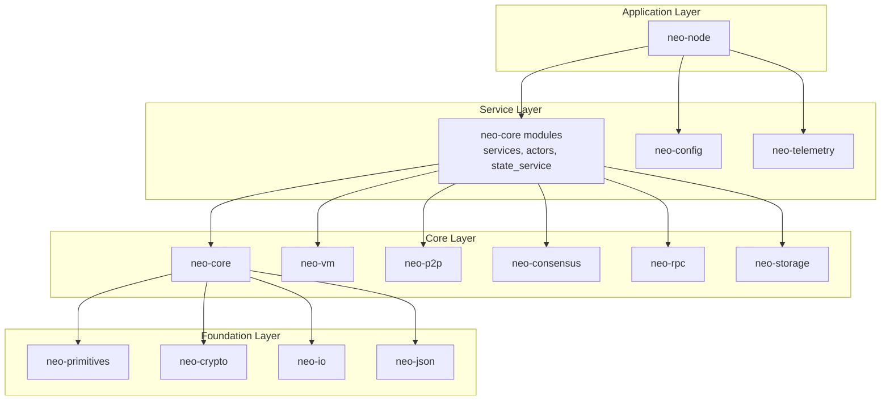
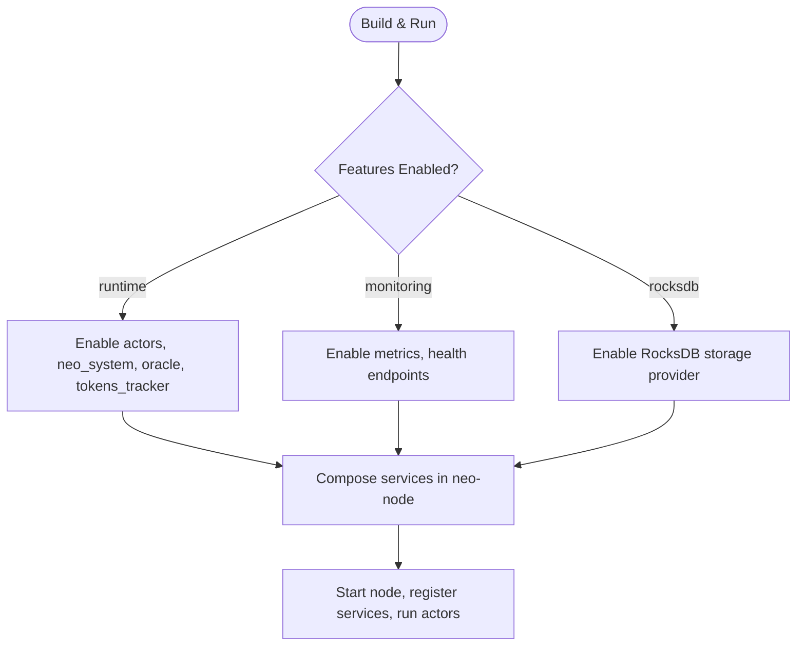
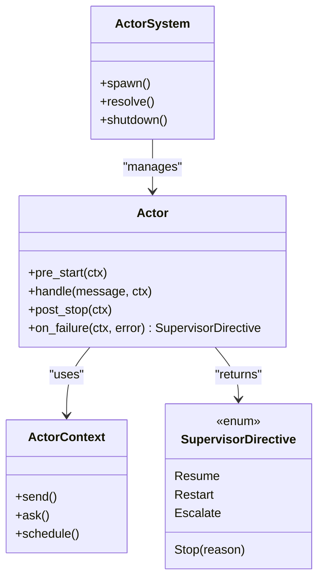
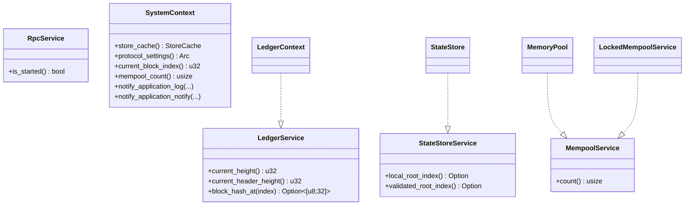
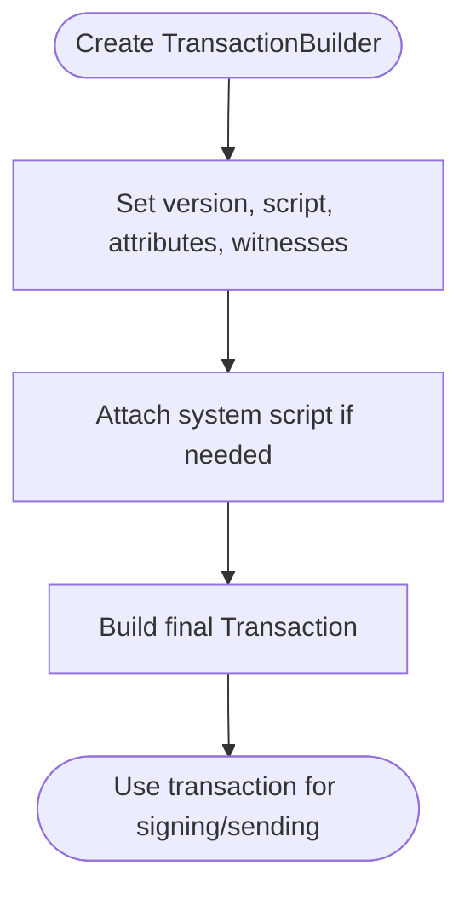
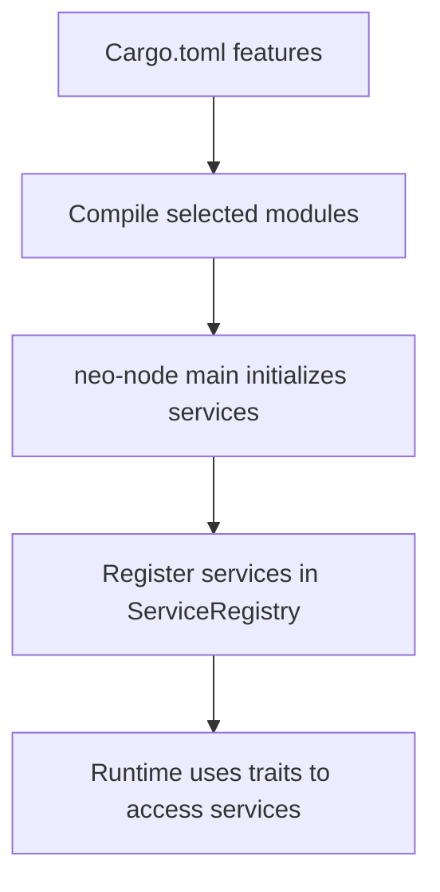
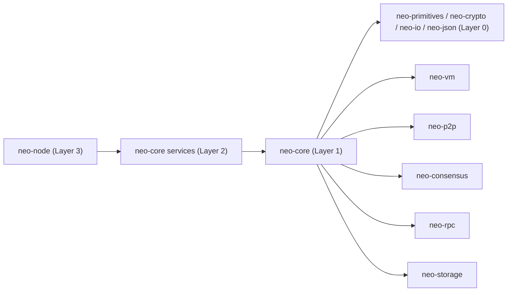

# Architectural Patterns

<cite>
**Referenced Files in This Document**
- [ARCHITECTURE.md](file://ARCHITECTURE.md)
- [README.md](file://README.md)
- [PLUGIN_SYSTEM.md](file://docs/PLUGIN_SYSTEM.md)
- [neo-core/lib.rs](file://neo-core/src/lib.rs)
- [neo-core/Cargo.toml](file://neo-core/Cargo.toml)
- [neo-core/src/actors/mod.rs](file://neo-core/src/actors/mod.rs)
- [neo-core/src/actors/error.rs](file://neo-core/src/actors/error.rs)
- [neo-core/src/actors/actor.rs](file://neo-core/src/actors/actor.rs)
- [neo-core/src/services/mod.rs](file://neo-core/src/services/mod.rs)
- [neo-core/src/services/traits.rs](file://neo-core/src/services/traits.rs)
- [neo-core/src/builders/transaction.rs](file://neo-core/src/builders/transaction.rs)
- [neo-core/src/error.rs](file://neo-core/src/error.rs)
</cite>

## Table of Contents
1. Introduction
2. Project Structure
3. Core Components
4. Architecture Overview
5. Detailed Component Analysis
6. Dependency Analysis
7. Performance Considerations
8. Troubleshooting Guide
9. Conclusion

## Introduction
This document explains the architectural patterns used in Neo-RS with a focus on:
- Actor model for asynchronous message passing between system components
- Trait-based abstractions for pluggable services
- Builder pattern for complex object construction
- Plugin architecture for extensibility via compile-time features
It also documents design principles such as type safety first, explicit error types, feature-gated complexity, and composition over inheritance, with code example references to concrete files.

## Project Structure
Neo-RS follows a strict layered architecture with clear dependency boundaries across crates. The application layer (neo-node) composes services from core and foundation layers. Optional runtime capabilities are enabled through Cargo features, keeping the default build minimal and focused on protocol correctness.



**Diagram sources**
- [ARCHITECTURE.md:30-114](file://ARCHITECTURE.md#L30-L114)
- [README.md:93-112](file://README.md#L93-L112)

**Section sources**
- [ARCHITECTURE.md:30-114](file://ARCHITECTURE.md#L30-L114)
- [README.md:93-112](file://README.md#L93-L112)

## Core Components
Key building blocks that embody the architectural patterns:
- Actors: lightweight async actors with supervision and message passing
- Services: trait-defined subsystems enabling DI and testability
- Builders: fluent APIs for constructing complex blockchain objects
- Plugins: feature-gated integration points replacing dynamic loading

**Section sources**
- [neo-core/src/actors/mod.rs:1-28](file://neo-core/src/actors/mod.rs#L1-L28)
- [neo-core/src/services/mod.rs:1-75](file://neo-core/src/services/mod.rs#L1-L75)
- [neo-core/src/builders/transaction.rs:1-49](file://neo-core/src/builders/transaction.rs#L1-L49)
- [PLUGIN_SYSTEM.md:1-66](file://docs/PLUGIN_SYSTEM.md#L1-L66)

## Architecture Overview
Neo-RS enforces a layered design where higher layers depend only on lower layers. Features gate optional complexity so that the core remains usable without runtime or monitoring dependencies by default.



**Diagram sources**
- [neo-core/Cargo.toml:121-138](file://neo-core/Cargo.toml#L121-L138)
- [neo-core/src/lib.rs:247-269](file://neo-core/src/lib.rs#L247-L269)
- [ARCHITECTURE.md:167-221](file://ARCHITECTURE.md#L167-L221)

**Section sources**
- [neo-core/Cargo.toml:121-138](file://neo-core/Cargo.toml#L121-L138)
- [neo-core/src/lib.rs:247-269](file://neo-core/src/lib.rs#L247-L269)
- [ARCHITECTURE.md:167-221](file://ARCHITECTURE.md#L167-L221)

## Detailed Component Analysis

### Actor Model for Asynchronous Message Passing
Neo-RS provides a lightweight actor runtime built on async channels with hierarchical supervision, scheduling, and typed messages. Actors implement a common trait with lifecycle hooks and failure handling.



**Diagram sources**
- [neo-core/src/actors/actor.rs:31-56](file://neo-core/src/actors/actor.rs#L31-L56)
- [neo-core/src/actors/mod.rs:1-28](file://neo-core/src/actors/mod.rs#L1-L28)

```mermaid
sequenceDiagram
participant Client as "Caller"
participant System as "ActorSystem"
participant Actor as "CustomActor"
participant Mailbox as "Mailbox"
Client->>System : spawn(Props : : new(CustomActor))
System-->>Actor : pre_start(ctx)
Client->>System : send(actor_ref, message)
System->>Mailbox : enqueue(message)
loop process mailbox
Mailbox-->>Actor : handle(message, ctx)
alt error
Actor-->>System : SupervisorDirective
System->>Actor : restart/stop based on directive
end
end
Client->>System : shutdown()
System-->>Actor : post_stop(ctx)
```

**Diagram sources**
- [neo-core/src/actors/mod.rs:1-28](file://neo-core/src/actors/mod.rs#L1-L28)
- [neo-core/src/actors/error.rs:1-38](file://neo-core/src/actors/error.rs#L1-L38)

Benefits:
- Isolation: each actor manages its own state and concurrency
- Resilience: supervision directives control recovery strategies
- Composability: actors communicate via messages, not shared mutable state

Guidelines:
- Keep handlers fast; offload long work to tasks
- Use ask with timeouts for request/response patterns
- Prefer immutable messages where possible

Code examples:
- Actor trait and directives: [neo-core/src/actors/actor.rs:31-56](file://neo-core/src/actors/actor.rs#L31-L56)
- Error types for actor runtime: [neo-core/src/actors/error.rs:1-38](file://neo-core/src/actors/error.rs#L1-L38)

**Section sources**
- [neo-core/src/actors/actor.rs:31-56](file://neo-core/src/actors/actor.rs#L31-L56)
- [neo-core/src/actors/error.rs:1-38](file://neo-core/src/actors/error.rs#L1-L38)
- [neo-core/src/actors/mod.rs:1-28](file://neo-core/src/actors/mod.rs#L1-L28)

### Trait-Based Abstractions for Pluggable Services
Services are defined as traits to decouple protocol logic from runtime implementations. Concrete types implement these traits, enabling swapping, mocking, and testing.



**Diagram sources**
- [neo-core/src/services/traits.rs:6-104](file://neo-core/src/services/traits.rs#L6-L104)
- [neo-core/src/services/mod.rs:21-74](file://neo-core/src/services/mod.rs#L21-L74)

Benefits:
- Decoupling: protocol code depends on small, stable interfaces
- Testability: mock implementations validate behavior without full runtime
- Flexibility: runtime can be swapped without changing protocol code

Guidelines:
- Keep traits narrow and cohesive
- Provide both direct and wrapped implementations when needed (e.g., LockedMempoolService)
- Expose context via SystemContext to avoid leaking runtime details

Code examples:
- Service traits: [neo-core/src/services/traits.rs:6-104](file://neo-core/src/services/traits.rs#L6-L104)
- Implementations and wrappers: [neo-core/src/services/mod.rs:21-74](file://neo-core/src/services/mod.rs#L21-L74)

**Section sources**
- [neo-core/src/services/traits.rs:6-104](file://neo-core/src/services/traits.rs#L6-L104)
- [neo-core/src/services/mod.rs:21-74](file://neo-core/src/services/mod.rs#L21-L74)

### Builder Pattern for Complex Object Construction
Builders provide a fluent API to construct complex blockchain objects safely and readably. They encapsulate defaults and validation steps.



**Diagram sources**
- [neo-core/src/builders/transaction.rs:1-49](file://neo-core/src/builders/transaction.rs#L1-L49)

Benefits:
- Readability: step-by-step configuration is self-documenting
- Safety: required fields enforced before build
- Reusability: consistent construction across tests and production

Guidelines:
- Provide sensible defaults (e.g., minimal script)
- Offer both raw and builder-assisted paths
- Keep builders focused on one domain type

Code examples:
- Transaction builder usage: [neo-core/src/builders/transaction.rs:1-49](file://neo-core/src/builders/transaction.rs#L1-L49)

**Section sources**
- [neo-core/src/builders/transaction.rs:1-49](file://neo-core/src/builders/transaction.rs#L1-L49)

### Plugin Architecture for Extensibility
Neo-RS replaces dynamic plugin loading with compile-time feature flags. Features enable optional subsystems (RPC, consensus, oracle, monitoring), and services are registered at startup.



**Diagram sources**
- [neo-core/Cargo.toml:121-138](file://neo-core/Cargo.toml#L121-L138)
- [PLUGIN_SYSTEM.md:30-66](file://docs/PLUGIN_SYSTEM.md#L30-L66)

Benefits:
- Type safety: no reflection or dynamic loading
- Performance: zero-cost abstractions and inlining
- Deployment simplicity: single binary, fewer moving parts
- Security: all code audited at build time

Guidelines:
- Add new features in Cargo.toml and gate modules with cfg(feature = "...")
- Wire service initialization in the application entrypoint
- Provide unified TOML configuration sections per feature

Code examples:
- Feature definitions: [neo-core/Cargo.toml:121-138](file://neo-core/Cargo.toml#L121-L138)
- Plugin guide and migration notes: [PLUGIN_SYSTEM.md:30-66](file://docs/PLUGIN_SYSTEM.md#L30-L66)

**Section sources**
- [neo-core/Cargo.toml:121-138](file://neo-core/Cargo.toml#L121-L138)
- [PLUGIN_SYSTEM.md:30-66](file://docs/PLUGIN_SYSTEM.md#L30-L66)

### Design Principles in Practice

#### Type Safety First
- Newtypes prevent unit confusion and enforce correct usage at compile time.
- Traits define precise contracts for cross-component interaction.

References:
- [ARCHITECTURE.md:337-353](file://ARCHITECTURE.md#L337-L353)

#### Explicit Error Types
- Each crate defines structured error enums with categories and conversion helpers.
- Errors carry enough context for logging, metrics, and user feedback.

References:
- [neo-core/src/error.rs:34-172](file://neo-core/src/error.rs#L34-L172)
- [ARCHITECTURE.md:433-488](file://ARCHITECTURE.md#L433-L488)

#### Feature-Gated Complexity
- Optional features keep the default build lean and focused on protocol correctness.
- Runtime, monitoring, and storage backends are opt-in.

References:
- [neo-core/Cargo.toml:121-138](file://neo-core/Cargo.toml#L121-L138)
- [neo-core/src/lib.rs:247-269](file://neo-core/src/lib.rs#L247-L269)

#### Composition Over Inheritance
- Behavior is composed via traits and small interfaces rather than deep hierarchies.
- Wrappers like LockedMempoolService add synchronization without subclassing.

References:
- [neo-core/src/services/mod.rs:51-74](file://neo-core/src/services/mod.rs#L51-L74)
- [ARCHITECTURE.md:399-416](file://ARCHITECTURE.md#L399-L416)

**Section sources**
- [ARCHITECTURE.md:337-416](file://ARCHITECTURE.md#L337-L416)
- [neo-core/src/error.rs:34-172](file://neo-core/src/error.rs#L34-L172)
- [neo-core/Cargo.toml:121-138](file://neo-core/Cargo.toml#L121-L138)
- [neo-core/src/lib.rs:247-269](file://neo-core/src/lib.rs#L247-L269)
- [neo-core/src/services/mod.rs:51-74](file://neo-core/src/services/mod.rs#L51-L74)

## Dependency Analysis
Neo-RS enforces strict layering to avoid circular dependencies and maintain modularity.



**Diagram sources**
- [ARCHITECTURE.md:118-165](file://ARCHITECTURE.md#L118-L165)
- [ARCHITECTURE.md:167-221](file://ARCHITECTURE.md#L167-L221)

**Section sources**
- [ARCHITECTURE.md:118-221](file://ARCHITECTURE.md#L118-L221)

## Performance Considerations
- Prefer zero-cost abstractions and trait-based dispatch where performance matters.
- Use actors to isolate hot paths and schedule background work efficiently.
- Gate heavy features behind Cargo features to reduce binary size and compile times.
- Leverage builders to minimize allocations during object construction.

[No sources needed since this section provides general guidance]

## Troubleshooting Guide
Common issues and how to diagnose them:

- Actor failures: inspect SupervisorDirective outcomes and error types returned by on_failure.
  - Reference: [neo-core/src/actors/error.rs:1-38](file://neo-core/src/actors/error.rs#L1-L38)
- Service not available: verify feature flags and registration order in the application entrypoint.
  - Reference: [neo-core/Cargo.toml:121-138](file://neo-core/Cargo.toml#L121-L138)
- Configuration errors: ensure TOML schema matches enabled features and required fields.
  - Reference: [PLUGIN_SYSTEM.md:67-105](file://docs/PLUGIN_SYSTEM.md#L67-L105)
- Error categorization: use category(), is_retryable(), and is_user_error() to route errors appropriately.
  - Reference: [neo-core/src/error.rs:372-422](file://neo-core/src/error.rs#L372-L422)

**Section sources**
- [neo-core/src/actors/error.rs:1-38](file://neo-core/src/actors/error.rs#L1-L38)
- [neo-core/Cargo.toml:121-138](file://neo-core/Cargo.toml#L121-L138)
- [PLUGIN_SYSTEM.md:67-105](file://docs/PLUGIN_SYSTEM.md#L67-L105)
- [neo-core/src/error.rs:372-422](file://neo-core/src/error.rs#L372-L422)

## Conclusion
Neo-RS applies well-established architectural patterns to deliver a robust, extensible, and type-safe blockchain node:
- Actors provide resilient, asynchronous communication between components
- Traits enable pluggable services and clean separation of concerns
- Builders simplify safe construction of complex objects
- Feature-gated plugins offer extensibility without dynamic loading overhead
These patterns, combined with design principles emphasizing type safety, explicit errors, and composition, make Neo-RS maintainable, performant, and aligned with the Neo N3 protocol while improving developer experience and operational reliability.

[No sources needed since this section summarizes without analyzing specific files]