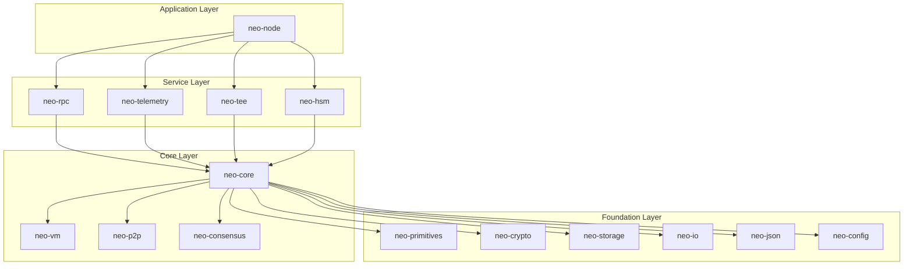
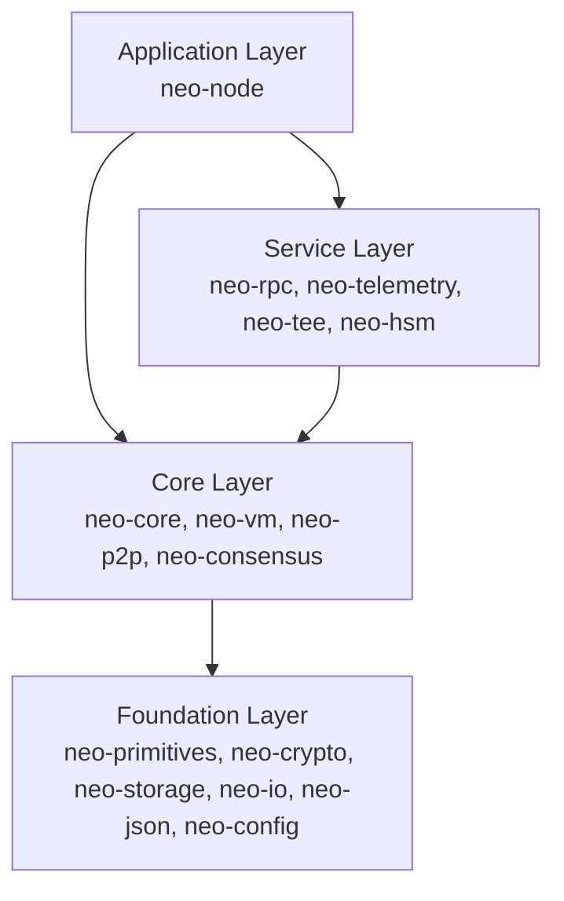
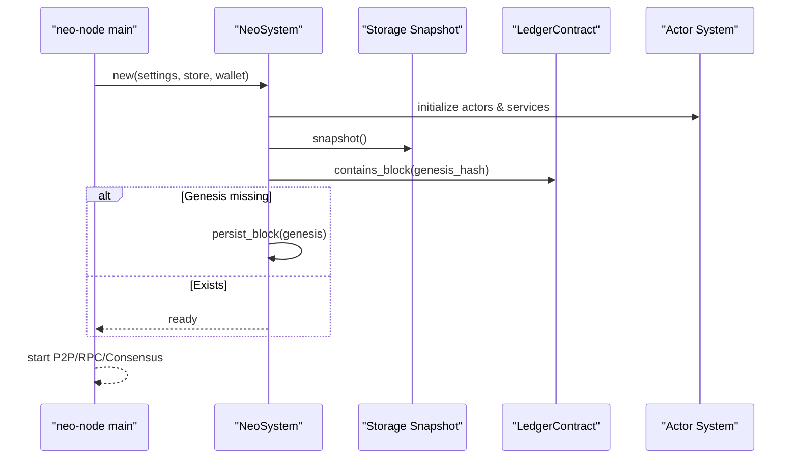
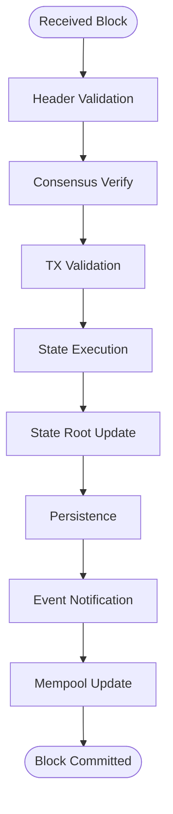
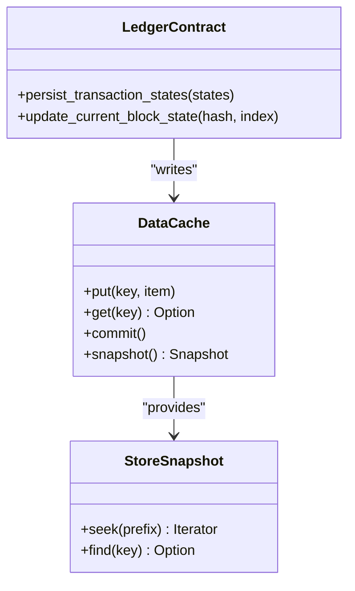
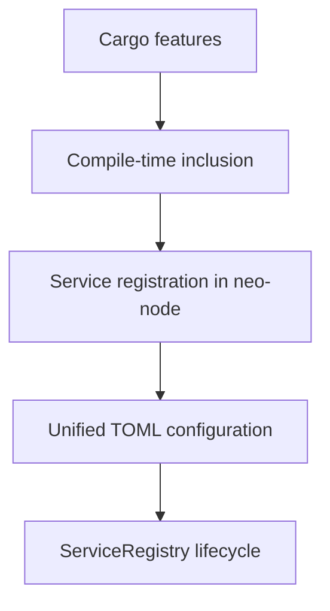
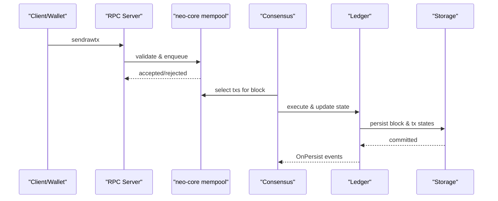
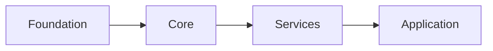

# Architecture Overview

<cite>
**Referenced Files in This Document**
- [ARCHITECTURE.md](file://ARCHITECTURE.md)
- [README.md](file://README.md)
- [Cargo.toml](file://Cargo.toml)
- [neo-core/src/lib.rs](file://neo-core/src/lib.rs)
- [neo-node/src/main.rs](file://neo-node/src/main.rs)
- [neo-core/src/neo_system/mod.rs](file://neo-core/src/neo_system/mod.rs)
- [neo-core/src/neo_system/core.rs](file://neo-core/src/neo_system/core.rs)
- [neo-core/src/actors/mod.rs](file://neo-core/src/actors/mod.rs)
- [neo-storage/src/lib.rs](file://neo-storage/src/lib.rs)
- [neo-core/src/ledger/blockchain/handlers.rs](file://neo-core/src/ledger/blockchain/handlers.rs)
- [neo-core/src/smart_contract/native/ledger_contract/storage.rs](file://neo-core/src/smart_contract/native/ledger_contract/storage.rs)
- [docs/ARCHITECTURE.md](file://docs/ARCHITECTURE.md)
- [docs/PLUGIN_SYSTEM.md](file://docs/PLUGIN_SYSTEM.md)
</cite>

## Table of Contents
1. [Introduction](#introduction)
2. [Project Structure](#project-structure)
3. [Core Components](#core-components)
4. [Architecture Overview](#architecture-overview)
5. [Detailed Component Analysis](#detailed-component-analysis)
6. [Dependency Analysis](#dependency-analysis)
7. [Performance Considerations](#performance-considerations)
8. [Troubleshooting Guide](#troubleshooting-guide)
9. [Conclusion](#conclusion)
10. [Appendices](#appendices)

## Introduction
This document provides a comprehensive architectural overview of the Neo-RS blockchain system, focusing on its layered design, component relationships, data flows, and communication protocols. It explains how blocks flow through the system from P2P reception to storage persistence, outlines scalability and performance characteristics, and highlights extensibility points such as the actor model and plugin architecture. Where relevant, it compares with the C# reference implementation to clarify compatibility and differences.

## Project Structure
Neo-RS is organized as a Rust workspace with clear layering:
- Foundation Layer (Layer 0): neo-primitives, neo-crypto, neo-storage, neo-io, neo-json, neo-config
- Core Layer (Layer 1): neo-core, neo-vm, neo-p2p, neo-consensus, neo-rpc
- Service Layer (Layer 2): neo-core modules (mempool, state service, oracle, application logs), neo-telemetry, neo-tee, neo-hsm
- Application Layer (Layer 3): neo-node

The workspace manifest enumerates all crates and their roles, while README and ARCHITECTURE documents describe high-level structure and compatibility targets.



**Diagram sources**
- [Cargo.toml:1-68](file://Cargo.toml#L1-L68)
- [ARCHITECTURE.md:30-114](file://ARCHITECTURE.md#L30-L114)

**Section sources**
- [Cargo.toml:1-68](file://Cargo.toml#L1-L68)
- [ARCHITECTURE.md:30-114](file://ARCHITECTURE.md#L30-L114)
- [README.md:93-112](file://README.md#L93-L112)

## Core Components
- neo-core: Central protocol implementation mirroring C# namespaces; includes ledger, smart contracts, wallets, persistence, services, and optional runtime components (actors, NeoSystem).
- neo-vm: VM runtime providing opcodes, interpreter, execution engine, and stack items; exposed via neo-core::neo_vm for compatibility.
- neo-p2p: Networking types and message handling; defines commands, inventory types, and verification results.
- neo-consensus: dBFT 2.0 consensus service implementing block proposal, voting, and commit phases.
- neo-rpc: JSON-RPC server and client; exposes node APIs and supports plugins.
- neo-storage: Storage traits and abstractions (IStore, ISnapshot, DataCache) enabling pluggable backends like RocksDB or memory stores.
- neo-node: Node daemon entry point that initializes runtime, configures services, and starts networking, RPC, and consensus.

Key responsibilities:
- Block and transaction lifecycle management
- Smart contract execution and native contracts
- P2P message routing and peer management
- Consensus participation and block finality
- Persistent storage and snapshots
- Observability and configuration

**Section sources**
- [neo-core/src/lib.rs:6-46](file://neo-core/src/lib.rs#L6-L46)
- [neo-core/src/lib.rs:181-269](file://neo-core/src/lib.rs#L181-L269)
- [neo-storage/src/lib.rs:1-27](file://neo-storage/src/lib.rs#L1-L27)
- [neo-node/src/main.rs:1-79](file://neo-node/src/main.rs#L1-L79)

## Architecture Overview
Neo-RS follows a strict layered architecture with enforced dependency rules: layers may only depend on lower layers, preventing upward dependencies and cycles. The application layer composes services and core components to run a full node. Services provide higher-level orchestration (RPC, telemetry, TEE/HSM integrations). Core implements protocol logic (VM, consensus, P2P). Foundation provides primitives, crypto, storage traits, serialization, and JSON utilities.



**Diagram sources**
- [ARCHITECTURE.md:118-180](file://ARCHITECTURE.md#L118-L180)
- [Cargo.toml:1-68](file://Cargo.toml#L1-L68)

**Section sources**
- [ARCHITECTURE.md:118-180](file://ARCHITECTURE.md#L118-L180)
- [Cargo.toml:1-68](file://Cargo.toml#L1-L68)

## Detailed Component Analysis

### NeoSystem and Actor Runtime
NeoSystem orchestrates the node’s actors, services, and lifecycle. It initializes event logging, ensures genesis persistence, and exposes typed views for ledger and context handles. The actor runtime provides asynchronous message passing, hierarchical supervision, and scheduling built on tokio channels.



**Diagram sources**
- [neo-core/src/neo_system/core.rs:327-342](file://neo-core/src/neo_system/core.rs#L327-L342)
- [neo-core/src/neo_system/mod.rs:1-56](file://neo-core/src/neo_system/mod.rs#L1-L56)
- [neo-core/src/actors/mod.rs:1-28](file://neo-core/src/actors/mod.rs#L1-L28)

**Section sources**
- [neo-core/src/neo_system/core.rs:327-367](file://neo-core/src/neo_system/core.rs#L327-L367)
- [neo-core/src/neo_system/mod.rs:1-56](file://neo-core/src/neo_system/mod.rs#L1-L56)
- [neo-core/src/actors/mod.rs:1-28](file://neo-core/src/actors/mod.rs#L1-L28)

### Block Processing Pipeline
Blocks received over P2P are validated, executed, persisted, and then events are emitted. The pipeline includes header validation, consensus verification, transaction validation, state execution, state root update, persistence, event notification, and mempool updates.



**Diagram sources**
- [docs/ARCHITECTURE.md:496-562](file://docs/ARCHITECTURE.md#L496-L562)

**Section sources**
- [docs/ARCHITECTURE.md:496-562](file://docs/ARCHITECTURE.md#L496-L562)

### Persistence and State Management
Persistence uses a cache-backed store abstraction allowing efficient writes and snapshots. After executing transactions, changes are applied to a DataCache and committed atomically. The LedgerContract persists trimmed blocks and transaction states, updating current block pointers.



**Diagram sources**
- [neo-storage/src/lib.rs:1-27](file://neo-storage/src/lib.rs#L1-L27)
- [neo-core/src/smart_contract/native/ledger_contract/storage.rs:317-354](file://neo-core/src/smart_contract/native/ledger_contract/storage.rs#L317-L354)

**Section sources**
- [neo-storage/src/lib.rs:1-27](file://neo-storage/src/lib.rs#L1-L27)
- [neo-core/src/smart_contract/native/ledger_contract/storage.rs:284-354](file://neo-core/src/smart_contract/native/ledger_contract/storage.rs#L284-L354)

### P2P Message Handling and Actor Delivery
Inbound messages are read from peers and delivered to remote node actors asynchronously. The handshake path yields control between steps to avoid blocking writers and ensures reliable delivery to the target actor.

```mermaid
sequenceDiagram
participant Peer as "Remote Peer"
participant Net as "Network Reader"
participant Actor as "RemoteNodeActor"
Peer->>Net : Send Message
Net->>Net : receive_message_step()
Net-->>Peer : Pending/Idle/Yield
Net->>Actor : tell_async(Inbound(message))
Actor-->>Net : Delivered or Error
```

**Diagram sources**
- [neo-core/src/network/p2p/remote_node/handshake.rs:90-115](file://neo-core/src/network/p2p/remote_node/handshake.rs#L90-L115)

**Section sources**
- [neo-core/src/network/p2p/remote_node/handshake.rs:90-115](file://neo-core/src/network/p2p/remote_node/handshake.rs#L90-L115)

### Plugin Architecture and Extensibility
Neo-RS adopts compile-time integration rather than dynamic loading used by the C# implementation. Features enable or disable components at build time, and services are registered during startup. Configuration is unified under node TOML files, and the ServiceRegistry manages lifecycle.



**Diagram sources**
- [docs/PLUGIN_SYSTEM.md:1-51](file://docs/PLUGIN_SYSTEM.md#L1-L51)

**Section sources**
- [docs/PLUGIN_SYSTEM.md:1-51](file://docs/PLUGIN_SYSTEM.md#L1-L51)

### Transaction Lifecycle and Mempool Integration
Transactions are created, signed, submitted via RPC, validated, and optionally added to the mempool. They are later included in blocks by consensus, executed, and persisted. Events notify plugins and peers.



**Diagram sources**
- [docs/ARCHITECTURE.md:414-494](file://docs/ARCHITECTURE.md#L414-L494)

**Section sources**
- [docs/ARCHITECTURE.md:414-494](file://docs/ARCHITECTURE.md#L414-L494)

## Dependency Analysis
Neo-RS enforces strict dependency boundaries:
- Foundation crates have no neo-* dependencies.
- Core depends only on Foundation.
- Services depend on Core and Foundation.
- Application depends on Services and Core.



**Diagram sources**
- [ARCHITECTURE.md:167-180](file://ARCHITECTURE.md#L167-L180)
- [Cargo.toml:1-68](file://Cargo.toml#L1-L68)

**Section sources**
- [ARCHITECTURE.md:167-180](file://ARCHITECTURE.md#L167-L180)
- [Cargo.toml:1-68](file://Cargo.toml#L1-L68)

## Performance Considerations
- Batched persistence: Deferring RocksDB commits across multiple blocks reduces write amplification and improves throughput.
- Actor-based concurrency: Asynchronous message passing avoids blocking I/O and enables scalable processing of P2P and consensus tasks.
- Feature-gated complexity: Optional runtime and monitoring features allow lean builds for specific deployment scenarios.
- Storage caching: DataCache tracks changes and applies them efficiently, minimizing redundant reads/writes.
- VM execution limits: Gas metering and opcode constraints prevent runaway execution and ensure predictable performance.

[No sources needed since this section provides general guidance]

## Troubleshooting Guide
Common issues and diagnostics:
- Actor failures: Inspect actor error types and messages for handler or lifecycle errors.
- Message delivery failures: Check network reader yields and actor mailbox delivery paths.
- Persistence errors: Validate DataCache operations and LedgerContract storage writes; verify current block pointer updates.
- RPC errors: Map core errors to JSON-RPC error codes; inspect method handlers for invalid parameters or internal errors.

**Section sources**
- [neo-core/src/actors/error.rs:1-38](file://neo-core/src/actors/error.rs#L1-L38)
- [neo-core/src/ledger/blockchain/handlers.rs:52-100](file://neo-core/src/ledger/blockchain/handlers.rs#L52-L100)
- [neo-core/src/smart_contract/native/ledger_contract/storage.rs:284-354](file://neo-core/src/smart_contract/native/ledger_contract/storage.rs#L284-L354)

## Conclusion
Neo-RS implements a robust, layered architecture that mirrors the C# Neo N3 reference while leveraging Rust’s type safety and performance. The separation of concerns across foundation, core, service, and application layers enables modularity, testability, and extensibility. The actor model facilitates asynchronous message passing, and feature-gated components support diverse deployment profiles. Protocol consistency and compatibility with C# are maintained through careful serialization parity and rigorous testing.

[No sources needed since this section summarizes without analyzing specific files]

## Appendices

### C# Compatibility Notes
- Namespace-to-crate mapping aligns core modules with C# namespaces.
- Serialization parity is verified against live MainNet blocks and consensus presets.
- Full-chain equivalence is not yet validated; ongoing checks focus on serialization and state roots.

**Section sources**
- [ARCHITECTURE.md:573-611](file://ARCHITECTURE.md#L573-L611)
- [README.md:114-187](file://README.md#L114-L187)