# Block Structure and Validation

<cite>
**Referenced Files in This Document**
- [block.rs](file://neo-core/src/ledger/block.rs)
- [block_header.rs](file://neo-core/src/ledger/block_header.rs)
- [genesis.rs](file://neo-core/src/ledger/genesis.rs)
- [validation.rs](file://neo-core/src/validation.rs)
- [constants.rs](file://neo-core/src/constants.rs)
- [merkle_tree.rs](file://neo-crypto/src/merkle_tree.rs)
- [protocol_settings.rs](file://neo-core/src/protocol_settings.rs)
- [block_serialization_compatibility_tests.rs](file://neo-core/tests/block_serialization_compatibility_tests.rs)
</cite>

## Table of Contents
1. [Introduction](#introduction)
2. [Project Structure](#project-structure)
3. [Core Components](#core-components)
4. [Architecture Overview](#architecture-overview)
5. [Detailed Component Analysis](#detailed-component-analysis)
6. [Dependency Analysis](#dependency-analysis)
7. [Performance Considerations](#performance-considerations)
8. [Troubleshooting Guide](#troubleshooting-guide)
9. [Conclusion](#conclusion)

## Introduction
This document explains the Neo-RS block structure and validation mechanisms with a focus on:
- The Block and BlockHeader data structures and their fields
- Genesis block creation
- Header hashing and Merkle root computation
- Timestamp validation rules
- Block size limits, transaction count constraints, and consensus-related validations
- Examples of block construction and serialization behavior
- Performance considerations for large blocks and optimization techniques

## Project Structure
The block-related logic is primarily implemented under neo-core (Block, BlockHeader, genesis, validation, constants) and uses cryptographic primitives from neo-crypto (Merkle tree). Protocol settings influence consensus parameters such as validator counts and maximums.

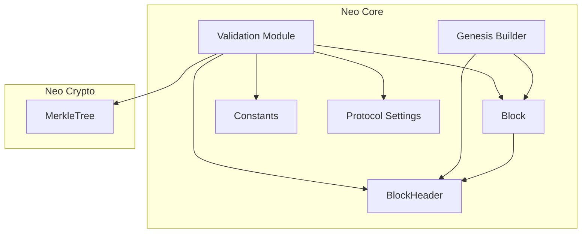

**Diagram sources**
- [block.rs:6-38](file://neo-core/src/ledger/block.rs#L6-L38)
- [block_header.rs:13-38](file://neo-core/src/ledger/block_header.rs#L13-L38)
- [genesis.rs:17-41](file://neo-core/src/ledger/genesis.rs#L17-L41)
- [validation.rs:12-24](file://neo-core/src/validation.rs#L12-L24)
- [constants.rs:24-33](file://neo-core/src/constants.rs#L24-L33)
- [merkle_tree.rs:31-124](file://neo-crypto/src/merkle_tree.rs#L31-L124)
- [protocol_settings.rs:25-80](file://neo-core/src/protocol_settings.rs#L25-L80)

**Section sources**
- [block.rs:6-38](file://neo-core/src/ledger/block.rs#L6-L38)
- [block_header.rs:13-38](file://neo-core/src/ledger/block_header.rs#L13-L38)
- [genesis.rs:17-41](file://neo-core/src/ledger/genesis.rs#L17-L41)
- [validation.rs:12-24](file://neo-core/src/validation.rs#L12-L24)
- [constants.rs:24-33](file://neo-core/src/constants.rs#L24-L33)
- [merkle_tree.rs:31-124](file://neo-crypto/src/merkle_tree.rs#L31-L124)
- [protocol_settings.rs:25-80](file://neo-core/src/protocol_settings.rs#L25-L80)

## Core Components
- Block: A container holding a BlockHeader and a list of transactions. It delegates hash and index to the header and exposes the primary witness.
- BlockHeader: Holds version, previous_hash, merkle_root, timestamp, nonce, index, primary_index, next_consensus, witnesses, and a cached hash. Implements serialization/deserialization and hashing over the unsigned portion.
- Genesis builder: Constructs the deterministic genesis block using protocol settings and fixed constants.
- Validation module: Enforces block size, transaction count, timestamp bounds and progression, Merkle root integrity, duplicate transactions, witness script sizes, block version, and primary index range.
- Constants: Provide global limits like MAX_BLOCK_SIZE and wire-level transaction limit.
- MerkleTree: Efficiently computes Merkle roots from transaction hashes.
- ProtocolSettings: Supplies validators, max transactions per block, and other runtime parameters used by consensus and validation.

**Section sources**
- [block.rs:6-38](file://neo-core/src/ledger/block.rs#L6-L38)
- [block_header.rs:13-38](file://neo-core/src/ledger/block_header.rs#L13-L38)
- [genesis.rs:17-41](file://neo-core/src/ledger/genesis.rs#L17-L41)
- [validation.rs:128-409](file://neo-core/src/validation.rs#L128-L409)
- [constants.rs:24-33](file://neo-core/src/constants.rs#L24-L33)
- [merkle_tree.rs:87-124](file://neo-crypto/src/merkle_tree.rs#L87-L124)
- [protocol_settings.rs:25-80](file://neo-core/src/protocol_settings.rs#L25-L80)

## Architecture Overview
The block lifecycle involves constructing or receiving a Block, validating its header and contents, computing and verifying hashes and Merkle roots, and ensuring consensus-related fields are valid.

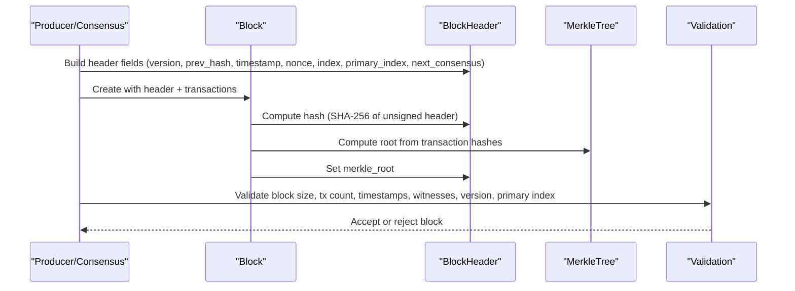

**Diagram sources**
- [block_header.rs:101-164](file://neo-core/src/ledger/block_header.rs#L101-L164)
- [merkle_tree.rs:87-124](file://neo-crypto/src/merkle_tree.rs#L87-L124)
- [validation.rs:128-409](file://neo-core/src/validation.rs#L128-L409)

## Detailed Component Analysis

### Block and BlockHeader Data Structures
- Block
  - Fields: header (BlockHeader), transactions (Vec<Transaction>)
  - Methods: new(header, transactions), hash() delegates to header.hash(), index() delegates to header.index(), primary_witness() returns first witness if present
- BlockHeader
  - Fields:
    - version: u32 (currently 0)
    - previous_hash: UInt256 (hash of previous block)
    - merkle_root: UInt256 (root over transaction hashes)
    - timestamp: u64 (milliseconds since epoch)
    - nonce: u64 (consensus nonce)
    - index: u32 (height; genesis is 0)
    - primary_index: u8 (index of proposing validator)
    - next_consensus: UInt160 (script hash of next validators)
    - witnesses: Vec<Witness> (header signature(s))
    - _hash: Mutex<Option<UInt256>> (cached hash)
  - Serialization:
    - serialize_unsigned writes version, previous_hash, merkle_root, timestamp, nonce, index, primary_index, next_consensus
    - deserialize_unsigned reads same fields and rejects unsupported versions
    - Full serialize includes witnesses array; deserialization enforces exactly one witness
  - Hashing:
    - hash() and try_hash() compute SHA-256 over the serialized unsigned header bytes and cache the result

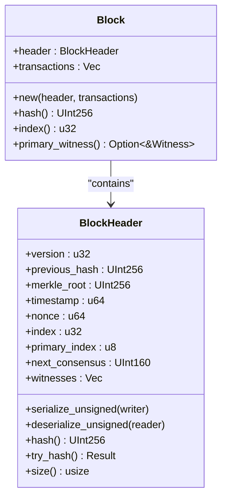

**Diagram sources**
- [block.rs:6-38](file://neo-core/src/ledger/block.rs#L6-L38)
- [block_header.rs:13-38](file://neo-core/src/ledger/block_header.rs#L13-L38)
- [block_header.rs:101-164](file://neo-core/src/ledger/block_header.rs#L101-L164)
- [block_header.rs:189-225](file://neo-core/src/ledger/block_header.rs#L189-L225)

**Section sources**
- [block.rs:6-38](file://neo-core/src/ledger/block.rs#L6-L38)
- [block_header.rs:13-38](file://neo-core/src/ledger/block_header.rs#L13-L38)
- [block_header.rs:101-164](file://neo-core/src/ledger/block_header.rs#L101-L164)
- [block_header.rs:189-225](file://neo-core/src/ledger/block_header.rs#L189-L225)

### Genesis Block Creation
- Deterministic genesis block built from ProtocolSettings:
  - No transactions
  - Merkle root set to zero
  - Fixed timestamp constant and nonce
  - next_consensus derived from standby validators via native helpers
  - Witnesses constructed with a minimal verification script
- Tests assert correct index, previous hash, no transactions, timestamp, mainnet next_consensus, and mainnet genesis hash

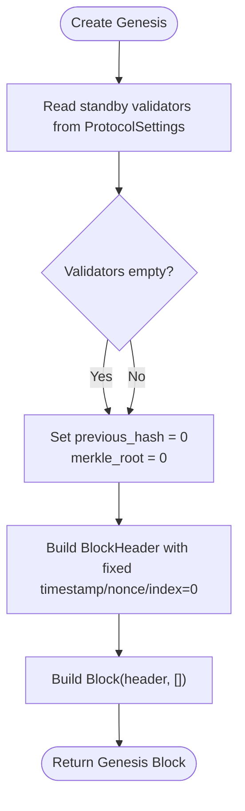

**Diagram sources**
- [genesis.rs:17-41](file://neo-core/src/ledger/genesis.rs#L17-L41)

**Section sources**
- [genesis.rs:17-41](file://neo-core/src/ledger/genesis.rs#L17-L41)

### Header Hashing
- Header hash is computed by serializing only the unsigned portion (excluding witnesses) and applying SHA-256
- Result is cached to avoid recomputation
- Deserialization rejects unsupported versions

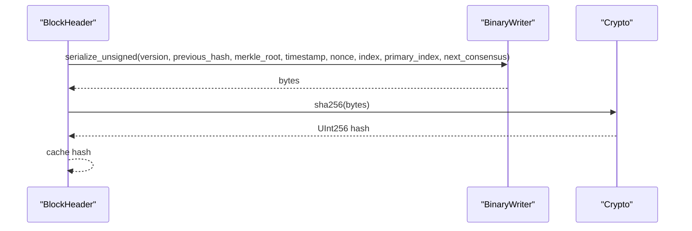

**Diagram sources**
- [block_header.rs:101-112](file://neo-core/src/ledger/block_header.rs#L101-L112)
- [block_header.rs:143-164](file://neo-core/src/ledger/block_header.rs#L143-L164)

**Section sources**
- [block_header.rs:101-112](file://neo-core/src/ledger/block_header.rs#L101-L112)
- [block_header.rs:143-164](file://neo-core/src/ledger/block_header.rs#L143-L164)

### Merkle Root Computation
- Transaction hashes are collected and passed to MerkleTree::compute_root
- For empty blocks, expected merkle root is zero; validation enforces this
- Implementation uses an efficient level-by-level reduction with O(n) time and space

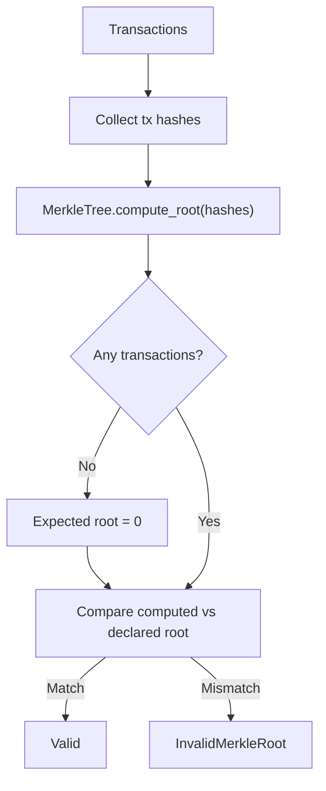

**Diagram sources**
- [validation.rs:256-298](file://neo-core/src/validation.rs#L256-L298)
- [merkle_tree.rs:87-124](file://neo-crypto/src/merkle_tree.rs#L87-L124)

**Section sources**
- [validation.rs:256-298](file://neo-core/src/validation.rs#L256-L298)
- [merkle_tree.rs:87-124](file://neo-crypto/src/merkle_tree.rs#L87-L124)

### Timestamp Validation
- Bounds: must be at or after genesis timestamp and not too far in the future (drift threshold)
- Progression: strictly increasing relative to previous block’s timestamp
- Implemented via dedicated validators that return descriptive errors

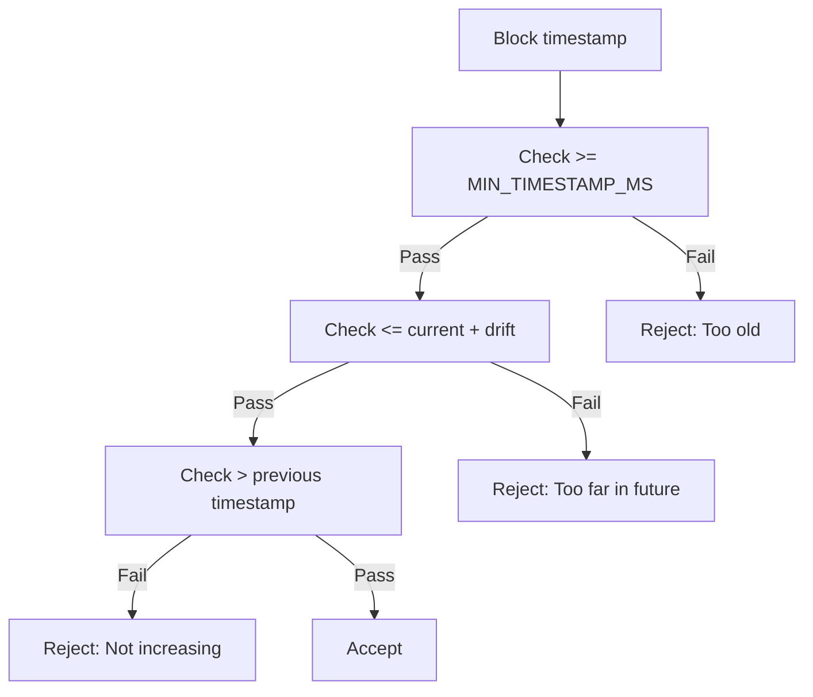

**Diagram sources**
- [validation.rs:197-254](file://neo-core/src/validation.rs#L197-L254)

**Section sources**
- [validation.rs:197-254](file://neo-core/src/validation.rs#L197-L254)

### Block Size Limits and Transaction Count Constraints
- Block size: validated against MAX_BLOCK_SIZE
- Transaction count: validated against MAX_TRANSACTIONS_PER_BLOCK
- Wire-level limit for transaction count during deserialization is separate (u16-based)

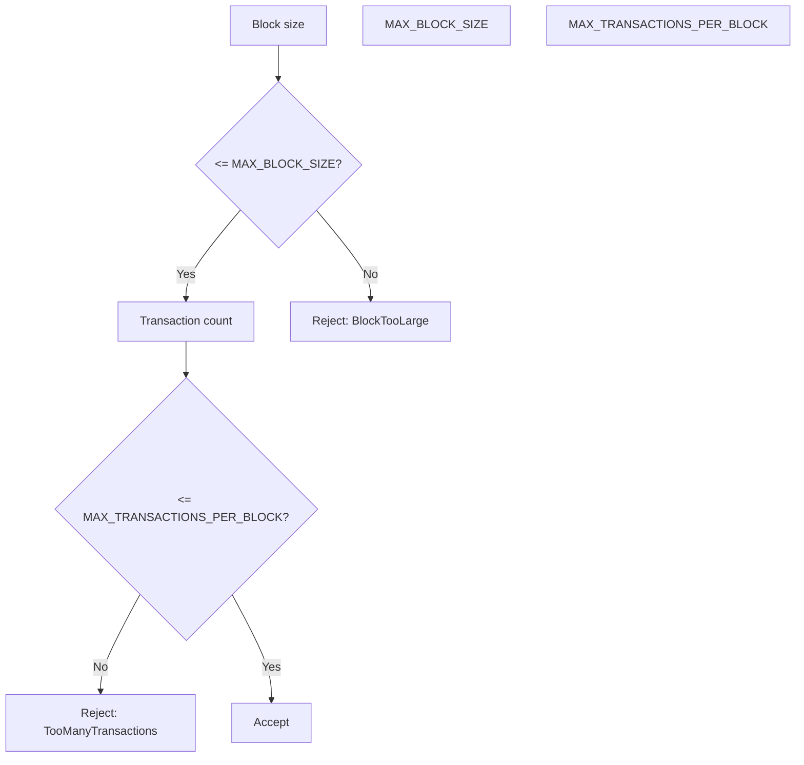

**Diagram sources**
- [validation.rs:128-192](file://neo-core/src/validation.rs#L128-L192)
- [constants.rs:24-33](file://neo-core/src/constants.rs#L24-L33)

**Section sources**
- [validation.rs:128-192](file://neo-core/src/validation.rs#L128-L192)
- [constants.rs:24-33](file://neo-core/src/constants.rs#L24-L33)

### Consensus-Related Validations
- Block version: only version 0 supported
- Primary index: must be within active validator count
- Witness scripts: invocation and verification scripts bounded; basic opcode checks

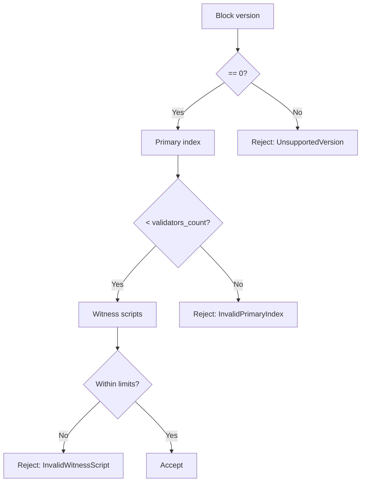

**Diagram sources**
- [validation.rs:373-409](file://neo-core/src/validation.rs#L373-L409)

**Section sources**
- [validation.rs:373-409](file://neo-core/src/validation.rs#L373-L409)

### Block Construction and Serialization Examples
- Construction:
  - Use Block::new with a BlockHeader and a Vec<Transaction>
  - For genesis, use create_genesis_block(ProtocolSettings)
- Serialization:
  - BlockHeader serializes unsigned fields then witnesses
  - Deserialization validates version and witness count
  - Tests demonstrate round-trip consistency and identical hashes for identical headers

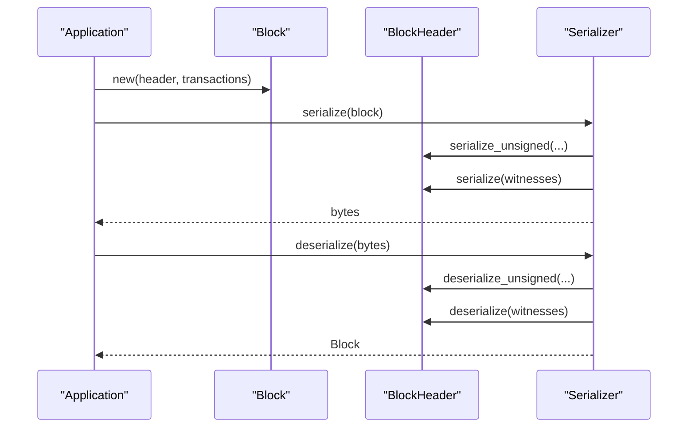

**Diagram sources**
- [block.rs:15-38](file://neo-core/src/ledger/block.rs#L15-L38)
- [block_header.rs:189-225](file://neo-core/src/ledger/block_header.rs#L189-L225)
- [block_serialization_compatibility_tests.rs:119-148](file://neo-core/tests/block_serialization_compatibility_tests.rs#L119-L148)
- [block_serialization_compatibility_tests.rs:212-250](file://neo-core/tests/block_serialization_compatibility_tests.rs#L212-L250)

**Section sources**
- [block.rs:15-38](file://neo-core/src/ledger/block.rs#L15-L38)
- [block_header.rs:189-225](file://neo-core/src/ledger/block_header.rs#L189-L225)
- [block_serialization_compatibility_tests.rs:119-148](file://neo-core/tests/block_serialization_compatibility_tests.rs#L119-L148)
- [block_serialization_compatibility_tests.rs:212-250](file://neo-core/tests/block_serialization_compatibility_tests.rs#L212-L250)

## Dependency Analysis
- Block depends on BlockHeader for identity and metadata
- BlockHeader depends on cryptographic primitives for hashing and on serialization utilities
- Validation depends on constants, protocol settings, and MerkleTree
- Genesis builder depends on ProtocolSettings and native helpers to derive next_consensus

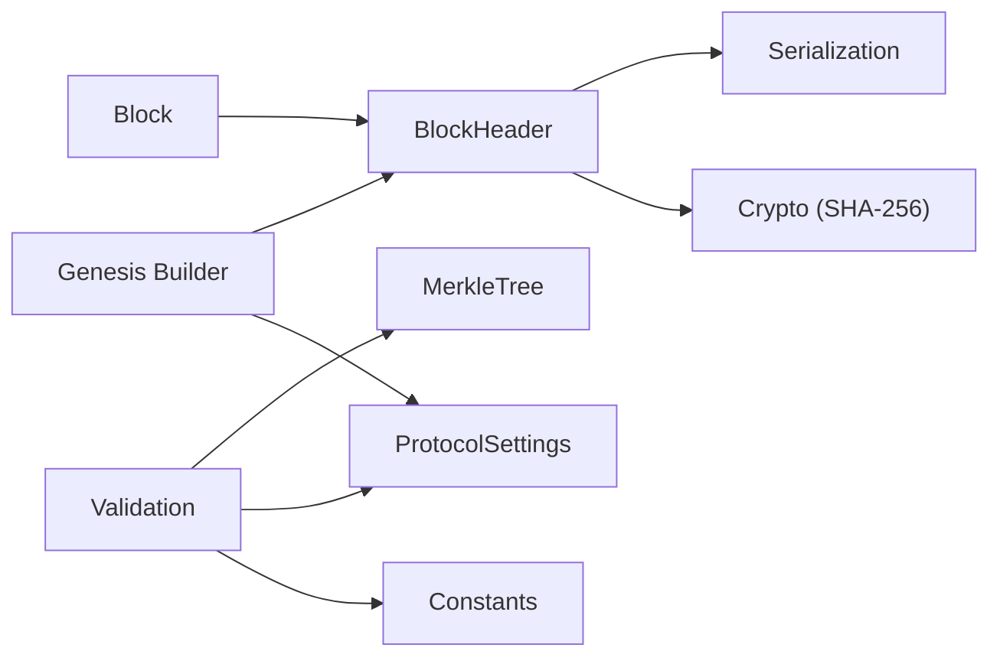

**Diagram sources**
- [block.rs:6-38](file://neo-core/src/ledger/block.rs#L6-L38)
- [block_header.rs:101-164](file://neo-core/src/ledger/block_header.rs#L101-L164)
- [validation.rs:12-24](file://neo-core/src/validation.rs#L12-L24)
- [constants.rs:24-33](file://neo-core/src/constants.rs#L24-L33)
- [merkle_tree.rs:87-124](file://neo-crypto/src/merkle_tree.rs#L87-L124)
- [genesis.rs:17-41](file://neo-core/src/ledger/genesis.rs#L17-L41)
- [protocol_settings.rs:25-80](file://neo-core/src/protocol_settings.rs#L25-L80)

**Section sources**
- [block.rs:6-38](file://neo-core/src/ledger/block.rs#L6-L38)
- [block_header.rs:101-164](file://neo-core/src/ledger/block_header.rs#L101-L164)
- [validation.rs:12-24](file://neo-core/src/validation.rs#L12-L24)
- [constants.rs:24-33](file://neo-core/src/constants.rs#L24-L33)
- [merkle_tree.rs:87-124](file://neo-crypto/src/merkle_tree.rs#L87-L124)
- [genesis.rs:17-41](file://neo-core/src/ledger/genesis.rs#L17-L41)
- [protocol_settings.rs:25-80](file://neo-core/src/protocol_settings.rs#L25-L80)

## Performance Considerations
- Header hashing:
  - Uses lazy caching to avoid repeated SHA-256 computations on the same header
- Merkle root:
  - Optimized iterative algorithm with O(n) time and space; avoids building full node trees when only the root is needed
- Serialization:
  - Separate unsigned serialization minimizes work for hashing and reduces overhead
- Large blocks:
  - Enforce MAX_BLOCK_SIZE and MAX_TRANSACTIONS_PER_BLOCK to bound memory and CPU usage
  - Prefer streaming deserialization where possible to handle large payloads efficiently
- Recommendations:
  - Reuse buffers and avoid unnecessary allocations in hot paths
  - Batch transaction hash collection before Merkle computation
  - Cache derived values (e.g., header hash) once computed

[No sources needed since this section provides general guidance]

## Troubleshooting Guide
Common validation failures and their causes:
- BlockTooLarge: Serialized block exceeds MAX_BLOCK_SIZE
- TooManyTransactions: Transaction count exceeds MAX_TRANSACTIONS_PER_BLOCK
- TimestampTooOld: Timestamp below genesis minimum
- TimestampTooFarInFuture: Timestamp beyond allowed drift from current time
- TimestampNotIncreasing: Current timestamp not strictly greater than previous block’s timestamp
- InvalidMerkleRoot: Declared merkle_root does not match computed root from transactions
- DuplicateTransactions: Multiple transactions share the same hash
- InvalidWitnessScript: Invocation or verification scripts exceed limits or contain invalid opcodes
- UnsupportedVersion: Block version is not 0
- InvalidPrimaryIndex: primary_index out of range for active validators

Diagnostic steps:
- Verify block size and transaction count against constants and protocol settings
- Ensure timestamps are monotonically increasing and within bounds
- Recompute Merkle root from transaction hashes and compare with header
- Check witness script sizes and opcodes
- Confirm block version and primary_index validity

**Section sources**
- [validation.rs:36-126](file://neo-core/src/validation.rs#L36-L126)
- [validation.rs:128-409](file://neo-core/src/validation.rs#L128-L409)

## Conclusion
Neo-RS implements a robust block model with clear separation between header and content, deterministic genesis construction, efficient hashing and Merkle root computation, and comprehensive validation covering size, transactions, timestamps, witnesses, and consensus fields. Following these guidelines ensures compatibility with the Neo N3 protocol and maintains performance and security for both small and large blocks.

[No sources needed since this section summarizes without analyzing specific files]