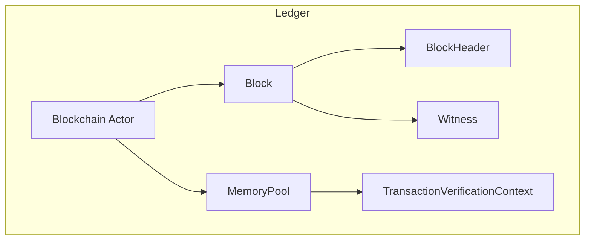
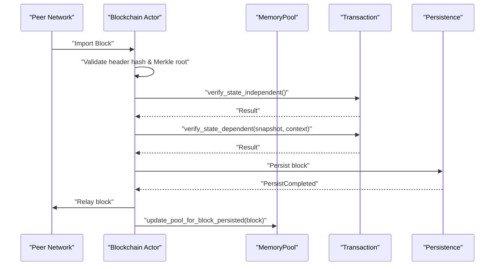
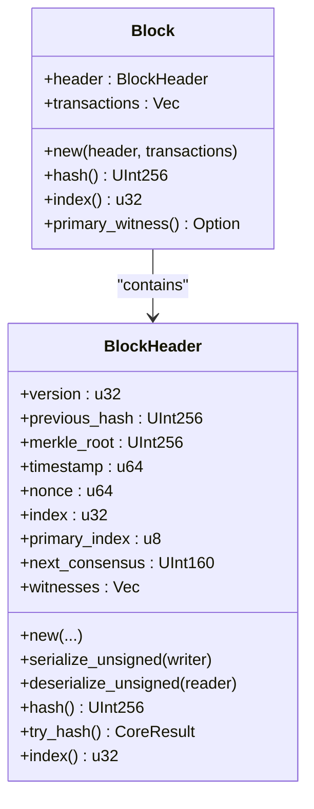
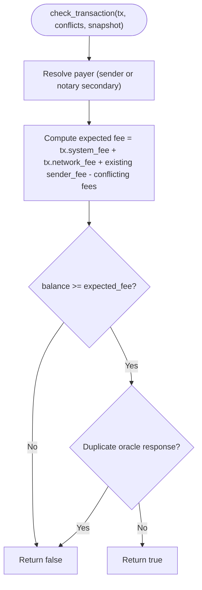
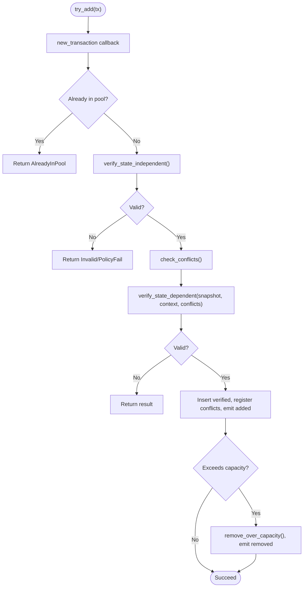
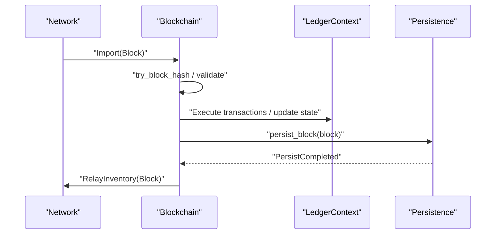
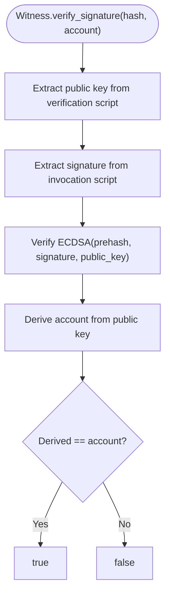
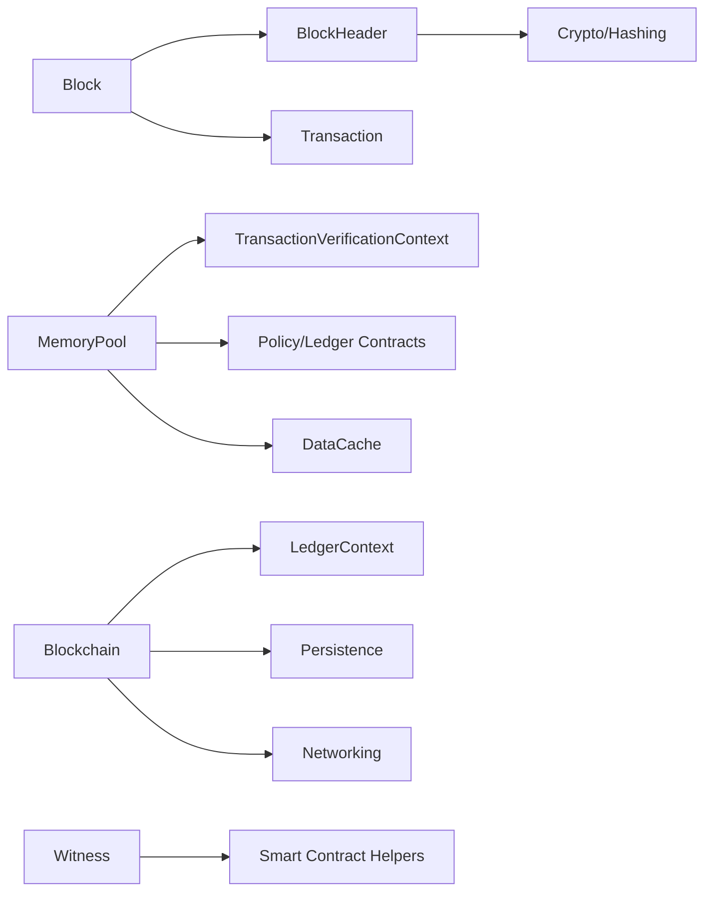
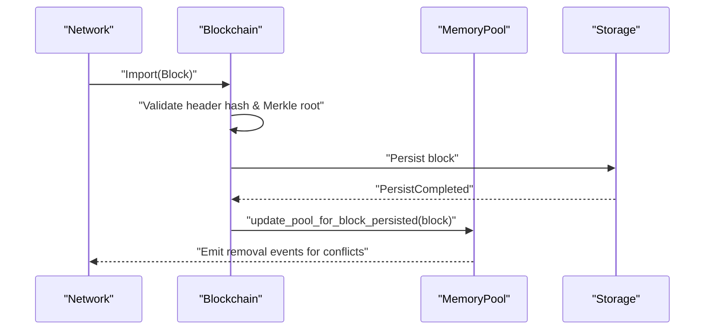
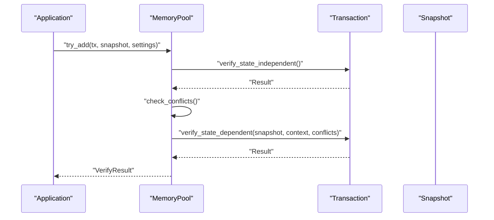

# Blockchain Ledger

<cite>
**Referenced Files in This Document**
- [block.rs](file://neo-core/src/ledger/block.rs)
- [block_header.rs](file://neo-core/src/ledger/block_header.rs)
- [mod.rs](file://neo-core/src/ledger/mod.rs)
- [transaction_verification_context.rs](file://neo-core/src/ledger/transaction_verification_context.rs)
- [memory_pool_mod.rs](file://neo-core/src/ledger/memory_pool/mod.rs)
- [blockchain_mod.rs](file://neo-core/src/ledger/blockchain/mod.rs)
- [witness.rs](file://neo-core/src/witness.rs)
</cite>

## Table of Contents
1. [Introduction](#introduction)
2. [Project Structure](#project-structure)
3. [Core Components](#core-components)
4. [Architecture Overview](#architecture-overview)
5. [Detailed Component Analysis](#detailed-component-analysis)
6. [Dependency Analysis](#dependency-analysis)
7. [Performance Considerations](#performance-considerations)
8. [Troubleshooting Guide](#troubleshooting-guide)
9. [Conclusion](#conclusion)
10. [Appendices](#appendices)

## Introduction
This document explains the Neo-RS blockchain ledger component with a focus on core data structures (Block, BlockHeader, Transaction), validation and processing pipelines from reception to persistence, transaction verification context, fee calculation, witness validation, chain state management, reorganizations, mempool behavior, and performance considerations for large blocks and high-throughput scenarios. It also provides conceptual examples of block construction, transaction submission, and state queries using the referenced modules.

## Project Structure
The ledger lives under neo-core/src/ledger and exposes:
- Block and BlockHeader definitions
- Memory pool implementation mirroring C# parity
- Transaction verification context tracking per-sender fees and oracle responses
- Blockchain actor for import, verify, persist, relay, and caching
- Supporting types for events, removal reasons, and routing

**Diagram sources**
- [block.rs:6-38](file://neo-core/src/ledger/block.rs#L6-L38)
- [block_header.rs:13-38](file://neo-core/src/ledger/block_header.rs#L13-L38)
- [memory_pool_mod.rs:66-91](file://neo-core/src/ledger/memory_pool/mod.rs#L66-L91)
- [transaction_verification_context.rs:15-20](file://neo-core/src/ledger/transaction_verification_context.rs#L15-L20)
- [blockchain_mod.rs:118-127](file://neo-core/src/ledger/blockchain/mod.rs#L118-L127)
- [witness.rs:59-74](file://neo-core/src/witness.rs#L59-L74)

**Section sources**
- [mod.rs:1-65](file://neo-core/src/ledger/mod.rs#L1-L65)

## Core Components
- Block: A header plus its transactions; delegates hash/index to header and exposes primary witness access.
- BlockHeader: Versioned header with previous hash, merkle root, timestamp, nonce, index, primary index, next consensus, witnesses; computes and caches SHA-256 over unsigned payload.
- Transaction: Referenced by Block and processed through the memory pool and blockchain actor; verified via state-independent and state-dependent checks.
- Witness: Encapsulates invocation and verification scripts; supports single-signature and multi-signature verification flows.
- MemoryPool: Maintains verified/unverified sets, conflict detection/resolution, capacity limits, rebroadcast logic, and reverification budgets.
- TransactionVerificationContext: Tracks per-payer accumulated fees and oracle response deduplication; used during mempool checks.
- Blockchain Actor: Orchestrates import, verification, persistence, relay, and caching of blocks and inventory payloads.

**Section sources**
- [block.rs:6-38](file://neo-core/src/ledger/block.rs#L6-L38)
- [block_header.rs:13-38](file://neo-core/src/ledger/block_header.rs#L13-L38)
- [witness.rs:59-74](file://neo-core/src/witness.rs#L59-L74)
- [memory_pool_mod.rs:66-91](file://neo-core/src/ledger/memory_pool/mod.rs#L66-L91)
- [transaction_verification_context.rs:15-20](file://neo-core/src/ledger/transaction_verification_context.rs#L15-L20)
- [blockchain_mod.rs:118-127](file://neo-core/src/ledger/blockchain/mod.rs#L118-L127)

## Architecture Overview
The ledger processes blocks and transactions through an actor-driven pipeline:
- Reception: Blocks arrive via network or fast sync; inventory cache avoids redundant work.
- Verification: Header hash and Merkle root are validated; transactions undergo state-independent then state-dependent checks.
- Execution and State Update: Transactions are executed against current state; native contracts and policies apply.
- Persistence: Persisted blocks update chain state; plugin events may be emitted.
- Relay: Validated blocks are broadcast to peers.
- Mempool: New transactions enter the pool, pass policy/state checks, handle conflicts, and get reverified within time budgets after blocks are persisted.

**Diagram sources**
- [blockchain_mod.rs:151-201](file://neo-core/src/ledger/blockchain/mod.rs#L151-L201)
- [memory_pool_mod.rs:386-483](file://neo-core/src/ledger/memory_pool/mod.rs#L386-L483)

## Detailed Component Analysis

### Block and BlockHeader
- Block wraps a BlockHeader and Vec<Transaction>. Hash and index delegate to header; primary witness is the first header witness.
- BlockHeader fields include version, previous_hash, merkle_root, timestamp, nonce, index, primary_index, next_consensus, witnesses. Hash is computed over the serialized unsigned portion and cached. Serialization enforces exactly one witness in full deserialization path.

**Diagram sources**
- [block.rs:6-38](file://neo-core/src/ledger/block.rs#L6-L38)
- [block_header.rs:13-38](file://neo-core/src/ledger/block_header.rs#L13-L38)
- [block_header.rs:73-170](file://neo-core/src/ledger/block_header.rs#L73-L170)
- [block_header.rs:189-225](file://neo-core/src/ledger/block_header.rs#L189-L225)

**Section sources**
- [block.rs:6-38](file://neo-core/src/ledger/block.rs#L6-L38)
- [block_header.rs:13-38](file://neo-core/src/ledger/block_header.rs#L13-L38)
- [block_header.rs:73-170](file://neo-core/src/ledger/block_header.rs#L73-L170)
- [block_header.rs:189-225](file://neo-core/src/ledger/block_header.rs#L189-L225)

### Transaction Verification Context and Fee Calculation
- Tracks per-payer total fees (system_fee + network_fee) and oracle response IDs to prevent duplicate responses.
- Payer resolution accounts for Notary-sponsored transactions where the second signer’s account is charged against Notary deposit.
- check_transaction validates that payer balance covers expected cumulative fee considering conflicting transactions already in the pool and rejects duplicates of oracle responses.

**Diagram sources**
- [transaction_verification_context.rs:47-148](file://neo-core/src/ledger/transaction_verification_context.rs#L47-L148)

**Section sources**
- [transaction_verification_context.rs:15-20](file://neo-core/src/ledger/transaction_verification_context.rs#L15-L20)
- [transaction_verification_context.rs:47-148](file://neo-core/src/ledger/transaction_verification_context.rs#L47-L148)

### Memory Pool: Reception, Validation, Conflicts, Reverification
- try_add performs:
  - new_transaction callback (optional cancellation)
  - AlreadyInPool check
  - State-independent validation first (security fix)
  - Conflict detection and removal of lower-fee conflicts when appropriate
  - Optional per-sender limit enforcement
  - State-dependent validation using snapshot and verification context
  - Insertion into verified set, registration of conflicts, event callbacks
  - Capacity eviction if needed
- update_pool_for_block_persisted removes committed transactions, evicts stale/conflicting entries, invalidates verified set, and re-verifies unverified transactions within a time budget.
- reverify_top_unverified_transactions promotes valid transactions back to verified set and may trigger rebroadcast based on time thresholds.

**Diagram sources**
- [memory_pool_mod.rs:236-384](file://neo-core/src/ledger/memory_pool/mod.rs#L236-L384)
- [memory_pool_mod.rs:386-483](file://neo-core/src/ledger/memory_pool/mod.rs#L386-L483)
- [memory_pool_mod.rs:501-654](file://neo-core/src/ledger/memory_pool/mod.rs#L501-L654)

**Section sources**
- [memory_pool_mod.rs:66-91](file://neo-core/src/ledger/memory_pool/mod.rs#L66-L91)
- [memory_pool_mod.rs:236-384](file://neo-core/src/ledger/memory_pool/mod.rs#L236-L384)
- [memory_pool_mod.rs:386-483](file://neo-core/src/ledger/memory_pool/mod.rs#L386-L483)
- [memory_pool_mod.rs:501-654](file://neo-core/src/ledger/memory_pool/mod.rs#L501-L654)

### Blockchain Actor: Import, Verify, Persist, Relay
- Receives Import commands, validates headers and transactions, persists blocks via system context, emits completion events, and relays to peers.
- Uses caches for verified blocks, unverified blocks, and inventory payloads to avoid redundant work and manage memory.

**Diagram sources**
- [blockchain_mod.rs:118-127](file://neo-core/src/ledger/blockchain/mod.rs#L118-L127)
- [blockchain_mod.rs:151-201](file://neo-core/src/ledger/blockchain/mod.rs#L151-L201)

**Section sources**
- [blockchain_mod.rs:118-127](file://neo-core/src/ledger/blockchain/mod.rs#L118-L127)
- [blockchain_mod.rs:151-201](file://neo-core/src/ledger/blockchain/mod.rs#L151-L201)

### Witness Validation
- Single-signature: Extract public key from verification script, signature from invocation script, verify ECDSA prehashed signature, and ensure derived account matches expected.
- Multi-signature: Build redeem script from required signatures and public keys, verify each signature against sorted public keys, and confirm account derivation.

**Diagram sources**
- [witness.rs:171-188](file://neo-core/src/witness.rs#L171-L188)
- [witness.rs:190-255](file://neo-core/src/witness.rs#L190-L255)
- [witness.rs:257-351](file://neo-core/src/witness.rs#L257-L351)

**Section sources**
- [witness.rs:59-74](file://neo-core/src/witness.rs#L59-L74)
- [witness.rs:171-188](file://neo-core/src/witness.rs#L171-L188)
- [witness.rs:190-255](file://neo-core/src/witness.rs#L190-L255)
- [witness.rs:257-351](file://neo-core/src/witness.rs#L257-L351)

### Examples (Conceptual)
- Block construction: Create a BlockHeader with version, previous_hash, merkle_root, timestamp, nonce, index, primary_index, next_consensus, and witnesses; wrap it with a Vec<Transaction> to form a Block.
- Transaction submission: Call MemoryPool.try_add with a Transaction, DataCache snapshot, and ProtocolSettings; handle VerifyResult outcomes and optional callbacks.
- State queries: Use LedgerContract and native contract APIs exposed through the runtime to read current index, balances, and other on-chain state.

[No sources needed since this section provides conceptual usage without quoting code]

## Dependency Analysis
- Block depends on BlockHeader and Transaction; BlockHeader depends on cryptographic primitives and serialization helpers.
- MemoryPool depends on TransactionVerificationContext, Policy/Ledger contracts for settings and time-per-block, and persistence snapshots.
- Blockchain depends on LedgerContext, persistence, protocol settings, and networking for relay.
- Witness depends on cryptography and smart contract helper utilities.

**Diagram sources**
- [block.rs:6-38](file://neo-core/src/ledger/block.rs#L6-L38)
- [block_header.rs:13-38](file://neo-core/src/ledger/block_header.rs#L13-L38)
- [memory_pool_mod.rs:66-91](file://neo-core/src/ledger/memory_pool/mod.rs#L66-L91)
- [transaction_verification_context.rs:15-20](file://neo-core/src/ledger/transaction_verification_context.rs#L15-L20)
- [blockchain_mod.rs:118-127](file://neo-core/src/ledger/blockchain/mod.rs#L118-L127)
- [witness.rs:59-74](file://neo-core/src/witness.rs#L59-L74)

**Section sources**
- [block.rs:6-38](file://neo-core/src/ledger/block.rs#L6-L38)
- [block_header.rs:13-38](file://neo-core/src/ledger/block_header.rs#L13-L38)
- [memory_pool_mod.rs:66-91](file://neo-core/src/ledger/memory_pool/mod.rs#L66-L91)
- [transaction_verification_context.rs:15-20](file://neo-core/src/ledger/transaction_verification_context.rs#L15-L20)
- [blockchain_mod.rs:118-127](file://neo-core/src/ledger/blockchain/mod.rs#L118-L127)
- [witness.rs:59-74](file://neo-core/src/witness.rs#L59-L74)

## Performance Considerations
- Large blocks:
  - BlockHeader hash is cached to avoid recomputation.
  - MemoryPool uses pre-allocated vectors for conflict lists and optimizes cloning via Arc references where possible.
  - Inventory cache reduces redundant deserialization and verification work.
- High throughput:
  - Time-bounded reverification prevents blocking during idle periods; budgets are derived from time_per_block and hardfork-aware policies.
  - Capacity-based eviction prioritizes higher-fee transactions and maintains pool health.
  - Rebroadcast throttling scales with pool size to reduce network churn.
- Fast sync:
  - Persist failures do not halt sync; blocks may be skipped while maintaining chain continuity.

[No sources needed since this section provides general guidance]

## Troubleshooting Guide
Common issues and diagnostics:
- Transaction rejected at mempool entry:
  - State-independent validation failure indicates structural/script/attribute issues.
  - Policy fail can arise from per-sender limits or insufficient balance relative to expected cumulative fee.
  - Conflicts: Ensure network_fee exceeds combined fees of conflicting transactions or remove conflicting attributes.
- Duplicate oracle response:
  - TransactionVerificationContext tracks oracle response IDs; duplicate responses are rejected.
- Reverification stalls:
  - Check time budgets and header backlog flags; reverification may be paused until backlog clears.
- Block persistence errors:
  - Blockchain logs warnings on hash computation or persistence failures; fast sync continues despite transient failures.

**Section sources**
- [memory_pool_mod.rs:236-384](file://neo-core/src/ledger/memory_pool/mod.rs#L236-L384)
- [transaction_verification_context.rs:93-148](file://neo-core/src/ledger/transaction_verification_context.rs#L93-L148)
- [blockchain_mod.rs:151-201](file://neo-core/src/ledger/blockchain/mod.rs#L151-L201)

## Conclusion
The Neo-RS ledger provides a robust, C#-parity implementation of block and transaction handling with strong emphasis on security (state-independent checks first), correctness (conflict resolution and oracle deduplication), and performance (caching, budgets, capacity management). The Blockchain actor coordinates import, verification, persistence, and relay, while the MemoryPool ensures efficient transaction lifecycle management and timely revalidation.

[No sources needed since this section summarizes without analyzing specific files]

## Appendices

### Key Processing Flows

#### Block Processing Pipeline

**Diagram sources**
- [blockchain_mod.rs:151-201](file://neo-core/src/ledger/blockchain/mod.rs#L151-L201)
- [memory_pool_mod.rs:386-483](file://neo-core/src/ledger/memory_pool/mod.rs#L386-L483)

#### Transaction Submission Flow

**Diagram sources**
- [memory_pool_mod.rs:236-384](file://neo-core/src/ledger/memory_pool/mod.rs#L236-L384)