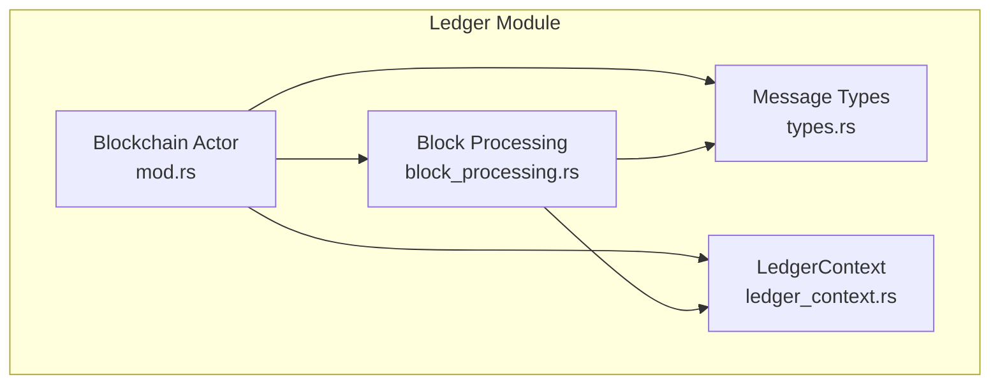
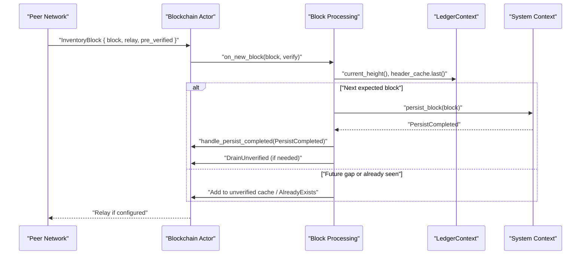
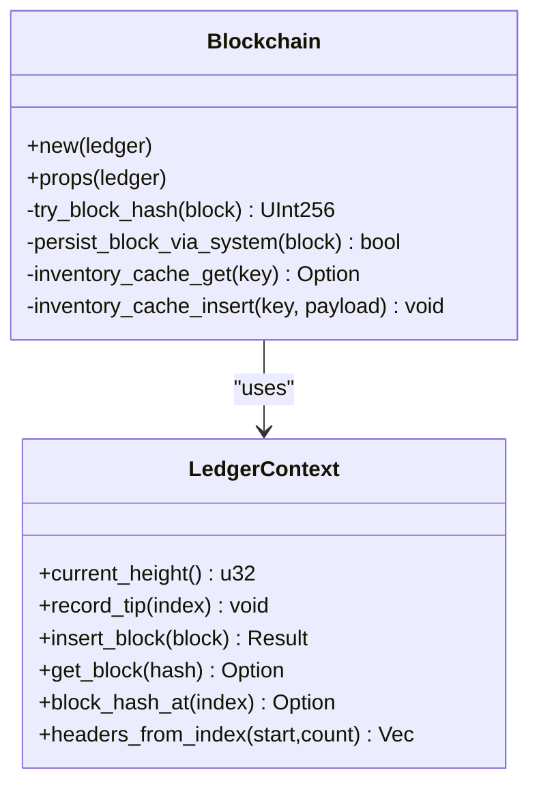
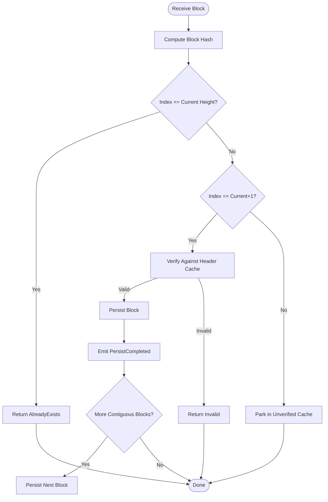
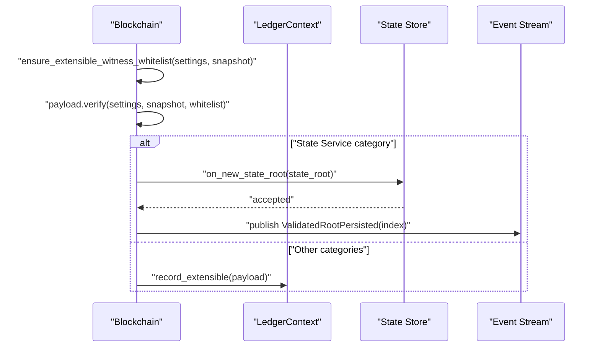
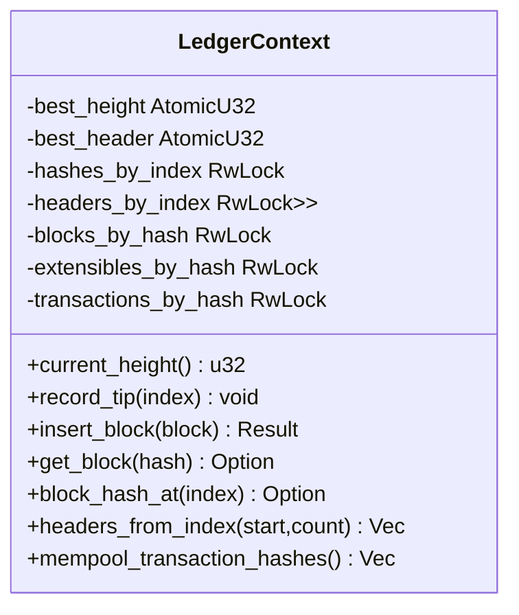
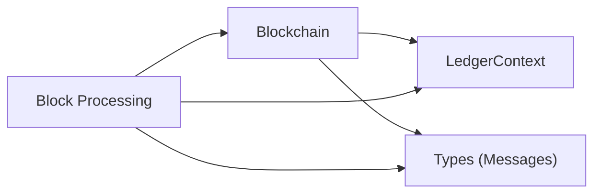

# Blockchain State Management

<cite>
**Referenced Files in This Document**
- [mod.rs](file://neo-core/src/ledger/blockchain/mod.rs)
- [block_processing.rs](file://neo-core/src/ledger/blockchain/block_processing.rs)
- [types.rs](file://neo-core/src/ledger/blockchain/types.rs)
- [ledger_context.rs](file://neo-core/src/ledger/ledger_context.rs)
- [mod.rs (ledger)](file://neo-core/src/ledger/mod.rs)
</cite>

## Table of Contents
1. Introduction
2. Project Structure
3. Core Components
4. Architecture Overview
5. Detailed Component Analysis
6. Dependency Analysis
7. Performance Considerations
8. Troubleshooting Guide
9. Conclusion

## Introduction
This document explains blockchain state management in Neo-RS with a focus on the Blockchain actor, block processing pipeline, persistence, and reorganization handling. It also documents the LedgerContext role in coordinating operations across components, chain reorganization logic, fork resolution, and consistency maintenance. Practical examples for block import, processing workflows, and state queries are included, along with scalability considerations and performance tuning guidance for production deployments.

## Project Structure
The blockchain state management is implemented primarily under the ledger module:
- The Blockchain actor encapsulates block validation, caching, persistence coordination, and event emission.
- Block processing logic handles incoming blocks, verification, sequencing, and draining unverified blocks into persistent storage.
- Types define messages and data structures exchanged between components.
- LedgerContext provides shared in-memory caches for blocks, headers, transactions, and extensible payloads, plus tip tracking.

**Diagram sources**
- [mod.rs:1-239](file://neo-core/src/ledger/blockchain/mod.rs#L1-L239)
- [block_processing.rs:1-465](file://neo-core/src/ledger/blockchain/block_processing.rs#L1-L465)
- [types.rs:1-179](file://neo-core/src/ledger/blockchain/types.rs#L1-L179)
- [ledger_context.rs:1-228](file://neo-core/src/ledger/ledger_context.rs#L1-L228)

**Section sources**
- [mod.rs (ledger):15-65](file://neo-core/src/ledger/mod.rs#L15-L65)
- [mod.rs:1-239](file://neo-core/src/ledger/blockchain/mod.rs#L1-L239)

## Core Components
- Blockchain: The core actor that manages block import, verification, caching, persistence coordination, and event emissions. It maintains caches for verified and unverified blocks and integrates with system context for persistence and events.
- Block Processing: Implements on_new_block, persist_block_sequence, handle_drain_unverified, and related helpers to validate, sequence, and persist blocks while managing cache limits and backpressure.
- Message Types: Defines commands and notifications such as Import, PersistCompleted, Reverify, InventoryBlock, DrainUnverified, and RelayResult used by the actor and peers.
- LedgerContext: Centralized in-memory cache for blocks, headers, transactions, and extensible payloads; tracks best height and header index; supports fast lookups and range queries.

Key responsibilities:
- Validate and verify blocks against protocol settings and cached headers.
- Sequence contiguous blocks for persistence using batched draining.
- Maintain bounded caches to prevent memory growth and ensure continuity during sync.
- Emit plugin events and relay inventory to peers when appropriate.

**Section sources**
- [mod.rs:118-239](file://neo-core/src/ledger/blockchain/mod.rs#L118-L239)
- [block_processing.rs:13-138](file://neo-core/src/ledger/blockchain/block_processing.rs#L13-L138)
- [types.rs:25-179](file://neo-core/src/ledger/blockchain/types.rs#L25-L179)
- [ledger_context.rs:14-164](file://neo-core/src/ledger/ledger_context.rs#L14-L164)

## Architecture Overview
The Blockchain actor orchestrates the lifecycle of blocks from reception to persistence and relaying. It uses caches to handle out-of-order arrivals and ensures contiguous persistence through scheduled draining. LedgerContext provides shared state for quick access to recent ledger data and tip tracking.

**Diagram sources**
- [block_processing.rs:13-138](file://neo-core/src/ledger/blockchain/block_processing.rs#L13-L138)
- [types.rs:132-179](file://neo-core/src/ledger/blockchain/types.rs#L132-L179)
- [ledger_context.rs:25-80](file://neo-core/src/ledger/ledger_context.rs#L25-L80)
- [mod.rs:156-201](file://neo-core/src/ledger/blockchain/mod.rs#L156-L201)

## Detailed Component Analysis

### Blockchain Actor
Responsibilities:
- Create and configure the actor with a shared LedgerContext.
- Manage caches for verified and unverified blocks.
- Integrate with system context for persistence and event streaming.
- Handle extensible payloads and state service integration.

Key methods and behaviors:
- new(props): Initializes caches and actor properties.
- try_block_hash: Computes block hash safely.
- persist_block_via_system: Delegates persistence to system context and logs outcomes.
- inventory_cache_get/insert: Manages inventory payload cache for reverification.

**Diagram sources**
- [mod.rs:118-239](file://neo-core/src/ledger/blockchain/mod.rs#L118-L239)
- [ledger_context.rs:14-164](file://neo-core/src/ledger/ledger_context.rs#L14-L164)

**Section sources**
- [mod.rs:118-239](file://neo-core/src/ledger/blockchain/mod.rs#L118-L239)

### Block Processing Pipeline
End-to-end flow:
- Reception: InventoryBlock message triggers on_new_block.
- Validation: Compute block hash; check current height vs block index; verify block header against header cache if next expected; otherwise validate cached header hash.
- Sequencing: If next expected, persist immediately; else park in unverified cache.
- Persistence: Batched drain via persist_block_sequence and handle_drain_unverified to maintain throughput and yield control to process other messages.
- Events: On successful persistence, emit PersistCompleted and trigger further draining if more contiguous blocks exist.

**Diagram sources**
- [block_processing.rs:13-138](file://neo-core/src/ledger/blockchain/block_processing.rs#L13-L138)
- [block_processing.rs:168-220](file://neo-core/src/ledger/blockchain/block_processing.rs#L168-L220)
- [block_processing.rs:226-295](file://neo-core/src/ledger/blockchain/block_processing.rs#L226-L295)

**Section sources**
- [block_processing.rs:13-138](file://neo-core/src/ledger/blockchain/block_processing.rs#L13-L138)
- [block_processing.rs:168-220](file://neo-core/src/ledger/blockchain/block_processing.rs#L168-L220)
- [block_processing.rs:226-295](file://neo-core/src/ledger/blockchain/block_processing.rs#L226-L295)

### Extensible Payload Handling
- Validates extensible payloads against an extensible witness whitelist built from committee, validators, and optional state validators.
- Routes state service payloads to the state store and publishes validated root persisted events.

**Diagram sources**
- [block_processing.rs:327-463](file://neo-core/src/ledger/blockchain/block_processing.rs#L327-L463)

**Section sources**
- [block_processing.rs:327-463](file://neo-core/src/ledger/blockchain/block_processing.rs#L327-L463)

### LedgerContext Coordination
LedgerContext acts as a centralized cache and tip tracker:
- Tracks best height and best header index atomically.
- Stores blocks, headers, transactions, and extensible payloads for fast retrieval.
- Provides range queries for hashes and headers to support synchronization and RPCs.

**Diagram sources**
- [ledger_context.rs:14-164](file://neo-core/src/ledger/ledger_context.rs#L14-L164)

**Section sources**
- [ledger_context.rs:14-164](file://neo-core/src/ledger/ledger_context.rs#L14-L164)

### Chain Reorganization and Fork Resolution
Reorganization behavior is enforced by strict sequential persistence and header validation:
- Only the next expected block (current_height + 1) is persisted immediately; future blocks are parked in the unverified cache until earlier blocks arrive.
- Verification against cached headers ensures block integrity and prevents acceptance of invalid forks.
- If persistence fails for a block, the sequence stops, allowing recovery and retry mechanisms to handle reordering or retransmission.

Consistency maintenance:
- Cached header hashes are validated against incoming blocks to detect mismatches early.
- Unbounded growth is prevented via bounded caches; eviction prioritizes keeping lower indices near persistence front.

**Section sources**
- [block_processing.rs:53-102](file://neo-core/src/ledger/blockchain/block_processing.rs#L53-L102)
- [block_processing.rs:140-166](file://neo-core/src/ledger/blockchain/block_processing.rs#L140-L166)

### Examples and Workflows

#### Block Import Workflow
- Receive InventoryBlock message with block and flags.
- on_new_block validates and sequences the block.
- If next expected, persist immediately; otherwise park in unverified cache.
- PersistCompleted triggers further draining to continue contiguous persistence.

**Section sources**
- [types.rs:132-179](file://neo-core/src/ledger/blockchain/types.rs#L132-L179)
- [block_processing.rs:13-138](file://neo-core/src/ledger/blockchain/block_processing.rs#L13-L138)
- [block_processing.rs:168-220](file://neo-core/src/ledger/blockchain/block_processing.rs#L168-L220)

#### State Queries
- Retrieve current height and header index via LedgerContext.
- Query block hashes following a given hash using block_hashes_from.
- Fetch headers starting at an index using headers_from_index.

**Section sources**
- [ledger_context.rs:25-164](file://neo-core/src/ledger/ledger_context.rs#L25-L164)

## Dependency Analysis
Components interact through well-defined messages and shared context:
- Blockchain depends on LedgerContext for tip tracking and caching.
- Block Processing relies on Blockchain’s caches and system context for persistence.
- Types define the contract for messages like Import, PersistCompleted, and DrainUnverified.

**Diagram sources**
- [mod.rs:118-239](file://neo-core/src/ledger/blockchain/mod.rs#L118-L239)
- [block_processing.rs:13-138](file://neo-core/src/ledger/blockchain/block_processing.rs#L13-L138)
- [types.rs:132-179](file://neo-core/src/ledger/blockchain/types.rs#L132-L179)
- [ledger_context.rs:14-164](file://neo-core/src/ledger/ledger_context.rs#L14-L164)

**Section sources**
- [mod.rs:118-239](file://neo-core/src/ledger/blockchain/mod.rs#L118-L239)
- [block_processing.rs:13-138](file://neo-core/src/ledger/blockchain/block_processing.rs#L13-L138)
- [types.rs:132-179](file://neo-core/src/ledger/blockchain/types.rs#L132-L179)
- [ledger_context.rs:14-164](file://neo-core/src/ledger/ledger_context.rs#L14-L164)

## Performance Considerations
- Batched persistence: DRAIN_BATCH_SIZE limits work per pass to yield control and process queued messages, improving responsiveness under load.
- Bounded caches: MAX_BLOCK_CACHE_SIZE and MAX_UNVERIFIED_CACHE_SIZE prevent memory growth; eviction strategy keeps lower indices near persistence front to maintain continuity.
- Efficient lookups: LedgerContext uses atomic counters and lock-protected maps/vectors for fast reads/writes; range queries minimize allocations.
- Backpressure: Out-of-order blocks are parked rather than rejected outright, reducing peer disconnects and enabling later sequencing.
- Event streaming: PersistCompleted events allow downstream consumers to react without blocking the main path.

Recommendations for production:
- Tune DRAIN_BATCH_SIZE based on I/O characteristics and CPU cores.
- Monitor cache sizes and adjust MAX_* constants to match sync windows and network conditions.
- Ensure system context persistence layer is optimized (e.g., RocksDB tuning) to avoid bottlenecks during persist_block_via_system.
- Use metrics and logging around milestones and failures to detect stalls or divergence early.

[No sources needed since this section provides general guidance]

## Troubleshooting Guide
Common issues and diagnostics:
- Block hash computation failure: Indicates malformed block data; logs include error details and block index.
- Verification failure against header cache: Suggests mismatched headers or invalid block; inspect prev_hash and header cache state.
- AlreadyExists responses: Normal for duplicate blocks; ensure deduplication paths are functioning.
- OutOfMemory responses: Occurs when block cache is full and not next expected; indicates need to increase cache size or improve persistence throughput.
- Persistence failures: Logs warn about errors; fast sync may continue despite failures but monitor for gaps.

Operational checks:
- Confirm LedgerContext.current_height aligns with persisted tip.
- Verify headers_from_index returns contiguous headers up to highest_header_index.
- Inspect unverified cache size and eviction behavior during high-throughput sync.

**Section sources**
- [block_processing.rs:20-31](file://neo-core/src/ledger/blockchain/block_processing.rs#L20-L31)
- [block_processing.rs:62-102](file://neo-core/src/ledger/blockchain/block_processing.rs#L62-L102)
- [block_processing.rs:104-116](file://neo-core/src/ledger/blockchain/block_processing.rs#L104-L116)
- [block_processing.rs:156-201](file://neo-core/src/ledger/blockchain/block_processing.rs#L156-L201)

## Conclusion
Neo-RS implements robust blockchain state management through a clear separation of concerns: the Blockchain actor coordinates messaging and caching, block processing enforces validation and sequencing, and LedgerContext centralizes in-memory state and tip tracking. The design emphasizes safety (strict sequential persistence and header validation), resilience (parking future blocks and bounded caches), and performance (batched draining and efficient lookups). For production deployments, tune batching and cache sizes, monitor persistence performance, and leverage event streams for downstream processing.

[No sources needed since this section summarizes without analyzing specific files]