# Memory Pool Management

<cite>
**Referenced Files in This Document**
- [mod.rs](file://neo-core/src/ledger/memory_pool/mod.rs)
- [index.rs](file://neo-core/src/ledger/memory_pool/index.rs)
- [views.rs](file://neo-core/src/ledger/memory_pool/views.rs)
- [pool_item.rs](file://neo-core/src/ledger/pool_item.rs)
- [transaction_verification_context.rs](file://neo-core/src/ledger/transaction_verification_context.rs)
- [tests.rs](file://neo-core/src/ledger/memory_pool/tests.rs)
- [rpc_server_blockchain_mod.rs](file://neo-rpc/src/server/rpc_server_blockchain/mod.rs)
- [events.rs](file://neo-rpc/src/server/ws/events.rs)
- [verify_result.rs](file://neo-primitives/src/verify_result.rs)
- [transaction_removal_reason.rs](file://neo-primitives/src/transaction_removal_reason.rs)
</cite>

## Table of Contents
1. [Introduction](#introduction)
2. [Project Structure](#project-structure)
3. [Core Components](#core-components)
4. [Architecture Overview](#architecture-overview)
5. [Detailed Component Analysis](#detailed-component-analysis)
6. [Dependency Analysis](#dependency-analysis)
7. [Performance Considerations](#performance-considerations)
8. [Troubleshooting Guide](#troubleshooting-guide)
9. [Conclusion](#conclusion)
10. [Appendices](#appendices)

## Introduction
This document explains the memory pool (mempool) management in Neo-RS, focusing on how transactions are validated, indexed, and maintained across verified and unverified queues. It covers conflict detection via transaction attributes, verification context for fee and oracle tracking, revalidation logic with time budgets, eviction policies under capacity constraints, and event callbacks that integrate mempool lifecycle events into the broader blockchain system.

## Project Structure
The mempool is implemented as a module with three primary parts:
- Core pool logic and lifecycle methods
- Indexing structure for fast lookup and priority ordering
- Views for querying verified/unverified sets and iterators

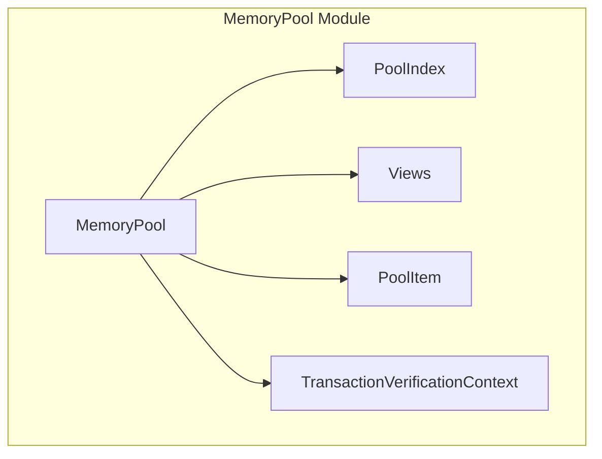

**Diagram sources**
- [mod.rs:66-91](file://neo-core/src/ledger/memory_pool/mod.rs#L66-L91)
- [index.rs:9-13](file://neo-core/src/ledger/memory_pool/index.rs#L9-L13)
- [views.rs:8-213](file://neo-core/src/ledger/memory_pool/views.rs#L8-L213)
- [pool_item.rs:36-83](file://neo-core/src/ledger/pool_item.rs#L36-L83)
- [transaction_verification_context.rs:15-20](file://neo-core/src/ledger/transaction_verification_context.rs#L15-L20)

**Section sources**
- [mod.rs:1-35](file://neo-core/src/ledger/memory_pool/mod.rs#L1-L35)
- [index.rs:1-21](file://neo-core/src/ledger/memory_pool/index.rs#L1-L21)
- [views.rs:1-20](file://neo-core/src/ledger/memory_pool/views.rs#L1-L20)

## Core Components
- MemoryPool: Maintains verified and unverified transaction sets, conflict mappings, and verification context; exposes add, remove, update, and query APIs.
- PoolIndex: Combines HashMap for O(1) lookups and BTreeSet for ordered iteration by priority.
- PoolItem: Encapsulates a Transaction and defines priority ordering based on high-priority flags, fee-per-byte, network fee, and hash tie-breaker.
- TransactionVerificationContext: Tracks per-payer fees and oracle responses to validate new transactions against current pool state and balances.

Key responsibilities:
- Validation pipeline: state-independent checks first, then state-dependent checks using snapshot and verification context.
- Conflict handling: detect Conflicts attributes and shared signers; evict or reject accordingly.
- Capacity management: enforce global limits and evict lowest-priority items when over capacity.
- Reverification: move stale verified transactions back to unverified and revalidate with time budgets.

**Section sources**
- [mod.rs:66-91](file://neo-core/src/ledger/memory_pool/mod.rs#L66-L91)
- [index.rs:9-13](file://neo-core/src/ledger/memory_pool/index.rs#L9-L13)
- [pool_item.rs:36-83](file://neo-core/src/ledger/pool_item.rs#L36-L83)
- [transaction_verification_context.rs:15-20](file://neo-core/src/ledger/transaction_verification_context.rs#L15-L20)

## Architecture Overview
The mempool integrates with the node’s RPC layer and WebSocket events to expose pool contents and notify about lifecycle changes.

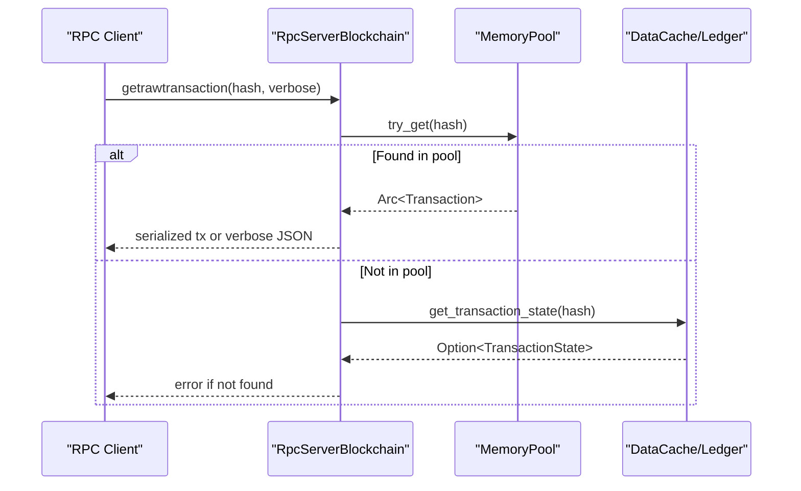

**Diagram sources**
- [rpc_server_blockchain_mod.rs:228-261](file://neo-rpc/src/server/rpc_server_blockchain/mod.rs#L228-L261)
- [views.rs:103-112](file://neo-core/src/ledger/memory_pool/views.rs#L103-L112)

**Section sources**
- [rpc_server_blockchain_mod.rs:196-226](file://neo-rpc/src/server/rpc_server_blockchain/mod.rs#L196-L226)
- [events.rs:90-135](file://neo-rpc/src/server/ws/events.rs#L90-L135)

## Detailed Component Analysis

### MemoryPool: Add Flow and Conflict Detection
- try_add performs:
  - Hash computation and duplicate check
  - New transaction callback (can cancel)
  - State-independent validation
  - Conflict detection via Conflicts attributes and shared signers
  - Per-sender limit enforcement
  - State-dependent validation with verification context and conflict transactions
  - Insertion into verified set and conflict registration
  - Eviction if over capacity; emit removal events
  - Emit added event

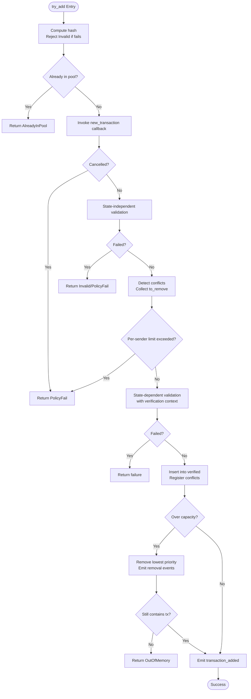

**Diagram sources**
- [mod.rs:243-384](file://neo-core/src/ledger/memory_pool/mod.rs#L243-L384)

**Section sources**
- [mod.rs:153-213](file://neo-core/src/ledger/memory_pool/mod.rs#L153-L213)
- [mod.rs:243-384](file://neo-core/src/ledger/memory_pool/mod.rs#L243-L384)
- [tests.rs:132-181](file://neo-core/src/ledger/memory_pool/tests.rs#L132-L181)
- [tests.rs:183-218](file://neo-core/src/ledger/memory_pool/tests.rs#L183-L218)

### Conflict Attribute Handling and Shared Signers
- Conflicts attribute references another transaction hash.
- If a new transaction conflicts with an existing verified transaction and shares a signer with the payer author, it may be rejected unless its network fee exceeds the total fee of conflicting transactions from the same payer.
- Conflicts are registered and unregistered when transactions are added or removed.

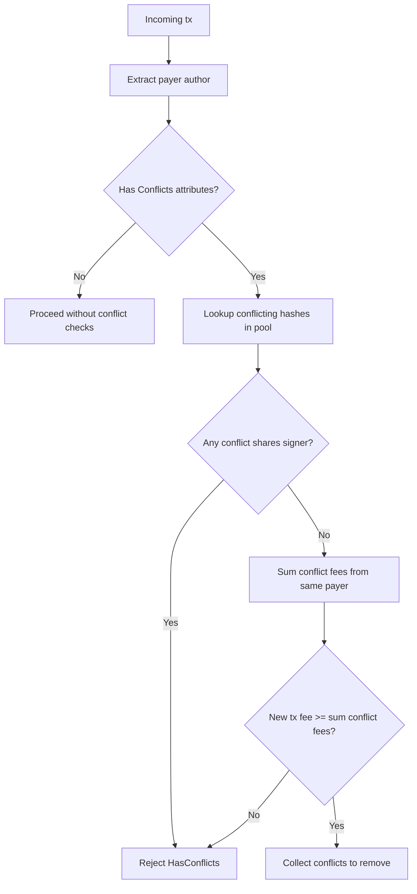

**Diagram sources**
- [mod.rs:153-213](file://neo-core/src/ledger/memory_pool/mod.rs#L153-L213)

**Section sources**
- [mod.rs:153-213](file://neo-core/src/ledger/memory_pool/mod.rs#L153-L213)
- [tests.rs:238-263](file://neo-core/src/ledger/memory_pool/tests.rs#L238-L263)

### Verified and Unverified Queues and Reverification
- Verified queue holds transactions validated against current state.
- On block persistence, verified transactions are invalidated and moved to unverified; then revalidated within a time budget.
- Top unverified transactions can be revalidated incrementally to promote valid ones back to verified.

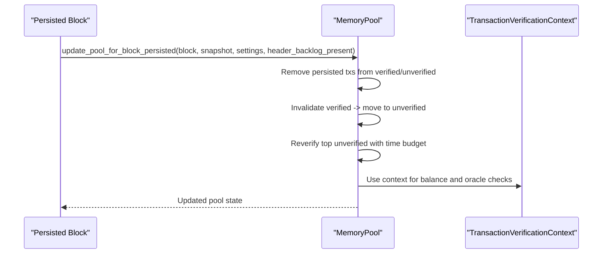

**Diagram sources**
- [mod.rs:386-483](file://neo-core/src/ledger/memory_pool/mod.rs#L386-L483)
- [mod.rs:501-654](file://neo-core/src/ledger/memory_pool/mod.rs#L501-L654)

**Section sources**
- [mod.rs:386-483](file://neo-core/src/ledger/memory_pool/mod.rs#L386-L483)
- [mod.rs:501-654](file://neo-core/src/ledger/memory_pool/mod.rs#L501-L654)

### Indexing System for Efficient Lookup
- PoolIndex uses HashMap for O(1) contains/get/remove and BTreeSet for ordered iteration by priority.
- Supports ascending/descending traversal, lowest item retrieval, and draining by priority.

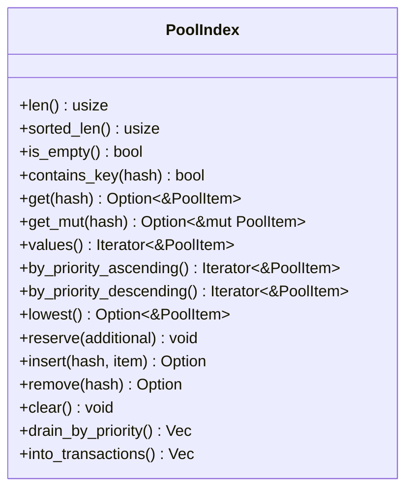

**Diagram sources**
- [index.rs:9-107](file://neo-core/src/ledger/memory_pool/index.rs#L9-L107)

**Section sources**
- [index.rs:9-107](file://neo-core/src/ledger/memory_pool/index.rs#L9-L107)

### View System for Different Perspectives
- Provides counts, existence checks, sender-based counts, and various iterators over verified/unverified sets.
- Returns Arc<Transaction> where possible to avoid cloning.

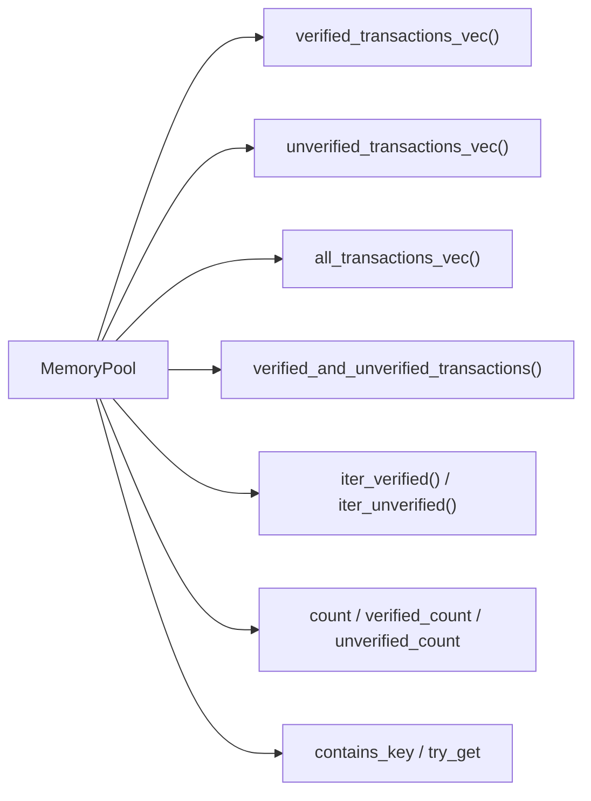

**Diagram sources**
- [views.rs:8-213](file://neo-core/src/ledger/memory_pool/views.rs#L8-L213)

**Section sources**
- [views.rs:8-213](file://neo-core/src/ledger/memory_pool/views.rs#L8-L213)

### Transaction Verification Context
- Tracks per-payer fees and oracle responses to ensure new transactions fit within available balances and do not duplicate oracle responses.
- Supports custom balance providers for testing and integration.

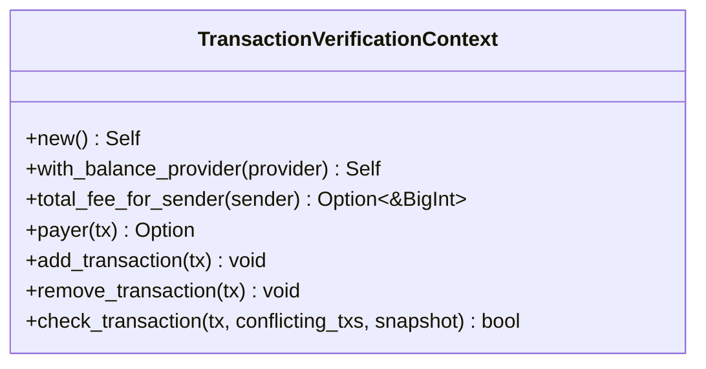

**Diagram sources**
- [transaction_verification_context.rs:15-157](file://neo-core/src/ledger/transaction_verification_context.rs#L15-L157)

**Section sources**
- [transaction_verification_context.rs:15-157](file://neo-core/src/ledger/transaction_verification_context.rs#L15-L157)

### Eviction Policies and Capacity Management
- Enforces global capacity via memory_pool_max_transactions.
- When over capacity, removes lowest-priority items from either verified or unverified sets based on comparison rules.
- Emits removal events with reason CapacityExceeded.

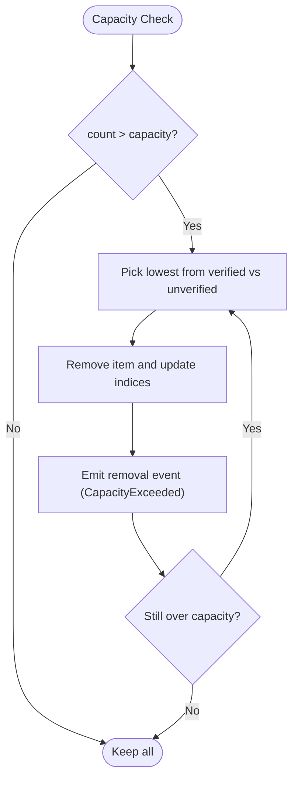

**Diagram sources**
- [mod.rs:685-718](file://neo-core/src/ledger/memory_pool/mod.rs#L685-L718)

**Section sources**
- [mod.rs:685-718](file://neo-core/src/ledger/memory_pool/mod.rs#L685-L718)
- [tests.rs:183-218](file://neo-core/src/ledger/memory_pool/tests.rs#L183-L218)

### Event Callbacks for Lifecycle Monitoring
- new_transaction: allows external systems to intercept and cancel incoming transactions.
- transaction_added: notifies when a transaction is successfully added.
- transaction_removed: notifies on removal due to conflict, capacity, or invalidation.
- transaction_relay: triggers rebroadcast of revalidated transactions after certain thresholds.

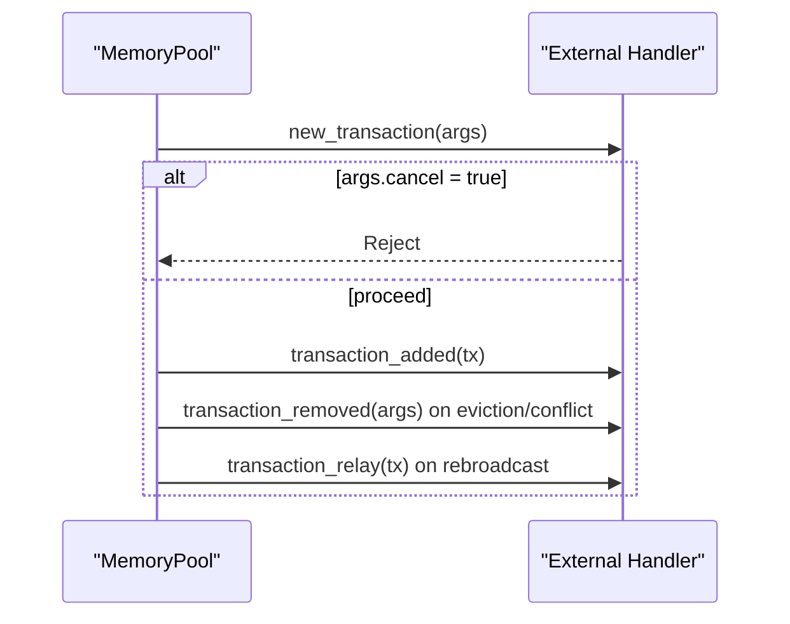

**Diagram sources**
- [mod.rs:67-77](file://neo-core/src/ledger/memory_pool/mod.rs#L67-L77)
- [mod.rs:261-384](file://neo-core/src/ledger/memory_pool/mod.rs#L261-L384)
- [mod.rs:627-638](file://neo-core/src/ledger/memory_pool/mod.rs#L627-L638)

**Section sources**
- [mod.rs:67-77](file://neo-core/src/ledger/memory_pool/mod.rs#L67-L77)
- [mod.rs:261-384](file://neo-core/src/ledger/memory_pool/mod.rs#L261-L384)
- [mod.rs:627-638](file://neo-core/src/ledger/memory_pool/mod.rs#L627-L638)

### Integration with Blockchain System
- RPC endpoints expose pool contents and transaction retrieval, integrating with ledger state for fallback queries.
- WebSocket events broadcast transaction addition/removal for real-time monitoring.

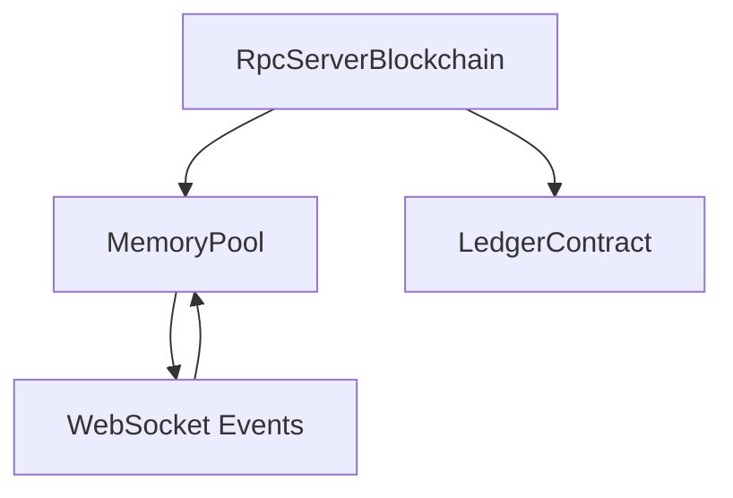

**Diagram sources**
- [rpc_server_blockchain_mod.rs:196-226](file://neo-rpc/src/server/rpc_server_blockchain/mod.rs#L196-L226)
- [events.rs:90-135](file://neo-rpc/src/server/ws/events.rs#L90-L135)

**Section sources**
- [rpc_server_blockchain_mod.rs:196-226](file://neo-rpc/src/server/rpc_server_blockchain/mod.rs#L196-L226)
- [events.rs:90-135](file://neo-rpc/src/server/ws/events.rs#L90-L135)

## Dependency Analysis
- MemoryPool depends on:
  - PoolIndex for efficient storage and ordering
  - PoolItem for priority comparisons
  - TransactionVerificationContext for fee and oracle checks
  - ProtocolSettings for capacity and timing parameters
  - DataCache for state-dependent validation
  - RPC and WebSocket layers for exposure and events

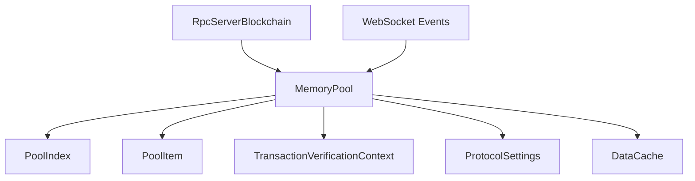

**Diagram sources**
- [mod.rs:66-91](file://neo-core/src/ledger/memory_pool/mod.rs#L66-L91)
- [index.rs:9-13](file://neo-core/src/ledger/memory_pool/index.rs#L9-L13)
- [pool_item.rs:36-83](file://neo-core/src/ledger/pool_item.rs#L36-L83)
- [transaction_verification_context.rs:15-20](file://neo-core/src/ledger/transaction_verification_context.rs#L15-L20)
- [rpc_server_blockchain_mod.rs:196-226](file://neo-rpc/src/server/rpc_server_blockchain/mod.rs#L196-L226)
- [events.rs:90-135](file://neo-rpc/src/server/ws/events.rs#L90-L135)

**Section sources**
- [mod.rs:66-91](file://neo-core/src/ledger/memory_pool/mod.rs#L66-L91)
- [rpc_server_blockchain_mod.rs:196-226](file://neo-rpc/src/server/rpc_server_blockchain/mod.rs#L196-L226)
- [events.rs:90-135](file://neo-rpc/src/server/ws/events.rs#L90-L135)

## Performance Considerations
- Pre-allocate capacities for verified and unverified sets during initial sync to reduce reallocations.
- Use Arc<Transaction> in views to avoid expensive cloning.
- Limit revalidation work with time budgets to control CPU usage during block persistence.
- Prefer iterator-based operations to minimize allocations.
- Tune rebroadcast thresholds based on pool size to balance propagation and load.

[No sources needed since this section provides general guidance]

## Troubleshooting Guide
Common issues and diagnostics:
- Duplicate transactions: already in pool returns AlreadyInPool.
- Invalid transactions: state-independent failures return Invalid or related errors.
- Conflicts: HasConflicts indicates conflicting transactions with shared signers or insufficient fee advantage.
- Capacity pressure: CapacityExceeded indicates eviction due to exceeding memory_pool_max_transactions.
- No longer valid: NoLongerValid indicates failed revalidation or policy changes.

Use RPC to inspect pool contents and WebSocket events to track additions/removals.

**Section sources**
- [verify_result.rs:48-86](file://neo-primitives/src/verify_result.rs#L48-L86)
- [transaction_removal_reason.rs:34-77](file://neo-primitives/src/transaction_removal_reason.rs#L34-L77)
- [rpc_server_blockchain_mod.rs:196-226](file://neo-rpc/src/server/rpc_server_blockchain/mod.rs#L196-L226)
- [events.rs:90-135](file://neo-rpc/src/server/ws/events.rs#L90-L135)

## Conclusion
Neo-RS mempool provides robust transaction management with clear separation between verified and unverified states, strong conflict handling, and efficient indexing. It integrates seamlessly with RPC and WebSocket interfaces, supports configurable capacity and per-sender limits, and includes mechanisms for safe revalidation and rebroadcasting. Proper use of verification context and event callbacks ensures consistency and observability across the blockchain system.

[No sources needed since this section summarizes without analyzing specific files]

## Appendices

### Example Operations and Query Patterns
- Add a transaction: call try_add with snapshot and settings; handle VerifyResult outcomes.
- Query pool contents: use verified_transactions_vec, unverified_transactions_vec, or verified_and_unverified_transactions for separate lists.
- Retrieve by hash: use try_get for quick lookup across both sets.
- Monitor events: subscribe to WebSocket events for TransactionAdded and TransactionRemoved with reasons.

**Section sources**
- [views.rs:103-196](file://neo-core/src/ledger/memory_pool/views.rs#L103-L196)
- [events.rs:90-135](file://neo-rpc/src/server/ws/events.rs#L90-L135)

### Performance Optimization Techniques for High-Volume Environments
- Reserve capacities early using reserve_verified and reserve_unverified.
- Batch revalidation calls with bounded max_to_verify and time budgets.
- Avoid unnecessary cloning by leveraging Arc<Transaction> in views.
- Tune memory_pool_max_transactions and per-sender limits to match expected throughput.

**Section sources**
- [mod.rs:133-144](file://neo-core/src/ledger/memory_pool/mod.rs#L133-L144)
- [mod.rs:501-523](file://neo-core/src/ledger/memory_pool/mod.rs#L501-L523)
- [views.rs:103-196](file://neo-core/src/ledger/memory_pool/views.rs#L103-L196)