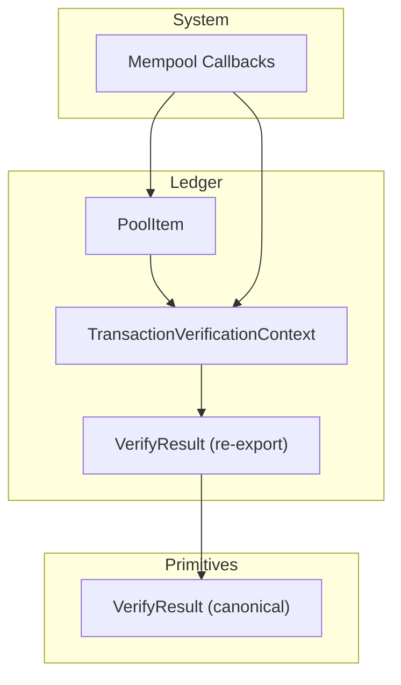
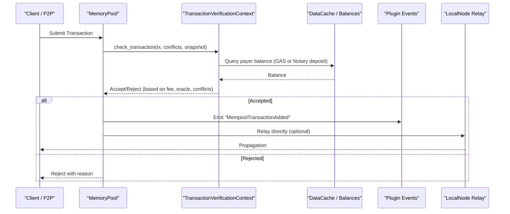
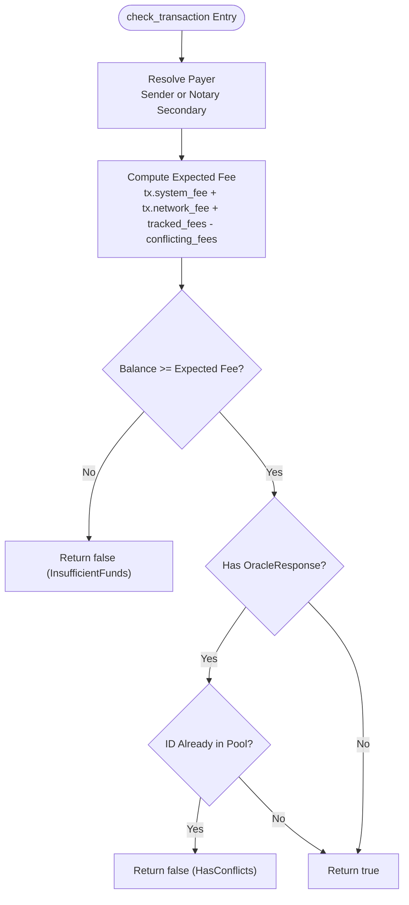
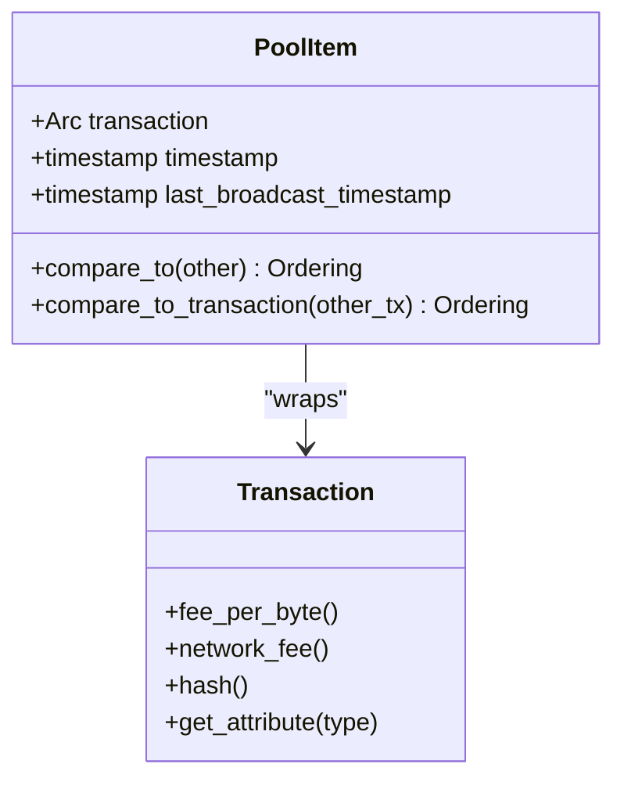
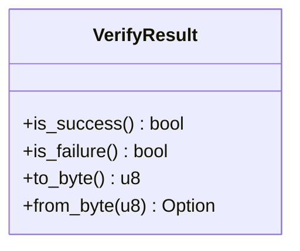
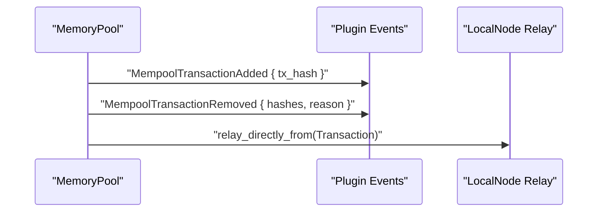
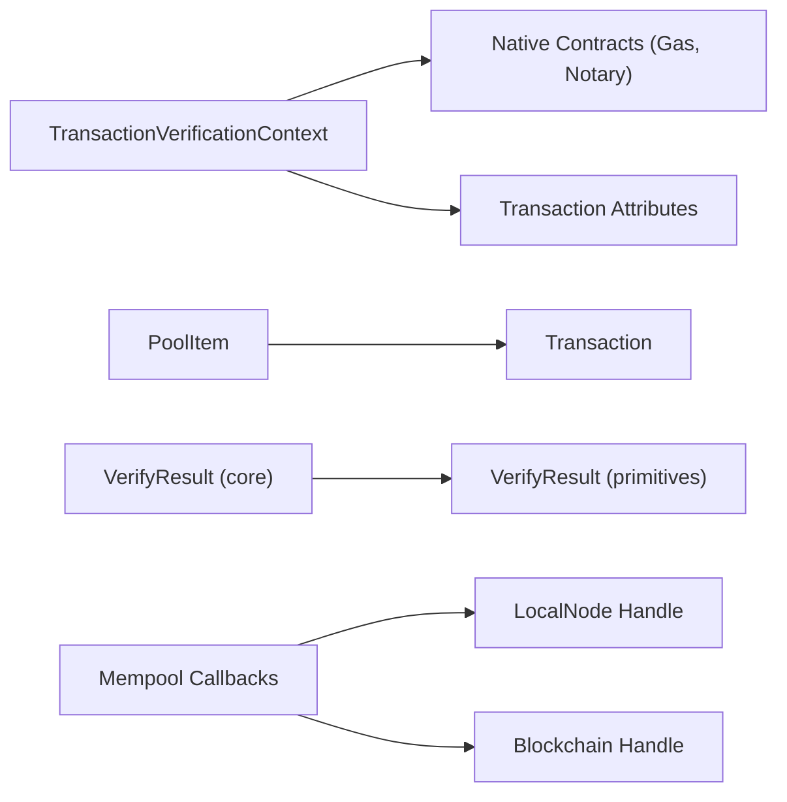

# Transaction Processing

<cite>
**Referenced Files in This Document**
- [transaction_verification_context.rs](file://neo-core/src/ledger/transaction_verification_context.rs)
- [pool_item.rs](file://neo-core/src/ledger/pool_item.rs)
- [verify_result.rs](file://neo-core/src/ledger/verify_result.rs)
- [verify_result.rs](file://neo-primitives/src/verify_result.rs)
- [mempool.rs](file://neo-core/src/neo_system/mempool.rs)
</cite>

## Table of Contents
1. Introduction
2. Project Structure
3. Core Components
4. Architecture Overview
5. Detailed Component Analysis
6. Dependency Analysis
7. Performance Considerations
8. Troubleshooting Guide
9. Conclusion

## Introduction
This document explains transaction processing in the Neo-RS ledger with a focus on verification context, pool item lifecycle, and result semantics. It covers sender fee tracking, oracle response handling, conflict detection, fee calculation, witness validation, policy checks, and high-throughput optimization strategies. Examples illustrate submission and verification workflows and common error handling patterns.

## Project Structure
Transaction processing spans several modules:
- Ledger layer provides verification context, pool item wrapper, and verify result re-export.
- Primitives define the canonical VerifyResult enum used across the system.
- System integration wires mempool callbacks for events and relaying.

**Diagram sources**
- [transaction_verification_context.rs:15-148](file://neo-core/src/ledger/transaction_verification_context.rs#L15-L148)
- [pool_item.rs:6-83](file://neo-core/src/ledger/pool_item.rs#L6-L83)
- [verify_result.rs:1-7](file://neo-core/src/ledger/verify_result.rs#L1-L7)
- [verify_result.rs:8-46](file://neo-primitives/src/verify_result.rs#L8-L46)
- [mempool.rs:17-62](file://neo-core/src/neo_system/mempool.rs#L17-L62)

**Section sources**
- [transaction_verification_context.rs:15-148](file://neo-core/src/ledger/transaction_verification_context.rs#L15-L148)
- [pool_item.rs:6-83](file://neo-core/src/ledger/pool_item.rs#L6-L83)
- [verify_result.rs:1-7](file://neo-core/src/ledger/verify_result.rs#L1-L7)
- [verify_result.rs:8-46](file://neo-primitives/src/verify_result.rs#L8-L46)
- [mempool.rs:17-62](file://neo-core/src/neo_system/mempool.rs#L17-L62)

## Core Components
- TransactionVerificationContext: Tracks per-payer fees and oracle responses to enforce balance and conflict constraints during mempool admission.
- PoolItem: Wraps a pooled transaction with timestamps and implements ordering by priority, fee-per-byte, network fee, and hash.
- VerifyResult: Canonical enum describing verification outcomes; re-exported from neo-core for compatibility.
- Mempool Callbacks: Emission of plugin events and relay of transactions when they enter or leave the pool.

Key responsibilities:
- Sender fee tracking and payer resolution (including Notary-sponsored cases).
- Oracle response deduplication within the pool.
- Conflict detection against other pending transactions sharing the same payer.
- Ordering and selection of transactions for block assembly.
- Standardized verification results for consistent handling across layers.

**Section sources**
- [transaction_verification_context.rs:15-148](file://neo-core/src/ledger/transaction_verification_context.rs#L15-L148)
- [pool_item.rs:6-83](file://neo-core/src/ledger/pool_item.rs#L6-L83)
- [verify_result.rs:8-46](file://neo-primitives/src/verify_result.rs#L8-L46)
- [mempool.rs:17-62](file://neo-core/src/neo_system/mempool.rs#L17-L62)

## Architecture Overview
The verification pipeline integrates mempool checks with ledger state and policy rules. The flow below shows how a new transaction is evaluated before being accepted into the pool.

**Diagram sources**
- [transaction_verification_context.rs:93-133](file://neo-core/src/ledger/transaction_verification_context.rs#L93-L133)
- [mempool.rs:17-62](file://neo-core/src/neo_system/mempool.rs#L17-L62)

## Detailed Component Analysis

### Transaction Verification Context
Responsibilities:
- Payer resolution: For standard senders, use the sender account; for Notary-sponsored transactions, track the secondary signer’s deposit.
- Fee aggregation: Accumulate total fees paid by each payer while transactions are in the pool.
- Oracle response tracking: Ensure only one transaction per oracle request ID exists in the pool.
- Conflict detection: When evaluating a candidate transaction, subtract fees of conflicting transactions already considered to avoid double-spending or duplicate oracle responses.
- Balance enforcement: Compare expected cumulative fee against available balance (GAS for normal senders, Notary deposit for sponsored).

Key behaviors:
- add_transaction/remove_transaction update internal maps for fees and oracle IDs.
- check_transaction computes expected_fee including existing tracked fees minus any conflicting ones, then validates balance and oracle uniqueness.

**Diagram sources**
- [transaction_verification_context.rs:47-148](file://neo-core/src/ledger/transaction_verification_context.rs#L47-L148)

**Section sources**
- [transaction_verification_context.rs:47-148](file://neo-core/src/ledger/transaction_verification_context.rs#L47-L148)

### PoolItem Wrapper
Purpose:
- Encapsulates a pooled transaction with metadata: creation time and last broadcast time.
- Implements comparison logic to order transactions by:
  - HighPriority attribute presence
  - Fee-per-byte
  - Network fee
  - Hash descending (for deterministic tie-breaking)

Lifecycle role:
- Used by memory pool structures to maintain an ordered set of candidates for block assembly.
- Enables efficient selection of highest-value transactions under size constraints.

**Diagram sources**
- [pool_item.rs:6-83](file://neo-core/src/ledger/pool_item.rs#L6-L83)

**Section sources**
- [pool_item.rs:6-83](file://neo-core/src/ledger/pool_item.rs#L6-L83)

### Verify Result Types
Canonical definition:
- VerifyResult enumerates all possible verification outcomes, including success, duplicates, resource limits, invalidity categories, policy failures, and conflicts.
- Provides helpers to determine success/failure and serialization support.

Re-export:
- neo-core re-exports VerifyResult for backward compatibility, ensuring consistent usage across components.

Usage in pipeline:
- Each stage of verification returns a VerifyResult, enabling uniform error propagation and user-facing messaging.

**Diagram sources**
- [verify_result.rs:8-46](file://neo-primitives/src/verify_result.rs#L8-L46)
- [verify_result.rs:1-7](file://neo-core/src/ledger/verify_result.rs#L1-L7)

**Section sources**
- [verify_result.rs:8-46](file://neo-primitives/src/verify_result.rs#L8-L46)
- [verify_result.rs:1-7](file://neo-core/src/ledger/verify_result.rs#L1-L7)

### Mempool Integration and Eventing
- On transaction addition: emits a plugin event indicating the added transaction hash.
- On removal: emits an event with removed hashes and reason.
- Optional relay: enqueues direct relay of accepted transactions via the local node handle.

**Diagram sources**
- [mempool.rs:17-62](file://neo-core/src/neo_system/mempool.rs#L17-L62)

**Section sources**
- [mempool.rs:17-62](file://neo-core/src/neo_system/mempool.rs#L17-L62)

## Dependency Analysis
- TransactionVerificationContext depends on:
  - DataCache for balance queries (via a pluggable provider).
  - Native contracts for GAS balance and Notary deposit checks.
  - Transaction attributes to detect OracleResponse.
- PoolItem depends on Transaction methods for fee and priority metrics.
- VerifyResult is defined centrally in primitives and re-exported for consistency.
- Mempool callbacks depend on LocalNodeHandle and BlockchainHandle for relaying and state access.

**Diagram sources**
- [transaction_verification_context.rs:1-10](file://neo-core/src/ledger/transaction_verification_context.rs#L1-L10)
- [pool_item.rs:1-5](file://neo-core/src/ledger/pool_item.rs#L1-L5)
- [verify_result.rs:1-7](file://neo-core/src/ledger/verify_result.rs#L1-L7)
- [verify_result.rs:8-46](file://neo-primitives/src/verify_result.rs#L8-L46)
- [mempool.rs:12-15](file://neo-core/src/neo_system/mempool.rs#L12-L15)

**Section sources**
- [transaction_verification_context.rs:1-10](file://neo-core/src/ledger/transaction_verification_context.rs#L1-L10)
- [pool_item.rs:1-5](file://neo-core/src/ledger/pool_item.rs#L1-L5)
- [verify_result.rs:1-7](file://neo-core/src/ledger/verify_result.rs#L1-L7)
- [verify_result.rs:8-46](file://neo-primitives/src/verify_result.rs#L8-L46)
- [mempool.rs:12-15](file://neo-core/src/neo_system/mempool.rs#L12-L15)

## Performance Considerations
- Fee computation: Uses simple arithmetic over system_fee and network_fee; ensure callers minimize repeated computations by caching where appropriate.
- Balance provider abstraction: Allows swapping implementations for testing or optimized reads; prefer batched or cached balance lookups in hot paths.
- Conflict detection: Minimizes redundant checks by passing only relevant conflicting transactions to check_transaction.
- Ordering: PoolItem comparisons rely on fast field accessors; keep Transaction fields immutable after construction to avoid recomputation.
- Event emission: Plugin events and relay calls can be asynchronous; ensure non-blocking behavior to avoid blocking the mempool hot path.

[No sources needed since this section provides general guidance]

## Troubleshooting Guide
Common issues and resolutions:
- Insufficient funds: Occurs when expected cumulative fee exceeds available balance. Verify payer resolution and that notary deposits are correctly accounted for sponsored transactions.
- Duplicate oracle response: If an oracle response ID already exists in the pool, reject the new transaction to prevent ambiguity.
- Policy failures: Returned via VerifyResult; inspect policy configuration and transaction attributes.
- Invalid signatures or scripts: Use VerifyResult categories to pinpoint failure stages and guide remediation.

Operational tips:
- Monitor mempool events to track acceptance/rejection reasons.
- Use relay logs to diagnose propagation issues.
- Profile balance provider performance if fee checks become a bottleneck.

**Section sources**
- [transaction_verification_context.rs:93-133](file://neo-core/src/ledger/transaction_verification_context.rs#L93-L133)
- [verify_result.rs:8-46](file://neo-primitives/src/verify_result.rs#L8-L46)
- [mempool.rs:17-62](file://neo-core/src/neo_system/mempool.rs#L17-L62)

## Conclusion
Neo-RS transaction processing centers around a robust verification context that tracks per-payer fees and oracle responses, combined with a well-defined ordering mechanism for pooled transactions. The unified VerifyResult type ensures consistent error handling across layers. By leveraging pluggable balance providers and careful conflict detection, the system supports high-throughput scenarios while maintaining correctness and clarity.

[No sources needed since this section summarizes without analyzing specific files]