# Consensus Engine

<cite>
**Referenced Files in This Document**
- [lib.rs](file://neo-consensus/src/lib.rs)
- [context/mod.rs](file://neo-consensus/src/context/mod.rs)
- [messages/mod.rs](file://neo-consensus/src/messages/mod.rs)
- [messages/prepare_request.rs](file://neo-consensus/src/messages/prepare_request.rs)
- [messages/prepare_response.rs](file://neo-consensus/src/messages/prepare_response.rs)
- [messages/commit.rs](file://neo-consensus/src/messages/commit.rs)
- [messages/change_view.rs](file://neo-consensus/src/messages/change_view.rs)
- [service/mod.rs](file://neo-consensus/src/service/mod.rs)
- [signer.rs](file://neo-consensus/src/signer.rs)
</cite>

## Table of Contents
1. Introduction
2. Project Structure
3. Core Components
4. Architecture Overview
5. Detailed Component Analysis
6. Dependency Analysis
7. Performance Considerations
8. Troubleshooting Guide
9. Conclusion

## Introduction
This document explains the dBFT consensus engine implementation for Neo N3. It covers the algorithm, validator roles, message protocol (PrepareRequest, PrepareResponse, Commit, ChangeView), service lifecycle, view change mechanism, fault tolerance, signature aggregation, vote collection, block proposal, signer interface, key management, and cryptographic operations. It also includes examples of validator participation, network communication, and recovery from consensus failures, along with performance tuning guidance for different network topologies and validator counts.

## Project Structure
The consensus crate is organized into:
- Context: state tracking for a round (view, validators, signatures, timers, caches).
- Messages: on-wire types for dBFT messages and payload envelope.
- Service: main state machine orchestrating the consensus flow.
- Signer: abstract signing interface for validators.
- Library root: public re-exports and high-level documentation.

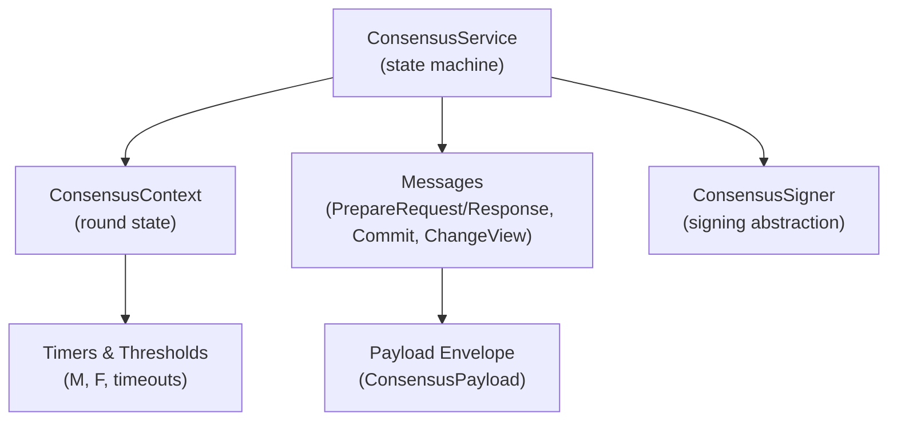

**Diagram sources**
- [service/mod.rs:1-16](file://neo-consensus/src/service/mod.rs#L1-L16)
- [context/mod.rs:111-191](file://neo-consensus/src/context/mod.rs#L111-L191)
- [messages/mod.rs:20-58](file://neo-consensus/src/messages/mod.rs#L20-L58)
- [signer.rs:41-51](file://neo-consensus/src/signer.rs#L41-L51)

**Section sources**
- [lib.rs:6-138](file://neo-consensus/src/lib.rs#L6-L138)
- [service/mod.rs:1-16](file://neo-consensus/src/service/mod.rs#L1-L16)

## Core Components
- ConsensusService: Main dBFT state machine coordinating views, proposals, votes, commits, and view changes.
- ConsensusContext: Holds per-round state including view number, validator set, proposed block data, collected signatures, timers, and replay protection caches.
- Messages: Protocol messages for proposing blocks, acknowledging them, committing, and changing views; plus a common payload envelope.
- ConsensusSigner: Interface to sign messages using a validator’s private key without exposing key material.

Key responsibilities:
- Primary role: propose blocks via PrepareRequest.
- Backup role: validate proposals, collect PrepareResponses, and issue Commits when quorum is reached.
- View change: trigger and process ChangeView when progress stalls or invalid proposals are detected.
- Fault tolerance: tolerate up to f = floor((n-1)/3) Byzantine nodes; require M = n - f signatures for safety.

**Section sources**
- [lib.rs:6-138](file://neo-consensus/src/lib.rs#L6-L138)
- [context/mod.rs:111-191](file://neo-consensus/src/context/mod.rs#L111-L191)
- [messages/mod.rs:20-58](file://neo-consensus/src/messages/mod.rs#L20-L58)
- [signer.rs:41-51](file://neo-consensus/src/signer.rs#L41-L51)

## Architecture Overview
dBFT proceeds in views. Each view has one primary (speaker) and multiple backups. The primary proposes a block; backups validate and respond; once enough responses are gathered, the primary (and others) commit. If progress stalls, validators initiate a view change.

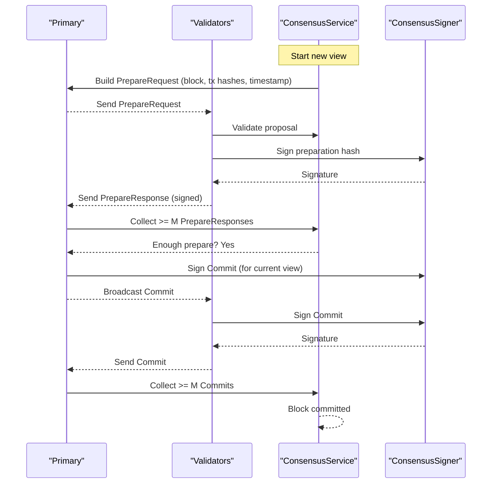

**Diagram sources**
- [messages/prepare_request.rs:8-27](file://neo-consensus/src/messages/prepare_request.rs#L8-L27)
- [messages/prepare_response.rs:7-18](file://neo-consensus/src/messages/prepare_response.rs#L7-L18)
- [messages/commit.rs:6-18](file://neo-consensus/src/messages/commit.rs#L6-L18)
- [messages/change_view.rs:6-19](file://neo-consensus/src/messages/change_view.rs#L6-L19)
- [signer.rs:41-51](file://neo-consensus/src/signer.rs#L41-L51)

## Detailed Component Analysis

### Consensus Algorithm and Roles
- Roles:
  - Primary: selected deterministically by (block_index - view_number) mod n. Proposes a block and drives the round.
  - Backup: validates the proposal, signs and returns PrepareResponse, then sends Commit once quorum is reached.
- Quorums:
  - M = n - f, where f = floor((n-1)/3).
  - Need M matching PrepareResponses to proceed to Commit.
  - Need M valid Commits to finalize the block.
- Timers:
  - Base timeout depends on expected block time and view number.
  - Timeouts increase exponentially across views to handle liveness under faults.

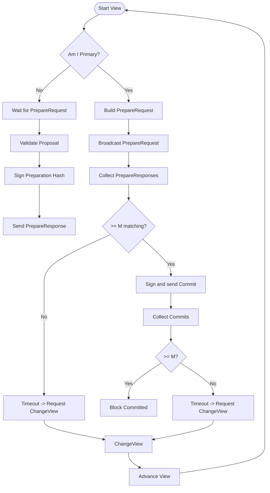

**Diagram sources**
- [context/mod.rs:263-286](file://neo-consensus/src/context/mod.rs#L263-L286)
- [context/mod.rs:303-382](file://neo-consensus/src/context/mod.rs#L303-L382)
- [context/mod.rs:514-617](file://neo-consensus/src/context/mod.rs#L514-L617)

**Section sources**
- [context/mod.rs:263-286](file://neo-consensus/src/context/mod.rs#L263-L286)
- [context/mod.rs:303-382](file://neo-consensus/src/context/mod.rs#L303-L382)
- [context/mod.rs:514-617](file://neo-consensus/src/context/mod.rs#L514-L617)

### Message Protocol
- PrepareRequest:
  - Sent by primary to propose a block with version, prev_hash, timestamp, nonce, and transaction hashes.
  - Validates version and uniqueness of transaction hashes.
- PrepareResponse:
  - Sent by validators to acknowledge a proposal by signing the preparation hash.
  - Must match the expected preparation hash.
- Commit:
  - Sent by validators who have verified the proposal and collected sufficient PrepareResponses.
  - Contains a signature over the block hash for the current view.
- ChangeView:
  - Sent when progress stalls or invalid proposals are detected.
  - Includes timestamp and reason; new view number is strictly greater than current.

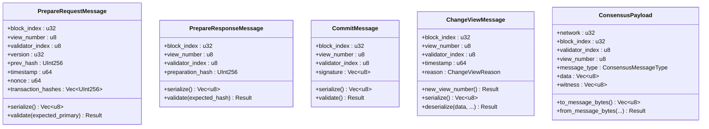

**Diagram sources**
- [messages/prepare_request.rs:8-27](file://neo-consensus/src/messages/prepare_request.rs#L8-L27)
- [messages/prepare_response.rs:7-18](file://neo-consensus/src/messages/prepare_response.rs#L7-L18)
- [messages/commit.rs:6-18](file://neo-consensus/src/messages/commit.rs#L6-L18)
- [messages/change_view.rs:6-19](file://neo-consensus/src/messages/change_view.rs#L6-L19)
- [messages/mod.rs:41-58](file://neo-consensus/src/messages/mod.rs#L41-L58)

**Section sources**
- [messages/prepare_request.rs:8-27](file://neo-consensus/src/messages/prepare_request.rs#L8-L27)
- [messages/prepare_response.rs:7-18](file://neo-consensus/src/messages/prepare_response.rs#L7-L18)
- [messages/commit.rs:6-18](file://neo-consensus/src/messages/commit.rs#L6-L18)
- [messages/change_view.rs:6-19](file://neo-consensus/src/messages/change_view.rs#L6-L19)
- [messages/mod.rs:41-58](file://neo-consensus/src/messages/mod.rs#L41-L58)

### Consensus Service Lifecycle
- Initialization:
  - Create context with block index, validators, my_index, and expected block time.
  - Determine role (primary or backup) based on current view.
- Primary flow:
  - Build and broadcast PrepareRequest after initial timer.
  - Collect PrepareResponses; if >= M matching, sign and broadcast Commit.
  - On timeout or invalid proposal, request ChangeView.
- Backup flow:
  - Wait for PrepareRequest; validate and sign preparation hash; send PrepareResponse.
  - Once enough PrepareResponses are seen, sign and send Commit.
  - On timeout or invalid proposal, request ChangeView.
- View change:
  - Validators exchange ChangeView messages; when >= M requests for a new view are received, advance view and restart.
- Commit finalization:
  - When >= M Commits are collected, finalize the block and emit events.

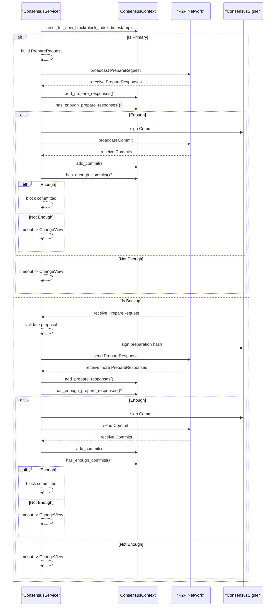

**Diagram sources**
- [context/mod.rs:384-455](file://neo-consensus/src/context/mod.rs#L384-L455)
- [context/mod.rs:457-512](file://neo-consensus/src/context/mod.rs#L457-L512)
- [context/mod.rs:619-633](file://neo-consensus/src/context/mod.rs#L619-L633)
- [messages/prepare_request.rs:8-27](file://neo-consensus/src/messages/prepare_request.rs#L8-L27)
- [messages/prepare_response.rs:7-18](file://neo-consensus/src/messages/prepare_response.rs#L7-L18)
- [messages/commit.rs:6-18](file://neo-consensus/src/messages/commit.rs#L6-L18)
- [messages/change_view.rs:6-19](file://neo-consensus/src/messages/change_view.rs#L6-L19)
- [signer.rs:41-51](file://neo-consensus/src/signer.rs#L41-L51)

**Section sources**
- [context/mod.rs:384-455](file://neo-consensus/src/context/mod.rs#L384-L455)
- [context/mod.rs:457-512](file://neo-consensus/src/context/mod.rs#L457-L512)
- [context/mod.rs:619-633](file://neo-consensus/src/context/mod.rs#L619-L633)

### View Change Mechanism
- Trigger conditions:
  - No PrepareRequest within timeout.
  - Invalid proposal or policy rejection.
  - Insufficient progress despite retries.
- Process:
  - Validators send ChangeView with reason and timestamp.
  - When >= M ChangeView requests for a new view are observed, advance view and restart the round.
- Recovery considerations:
  - If more than F nodes have committed or are lost, prefer recovery over view change to avoid splits.

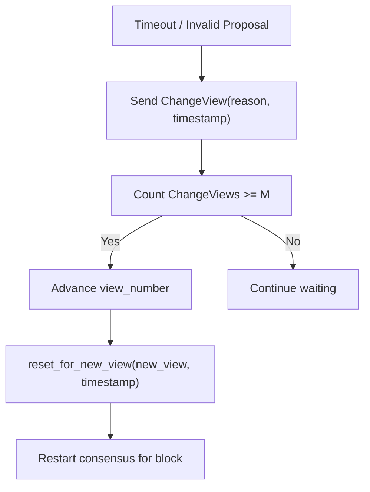

**Diagram sources**
- [messages/change_view.rs:6-19](file://neo-consensus/src/messages/change_view.rs#L6-L19)
- [context/mod.rs:372-382](file://neo-consensus/src/context/mod.rs#L372-L382)
- [context/mod.rs:384-409](file://neo-consensus/src/context/mod.rs#L384-L409)
- [context/mod.rs:719-758](file://neo-consensus/src/context/mod.rs#L719-L758)

**Section sources**
- [messages/change_view.rs:6-19](file://neo-consensus/src/messages/change_view.rs#L6-L19)
- [context/mod.rs:372-382](file://neo-consensus/src/context/mod.rs#L372-L382)
- [context/mod.rs:384-409](file://neo-consensus/src/context/mod.rs#L384-L409)
- [context/mod.rs:719-758](file://neo-consensus/src/context/mod.rs#L719-L758)

### Fault Tolerance Handling
- Byzantine tolerance:
  - Up to f = floor((n-1)/3) faulty nodes tolerated.
  - Quorum M = n - f ensures safety and liveness under synchrony assumptions.
- Detection and mitigation:
  - Track last seen messages per validator to identify failed nodes.
  - Use replay protection caches to prevent duplicate processing.
  - Prefer recovery over view change when more than F nodes committed or lost.

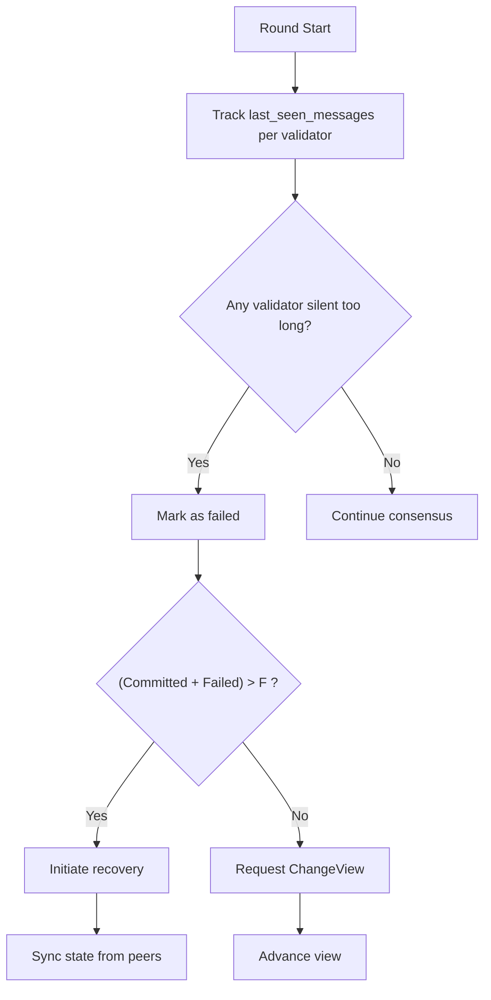

**Diagram sources**
- [context/mod.rs:690-736](file://neo-consensus/src/context/mod.rs#L690-L736)
- [context/mod.rs:640-682](file://neo-consensus/src/context/mod.rs#L640-L682)

**Section sources**
- [context/mod.rs:690-736](file://neo-consensus/src/context/mod.rs#L690-L736)
- [context/mod.rs:640-682](file://neo-consensus/src/context/mod.rs#L640-L682)

### Signature Aggregation and Vote Collection
- PrepareResponse collection:
  - Store per-validator signatures and their associated preparation hashes.
  - Only responses matching the expected preparation hash count toward M.
- Commit collection:
  - Store per-validator commit signatures and view numbers.
  - Ensure no duplicate commits for the same view.
- Aggregation:
  - Use helper methods to check thresholds and collect signatures for finalization.

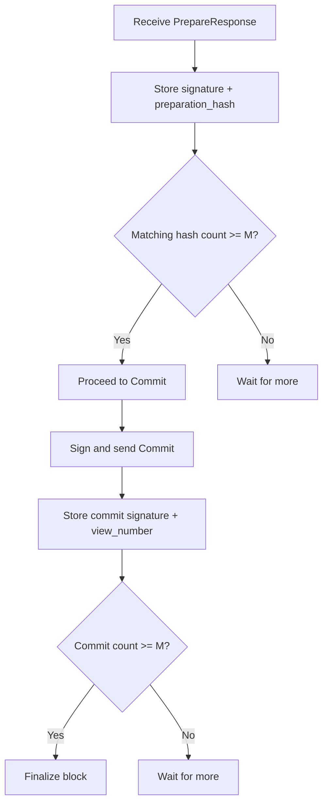

**Diagram sources**
- [context/mod.rs:457-512](file://neo-consensus/src/context/mod.rs#L457-L512)
- [context/mod.rs:303-382](file://neo-consensus/src/context/mod.rs#L303-L382)
- [context/mod.rs:619-633](file://neo-consensus/src/context/mod.rs#L619-L633)

**Section sources**
- [context/mod.rs:457-512](file://neo-consensus/src/context/mod.rs#L457-L512)
- [context/mod.rs:303-382](file://neo-consensus/src/context/mod.rs#L303-L382)
- [context/mod.rs:619-633](file://neo-consensus/src/context/mod.rs#L619-L633)

### Block Proposal Process
- Primary builds a proposal with:
  - Version, previous block hash, timestamp, nonce, and transaction hashes.
  - Ensures transaction hashes are unique and within limits.
- Validation:
  - Backups verify proposal fields and reject invalid or policy-violating proposals.
- Dispatch:
  - After initial timer, primary requests transactions and broadcasts PrepareRequest.

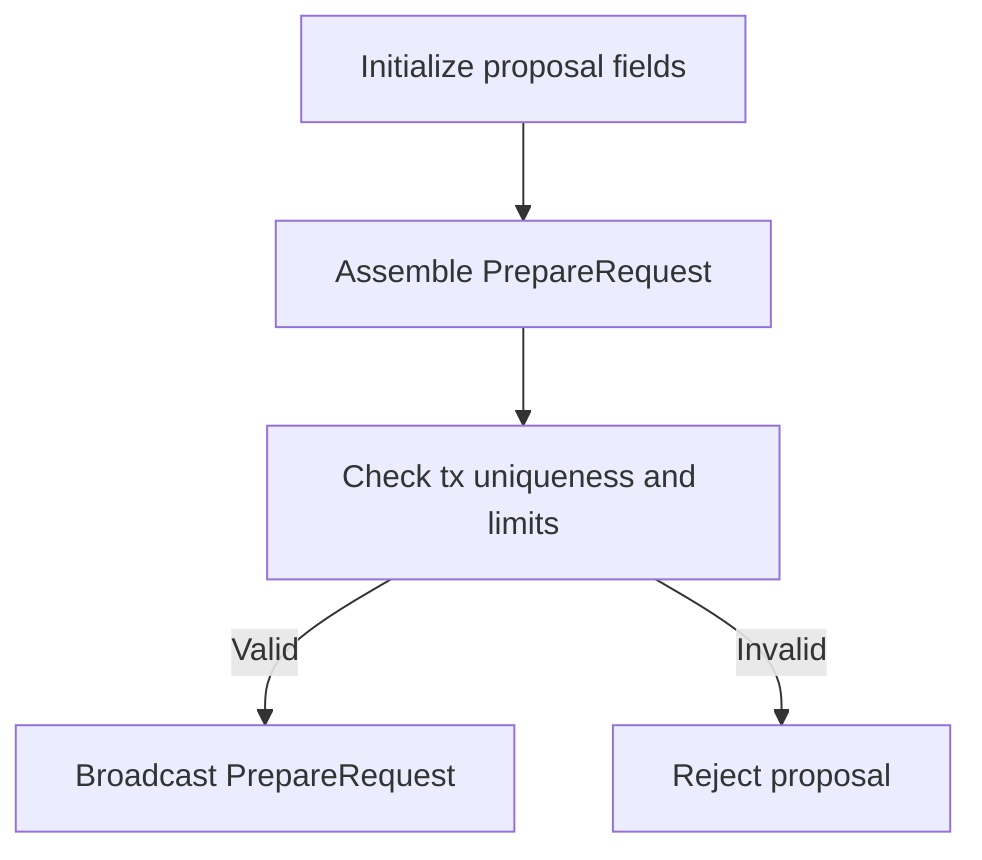

**Diagram sources**
- [messages/prepare_request.rs:8-27](file://neo-consensus/src/messages/prepare_request.rs#L8-L27)
- [messages/prepare_request.rs:205-229](file://neo-consensus/src/messages/prepare_request.rs#L205-L229)

**Section sources**
- [messages/prepare_request.rs:8-27](file://neo-consensus/src/messages/prepare_request.rs#L8-L27)
- [messages/prepare_request.rs:205-229](file://neo-consensus/src/messages/prepare_request.rs#L205-L229)

### Signer Interface, Key Management, and Cryptographic Operations
- ConsensusSigner:
  - Abstracts signing operations for consensus messages.
  - Supports can_sign checks and sign(data, script_hash) returning signatures.
- Key management:
  - Implementors manage private keys securely (e.g., HSM, secure enclave).
  - The consensus service never accesses raw key material.
- Cryptography:
  - Signatures are used to authenticate PrepareResponse and Commit messages.
  - Verification relies on validator public keys derived from the validator set.

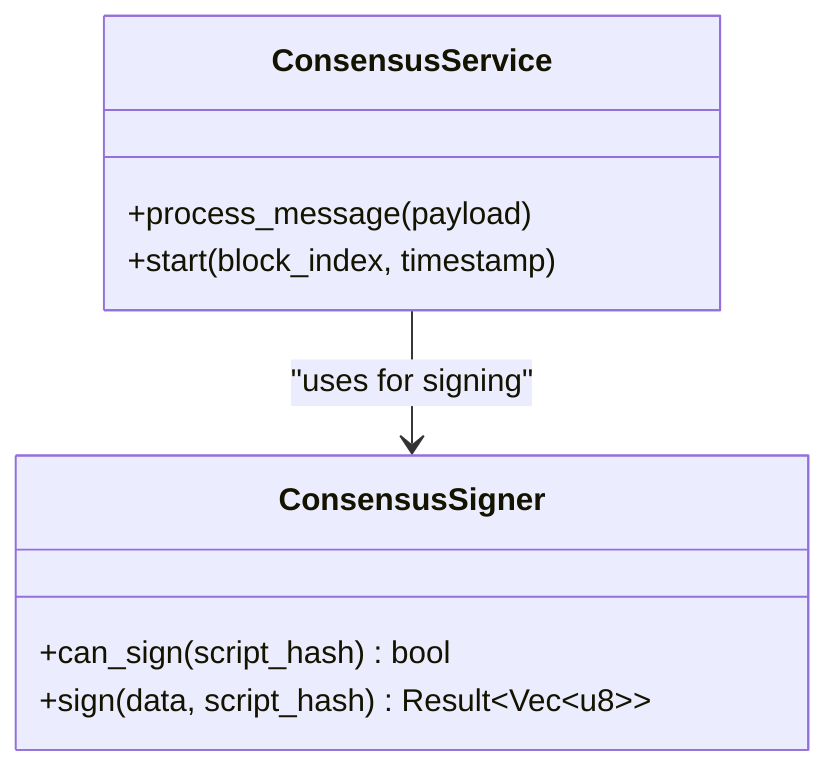

**Diagram sources**
- [signer.rs:41-51](file://neo-consensus/src/signer.rs#L41-L51)
- [service/mod.rs:1-16](file://neo-consensus/src/service/mod.rs#L1-L16)

**Section sources**
- [signer.rs:41-51](file://neo-consensus/src/signer.rs#L41-L51)

### Examples: Validator Participation, Network Communication, and Recovery
- Validator participation:
  - As primary: propose block, collect votes, commit.
  - As backup: validate proposal, sign and respond, commit when quorum reached.
- Network communication:
  - Use ConsensusPayload to serialize/deserialize messages over P2P.
  - Include witness (signature) with each message.
- Recovery:
  - If more than F nodes committed or lost, initiate recovery instead of view change.
  - Use recovery response caches to avoid duplicate responses.

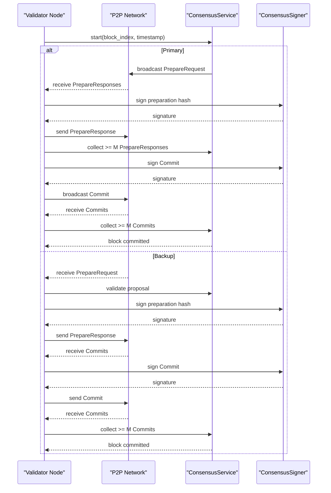

**Diagram sources**
- [messages/mod.rs:41-58](file://neo-consensus/src/messages/mod.rs#L41-L58)
- [messages/prepare_request.rs:8-27](file://neo-consensus/src/messages/prepare_request.rs#L8-L27)
- [messages/prepare_response.rs:7-18](file://neo-consensus/src/messages/prepare_response.rs#L7-L18)
- [messages/commit.rs:6-18](file://neo-consensus/src/messages/commit.rs#L6-L18)
- [signer.rs:41-51](file://neo-consensus/src/signer.rs#L41-L51)

**Section sources**
- [messages/mod.rs:41-58](file://neo-consensus/src/messages/mod.rs#L41-L58)
- [messages/prepare_request.rs:8-27](file://neo-consensus/src/messages/prepare_request.rs#L8-L27)
- [messages/prepare_response.rs:7-18](file://neo-consensus/src/messages/prepare_response.rs#L7-L18)
- [messages/commit.rs:6-18](file://neo-consensus/src/messages/commit.rs#L6-L18)
- [signer.rs:41-51](file://neo-consensus/src/signer.rs#L41-L51)

## Dependency Analysis
- Internal dependencies:
  - neo-primitives: core types like UInt160, UInt256.
  - neo-crypto: ECPoint and cryptographic primitives.
  - neo-io: serialization utilities.
  - neo-vm: used indirectly via application layer interactions.
- External dependencies:
  - tokio: async runtime.
  - serde/bincode: serialization.
  - rand: randomness.
  - lru: bounded caches for replay protection.
  - zeroize: memory security.
  - thiserror: error handling.
  - tracing: logging.

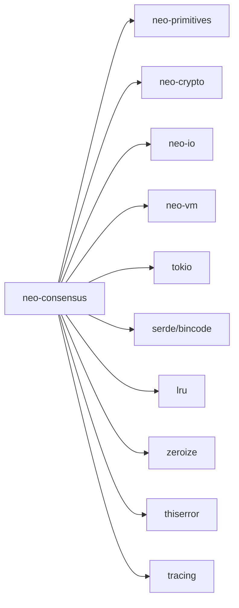

**Diagram sources**
- [Cargo.toml:16-40](file://neo-consensus/Cargo.toml#L16-L40)

**Section sources**
- [Cargo.toml:16-40](file://neo-consensus/Cargo.toml#L16-L40)

## Performance Considerations
- Timing parameters:
  - Expected block time influences base timeouts and exponential backoff across views.
  - Tune PrepareRequest, PrepareResponse, Commit, and ViewChange timeouts based on network latency and validator count.
- Quorum sizing:
  - Larger validator sets increase message overhead but improve fault tolerance.
  - Smaller sets reduce latency but lower resilience.
- Caches:
  - Use bounded LRU caches for message deduplication to prevent memory exhaustion.
- Network topology:
  - Low-latency networks allow tighter timeouts.
  - High-latency or partitioned networks benefit from longer timeouts and robust recovery paths.
- Serialization:
  - Minimize payload sizes; reuse buffers where possible.
- Signing:
  - Offload heavy cryptographic operations to HSM or optimized libraries.

[No sources needed since this section provides general guidance]

## Troubleshooting Guide
- Common issues:
  - Invalid proposal: check version, prev_hash, timestamp, and transaction hashes.
  - Hash mismatch: ensure PrepareResponse matches the expected preparation hash.
  - Invalid signature length: verify Commit signature size.
  - Replay attacks: ensure message hash caching is active and not expired prematurely.
- Diagnostics:
  - Monitor last_seen_messages to detect failed validators.
  - Track ChangeView reasons to understand why views changed.
  - Use metrics/logging to observe timeout occurrences and quorum attainment.

**Section sources**
- [messages/prepare_request.rs:205-229](file://neo-consensus/src/messages/prepare_request.rs#L205-L229)
- [messages/prepare_response.rs:72-81](file://neo-consensus/src/messages/prepare_response.rs#L72-L81)
- [messages/commit.rs:49-59](file://neo-consensus/src/messages/commit.rs#L49-L59)
- [context/mod.rs:640-682](file://neo-consensus/src/context/mod.rs#L640-L682)
- [context/mod.rs:690-736](file://neo-consensus/src/context/mod.rs#L690-L736)

## Conclusion
The dBFT consensus engine in neo-rs implements a robust, efficient, and secure block production mechanism for Neo N3. It enforces strict validation, quorum-based agreement, and resilient view changes. By leveraging clear message protocols, deterministic role assignment, and strong cryptographic guarantees, it achieves single-block finality while tolerating Byzantine faults. Proper configuration of timing parameters and careful monitoring of validator health are essential for optimal performance and reliability across diverse network environments.