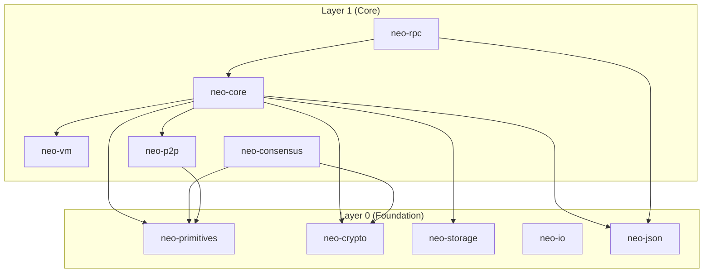
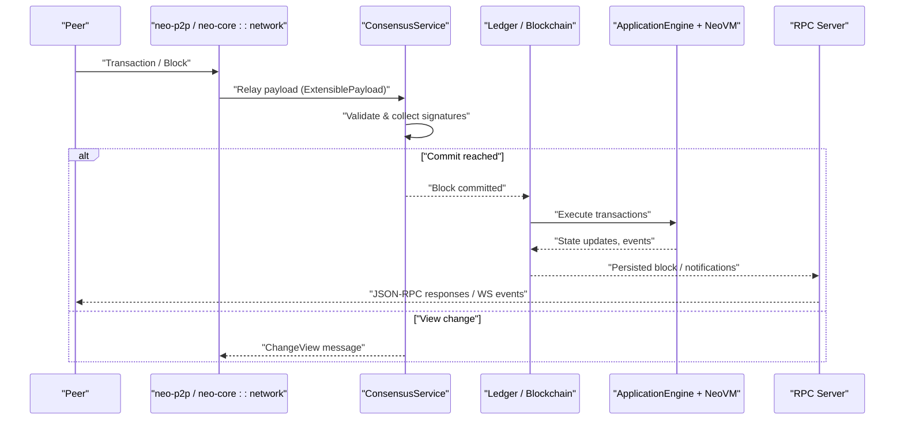
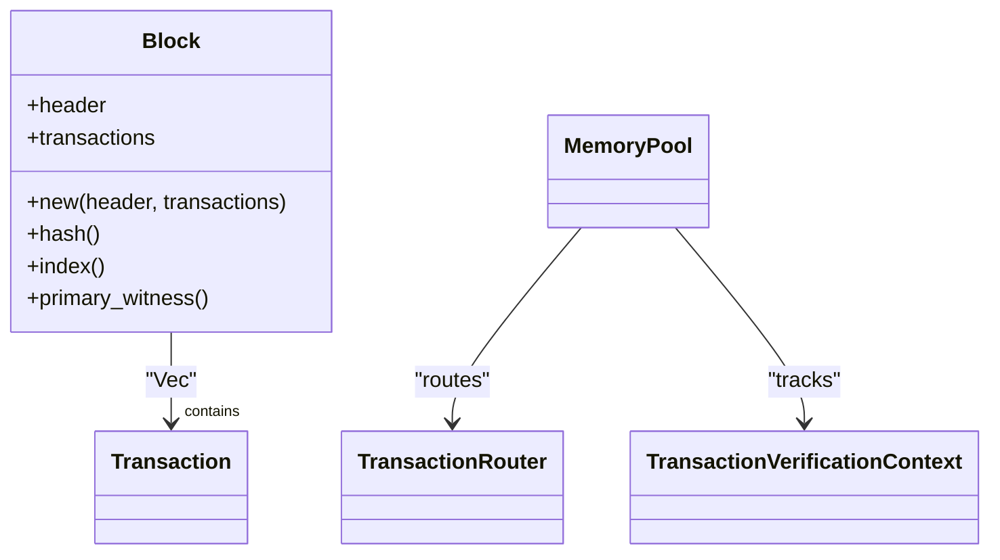
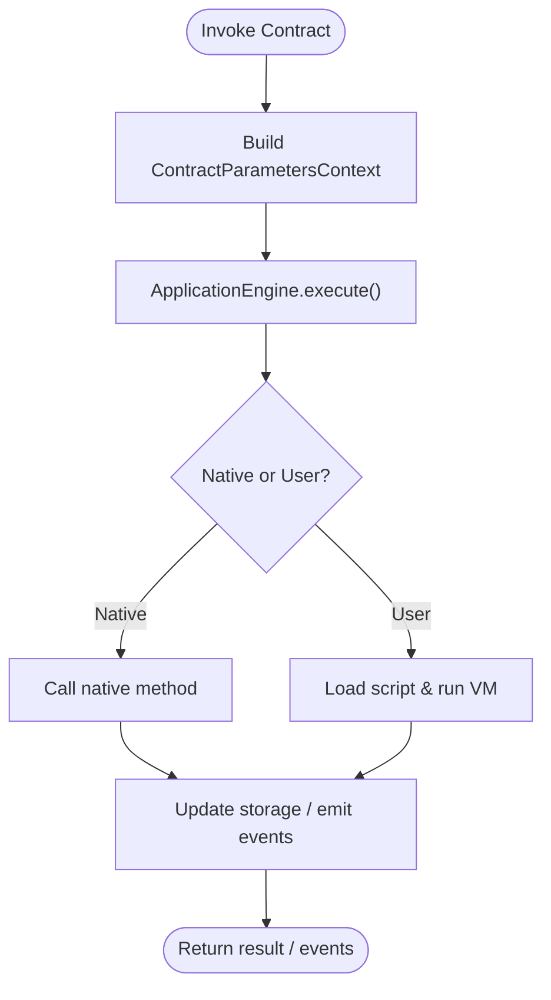
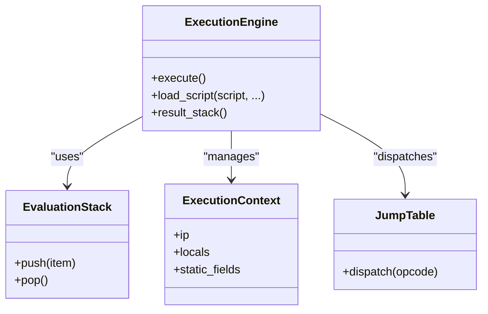
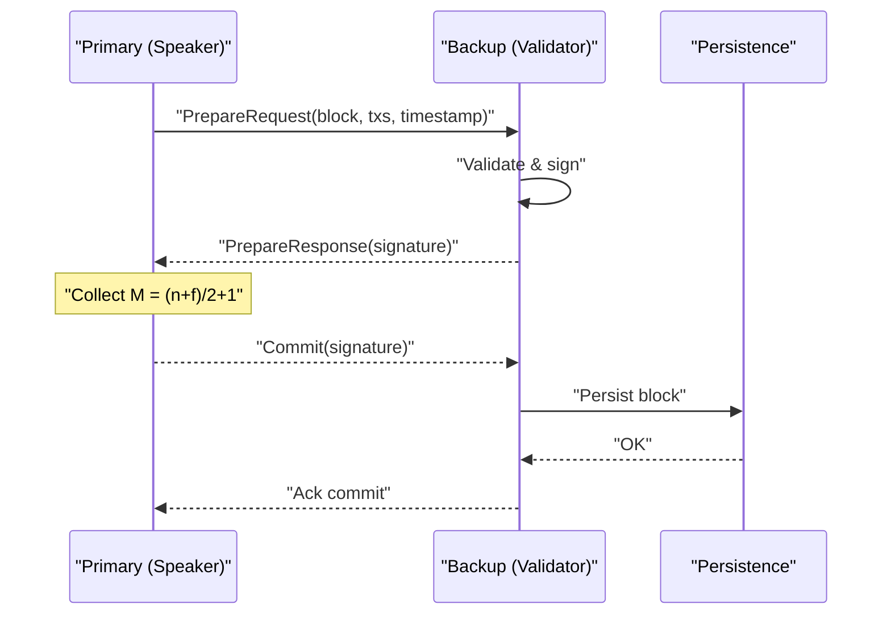
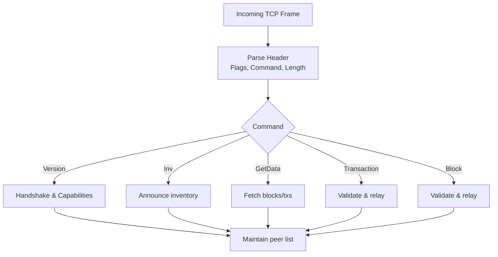
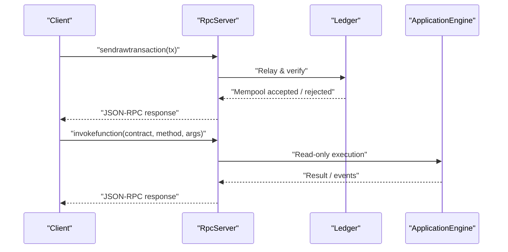
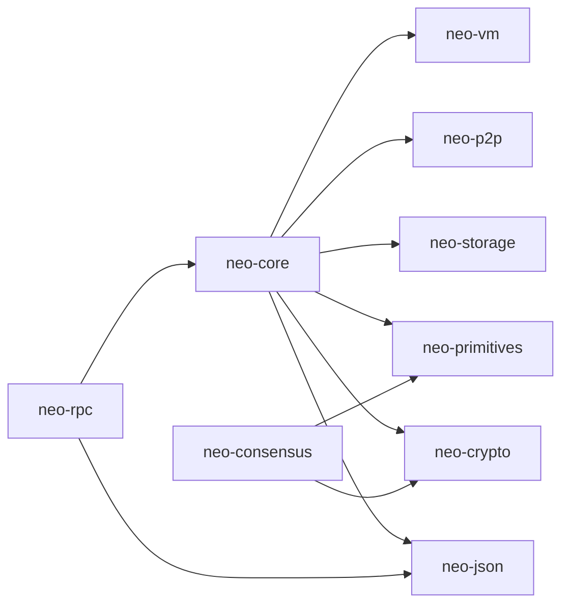

# Core Components

<cite>
**Referenced Files in This Document**
- [neo-core/src/lib.rs](file://neo-core/src/lib.rs)
- [neo-core/src/ledger/mod.rs](file://neo-core/src/ledger/mod.rs)
- [neo-core/src/ledger/block.rs](file://neo-core/src/ledger/block.rs)
- [neo-core/src/smart_contract/mod.rs](file://neo-core/src/smart_contract/mod.rs)
- [neo-core/src/network/p2p/mod.rs](file://neo-core/src/network/p2p/mod.rs)
- [neo-consensus/src/lib.rs](file://neo-consensus/src/lib.rs)
- [neo-consensus/src/service/mod.rs](file://neo-consensus/src/service/mod.rs)
- [neo-consensus/src/context/mod.rs](file://neo-consensus/src/context/mod.rs)
- [neo-p2p/src/lib.rs](file://neo-p2p/src/lib.rs)
- [neo-p2p/src/payloads/mod.rs](file://neo-p2p/src/payloads/mod.rs)
- [neo-rpc/src/lib.rs](file://neo-rpc/src/lib.rs)
- [neo-rpc/src/server/mod.rs](file://neo-rpc/src/server/mod.rs)
- [neo-vm/src/lib.rs](file://neo-vm/src/lib.rs)
</cite>

## Table of Contents
1. [Introduction](#introduction)
2. [Project Structure](#project-structure)
3. [Core Components](#core-components)
4. [Architecture Overview](#architecture-overview)
5. [Detailed Component Analysis](#detailed-component-analysis)
6. [Dependency Analysis](#dependency-analysis)
7. [Performance Considerations](#performance-considerations)
8. [Troubleshooting Guide](#troubleshooting-guide)
9. [Conclusion](#conclusion)

## Introduction
This document explains the core components that implement the Neo N3 blockchain protocol in neo-rs: the blockchain ledger (blocks, transactions, state), the Neo Virtual Machine (opcode execution, gas metering, smart contract runtime), dBFT consensus (validator coordination, view changes, fault tolerance), P2P networking (message protocols, peer discovery, synchronization), and the RPC server (JSON-RPC endpoints, authentication, rate limiting). It focuses on responsibilities, key data structures, and how these modules interact to produce and validate blocks, execute smart contracts, reach consensus, synchronize peers, and expose a JSON-RPC interface.

## Project Structure
Neo-rs is organized into layered crates:
- Foundation (Layer 0): primitives, crypto, storage, I/O, JSON
- Core (Layer 1): neo-core (ledger, smart contracts, network, persistence), neo-consensus (dBFT), neo-p2p (protocol types), neo-rpc (server/client), neo-vm (execution engine)
- Service/Node (Layer 2): node orchestration, configuration, plugins

**Diagram sources**
- [neo-core/src/lib.rs:14-46](file://neo-core/src/lib.rs#L14-L46)
- [neo-consensus/src/lib.rs:49-61](file://neo-consensus/src/lib.rs#L49-L61)
- [neo-p2p/src/lib.rs:40-49](file://neo-p2p/src/lib.rs#L40-L49)
- [neo-rpc/src/lib.rs:38-47](file://neo-rpc/src/lib.rs#L38-L47)
- [neo-vm/src/lib.rs:44-56](file://neo-vm/src/lib.rs#L44-L56)

**Section sources**
- [neo-core/src/lib.rs:14-46](file://neo-core/src/lib.rs#L14-L46)
- [neo-consensus/src/lib.rs:49-61](file://neo-consensus/src/lib.rs#L49-L61)
- [neo-p2p/src/lib.rs:40-49](file://neo-p2p/src/lib.rs#L40-L49)
- [neo-rpc/src/lib.rs:38-47](file://neo-rpc/src/lib.rs#L38-L47)
- [neo-vm/src/lib.rs:44-56](file://neo-vm/src/lib.rs#L44-L56)

## Core Components
- Blockchain Ledger: Blocks, headers, memory pool, transaction routing, verification context, and application execution results.
- Smart Contract Runtime: Application engine, native contracts, storage context, manifest, and helper utilities for witness verification and invocation.
- Neo Virtual Machine: Execution engine, evaluation stack, contexts, jump table, opcode semantics, gas metering, and exception handling.
- dBFT Consensus: State machine, messages (PrepareRequest/Response, Commit, ChangeView, Recovery), validator set, signatures, and view change logic.
- P2P Networking: Message framing, commands, payloads, peer management, rate limiting, reputation, and synchronization primitives.
- RPC Server: JSON-RPC methods for blockchain, node, smart contract, wallet, oracle, state, tokens tracker; middleware, TLS, sessions, and WebSocket events.

Key data structures include Block, Transaction, BlockHeader, MemoryPool, ApplicationEngine, ExecutionEngine, ConsensusContext, MessageCommand, InventoryType, and RpcServer.

**Section sources**
- [neo-core/src/ledger/mod.rs:1-44](file://neo-core/src/ledger/mod.rs#L1-L44)
- [neo-core/src/smart_contract/mod.rs:1-86](file://neo-core/src/smart_contract/mod.rs#L1-L86)
- [neo-vm/src/lib.rs:58-75](file://neo-vm/src/lib.rs#L58-L75)
- [neo-consensus/src/lib.rs:14-138](file://neo-consensus/src/lib.rs#L14-L138)
- [neo-p2p/src/lib.rs:66-147](file://neo-p2p/src/lib.rs#L66-L147)
- [neo-rpc/src/lib.rs:56-154](file://neo-rpc/src/lib.rs#L56-L154)

## Architecture Overview
The system coordinates block production and validation through a clear flow:
- P2P receives and relays transactions and blocks.
- Consensus selects a primary per view, proposes a block via PrepareRequest, collects PrepareResponses and Commits, and triggers persistence on commit.
- The ledger persists blocks, updates world state, and executes transactions using the VM and smart contract engine.
- The RPC server exposes read/write endpoints backed by the ledger, mempool, and VM execution.

**Diagram sources**
- [neo-consensus/src/lib.rs:63-138](file://neo-consensus/src/lib.rs#L63-L138)
- [neo-core/src/ledger/mod.rs:1-44](file://neo-core/src/ledger/mod.rs#L1-L44)
- [neo-core/src/smart_contract/mod.rs:1-86](file://neo-core/src/smart_contract/mod.rs#L1-L86)
- [neo-vm/src/lib.rs:58-75](file://neo-vm/src/lib.rs#L58-L75)
- [neo-rpc/src/lib.rs:56-154](file://neo-rpc/src/lib.rs#L56-L154)

## Detailed Component Analysis

### Blockchain Ledger
Responsibilities:
- Represent blocks and headers, manage the memory pool, route transactions, track verification context, and emit lifecycle events.
- Provide canonical parity with the C# implementation for mempool behavior, conflict detection, and reverification.

Key data structures:
- Block: header plus transactions; hash/index/witness accessors.
- MemoryPool: verified/unverified queues, sender fee tracking, conflict attributes, event callbacks.
- TransactionRouter and VerificationContext: per-sender fee accounting and conflict resolution.

**Diagram sources**
- [neo-core/src/ledger/block.rs:6-38](file://neo-core/src/ledger/block.rs#L6-L38)
- [neo-core/src/ledger/mod.rs:1-44](file://neo-core/src/ledger/mod.rs#L1-L44)

**Section sources**
- [neo-core/src/ledger/mod.rs:1-44](file://neo-core/src/ledger/mod.rs#L1-L44)
- [neo-core/src/ledger/block.rs:6-38](file://neo-core/src/ledger/block.rs#L6-L38)

### Smart Contract Runtime
Responsibilities:
- Orchestrate contract invocations, manage storage contexts, handle manifests, and provide helpers for witness verification and native contract calls.
- Expose trigger types, call flags, iterators, and diagnostic facilities.

Key data structures:
- ApplicationEngine: orchestrates execution across native and user contracts.
- Contract, Manifest, DeployedContract: metadata and deployed state.
- StorageContext, StorageItem, StorageKey: persistent key-value store abstractions.

**Diagram sources**
- [neo-core/src/smart_contract/mod.rs:1-86](file://neo-core/src/smart_contract/mod.rs#L1-L86)

**Section sources**
- [neo-core/src/smart_contract/mod.rs:1-86](file://neo-core/src/smart_contract/mod.rs#L1-L86)

### Neo Virtual Machine
Responsibilities:
- Provide an embedded VM with execution engine, evaluation stack, contexts, reference counting, opcode dispatch, and gas metering.
- Support ABI-level value semantics, exception handling, and interoperability services.

Key data structures:
- ExecutionEngine: main loop, context stack, gas tracking.
- EvaluationStack: type-safe operand stack.
- ExecutionContext: call frame with locals and static fields.
- JumpTable: stateful opcode dispatch adapters.

**Diagram sources**
- [neo-vm/src/lib.rs:58-75](file://neo-vm/src/lib.rs#L58-L75)
- [neo-vm/src/lib.rs:142-213](file://neo-vm/src/lib.rs#L142-L213)

**Section sources**
- [neo-vm/src/lib.rs:58-75](file://neo-vm/src/lib.rs#L58-L75)
- [neo-vm/src/lib.rs:142-213](file://neo-vm/src/lib.rs#L142-L213)

### dBFT Consensus
Responsibilities:
- Implement dBFT 2.0: single-block finality, rotating speaker, view changes, and recovery.
- Manage validator sets, collect signatures, enforce timing, and persist critical state for crash recovery.

Key data structures:
- ConsensusService: main state machine driving Prepare/Commit/ChangeView flows.
- ConsensusContext: current view, validators, proposal data, signature collections, timers, and recovery caches.
- Messages: PrepareRequest, PrepareResponse, Commit, ChangeView, RecoveryRequest/Message.

**Diagram sources**
- [neo-consensus/src/lib.rs:63-138](file://neo-consensus/src/lib.rs#L63-L138)
- [neo-consensus/src/context/mod.rs:111-191](file://neo-consensus/src/context/mod.rs#L111-L191)

**Section sources**
- [neo-consensus/src/lib.rs:6-138](file://neo-consensus/src/lib.rs#L6-L138)
- [neo-consensus/src/service/mod.rs:1-16](file://neo-consensus/src/service/mod.rs#L1-L16)
- [neo-consensus/src/context/mod.rs:111-191](file://neo-consensus/src/context/mod.rs#L111-L191)

### P2P Networking
Responsibilities:
- Define wire format, message commands, payloads, and peer capabilities.
- Provide rate limiting, reputation scoring, and synchronization primitives for blocks and transactions.

Key data structures:
- MessageCommand, InventoryType, VerifyResult, WitnessScope, NodeCapabilityType.
- Payloads: Version, Addr, Ping/Pong, GetBlocks/GetBlockByIndex, Inv, etc.
- InboundRateLimiter and reputation constants for DoS protection.

**Diagram sources**
- [neo-p2p/src/lib.rs:106-147](file://neo-p2p/src/lib.rs#L106-L147)
- [neo-p2p/src/payloads/mod.rs:1-40](file://neo-p2p/src/payloads/mod.rs#L1-L40)
- [neo-core/src/network/p2p/mod.rs:94-121](file://neo-core/src/network/p2p/mod.rs#L94-L121)

**Section sources**
- [neo-p2p/src/lib.rs:66-147](file://neo-p2p/src/lib.rs#L66-L147)
- [neo-p2p/src/payloads/mod.rs:1-40](file://neo-p2p/src/payloads/mod.rs#L1-L40)
- [neo-core/src/network/p2p/mod.rs:94-121](file://neo-core/src/network/p2p/mod.rs#L94-L121)

### RPC Server
Responsibilities:
- Serve JSON-RPC methods for blockchain queries, node info, smart contract invocation, wallet operations, oracle, state, and token tracking.
- Provide middleware, TLS, sessions, and WebSocket event broadcasting.

Key data structures:
- RpcServer, RpcServerConfig, RpcServerSettings.
- Method groups: blockchain, node, smart_contract, wallet, oracle, state, tokens_tracker, utilities.
- Error codes and exceptions mapped to standard JSON-RPC errors.

**Diagram sources**
- [neo-rpc/src/lib.rs:56-154](file://neo-rpc/src/lib.rs#L56-L154)
- [neo-rpc/src/server/mod.rs:1-66](file://neo-rpc/src/server/mod.rs#L1-L66)

**Section sources**
- [neo-rpc/src/lib.rs:56-154](file://neo-rpc/src/lib.rs#L56-L154)
- [neo-rpc/src/server/mod.rs:1-66](file://neo-rpc/src/server/mod.rs#L1-L66)

## Dependency Analysis
High-level dependencies between core modules:
- neo-core depends on neo-vm, neo-p2p, neo-storage, neo-primitives, neo-crypto, neo-json.
- neo-consensus depends on neo-primitives and neo-crypto.
- neo-rpc depends on neo-core and neo-json.
- neo-p2p depends on neo-primitives and provides minimal types for external consumers.

**Diagram sources**
- [neo-core/src/lib.rs:14-46](file://neo-core/src/lib.rs#L14-L46)
- [neo-consensus/src/lib.rs:49-61](file://neo-consensus/src/lib.rs#L49-L61)
- [neo-rpc/src/lib.rs:38-47](file://neo-rpc/src/lib.rs#L38-L47)
- [neo-p2p/src/lib.rs:40-49](file://neo-p2p/src/lib.rs#L40-L49)

**Section sources**
- [neo-core/src/lib.rs:14-46](file://neo-core/src/lib.rs#L14-L46)
- [neo-consensus/src/lib.rs:49-61](file://neo-consensus/src/lib.rs#L49-L61)
- [neo-rpc/src/lib.rs:38-47](file://neo-rpc/src/lib.rs#L38-L47)
- [neo-p2p/src/lib.rs:40-49](file://neo-p2p/src/lib.rs#L40-L49)

## Performance Considerations
- VM gas metering: precise costs per operation prevent abuse and ensure deterministic execution. Tune opcode price tables and invocation limits for throughput vs. security trade-offs.
- P2P rate limiting: inbound connection rate limiter protects against DoS; tune burst and rate based on network conditions.
- Consensus timeouts: adjust Prepare/Commit/ViewChange timeouts to balance liveness and safety under varying latency.
- Storage and caching: leverage DataCache and header cache to reduce disk I/O during sync and replay.
- RPC load: enable request rate limiting and consider read replicas for heavy query workloads.

[No sources needed since this section provides general guidance]

## Troubleshooting Guide
Common issues and where to look:
- Consensus stalls or frequent view changes: inspect ConsensusContext timers, validator set, and message deduplication caches; check ChangeView reasons and last seen timestamps.
- Transactions stuck in mempool: review MemoryPool verification context, sender fee tracking, and conflict attribute resolution; reverify if policy changed.
- VM execution failures: examine VmError types, stack underflows, and gas exhaustion; use diagnostics and notify/log events from ApplicationEngine.
- P2P connectivity problems: check rate limiter status, reputation thresholds, and banned peers; validate handshake and capability negotiation.
- RPC errors: map error codes to causes (e.g., block not found, invalid params); verify authentication and CORS settings; inspect middleware logs.

**Section sources**
- [neo-consensus/src/context/mod.rs:111-191](file://neo-consensus/src/context/mod.rs#L111-L191)
- [neo-core/src/ledger/mod.rs:1-44](file://neo-core/src/ledger/mod.rs#L1-L44)
- [neo-vm/src/lib.rs:123-134](file://neo-vm/src/lib.rs#L123-L134)
- [neo-core/src/network/p2p/mod.rs:94-121](file://neo-core/src/network/p2p/mod.rs#L94-L121)
- [neo-rpc/src/lib.rs:136-154](file://neo-rpc/src/lib.rs#L136-L154)

## Conclusion
Neo-rs implements a cohesive blockchain protocol stack: the ledger manages blocks and state, the VM executes smart contracts deterministically with gas metering, dBFT ensures safe and live consensus among validators, P2P synchronizes nodes securely with robust protections, and the RPC server exposes a rich API for clients. Understanding the interactions among these components enables effective development, tuning, and troubleshooting of Neo nodes.

[No sources needed since this section summarizes without analyzing specific files]