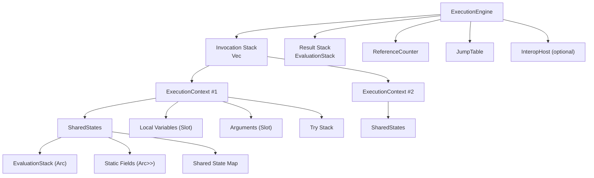
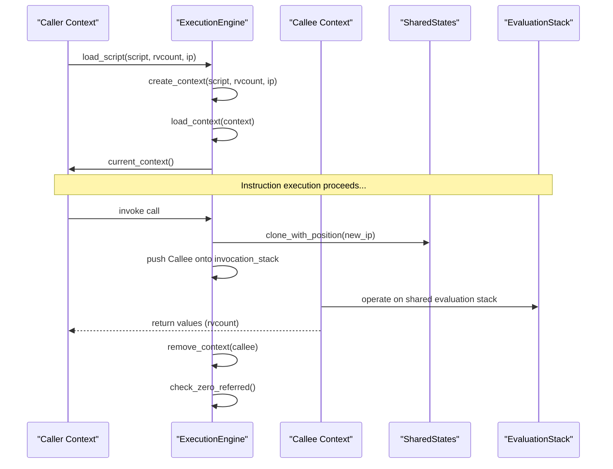
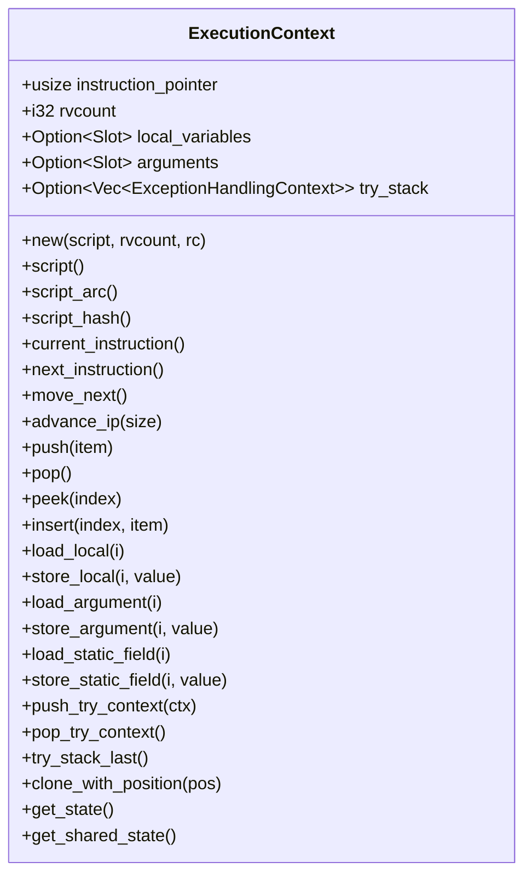
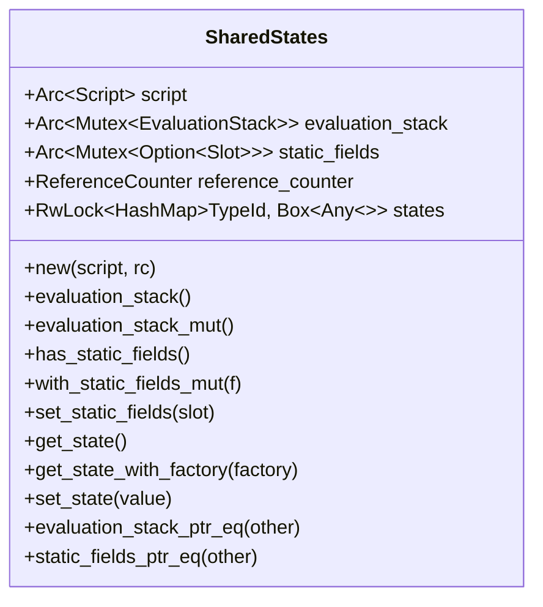
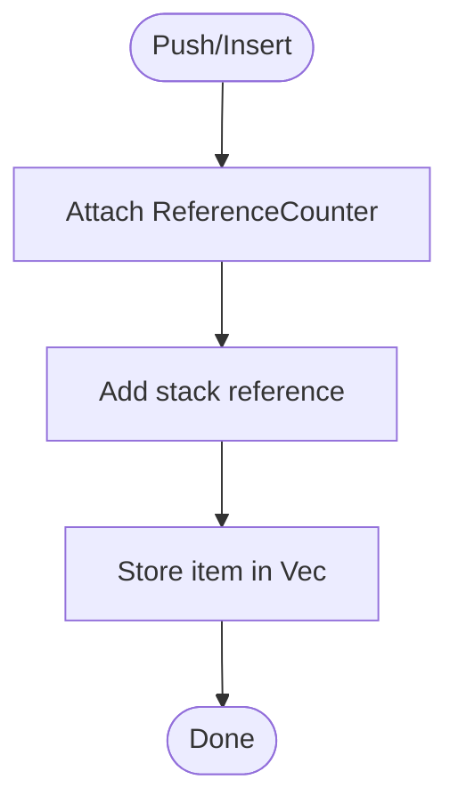
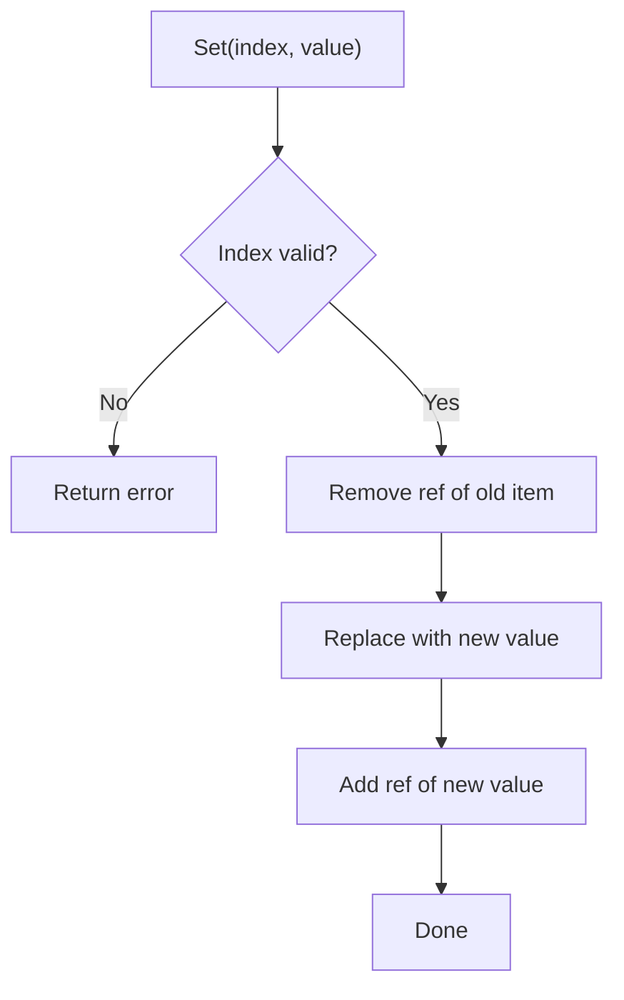
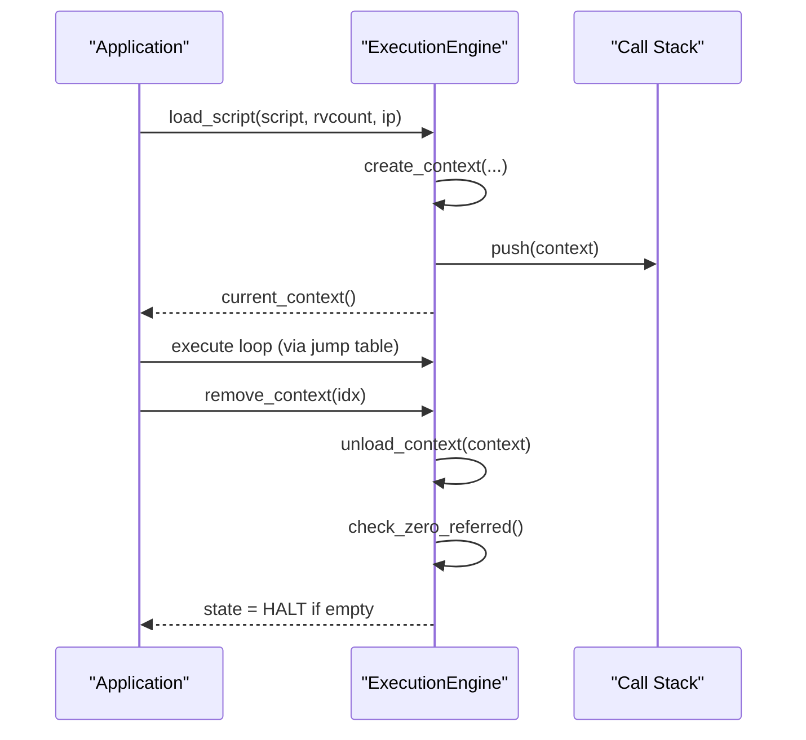
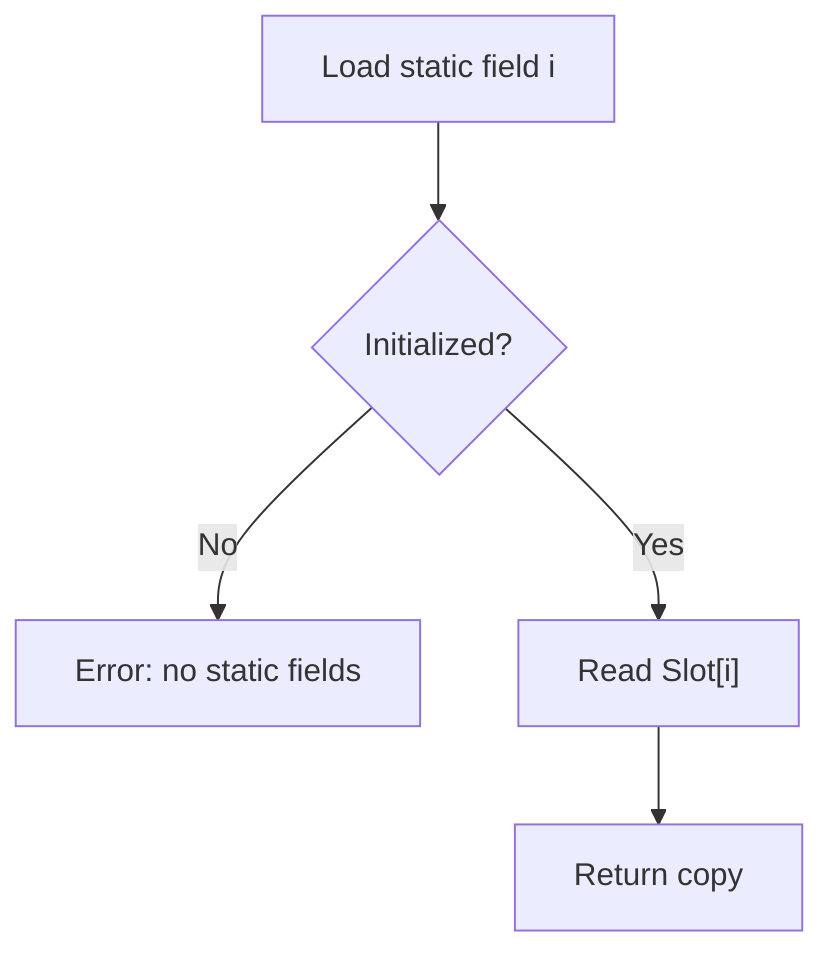
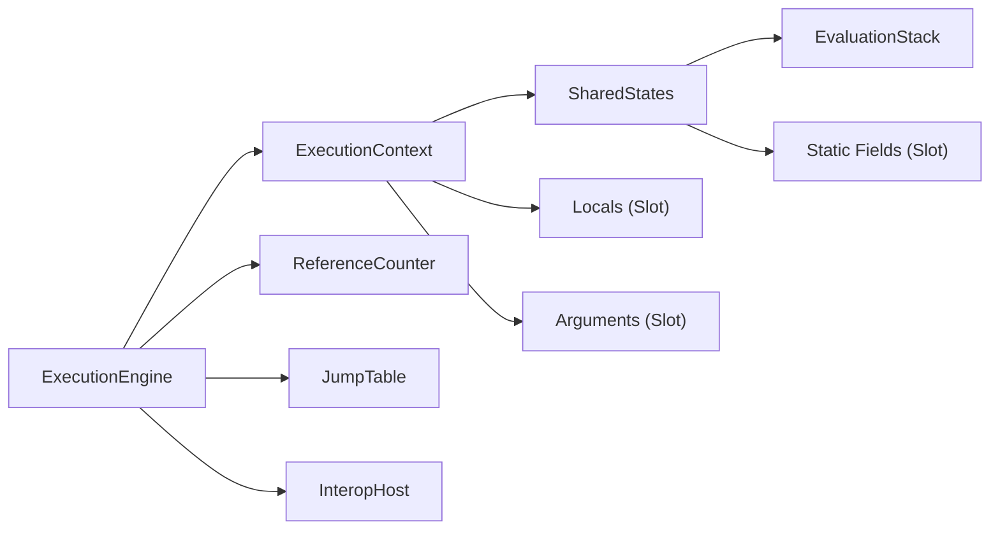

# Context Management

<cite>
**Referenced Files in This Document**
- [lib.rs](file://neo-vm/src/lib.rs)
- [context.rs](file://neo-vm/src/execution_context/context.rs)
- [shared_states.rs](file://neo-vm/src/execution_context/shared_states.rs)
- [mod.rs (execution_engine)](file://neo-vm/src/execution_engine/mod.rs)
- [core.rs (execution_engine)](file://neo-vm/src/execution_engine/core.rs)
- [context.rs (execution_engine)](file://neo-vm/src/execution_engine/context.rs)
- [evaluation_stack.rs](file://neo-vm/src/evaluation_stack.rs)
- [slot.rs](file://neo-vm/src/slot.rs)
- [storage_context.rs](file://neo-vm/src/storage_context.rs)
</cite>

## Table of Contents
1. [Introduction](#introduction)
2. [Project Structure](#project-structure)
3. [Core Components](#core-components)
4. [Architecture Overview](#architecture-overview)
5. [Detailed Component Analysis](#detailed-component-analysis)
6. [Dependency Analysis](#dependency-analysis)
7. [Performance Considerations](#performance-considerations)
8. [Troubleshooting Guide](#troubleshooting-guide)
9. [Conclusion](#conclusion)
10. [Appendices](#appendices)

## Introduction
This document explains execution context management in the Neo VM with a focus on how call frames are created, shared, and destroyed during function invocation and return. It details the ExecutionContext structure (instruction pointer, evaluation stack, alt stack, local variables, arguments, try/exception handling), the call stack lifecycle managed by ExecutionEngine, static field access patterns and shared state across contexts, and memory isolation boundaries enforced by reference counting and slot storage. It also provides guidance for manual context manipulation, building custom execution environments, and debugging context states.

## Project Structure
The Neo VM exposes a layered design:
- ExecutionEngine orchestrates the main loop, manages the invocation stack of ExecutionContexts, tracks gas, and coordinates interop/syscalls.
- ExecutionContext represents one call frame with its instruction pointer, per-frame locals/arguments, and exception handling state.
- SharedStates holds script, evaluation stack, static fields, and type-keyed shared state that can be cloned and shared across CALL clones.
- EvaluationStack is the operand stack used by instructions and shared between caller/callee via cloning semantics.
- Slot stores local variables, arguments, and static fields with reference counting integration.
- StorageContext models read-only or read-write storage scopes passed to native contracts.

**Diagram sources**
- [mod.rs (execution_engine):196-242](file://neo-vm/src/execution_engine/mod.rs#L196-L242)
- [context.rs:27-45](file://neo-vm/src/execution_context/context.rs#L27-L45)
- [shared_states.rs:31-42](file://neo-vm/src/execution_context/shared_states.rs#L31-L42)
- [evaluation_stack.rs:11-18](file://neo-vm/src/evaluation_stack.rs#L11-L18)
- [slot.rs:18-25](file://neo-vm/src/slot.rs#L18-L25)

**Section sources**
- [lib.rs:142-212](file://neo-vm/src/lib.rs#L142-L212)
- [mod.rs (execution_engine):196-242](file://neo-vm/src/execution_engine/mod.rs#L196-L242)

## Core Components
- ExecutionContext: Holds instruction_pointer, rvcount, optional local_variables and arguments, try_stack, and a SharedStates handle. Provides methods to move the IP, push/pop/peek the evaluation stack, load/store locals/arguments/static fields, manage try contexts, and clone for CALL operations.
- SharedStates: Encapsulates Arc<Script>, Arc<Mutex<EvaluationStack>>, Arc<Mutex<Option<Slot>>> for static fields, ReferenceCounter, and a type-keyed shared state map. Supports cloning so caller and callee share evaluation stack and static fields.
- EvaluationStack: Operand stack with push/pop/peek/insert/remove/reverse/copy_to/move_to/clear, integrating reference counting for compound items.
- Slot: Fixed-size storage for locals, arguments, and static fields with reference counting and clear_references support.
- ExecutionEngine: Manages invocation_stack, result_stack, limits, jump table, interop host, gas tracking, and fault handling; loads/unloads/removes contexts; creates new contexts from scripts.

**Section sources**
- [context.rs:27-520](file://neo-vm/src/execution_context/context.rs#L27-L520)
- [shared_states.rs:31-167](file://neo-vm/src/execution_context/shared_states.rs#L31-L167)
- [evaluation_stack.rs:11-281](file://neo-vm/src/evaluation_stack.rs#L11-L281)
- [slot.rs:18-201](file://neo-vm/src/slot.rs#L18-L201)
- [core.rs (execution_engine):11-227](file://neo-vm/src/execution_engine/core.rs#L11-L227)
- [context.rs (execution_engine):7-116](file://neo-vm/src/execution_engine/context.rs#L7-L116)

## Architecture Overview
The VM executes by iterating over instructions in the current ExecutionContext, dispatching through JumpTable, and manipulating stacks and slots. Function calls create a new ExecutionContext sharing script, evaluation stack, and static fields with the caller, while resetting rvcount and clearing per-call try state. Returns unwind the call stack, moving results to the result stack and cleaning up references.

**Diagram sources**
- [context.rs (execution_engine):8-116](file://neo-vm/src/execution_engine/context.rs#L8-L116)
- [context.rs:385-398](file://neo-vm/src/execution_context/context.rs#L385-L398)
- [shared_states.rs:31-42](file://neo-vm/src/execution_context/shared_states.rs#L31-L42)
- [evaluation_stack.rs:145-191](file://neo-vm/src/evaluation_stack.rs#L145-L191)

## Detailed Component Analysis

### ExecutionContext: Call Frame Model
- Fields:
  - instruction_pointer: current byte offset into the script
  - rvcount: number of values to pop and return when unloaded
  - local_variables: optional Slot for locals
  - arguments: optional Slot for arguments
  - try_stack: optional Vec of ExceptionHandlingContext for try/catch/finally
  - shared_states: Script, EvaluationStack (shared), Static Fields (shared), ReferenceCounter, typed state map
- Key behaviors:
  - Instruction navigation: current_instruction(), next_instruction(), move_next(), advance_ip()
  - Stack helpers: push(), pop(), peek(), insert()
  - Local/argument/static access: load_local/store_local, load_argument/store_argument, load_static_field/store_static_field
  - Try stack: push_try_context(), pop_try_context(), try_stack_last(), has_try_context()
  - Cloning for CALL: clone_with_position() shares script, evaluation stack, and static fields; resets rvcount=0 and clears try_stack
  - Shared state: get_state/get_shared_state APIs for cross-context typed state

**Diagram sources**
- [context.rs:27-520](file://neo-vm/src/execution_context/context.rs#L27-L520)

**Section sources**
- [context.rs:27-520](file://neo-vm/src/execution_context/context.rs#L27-L520)

### SharedStates: Shared Memory Between Call Frames
- Purpose: Allow caller and callee to share the same evaluation stack and static fields while keeping per-call control flow separate.
- Composition:
  - Arc<Script>: immutable script bytes/instructions
  - Arc<Mutex<EvaluationStack>>: shared operand stack
  - Arc<Mutex<Option<Slot>>>: shared static fields
  - ReferenceCounter: GC integration for compound items
  - RwLock<HashMap<TypeId, Box<dyn Any>>>: typed shared state cache
- Sharing checks:
  - shares_evaluation_stack_with() and shares_static_fields_with() detect aliasing via pointer equality.

**Diagram sources**
- [shared_states.rs:31-167](file://neo-vm/src/execution_context/shared_states.rs#L31-L167)

**Section sources**
- [shared_states.rs:31-167](file://neo-vm/src/execution_context/shared_states.rs#L31-L167)

### EvaluationStack: Operand Stack and Reference Counting
- Operations: push, pop, peek, peek_mut, insert, remove, swap, reverse, copy_to, move_to, clear, iter.
- Reference counting:
  - On push/insert, items attach to the engine’s ReferenceCounter and add a stack reference.
  - On remove/drop, references are removed.
  - copy_to/move_to validate compatibility of arrays/structs/maps with target ReferenceCounter.

**Diagram sources**
- [evaluation_stack.rs:52-108](file://neo-vm/src/evaluation_stack.rs#L52-L108)

**Section sources**
- [evaluation_stack.rs:11-281](file://neo-vm/src/evaluation_stack.rs#L11-L281)

### Slot: Locals, Arguments, and Static Fields
- Fixed-size storage with preallocated capacity and batched reference counting for Null initialization.
- Methods: get/set/remove/clear/clear_references/to_vec/into_vec.
- Integration: When setting an item, old item’s reference is removed and new item’s reference added.

**Diagram sources**
- [slot.rs:91-107](file://neo-vm/src/slot.rs#L91-L107)

**Section sources**
- [slot.rs:18-201](file://neo-vm/src/slot.rs#L18-L201)

### ExecutionEngine: Invocation Stack and Lifecycle
- Manages:
  - invocation_stack: Vec<ExecutionContext>
  - result_stack: EvaluationStack for final outputs
  - limits: max invocation depth, etc.
  - jump_table, reference_counter, interop_host
- Context lifecycle:
  - create_context(script, rvcount, initial_position)
  - load_context(context): pushes onto invocation stack and notifies host if present
  - unload_context(context): clears references for locals/arguments/static fields and notifies host
  - remove_context(index): pops and cleans up, transitions to HALT if empty, triggers GC check

**Diagram sources**
- [context.rs (execution_engine):8-116](file://neo-vm/src/execution_engine/context.rs#L8-L116)
- [core.rs (execution_engine):11-227](file://neo-vm/src/execution_engine/core.rs#L11-L227)

**Section sources**
- [context.rs (execution_engine):8-116](file://neo-vm/src/execution_engine/context.rs#L8-L116)
- [core.rs (execution_engine):11-227](file://neo-vm/src/execution_engine/core.rs#L11-L227)

### Static Field Access Patterns and Shared State
- Static fields live in SharedStates and are shared across all ExecutionContext clones derived from the same SharedStates instance.
- Access:
  - load_static_field(index) returns a copy of the stored StackItem
  - store_static_field(index, value) sets the slot at index
  - has_static_fields() indicates whether static fields have been initialized
- Shared typed state:
  - get_state<T>() / get_shared_state<T>() caches a single instance per TypeId in SharedStates
  - set_state<T>(value) replaces cached state for T

**Diagram sources**
- [context.rs:432-463](file://neo-vm/src/execution_context/context.rs#L432-L463)
- [shared_states.rs:96-123](file://neo-vm/src/execution_context/shared_states.rs#L96-L123)

**Section sources**
- [context.rs:432-463](file://neo-vm/src/execution_context/context.rs#L432-L463)
- [shared_states.rs:96-123](file://neo-vm/src/execution_context/shared_states.rs#L96-L123)

### Memory Isolation Across Scopes
- Per-call isolation:
  - Each ExecutionContext owns its own instruction_pointer, rvcount, try_stack, and optional local/argument Slots.
  - Unloading a context clears references in locals/arguments and optionally clears static field references if not shared with the current context.
- Shared scope:
  - EvaluationStack and static fields are shared via Arc within SharedStates, enabling efficient argument/result passing and module-level state.
- Reference counting:
  - All stack items attached to the engine’s ReferenceCounter; removal occurs on pop/remove/clear and when contexts unload.

**Section sources**
- [context.rs (execution_engine):30-60](file://neo-vm/src/execution_engine/context.rs#L30-L60)
- [evaluation_stack.rs:234-275](file://neo-vm/src/evaluation_stack.rs#L234-L275)
- [slot.rs:139-146](file://neo-vm/src/slot.rs#L139-L146)

### Manual Context Manipulation and Custom Execution Environments
- Creating and loading contexts:
  - Use ExecutionEngine::create_context to build a context with a specific script, rvcount, and initial position.
  - Use ExecutionEngine::load_context to push it onto the invocation stack and notify the host.
- Modifying per-call state:
  - Initialize locals/arguments via ExecutionContext::init_slot(local_count, argument_count).
  - Push/pop/peek the evaluation stack directly via ExecutionContext methods.
  - Manage try/catch/finally using push_try_context/pop_try_context.
- Returning values:
  - Set rvcount to indicate how many top-of-stack items should be moved to the result stack upon unloading.
- Host integration:
  - Provide InteropHost callbacks to observe context loaded/unloaded and pre/post instruction hooks.

**Section sources**
- [context.rs (execution_engine):8-116](file://neo-vm/src/execution_engine/context.rs#L8-L116)
- [context.rs:415-430](file://neo-vm/src/execution_context/context.rs#L415-L430)
- [context.rs:260-279](file://neo-vm/src/execution_context/context.rs#L260-L279)

### Debugging Context States
- Inspect current context:
  - ExecutionEngine::current_context() returns the top ExecutionContext.
  - ExecutionContext::instruction_pointer(), current_instruction(), evaluation_stack().len() help locate execution point and stack shape.
- Fault diagnostics:
  - ExecutionEngine::on_fault() records uncaught_exception and augments error messages with ip, opcode, and eval_depth when available.
- Try stack inspection:
  - ExecutionContext::try_stack(), try_stack_len(), try_stack_last() expose active exception handlers.

**Section sources**
- [core.rs (execution_engine):67-93](file://neo-vm/src/execution_engine/core.rs#L67-L93)
- [context.rs:88-128](file://neo-vm/src/execution_context/context.rs#L88-L128)
- [context.rs:232-279](file://neo-vm/src/execution_context/context.rs#L232-L279)

## Dependency Analysis
High-level dependencies among core components:

**Diagram sources**
- [mod.rs (execution_engine):196-242](file://neo-vm/src/execution_engine/mod.rs#L196-L242)
- [context.rs:27-45](file://neo-vm/src/execution_context/context.rs#L27-L45)
- [shared_states.rs:31-42](file://neo-vm/src/execution_context/shared_states.rs#L31-L42)
- [evaluation_stack.rs:11-18](file://neo-vm/src/evaluation_stack.rs#L11-L18)
- [slot.rs:18-25](file://neo-vm/src/slot.rs#L18-L25)

**Section sources**
- [mod.rs (execution_engine):196-242](file://neo-vm/src/execution_engine/mod.rs#L196-L242)
- [context.rs:27-45](file://neo-vm/src/execution_context/context.rs#L27-L45)
- [shared_states.rs:31-42](file://neo-vm/src/execution_context/shared_states.rs#L31-L42)

## Performance Considerations
- Shared evaluation stack reduces copying overhead during calls; ensure callers and callees intentionally share state.
- Batch reference counting:
  - Slot constructors initialize with Null and add a single batched reference count.
- Avoid unnecessary cloning:
  - ExecutionContext::clone_with_position shares script and stacks; only use when implementing CALL semantics.
- Minimize lock contention:
  - EvaluationStack and static fields are protected by Mutex; keep critical sections short.
- Gas and limits:
  - Respect ExecutionEngine limits and gas consumption to prevent long-running executions.

[No sources needed since this section provides general guidance]

## Troubleshooting Guide
Common issues and remedies:
- Instruction pointer out of range:
  - Ensure move_next/advance_ip do not exceed script length; current_instruction validates bounds.
- Stack underflow:
  - Check evaluation stack size before pop/peek; errors include stack depth information.
- Missing static fields:
  - Initialize static fields before accessing; has_static_fields indicates readiness.
- Uninitialized locals/arguments:
  - Call init_slot with correct counts before load/store operations.
- Context limit exceeded:
  - Max invocation stack size is enforced; reduce nesting or adjust limits.
- Fault diagnostics:
  - Inspect uncaught_exception and engine state; log ip, opcode, and eval_depth from fault handler.

**Section sources**
- [context.rs:101-128](file://neo-vm/src/execution_context/context.rs#L101-L128)
- [evaluation_stack.rs:61-93](file://neo-vm/src/evaluation_stack.rs#L61-L93)
- [context.rs (execution_engine):8-27](file://neo-vm/src/execution_engine/context.rs#L8-L27)
- [core.rs (execution_engine):67-93](file://neo-vm/src/execution_engine/core.rs#L67-L93)

## Conclusion
Neo VM execution context management centers on ExecutionContext as a call frame, SharedStates for shared script/stack/static fields, and ExecutionEngine for lifecycle control. Proper use of cloning, slot initialization, try stack management, and reference counting ensures correctness, performance, and isolation across nested calls. The provided APIs enable both standard contract execution and advanced scenarios like custom execution environments and deep debugging.

[No sources needed since this section summarizes without analyzing specific files]

## Appendices

### StorageContext Usage
StorageContext models per-contract storage scopes with read-only or read-write modes and supports serialization to/from bytes and stack items for interoperability.

**Section sources**
- [storage_context.rs:6-119](file://neo-vm/src/storage_context.rs#L6-L119)