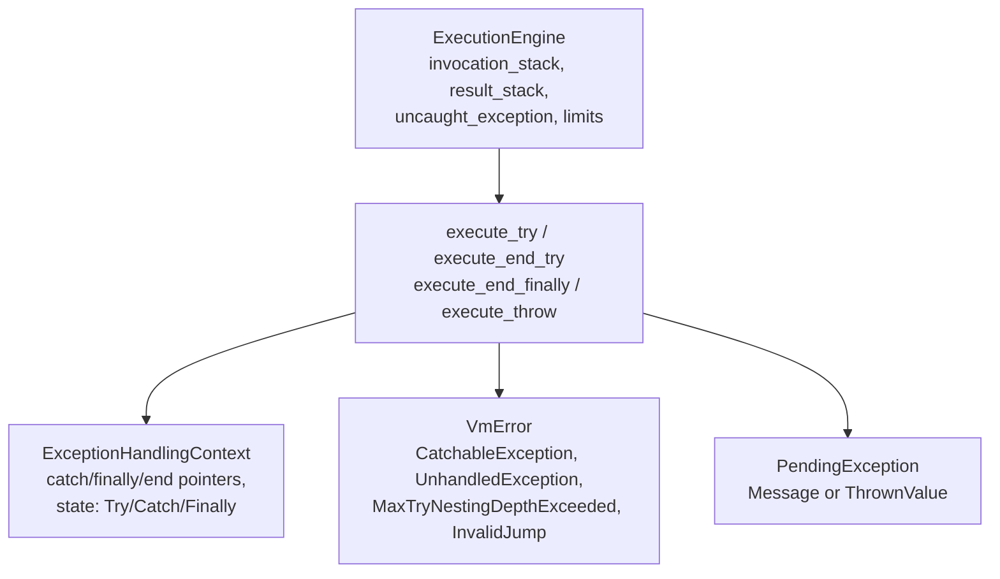
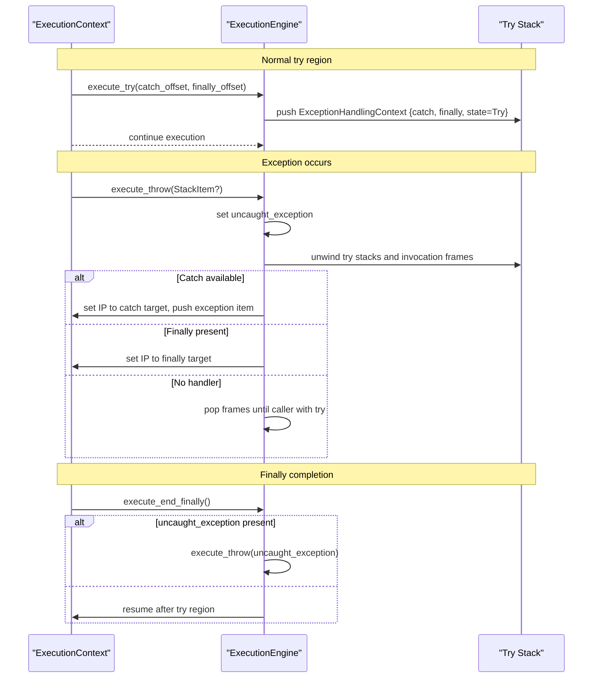
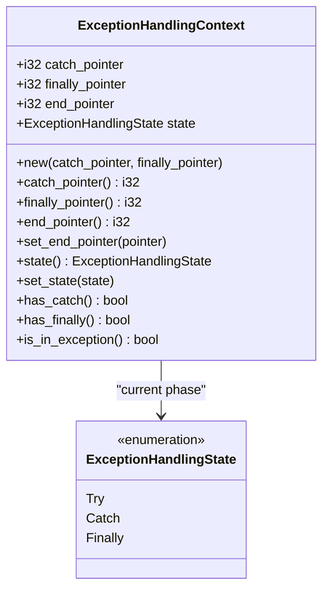
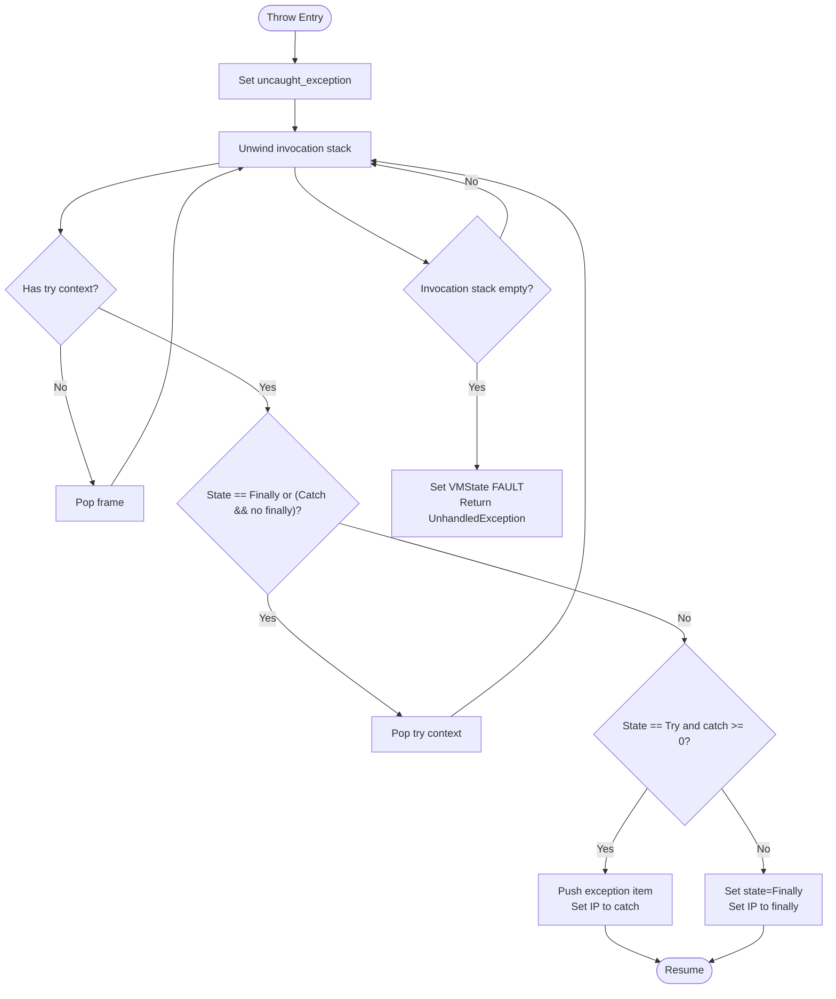
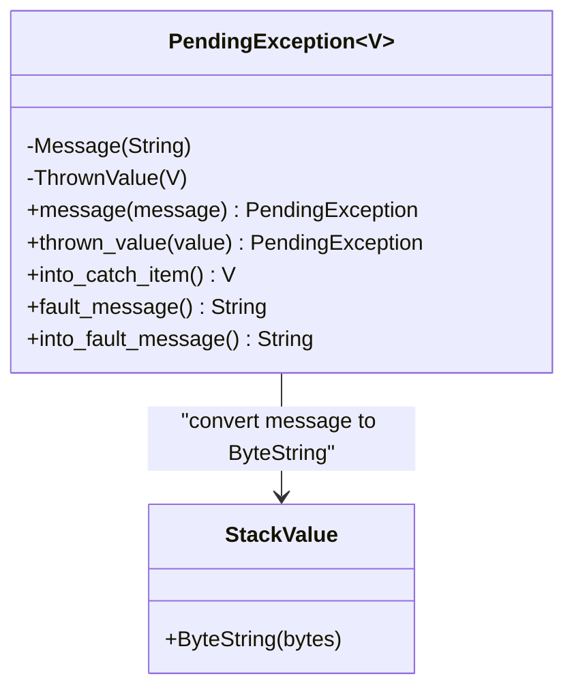
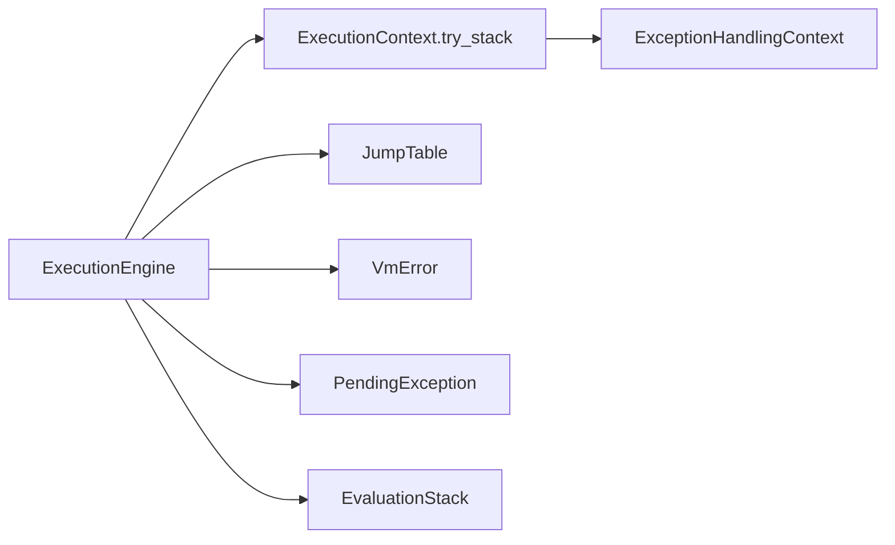

# Exception Handling

<cite>
**Referenced Files in This Document**
- [neo-vm/src/execution_engine/mod.rs](file://neo-vm/src/execution_engine/mod.rs)
- [neo-vm/src/execution_engine/exception.rs](file://neo-vm/src/execution_engine/exception.rs)
- [neo-vm/src/vm/exception_handling.rs](file://neo-vm/src/vm/exception_handling.rs)
- [neo-vm/src/runtime/pending_exception.rs](file://neo-vm/src/runtime/pending_exception.rs)
- [neo-vm/src/error.rs](file://neo-vm/src/error.rs)
- [neo-vm/src/lib.rs](file://neo-vm/src/lib.rs)
</cite>

## Table of Contents
1. [Introduction](#introduction)
2. [Project Structure](#project-structure)
3. [Core Components](#core-components)
4. [Architecture Overview](#architecture-overview)
5. [Detailed Component Analysis](#detailed-component-analysis)
6. [Dependency Analysis](#dependency-analysis)
7. [Performance Considerations](#performance-considerations)
8. [Troubleshooting Guide](#troubleshooting-guide)
9. [Conclusion](#conclusion)
10. [Appendices](#appendices)

## Introduction
This document explains exception handling in the Neo VM, focusing on try-catch-finally semantics, exception propagation through the call stack, and error recovery strategies. It documents the TryFrame-like structure used to maintain handler state, pending exceptions, and uncaught exception management. It also covers built-in exception types, custom exception creation patterns, best practices for robust smart contract error handling, debugging failed executions, and performance considerations for exception-heavy code paths.

## Project Structure
Exception handling spans several modules within the Neo VM:
- Execution engine orchestration and state (invocation stack, result stack, limits, gas)
- Exception control flow (try/catch/finally/throw execution)
- Shared metadata for exception frames (state machine and frame fields)
- Pending exception abstraction for message vs thrown value handling
- VM error taxonomy and fault classification

**Diagram sources**
- [neo-vm/src/execution_engine/mod.rs:195-242](file://neo-vm/src/execution_engine/mod.rs#L195-L242)
- [neo-vm/src/execution_engine/exception.rs:7-113](file://neo-vm/src/execution_engine/exception.rs#L7-L113)
- [neo-vm/src/vm/exception_handling.rs:3-21](file://neo-vm/src/vm/exception_handling.rs#L3-L21)
- [neo-vm/src/runtime/pending_exception.rs:3-17](file://neo-vm/src/runtime/pending_exception.rs#L3-L17)
- [neo-vm/src/error.rs:76-313](file://neo-vm/src/error.rs#L76-L313)

**Section sources**
- [neo-vm/src/execution_engine/mod.rs:195-242](file://neo-vm/src/execution_engine/mod.rs#L195-L242)
- [neo-vm/src/lib.rs:149-174](file://neo-vm/src/lib.rs#L149-L174)

## Core Components
- ExecutionEngine: Holds invocation stack, result stack, current state, gas/instruction counters, and an optional uncaught exception. It drives the main execution loop and delegates instruction dispatch to the jump table.
- Exception control flow: Methods implement TRY, ENDTRY, ENDFINALLY, and THROW semantics, coordinating with the invocation stack and try context stack.
- ExceptionHandlingContext: Represents a single try/catch/finally region with pointers to catch, finally, end, and a state machine indicating which region is currently executing.
- PendingException: A lightweight abstraction that can carry either a message string or a thrown value, enabling consistent conversion into a catch item or fault message.
- VmError: Comprehensive error taxonomy including catchable exceptions, unhandled exceptions, resource limits, invalid jumps, and faults.

Key responsibilities:
- Push/pop try contexts when entering/exiting try blocks
- Propagate exceptions across call frames until a matching handler is found
- Execute finally blocks deterministically before resuming or faulting
- Convert pending exceptions into appropriate stack items for handlers or fault messages

**Section sources**
- [neo-vm/src/execution_engine/mod.rs:195-242](file://neo-vm/src/execution_engine/mod.rs#L195-L242)
- [neo-vm/src/execution_engine/exception.rs:7-267](file://neo-vm/src/execution_engine/exception.rs#L7-L267)
- [neo-vm/src/vm/exception_handling.rs:3-89](file://neo-vm/src/vm/exception_handling.rs#L3-L89)
- [neo-vm/src/runtime/pending_exception.rs:3-54](file://neo-vm/src/runtime/pending_exception.rs#L3-L54)
- [neo-vm/src/error.rs:76-313](file://neo-vm/src/error.rs#L76-L313)

## Architecture Overview
The Neo VM implements structured exception handling via explicit opcodes and runtime state:
- TRY pushes a new ExceptionHandlingContext onto the current ExecutionContext’s try stack.
- ENDTRY finalizes the try region and may schedule finally execution or resume normal flow.
- ENDFINALLY completes a finally block; if an uncaught exception remains, it re-throws; otherwise, resumes after the try region.
- THROW sets the uncaught exception and unwinds the invocation stack to find a suitable handler or finally block.

**Diagram sources**
- [neo-vm/src/execution_engine/exception.rs:7-267](file://neo-vm/src/execution_engine/exception.rs#L7-L267)
- [neo-vm/src/vm/exception_handling.rs:3-89](file://neo-vm/src/vm/exception_handling.rs#L3-L89)

## Detailed Component Analysis

### TryFrame and Handler State (ExceptionHandlingContext)
The try frame tracks:
- catch_pointer: Target offset for the catch block (-1 if none)
- finally_pointer: Target offset for the finally block (-1 if none)
- end_pointer: Resume point after try/finally
- state: Current phase (Try, Catch, Finally)

Transitions:
- On TRY: state = Try, push frame
- On ENDTRY: if state == Finally, pop and resume at end; else if has finally, set state = Finally and jump to finally; else pop and resume at end
- On ENDFINALLY: if uncaught_exception exists, re-throw; else resume at end

**Diagram sources**
- [neo-vm/src/vm/exception_handling.rs:3-89](file://neo-vm/src/vm/exception_handling.rs#L3-L89)

**Section sources**
- [neo-vm/src/vm/exception_handling.rs:3-89](file://neo-vm/src/vm/exception_handling.rs#L3-L89)

### Exception Control Flow (execute_try, execute_end_try, execute_end_finally, execute_throw)
- execute_try: Validates offsets, enforces max try nesting depth, computes absolute targets, and pushes a new ExceptionHandlingContext onto the current context’s try stack.
- execute_end_try: Handles finalization logic based on current state and presence of finally; updates instruction pointer accordingly.
- execute_end_finally: Completes finally execution; if an uncaught exception persists, re-throws; otherwise resumes after try.
- execute_throw: Sets uncaught_exception, unwinds invocation stack, skips frames without try contexts, executes finally blocks as needed, locates a catch handler if available, or faults with UnhandledException.

**Diagram sources**
- [neo-vm/src/execution_engine/exception.rs:158-267](file://neo-vm/src/execution_engine/exception.rs#L158-L267)

**Section sources**
- [neo-vm/src/execution_engine/exception.rs:7-267](file://neo-vm/src/execution_engine/exception.rs#L7-L267)

### Pending Exceptions and Conversion
PendingException abstracts two forms:
- Message-based: A string message converted into a ByteString stack item for catch blocks
- Value-based: A directly thrown value preserved for handlers

Conversion methods ensure consistent handling whether the exception originated from a message or a value.

**Diagram sources**
- [neo-vm/src/runtime/pending_exception.rs:3-54](file://neo-vm/src/runtime/pending_exception.rs#L3-L54)

**Section sources**
- [neo-vm/src/runtime/pending_exception.rs:3-54](file://neo-vm/src/runtime/pending_exception.rs#L3-L54)

### Error Taxonomy and Fault Conditions
VmError categorizes errors and indicates which should fault the VM:
- CatchableException: Can be handled by TRY/CATCH
- UnhandledException: Propagated to top-level and faults the VM
- MaxTryNestingDepthExceeded: Resource limit violation
- InvalidJump: Control flow error
- Abort/AssertFailed: Explicit control flow termination
- Resource limits: Gas, memory, instruction count, call depth, stack size

Faulting conditions are explicitly enumerated to ensure deterministic behavior.

**Section sources**
- [neo-vm/src/error.rs:76-313](file://neo-vm/src/error.rs#L76-L313)
- [neo-vm/src/error.rs:570-594](file://neo-vm/src/error.rs#L570-L594)

## Dependency Analysis
The following diagram shows how components depend on each other during exception handling:

**Diagram sources**
- [neo-vm/src/execution_engine/mod.rs:195-242](file://neo-vm/src/execution_engine/mod.rs#L195-L242)
- [neo-vm/src/execution_engine/exception.rs:7-267](file://neo-vm/src/execution_engine/exception.rs#L7-L267)
- [neo-vm/src/vm/exception_handling.rs:3-89](file://neo-vm/src/vm/exception_handling.rs#L3-L89)
- [neo-vm/src/runtime/pending_exception.rs:3-54](file://neo-vm/src/runtime/pending_exception.rs#L3-L54)
- [neo-vm/src/error.rs:76-313](file://neo-vm/src/error.rs#L76-L313)

**Section sources**
- [neo-vm/src/execution_engine/mod.rs:195-242](file://neo-vm/src/execution_engine/mod.rs#L195-L242)
- [neo-vm/src/execution_engine/exception.rs:7-267](file://neo-vm/src/execution_engine/exception.rs#L7-L267)

## Performance Considerations
- Minimize deep try nesting: The VM enforces a maximum try nesting depth; excessive nesting increases overhead and risk of hitting limits.
- Prefer early validation: Validate inputs and preconditions before entering expensive try blocks to reduce exception frequency.
- Avoid throwing in tight loops: Frequent throws cause stack unwinding and context switches; consider returning error codes or using Result-like patterns where possible.
- Use finally judiciously: Finally blocks add control flow complexity; only use them for essential cleanup.
- Monitor gas and instruction limits: Exceptions do not bypass resource accounting; ensure contracts remain within gas and instruction budgets even on error paths.
- Batch operations: Group related operations to reduce the number of try regions and minimize overhead.

[No sources needed since this section provides general guidance]

## Troubleshooting Guide
Common issues and diagnostics:
- UnhandledException: Indicates an exception propagated to the top level without a handler; inspect throw sites and ensure adequate try/catch coverage.
- MaxTryNestingDepthExceeded: Reduce nesting depth or refactor logic to avoid deeply nested try blocks.
- InvalidJump: Verify generated bytecode offsets for try/catch/finally; ensure offsets resolve to valid instructions.
- Abort/AssertFailed: Review assert conditions and abort points; these intentionally halt execution.
- Resource limits: If GasExhausted, InstructionLimitExceeded, or MemoryLimitExceeded occur, optimize code paths or adjust limits appropriately.

Debugging steps:
- Enable detailed logging around execute_throw and execute_end_finally to trace propagation.
- Inspect the invocation stack and try stack snapshots to identify where exceptions were raised and how they moved.
- Use RPC or tooling to dump VM state upon fault, including stack contents and instruction pointer.

**Section sources**
- [neo-vm/src/error.rs:76-313](file://neo-vm/src/error.rs#L76-L313)
- [neo-vm/src/execution_engine/exception.rs:158-267](file://neo-vm/src/execution_engine/exception.rs#L158-L267)

## Conclusion
The Neo VM implements robust, deterministic exception handling through explicit try/catch/finally semantics, careful stack unwinding, and clear fault classification. By understanding ExceptionHandlingContext, PendingException, and VmError categories, developers can write resilient smart contracts that handle errors gracefully while maintaining performance and gas efficiency. Best practices emphasize minimizing exception usage, validating inputs early, and leveraging finally blocks for essential cleanup.

[No sources needed since this section summarizes without analyzing specific files]

## Appendices

### Built-in Exception Types and Custom Exceptions
- Built-in: CatchableException for user-triggered errors that can be caught; UnhandledException for top-level failures; resource-related errors like GasExhausted and MemoryLimitExceeded.
- Custom exceptions: Contracts can throw arbitrary StackItem values; PendingException supports converting messages to ByteString for compatibility. Ensure catch blocks expect the correct type.

**Section sources**
- [neo-vm/src/error.rs:76-313](file://neo-vm/src/error.rs#L76-L313)
- [neo-vm/src/runtime/pending_exception.rs:3-54](file://neo-vm/src/runtime/pending_exception.rs#L3-L54)

### Best Practices for Robust Smart Contract Error Handling
- Wrap high-risk operations in try/catch with minimal scope
- Use finally for deterministic cleanup (e.g., releasing locks, resetting flags)
- Validate inputs and state transitions before performing side effects
- Log meaningful error messages via PendingException messages for better diagnostics
- Avoid deep nesting; prefer flat control flow with targeted error handling

[No sources needed since this section provides general guidance]

### Examples of Proper Exception Usage Patterns
- Defensive programming: Validate parameters and contract state before execution; throw descriptive exceptions on invalid input
- Recovery strategy: Catch expected failure modes and attempt recovery (e.g., fallback storage reads); rethrow unexpected errors
- Cleanup guarantee: Use finally to ensure resources are released regardless of success or failure

[No sources needed since this section provides general guidance]