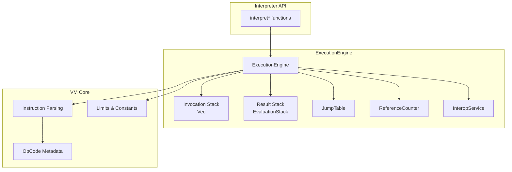
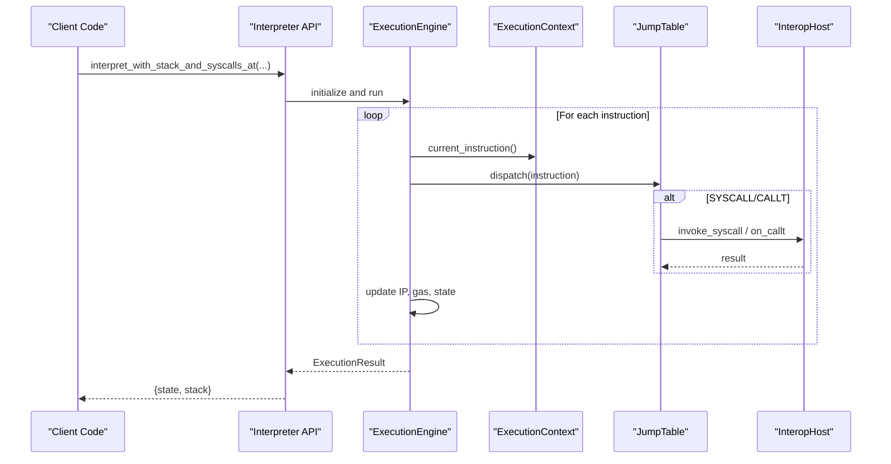
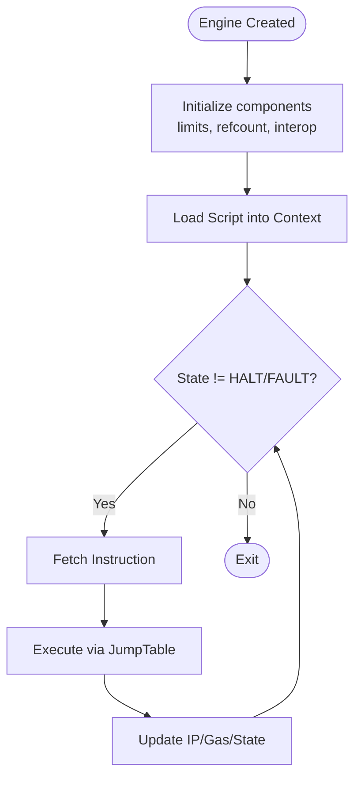
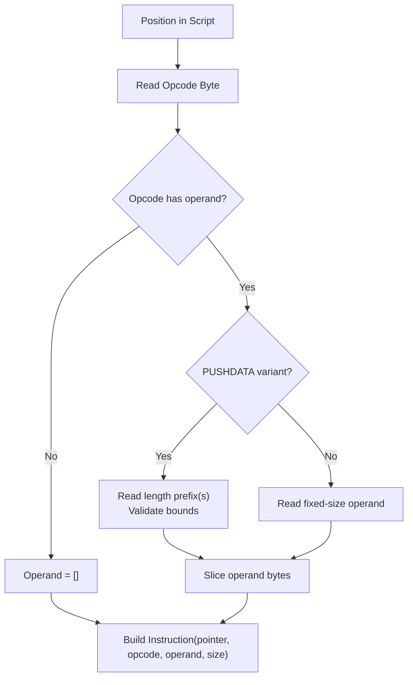
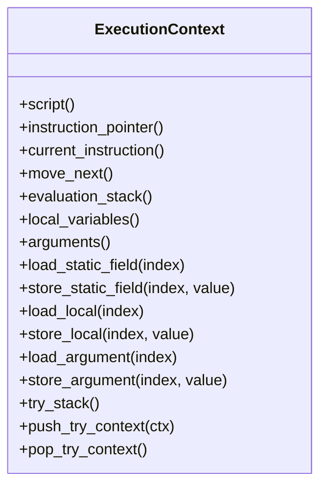
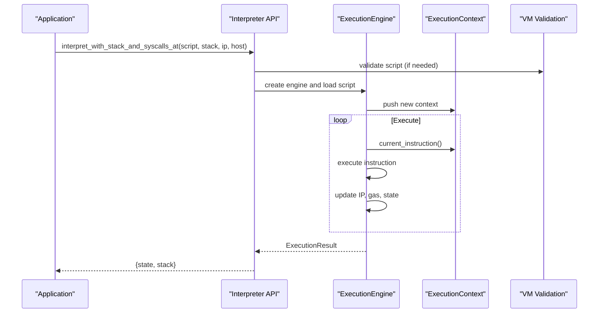
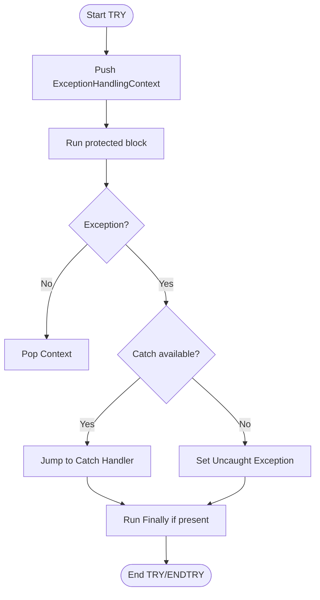
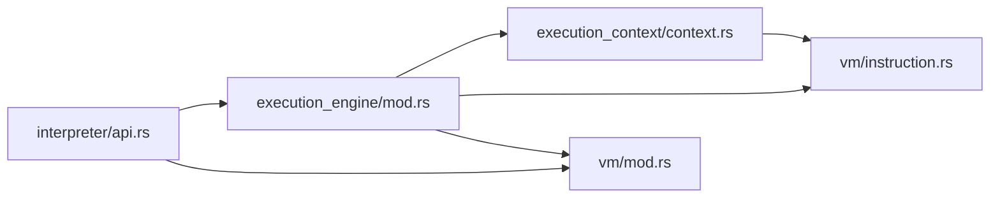

# Execution Engine

<cite>
**Referenced Files in This Document**
- [lib.rs](file://neo-vm/src/lib.rs)
- [execution_engine/mod.rs](file://neo-vm/src/execution_engine/mod.rs)
- [execution_engine/core.rs](file://neo-vm/src/execution_engine/core.rs)
- [interpreter/api.rs](file://neo-vm/src/interpreter/api.rs)
- [vm/instruction.rs](file://neo-vm/src/vm/instruction.rs)
- [vm/mod.rs](file://neo-vm/src/vm/mod.rs)
- [execution_context/context.rs](file://neo-vm/src/execution_context/context.rs)
</cite>

## Table of Contents
1. [Introduction](#introduction)
2. [Project Structure](#project-structure)
3. [Core Components](#core-components)
4. [Architecture Overview](#architecture-overview)
5. [Detailed Component Analysis](#detailed-component-analysis)
6. [Dependency Analysis](#dependency-analysis)
7. [Performance Considerations](#performance-considerations)
8. [Troubleshooting Guide](#troubleshooting-guide)
9. [Conclusion](#conclusion)
10. [Appendices](#appendices)

## Introduction
This document explains the Neo VM Execution Engine as implemented in the neo-vm crate. It covers the core execution loop, instruction fetching and decoding, execution context management (call stack, local variables, static fields), script loading and validation, exception handling with try-catch-finally, programmatic execution APIs, debugging hooks, and performance considerations for high-throughput contract execution.

## Project Structure
The execution engine is centered around a stateful ExecutionEngine that owns an invocation stack of ExecutionContexts, an evaluation stack, a jump table for opcode dispatch, and optional interop services. The interpreter layer exposes entry points to run scripts with or without syscalls, while the vm module provides shared bytecode metadata, instruction parsing, and limits.

**Diagram sources**
- [execution_engine/mod.rs:196-242](file://neo-vm/src/execution_engine/mod.rs#L196-L242)
- [interpreter/api.rs:9-149](file://neo-vm/src/interpreter/api.rs#L9-L149)
- [vm/instruction.rs:62-189](file://neo-vm/src/vm/instruction.rs#L62-L189)
- [vm/mod.rs:11-25](file://neo-vm/src/vm/mod.rs#L11-L25)

**Section sources**
- [lib.rs:142-218](file://neo-vm/src/lib.rs#L142-L218)
- [execution_engine/mod.rs:1-74](file://neo-vm/src/execution_engine/mod.rs#L1-L74)

## Core Components
- ExecutionEngine: Main runtime that manages state, gas, invocation stack, result stack, and dispatches instructions via JumpTable.
- ExecutionContext: Per-call frame holding instruction pointer, evaluation stack, locals, arguments, static fields, and try-stack for exceptions.
- Instruction: Parsed representation of a single opcode with operand bytes and size; supports typed operand accessors.
- Interpreter API: High-level interpret functions to run scripts with or without syscalls, supporting initial stacks, instruction pointers, initializer offsets, and result limits.
- Limits and Validation: Shared constants and helpers for script validation and bounds.

Key responsibilities:
- Fetch-decode-execute cycle per instruction.
- Manage call frames and return values.
- Track gas consumption and enforce limits.
- Provide host callbacks for syscalls and CALLT.
- Support try-catch-finally semantics.

**Section sources**
- [execution_engine/mod.rs:196-242](file://neo-vm/src/execution_engine/mod.rs#L196-L242)
- [execution_context/context.rs:25-45](file://neo-vm/src/execution_context/context.rs#L25-L45)
- [vm/instruction.rs:62-189](file://neo-vm/src/vm/instruction.rs#L62-L189)
- [interpreter/api.rs:9-149](file://neo-vm/src/interpreter/api.rs#L9-L149)

## Architecture Overview
The execution engine composes several layers:
- Host boundary: InteropHost callbacks invoked by the engine for lifecycle events and syscalls.
- ExecutionEngine: Orchestrates the main loop, maintains state transitions, and coordinates contexts.
- ExecutionContext: Encapsulates per-call state including IP, stacks, locals, args, static fields, and try-stack.
- Interpreter: Provides user-facing APIs to execute scripts with various options.
- VM Core: Opcode metadata, instruction parsing, and shared limits.

**Diagram sources**
- [interpreter/api.rs:68-149](file://neo-vm/src/interpreter/api.rs#L68-L149)
- [execution_engine/mod.rs:196-242](file://neo-vm/src/execution_engine/mod.rs#L196-L242)
- [execution_context/context.rs:101-128](file://neo-vm/src/execution_context/context.rs#L101-L128)

## Detailed Component Analysis

### ExecutionEngine: State and Lifecycle
- Construction initializes default limits, reference counter, interop service, empty invocation stack, and result stack.
- State machine transitions through VM states (e.g., BREAK, HALT, FAULT).
- Fault handling captures uncaught exceptions and records diagnostic info such as IP and opcode.
- Provides accessors for invocation stack, current/entry context, result stack, and uncaught exception.

**Diagram sources**
- [execution_engine/core.rs:11-45](file://neo-vm/src/execution_engine/core.rs#L11-L45)
- [execution_engine/core.rs:47-93](file://neo-vm/src/execution_engine/core.rs#L47-L93)

**Section sources**
- [execution_engine/core.rs:11-45](file://neo-vm/src/execution_engine/core.rs#L11-L45)
- [execution_engine/core.rs:47-93](file://neo-vm/src/execution_engine/core.rs#L47-L93)
- [execution_engine/mod.rs:196-242](file://neo-vm/src/execution_engine/mod.rs#L196-L242)

### Instruction Fetching and Decoding
- Instructions are parsed from script bytes at a given position.
- Supports variable-length operands (PUSHDATA1/2/4) and fixed-size operands based on opcode metadata.
- Provides typed operand readers (i8/u8/i16/u16/i32/u32/i64/u64) with error reporting for malformed operands.
- Caches instruction size to avoid recomputation.

**Diagram sources**
- [vm/instruction.rs:79-189](file://neo-vm/src/vm/instruction.rs#L79-L189)
- [vm/instruction.rs:304-390](file://neo-vm/src/vm/instruction.rs#L304-L390)

**Section sources**
- [vm/instruction.rs:62-189](file://neo-vm/src/vm/instruction.rs#L62-L189)
- [vm/instruction.rs:304-390](file://neo-vm/src/vm/instruction.rs#L304-L390)

### Execution Context Management
- Each ExecutionContext holds:
  - Instruction pointer and ability to move to next instruction.
  - Evaluation stack access (shared across clones for call frames).
  - Local variables and arguments stored in Slot containers.
  - Static fields storage with initialization checks.
  - Try-stack for nested exception handling contexts.
- Cloning semantics mirror C#: sharing script, evaluation stack, and static fields; resetting rvcount for calls.

**Diagram sources**
- [execution_context/context.rs:25-45](file://neo-vm/src/execution_context/context.rs#L25-L45)
- [execution_context/context.rs:88-128](file://neo-vm/src/execution_context/context.rs#L88-L128)
- [execution_context/context.rs:415-519](file://neo-vm/src/execution_context/context.rs#L415-L519)
- [execution_context/context.rs:232-279](file://neo-vm/src/execution_context/context.rs#L232-L279)

**Section sources**
- [execution_context/context.rs:25-45](file://neo-vm/src/execution_context/context.rs#L25-L45)
- [execution_context/context.rs:88-128](file://neo-vm/src/execution_context/context.rs#L88-L128)
- [execution_context/context.rs:415-519](file://neo-vm/src/execution_context/context.rs#L415-L519)
- [execution_context/context.rs:232-279](file://neo-vm/src/execution_context/context.rs#L232-L279)

### Script Loading, Validation, and Execution Flow
- Scripts are represented by Script objects and validated using shared utilities.
- Interpreter APIs accept raw script bytes and optional initial stacks/IPs.
- Execution flow:
  - Initialize engine and context.
  - Push context onto invocation stack.
  - Loop: fetch instruction, decode, execute via JumpTable, update IP/gas/state.
  - On completion, return ExecutionResult with final state and result stack.

**Diagram sources**
- [interpreter/api.rs:68-149](file://neo-vm/src/interpreter/api.rs#L68-L149)
- [vm/mod.rs:11-25](file://neo-vm/src/vm/mod.rs#L11-L25)

**Section sources**
- [interpreter/api.rs:68-149](file://neo-vm/src/interpreter/api.rs#L68-L149)
- [vm/mod.rs:11-25](file://neo-vm/src/vm/mod.rs#L11-L25)

### Exception Handling: Try-Catch-Finally
- ExecutionContext maintains a try-stack of ExceptionHandlingContext entries.
- Methods to push/pop try contexts and inspect the topmost context.
- Engine fault path sets uncaught exception and transitions to FAULT if not handled.
- Tests demonstrate catching exceptions raised by syscalls within TRY blocks.

**Diagram sources**
- [execution_context/context.rs:232-279](file://neo-vm/src/execution_context/context.rs#L232-L279)
- [execution_engine/core.rs:67-93](file://neo-vm/src/execution_engine/core.rs#L67-L93)
- [interpreter/api.rs:151-176](file://neo-vm/src/interpreter/api.rs#L151-L176)

**Section sources**
- [execution_context/context.rs:232-279](file://neo-vm/src/execution_context/context.rs#L232-L279)
- [execution_engine/core.rs:67-93](file://neo-vm/src/execution_engine/core.rs#L67-L93)
- [interpreter/api.rs:151-176](file://neo-vm/src/interpreter/api.rs#L151-L176)

### Programmatic VM Execution and Custom Contexts
- Use interpreter APIs to run scripts with custom initial stacks and instruction pointers.
- Optionally provide a SyscallProvider implementation to handle SYSCALL and CALLT.
- ExecutionEngine allows setting limits, call flags, and jump tables before execution.
- ExecutionContext supports cloning for call frames and managing locals/arguments/static fields.

Examples of usage patterns:
- Run a script without syscalls: interpret(script).
- Run with syscalls and initial stack: interpret_with_stack_and_syscalls(script, initial_stack, host).
- Start at specific IP: interpret_with_stack_and_syscalls_at(script, stack, ip, host).
- Enforce result stack limit: interpret_with_stack_and_syscalls_at_with_result_limit(...).
- Run initializer then main: interpret_with_stack_and_syscalls_at_with_initializer(...).

**Section sources**
- [interpreter/api.rs:9-149](file://neo-vm/src/interpreter/api.rs#L9-L149)
- [execution_engine/core.rs:11-45](file://neo-vm/src/execution_engine/core.rs#L11-L45)
- [execution_context/context.rs:355-398](file://neo-vm/src/execution_context/context.rs#L355-L398)

### Debugging Techniques
- Pre/post instruction hooks via InteropHost callbacks allow logging and inspection.
- Engine tracks instructions_executed and gas_consumed for profiling.
- Fault messages include IP, opcode, and evaluation stack depth to aid diagnosis.
- Breakpoints can be simulated by transitioning to BREAK state and pausing execution.

**Section sources**
- [execution_engine/mod.rs:135-185](file://neo-vm/src/execution_engine/mod.rs#L135-L185)
- [execution_engine/core.rs:67-93](file://neo-vm/src/execution_engine/core.rs#L67-L93)

## Dependency Analysis
High-level dependencies between modules:
- ExecutionEngine depends on ExecutionContext, EvaluationStack, JumpTable, ReferenceCounter, InteropService, and VM limits.
- Interpreter API depends on executor internals and SyscallProvider interface.
- Instruction parsing depends on OpCode metadata and FromOperand trait implementations.
- ExecutionContext depends on Script, ReferenceCounter, and ExceptionHandlingContext.

**Diagram sources**
- [interpreter/api.rs:1-16](file://neo-vm/src/interpreter/api.rs#L1-L16)
- [execution_engine/mod.rs:63-74](file://neo-vm/src/execution_engine/mod.rs#L63-L74)
- [execution_context/context.rs:1-18](file://neo-vm/src/execution_context/context.rs#L1-L18)
- [vm/mod.rs:1-25](file://neo-vm/src/vm/mod.rs#L1-L25)

**Section sources**
- [execution_engine/mod.rs:63-74](file://neo-vm/src/execution_engine/mod.rs#L63-L74)
- [interpreter/api.rs:1-16](file://neo-vm/src/interpreter/api.rs#L1-L16)
- [execution_context/context.rs:1-18](file://neo-vm/src/execution_context/context.rs#L1-L18)
- [vm/mod.rs:1-25](file://neo-vm/src/vm/mod.rs#L1-L25)

## Performance Considerations
- Gas metering: Engine tracks gas_consumed and enforces gas_limit to prevent resource exhaustion.
- Instruction caching: Instruction caches its size to avoid repeated calculations.
- Reference counting: Efficient memory management for compound stack items without GC pauses.
- Result stack limits: Optional caps on result stack size to bound memory usage during execution.
- Call flags: Restrict capabilities per execution to reduce overhead and risk.
- Reuse engines and contexts where possible to minimize allocations.

[No sources needed since this section provides general guidance]

## Troubleshooting Guide
Common issues and recovery strategies:
- Invalid opcode or out-of-bounds operand: Instruction parsing returns parse/operand errors; validate scripts before execution.
- Stack underflow or invalid operations: ExecutionContext methods return VmError; ensure proper argument/local initialization.
- Exceptions in syscalls: Use try-catch blocks; interpreter tests demonstrate catching syscall exceptions and continuing execution.
- Fault state: Engine sets uncaught_exception and transitions to FAULT; inspect engine state and logs for IP and opcode context.

**Section sources**
- [vm/instruction.rs:7-58](file://neo-vm/src/vm/instruction.rs#L7-L58)
- [execution_context/context.rs:101-128](file://neo-vm/src/execution_context/context.rs#L101-L128)
- [interpreter/api.rs:151-176](file://neo-vm/src/interpreter/api.rs#L151-L176)
- [execution_engine/core.rs:67-93](file://neo-vm/src/execution_engine/core.rs#L67-L93)

## Conclusion
The Neo VM Execution Engine provides a robust, efficient, and extensible runtime for smart contract execution. Its layered design separates concerns between host integration, execution orchestration, context management, and shared VM semantics. With comprehensive instruction parsing, precise gas metering, strong exception handling, and flexible APIs, it supports both simple scripting and complex contract workloads. Proper use of limits, call flags, and debugging hooks enables safe and performant execution in production environments.

[No sources needed since this section summarizes without analyzing specific files]

## Appendices

### Quick Start Patterns
- Minimal execution without syscalls:
  - Use interpret(script) to run a script and obtain ExecutionResult.
- Execution with syscalls:
  - Implement SyscallProvider and call interpret_with_stack_and_syscalls(script, initial_stack, host).
- Controlled execution:
  - Use interpret_with_stack_and_syscalls_at to start at a specific IP.
  - Apply result stack limits via interpret_with_stack_and_syscalls_at_with_result_limit.
  - Run initializer first via interpret_with_stack_and_syscalls_at_with_initializer.

**Section sources**
- [interpreter/api.rs:9-149](file://neo-vm/src/interpreter/api.rs#L9-L149)