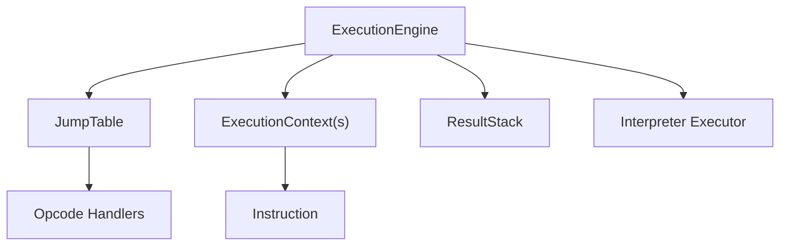
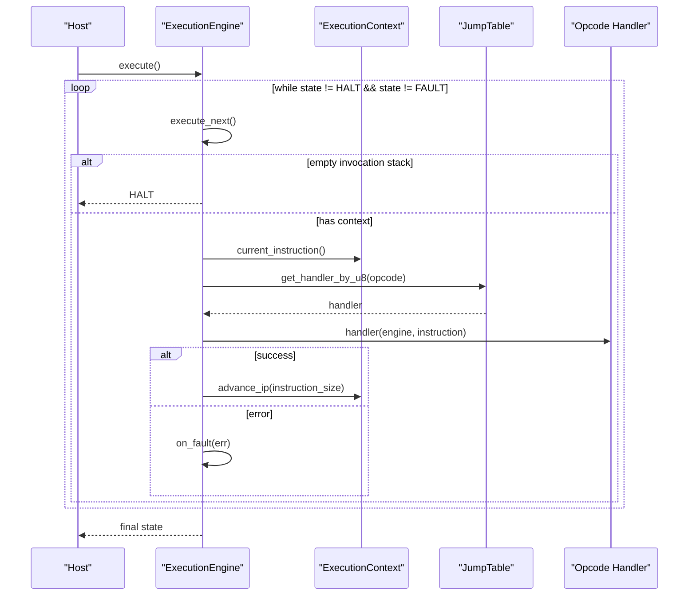
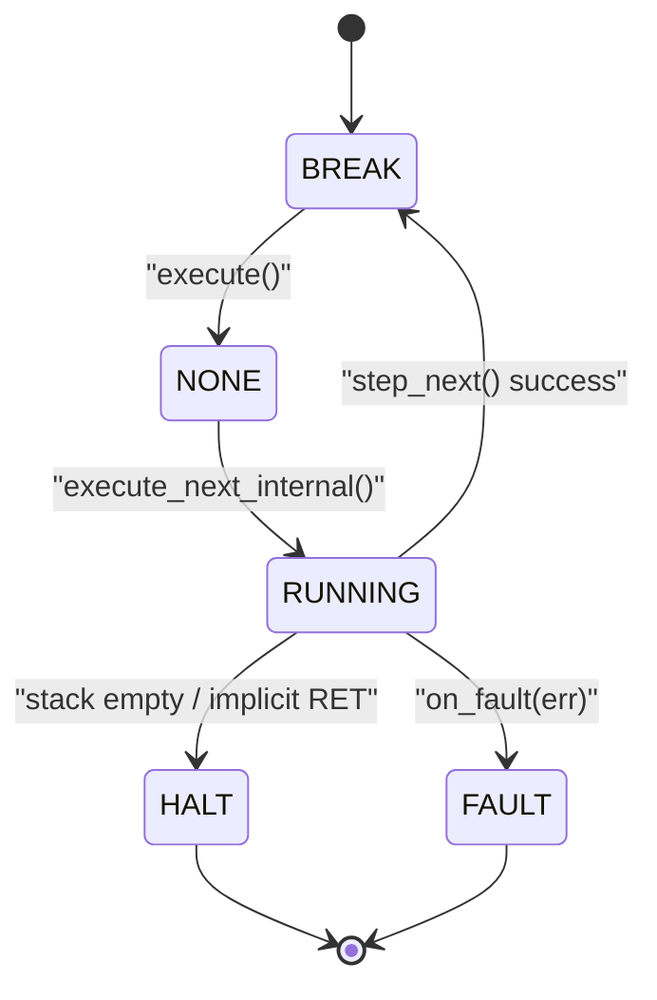
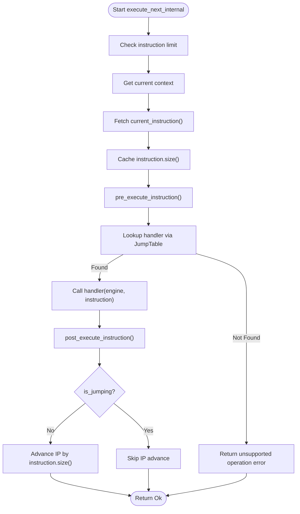
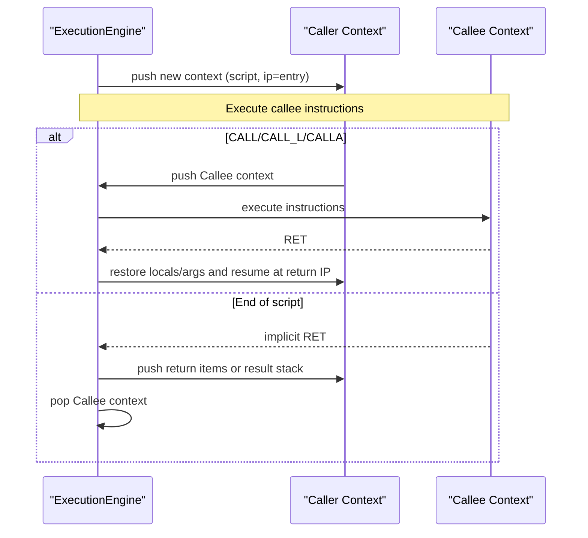
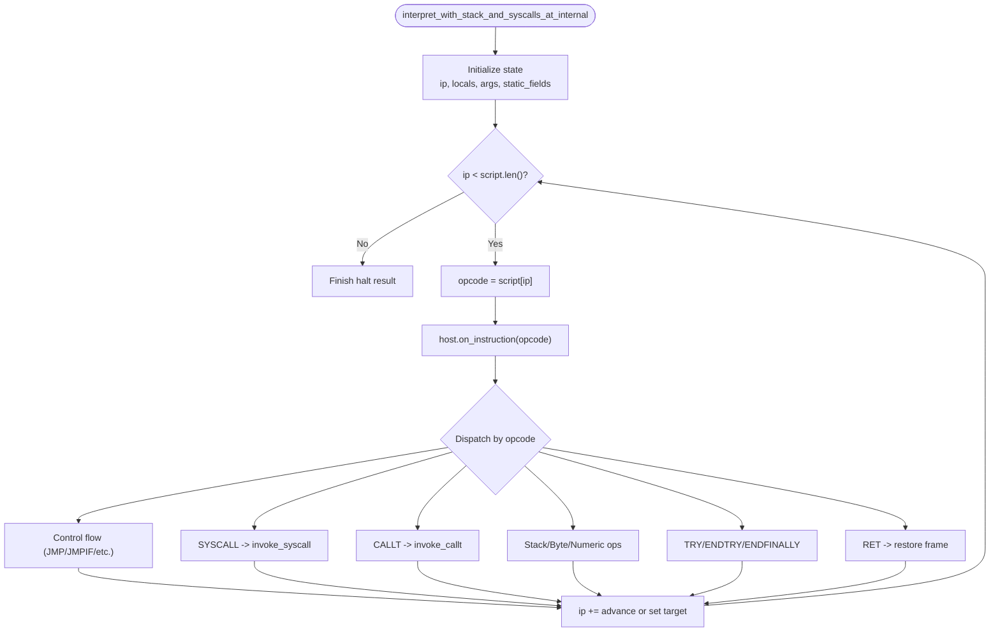
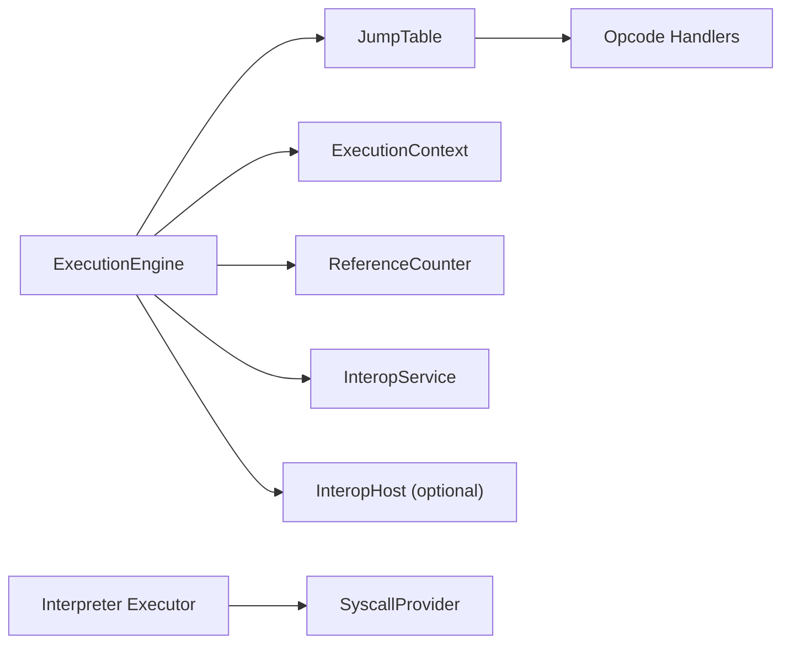

# Execution Loop

<cite>
**Referenced Files in This Document**
- [execution_engine/mod.rs](file://neo-vm/src/execution_engine/mod.rs)
- [execution_engine/core.rs](file://neo-vm/src/execution_engine/core.rs)
- [execution_engine/execution.rs](file://neo-vm/src/execution_engine/execution.rs)
- [jump_table/mod.rs](file://neo-vm/src/jump_table/mod.rs)
- [interpreter/executor/mod.rs](file://neo-vm/src/interpreter/executor/mod.rs)
- [vm/instruction.rs](file://neo-vm/src/vm/instruction.rs)
</cite>

## Table of Contents
1. [Introduction](#introduction)
2. [Project Structure](#project-structure)
3. [Core Components](#core-components)
4. [Architecture Overview](#architecture-overview)
5. [Detailed Component Analysis](#detailed-component-analysis)
6. [Dependency Analysis](#dependency-analysis)
7. [Performance Considerations](#performance-considerations)
8. [Troubleshooting Guide](#troubleshooting-guide)
9. [Conclusion](#conclusion)
10. [Appendices](#appendices)

## Introduction
This document explains the Neo VM execution loop with a focus on instruction fetching, decoding, and dispatch through the jump table; the engine’s state machine transitions (NONE → HALT/FAULT/BREAK); how the instruction pointer is managed across nested contexts; script loading into execution contexts; context switching for calls; and the end-to-end flow from script entry to completion. It also provides guidance for programmatic execution loops, custom control via stepping, and debugging techniques to trace instruction execution.

## Project Structure
The Neo VM execution loop spans several modules:
- ExecutionEngine owns the invocation stack, state, limits, gas accounting, and the main loop that drives execution.
- JumpTable maps opcodes to handlers and centralizes dispatch logic.
- Interpreter executor implements an alternative fast-path interpreter with its own loop and call/exception handling.
- Instruction parsing decodes bytecode into structured instructions used by the engine.

**Diagram sources**
- [execution_engine/mod.rs:196-242](file://neo-vm/src/execution_engine/mod.rs#L196-L242)
- [jump_table/mod.rs:34-44](file://neo-vm/src/jump_table/mod.rs#L34-L44)
- [vm/instruction.rs:62-72](file://neo-vm/src/vm/instruction.rs#L62-L72)
- [interpreter/executor/mod.rs:24-79](file://neo-vm/src/interpreter/executor/mod.rs#L24-L79)

**Section sources**
- [execution_engine/mod.rs:1-77](file://neo-vm/src/execution_engine/mod.rs#L1-L77)
- [interpreter/executor/mod.rs:1-16](file://neo-vm/src/interpreter/executor/mod.rs#L1-L16)

## Core Components
- ExecutionEngine: Holds VM state, invocation stack, result stack, limits, gas counters, and the main execute loop. Provides step_next for single-step debugging and execute for full runs.
- ExecutionContext: Represents one script frame with its own instruction pointer, evaluation stack, return value count, and script reference.
- JumpTable: Fixed-size array mapping each opcode byte to a handler function; supports default registration and runtime overrides.
- Instruction: Parsed representation of a single bytecode instruction including opcode, operand bytes, and cached size.

Key responsibilities:
- Fetch current instruction from the active context.
- Decode operands and compute instruction size.
- Dispatch to the appropriate handler via JumpTable.
- Advance or modify the instruction pointer based on control flow.
- Manage context pushes/pops for calls and returns.
- Enforce limits (instructions, stack depth, gas).

**Section sources**
- [execution_engine/mod.rs:196-242](file://neo-vm/src/execution_engine/mod.rs#L196-L242)
- [execution_engine/core.rs:11-45](file://neo-vm/src/execution_engine/core.rs#L11-L45)
- [jump_table/mod.rs:34-44](file://neo-vm/src/jump_table/mod.rs#L34-L44)
- [vm/instruction.rs:62-72](file://neo-vm/src/vm/instruction.rs#L62-L72)

## Architecture Overview
The Neo VM uses a classic fetch-decode-execute loop with a jump table for dispatch. The engine maintains an invocation stack of contexts. Each context holds a script and an instruction pointer. The loop continues until the VM reaches a terminal state (HALT or FAULT), or the invocation stack empties.

**Diagram sources**
- [execution_engine/execution.rs:10-23](file://neo-vm/src/execution_engine/execution.rs#L10-L23)
- [execution_engine/execution.rs:26-99](file://neo-vm/src/execution_engine/execution.rs#L26-L99)
- [execution_engine/execution.rs:134-197](file://neo-vm/src/execution_engine/execution.rs#L134-L197)
- [jump_table/mod.rs:107-140](file://neo-vm/src/jump_table/mod.rs#L107-L140)

## Detailed Component Analysis

### Main Execution Loop and State Machine
- Entry points:
  - execute(): Runs until HALT or FAULT, starting from BREAK resets to NONE before looping.
  - step_next(): Executes exactly one instruction and pauses at BREAK unless already in HALT/FAULT.
- State transitions:
  - Initial state set to BREAK during construction; execute() normalizes to NONE before the loop.
  - On fault: on_fault sets uncaught exception and transitions to FAULT.
  - On implicit RET at end of script: pops return values to caller or result stack; if no contexts remain, transitions to HALT.
  - Empty invocation stack at start of step_next leads directly to HALT.

**Diagram sources**
- [execution_engine/core.rs:11-45](file://neo-vm/src/execution_engine/core.rs#L11-L45)
- [execution_engine/execution.rs:10-23](file://neo-vm/src/execution_engine/execution.rs#L10-L23)
- [execution_engine/execution.rs:110-130](file://neo-vm/src/execution_engine/execution.rs#L110-L130)
- [execution_engine/execution.rs:134-197](file://neo-vm/src/execution_engine/execution.rs#L134-L197)

**Section sources**
- [execution_engine/core.rs:11-45](file://neo-vm/src/execution_engine/core.rs#L11-L45)
- [execution_engine/execution.rs:10-23](file://neo-vm/src/execution_engine/execution.rs#L10-L23)
- [execution_engine/execution.rs:110-130](file://neo-vm/src/execution_engine/execution.rs#L110-L130)

### Instruction Fetching, Decoding, and Dispatch
- Fetch:
  - Current context is retrieved from the invocation stack.
  - current_instruction() yields an Instruction with opcode and operand bytes.
- Decode:
  - Instruction.size() is computed and cached to avoid re-parsing.
  - Operand parsing is handled by Instruction::parse and helper methods.
- Dispatch:
  - JumpTable.get_handler_by_u8(opcode.byte()) returns the handler function pointer.
  - If no handler exists, unsupported operation error is returned.
- Post-execution:
  - If not jumping, the instruction pointer advances by instruction.size().
  - Host hooks pre/post execute can be invoked around handler execution.

**Diagram sources**
- [execution_engine/execution.rs:134-197](file://neo-vm/src/execution_engine/execution.rs#L134-L197)
- [jump_table/mod.rs:107-140](file://neo-vm/src/jump_table/mod.rs#L107-L140)
- [vm/instruction.rs:79-189](file://neo-vm/src/vm/instruction.rs#L79-L189)

**Section sources**
- [execution_engine/execution.rs:134-197](file://neo-vm/src/execution_engine/execution.rs#L134-L197)
- [vm/instruction.rs:79-189](file://neo-vm/src/vm/instruction.rs#L79-L189)
- [jump_table/mod.rs:107-140](file://neo-vm/src/jump_table/mod.rs#L107-L140)

### Context Switching and Nested Calls
- Invocation stack:
  - Each call pushes a new ExecutionContext onto the stack; returns pop it.
- Implicit return at end of script:
  - When the instruction pointer reaches the end of the script, return values are popped according to rvcount and pushed to the caller or result stack.
  - If no contexts remain, the engine transitions to HALT.
- Explicit calls:
  - CALL/CALL_L/CALLA push frames and adjust IP to target offsets.
  - RET restores previous frame state and resumes at the saved return IP.

**Diagram sources**
- [execution_engine/execution.rs:26-99](file://neo-vm/src/execution_engine/execution.rs#L26-L99)
- [interpreter/executor/mod.rs:444-479](file://neo-vm/src/interpreter/executor/mod.rs#L444-L479)
- [interpreter/executor/mod.rs:647-699](file://neo-vm/src/interpreter/executor/mod.rs#L647-L699)

**Section sources**
- [execution_engine/execution.rs:26-99](file://neo-vm/src/execution_engine/execution.rs#L26-L99)
- [interpreter/executor/mod.rs:444-479](file://neo-vm/src/interpreter/executor/mod.rs#L444-L479)
- [interpreter/executor/mod.rs:647-699](file://neo-vm/src/interpreter/executor/mod.rs#L647-L699)

### Script Loading into Execution Contexts
- Scripts are loaded into ExecutionContext instances which hold:
  - The script bytes.
  - The current instruction pointer.
  - Evaluation stack and auxiliary stacks.
  - Return value count (rvcount) controlling implicit return behavior.
- The engine creates and manages these contexts when invoking scripts or calling functions.

Note: The exact API for creating contexts is encapsulated within execution engine internals; the key point is that each context represents a distinct execution scope with its own IP and stacks.

**Section sources**
- [execution_engine/mod.rs:196-242](file://neo-vm/src/execution_engine/mod.rs#L196-L242)
- [execution_engine/execution.rs:26-99](file://neo-vm/src/execution_engine/execution.rs#L26-L99)

### Alternative Fast Path Interpreter
- The interpreter module provides a direct loop over raw script bytes with inline dispatch for performance-critical paths.
- It maintains local state such as try frames, call stack, and pending exceptions, enabling efficient control flow and exception handling without per-instruction object allocations.
- SYSCALL and CALLT integrate with host-provided syscalls and token-based calls.

**Diagram sources**
- [interpreter/executor/mod.rs:24-79](file://neo-vm/src/interpreter/executor/mod.rs#L24-L79)
- [interpreter/executor/mod.rs:149-158](file://neo-vm/src/interpreter/executor/mod.rs#L149-L158)
- [interpreter/executor/mod.rs:258-314](file://neo-vm/src/interpreter/executor/mod.rs#L258-L314)
- [interpreter/executor/mod.rs:444-479](file://neo-vm/src/interpreter/executor/mod.rs#L444-L479)
- [interpreter/executor/mod.rs:647-699](file://neo-vm/src/interpreter/executor/mod.rs#L647-L699)

**Section sources**
- [interpreter/executor/mod.rs:24-79](file://neo-vm/src/interpreter/executor/mod.rs#L24-L79)
- [interpreter/executor/mod.rs:149-158](file://neo-vm/src/interpreter/executor/mod.rs#L149-L158)
- [interpreter/executor/mod.rs:258-314](file://neo-vm/src/interpreter/executor/mod.rs#L258-L314)
- [interpreter/executor/mod.rs:444-479](file://neo-vm/src/interpreter/executor/mod.rs#L444-L479)
- [interpreter/executor/mod.rs:647-699](file://neo-vm/src/interpreter/executor/mod.rs#L647-L699)

## Dependency Analysis
- ExecutionEngine depends on:
  - JumpTable for opcode dispatch.
  - ExecutionContext for per-script state.
  - ReferenceCounter for GC and stack item lifecycle.
  - InteropService and optional InteropHost for syscalls and hooks.
- JumpTable depends on:
  - Opcode definitions and handler implementations grouped by category (control, numeric, stack, etc.).
- Interpreter executor depends on:
  - Host callbacks for syscalls and instruction tracing.
  - Local data structures for call stack and try frames.

**Diagram sources**
- [execution_engine/mod.rs:196-242](file://neo-vm/src/execution_engine/mod.rs#L196-L242)
- [jump_table/mod.rs:155-182](file://neo-vm/src/jump_table/mod.rs#L155-L182)
- [interpreter/executor/mod.rs:24-79](file://neo-vm/src/interpreter/executor/mod.rs#L24-L79)

**Section sources**
- [execution_engine/mod.rs:196-242](file://neo-vm/src/execution_engine/mod.rs#L196-L242)
- [jump_table/mod.rs:155-182](file://neo-vm/src/jump_table/mod.rs#L155-L182)
- [interpreter/executor/mod.rs:24-79](file://neo-vm/src/interpreter/executor/mod.rs#L24-L79)

## Performance Considerations
- Direct array access for dispatch:
  - JumpTable.get_handler_by_u8 uses unchecked indexing for speed in the hot path.
- Instruction caching:
  - Instruction.size() is cached to avoid repeated operand length calculations.
- Two-phase stack overflow detection:
  - Post-execution checks perform thorough GC when near limits to prevent malicious exploitation.
- Gas and instruction limits:
  - Instructions executed counter prevents infinite loops; gas consumed vs gas_limit enforces resource bounds.

[No sources needed since this section provides general guidance]

## Troubleshooting Guide
- Fault handling:
  - on_fault captures uncaught exceptions and transitions to FAULT; includes IP and opcode context in debug builds.
  - handle_exception sets FAULT if an uncaught exception exists.
- Step-by-step debugging:
  - step_next executes one instruction and pauses at BREAK for inspection.
  - Host hooks pre/post execute allow tracing each instruction.
- Common issues:
  - Unsupported opcode errors indicate missing or invalid handlers.
  - Instruction limit exceeded indicates runaway scripts; verify limits and script complexity.
  - Stack overflow triggers post-execution checks; review script logic and recursion depth.

**Section sources**
- [execution_engine/core.rs:67-93](file://neo-vm/src/execution_engine/core.rs#L67-L93)
- [execution_engine/core.rs:182-192](file://neo-vm/src/execution_engine/core.rs#L182-L192)
- [execution_engine/execution.rs:110-130](file://neo-vm/src/execution_engine/execution.rs#L110-L130)
- [execution_engine/execution.rs:134-197](file://neo-vm/src/execution_engine/execution.rs#L134-L197)

## Conclusion
The Neo VM execution loop centers on a robust fetch-decode-dispatch cycle orchestrated by ExecutionEngine, with JumpTable providing efficient opcode routing. The state machine ensures clear transitions between NONE, BREAK, HALT, and FAULT, while context management enables nested calls and proper return handling. For advanced use cases, the interpreter executor offers a high-performance alternative with integrated control flow and exception handling. Programmatic control via step_next and host hooks facilitates debugging and custom execution strategies.

[No sources needed since this section summarizes without analyzing specific files]

## Appendices

### Programmatic Execution Loops and Custom Control
- Full run:
  - Use execute() to run until HALT or FAULT.
- Single-step:
  - Use step_next() to execute one instruction and inspect state at BREAK.
- Custom hooks:
  - Implement InteropHost callbacks to intercept pre/post instruction execution and syscalls.

**Section sources**
- [execution_engine/execution.rs:10-23](file://neo-vm/src/execution_engine/execution.rs#L10-L23)
- [execution_engine/execution.rs:110-130](file://neo-vm/src/execution_engine/execution.rs#L110-L130)
- [execution_engine/mod.rs:135-185](file://neo-vm/src/execution_engine/mod.rs#L135-L185)

### Debugging Techniques for Tracing Instruction Execution
- Enable host hooks:
  - pre_execute_instruction and post_execute_instruction to log each opcode and IP.
- Inspect state:
  - Read current context’s instruction pointer and evaluation stack length.
  - Check instructions_executed and gas_consumed for resource usage.
- Step-through:
  - Use step_next() in a loop to manually drive execution and observe state changes.

**Section sources**
- [execution_engine/mod.rs:135-185](file://neo-vm/src/execution_engine/mod.rs#L135-L185)
- [execution_engine/execution.rs:134-197](file://neo-vm/src/execution_engine/execution.rs#L134-L197)