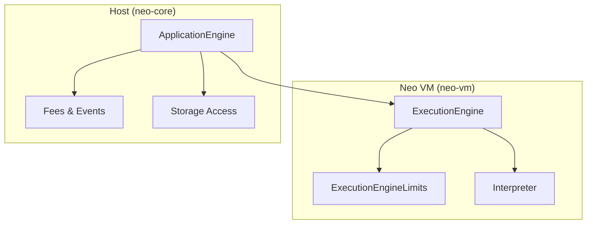
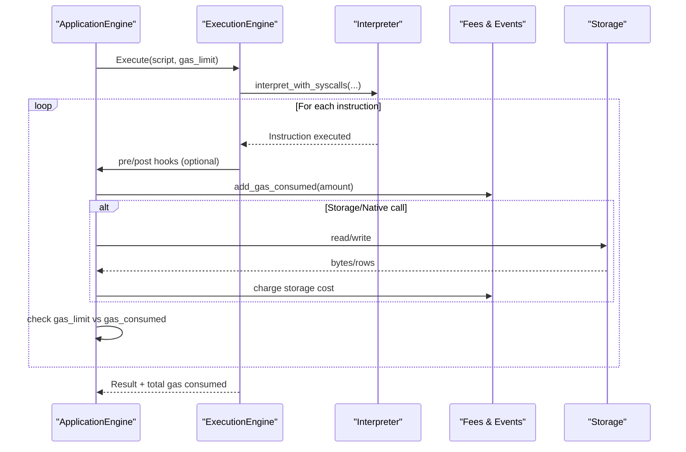
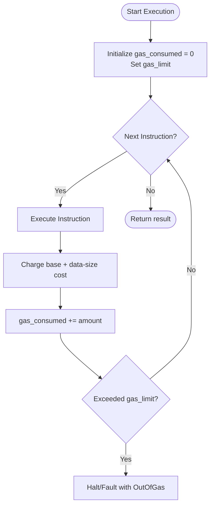
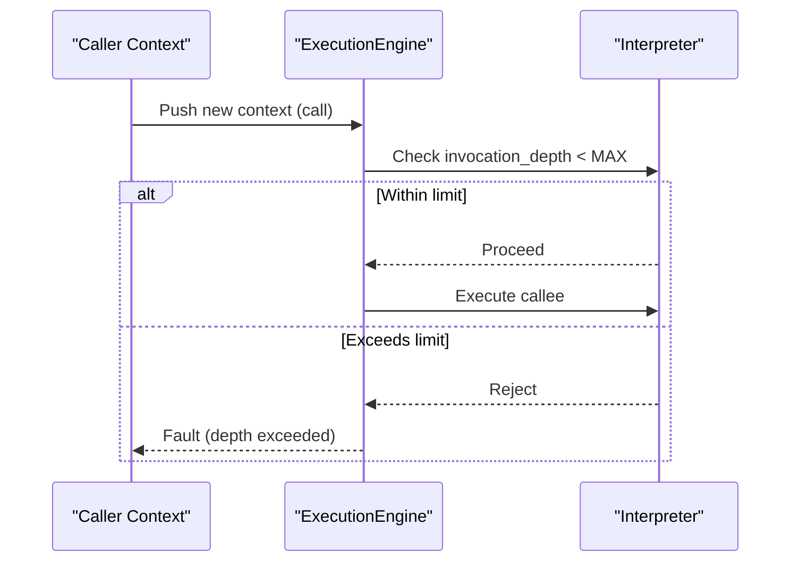
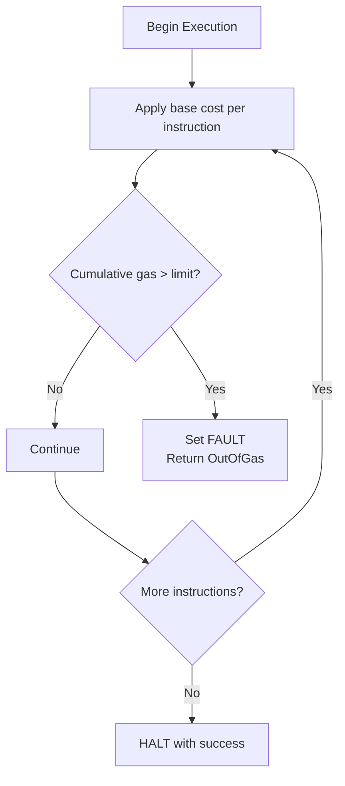
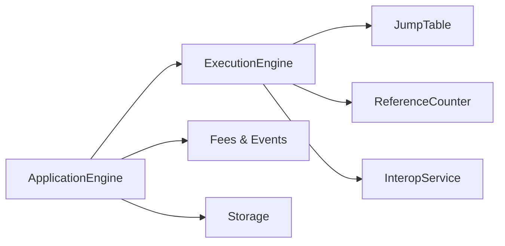

# Gas Metering and Resource Limits

<cite>
**Referenced Files in This Document**
- [lib.rs](file://neo-vm/src/lib.rs)
- [mod.rs](file://neo-vm/src/execution_engine/mod.rs)
- [core.rs](file://neo-vm/src/execution_engine/core.rs)
- [limits.rs](file://neo-vm/src/vm/limits.rs)
- [interpreter.rs](file://neo-vm/src/interpreter/mod.rs)
- [execution.rs](file://neo-vm/src/execution_engine/execution.rs)
- [interop.rs](file://neo-vm/src/execution_engine/interop.rs)
- [stack.rs](file://neo-vm/src/execution_engine/stack.rs)
- [control_flow.rs](file://neo-vm/src/execution_engine/control_flow.rs)
- [exception.rs](file://neo-vm/src/execution_engine/exception.rs)
- [mod.rs](file://neo-core/src/smart_contract/application_engine/mod.rs)
- [fees_events_native.rs](file://neo-core/src/smart_contract/application_engine/fees_events_native.rs)
- [load_execute_storage.rs](file://neo-core/src/smart_contract/application_engine/load_execute_storage.rs)
</cite>

## Table of Contents
1. [Introduction](#introduction)
2. [Project Structure](#project-structure)
3. [Core Components](#core-components)
4. [Architecture Overview](#architecture-overview)
5. [Detailed Component Analysis](#detailed-component-analysis)
6. [Dependency Analysis](#dependency-analysis)
7. [Performance Considerations](#performance-considerations)
8. [Troubleshooting Guide](#troubleshooting-guide)
9. [Conclusion](#conclusion)

## Introduction
This document explains the Neo VM gas metering system and resource limits as implemented in neo-vm and integrated by neo-core’s ApplicationEngine. It covers:
- The gas model, including base costs for operations and dynamic costs based on data sizes
- How gas is tracked and enforced during execution
- Resource limits such as maximum stack depth, invocation depth, script size, and memory constraints
- Techniques to estimate gas, optimize smart contracts, and debug out-of-gas issues
- Enforcement boundaries and error handling when limits are exceeded

## Project Structure
The gas metering and limits span two layers:
- neo-vm: Core VM runtime that tracks instructions executed, provides default gas limit, and exposes limits and interpreter hooks
- neo-core ApplicationEngine: Host layer that enforces per-transaction/script gas budgets, accumulates fees, and integrates storage/native call costs

**Diagram sources**
- [mod.rs:196-242](file://neo-vm/src/execution_engine/mod.rs#L196-L242)
- [limits.rs](file://neo-vm/src/vm/limits.rs)
- [interpreter.rs](file://neo-vm/src/interpreter/mod.rs)
- [mod.rs](file://neo-core/src/smart_contract/application_engine/mod.rs)
- [fees_events_native.rs](file://neo-core/src/smart_contract/application_engine/fees_events_native.rs)
- [load_execute_storage.rs](file://neo-core/src/smart_contract/application_engine/load_execute_storage.rs)

**Section sources**
- [lib.rs:109-122](file://neo-vm/src/lib.rs#L109-L122)
- [mod.rs:196-242](file://neo-vm/src/execution_engine/mod.rs#L196-L242)

## Core Components
- ExecutionEngine: Holds execution state, invocation stack, instruction counter, gas consumed, and gas limit; provides access to limits and jump table
- ExecutionEngineLimits: Encapsulates hard limits like max stack depth, max invocation depth, max item size, and max script size
- Interpreter: Executes instructions and can be invoked with result limits and syscalls
- ApplicationEngine (host): Enforces transaction-level gas budget, accumulates gas consumption, and coordinates storage/native costs

Key fields and defaults:
- Default gas limit constant for a single execution context
- Gas consumed accumulator and instruction counter
- Limits object for resource caps

**Section sources**
- [mod.rs:188-242](file://neo-vm/src/execution_engine/mod.rs#L188-L242)
- [core.rs:11-45](file://neo-vm/src/execution_engine/core.rs#L11-L45)
- [lib.rs:268-273](file://neo-vm/src/lib.rs#L268-L273)

## Architecture Overview
Gas metering flows from host to VM and back:
- Host sets a gas budget and invokes the VM
- VM executes instructions, increments an internal instruction counter, and reports gas usage via host callbacks or explicit accounting
- Host enforces per-operation and cumulative gas checks against its own budget
- Storage and native calls incur additional gas charges managed by the host

**Diagram sources**
- [interpreter.rs](file://neo-vm/src/interpreter/mod.rs)
- [execution.rs](file://neo-vm/src/execution_engine/execution.rs)
- [interop.rs](file://neo-vm/src/execution_engine/interop.rs)
- [fees_events_native.rs](file://neo-core/src/smart_contract/application_engine/fees_events_native.rs)
- [load_execute_storage.rs](file://neo-core/src/smart_contract/application_engine/load_execute_storage.rs)

## Detailed Component Analysis

### Gas Model and Base Costs
- The VM documents a baseline model where simple opcodes have small fixed costs, while data-heavy operations scale with input size
- CALL and SYSCALL carry higher base costs compared to arithmetic/logic opcodes
- Storage operations are significantly more expensive due to I/O overhead

These base costs guide contract authors to minimize heavy loops, large data pushes, and excessive storage writes.

**Section sources**
- [lib.rs:109-122](file://neo-vm/src/lib.rs#L109-L122)

### Dynamic Gas Calculation Based on Data Sizes
- Operations that process variable-length data (e.g., pushing byte arrays, string handling, buffer operations) typically charge proportionally to the number of bytes processed
- Storage reads/writes often charge per key length and value size, plus per-byte costs for serialization/deserialization
- Native calls may charge based on argument sizes and returned data sizes

Contract writers should prefer compact encodings, avoid unnecessary copies, and batch operations when possible.

**Section sources**
- [lib.rs:109-122](file://neo-vm/src/lib.rs#L109-L122)

### Gas Consumption Tracking
- ExecutionEngine maintains an instruction counter and a gas consumed field
- The host layer (ApplicationEngine) aggregates gas across all phases (verification, invocation, storage, native calls) and enforces the global budget
- Fees events record cumulative gas used and trigger checks against configured limits

**Diagram sources**
- [mod.rs:234-242](file://neo-vm/src/execution_engine/mod.rs#L234-L242)
- [fees_events_native.rs](file://neo-core/src/smart_contract/application_engine/fees_events_native.rs)
- [load_execute_storage.rs](file://neo-core/src/smart_contract/application_engine/load_execute_storage.rs)

**Section sources**
- [mod.rs:234-242](file://neo-vm/src/execution_engine/mod.rs#L234-L242)
- [fees_events_native.rs](file://neo-core/src/smart_contract/application_engine/fees_events_native.rs)
- [load_execute_storage.rs](file://neo-core/src/smart_contract/application_engine/load_execute_storage.rs)

### Resource Limits
- Maximum stack depth: Prevents deep recursion and stack overflows
- Invocation depth: Limits nested calls to mitigate DoS and ensure bounded execution
- Script size: Caps bytecode size to prevent oversized scripts
- Item size: Caps individual stack items to bound memory usage

These limits are exposed through ExecutionEngineLimits and enforced at appropriate points in the interpreter and host.

**Section sources**
- [lib.rs:268-273](file://neo-vm/src/lib.rs#L268-L273)
- [limits.rs](file://neo-vm/src/vm/limits.rs)

### Stack Depth and Invocation Depth Enforcement
- The interpreter validates stack depth before operations that push/pop values
- Invocation depth is checked before entering new contexts to enforce call nesting limits
- Violations transition the VM into a fault state and stop further execution

**Diagram sources**
- [control_flow.rs](file://neo-vm/src/execution_engine/control_flow.rs)
- [stack.rs](file://neo-vm/src/execution_engine/stack.rs)
- [exception.rs](file://neo-vm/src/execution_engine/exception.rs)

**Section sources**
- [control_flow.rs](file://neo-vm/src/execution_engine/control_flow.rs)
- [stack.rs](file://neo-vm/src/execution_engine/stack.rs)
- [exception.rs](file://neo-vm/src/execution_engine/exception.rs)

### Memory Constraints and Item Size Limits
- Individual stack items cannot exceed a maximum size to protect memory
- Buffer and ByteString operations validate lengths before allocation
- Large data should be streamed or chunked rather than loaded entirely into memory

**Section sources**
- [lib.rs:268-273](file://neo-vm/src/lib.rs#L268-L273)
- [limits.rs](file://neo-vm/src/vm/limits.rs)

### Gas Estimation Techniques
- Use dry-run execution with a generous gas limit to measure actual consumption
- Instrument contracts to log intermediate sizes and operation counts
- Profile storage-heavy paths and native calls separately to identify hotspots
- Compare estimated vs actual gas to refine budgets and detect regressions

[No sources needed since this section provides general guidance]

### Cost Optimization Strategies for Smart Contracts
- Minimize PUSH of large byte arrays; prefer references or smaller payloads
- Reduce storage writes; batch updates and use efficient keys/values
- Avoid deep recursion; refactor into iterative patterns
- Reuse computed values and avoid redundant calculations
- Prefer native methods optimized for bulk operations when available

[No sources needed since this section provides general guidance]

### Common Anti-Patterns Leading to Excessive Gas Usage
- Unbounded loops over untrusted inputs
- Repeatedly copying large buffers
- Excessive logging/events with large payloads
- Deep call chains without proper bounds
- Storing large blobs directly in contract storage

[No sources needed since this section provides general guidance]

### Gas Limit Enforcement and Out-of-Gas Handling
- The host enforces a per-transaction/script gas budget and rejects execution if exceeded
- VM-level checks increment counters and halt when limits are breached
- Errors surface as faults with clear messages indicating the cause (e.g., out of gas, depth exceeded)

**Diagram sources**
- [mod.rs:234-242](file://neo-vm/src/execution_engine/mod.rs#L234-L242)
- [fees_events_native.rs](file://neo-core/src/smart_contract/application_engine/fees_events_native.rs)
- [load_execute_storage.rs](file://neo-core/src/smart_contract/application_engine/load_execute_storage.rs)

**Section sources**
- [mod.rs:234-242](file://neo-vm/src/execution_engine/mod.rs#L234-L242)
- [fees_events_native.rs](file://neo-core/src/smart_contract/application_engine/fees_events_native.rs)
- [load_execute_storage.rs](file://neo-core/src/smart_contract/application_engine/load_execute_storage.rs)

## Dependency Analysis
- ExecutionEngine depends on:
  - JumpTable for opcode dispatch
  - ReferenceCounter for GC of compound items
  - InteropService for syscall routing
  - ExecutionContext for per-call frames
- ApplicationEngine depends on:
  - ExecutionEngine to run scripts
  - Fees module to aggregate gas and emit events
  - Storage layer to persist data and charge accordingly

**Diagram sources**
- [mod.rs:196-242](file://neo-vm/src/execution_engine/mod.rs#L196-L242)
- [mod.rs](file://neo-core/src/smart_contract/application_engine/mod.rs)
- [fees_events_native.rs](file://neo-core/src/smart_contract/application_engine/fees_events_native.rs)
- [load_execute_storage.rs](file://neo-core/src/smart_contract/application_engine/load_execute_storage.rs)

**Section sources**
- [mod.rs:196-242](file://neo-vm/src/execution_engine/mod.rs#L196-L242)
- [mod.rs](file://neo-core/src/smart_contract/application_engine/mod.rs)

## Performance Considerations
- Prefer compact data representations to reduce per-byte costs
- Batch storage operations to amortize fixed overhead
- Avoid unnecessary allocations and copies
- Tune gas limits per operation type to balance throughput and security
- Monitor gas usage trends to detect regressions early

[No sources needed since this section provides general guidance]

## Troubleshooting Guide
Common symptoms and diagnostics:
- Out-of-gas errors: Verify gas budget, inspect per-operation costs, and profile hot paths
- Depth exceeded: Reduce recursion depth or restructure logic iteratively
- Memory pressure: Cap item sizes, stream large data, and avoid holding large buffers
- Inconsistent gas between environments: Ensure identical protocol settings and limits

Useful steps:
- Run with verbose logging to capture instruction counts and gas deltas
- Isolate failing segments by splitting transactions into smaller units
- Compare against known-good baselines to pinpoint changes

**Section sources**
- [exception.rs](file://neo-vm/src/execution_engine/exception.rs)
- [fees_events_native.rs](file://neo-core/src/smart_contract/application_engine/fees_events_native.rs)
- [load_execute_storage.rs](file://neo-core/src/smart_contract/application_engine/load_execute_storage.rs)

## Conclusion
The Neo VM gas metering system combines precise per-instruction accounting with host-enforced budgets to ensure predictable and secure execution. By understanding base and dynamic costs, leveraging resource limits, and applying optimization strategies, developers can write efficient, robust smart contracts while avoiding common pitfalls that lead to excessive gas usage or failures.